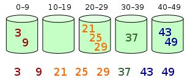
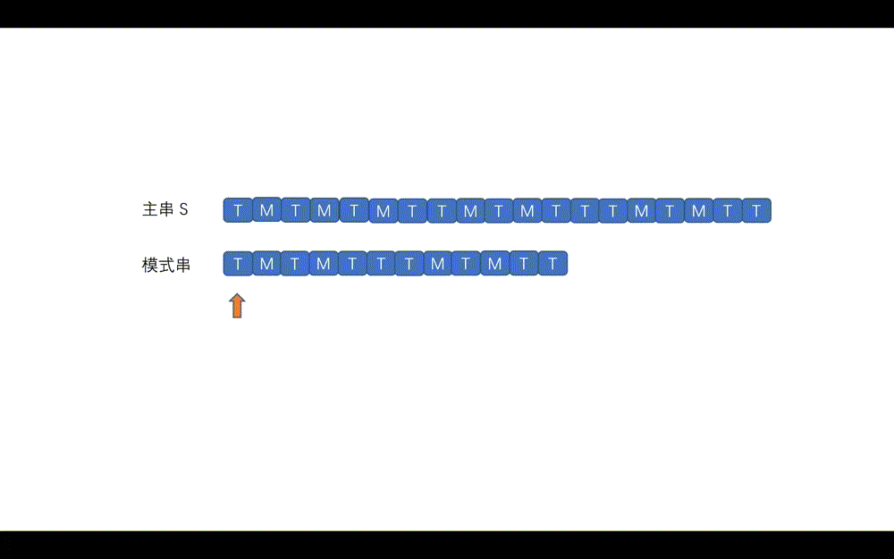

算法：一个有穷的指令集，这些指令为解决某一特定任务规定了一个运算序列

特性：

- 输入  有0个或多个输入
- 输出  有一个或多个输出(处理结果)
- 确定性  每步定义都是确切、无歧义的
- 有穷性  算法应在执行有穷步后结束
- 有效性  每一条运算应足够基本


# 算法的复杂度
[Big O Cheat Sheet](http://bigocheatsheet.com/)

**时间复杂度**

- 用来衡量算法随着问题规模增大，算法执行时间增长的快慢；
- 大 O 表示法 T(n)=O(f(n)) f(n)，一般考虑最坏情况下的时间复杂度


**空间复杂度**

- 用来衡量算法随着问题规模增大，算法所需空间的快慢；
- 问题规模的函数 S(n)=O(g(n)) 


# Sort

排序算法（Sorting algorithm）：一种能将一串资料依照特定排序方式进行排列的一种算法  <br />  稳定性：相等的元素经过排序之后相对顺序是否发生了改变。


## 冒泡排序
Bubble sort：每次检查相邻两个元素，如果前面的元素与后面的元素满足给定的排序条件，就将相邻两个元素交换。当没有相邻的元素需要交换时，排序就完成了。


  <br />  向上冒泡
```c
void Bubble(int a[], int n)
{
    int flag, i = 0;
    do
    {
        flag = 0;
        for (int j = 1; j < n - i; ++j)
        {
            if (a[j] < a[j - 1])
                swap(a[j], a[j - 1]), flag = 1;
        }
        ++i;
    } while (i < n && flag);
        
}
```
双向冒泡
```c
void Bubble(int a[], int n)
{
    int low = -1, high = n, i;
    while (low < high)
    {
        for (i = ++low; i + 1 < high; ++i)
        {
            if (a[i] > a[i + 1])
                swap(a[i], a[i + 1]);
        }
        for (i = --high; i > low; --i)
        {
            if (a[i] < a[i - 1])
                swap(a[i], a[i - 1]);
        }
    }
}
```


## 选择排序
Selection sort：首先在未排序序列中找到最小（大）元素，存放到排序序列的起始位置，然后，再从剩余未排序元素中继续寻找最小（大）元素，放到已排序序列的末尾。以此类推，直到所有元素均排序完毕。


```c
void selection_sort(int a[], int len) 
{
    int i,j,temp;

	for (i = 0 ; i < len - 1 ; i++) 
    {
		int min = i;
		for (j = i + 1; j < len; j++)     //走访未排序的元素
		{
			if (a[j] < a[min])    //找到目前最小值
			{
				min = j;    //记录最小值
			}
		}
		if(min != i)
		{
		  temp=a[min];  //做交换
		  a[min]=a[i];
		  a[i]=temp;
		}
	}
}
```


## 插入排序
Insert sort：将待排列元素划分为“已排序”和“未排序”两部分，每次从“未排序的”元素中选择一个插入到“已排序的”元素中的正确位置。  <br />  
```c
void InsertionSort( ElementType A[], int N )
{ /* 插入排序 */
     int P, i;
     ElementType Tmp;
      
     for ( P=1; P<N; P++ ) {
         Tmp = A[P]; /* 取出未排序序列中的第一个元素*/
         for ( i=P; i>0 && A[i-1]>Tmp; i-- )
             A[i] = A[i-1]; /*依次与已排序序列中元素比较并右移*/
         A[i] = Tmp; /* 放进合适的位置 */
     }
}
```


## 计数排序
**Counting sort：**使用一个额外的数组`C`，其中第`i`个元素是待排序数组`A`中值等于`i`的元素的个数。然后根据数组`C`来将`A`中的元素排到正确的位置。  <br />  
```c
void counting_sort(int *ini_arr, int *sorted_arr, int n) {
	int *count_arr = (int *) malloc(sizeof(int) * 100);
	int i, j, k;
	for (k = 0; k < 100; k++)
		count_arr[k] = 0;
	for (i = 0; i < n; i++)
		count_arr[ini_arr[i]]++;
	for (k = 1; k < 100; k++)
		count_arr[k] += count_arr[k - 1];
	for (j = n; j > 0; j--)
		sorted_arr[--count_arr[ini_arr[j - 1]]] = ini_arr[j - 1];
	free(count_arr);
}
```


## 希尔排序
Shellsort：也称递减增量排序算法，是插入排序的一种更高效的改进版本

步骤

1. 将待排序序列分为若干子序列（每个子序列的元素在原始数组中间距相同）；
2. 对这些子序列进行插入排序；
3. 减小每个子序列中元素之间的间距，重复上述过程直至间距减少为 1。


```c
void ShellSort( ElementType A[], int N )
{ /* 希尔排序 - 用Sedgewick增量序列 */
     int Si, D, P, i;
     ElementType Tmp;
     /* 这里只列出一小部分增量 */
     int Sedgewick[] = {929, 505, 209, 109, 41, 19, 5, 1, 0};
      
     for ( Si=0; Sedgewick[Si]>=N; Si++ ) 
         ; /* 初始的增量Sedgewick[Si]不能超过待排序列长度 */
 
     for ( D=Sedgewick[Si]; D>0; D=Sedgewick[++Si] )
         for ( P=D; P<N; P++ ) { /* 插入排序*/
             Tmp = A[P];
             for ( i=P; i>=D && A[i-D]>Tmp; i-=D )
                 A[i] = A[i-D];
             A[i] = Tmp;
         }
}
```

## 堆排序

Heapsort：利用 [二叉堆](https://oi-wiki.org/ds/binary-heap/) 这种数据结构所设计的一种排序算法
```c
void Swap( ElementType *a, ElementType *b )
{
     ElementType t = *a; *a = *b; *b = t;
}
  
void PercDown( ElementType A[], int p, int N )
{ /* 改编代码4.24的PercDown( MaxHeap H, int p )    */
  /* 将N个元素的数组中以A[p]为根的子堆调整为最大堆 */
    int Parent, Child;
    ElementType X;
 
    X = A[p]; /* 取出根结点存放的值 */
    for( Parent=p; (Parent*2+1)<N; Parent=Child ) {
        Child = Parent * 2 + 1;
        if( (Child!=N-1) && (A[Child]<A[Child+1]) )
            Child++;  /* Child指向左右子结点的较大者 */
        if( X >= A[Child] ) break; /* 找到了合适位置 */
        else  /* 下滤X */
            A[Parent] = A[Child];
    }
    A[Parent] = X;
}
 
void HeapSort( ElementType A[], int N ) 
{ /* 堆排序 */
     int i;
       
     for ( i=N/2-1; i>=0; i-- )/* 建立最大堆 */
         PercDown( A, i, N );
      
     for ( i=N-1; i>0; i-- ) {
         /* 删除最大堆顶 */
         Swap( &A[0], &A[i] ); /* 见代码7.1 */
         PercDown( A, 0, i );
     }
}
```

## 归并排序
Merge sort：将两个已经排序的序列合并成一个序列

步骤

- 把长度为n的输入序列分成两个长度为n/2的子序列；
- 对这两个子序列分别采用归并排序；
- 将两个排序好的子序列合并成一个最终的排序序列。

  <br />  **递归 Recursion**
```c
/* L = 左边起始位置, R = 右边起始位置, RightEnd = 右边终点位置*/
void Merge( ElementType A[], ElementType TmpA[], int L, int R, int RightEnd )
{ /* 将有序的A[L]~A[R-1]和A[R]~A[RightEnd]归并成一个有序序列 */
     int LeftEnd, NumElements, Tmp;
     int i;
      
     LeftEnd = R - 1; /* 左边终点位置 */
     Tmp = L;         /* 有序序列的起始位置 */
     NumElements = RightEnd - L + 1;
      
     while( L <= LeftEnd && R <= RightEnd ) {
         if ( A[L] <= A[R] )
             TmpA[Tmp++] = A[L++]; /* 将左边元素复制到TmpA */
         else
             TmpA[Tmp++] = A[R++]; /* 将右边元素复制到TmpA */
     }
 
     while( L <= LeftEnd )
         TmpA[Tmp++] = A[L++]; /* 直接复制左边剩下的 */
     while( R <= RightEnd )
         TmpA[Tmp++] = A[R++]; /* 直接复制右边剩下的 */
          
     for( i = 0; i < NumElements; i++, RightEnd -- )
         A[RightEnd] = TmpA[RightEnd]; /* 将有序的TmpA[]复制回A[] */
}
 
void Msort( ElementType A[], ElementType TmpA[], int L, int RightEnd )
{ /* 核心递归排序函数 */ 
     int Center;
      
     if ( L < RightEnd ) {
          Center = (L+RightEnd) / 2;
          Msort( A, TmpA, L, Center );              /* 递归解决左边 */ 
          Msort( A, TmpA, Center+1, RightEnd );     /* 递归解决右边 */  
          Merge( A, TmpA, L, Center+1, RightEnd );  /* 合并两段有序序列 */ 
     }
}
 
void MergeSort( ElementType A[], int N )
{ /* 归并排序 */
     ElementType *TmpA;
     TmpA = (ElementType *)malloc(N*sizeof(ElementType));
      
     if ( TmpA != NULL ) {
          Msort( A, TmpA, 0, N-1 );
          free( TmpA );
     }
     else printf( "空间不足" );
}
```
**迭代 Iteration**
```c
/* 这里Merge函数在递归版本中给出 */
 
/* length = 当前有序子列的长度*/
void Merge_pass( ElementType A[], ElementType TmpA[], int N, int length )
{ /* 两两归并相邻有序子列 */
     int i, j;
       
     for ( i=0; i <= N-2*length; i += 2*length )
         Merge( A, TmpA, i, i+length, i+2*length-1 );
     if ( i+length < N ) /* 归并最后2个子列*/
         Merge( A, TmpA, i, i+length, N-1);
     else /* 最后只剩1个子列*/
         for ( j = i; j < N; j++ ) TmpA[j] = A[j];
}
 
void Merge_Sort( ElementType A[], int N )
{ 
     int length; 
     ElementType *TmpA;
      
     length = 1; /* 初始化子序列长度*/
     TmpA = malloc( N * sizeof( ElementType ) );
     if ( TmpA != NULL ) {
          while( length < N ) {
              Merge_pass( A, TmpA, N, length );
              length *= 2;
              Merge_pass( TmpA, A, N, length );
              length *= 2;
          }
          free( TmpA );
     }
     else printf( "空间不足" );
}
```

## 快速排序
Quicksort：又称分区交换排序（partition-exchange sort），简称快排，是一种被广泛运用的排序算法  <br />  使用分治法把一个序列分为较小和较大的2个子序列，然后递归地排序两个子序列

步骤

- 挑选基准值：从数列中挑出一个元素，称为“基准”（pivot）
- 分区（partition）：重新排序数列，所有元素比基准值小的摆放在基准前面，所有元素比基准值大的摆在基准的后面（相同的数可以到任一边）。在这个分区退出之后，该基准就处于数列的中间位置。
- 递归排序子序列：递归地将小于基准值元素的子序列和大于基准值元素的子序列排序。


```c
ElementType Median3( ElementType A[], int Left, int Right )
{ 
    int Center = (Left+Right) / 2;
    if ( A[Left] > A[Center] )
        Swap( &A[Left], &A[Center] );
    if ( A[Left] > A[Right] )
        Swap( &A[Left], &A[Right] );
    if ( A[Center] > A[Right] )
        Swap( &A[Center], &A[Right] );
    /* 此时A[Left] <= A[Center] <= A[Right] */
    Swap( &A[Center], &A[Right-1] ); /* 将基准Pivot藏到右边*/
    /* 只需要考虑A[Left+1] … A[Right-2] */
    return  A[Right-1];  /* 返回基准Pivot */
}
 
void Qsort( ElementType A[], int Left, int Right )
{ /* 核心递归函数 */ 
     int Pivot, Cutoff, Low, High;
       
     if ( Cutoff <= Right-Left ) { /* 如果序列元素充分多，进入快排 */
          Pivot = Median3( A, Left, Right ); /* 选基准 */ 
          Low = Left; High = Right-1;
          while (1) { /*将序列中比基准小的移到基准左边，大的移到右边*/
               while ( A[++Low] < Pivot ) ;
               while ( A[--High] > Pivot ) ;
               if ( Low < High ) Swap( &A[Low], &A[High] );
               else break;
          }
          Swap( &A[Low], &A[Right-1] );   /* 将基准换到正确的位置 */ 
          Qsort( A, Left, Low-1 );    /* 递归解决左边 */ 
          Qsort( A, Low+1, Right );   /* 递归解决右边 */  
     }
     else InsertionSort( A+Left, Right-Left+1 ); /* 元素太少，用简单排序 */ 
}
 
void QuickSort( ElementType A[], int N )
{ /* 统一接口 */
     Qsort( A, 0, N-1 );
}
```
**库函数**
```c
#include <stdlib.h>
 
/*---------------简单整数排序--------------------*/
int compare(const void *a, const void *b)
{ /* 比较两整数。非降序排列 */
    return (*(int*)a - *(int*)b);
}
/* 调用接口 */ 
qsort(A, N, sizeof(int), compare);
/*---------------简单整数排序--------------------*/
 
 
/*--------------- 一般情况下，对结构体Node中的某键值key排序 ---------------*/
struct Node {
    int key1, key2;
} A[MAXN];
  
int compare2keys(const void *a, const void *b)
{ /* 比较两种键值：按key1非升序排列；如果key1相等，则按key2非降序排列 */
    int k;
    if ( ((const struct Node*)a)->key1 < ((const struct Node*)b)->key1 )
        k = 1;
    else if ( ((const struct Node*)a)->key1 > ((const struct Node*)b)->key1 )
        k = -1;
    else { /* 如果key1相等 */
        if ( ((const struct Node*)a)->key2 < ((const struct Node*)b)->key2 )
            k = -1;
        else
            k = 1;
    }
    return k;
}
/* 调用接口 */ 
qsort(A, N, sizeof(struct Node), compare2keys);
/*--------------- 一般情况下，对结构体Node中的某键值key排序 ---------------*/
```


## 桶排序
Bucket sort：将数组分到有限数量的桶里，每个桶再个别排序  <br />  


## 基数排序
Radix sort：一种非比较型整数排序算法，其原理是将整数按位数切割成不同的数字，然后按每个位数分别比较。  <br />  **  <br />  Least Significant Digit first
```c
/* 假设元素最多有MaxDigit个关键字，基数全是同样的Radix */
#define MaxDigit 4
#define Radix 10
 
/* 桶元素结点 */
typedef struct Node *PtrToNode;
struct Node {
    int key;
    PtrToNode next;
};
 
/* 桶头结点 */
struct HeadNode {
    PtrToNode head, tail;
};
typedef struct HeadNode Bucket[Radix];
  
int GetDigit ( int X, int D )
{ /* 默认次位D=1, 主位D<=MaxDigit */
    int d, i;
     
    for (i=1; i<=D; i++) {
        d = X % Radix;
        X /= Radix;
    }
    return d;
}
 
void LSDRadixSort( ElementType A[], int N )
{ /* 基数排序 - 次位优先 */
     int D, Di, i;
     Bucket B;
     PtrToNode tmp, p, List = NULL; 
      
     for (i=0; i<Radix; i++) /* 初始化每个桶为空链表 */
         B[i].head = B[i].tail = NULL;
     for (i=0; i<N; i++) { /* 将原始序列逆序存入初始链表List */
         tmp = (PtrToNode)malloc(sizeof(struct Node));
         tmp->key = A[i];
         tmp->next = List;
         List = tmp;
     }
     /* 下面开始排序 */ 
     for (D=1; D<=MaxDigit; D++) { /* 对数据的每一位循环处理 */
         /* 下面是分配的过程 */
         p = List;
         while (p) {
             Di = GetDigit(p->key, D); /* 获得当前元素的当前位数字 */
             /* 从List中摘除 */
             tmp = p; p = p->next;
             /* 插入B[Di]号桶尾 */
             tmp->next = NULL;
             if (B[Di].head == NULL)
                 B[Di].head = B[Di].tail = tmp;
             else {
                 B[Di].tail->next = tmp;
                 B[Di].tail = tmp;
             }
         }
         /* 下面是收集的过程 */
         List = NULL; 
         for (Di=Radix-1; Di>=0; Di--) { /* 将每个桶的元素顺序收集入List */
             if (B[Di].head) { /* 如果桶不为空 */
                 /* 整桶插入List表头 */
                 B[Di].tail->next = List;
                 List = B[Di].head;
                 B[Di].head = B[Di].tail = NULL; /* 清空桶 */
             }
         }
     }
     /* 将List倒入A[]并释放空间 */
     for (i=0; i<N; i++) {
        tmp = List;
        List = List->next;
        A[i] = tmp->key;
        free(tmp);
     } 
}
```
**主位优先 (MSD)**  <br />  Most Significant Digit first
```c
/* 假设元素最多有MaxDigit个关键字，基数全是同样的Radix */
 
#define MaxDigit 4
#define Radix 10
 
/* 桶元素结点 */
typedef struct Node *PtrToNode;
struct Node{
    int key;
    PtrToNode next;
};
 
/* 桶头结点 */
struct HeadNode {
    PtrToNode head, tail;
};
typedef struct HeadNode Bucket[Radix];
  
int GetDigit ( int X, int D )
{ /* 默认次位D=1, 主位D<=MaxDigit */
    int d, i;
     
    for (i=1; i<=D; i++) {
        d = X%Radix;
        X /= Radix;
    }
    return d;
}
 
void MSD( ElementType A[], int L, int R, int D )
{ /* 核心递归函数: 对A[L]...A[R]的第D位数进行排序 */
     int Di, i, j;
     Bucket B;
     PtrToNode tmp, p, List = NULL; 
     if (D==0) return; /* 递归终止条件 */
      
     for (i=0; i<Radix; i++) /* 初始化每个桶为空链表 */
         B[i].head = B[i].tail = NULL;
     for (i=L; i<=R; i++) { /* 将原始序列逆序存入初始链表List */
         tmp = (PtrToNode)malloc(sizeof(struct Node));
         tmp->key = A[i];
         tmp->next = List;
         List = tmp;
     }
     /* 下面是分配的过程 */
     p = List;
     while (p) {
         Di = GetDigit(p->key, D); /* 获得当前元素的当前位数字 */
         /* 从List中摘除 */
         tmp = p; p = p->next;
         /* 插入B[Di]号桶 */
         if (B[Di].head == NULL) B[Di].tail = tmp;
         tmp->next = B[Di].head;
         B[Di].head = tmp;
     }
     /* 下面是收集的过程 */
     i = j = L; /* i, j记录当前要处理的A[]的左右端下标 */
     for (Di=0; Di<Radix; Di++) { /* 对于每个桶 */
         if (B[Di].head) { /* 将非空的桶整桶倒入A[], 递归排序 */
             p = B[Di].head;
             while (p) {
                 tmp = p;
                 p = p->next;
                 A[j++] = tmp->key;
                 free(tmp);
             }
             /* 递归对该桶数据排序, 位数减1 */
             MSD(A, i, j-1, D-1);
             i = j; /* 为下一个桶对应的A[]左端 */
         } 
     } 
}
 
void MSDRadixSort( ElementType A[], int N )
{ /* 统一接口 */
    MSD(A, 0, N-1, MaxDigit); 
}
```


# Search
搜索：对状态空间进行枚举，通过穷尽所有的可能来找到最优解，或者统计合法解的个数。  <br />  优化方：减小状态空间，更改搜索顺序，剪枝等。

迭代加深搜索：一种 **每次限制搜索深度的** 深度优先搜索  <br />  双向同时搜索：从状态图上的起点和终点同时开始进行 [广搜](https://oi-wiki.org/search/bfs/) 或 [深搜](https://oi-wiki.org/search/dfs/)。如果发现搜索的两端相遇了，那么可以认为是获得了可行解。  <br />  启发式搜索（heuristic search）：对取和不取都做分析，从中选取更优解或删去无效解。  <br />  启发式函数：基于已有的信息对搜索的每一个分支选择都做估价，进而选择分支。


## 二分查找
binary search：也称折半搜索（half-interval search），用来在一个有序数组中查找某一元素的算法。  <br />  搜索过程：从数组的中间元素开始，如果中间元素正好是要查找的元素，则搜索过程结束；如果某一特定元素大于或者小于中间元素，则在数组大于或小于中间元素的那一半中查找，而且跟开始一样从中间元素开始比较。如果在某一步骤数组为空，则代表找不到。
```c
// 递归
int binary_search(const int arr[], int start, int end, int khey) {
	if (start > end)
		return -1;

	int mid = start + (end - start) / 2;    //直接平均可能会溢位
	if (arr[mid] > khey)
		return binary_search(arr, start, mid - 1, khey);
	else if (arr[mid] < khey)
		return binary_search(arr, mid + 1, end, khey);
	else
	    return mid;        //最后检测相等是因为多数搜寻状况不是大于要不就小于
}

// 迭代
int binary_search(const int arr[], int start, int end, int key) {
    int ret = -1;       // 未搜索到数据返回-1下标
    
	int mid;
	while (start <= end) {
		mid = start + (end - start) / 2; //直接平均可能会溢位，所以用此算法
		if (arr[mid] < key)
			start = mid + 1;
		else if (arr[mid] > key)
			end = mid - 1;
		else {            // 最后检测相等是因为多数搜寻状况不是大于要不就小于
			ret = mid;  
            break;
        }
	}
	
	return ret;     // 单一出口
}
```


## Hash
散列表（Hash table，哈希表），是根据键（Key）而直接访问在内存储存位置的数据结构  <br />  

装载因子（load factor）= 填入表中的元素个数 / 哈希表的长度  <br />  **冲突**：不同的关键字会映射到同一个散列地址上


### 散列函数
数字关键词

-  直接定址法	取关键词的某个线性函数值为散列地址，即：h(key) = a * key + b （a、b为常数) 
-  除留余数法	散列函数为：h(key) = key mod p （p 一般取素数) 
-  数字分析法	分析数字关键字在各位上的变化情况，取比较随机的位作为散列地址 
-  折叠法	把关键词分割成位数相同的几个部分，然后叠加 
-  平方取中法	将关键词平方，取中间几位 


### 处理冲突

#### 开放地址法（Open addressing）
```c
#define MAXTABLESIZE 100000 /* 允许开辟的最大散列表长度 */
typedef int ElementType;    /* 关键词类型用整型 */
typedef int Index;          /* 散列地址类型 */
typedef Index Position;     /* 数据所在位置与散列地址是同一类型 */
/* 散列单元状态类型，分别对应：有合法元素、空单元、有已删除元素 */
typedef enum { Legitimate, Empty, Deleted } EntryType;
 
typedef struct HashEntry Cell; /* 散列表单元类型 */
struct HashEntry{
    ElementType Data; /* 存放元素 */
    EntryType Info;   /* 单元状态 */
};
 
typedef struct TblNode *HashTable; /* 散列表类型 */
struct TblNode {   /* 散列表结点定义 */
    int TableSize; /* 表的最大长度 */
    Cell *Cells;   /* 存放散列单元数据的数组 */
};
 
int NextPrime( int N )
{ /* 返回大于N且不超过MAXTABLESIZE的最小素数 */
    int i, p = (N%2)? N+2 : N+1; /*从大于N的下一个奇数开始 */
 
    while( p <= MAXTABLESIZE ) {
        for( i=(int)sqrt(p); i>2; i-- )
            if ( !(p%i) ) break; /* p不是素数 */
        if ( i==2 ) break; /* for正常结束，说明p是素数 */
        else  p += 2; /* 否则试探下一个奇数 */
    }
    return p;
}
 
HashTable CreateTable( int TableSize )
{
    HashTable H;
    int i;
 
    H = (HashTable)malloc(sizeof(struct TblNode));
    /* 保证散列表最大长度是素数 */
    H->TableSize = NextPrime(TableSize);
    /* 声明单元数组 */
    H->Cells = (Cell *)malloc(H->TableSize*sizeof(Cell));
    /* 初始化单元状态为“空单元” */
    for( i=0; i<H->TableSize; i++ )
        H->Cells[i].Info = Empty;
 
    return H;
}
```


#### 平方探测法（Quadratic Probing）

```c
Position Find( HashTable H, ElementType Key )
{
    Position CurrentPos, NewPos;
    int CNum = 0; /* 记录冲突次数 */
 
    NewPos = CurrentPos = Hash( Key, H->TableSize ); /* 初始散列位置 */
    /* 当该位置的单元非空，并且不是要找的元素时，发生冲突 */
    while( H->Cells[NewPos].Info!=Empty && H->Cells[NewPos].Data!=Key ) {
                                           /* 字符串类型的关键词需要 strcmp 函数!! */
        /* 统计1次冲突，并判断奇偶次 */
        if( ++CNum%2 ){ /* 奇数次冲突 */
            NewPos = CurrentPos + (CNum+1)*(CNum+1)/4; /* 增量为+[(CNum+1)/2]^2 */
            if ( NewPos >= H->TableSize )
                NewPos = NewPos % H->TableSize; /* 调整为合法地址 */
        }
        else { /* 偶数次冲突 */
            NewPos = CurrentPos - CNum*CNum/4; /* 增量为-(CNum/2)^2 */
            while( NewPos < 0 )
                NewPos += H->TableSize; /* 调整为合法地址 */
        }
    }
    return NewPos; /* 此时NewPos或者是Key的位置，或者是一个空单元的位置（表示找不到）*/
}
 
bool Insert( HashTable H, ElementType Key )
{
    Position Pos = Find( H, Key ); /* 先检查Key是否已经存在 */
 
    if( H->Cells[Pos].Info != Legitimate ) { /* 如果这个单元没有被占，说明Key可以插入在此 */
        H->Cells[Pos].Info = Legitimate;
        H->Cells[Pos].Data = Key;
        /*字符串类型的关键词需要 strcpy 函数!! */
        return true;
    }
    else {
        printf("键值已存在");
        return false;
    }
}
```


#### 分离链接法
将相应位置上冲突的所有关键词存储在同一个单链表中
```c
#define KEYLENGTH 15                   /* 关键词字符串的最大长度 */
typedef char ElementType[KEYLENGTH+1]; /* 关键词类型用字符串 */
typedef int Index;                     /* 散列地址类型 */
/******** 以下是单链表的定义 ********/
typedef struct LNode *PtrToLNode;
struct LNode {
    ElementType Data;
    PtrToLNode Next;
};
typedef PtrToLNode Position;
typedef PtrToLNode List;
/******** 以上是单链表的定义 ********/
 
typedef struct TblNode *HashTable; /* 散列表类型 */
struct TblNode {   /* 散列表结点定义 */
    int TableSize; /* 表的最大长度 */
    List Heads;    /* 指向链表头结点的数组 */
};
 
HashTable CreateTable( int TableSize )
{
    HashTable H;
    int i;
 
    H = (HashTable)malloc(sizeof(struct TblNode));
    /* 保证散列表最大长度是素数，具体见代码5.3 */
    H->TableSize = NextPrime(TableSize);
 
    /* 以下分配链表头结点数组 */
    H->Heads = (List)malloc(H->TableSize*sizeof(struct LNode));
    /* 初始化表头结点 */
    for( i=0; i<H->TableSize; i++ ) {
         H->Heads[i].Data[0] = '\0';
         H->Heads[i].Next = NULL;
    }
 
    return H;
}
 
Position Find( HashTable H, ElementType Key )
{
    Position P;
    Index Pos;
     
    Pos = Hash( Key, H->TableSize ); /* 初始散列位置 */
    P = H->Heads[Pos].Next; /* 从该链表的第1个结点开始 */
    /* 当未到表尾，并且Key未找到时 */ 
    while( P && strcmp(P->Data, Key) )
        P = P->Next;
 
    return P; /* 此时P或者指向找到的结点，或者为NULL */
}
 
bool Insert( HashTable H, ElementType Key )
{
    Position P, NewCell;
    Index Pos;
     
    P = Find( H, Key );
    if ( !P ) { /* 关键词未找到，可以插入 */
        NewCell = (Position)malloc(sizeof(struct LNode));
        strcpy(NewCell->Data, Key);
        Pos = Hash( Key, H->TableSize ); /* 初始散列位置 */
        /* 将NewCell插入为H->Heads[Pos]链表的第1个结点 */
        NewCell->Next = H->Heads[Pos].Next;
        H->Heads[Pos].Next = NewCell; 
        return true;
    }
    else { /* 关键词已存在 */
        printf("键值已存在");
        return false;
    }
}
 
void DestroyTable( HashTable H )
{
    int i;
    Position P, Tmp;
     
    /* 释放每个链表的结点 */
    for( i=0; i<H->TableSize; i++ ) {
        P = H->Heads[i].Next;
        while( P ) {
            Tmp = P->Next;
            free( P );
            P = Tmp;
        }
    }
    free( H->Heads ); /* 释放头结点数组 */
    free( H );        /* 释放散列表结点 */
}
```


## KMP
Knuth-Morris-Pratt 字符串查找算法：可在一个字符串S内查找一个词W的出现位置。一个词在不匹配时本身就包含足够的信息来确定下一个匹配可能的开始位置，此算法利用这一特性以避免重新检查先前配对的字符。  <br />  
```c
#include <stdio.h>
#include <string.h> 
#include <stdlib.h>
 
typedef int Position;
#define NotFound -1
 
void BuildMatch( char *pattern, int *match )
{
    Position i, j;
    int m = strlen(pattern);
    match[0] = -1;
     
    for ( j=1; j<m; j++ ) {
        i = match[j-1];
        while ( (i>=0) && (pattern[i+1]!=pattern[j]) )
            i = match[i];
        if ( pattern[i+1]==pattern[j] )
             match[j] = i+1;
        else match[j] = -1;
    }
}
 
Position KMP( char *string, char *pattern )
{
    int n = strlen(string);
    int m = strlen(pattern);
    Position s, p, *match;
     
    if ( n < m ) return NotFound;
    match = (Position *)malloc(sizeof(Position) * m);
    BuildMatch(pattern, match);
    s = p = 0;
    while ( s<n && p<m ) {
        if ( string[s]==pattern[p] ) {
            s++; p++;
        }
        else if (p>0) p = match[p-1]+1;
        else s++;
    }
    return ( p==m )? (s-m) : NotFound;
}
 
int main()
{
    char string[] = "This is a simple example.";
    char pattern[] = "simple";
    Position p = KMP(string, pattern);
    if (p==NotFound) printf("Not Found.\n");
    else printf("%s\n", string+p);
    return 0;  
}
```


# Miscellaneous

## [位运算](https://github.com/trekhleb/javascript-algorithms/blob/master/src/algorithms/math/bits)
[Bit Twiddling Hacks](https://graphics.stanford.edu/~seander/bithacks.html)
```java
利用或操作 | 和空格将英文字符转换为小写
('a' | ' ') = 'a'
('A' | ' ') = 'a'
    
利用与操作 & 和下划线将英文字符转换为大写
('b' & '_') = 'B'
('B' & '_') = 'B'

利用异或操作 ^ 和空格进行英文字符大小写互换
('d' ^ ' ') = 'D'
('D' ^ ' ') = 'd'


判断两个数是否异号
int x = -1, y = 2, z = 3;
boolean f = ((x ^ y) < 0); // true
boolean f = ((z ^ y) < 0); // false


不用临时变量交换两个数
int a = 1, b = 2;
a ^= b;
b ^= a;
a ^= b;
// a = 2, b = 1
```
消除数字 n 的二进制表示中的最后一个 1  <br />  `n &= (n-1)`  <br />  


## LRU（Least Recently Used）
根据数据的历史访问记录来进行淘汰数据，其核心思想是“如果数据最近被访问过，那么将来被访问的几率也更高”。

时间复杂度：put 和 get 都是 `O(1)`  <br />  实现：哈希表 + 双向链表

- 双向链表：按照被使用的顺序存储了这些键值对，靠近头部的键值对是最近使用的，而靠近尾部的键值对是最久未使用的。
- 哈希表（HashMap）：通过缓存数据的键映射到其在双向链表中的位置。
```java
class LRUCache {
    int cap;
    LinkedHashMap<Integer, Integer> cache = new LinkedHashMap<>();
    public LRUCache(int capacity) { 
        this.cap = capacity;
    }
    
    public int get(int key) {
        if (!cache.containsKey(key)) {
            return -1;
        }
        // 将 key 变为最近使用
        makeRecently(key);
        return cache.get(key);
    }
    
    public void put(int key, int val) {
        if (cache.containsKey(key)) {
            // 修改 key 的值
            cache.put(key, val);
            // 将 key 变为最近使用
            makeRecently(key);
            return;
        }
        
        if (cache.size() >= this.cap) {
            // 链表头部就是最久未使用的 key
            int oldestKey = cache.keySet().iterator().next();
            cache.remove(oldestKey);
        }
        // 将新的 key 添加链表尾部
        cache.put(key, val);
    }
    
    private void makeRecently(int key) {
        int val = cache.get(key);
        // 删除 key，重新插入到队尾
        cache.remove(key);
        cache.put(key, val);
    }
}
```


## LFU（Least Frequently Used）
根据数据的历史访问频率来淘汰数据，其核心思想是“如果数据过去被访问多次，那么将来被访问的频率也更高”。

时间复杂度：put 和 get 都是 `O(1)`

```java
class LFUCache {
    // key 到 val 的映射，我们后文称为 KV 表
    HashMap<Integer, Integer> keyToVal;
    // key 到 freq 的映射，我们后文称为 KF 表
    HashMap<Integer, Integer> keyToFreq;
    // freq 到 key 列表的映射，我们后文称为 FK 表
    HashMap<Integer, LinkedHashSet<Integer>> freqToKeys;
    // 记录最小的频次
    int minFreq;
    // 记录 LFU 缓存的最大容量
    int cap;

    public LFUCache(int capacity) {
        keyToVal = new HashMap<>();
        keyToFreq = new HashMap<>();
        freqToKeys = new HashMap<>();
        this.cap = capacity;
        this.minFreq = 0;
    }

    public int get(int key) {
        if (!keyToVal.containsKey(key)) {
            return -1;
        }
        // 增加 key 对应的 freq
        increaseFreq(key);
        return keyToVal.get(key);
    }

    public void put(int key, int val) {
        if (this.cap <= 0) return;

        /* 若 key 已存在，修改对应的 val 即可 */
        if (keyToVal.containsKey(key)) {
            keyToVal.put(key, val);
            // key 对应的 freq 加一
            increaseFreq(key);
            return;
        }

        /* key 不存在，需要插入 */
        /* 容量已满的话需要淘汰一个 freq 最小的 key */
        if (this.cap <= keyToVal.size()) {
            removeMinFreqKey();
        }

        /* 插入 key 和 val，对应的 freq 为 1 */
        // 插入 KV 表
        keyToVal.put(key, val);
        // 插入 KF 表
        keyToFreq.put(key, 1);
        // 插入 FK 表
        freqToKeys.putIfAbsent(1, new LinkedHashSet<>());
        freqToKeys.get(1).add(key);
        // 插入新 key 后最小的 freq 肯定是 1
        this.minFreq = 1;
    }

    private void removeMinFreqKey() {
        // freq 最小的 key 列表
        LinkedHashSet<Integer> keyList = freqToKeys.get(this.minFreq);
        // 其中最先被插入的那个 key 就是该被淘汰的 key
        int deletedKey = keyList.iterator().next();
        /* 更新 FK 表 */
        keyList.remove(deletedKey);
        if (keyList.isEmpty()) {
            freqToKeys.remove(this.minFreq);
            // 问：这里需要更新 minFreq 的值吗？
        }
        /* 更新 KV 表 */
        keyToVal.remove(deletedKey);
        /* 更新 KF 表 */
        keyToFreq.remove(deletedKey);
    }
    
    private void increaseFreq(int key) {
        int freq = keyToFreq.get(key);
        /* 更新 KF 表 */
        keyToFreq.put(key, freq + 1);
        /* 更新 FK 表 */
        // 将 key 从 freq 对应的列表中删除
        freqToKeys.get(freq).remove(key);
        // 将 key 加入 freq + 1 对应的列表中
        freqToKeys.putIfAbsent(freq + 1, new LinkedHashSet<>());
        freqToKeys.get(freq + 1).add(key);
        // 如果 freq 对应的列表空了，移除这个 freq
        if (freqToKeys.get(freq).isEmpty()) {
            freqToKeys.remove(freq);
            // 如果这个 freq 恰好是 minFreq，更新 minFreq
            if (freq == this.minFreq) {
                this.minFreq++;
            }
        }
    }
}
```


# 思想

**常用实现方法**

- 枚举（Enumerate） 基于已有知识来猜测答案的一种问题求解策略。
- 枚举的思想是不断地猜测，从可能的集合中一一尝试，然后再判断题目的条件是否成立。
- 递归（Recursion）：重复将问题分解为同类的子问题而解决问题的方法。
- **迭代**（iteration）：重复[反馈](https://wiwiki.kfd.me/wiki/%E5%8F%8D%E9%A6%88)过程的活动，其目的通常是为了接近并到达所需的目标或结果。
- 分治（Divide and Conquer）：分而治之，把一个复杂的问题分成两个或更多的相同或相似的子问题，直到最后子问题可以简单的直接求解，原问题的解即子问题的解的合并。

顺序计算、并行计算和分布式计算：顺序计算就是把形式化算法用编程语言进行单线程序列化后执行。  <br />  确定性算法和非确定性算法  <br />  精确求解和近似求解

**常用设计方式**

- 完全遍历法和不完全遍历法：在问题的解是有限离散解空间，且可以验证正确性和最优性时，最简单的算法就是把解空间的所有元素完全遍历一遍，逐个检测元素是否是我们要的解。当解空间特别庞大时，可以利用不完全遍历方法——例如各种搜索法和规划法——来减少计算量。
- 线性规划（Linear Programming，简称LP）特指目标函数和约束条件皆为线性的最优化问题。
- 简并法：把一个问题通过逻辑或数学推理，简化成与之等价或者近似的、相对简单的模型，进而求解的方法。


## 动态规划 Dynamic programming
问题的最优解如果可以由子问题的最优解推导得到，则可以先求解子问题的最优解，再构造原问题的最优解  <br />  全局最优解，可回退

**状态转移方程**

特性

- 最优子结构：问题的最优解所包含的子问题的解也是最优的，子问题间必须互相独立
- 无后效性：即子问题的解一旦确定，就不再改变，不受在这之后、包含它的更大的问题的求解决策影响。
- 重叠子问题：指在用递归算法自顶向下对问题进行求解时，每次产生的子问题并不总是新问题，有些子问题会被重复计算多次。对每一个子问题只计算一次，然后将其计算结果保存在一个表格中，当再次需要计算已经计算过的子问题时，只是在表格中简单地查看一下结果，从而获得较高的效率。


## 贪心算法 Greedy algorithm
在对问题求解时，总是做出在当前看来是最好的选择  <br />  局部最优解，不可回退  <br />  基本步骤

1. 创建数学模型来描述问题。
2. 把求解的问题分成若干个**子问题**。
3. 对每一子问题求解，得到子问题的局部最优解。
4. 把子问题的解局部最优解合成原来解问题的一个解。


## 分治法 Divide and conquer
把问题分解成若干个（相同或相似）子问题，直到最后子问题可以简单的直接求解，原问题的解即子问题的解的合并。  <br />  循环递归

- 分解：将原问题分解为若干个规模较小，相对独立，与原问题形式相同的子问题。
- 解决：若子问题规模较小且易于解决时，则直接解。否则，递归地解决各子问题。
- 合并：将各子问题的解合并为原问题的解。


## 回溯法 Backtracking
一种暴力搜索，采用[试错](https://zh.wikipedia.org/wiki/%E8%AF%95%E9%94%99)的思想，它尝试分步的去解决一个问题
```java
def backtrack(...):
    for select in select_list:
        do select
        backtrack(...)
        undo select
```


## 指针法

滑动窗口

**左右指针（**对撞指针**）**

- 二分查找
- 反转数组
- 回文串判断


**快慢指针**

- 循环列表
- 有序数组/链表中去重

- 单链表的倒数第 k 个节点
> 先让一个指针 p1 指向链表的头节点 head，然后走 k 步（链表长度设为n，则 p1只要再走 n - k 步，就能走到链表末尾的空指针了），再用一个指针 p2 指向链表头节点 head；
> 让 p1 和 p2 同时向前走，p1 走到链表末尾的空指针时前进了 n - k 步，p2 也从 head 开始前进了 n - k 步，停留在第 n - k + 1 个节点上，即恰好停链表的倒数第 k 个节点上


- 单链表的中点
> 让两个指针 slow 和 fast 分别指向链表头结点 head。
> 每当慢指针 slow 前进一步，快指针 fast 就前进两步，这样，当 fast 走到链表末尾时，slow 就指向了链表中点


- 判断链表是否包含环
> 每当慢指针 slow 前进一步，快指针 fast 就前进两步。
> 如果 fast 最终遇到空指针，说明链表中没有环；如果 fast 最终和 slow 相遇，那肯定是 fast 超过了 slow 一圈，说明链表中含有环。


