# [注册表（Registry）](https://docs.microsoft.com/en-us/windows/win32/sysinfo/registry)
[Microsoft Windows](https://zh.wikipedia.org/wiki/Microsoft_Windows)操作系统和其应用程序中的一个重要的层次型数据库，用于存储系统和应用程序的设置信息。  <br />  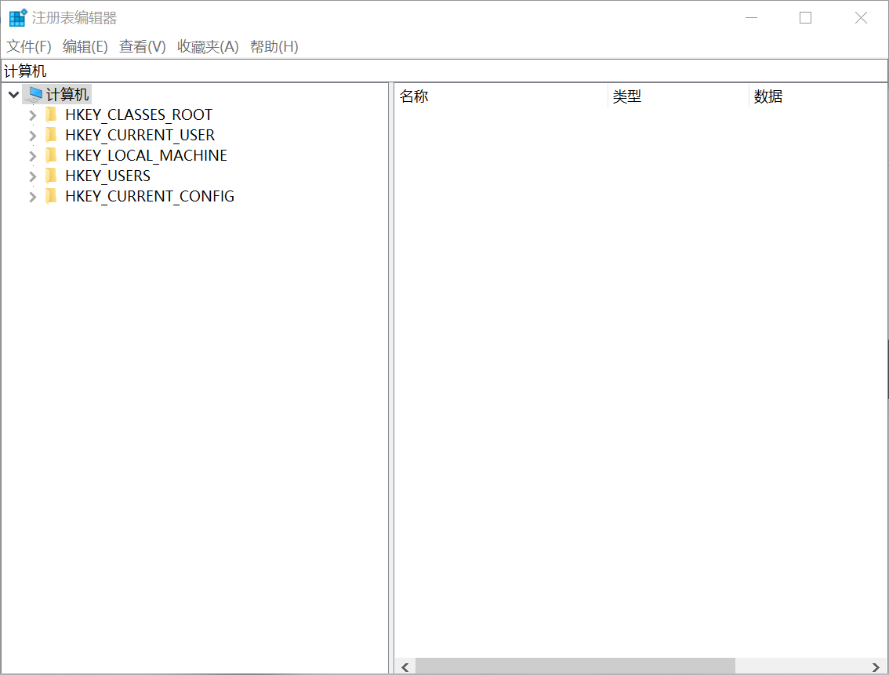

**5个根键（HKEY）**

| 名称 | 作用 |
| --- | --- |
| HKEY_CLASSES_ROOT | 存储Windows可识别的文件类型的详细列表，以及相关联的程序。 |
| HKEY_CURRENT_USER | 存储当前用户设置的信息。 |
| HKEY_LOCAL_MACHINE | 包括安装在计算机上的硬件和软件的信息。 |
| HKEY_USERS | 包含使用计算机的用户的信息。 |
| HKEY_CURRENT_CONFIG | 这个分支包含计算机当前的硬件配置信息。 |

**常见数据类型**

| 显示类型 | 数据类型 | 说明 |
| --- | --- | --- |
| REG_SZ | [字符串](https://zh.wikipedia.org/wiki/%E5%AD%97%E7%AC%A6%E4%B8%B2) | 文本字符串 |
| REG_BINARY | 二进制数 | 不定长度的二进制值，以十六进制显示 |
| REG_DWORD | 双字 | 一个 32 位的二进制值，显示为 8 位的十六进制值 |
| REG_MULTI_SZ | 多字符串 | 含有多个文本值的字符串，此名来源于字符串间用 nul 分隔、结尾两个 nul |
| REG_EXPAND_SZ | 可扩展字符串 | 含有环境变量的字符串 |

Value Types

| Value | Type |
| --- | --- |
| REG_BINARY | Binary data in any form. |
| REG_DWORD | A 32-bit number. |
| REG_DWORD_LITTLE_ENDIAN | A 32-bit number in little-endian format. |
| REG_DWORD_BIG_ENDIAN | A 32-bit number in big-endian format. |
| REG_EXPAND_SZ | A null-terminated string that contains unexpanded references to environment variables (for example, "%PATH%"). |
| REG_LINK | A null-terminated Unicode string that contains the target path of a symbolic link. |
| REG_MULTI_SZ | A sequence of null-terminated strings, terminated by an empty string (\\0). |
| REG_NONE | No defined value type. |
| REG_QWORD | A 64-bit number. |
| REG_QWORD_LITTLE_ENDIAN | A 64-bit number in little-endian format. |
| REG_SZ | A null-terminated string. |


Access Rights


## 注册表基础操作

### - 打开方法
**注册表的路径："C:\WINDOWS\regedit.exe"**

- 直接在资源管理器地址栏输入路径，双击打开；
- 打开开始菜单，找到Windows 管理工具，点击向下可找到注册表编辑器，点击打开；
- 打开运行对话框（ 快捷键 Win + R ），键入 regedit 即可打开；
- 在搜索栏输入注册表（ 快捷键 Win + S / Q ），如下图。

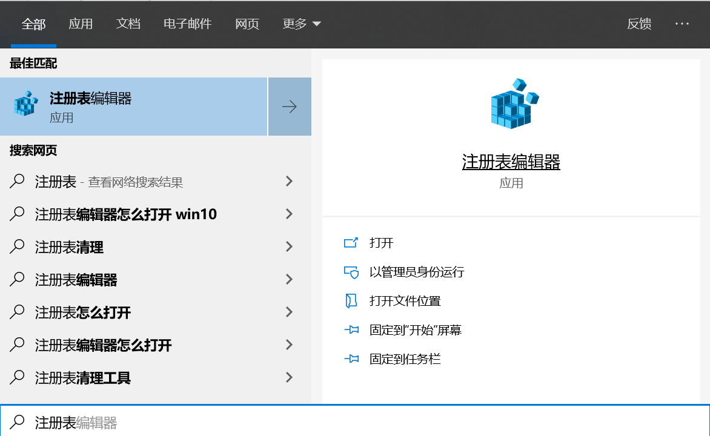

**- 备份与还原**：在注册表编辑器界面，点击左上角的文件，有 导入 与 导出 ，即对应 还原 与 备份 。  <br />  **- 精准定位**：选择你要找的根键，右击选择查找（快捷键 Ctrl + F）  <br />  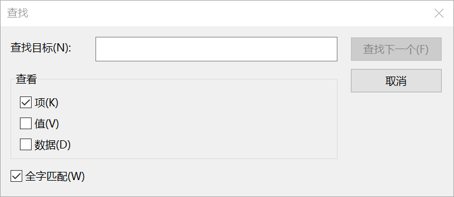


## 组策略编辑器
> 组策略编辑器是Windows核心的功能之一，具有非常实用的许多功能，如可以修改Windows的桌面、开始菜单、登录方式、组件、网络及IE浏览器等。组策略设置的实质是修改注册表中的配置，它使用了更完善的管理组织方法，可以对各种对象中的设置进行管理和配置，远比手工修改注册表方便灵活。

组策略编辑器是介于控制面板和注册表之间的一种修改系统、设置程序的工具。平时像一些常用的系统、外观、网络设置等我们可通过控制面板修改，但通过控制面板能修改的东西太少；因此，一些用户使用修改注册表的方法来设置，但注册表涉及内容又太多，修改不太方便。而组策略正好介于二者之间，涉及的内容比控制面板中的多，安全性和控制面板一样非常高，且条理性、可操作性也比注册表强。  <br />  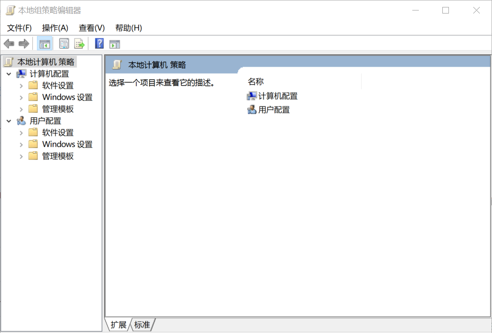  <br />  打开方式同注册表，在运行对话框，键入 **gpedit.msc **并回车，或在搜索栏输入组策略点击打开。

**PS：**Win10家庭版中并不包含组策略，只有更高级的专业版、企业版、教育版等才有。但网上也有一些办法可以不用升级的Win10家庭版也能使用组策略编辑器功能，请自寻搜索。


## 一些个性化修改
通过修改注册表，你可做很多事，下面简单介绍几种，以此为例。  <br />  **PS:修改注册表有风险，如果对注册表不是很熟悉强烈建议在修改前备份注册表，或者创建系统还原点，避免因误操作导致的未知问题。**

### - 取消锁屏
每次开机后，电脑先显示锁屏界面，必须通过触摸、键盘或者用鼠标拖动的方式进入登入界面，而锁屏界面是可跳过的。

**注册表法**（适用所有Win10版本，主要针对没有组策略编辑器的Win10家庭版）

1. 打开注册表，依次定位到\HKEY_LOCAL_MACHINE\SOFTWARE\Policies\Microsoft\Windows；
2. 鼠标右键单击Windows项，选择新建项，将其命名为Personalization；
3. 建好后定位到Personalization处，在右边窗口空白处点击鼠标右键，选择新建-DWORD(32位)值，并将其命名为NoLockScreen；
4. 双击该值打开编辑对话框，将数值数据更改为1，保存退出注册表编辑器即可。
5. 如果想要保留锁屏，将数值数据更改为0。

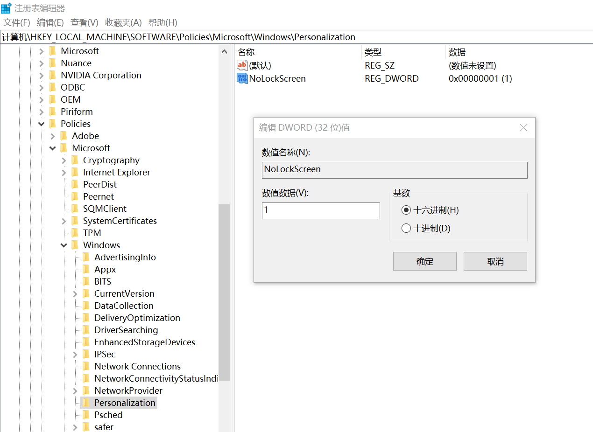

**组策略法**（适用有组策略编辑器的Win10专业版/企业版/教育版）

1. 打开组策略，依次展开计算机配置 - 管理模板 - 控制面板，定位到 个性化 并双击，然后在右边栏中找到 不显示锁屏 项并双击，打开详细的配置窗口。默认的为未配置，选择 已启用 即可。
2. 如果想要保留锁屏，选择  未配置 或 已禁用 即可。

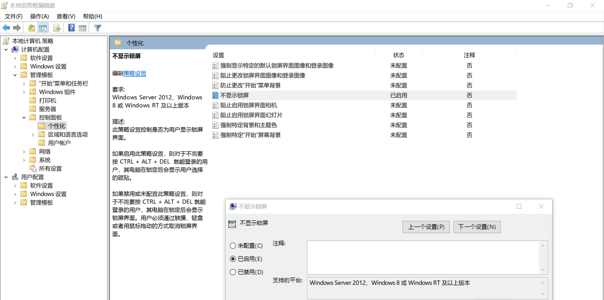


### - 关闭时间线(Timeline)
> 通过时间线，用户能够跳转到任意一个时间点查看当时的工作状态，类似于一个以时间顺序排列的系统快照，防止忘记保存文件、系统崩溃等情况造成用户的损失。

虽然时间线的功能强大，但是并不适用于所有用户。比如一些重要文件我们在查看后理应销毁的，但是在过了一段时间后竟然能够在时间线中看到重要文件的信息，这就不太好了。  <br />  时间线的打开**快捷键 Win+ Tab**，下图是已关闭的时间线  <br />  

- 注册表法
1. 打开注册表编辑器，定位至 HKEY_LOCAL_MACHINE\SOFTWARE\Policies\Microsoft\Windows\System ；
2. 选中System项，在右侧窗口中点击右键，选择“新建 - DWORD(32位)值 ，命名为EnableActivityFeed ，数值数据按默认的 0 即可。
3. 若想恢复，只需把EnableActivityFeed的数值修改为 1 ，或直接删除该值即可。

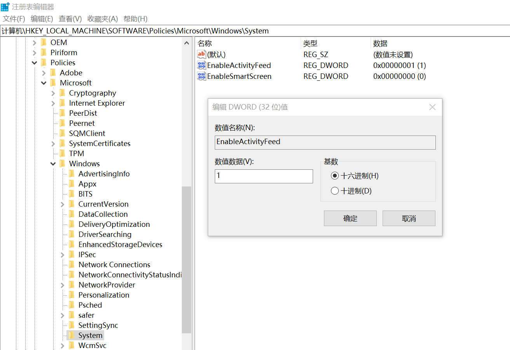

- 组策略法
1. 打开组策略编辑器，定位至 计算机配置 - 管理模板 - 系统 - OS策略 。然后在右侧窗口中找到 启用活动源（ActivityFeed） 配置项；
2. 双击该项打开 启用活动源 配置窗口，修改为“已禁用”。
3. 若想恢复，只需把 启用活动源 配置为 未配置 或 已启用 即可。

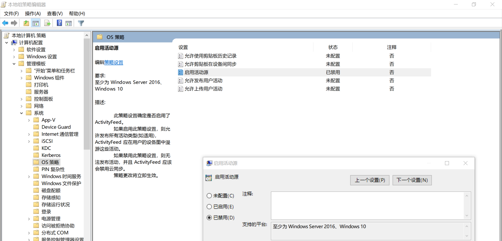


### - 去除桌面图标快捷方式箭头
一些朋友不喜欢Windows系统中快捷方式图标，下面介绍去除方法：

1. 打开注册表编辑器后定位 HKEY_CLASSES_ROOT\lnkfile ；
2. 删除 lnkfile 子项中的 IsShortcut 字符串值项（IsShortcut 项是用来控制是否显示普通应用程序和数据文件快捷方式中小箭头）；

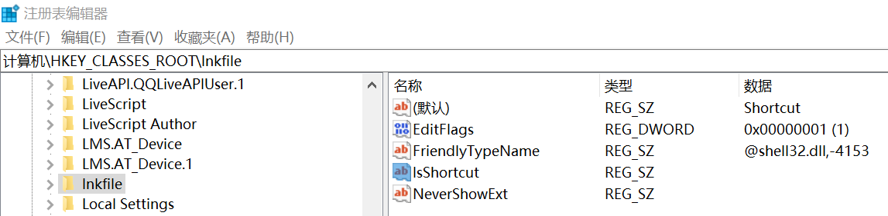

1. 退出注册表编辑器，重启EXPLORER.EXE进程（快捷键 Ctrl + Shift + Esc 打开任务管理器，如图找到资源管理器，右下角点击重新启动）后，现在你的桌面上图标快捷方式箭头已经没有了。

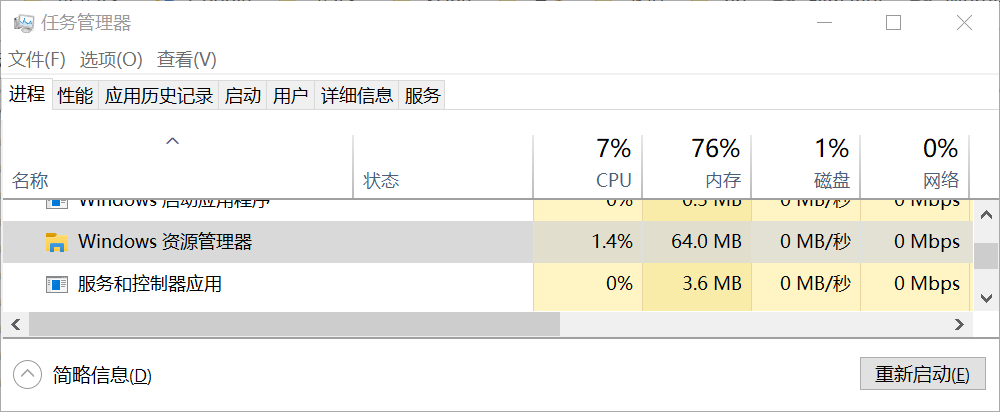  <br />  此外也可以通过运行对话框实现，结果与上面一致，并将步骤简化为一步，输入下列代码并回车即可。
```javascript
cmd /k reg delete "HKEY_CLASSES_ROOT\lnkfile" /v IsShortcut /f & taskkill /f /im explorer.exe & start explorer.exe
```
**PS**：不建议去除桌面图标快捷方式箭头，可能会导致某些问题。  <br />  （Win + X 无效，便携式谷歌浏览器固定到任务栏打不开，）


### - 去除此电脑首页的六个文件夹

1. 定位到HKEY_LOCAL_MACHINE\SOFTWARE\Microsoft\Windows\CurrentVersion\Explorer\FolderDescriptions
2. 视频 文件夹的项 `{35286a68-3c57-41a1-bbb1-0eae73d76c95}`，我们可以通过该项右侧窗口中Name的数据值来判断是否是我们需要的项， 视频 对应的是英文名Local Videos
3. 接着展开进入它的子项 PropertyBag ，双击右侧窗口中的 ThisPCPolicy ，将其数据数值由Show改为Hide，最后确定即可。

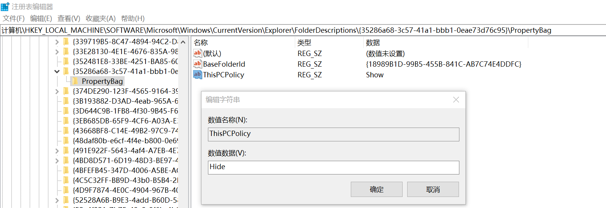  <br />  其它同理，对应的信息如下：

- 图片文件夹：`{0ddd015d-b06c-45d5-8c4c-f59713854639}＼PropertyBag`
- 音乐文件夹：`{a0c69a99-21c8-4671-8703-7934162fcf1d}＼PropertyBag`
- 视频文件夹：`{35286a68-3c57-41a1-bbb1-0eae73d76c95}＼PropertyBag`
- 文档文件夹：`{f42ee2d3-909f-4907-8871-4c22fc0bf756}＼PropertyBag`
- 下载文件夹：`{7d83ee9b-2244-4e70-b1f5-5393042af1e4}＼PropertyBag`
- 桌面文件夹：`{B4BFCC3A-DB2C-424C-B029-7FE99A87C641}＼PropertyBag`

**PS**：若桌面文件夹对应的PropertyBag项内可能没有 ThisPCPolicy ，可手动新建一个 字符串值 将其命名为 ThisPCPolicy，并赋予Hide值就行。

计算机\HKEY_LOCAL_MACHINE\SOFTWARE\Microsoft\Windows\CurrentVersion\Explorer\MyComputer\NameSpace

- [下载]    `{088e3905-0323-4b02-9826-5d99428e115f}`
- [3D 对象]    `{0DB7E03F-FC29-4DC6-9020-FF41B59E513A}`
- [图片]    `{24ad3ad4-a569-4530-98e1-ab02f9417aa8}`
- [音乐]   `{3dfdf296-dbec-4fb4-81d1-6a3438bcf4de}`
- [桌面]    `{B4BFCC3A-DB2C-424C-B029-7FE99A87C641}`
- [文档]    `{d3162b92-9365-467a-956b-92703aca08af}`
- [视频]    `{f86fa3ab-70d2-4fc7-9c99-fcbf05467f3a}`

### - 修改系统字体
或者可以复制下面的代码到txt文本，然后把文件名的后缀改成reg（注意：代码里面的 SimSun 与 SimSun.ttc 既是你要改的字体名字。这里的SimSun是宋体的，如果你要改宋体直接复制就好了。）  <br />  Windows Registry Editor Version 5.00  <br />  [HKEY_LOCAL_MACHINESOFTWAREMicrosoftWindows NTCurrentVersionFonts]  <br />  "Microsoft YaHei & Microsoft YaHei UI (TrueType)"="simsun.ttc"  <br />  [HKEY_LOCAL_MACHINESOFTWAREMicrosoftWindows NTCurrentVersionFontSubstitutes]  <br />  "Microsoft YaHei"="SimSun"  <br />  "Microsoft YaHei UI"="SimSun"  <br />  然后双击运行，如下图，完成后重启即可。  <br />  如果你要还原原来的字体就复制下面的代码，同上面的步骤操作即可：  <br />  Windows Registry Editor Version 5.00  <br />  [HKEY_LOCAL_MACHINESOFTWAREMicrosoftWindows NTCurrentVersionFonts]  <br />  "Microsoft YaHei & Microsoft YaHei UI (TrueType)"="msyh.ttc"  <br />  [HKEY_LOCAL_MACHINESOFTWAREMicrosoftWindows NTCurrentVersionFontSubstitutes]  <br />  "Microsoft YaHei"=-  <br />  "Microsoft YaHei UI"=-  <br />  关闭SuperFetch服务  <br />  无论是通过什么方式关闭，它都会在Windows 10较大更新时再次默默启动  <br />  SuperFetch是Windows中一种预读服务，在启动的时候加载软件数据信息，缩短我们启动软件的等待时间。适用配件较好的电脑  <br />  Hkey_LOCAL_MACHINESYSTEMCurrentControlSetServicesSysMain  <br />  先在左侧新建个名为Superfetch的项，之后在右侧再新建个名为Start的DWORD（32位）值，并将其数值数据修改成3。  <br />  再定位到Hkey_LOCAL_MACHINESYSTEMCurrentControlSetServicesTimeBrokerSvc  <br />  将右侧的Start选项的数值数据也修改成3。  <br />  重新启动电脑，就可以，让它不再拼命的使用内存和处理器资源，使电脑出现开机卡顿等问题了。  <br />  找到下面路径关闭 Prefetch  <br />  HKEY_LOCAL_MACHINE\SYSTEM\CurrentControlSet\Control\Session Manager\Memory Management\PrefetchParameters  <br />  修改这两个的值  <br />  EnablePrefetcher 数值改成 1  <br />  EnableSuperfetch 数值改成 1  <br />  数值的含义，有兴趣看看  <br />  0 = Disabled  <br />  1 = Application launch prefetching enabled  <br />  2 = Boot prefetching enabled  <br />  3 = Applaunch and Boot enabled (Optimal and Default)  <br />  继续找到下面路径关闭同步  <br />  HKEY_LOCAL_MACHINE\SYSTEM\CurrentControlSet\Services  <br />  修改下面几个的值  <br />  OneSyncSvc、OneSyncSvc_Session1、UserDataSvc、UserDataSvc_Session1、UnistoreSvc、UnistoreSvc1  <br />  将 start 值改为 4
