# [Office](https://support.office.com/zh-cn)

初级——无视或无知规则  <br />  中级——遵守或利用规则  <br />  高级——改变或创造规则


## 快捷键
| Ctrl+E/J/L/R | 对齐方式-居中/两端/左端/右端 |
| --- | --- |
| Ctrl+[ / ] | 缩小/放大文字 |
| **Ctrl+B** | **粗体** |
| _Ctrl+I_ | _斜体_ |
| Ctrl+U | 下划线 |
| Ctrl+Shift+D | 双下划线 |
| Ctrl+ K | 插入超链接 |
| Ctrl+ =  | 下标 |
|  Ctrl+Shift+= | 上标 |
|  Ctrl+Shift+C/V | 格式刷 复制/粘贴所选文字的格式  |
|  |  |
| Backspace | 向右删除 |
| Delete | 向右删除 |
| Ctrl+Backspace | 向左删除一个字词 |
| Ctrl+Delete | 向右删除一个字词 |

| Ctrl+D | 等距复制 |
| --- | --- |
| Ctrl+H | 替换 |
| F4 | 重复上一步 |
| Ctrl+G / F5 | 定位 |
| **显示所有格式** | Shift+F1 |
| Shift+F5 | 移至最后一处更改 |
| F12 | 另存为 |
| Shift+F3 | 更改字母大小写 |


把文档后缀改成RAR，解压缩可以直接获得文档里的图片。


## [Office Tool Plus](http://otp.landian.vip/)

安装

1. 选择产品——Microsoft 365
2. 选择所需应用程序
3. 选择语言
4. 开始部署

激活

1. 清除激活信息
2. 打开命令框，输入

`ospp /ilbyid MondoVolume /sethst:kms.loli.beer /setprt:1688 /act `

[部署 Office](https://docs.microsoft.com/zh-cn/DeployOffice/)

- Office 软件保护平台脚本 （ospp.vbs）
- 软件许可证管理器脚本 （slmgr.vbs）
- 批量激活管理工具 （VAMT） 


# Word

**A4：21 x 29.7 (cm)**


## [快捷键](https://support.office.com/zh-cn/article/word-%E4%B8%AD%E7%9A%84%E9%94%AE%E7%9B%98%E5%BF%AB%E6%8D%B7%E6%96%B9%E5%BC%8F-95ef89dd-7142-4b50-afb2-f762f663ceb2#PickTab=Windows)  <br />    <br />  
**_粗斜体为自定义_**

| Alt+Ctrl+F | 插入脚注 |
| --- | --- |
| Alt+Ctrl+D | 插入尾注 |
| Ctrl+Enter | 插入分页符 |
| Alt+Ctrl+O | 大纲视图 |
| Ctrl+Shift+N | 降级为正文 |
| Alt+Ctrl+1/2/3 | 1/2/3级标题 |
| **_Ctrl+Shift+4/5/6_** | **_4级/图表/公式_** |
| **_Alt+S_** | **_宋体_** |
| **_Alt+T_** | **_新罗马_** |

| Ctrl+E/J/L/R | 对齐方式-居中/两端/左端/右端 |
| --- | --- |
| Ctrl+[ / ] | 缩小/放大文字 |
| **Ctrl+B** | **粗体** |
| _Ctrl+I_ | _斜体_ |
| Ctrl+U | 下划线 |
| Ctrl+Shift+D | 双下划线 |
| Ctrl+ K | 插入超链接 |
| Ctrl+ =  | 下标 |
|  Ctrl+Shift+= | 上标 |
|  Ctrl+Shift+C/V | 格式刷 复制/粘贴所选文字的格式  |
|  |  |
| Backspace | 向右删除 |
| Delete | 向右删除 |
| Ctrl+Backspace | 向左删除一个字词 |
| Ctrl+Delete | 向右删除一个字词 |
|  |  |
| Ctrl+H | 替换 |
| F4 | 重复上一步 |
| Ctrl+G / F5 | 定位 |
| Shift+F1 | 显示所有格式 |
| Shift+F5 | 移至最后一处更改 |
| F12 | 另存为 |
| Shift+F3 | 更改字母大小写 |


| 拆分文档窗口 | Ctrl+Alt+S |
| --- | --- |
| 隐藏所选文本 | Ctrl+Shift+H |


**自定义**

| **_Ctrl+R_** | **_标尺_** |
| --- | --- |
| **_Ctrl+0 _** | **_原始大小_** |
|  |  |
| **_。。_** | **_._** |
| **_，，_** | **_,_** |


竖向选中：Alt+鼠标左键  <br />  Alt+鼠标选框

基础模板：Normal.dotm


## 通配符


### 查找通配符
| 清除使用通配符复选框 |  | 勾选使用通配符复选框 |  |
| --- | --- | --- | --- |
| 特殊字符 | 通配符 | 特殊字符 | 通配符 |
| 任意单个字符 | ^? | 任意单个字符 | ? |
| 任意数字 | ^# | 任意数字（单个） | [0-9] |
| 任意英文字母 | ^$ | 任意英文字母 | [a-zA-Z] |
| 段落标记 | ^p | 段落标记 | ^13 |
| 手动换行符 | ^l | 手动换行符 | ^l or ^11 |
| 图形 | ^g or ^1 | 图形 | ^g |
| 1/4长划线 | ^+ | 1/4长划线 | ^q |
| 长划线 | ^j | 长划线 | ^+ |
| 短划线 | ^q | 短划线 | ^= |
| 制表符 | ^t | 制表符 | ^t |
| 脱字号 | ^ | 脱字号 | ^^ |
| 分栏符 | ^v | 分栏符 | ^n or ^14 |
| 分节符 | ^b | 分节符/分页符 | ^m |
| 省略号 | ^n | 省略号 | ^i |
| 全角省略号 | ^i | 全角省略号 | ^j |
| 无宽非分隔符 | ^z | 无宽非分隔符 | ^z |
| 无宽可选分隔符 | ^x | 无宽可选分隔符 | ^x |
| 不间断空格 | ^s | 不间断空格 | ^s |
| 不间断连字符 | ^~ | 不间断连字符 | ^~ |
| ¶段落符号 | ^% | 表达式 | ( ) |
| §分节符 | ^ | 单词结尾 | <  |
| 脚注标记 | ^f or ^2 | 单词开头 | >  |
| 可选连字符 | ^- | 任意字符串 | * |
| 空白区域 | ^w | 指定范围外任意单个字符 | [!x-z] |
| 手动分页符 | ^m | 指定范围内任意单个字符 | [ - ] |
| 尾注标记 | ^e | 1个以上前一字符或表达式 | @ |
| 域 | ^d | n 个前一字符或表达式 | `{ n }` |
| Unicode 字符 | ^Unnnn | n个以上前一字符或表达式 | `{ n, }` |
| 全角空格 | ^u8195 | n 到 m 个前一字符或表达式 | `{ n,m }` |
| 半角空格 | ^32 or ^u8194 | 所有小写英文字母 | [a-z] |
| 批注 | ^a or ^5 | 所有大写英文字母 | [A-Z] |
|   |   | 所有西文字符 | [^1-^127] |
|  |  | 所有中文汉字和中文标点 | [!^1-^127] |
|   |   | 所有中文汉字（CJK统一字符） | [一-龥] or [一-﨩] |
|   |   | 所有中文标点 | [!一-龥^1-^127] |
|   |   | 所有非数字字符 | [!0-9] |

特殊字符需用转义字符（ \ )


### 替换通配符
| 特殊字符 | 通配符 | 特殊字符 | 通配符 |
| --- | --- | --- | --- |
|   |   | 要查找的表达式 \\n | \\ |
| 段落标记↵ | ^p | 脱字号 | ^^ |
| 手动换行符↓ | ^l | 手动分页符 | ^m |
| 查找的内容 | ^& | 可选连字符（_） | ^- |
| 剪贴板内容 | ^c | 不间断连字符（-） | ^~ |
| 省略号 | ^i | 不间断空格 | ^s |
| 全角省略号 | ^j | 无宽非分隔符 | ^z |
| 制表符 | ^t | 无宽可选分隔符 | ^x |
| 长划线 | ^+ | 分栏符 | ^n |
| 1/4长划线( — ) | ^q | §分节符 | ^% |
| 短划线( – ) | ^= | ¶段落符号 | ^v |

   <br />   示例

|   <br />   | 通配符 | 示例 |
| --- | --- | --- |
| 任意单个字符 | ? | 例如，s?t可查找“sat”和“set”。 |
| 任意字符串 | * | 例如，s*d可查找“sad”和“started”。 |
| 单词的开头 | <  | 例如，<(inter)查找“interesting”和“intercept”，但不查找“splintered”。 |
| 单词的结尾 | >  | 例如，(in)>查找“in”和“within”，但不查找“interesting”。 |
| 指定字符之一 | [] | 例如，w[io]n查找“win”和“won”。 |
| 指定字符范围以外的任意单个字符 | [!x-z] | 例如，t[!a-m]ck查找“tock”和“tuck”，但不查找“tack”和“tick”。 |
| n个重复的前一字符或表达式 | `{n}` | 例如，fe{2}d查找“feed”，但不查找“fed”。 |
| 至少n个前一字符或表达式 | `{n,}` | 例如，fe{1,}d查找“fed”和“feed”。 |
| n到m个前一字符或表达式 | `{n,m}` | 例如，10{1,3}查找“10”、“100”和“1000”。 |
| 一个以上的前一字符或表达式 | @ | 例如，lo@t查找“lot”和“loot”。 |


## 公式

键入公式：`Alt + =`

| UnicodeMath 格式 | 合成格式 |  |
| --- | --- | --- |
| 向量 | (abc)\\vec`<space><space>` | 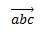 |
|  | (abc)\\hat`<space><space>` | 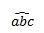 |
| 带框公式 | \\rect(a/b)`<space>` | 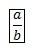 |
| 括号 | (a+b/c)`<space>` | 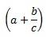 |
|  | {a+b/c}`<space>` | 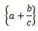 |
| 带分隔符的括号 | `{a/b\\vbar<space>x+y\\vbar<space>}<space>` | 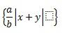 |
| 分数 | a/(b+c)`<space>` | 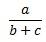 |
| LeftSubSup | _a^b`<space>`x`<space>` | 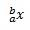 |
| 极限 | lim_(n->\\infty)`<space>`n | 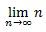 |
| 矩阵 | (\\matrix(a&b@&c&d))`<space>` | 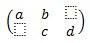 |
| N 元 | \\iint_(a=0)^\\infty`<space><space>`a | 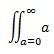 |
| 顶线/底线 | \\overbar(abc)`<space>` | 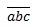 |
|  | \\overbrace(a+b)`<space>` | 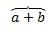 |
| 根式 | \\sqrt(5&a^2)`<space>` | 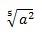 |

**注意:**  两个连续空格之后显示示例时，第一个空格解析公式中键入的文本，第二个空格将其构建。

希腊字母  <br />  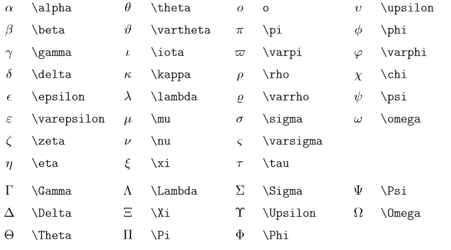


##   <br />  纯文本粘贴
我们在将网页内容、带有格式的文档内容复制、粘贴到WORD 时，会把网页和原文档源有的格式也一并粘贴上去了。如果我们只是想到纯文本内容，可以单击“编辑”菜单-“选择性粘贴”-“无格式文本”。但是这个操作过程比较繁锁，对此我们可以将“粘贴成无格式文本”功能以按钮的形式放在WORD工具栏上，只要点击该按钮就可以剪贴板里的源内容以纯文本方式粘贴到WORD中。  <br />  由于WORD的“自定义”功能里没有“粘贴为纯文本”按钮，我们需要自己动手创建“粘贴为纯文本”宏，将宏做成按钮放在工具栏上。具体方法如下：  <br />  打开WORD，单击“工具”菜单-“宏”子菜单-“VISUAL BASIC编辑器”命令，打开“VISUAL BASIC编辑器”对话框。  <br />  在“工程资源管理器”窗口中（如果看不到该窗口，单击“视图”菜单-“工程资源管理器”命令打开），鼠标右键单击“NORMA1”，在弹出的右键菜单上单击“插入”子菜单-“模块”命令，在NORMA1模块里添加模块。  <br />  sub 粘贴为纯文本（） on error resume next selection.pastespecial,,wdinline,,wdpastetext end sub   <br />  输入好代码后，单击“VISUAL BASIC编辑器”对话框工具栏上的“保存”按钮把宏保存起来，然后关闭“VISUAL BASIC 编辑器”对话框。


# Excel


## [快捷键](https://support.office.com/zh-cn/article/excel-%E4%B8%AD%E7%9A%84%E9%94%AE%E7%9B%98%E5%BF%AB%E6%8D%B7%E6%96%B9%E5%BC%8F-1798d9d5-842a-42b8-9c99-9b7213f0040f#picktab=windows)

- Alt+Enter	在表格内换行
- Ctrl+Shift+上/下	选择该列所有数据，加上左右可选择多列
- Ctrl+上/下	跳至表格最下方
- Ctrl+D/R	复制上行数据/左列数据

| **Ctrl+9** | **隐藏选定的行** |
| --- | --- |
| **Ctrl+0** | **隐藏选定的列** |
| **Ctrl+1** | **单元格式** |
| **Ctrl+6** | **删除线** |
| **Ctrl+Shift+百分比 (%)** |  |
| **Ctrl+Shift+脱字号 (^)** | **两位小数的科学计数** |
| **Ctrl+E** | **合并、更改（字符、内容调序、提取）、拆分** |
| **Alt+=** | **求和** |
| **Ctrl+Alt+V** | **选择性粘贴** |
| **Ctrl+T** | **创建表** |
| **Ctrl+Q** | **快速分析** |


## [Fuction](https://support.office.com/zh-cn/article/Excel-%E5%87%BD%E6%95%B0%EF%BC%88%E6%8C%89%E7%B1%BB%E5%88%AB%E5%88%97%E5%87%BA%EF%BC%89-5f91f4e9-7b42-46d2-9bd1-63f26a86c0eb)

- SUM(number1,[number2],...)
- IF(logical_test, value_if_true, [value_if_false])
- LOOKUP(lookup_value, lookup_vector, [result_vector])
- VLOOKUP (lookup_value, table_array, col_index_num, [range_lookup])
- MATCH(lookup_value, lookup_array, [match_type])
- CHOOSE(index_num, value1, [value2], ...)
- DATE(year,month,day)
- DAYS(end_date, start_date)
- FIND(find_text, within_text, [start_num])
- FINDB(find_text, within_text, [start_num])
- INDEX(array, row_num, [column_num])
- COUNTIF(查找范围，值)

| **函数** | **说明** |
| --- | --- |
| [SUM 函数](https://support.office.com/zh-cn/article/sum-%E5%87%BD%E6%95%B0-043e1c7d-7726-4e80-8f32-07b23e057f89) | 此函数用于对单元格中的值求和。 |
| [IF 函数](https://support.office.com/zh-cn/article/if-%E5%87%BD%E6%95%B0-69aed7c9-4e8a-4755-a9bc-aa8bbff73be2) | 此函数用于在条件为真时返回一个值，条件为假时返回另一个值。 |
| [LOOKUP 函数](https://support.office.com/zh-cn/article/lookup-%E5%87%BD%E6%95%B0-446d94af-663b-451d-8251-369d5e3864cb) | 需要查询一行或一列并查找另一行或列中的相同位置的值时，请使用此函数。 |
| [VLOOKUP 函数](https://support.office.com/zh-cn/article/vlookup-%E5%87%BD%E6%95%B0-0bbc8083-26fe-4963-8ab8-93a18ad188a1) | 如果需要按行查找表或区域中的内容，请使用此函数。 |
| [MATCH 函数](https://support.office.com/zh-cn/article/match-%E5%87%BD%E6%95%B0-e8dffd45-c762-47d6-bf89-533f4a37673a) | 使用此函数搜索单元格区域中的某个项目，然后返回该项目在区域中的相对位置。 例如，如果区域 A1： A3 包含值5、7和38，则公式 = MATCH （7，A1： A3，0）将返回数字2，因为7是区域中的第二个项目。 |
| [CHOOSE 函数](https://support.office.com/zh-cn/article/choose-%E5%87%BD%E6%95%B0-fc5c184f-cb62-4ec7-a46e-38653b98f5bc) | 此函数用于根据索引号从最多 254 个数值中选择一个。 例如，如果 value1 到 value7 表示一周的 7 天，那么将 1 到 7 之间的数字用作 index_num 时，CHOOSE 将返回其中的某一天。 |
| [DATE 函数](https://support.office.com/zh-cn/article/date-%E5%87%BD%E6%95%B0-e36c0c8c-4104-49da-ab83-82328b832349) | 此函数用于返回代表特定日期的连续序列号。 此函数在公式，而非单元格引用提供年、月和日的情况中非常有用。 例如，可能有一个工作表所包含的日期使用了 Excel 无法识别的格式（如 YYYYMMDD）。  <br />  [DATEDIF](https://support.office.com/zh-cn/article/datedif-%E5%87%BD%E6%95%B0-25dba1a4-2812-480b-84dd-8b32a451b35c) 函数用于计算两个日期之间的天数、月数或年数。 |
| [DAYS 函数](https://support.office.com/zh-cn/article/days-%E5%87%BD%E6%95%B0-57740535-d549-4395-8728-0f07bff0b9df) | 此函数用于返回两个日期之间的天数。 |
| [FIND、FINDB 函数](https://support.office.com/zh-cn/article/find%E3%80%81findb-%E5%87%BD%E6%95%B0-c7912941-af2a-4bdf-a553-d0d89b0a0628) | 函数 FIND 和 FINDB 用于在第二个文本串中定位第一个文本串。 这两个函数返回第一个文本串的起始位置的值，该值从第二个文本串的第一个字符算起。 |
| [INDEX 函数](https://support.office.com/zh-cn/article/index-%E5%87%BD%E6%95%B0-a5dcf0dd-996d-40a4-a822-b56b061328bd) | 此函数用于返回表格或区域中的值或值的引用。 |


### 数学函数
| **函数** | **说明** |
| --- | --- |
| [ABS 函数](https://support.office.com/zh-cn/article/abs-%E5%87%BD%E6%95%B0-3420200f-5628-4e8c-99da-c99d7c87713c) | 返回数字的绝对值 |
| [ACOS 函数](https://support.microsoft.com/zh-cn/office/acos-%E5%87%BD%E6%95%B0-cb73173f-d089-4582-afa1-76e5524b5d5b) | 返回数字的反余弦值 |
| [ACOSH 函数](https://support.office.com/zh-cn/article/acosh-%E5%87%BD%E6%95%B0-e3992cc1-103f-4e72-9f04-624b9ef5ebfe) | 返回数字的反双曲余弦值 |
| [ACOT 函数](https://support.office.com/zh-cn/article/acot-%E5%87%BD%E6%95%B0-dc7e5008-fe6b-402e-bdd6-2eea8383d905) | 返回一个数的反余切值 |
| [ACOTH 函数](https://support.office.com/zh-cn/article/acoth-%E5%87%BD%E6%95%B0-cc49480f-f684-4171-9fc5-73e4e852300f) | 返回一个数的双曲反余切值 |
| [AGGREGATE 函数](https://support.office.com/zh-cn/article/aggregate-%E5%87%BD%E6%95%B0-43b9278e-6aa7-4f17-92b6-e19993fa26df) | 返回列表或数据库中的聚合 |
| [ARABIC 函数](https://support.microsoft.com/zh-cn/office/arabic-%E5%87%BD%E6%95%B0-9a8da418-c17b-4ef9-a657-9370a30a674f) | 将罗马数字转换为阿拉伯数字 |
| [ASIN 函数](https://support.microsoft.com/zh-cn/office/asin-%E5%87%BD%E6%95%B0-81fb95e5-6d6f-48c4-bc45-58f955c6d347) | 返回数字的反正弦值 |
| [ASINH 函数](https://support.office.com/zh-cn/article/asinh-%E5%87%BD%E6%95%B0-4e00475a-067a-43cf-926a-765b0249717c) | 返回数字的反双曲正弦值 |
| [ATAN 函数](https://support.office.com/zh-cn/article/atan-%E5%87%BD%E6%95%B0-50746fa8-630a-406b-81d0-4a2aed395543) | 返回数字的反正切值 |
| [ATAN2 函数](https://support.microsoft.com/zh-cn/office/atan2-%E5%87%BD%E6%95%B0-c04592ab-b9e3-4908-b428-c96b3a565033) | 返回 X 和 Y 坐标的反正切值 |
| [ATANH 函数](https://support.office.com/zh-cn/article/atanh-%E5%87%BD%E6%95%B0-3cd65768-0de7-4f1d-b312-d01c8c930d90) | 返回数字的反双曲正切值 |
| [BASE 函数](https://support.microsoft.com/zh-cn/office/base-%E5%87%BD%E6%95%B0-2ef61411-aee9-4f29-a811-1c42456c6342) | 将一个数转换为具有给定基数的文本表示 |
| [CEILING 函数](https://support.office.com/zh-cn/article/ceiling-%E5%87%BD%E6%95%B0-0a5cd7c8-0720-4f0a-bd2c-c943e510899f) | 将数字舍入为最接近的整数或最接近的指定基数的倍数 |
| [CEILING.MATH 函数](https://support.microsoft.com/zh-cn/office/ceiling-math-%E5%87%BD%E6%95%B0-80f95d2f-b499-4eee-9f16-f795a8e306c8) | 将数字向上舍入为最接近的整数或最接近的指定基数的倍数 |
| [CEILING.PRECISE 函数](https://support.office.com/zh-cn/article/ceiling-precise-%E5%87%BD%E6%95%B0-f366a774-527a-4c92-ba49-af0a196e66cb) | 将数字舍入为最接近的整数或最接近的指定基数的倍数。 无论该数字的符号如何，该数字都向上舍入。 |
| [COMBIN 函数](https://support.microsoft.com/zh-cn/office/combin-%E5%87%BD%E6%95%B0-12a3f276-0a21-423a-8de6-06990aaf638a) | 返回给定数目对象的组合数 |
| [COMBINA 函数](https://support.office.com/zh-cn/article/combina-%E5%87%BD%E6%95%B0-efb49eaa-4f4c-4cd2-8179-0ddfcf9d035d) | 返回给定数目对象具有重复项的组合数 |
| [COS 函数](https://support.office.com/zh-cn/article/cos-%E5%87%BD%E6%95%B0-0fb808a5-95d6-4553-8148-22aebdce5f05) | 返回数字的余弦值 |
| [COSH 函数](https://support.office.com/zh-cn/article/cosh-%E5%87%BD%E6%95%B0-e460d426-c471-43e8-9540-a57ff3b70555) | 返回数字的双曲余弦值 |
| [COT 函数](https://support.office.com/zh-cn/article/cot-%E5%87%BD%E6%95%B0-c446f34d-6fe4-40dc-84f8-cf59e5f5e31a) | 返回角度的余弦值 |
| [COTH 函数](https://support.office.com/zh-cn/article/coth-%E5%87%BD%E6%95%B0-2e0b4cb6-0ba0-403e-aed4-deaa71b49df5) | 返回数字的双曲余切值 |
| [CSC 函数](https://support.office.com/zh-cn/article/csc-%E5%87%BD%E6%95%B0-07379361-219a-4398-8675-07ddc4f135c1) | 返回角度的余割值 |
| [CSCH 函数](https://support.office.com/zh-cn/article/csch-%E5%87%BD%E6%95%B0-f58f2c22-eb75-4dd6-84f4-a503527f8eeb) | 返回角度的双曲余割值 |
| [DECIMAL 函数](https://support.microsoft.com/zh-cn/office/decimal-%E5%87%BD%E6%95%B0-ee554665-6176-46ef-82de-0a283658da2e) | 将给定基数内的数的文本表示转换为十进制数 |
| [DEGREES 函数](https://support.microsoft.com/zh-cn/office/degrees-%E5%87%BD%E6%95%B0-4d6ec4db-e694-4b94-ace0-1cc3f61f9ba1) | 将弧度转换为度 |
| [EVEN 函数](https://support.microsoft.com/zh-cn/office/even-%E5%87%BD%E6%95%B0-197b5f06-c795-4c1e-8696-3c3b8a646cf9) | 将数字向上舍入到最接近的偶数 |
| [EXP 函数](https://support.office.com/zh-cn/article/exp-%E5%87%BD%E6%95%B0-c578f034-2c45-4c37-bc8c-329660a63abe) | 返回 _e_ 的 n 次方 |
| [FACT 函数](https://support.microsoft.com/zh-cn/office/fact-%E5%87%BD%E6%95%B0-ca8588c2-15f2-41c0-8e8c-c11bd471a4f3) | 返回数字的阶乘 |
| [FACTDOUBLE 函数](https://support.office.com/zh-cn/article/factdouble-%E5%87%BD%E6%95%B0-e67697ac-d214-48eb-b7b7-cce2589ecac8) | 返回数字的双倍阶乘 |
| [FLOOR 函数](https://support.microsoft.com/zh-cn/office/floor-%E5%87%BD%E6%95%B0-14bb497c-24f2-4e04-b327-b0b4de5a8886) | 向绝对值减小的方向舍入数字 |
| [FLOOR.MATH 函数](https://support.microsoft.com/zh-cn/office/floor-math-%E5%87%BD%E6%95%B0-c302b599-fbdb-4177-ba19-2c2b1249a2f5) | 将数字向下舍入为最接近的整数或最接近的指定基数的倍数 |
| [FLOOR.PRECISE 函数](https://support.office.com/zh-cn/article/floor-precise-%E5%87%BD%E6%95%B0-f769b468-1452-4617-8dc3-02f842a0702e) | 将数字向下舍入为最接近的整数或最接近的指定基数的倍数。 无论该数字的符号如何，该数字都向下舍入。 |
| [GCD 函数](https://support.office.com/zh-cn/article/gcd-%E5%87%BD%E6%95%B0-d5107a51-69e3-461f-8e4c-ddfc21b5073a) | 返回最大公约数 |
| [INT 函数](https://support.office.com/zh-cn/article/int-%E5%87%BD%E6%95%B0-a6c4af9e-356d-4369-ab6a-cb1fd9d343ef) | 将数字向下舍入到最接近的整数 |
| [ISO.CEILING 函数](https://support.office.com/zh-cn/article/iso-ceiling-%E5%87%BD%E6%95%B0-e587bb73-6cc2-4113-b664-ff5b09859a83) | 返回一个数字，该数字向上舍入为最接近的整数或最接近的有效位的倍数 |
| [LCM 函数](https://support.office.com/zh-cn/article/lcm-%E5%87%BD%E6%95%B0-7152b67a-8bb5-4075-ae5c-06ede5563c94) | 返回最小公倍数 |
| [LN 函数](https://support.office.com/zh-cn/article/ln-%E5%87%BD%E6%95%B0-81fe1ed7-dac9-4acd-ba1d-07a142c6118f) | 返回数字的自然对数 |
| [LOG 函数](https://support.office.com/zh-cn/article/log-%E5%87%BD%E6%95%B0-4e82f196-1ca9-4747-8fb0-6c4a3abb3280) | 返回数字的以指定底为底的对数 |
| [LOG10 函数](https://support.microsoft.com/zh-cn/office/log10-%E5%87%BD%E6%95%B0-c75b881b-49dd-44fb-b6f4-37e3486a0211) | 返回数字的以 10 为底的对数 |
| [MDETERM 函数](https://support.microsoft.com/zh-cn/office/mdeterm-%E5%87%BD%E6%95%B0-e7bfa857-3834-422b-b871-0ffd03717020) | 返回数组的矩阵行列式的值 |
| [MINVERSE 函数](https://support.microsoft.com/zh-cn/office/minverse-%E5%87%BD%E6%95%B0-11f55086-adde-4c9f-8eb9-59da2d72efc6) | 返回数组的逆矩阵 |
| [MMULT 函数](https://support.office.com/zh-cn/article/mmult-%E5%87%BD%E6%95%B0-40593ed7-a3cd-4b6b-b9a3-e4ad3c7245eb) | 返回两个数组的矩阵乘积 |
| [MOD 函数](https://support.office.com/zh-cn/article/mod-%E5%87%BD%E6%95%B0-9b6cd169-b6ee-406a-a97b-edf2a9dc24f3) | 返回除法的余数 |
| [MROUND 函数](https://support.office.com/zh-cn/article/mround-%E5%87%BD%E6%95%B0-c299c3b0-15a5-426d-aa4b-d2d5b3baf427) | 返回一个舍入到所需倍数的数字 |
| [MULTINOMIAL 函数](https://support.office.com/zh-cn/article/multinomial-%E5%87%BD%E6%95%B0-6fa6373c-6533-41a2-a45e-a56db1db1bf6) | 返回一组数字的多项式 |
| [MUNIT 函数](https://support.office.com/zh-cn/article/munit-%E5%87%BD%E6%95%B0-c9fe916a-dc26-4105-997d-ba22799853a3) | 返回单位矩阵或指定维度 |
| [ODD 函数](https://support.office.com/zh-cn/article/odd-%E5%87%BD%E6%95%B0-deae64eb-e08a-4c88-8b40-6d0b42575c98) | 将数字向上舍入为最接近的奇数 |
| [PI 函数](https://support.office.com/zh-cn/article/pi-%E5%87%BD%E6%95%B0-264199d0-a3ba-46b8-975a-c4a04608989b) | 返回 pi 的值 |
| [POWER 函数](https://support.office.com/zh-cn/article/power-%E5%87%BD%E6%95%B0-d3f2908b-56f4-4c3f-895a-07fb519c362a) | 返回数的乘幂 |
| [PRODUCT 函数](https://support.office.com/zh-cn/article/product-%E5%87%BD%E6%95%B0-8e6b5b24-90ee-4650-aeec-80982a0512ce) | 将其参数相乘 |
| [QUOTIENT 函数](https://support.office.com/zh-cn/article/quotient-%E5%87%BD%E6%95%B0-9f7bf099-2a18-4282-8fa4-65290cc99dee) | 返回除法的整数部分 |
| [RADIANS 函数](https://support.microsoft.com/zh-cn/office/radians-%E5%87%BD%E6%95%B0-ac409508-3d48-45f5-ac02-1497c92de5bf) | 将度转换为弧度 |
| [RAND 函数](https://support.office.com/zh-cn/article/rand-%E5%87%BD%E6%95%B0-4cbfa695-8869-4788-8d90-021ea9f5be73) | 返回 0 和 1 之间的一个随机数 |
| [RANDARRAY 函数](https://support.microsoft.com/zh-cn/office/randarray-%E5%87%BD%E6%95%B0-21261e55-3bec-4885-86a6-8b0a47fd4d33) | 返回0和1之间的随机数字数组。 但是，你可以指定要填充的行数和列数、最小值和最大值，以及是否返回整数或小数值。 |
| [RANDBETWEEN 函数](https://support.office.com/zh-cn/article/randbetween-%E5%87%BD%E6%95%B0-4cc7f0d1-87dc-4eb7-987f-a469ab381685) | 返回位于两个指定数之间的一个随机数 |
| [ROMAN 函数](https://support.microsoft.com/zh-cn/office/roman-%E5%87%BD%E6%95%B0-d6b0b99e-de46-4704-a518-b45a0f8b56f5) | 将阿拉伯数字转换为文本式罗马数字 |
| [ROUND 函数](https://support.office.com/zh-cn/article/round-%E5%87%BD%E6%95%B0-c018c5d8-40fb-4053-90b1-b3e7f61a213c) | 将数字按指定位数舍入 |
| [ROUNDDOWN 函数](https://support.office.com/zh-cn/article/rounddown-%E5%87%BD%E6%95%B0-2ec94c73-241f-4b01-8c6f-17e6d7968f53) | 向绝对值减小的方向舍入数字 |
| [ROUNDUP 函数](https://support.office.com/zh-cn/article/roundup-%E5%87%BD%E6%95%B0-f8bc9b23-e795-47db-8703-db171d0c42a7) | 向绝对值增大的方向舍入数字 |
| [SEC 函数](https://support.office.com/zh-cn/article/sec-%E5%87%BD%E6%95%B0-ff224717-9c87-4170-9b58-d069ced6d5f7) | 返回角度的正割值 |
| [SECH 函数](https://support.office.com/zh-cn/article/sech-%E5%87%BD%E6%95%B0-e05a789f-5ff7-4d7f-984a-5edb9b09556f) | 返回角度的双曲正切值 |
| [SERIESSUM 函数](https://support.microsoft.com/zh-cn/office/seriessum-%E5%87%BD%E6%95%B0-a3ab25b5-1093-4f5b-b084-96c49087f637) | 返回基于公式的幂级数的和 |
| [SEQUENCE 函数](https://support.microsoft.com/zh-cn/office/sequence-%E5%87%BD%E6%95%B0-57467a98-57e0-4817-9f14-2eb78519ca90) | 生成数组中的序列号列表，例如1、2、3、4 |
| [SIGN 函数](https://support.microsoft.com/zh-cn/office/sign-%E5%87%BD%E6%95%B0-109c932d-fcdc-4023-91f1-2dd0e916a1d8) | 返回数字的符号 |
| [SIN 函数](https://support.office.com/zh-cn/article/sin-%E5%87%BD%E6%95%B0-cf0e3432-8b9e-483c-bc55-a76651c95602) | 返回给定角度的正弦值 |
| [SINH 函数](https://support.office.com/zh-cn/article/sinh-%E5%87%BD%E6%95%B0-1e4e8b9f-2b65-43fc-ab8a-0a37f4081fa7) | 返回数字的双曲正弦值 |
| [SQRT 函数](https://support.office.com/zh-cn/article/sqrt-%E5%87%BD%E6%95%B0-654975c2-05c4-4831-9a24-2c65e4040fdf) | 返回正平方根 |
| [SQRTPI 函数](https://support.office.com/zh-cn/article/sqrtpi-%E5%87%BD%E6%95%B0-1fb4e63f-9b51-46d6-ad68-b3e7a8b519b4) | 返回某数与 pi 的乘积的平方根 |
| [SUBTOTAL 函数](https://support.office.com/zh-cn/article/subtotal-%E5%87%BD%E6%95%B0-7b027003-f060-4ade-9040-e478765b9939) | 返回列表或数据库中的分类汇总 |
| [SUM 函数](https://support.office.com/zh-cn/article/sum-%E5%87%BD%E6%95%B0-043e1c7d-7726-4e80-8f32-07b23e057f89) | 求参数的和 |
| [SUMIF 函数](https://support.office.com/zh-cn/article/sumif-%E5%87%BD%E6%95%B0-169b8c99-c05c-4483-a712-1697a653039b) | 按给定条件对指定单元格求和 |
| [SUMIFS 函数](https://support.office.com/zh-cn/article/sumifs-%E5%87%BD%E6%95%B0-c9e748f5-7ea7-455d-9406-611cebce642b) | 在区域中添加满足多个条件的单元格 |
| [SUMPRODUCT 函数](https://support.office.com/zh-cn/article/sumproduct-%E5%87%BD%E6%95%B0-16753e75-9f68-4874-94ac-4d2145a2fd2e) | 返回对应的数组元素的乘积和 |
| [SUMSQ 函数](https://support.microsoft.com/zh-cn/office/sumsq-%E5%87%BD%E6%95%B0-e3313c02-51cc-4963-aae6-31442d9ec307) | 返回参数的平方和 |
| [SUMX2MY2 函数](https://support.office.com/zh-cn/article/sumx2my2-%E5%87%BD%E6%95%B0-9e599cc5-5399-48e9-a5e0-e37812dfa3e9) | 返回两数组中对应值平方差之和 |
| [SUMX2PY2 函数](https://support.office.com/zh-cn/article/sumx2py2-%E5%87%BD%E6%95%B0-826b60b4-0aa2-4e5e-81d2-be704d3d786f) | 返回两数组中对应值的平方和之和 |
| [SUMXMY2 函数](https://support.office.com/zh-cn/article/sumxmy2-%E5%87%BD%E6%95%B0-9d144ac1-4d79-43de-b524-e2ecee23b299) | 返回两个数组中对应值差的平方和 |
| [TAN 函数](https://support.office.com/zh-cn/article/tan-%E5%87%BD%E6%95%B0-08851a40-179f-4052-b789-d7f699447401) | 返回数字的正切值 |
| [TANH 函数](https://support.office.com/zh-cn/article/tanh-%E5%87%BD%E6%95%B0-017222f0-a0c3-4f69-9787-b3202295dc6c) | 返回数字的双曲正切值 |
| [TRUNC 函数](https://support.office.com/zh-cn/article/trunc-%E5%87%BD%E6%95%B0-8b86a64c-3127-43db-ba14-aa5ceb292721) | 将数字截尾取整 |


## 文本函数
| **函数** | **说明** |
| --- | --- |
| [ASC 函数](https://support.microsoft.com/zh-cn/office/asc-%E5%87%BD%E6%95%B0-0b6abf1c-c663-4004-a964-ebc00b723266) | 将字符串中的全角（双字节）英文字母或片假名更改为半角（单字节）字符 |
| [BAHTTEXT 函数](https://support.office.com/zh-cn/article/bahttext-%E5%87%BD%E6%95%B0-5ba4d0b4-abd3-4325-8d22-7a92d59aab9c) | 使用 ß（泰铢）货币格式将数字转换为文本 |
| [CHAR 函数](https://support.office.com/zh-cn/article/char-%E5%87%BD%E6%95%B0-bbd249c8-b36e-4a91-8017-1c133f9b837a) | 返回由代码数字指定的字符 |
| [CLEAN 函数](https://support.office.com/zh-cn/article/clean-%E5%87%BD%E6%95%B0-26f3d7c5-475f-4a9c-90e5-4b8ba987ba41) | 删除文本中所有非打印字符 |
| [CODE 函数](https://support.microsoft.com/zh-cn/office/code-%E5%87%BD%E6%95%B0-c32b692b-2ed0-4a04-bdd9-75640144b928) | 返回文本字符串中第一个字符的数字代码 |
| [CONCAT 函数](https://support.office.com/zh-cn/article/concat-%E5%87%BD%E6%95%B0-9b1a9a3f-94ff-41af-9736-694cbd6b4ca2) | 将多个区域和/或字符串的文本组合起来，但不提供分隔符或 IgnoreEmpty 参数。 |
| [CONCATENATE 函数](https://support.office.com/zh-cn/article/concatenate-%E5%87%BD%E6%95%B0-8f8ae884-2ca8-4f7a-b093-75d702bea31d) | 将几个文本项合并为一个文本项 |
| [DBCS 函数](https://support.office.com/zh-cn/article/dbcs-%E5%87%BD%E6%95%B0-a4025e73-63d2-4958-9423-21a24794c9e5) | 将字符串中的半角（单字节）英文字母或片假名更改为全角（双字节）字符 |
| [DOLLAR 函数](https://support.microsoft.com/zh-cn/office/dollar-%E5%87%BD%E6%95%B0-a6cd05d9-9740-4ad3-a469-8109d18ff611) | 使用 ￥（人民币）货币格式将数字转换为文本 |
| [EXACT 函数](https://support.office.com/zh-cn/article/exact-%E5%87%BD%E6%95%B0-d3087698-fc15-4a15-9631-12575cf29926) | 检查两个文本值是否相同 |
| [FIND、FINDB 函数](https://support.office.com/zh-cn/article/find%E3%80%81findb-%E5%87%BD%E6%95%B0-c7912941-af2a-4bdf-a553-d0d89b0a0628) | 在一个文本值中查找另一个文本值（区分大小写） |
| [FIXED 函数](https://support.microsoft.com/zh-cn/office/fixed-%E5%87%BD%E6%95%B0-ffd5723c-324c-45e9-8b96-e41be2a8274a) | 将数字格式设置为具有固定小数位数的文本 |
| [LEFT、LEFTB 函数](https://support.office.com/zh-cn/article/left%E3%80%81leftb-%E5%87%BD%E6%95%B0-9203d2d2-7960-479b-84c6-1ea52b99640c) | 返回文本值中最左边的字符 |
| [LEN、LENB 函数](https://support.office.com/zh-cn/article/len%E3%80%81lenb-%E5%87%BD%E6%95%B0-29236f94-cedc-429d-affd-b5e33d2c67cb) | 返回文本字符串中的字符个数 |
| [LOWER 函数](https://support.microsoft.com/zh-cn/office/lower-%E5%87%BD%E6%95%B0-3f21df02-a80c-44b2-afaf-81358f9fdeb4) | 将文本转换为小写 |
| [MID、MIDB 函数](https://support.office.com/zh-cn/article/mid%E3%80%81midb-%E5%87%BD%E6%95%B0-d5f9e25c-d7d6-472e-b568-4ecb12433028) | 从文本字符串中的指定位置起返回特定个数的字符 |
| [NUMBERVALUE 函数](https://support.office.com/zh-cn/article/numbervalue-%E5%87%BD%E6%95%B0-1b05c8cf-2bfa-4437-af70-596c7ea7d879) | 以与区域设置无关的方式将文本转换为数字 |
| [PHONETIC 函数](https://support.microsoft.com/zh-cn/office/phonetic-%E5%87%BD%E6%95%B0-9a329dac-0c0f-42f8-9a55-639086988554) | 提取文本字符串中的拼音（汉字注音）字符 |
| [PROPER 函数](https://support.office.com/zh-cn/article/proper-%E5%87%BD%E6%95%B0-52a5a283-e8b2-49be-8506-b2887b889f94) | 将文本值的每个字的首字母大写 |
| [REPLACE、REPLACEB 函数](https://support.office.com/zh-cn/article/replace%E3%80%81replaceb-%E5%87%BD%E6%95%B0-8d799074-2425-4a8a-84bc-82472868878a) | 替换文本中的字符 |
| [REPT 函数](https://support.microsoft.com/zh-cn/office/rept-%E5%87%BD%E6%95%B0-04c4d778-e712-43b4-9c15-d656582bb061) | 按给定次数重复文本 |
| [RIGHT、RIGHTB 函数](https://support.office.com/zh-cn/article/right%E3%80%81rightb-%E5%87%BD%E6%95%B0-240267ee-9afa-4639-a02b-f19e1786cf2f) | 返回文本值中最右边的字符 |
| [SEARCH、SEARCHB 函数](https://support.office.com/zh-cn/article/search%E3%80%81searchb-%E5%87%BD%E6%95%B0-9ab04538-0e55-4719-a72e-b6f54513b495) | 在一个文本值中查找另一个文本值（不区分大小写） |
| [SUBSTITUTE 函数](https://support.office.com/zh-cn/article/substitute-%E5%87%BD%E6%95%B0-6434944e-a904-4336-a9b0-1e58df3bc332) | 在文本字符串中用新文本替换旧文本 |
| [T 函数](https://support.microsoft.com/zh-cn/office/t-%E5%87%BD%E6%95%B0-fb83aeec-45e7-4924-af95-53e073541228) | 将参数转换为文本 |
| [TEXT 函数](https://support.office.com/zh-cn/article/text-%E5%87%BD%E6%95%B0-20d5ac4d-7b94-49fd-bb38-93d29371225c) | 设置数字格式并将其转换为文本 |
| [TEXTJOIN 函数](https://support.office.com/zh-cn/article/textjoin-%E5%87%BD%E6%95%B0-357b449a-ec91-49d0-80c3-0e8fc845691c) | 将多个区域和/或字符串的文本组合起来，并包括你在要组合的各文本值之间指定的分隔符。 如果分隔符是空的文本字符串，则此函数将有效连接这些区域。 |
| [TRIM 函数](https://support.office.com/zh-cn/article/trim-%E5%87%BD%E6%95%B0-410388fa-c5df-49c6-b16c-9e5630b479f9) | 删除文本中的空格 |
| [UNICHAR 函数](https://support.office.com/zh-cn/article/unichar-%E5%87%BD%E6%95%B0-ffeb64f5-f131-44c6-b332-5cd72f0659b8) | 返回给定数值引用的 Unicode 字符 |
| [UNICODE 函数](https://support.office.com/zh-cn/article/unicode-%E5%87%BD%E6%95%B0-adb74aaa-a2a5-4dde-aff6-966e4e81f16f) | 返回对应于文本的第一个字符的数字（代码点） |
| [UPPER 函数](https://support.office.com/zh-cn/article/upper-%E5%87%BD%E6%95%B0-c11f29b3-d1a3-4537-8df6-04d0049963d6) | 将文本转换为大写形式 |
| [VALUE 函数](https://support.office.com/zh-cn/article/value-%E5%87%BD%E6%95%B0-257d0108-07dc-437d-ae1c-bc2d3953d8c2) | 将文本参数转换为数字 |


## 逻辑函数
| **函数** | **说明** |
| --- | --- |
| [AND 函数](https://support.office.com/zh-cn/article/and-%E5%87%BD%E6%95%B0-5f19b2e8-e1df-4408-897a-ce285a19e9d9) | 如果其所有参数均为 TRUE，则返回 TRUE |
| [FALSE 函数](https://support.microsoft.com/zh-cn/office/false-%E5%87%BD%E6%95%B0-2d58dfa5-9c03-4259-bf8f-f0ae14346904) | 返回逻辑值 FALSE |
| [IF 函数](https://support.office.com/zh-cn/article/if-%E5%87%BD%E6%95%B0-69aed7c9-4e8a-4755-a9bc-aa8bbff73be2) | 指定要执行的逻辑检测 |
| [IFERROR 函数](https://support.office.com/zh-cn/article/iferror-%E5%87%BD%E6%95%B0-c526fd07-caeb-47b8-8bb6-63f3e417f611) | 如果公式的计算结果错误，则返回您指定的值；否则返回公式的结果 |
| [IFNA 函数](https://support.office.com/zh-cn/article/ifna-%E5%87%BD%E6%95%B0-6626c961-a569-42fc-a49d-79b4951fd461) | 如果该表达式解析为 #N/A，则返回指定值；否则返回该表达式的结果 |
| [IFS 函数](https://support.office.com/zh-cn/article/ifs-%E5%87%BD%E6%95%B0-36329a26-37b2-467c-972b-4a39bd951d45) | 检查是否满足一个或多个条件，且是否返回与第一个 TRUE 条件对应的值。 |
| [NOT 函数](https://support.office.com/zh-cn/article/not-%E5%87%BD%E6%95%B0-9cfc6011-a054-40c7-a140-cd4ba2d87d77) | 对其参数的逻辑求反 |
| [OR 函数](https://support.office.com/zh-cn/article/or-%E5%87%BD%E6%95%B0-7d17ad14-8700-4281-b308-00b131e22af0) | 如果任一参数为 TRUE，则返回 TRUE |
| [SWITCH 函数](https://support.office.com/zh-cn/article/switch-%E5%87%BD%E6%95%B0-47ab33c0-28ce-4530-8a45-d532ec4aa25e) | 根据值列表计算表达式，并返回与第一个匹配值对应的结果。 如果不匹配，则可能返回可选默认值。 |
| [TRUE 函数](https://support.office.com/zh-cn/article/true-%E5%87%BD%E6%95%B0-7652c6e3-8987-48d0-97cd-ef223246b3fb) | 返回逻辑值 TRUE |
| [XOR 函数](https://support.microsoft.com/zh-cn/office/xor-%E5%87%BD%E6%95%B0-1548d4c2-5e47-4f77-9a92-0533bba14f37) | 返回所有参数的逻辑“异或”值 |


## [自定义数字格式](https://support.microsoft.com/zh-cn/office/%e6%9f%a5%e7%9c%8b%e6%9c%89%e5%85%b3%e8%87%aa%e5%ae%9a%e4%b9%89%e6%95%b0%e5%ad%97%e6%a0%bc%e5%bc%8f%e7%9a%84%e5%87%86%e5%88%99-c0a1d1fa-d3f4-4018-96b7-9c9354dd99f5?ui=zh-cn&rs=zh-cn&ad=cn)
| **"大于条件值"格式；** | **"小于条件值"格式；** | **"等于条件值"格式；** | **文本格式** |
| --- | --- | --- | --- |

默认为0，即**	正数格式;负数格式;零值格式;文本格式**

只为自定义数字格式指定两个代码段，第一部分将用于正数和零，第二部分用于表示负数。   <br />  只指定一个代码段，则它将用于所有数字。   <br />  如跳过代码部分，并包含其后的代码段，则必须为所跳过的分区包含结束分号。


## 特殊符号
| **数字占位符** |  |
| --- | --- |
| **#** | **只显有意义的0，四舍五入** |
| **0** | **缺位填充** |
| **？** | **对齐** |
| **.** | **小数点** |
| **文本占位符** |  |
| **@** | **引用原始文本** |
| ***** | **重复下一次字符至充满列宽** |
| **,** | **千位分隔符** |
| **\\  !  ""** | **强制显示下一字符** |
| **[]** | **条件格式代码** |
| **_** | **字符宽的空格** |
| **空** | **隐藏** |
|  |  |
| **中文数字单位** |  |
| **[DBNum1]** | **中文小写数字** |
| **[DBNum2]** | **中文大写数字** |
| **[DBNum3]** | **阿拉伯数字和中文小写单位组合** |


**直显符号**

| **$** | 美元符号 | **-** | 减号 |
| --- | --- | --- | --- |
| **+** | 加号 | **/** | 斜杠标记 |
| **(** | 左括号 | **)** | 右括号 |
| **:** | 冒号 | **!** | 感叹号 |
| **^** | 重音符号（插入符号） | **&** | 连 |
| **'** | 撇号 | **~** | 以 |
| **{** | 左大括号 | **}** | 右花括号 |
| **<** | 小于号 | **>** | 大于号 |
| **=** | 等号 |  | 空格字符 |


**时间**

| **显示** | **方式** | **所用代码** |
| --- | --- | --- |
| **Months** | **1–12** | **m** |
| **Months** | **01–12** | **mm** |
| **Months** | **Jan - Dec** | **mmm** |
| **Months** | **January - December** | **mmmm** |
| **Months** | **J-D** | **mmmmm** |
| **Days** | **1-31** | **d** |
| **Days** | **01–31** | **dd** |
| **Days** | **Sun - Sat** | **ddd** |
| **Days** | **Sunday - Saturday** | **dddd** |
| **Year** | **00–99** | **yy** |
| **Year** | **1900–9999** | **yyyy** |


# PPT  <br />    <br />  
**16：9	33.87 x 19.05 	（cm）**


## 快捷键  <br />    <br />  
[编辑模式](https://support.office.com/zh-cn/article/%E4%BD%BF%E7%94%A8%E9%94%AE%E7%9B%98%E5%BF%AB%E6%8D%B7%E6%96%B9%E5%BC%8F%E5%88%9B%E5%BB%BA-PowerPoint-%E6%BC%94%E7%A4%BA%E6%96%87%E7%A8%BF-ebb3d20e-dcd4-444f-a38e-bb5c5ed180f4)

| **Ctrl+(Shift)+G ** | **项目组合** |
| --- | --- |
| **Alt+Shift+C/V** | **复制/粘贴动画刷** |
| **Shift+F9** | **网格** |
| **Alt+F9** | **参考线** |
| **Ctrl+D** | **复制对象** |
| **Ctrl+K** | **插入超链接** |


[放映模式](https://support.office.com/zh-cn/article/%E4%BD%BF%E7%94%A8%E9%94%AE%E7%9B%98%E5%BF%AB%E6%8D%B7%E6%96%B9%E5%BC%8F%E6%92%AD%E6%94%BE-PowerPoint-%E6%BC%94%E7%A4%BA%E6%96%87%E7%A8%BF-1524ffce-bd2a-45f4-9a7f-f18b992b93a0)

| **（Shift+）F5** | **从（开始，当前）演示** |
| --- | --- |
|  |  |
| **数字+Enter** | **转到特定幻灯片** |
| **H** | **转到下一张隐藏的幻灯片** |
| **（Shift+）Tab** | **转到当前幻灯片上的下/上一个热点** |
| **G** | **全局缩略图** |
|  |  |
| **Alt+Q** | **停止媒体播放** |
| **Ctrl + 空格键** | **播放或暂停媒体** |
|  |  |
| **B** | **黑屏** |
| **W** | **白屏** |
| **Ctrl+P** | **笔** |
| **Ctrl+L** | **荧光笔** |
| **Ctrl+A ** | **箭头** |
| **Ctrl+E** | **橡皮擦** |
| **Ctrl+M** | **显示隐藏墨迹标记** |
| **E** | **清除屏幕上的画** |


#   <br />  Visio

## [快捷键](https://support.microsoft.com/zh-cn/office/visio-%E7%9A%84%E9%94%AE%E7%9B%98%E5%BF%AB%E6%8D%B7%E6%96%B9%E5%BC%8F-ee952f31-7e3e-4564-8116-f3ecbb733cc1)
| 全屏视图 | F5 |
| --- | --- |
| 全部大写 | Ctrl+Shift+A |
| 小型大写字母 | Ctrl+Shift+K |
|  |  |
| 格式刷 | Ctrl+Shift+P |
| 指针工具 | Ctrl+1 |
| 连接线 | Ctrl+3 |
| 连接点 | Ctrl+Shift+1 |
| 文本工具 | Ctrl+2 |
| 文本框工具 | Ctrl+Shift+4 |
|  |  |
| 矩形 | Ctrl+8 |
| 椭圆形 | Ctrl+9 |
| 线条 | Ctrl+6 |
| 弧形 | Ctrl+7 |
| 自由绘制 | Ctrl+5 |
| 铅笔 | Ctrl+4 |
|  |  |
| 组合形状 | Ctrl [+ Shift] + G |
| 取消组合 | Ctrl+Shift+U |
| 置于顶层 | Ctrl+Shift+F |
| 置于底层 | Ctrl+Shift+B |
| 向左旋转 | Ctrl+L |
| 向右旋转 | Ctrl+R |
| 水平翻转 | Ctrl+H |
| 垂直翻转 | Ctrl+J |
| 对齐形状 | F8 |
|  |  |
| 文本左对齐 | Ctrl+Shift+L |
| 文本水平居中 | Ctrl+Shift+C |
| 文本右对齐 | Ctrl+Shift+R |
| 文本水平两端对齐 | Ctrl+Shift+J |
| 文本垂直顶端对齐 | Ctrl+Shift+T |
| 文本垂直居中 | Ctrl+Shift+M |
| 文本垂直底端对齐 | Ctrl+Shift+V |
|  |  |


| 将屏幕上的图片复制到剪贴板上 | Print Screen |
| --- | --- |
| 将所选窗口上的图片复制到剪贴板上 | Alt+Print Screen |
| 将视图调整到窗口 | Ctrl+Shift+W |


# VBA
> VBA（Visual Basic for Applications）是Visual Basic的一种宏语言，是在其桌面应用程序中执行通用的自动化(OLE)任务的编程语言。主要能用来扩展Windows的应用程序功能，特别是Microsoft Office软件。


- [Office VBA 对象库参考](https://docs.microsoft.com/zh-cn/office/vba/api/overview/library-reference/reference-object-library-reference-for-office)

数据类型

| **类型** | **类型名称** | **范围** | **占用空间** | **声明符号** |
| --- | --- | --- | --- | --- |
| **逻辑型** |  |  |  |  |
| 布尔 | Boolean | True, False | 2 |  |
| **数值型** |  |  |  |  |
| 字节 | Byte | 0~255的整数 | 1 |  |
| 整数 | Integer | -32768~32767 | 2 | % |
| 长整数 | Long | -2147483648~2147483647 | 4 | & |
| 单精度浮点 | Single |  | 4 | ! |
| 双精度浮点 | Double |  | 4 | # |
| 货币 | Currency |  | 8 | @ |
| 小数 | Decimal |  | 14 |  |
| **日期型** |  |  |  |  |
| 日期 | Date | 100/1/1~9999/12/31 | 8 |  |
| **文本型** |  |  |  |  |
| 变长字符串 | String | 0~20亿 |  | $ |
| 定长字符串 | String | 1~65400 |  |  |
| **其他** |  |  |  |  |
| 变体型 | Variant(数值) | 保存任意数值，也可以存储Error,Empty,Nothing,Null等特殊数值 |  |  |
| 对象 | Object | 引用对象 | 4 |  |


变量
```vbnet
Const 常量名称 As 数据类型 = 值

Dim 变量名 As 数据类型


Private v1 As Integer   ' v1为私有整形变量
Public v2 As String     ' v2为公共字符串变量
Static v3 As Integer    ' v3为静态变量，程序结束后值不变

' 变量声明之后，可以赋值和使用
v1 = 1009
v2 = "1009"
v3 = 1009

' 使用类型声明符，可以达到跟上面同样的效果
public v2$  ' 与 Public v2 As String 效果一样

' 声明变量时，不指定具体的类型就变成了Variant类型，根据需要转换数据类型
Dim v4
```
  <br />  数组
```vbnet
' 确定范围的数组，可以存储b - a + 1个数，a、b为整数
Dim 数组名称(a To b) As 数据类型

Dim arr(1 TO 100) As Integer ' 表示arr可以存储100个整数
arr(100) '表示arr中第100个数据

' 不指定a，直接声明时，默认a为0
Dim arr2(100) As Integer ' 表示arr可以存储101个整数,从0数
arr2(100) '表示arr2中第101个数据

' 多维数组
Dim arr3(1 To 3, 1 To 3, 1 To 3) As Integer ' 定义了一个三维数组，可以存储3*3*3=27个整数

' 动态数组，不确定数组大小时使用
Dim arr4() As Integer   ' 定义arr4为整形动态数组
ReDim arr4(1 To v1)     ' 设定arr4的大小，不能重新设定arr4的类型


' 使用`Array`函数将已知的数据常量放到数组里
Dim arr As Variant        ' 定义arr为变体类型
arr = Array(1, 1, 2, 3, 5, 8, 13, 21) ' 将整数存储到arr中,索引默认从0开始

' 使用Excel单元格区域创建数组
' 这种方式创建的数组，索引默认从1开始
Dim arr3 As Variant
arr3 = Range("A1:C3").Value   ' 将A1:C3中的数组存储到arr3中
Range("A4:C6").Value= arr3    ' 将arr3中的数据写入到A4:C6中的区域
```

- UBound(Array arr, [Integer i])	数组最大的索引值
- LBound(Array arr, [Integer i])	数组最小的索引值
- Join(Array arr, [String s])	合并字符串
- Split(String str, [String s])	分割字符串
- Erase ArrayName	擦拭清空数组	


**运算符**

- 数学运算符：&、+ (字符连接符)、+(加)、-(减)、Mod(取余)、\(整除)、*(乘)、/ (除)、-(负号)、^(指数)
- 逻辑运算符： Not(非)、And(与)、Or(或)、Xor(异或)、Eqv(相等)、Imp(隐含)
- 关系运算符： = (相同)、<>(不等)、>(大于)、<(小于)、>=(不小于)、<=(不大 于)、 **Like**、Is
- 位运算符： Not(逻辑非)、And(逻辑与)、Or(逻辑或)、Xor(逻辑异或)、Eqv(逻辑 等)、Imp(隐含)
- 三目运算符	`x = IIF(expression, A, B）`

**条件 & 循环**
```vbnet
If a > b Then
    ...
ElseIf a = b Then
    ...
Else
    ...
End If


Select a
    Case Is <= 8
        ...
    Case Is > 20
        ...
    Case Else
        ...
End Select


'Loop
Dim i As Integer
For i = 1 To 20 Step 1
  ...
  [Exit For]
Next i

arr = Array(1, 2, 3, 4, 5)
For Each i In arr
    操作1
Next i

Do [While ...]
  ...
  [Exit Do]
Loop

Continue
Goto
```


**过程(Sub)	**
```vbnet
[Private|Public] [Static] Sub 过程名([参数列表 [As 数据类型]])
    [语句块]
End Sub
```

**函数(Function)**  <br />  自定义函数并不允许修改工作表和单元格格式
```vbnet
[Public|private] [Static] Function 函数名([参数列表 [As 数据类型]]) [As 返回值数据类型]
    [语句块]
    [函数名=返回值]
End Function
```
默认为ByRef方式传值


Excel 对象

- Application Excel 应用程序
- [Workbook](https://docs.microsoft.com/zh-cn/office/vba/api/excel.workbook) 工作簿对象
- [Worksheet]()  工作表对象
- Range 单元格区域对象

| 属性 | 描述 |
| --- | --- |
| ActiveCell | 当前活动单元格 |
| ActiveChart | 当前活动工作簿中的活动图表 |
| ActiveSheet | 当前活动工作簿中的活动工作表 |
| ActiveWindow | 当前活动窗口 |
| ActiveWorkbook | 当前活动工作簿 |
| Charts | 当前活动工作簿中所有的图表工作表 |
| Selection | 当前活动工作簿中所有选中的对象 |
| Sheets | 当前活动工作簿中所有Sheet对象，包括普通工作表、图表工作表 |
| Worksheets | 当前活动工作簿中的所有Worksheet对象（普通工作表） |
| Workbooks | 当前所有打开的工作簿 |


常用操作
```vbnet
' 输入与显示
Dim str As Variant
str = InputBox("请输入：")
MsgBox str


' 复制粘贴
Range("A1:A8").Select
Selection.Copy
Range("C1").Select
ActiveSheet.Pastes

' 字体字号及颜色
With WorkSheets("sheet1").Range("A1").Font
    .Name = "仿宋"
    .Size = 12
    .ColorIndex = 3
End With
        
' 单元格颜色
Range("B1").Interior.Color = RGB(255,255,0)
Range("B1").Interior.ColorIndex = 6
        
        
Range("A1")             ' 单元格 A1
Range("A1:B5")          ' 从单元格 A1 到单元格 B5 的区域
Range("C5:D9, G9:H16")  ' 多块选定区域
' 选中不关联的单元格，cells(2, 3)返回结果为：B3
Union(Range("A1:A10"), Range("K10"), Range("A1:" & cells(2, 3).Address)).Select
Range("A:A")            ' A 列
Range("1:1")            ' 第一行
Range("A:C")            ' 从 A 列到 C 列的区域
Range("1:5")            ' 从第一行到第五行的区域
Range("1:1, 3:3, 8:8")  ' 第 1、3 和 8 行
Range("A:A, C:C, F:F")  ' A 、C 和 F 列
```


示例
```vbnet
Sub permutation(Optional isShow As Boolean = False)
    Dim x As Integer
    Dim y As Integer
    x = Selection.Row
    y = Selection.Column
    
    Dim i As Integer
    Dim j As Integer
    Dim count As Integer
    count = Selection.Rows.count
    
    Dim arr1()
    Dim arr2()
    arr1 = Application.Transpose(Selection.Columns(1))
    arr2 = Application.Transpose(Selection.Columns(2))
    
    Dim total As Variant
    total = Cells(1, 1).Value

    For k = 1 To count Step 1
        For i = 1 To count Step 1
            For j = i + 1 To count Step 1
                Cells(x, y + 2).Value = MixUp(arr2(i), arr2(j), arr1(k), total)
                If isShow Then
                    Cells(x, y + 3).Value = arr2(i)
                    Cells(x, y + 4).Value = arr2(j)
                    Cells(x, y + 5).Value = arr1(k)
                End If
                x = x + 1
            Next
        Next
    Next
    
End Sub

' comment

Function MixUp(ByVal a As Integer, ByVal b As Integer, ByVal an As Variant, ByVal total As Variant) As Variant
    MixUp = (a * an + b * (total - an)) / total
End Function


Sub TestSelection()
    Dim str As String
    Select Case TypeName(Selection)
    Case "Nothing"
        str = "No selection made."
    Case "Range"
        str = "You selected the Range: " & Selection.Address
    Case "Picture"
        str = "You selected a picture."
    Case Else
        str = "You selected a " & TypeName(Selection) & "."
    End Select
    MsgBox str
End Sub
```


