统一建模语言（Unified Modeling Language）：设计软件蓝图的可视化建模语言，具有简单、统一、图形化、能表达软件设计中的动态与静态信息等特点。

**构成**

- 事物(Things)：最基本的构成元素，是具有代表性的成分的抽象
- 关系(Relationships)：关系把事物紧密联系在一起
- 图(Diagrams)：图是事物和关系的可视化表示

# 事物
**构件事物**
> 静态部分，描述概念或物理元素

1. 类：具有相同属性相同操作、相同关系、相同语义的对象的描述
2. 接口：描述元素的外部可见行为，即服务集合的定义说明
3. 协作：描述了一组事物间的相互作用的集合
4. 用例：代表一个系统或系统的一部分行为，是一组动作序列的集合
5. 构件：系统中物理存在，可替换的部件
6. 节点：运行时存在的物理元素

**行为事物**
> 动态部分，描述跨越空间和时间的行为

- 交互：实现某功能的一组构件事物之间的消息的集合，涉及消息、动作序列、链接
- 状态机：描述事物或交互在生命周期内响应事件所经历的状态序

**分组事物**
> 组织部分，描述事物的组织结构

包：把元素组织成组的机制

**注释事物**
> 解释部分，用来对模型中的元素进行说明解释

注解：对元素进行约束或解释的简单符号

# 关系
**泛化（Generalization）**关系：对象之间耦合度最大的一种关系，是一种继承关系，是 is-a 的关系。     **实现（Realization）**关系：接口与实现类之间的关系。     **依赖（Dependency）**：一种使用关系，它是对象之间耦合度最弱的一种关联方式，是临时性的关联。     **关联（Association）**：对象之间的一种引用关系，用于表示一类对象与另一类对象之间的联系。

- **聚合（Aggregation）**：强关联关系，部分的生命周期可以超越整体，是 has-a 的关系。
- **组合（Composition）**：一种更强烈的聚合关系，部分不能脱离整体而存在，是 contains-a 关系。

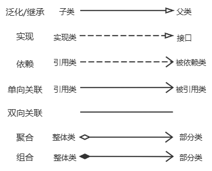

# 图

## 结构式建模图
> 结构式建模图（Structure diagrams）：强调的是系统式的建模。结构图定义了一个模型的静态架构。通常被用来对那些构成模型的‘要素’建模，如：类，对象，接口和物理组件。另外，也可用来对元素间关联和依赖关系进行建模。

### 类图(Class Diagram)
描述系统中类的静态结构。不仅定义系统中的类，表示类之间的联系如关联、依赖、聚合等，也包括类的内部结构(类的属性和操作)。类图是以类为中心来组织的，类图中的其他元素或属于某个类或与类相关联

**可见性**

- 公共的 public（`+`）
- 私有的 private（`-`）
- 保护的 protected（`#`）
- 包 package（`~`）

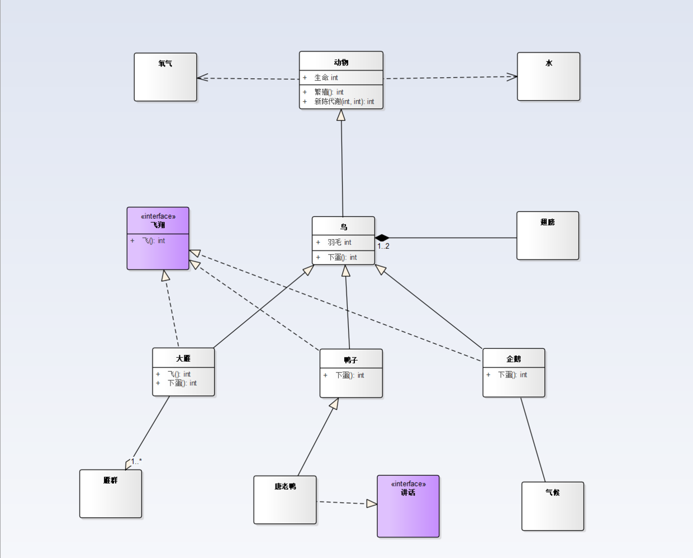

### 对象图(Object Diagram)
对象图是类图的实例，几乎使用与类图完全相同的标识。他们的不同点在于对象图显示类的多个对象实例，而不是实际的类     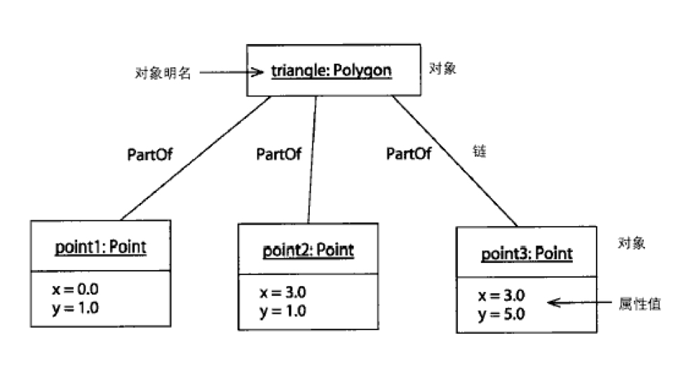

### 构件图(Component Diagram)
构件图是用来表示系统中构件与构件之间，类或接口与构件之间的关系图。其中，构件图之间的关系表现为依赖关系，定义类或接口与类之间的关系表现为依赖关系或实现关系。     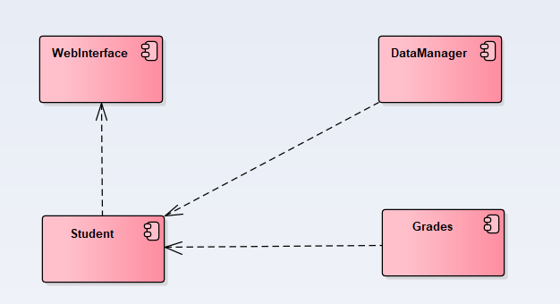

### 部署图(Deployment Diagram)
部署视图描述位于节点实例上的运行构件实例的安排。节点是一组运行资源，如计算机、设备或存储器。这个视图允许评估分配结果和资源分配     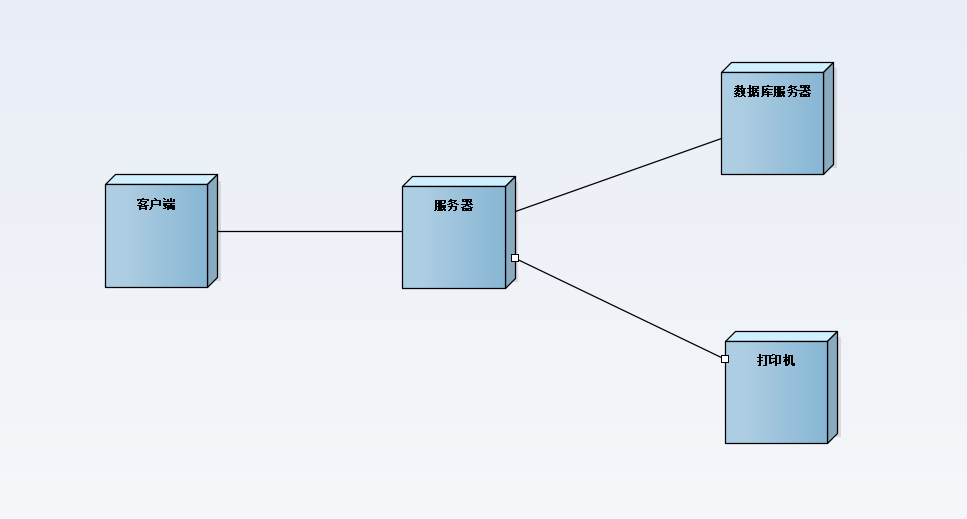

## 行为式建模图
> 行为式建模图（Behavior diagrams）强调系统模型中触发的事。行为图用来记录在一个模型内部，随时间的变化，模型执行的交互变化和瞬间的状态；并跟踪系统在真实环境下如何表现，以及观察系统对一个操作或事件的反应，以及它的结果。

### 用例图(Use Case Diagram)
从用户角度描述系统功能， 是用户所能观察到的系统功能的模型图，用例是系统中的一个功能单元，描述人们如何使用一个系统。     用例图包含六个元素：参与者 (Actor)、用例(Use Case)、关联关系(Association)、包含关系(Include)、扩展关系(Extend)以及泛化关系 (Generalization)。     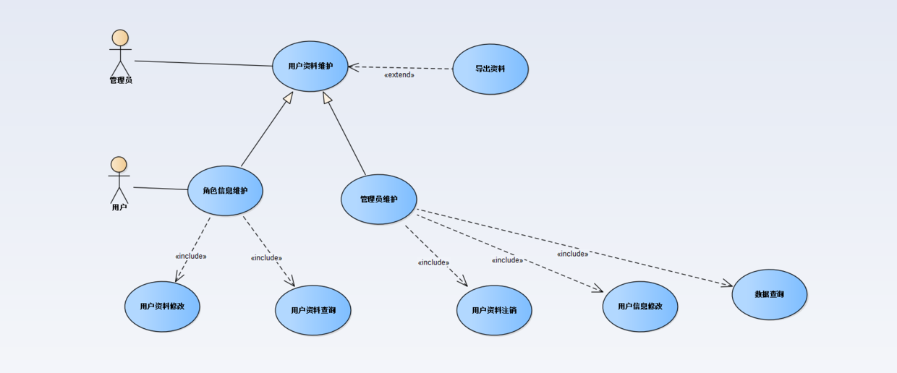

### 顺序图(Sequence Diagram)
顺序图显示对象之间的动态合作关系，它强调对象之间消息发送的顺序，同时显示对象之间的交互     用来表示用例中的行为顺序。当执行一个用例行为时，顺序图中的每条消息对应了一个类操作或引起状态转换的触发事件     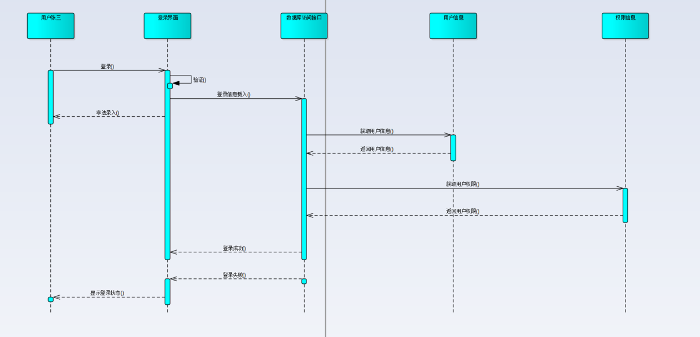

### 协作图(Collaboration Diagram)
协作图描述对象间的协作关系，协作图跟顺序图相似，显示对象间的动态合作关系。除显示信息交换外，协作图还显示对象以及它们之间的关系。     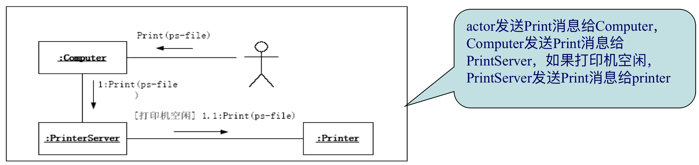

### 状态图(State Chart Diagram)
状态图是一个类对象所可能经历的所有历程的模型图。状态图由对象的各个状态和连接这些状态的转换组成     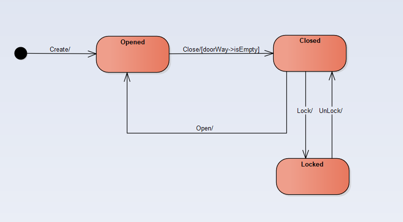

### 活动图(Activity Diagram)
活动图是状态图的一个变体，用来描述执行算法的工作流程中涉及的活动。描述了一组顺序的或并发的活动     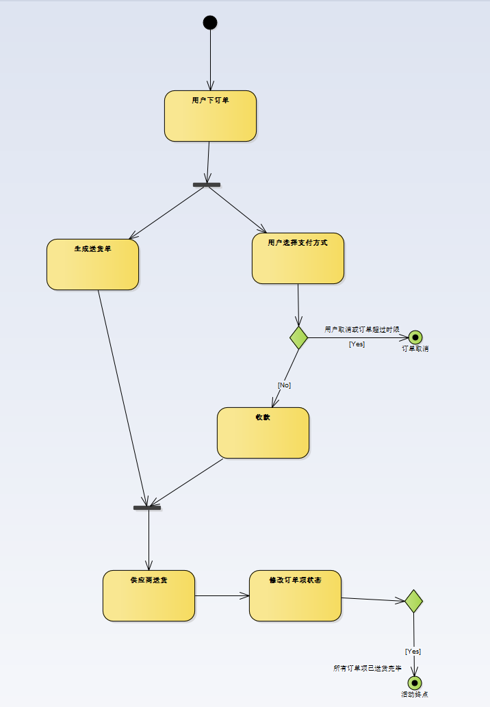

# 概要

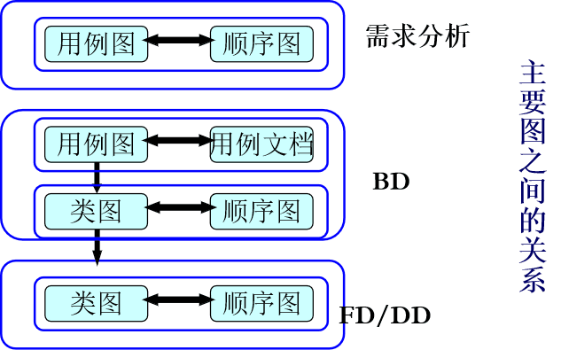

语法描述     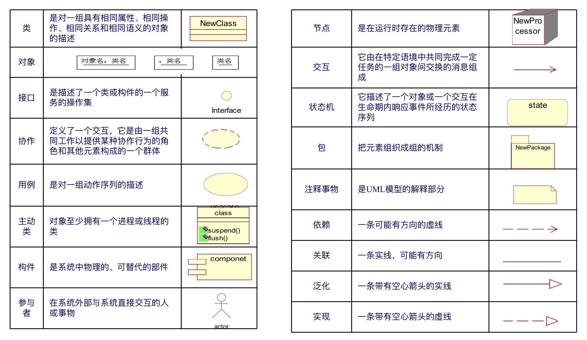

