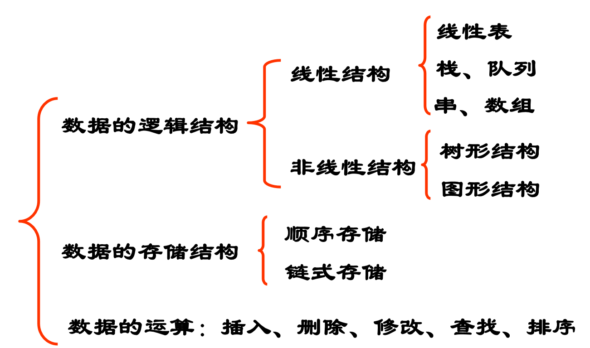
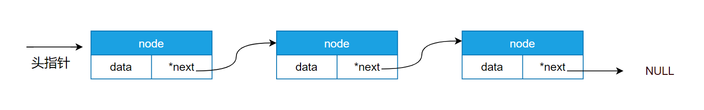
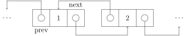
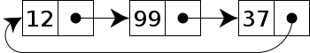
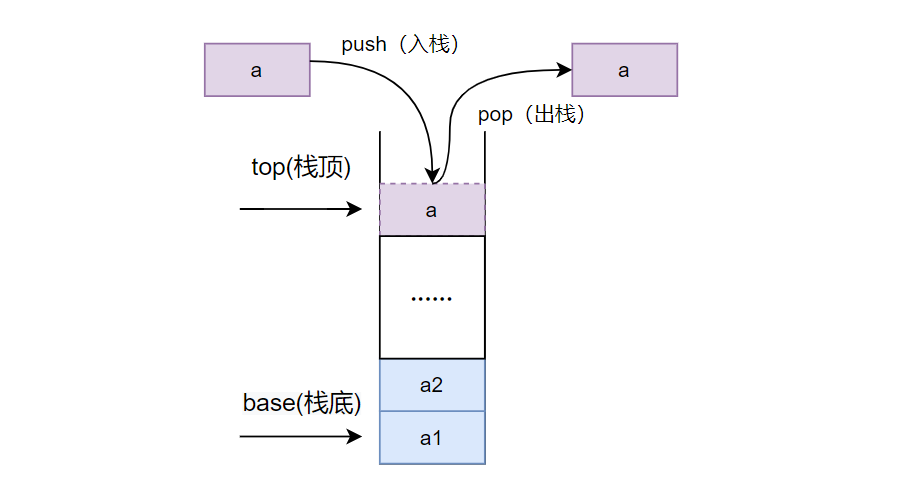

​

数据结构（Data Structure）：相互之间存在一种或多种特定关系的数据元素的集合。  <br />  

- 顺序存储结构——借助元素在存储器中的相对位置来表示数据元素间的逻辑关系
- 链式存储结构——借助指示元素存储地址的指针表示数据元素间的逻辑关系
- 索引存储结构——字典中单词存储关系
- 散列存储结构——地址与散列函数之间建立的一种映射


  <br />  


# 基本数据结构
​  <br />  

## 数组（Array）

  <br />  由相同类型的元素（element）的集合所组成的数据结构，分配一块连续的内存来存储。  <br />  利用元素的索引（index）可以计算出该元素对应的存储地址。  <br />  数组第一个元素的存储器地址称为第一地址或基础地址。  <br />  


## 链表（Linked list）
一种线性表，在每一个节点里存到下一个节点的指针(Pointer)  <br />  
  <br />  链表结构可以克服数组链表需要预先知道数据大小的缺点，充分利用计算机内存空间，实现灵活的内存动态管理。但是链表失去了数组随机读取的优点，同时链表由于增加了结点的指针域，空间开销比较大。  <br />  


### 单项链表
包含信息域和指针域。这个链接指向列表中的下一个节点，而最后一个节点则指向一个空值  <br />    <br />  
  <br />  **数组方式**
```c
typedef int Position;
typedef struct LNode *List;
struct LNode {
    ElementType Data[MAXSIZE];
    Position Last;
};
 
/* 初始化 */
List MakeEmpty()
{
    List L;
 
    L = (List)malloc(sizeof(struct LNode));
    L->Last = -1;
 
    return L;
}
 
/* 查找 */
#define ERROR -1
 
Position Find( List L, ElementType X )
{
    Position i = 0;
 
    while( i <= L->Last && L->Data[i]!= X )
        i++;
    if ( i > L->Last )  return ERROR; /* 如果没找到，返回错误信息 */
    else  return i;  /* 找到后返回的是存储位置 */
}
 
/* 插入 */
bool Insert( List L, ElementType X, Position P ) 
{ /* 在L的指定位置P前插入一个新元素X */
    Position i;
 
    if ( L->Last == MAXSIZE-1) {
        /* 表空间已满，不能插入 */
        printf("表满"); 
        return false; 
    }  
    if ( P<0 || P>L->Last+1 ) { /* 检查插入位置的合法性 */
        printf("位置不合法");
        return false; 
    } 
    for( i=L->Last; i>=P; i-- )
        L->Data[i+1] = L->Data[i]; /* 将位置P及以后的元素顺序向后移动 */
    L->Data[P] = X;  /* 新元素插入 */
    L->Last++;       /* Last仍指向最后元素 */
    return true; 
} 
 
/* 删除 */
bool Delete( List L, Position P )
{ /* 从L中删除指定位置P的元素 */
    Position i;
 
    if( P<0 || P>L->Last ) { /* 检查空表及删除位置的合法性 */
        printf("位置%d不存在元素", P ); 
        return false; 
    }
    for( i=P+1; i<=L->Last; i++ )
        L->Data[i-1] = L->Data[i]; /* 将位置P+1及以后的元素顺序向前移动 */
    L->Last--; /* Last仍指向最后元素 */
    return true;   
}
```
**指针方式**
```c
typedef struct LNode *PtrToLNode;
struct LNode {
    ElementType Data;
    PtrToLNode Next;
};
typedef PtrToLNode Position;
typedef PtrToLNode List;
 
/* 查找 */
#define ERROR NULL
 
Position Find( List L, ElementType X )
{
    Position p = L; /* p指向L的第1个结点 */
 
    while ( p && p->Data!=X )
        p = p->Next;
 
    /* 下列语句可以用 return p; 替换 */
    if ( p )
        return p;
    else
        return ERROR;
}
 
/* 带头结点的插入 */
bool Insert( List L, ElementType X, Position P )
{ /* 这里默认L有头结点 */
    Position tmp, pre;
 
    /* 查找P的前一个结点 */        
    for ( pre=L; pre&&pre->Next!=P; pre=pre->Next ) ;            
    if ( pre==NULL ) { /* P所指的结点不在L中 */
        printf("插入位置参数错误\n");
        return false;
    }
    else { /* 找到了P的前一个结点pre */
        /* 在P前插入新结点 */
        tmp = (Position)malloc(sizeof(struct LNode)); /* 申请、填装结点 */
        tmp->Data = X; 
        tmp->Next = P;
        pre->Next = tmp;
        return true;
    }
}
 
/* 带头结点的删除 */
bool Delete( List L, Position P )
{ /* 这里默认L有头结点 */
    Position tmp, pre;
 
    /* 查找P的前一个结点 */        
    for ( pre=L; pre&&pre->Next!=P; pre=pre->Next ) ;            
    if ( pre==NULL || P==NULL) { /* P所指的结点不在L中 */
        printf("删除位置参数错误\n");
        return false;
    }
    else { /* 找到了P的前一个结点pre */
        /* 将P位置的结点删除 */
        pre->Next = P->Next;
        free(P);
        return true;
    }
}
```

  <br />  


### 双向链表
双向链表有数据域和指针域。指针域有左右（或上一个、下一个）之分，用来连接上一个结点、当前结点、下一个结点。  <br />    <br />  


### 循环链表
首节点和末节点被连接在一起  <br />    <br />  
  <br />  
  <br />  


## Stack
只允许在有序的线性资料集合的一端（栈顶端，top）进行加入数据（压栈，push）和移除数据（弹栈，pop）的运算。  <br />  按照后进先出（LIFO, Last In First Out）的原理运作  <br />    <br />  **​**

**​**

**数组方式**
```c
typedef int Position;
struct SNode {
    ElementType *Data; /* 存储元素的数组 */
    Position Top;      /* 栈顶指针 */
    int MaxSize;       /* 堆栈最大容量 */
};
typedef struct SNode *Stack;
 
Stack CreateStack( int MaxSize )
{
    Stack S = (Stack)malloc(sizeof(struct SNode));
    S->Data = (ElementType *)malloc(MaxSize * sizeof(ElementType));
    S->Top = -1;
    S->MaxSize = MaxSize;
    return S;
}
 
bool IsFull( Stack S )
{
    return (S->Top == S->MaxSize-1);
}
 
bool Push( Stack S, ElementType X )
{
    if ( IsFull(S) ) {
        printf("堆栈满");
        return false;
    }
    else {
        S->Data[++(S->Top)] = X;
        return true;
    }
}
 
bool IsEmpty( Stack S )
{
    return (S->Top == -1);
}
 
ElementType Pop( Stack S )
{
    if ( IsEmpty(S) ) {
        printf("堆栈空");
        return ERROR; /* ERROR是ElementType的特殊值，标志错误 */
    }
    else 
        return ( S->Data[(S->Top)--] );
}
```
**链表方式**
```c
typedef struct SNode *PtrToSNode;
struct SNode {
    ElementType Data;
    PtrToSNode Next;
};
typedef PtrToSNode Stack;
 
Stack CreateStack( ) 
{ /* 构建一个堆栈的头结点，返回该结点指针 */
    Stack S;
 
    S = (Stack)malloc(sizeof(struct SNode));
    S->Next = NULL;
    return S;
}
 
bool IsEmpty ( Stack S )
{ /* 判断堆栈S是否为空，若是返回true；否则返回false */
    return ( S->Next == NULL );
}
 
bool Push( Stack S, ElementType X )
{ /* 将元素X压入堆栈S */
    PtrToSNode TmpCell;
 
    TmpCell = (PtrToSNode)malloc(sizeof(struct SNode));
    TmpCell->Data = X;
    TmpCell->Next = S->Next;
    S->Next = TmpCell;
    return true;
}
 
ElementType Pop( Stack S )  
{ /* 删除并返回堆栈S的栈顶元素 */
    PtrToSNode FirstCell;
    ElementType TopElem;
 
    if( IsEmpty(S) ) {
        printf("堆栈空"); 
        return ERROR;
    }
    else {
        FirstCell = S->Next; 
        TopElem = FirstCell->Data;
        S->Next = FirstCell->Next;
        free(FirstCell);
        return TopElem;
    }
}
```

## Queue
**​**

先进先出（FIFO, First-In-First-Out）的线性表。  <br />  只允许在后端（rear）进行插入操作，在前端（front）进行删除操作。  <br />    <br />  **​**

**数组方式**
```c
typedef int Position;
struct QNode {
    ElementType *Data;     /* 存储元素的数组 */
    Position Front, Rear;  /* 队列的头、尾指针 */
    int MaxSize;           /* 队列最大容量 */
};
typedef struct QNode *Queue;
 
Queue CreateQueue( int MaxSize )
{
    Queue Q = (Queue)malloc(sizeof(struct QNode));
    Q->Data = (ElementType *)malloc(MaxSize * sizeof(ElementType));
    Q->Front = Q->Rear = 0;
    Q->MaxSize = MaxSize;
    return Q;
}
 
bool IsFull( Queue Q )
{
    return ((Q->Rear+1)%Q->MaxSize == Q->Front);
}
 
bool AddQ( Queue Q, ElementType X )
{
    if ( IsFull(Q) ) {
        printf("队列满");
        return false;
    }
    else {
        Q->Rear = (Q->Rear+1)%Q->MaxSize;
        Q->Data[Q->Rear] = X;
        return true;
    }
}
 
bool IsEmpty( Queue Q )
{
    return (Q->Front == Q->Rear);
}
 
ElementType DeleteQ( Queue Q )
{
    if ( IsEmpty(Q) ) { 
        printf("队列空");
        return ERROR;
    }
    else  {
        Q->Front =(Q->Front+1)%Q->MaxSize;
        return  Q->Data[Q->Front];
    }
}
```
**链表方式**
```c
typedef struct Node *PtrToNode;
struct Node { /* 队列中的结点 */
    ElementType Data;
    PtrToNode Next;
};
typedef PtrToNode Position;
 
struct QNode {
    Position Front, Rear;  /* 队列的头、尾指针 */
    int MaxSize;           /* 队列最大容量 */
};
typedef struct QNode *Queue;
 
bool IsEmpty( Queue Q )
{
    return ( Q->Front == NULL);
}
 
ElementType DeleteQ( Queue Q )
{
    Position FrontCell; 
    ElementType FrontElem;
     
    if  ( IsEmpty(Q) ) {
        printf("队列空");
        return ERROR;
    }
    else {
        FrontCell = Q->Front;
        if ( Q->Front == Q->Rear ) /* 若队列只有一个元素 */
            Q->Front = Q->Rear = NULL; /* 删除后队列置为空 */
        else                     
            Q->Front = Q->Front->Next;
        FrontElem = FrontCell->Data;
 
        free( FrontCell );  /* 释放被删除结点空间  */
        return  FrontElem;
    }
}
```


### 循环队列
```cpp
class MyCircularQueue {
    
private:
    vector<int> data;
    int head;
    int tail;
    int size;
public:
    /** Initialize your data structure here. Set the size of the queue to be k. */
    MyCircularQueue(int k) {
        data.resize(k);
        head = -1;
        tail = -1;
        size = k;
    }
    
    /** Insert an element into the circular queue. Return true if the operation is successful. */
    bool enQueue(int value) {
        if (isFull()) {
            return false;
        }
        if (isEmpty()) {
            head = 0;
        }
        tail = (tail + 1) % size;
        data[tail] = value;
        return true;
    }
    
    /** Delete an element from the circular queue. Return true if the operation is successful. */
    bool deQueue() {
        if (isEmpty()) {
            return false;
        }
        if (head == tail) {
            head = -1;
            tail = -1;
            return true;
        }
        head = (head + 1) % size;
        return true;
    }
    
    /** Get the front item from the queue. */
    int Front() {
        if (isEmpty()) {
            return -1;
        }
        return data[head];
    }
    
    /** Get the last item from the queue. */
    int Rear() {
        if (isEmpty()) {
            return -1;
        }
        return data[tail];
    }
    
    /** Checks whether the circular queue is empty or not. */
    bool isEmpty() {
        return head == -1;
    }
    
    /** Checks whether the circular queue is full or not. */
    bool isFull() {
        return ((tail + 1) % size) == head;
    }
};
```

  <br />  


### 优先队列 PriorityQueue
```c
/* Ascending priority queue using Linked List */
/*A priority queue is a special type of queue in which each element is
associated with a priority and is served according to its priority. If elements
with the same priority occur, they are served according to their order in the
queue.
Generally, the value of the element itself is considered for assigning the
priority.
For example: The element with the highest value is considered as the highest
priority element. However, in other cases, we can assume the element with the
lowest value as the highest priority element. In other cases, we can set
priorities according to our needs.
In a queue, the first-in-first-out rule is implemented whereas, in a priority
queue, the values are removed on the basis of priority. The element with the
highest priority is removed first.
insert() - Would insert an element in a queue
delete() -  Would delete the smallest element in the queue
*/
#include <stdio.h>
#include <stdlib.h>
#define NULL ((void *)0)
struct node
{
    int data;
    struct node *next;
};
struct node *front, *rear;
/* This function initializes the queue to empty by making both front and rear as
 * NULL */
void createqueue() { front = rear = NULL; }
int empty()
{
    if (front == NULL)
        return 1;
    else
        return 0;
}
void insert(int x)
{
    struct node *pnode;
    pnode = (struct node *)malloc(sizeof(struct node));
    if (pnode == NULL)
    {
        printf("Memory overflow. Unable to insert.\n");
        exit(1);
    }
    pnode->data = x;
    pnode->next = NULL; /* New node is always last node */
    if (empty())
        front = rear = pnode;
    else
    {
        rear->next = pnode;
        rear = pnode;
    }
}
int removes()
{
    int min;
    struct node *follow, *follow1, *p, *p1;
    if (empty())
    {
        printf("\nQueue Underflow. Unable to remove.");
        exit(1);
    }
    /* finding the node with minimum value in the APQ.*/
    p = p1 = front;
    follow = follow1 = NULL;
    min = front->data;
    while (p != NULL)
    {
        if (p->data < min)
        {
            min = p->data;
            follow1 = follow;
            p1 = p;
        }
        follow = p;
        p = p->next;
    }
    /* Deleting the node with min value */
    if (p1 == front) /* deleting first node.*/
    {
        front = front->next;
        if (front == NULL) /* Deleting the only one node */
            rear = NULL;
    }
    else if (p1 == rear) /* Deleting last node */
    {
        rear = follow1;
        rear->next = NULL;
    }
    else /* deleting any other node.*/
        follow1->next = p1->next;
    free(p1);
    return min; /* DONT FORGET LAST 2 STATEMENTS.*/
}
void show()
{
    struct node *p;
    if (empty())
        printf("Queue empty. No data to display \n");
    else
    {
        printf("Queue from front to rear is as shown: \n");
        p = front;
        while (p != NULL)
        {
            printf("%d ", p->data);
            p = p->next;
        }
        printf("\n");
    }
}
void destroyqueue() { front = rear = NULL; }
int main()
{
    int x, ch;
    createqueue();
    do
    {
        printf("\n\n  Menu: \n");
        printf("1:Insert \n");
        printf("2:Remove \n");
        printf("3:exit \n");
        printf("Enter your choice: ");
        scanf("%d", &ch);
        switch (ch)
        {
        case 1:
            printf("Enter element to be inserted: ");
            scanf("%d", &x);
            insert(x);
            show();
            break;
        case 2:
            x = removes();
            printf("Element removed is: %d\n", x);
            show();
            break;
        case 3:
            break;
        }
    } while (ch != 3);
    destroyqueue();
    return 0;
}
```

  <br />  
  <br />  ​

​  <br />  

# Resource

- [The Algorithms](https://github.com/TheAlgorithms)
- [labuladong 的算法小抄](https://labuladong.gitee.io/algo/)
- [CS-Xmind-Note](https://github.com/SSHeRun/CS-Xmind-Note)


  <br />  可视化

- [visualising data structures and algorithms through animation](https://visualgo.net/en)
- [Data Structure Visualization](https://www.cs.usfca.edu/~galles/visualization/Algorithms.html)

  <br />   
