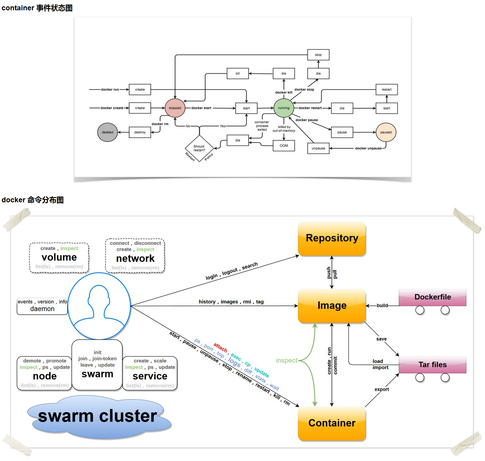
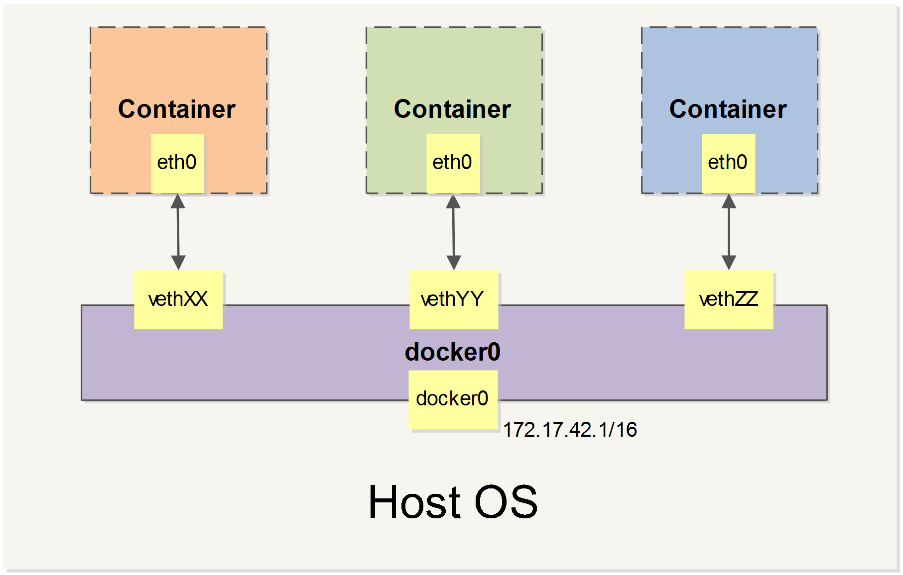
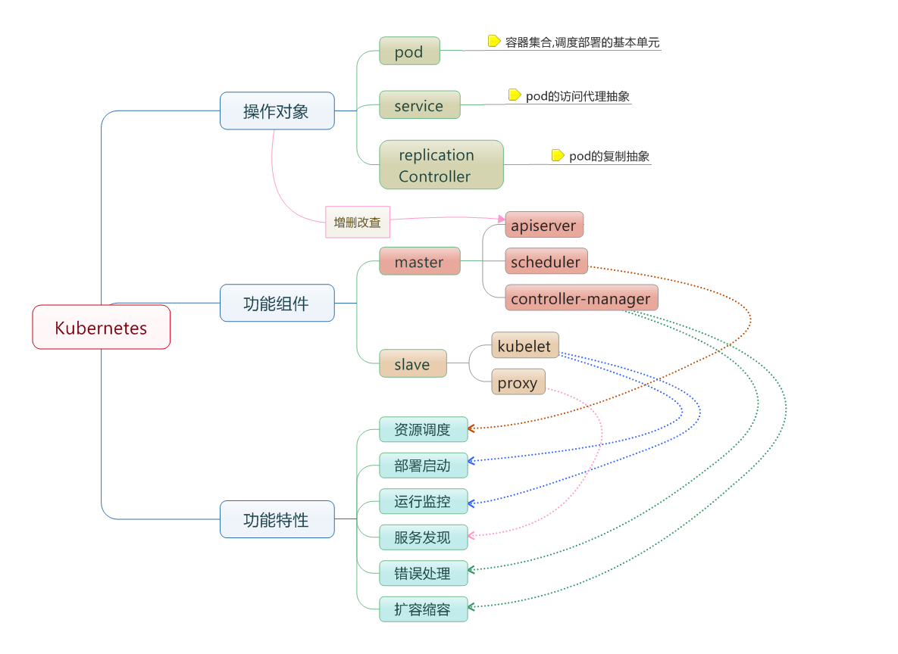

# —— [Docker](https://www.docker.com/)  ——

  <br />  一个开源的应用容器引擎，遵从 Apache2.0 协议开源。由 [Go 语言](https://golang.google.cn/) 进行开发实现，基于 Linux 内核的 [cgroup](https://zh.wikipedia.org/wiki/Cgroups)，[namespace](https://en.wikipedia.org/wiki/Linux_namespaces)，以及 [OverlayFS](https://docs.docker.com/storage/storagedriver/overlayfs-driver/) 类的 [Union FS](https://en.wikipedia.org/wiki/Union_mount) 等技术，对进程进行封装隔离，属于 [操作系统层面的虚拟化技术](https://en.wikipedia.org/wiki/Operating-system-level_virtualization)。  <br />  让开发者打包他们的应用以及依赖包到一个轻量级、可移植的容器中，然后发布到任何流行的 Linux 机器上，也可以实现虚拟化。  <br />  ​

版本

- CE（Community Edition，社区版）
- EE（Enterprise Edition，企业版）

​

基本概念

- 镜像（Image）：相当于是一个 root 文件系统
- 容器（Container）：镜像（Image）和容器（Container）的关系，就像是面向对象程序设计中的类和实例一样，镜像是静态的定义，容器是镜像运行时的实体。容器可以被创建、启动、停止、删除、暂停等。
- 仓库（Repository）：镜像控制中心
   - [Docker Hub](https://hub.docker.com/)
   - [阿里云加速器](https://www.aliyun.com/product/acr?source=5176.11533457&userCode=8lx5zmtu)、[DaoCloud 加速器](https://www.daocloud.io/mirror#accelerator-doc)

​

​

Resource

- [docker_practice](https://github.com/yeasy/docker_practice)

​

  <br />  


| Command | Description |
| --- | --- |
| [docker attach](https://docs.docker.com/engine/reference/commandline/attach/) | Attach local standard input, output, and error streams to a running container |
| [docker build](https://docs.docker.com/engine/reference/commandline/build/) | Build an image from a Dockerfile |
| [docker builder](https://docs.docker.com/engine/reference/commandline/builder/) | Manage builds |
| [docker checkpoint](https://docs.docker.com/engine/reference/commandline/checkpoint/) | Manage checkpoints |
| [docker commit](https://docs.docker.com/engine/reference/commandline/commit/) | Create a new image from a container’s changes |
| [docker config](https://docs.docker.com/engine/reference/commandline/config/) | Manage Docker configs |
| [docker container](https://docs.docker.com/engine/reference/commandline/container/) | Manage containers |
| [docker context](https://docs.docker.com/engine/reference/commandline/context/) | Manage contexts |
| [docker cp](https://docs.docker.com/engine/reference/commandline/cp/) | Copy files/folders between a container and the local filesystem |
| [docker create](https://docs.docker.com/engine/reference/commandline/create/) | Create a new container |
| [docker diff](https://docs.docker.com/engine/reference/commandline/diff/) | Inspect changes to files or directories on a container’s filesystem |
| [docker events](https://docs.docker.com/engine/reference/commandline/events/) | Get real time events from the server |
| [docker exec](https://docs.docker.com/engine/reference/commandline/exec/) | Run a command in a running container |
| [docker export](https://docs.docker.com/engine/reference/commandline/export/) | Export a container’s filesystem as a tar archive |
| [docker history](https://docs.docker.com/engine/reference/commandline/history/) | Show the history of an image |
| [docker image](https://docs.docker.com/engine/reference/commandline/image/) | Manage images |
| [docker images](https://docs.docker.com/engine/reference/commandline/images/) | List images |
| [docker import](https://docs.docker.com/engine/reference/commandline/import/) | Import the contents from a tarball to create a filesystem image |
| [docker info](https://docs.docker.com/engine/reference/commandline/info/) | Display system-wide information |
| [docker inspect](https://docs.docker.com/engine/reference/commandline/inspect/) | Return low-level information on Docker objects |
| [docker kill](https://docs.docker.com/engine/reference/commandline/kill/) | Kill one or more running containers |
| [docker load](https://docs.docker.com/engine/reference/commandline/load/) | Load an image from a tar archive or STDIN |
| [docker login](https://docs.docker.com/engine/reference/commandline/login/) | Log in to a Docker registry |
| [docker logout](https://docs.docker.com/engine/reference/commandline/logout/) | Log out from a Docker registry |
| [docker logs](https://docs.docker.com/engine/reference/commandline/logs/) | Fetch the logs of a container |
| [docker manifest](https://docs.docker.com/engine/reference/commandline/manifest/) | Manage Docker image manifests and manifest lists |
| [docker network](https://docs.docker.com/engine/reference/commandline/network/) | Manage networks |
| [docker node](https://docs.docker.com/engine/reference/commandline/node/) | Manage Swarm nodes |
| [docker pause](https://docs.docker.com/engine/reference/commandline/pause/) | Pause all processes within one or more containers |
| [docker plugin](https://docs.docker.com/engine/reference/commandline/plugin/) | Manage plugins |
| [docker port](https://docs.docker.com/engine/reference/commandline/port/) | List port mappings or a specific mapping for the container |
| [docker ps](https://docs.docker.com/engine/reference/commandline/ps/) | List containers |
| [docker pull](https://docs.docker.com/engine/reference/commandline/pull/) | Pull an image or a repository from a registry |
| [docker push](https://docs.docker.com/engine/reference/commandline/push/) | Push an image or a repository to a registry |
| [docker rename](https://docs.docker.com/engine/reference/commandline/rename/) | Rename a container |
| [docker restart](https://docs.docker.com/engine/reference/commandline/restart/) | Restart one or more containers |
| [docker rm](https://docs.docker.com/engine/reference/commandline/rm/) | Remove one or more containers |
| [docker rmi](https://docs.docker.com/engine/reference/commandline/rmi/) | Remove one or more images |
| [docker run](https://docs.docker.com/engine/reference/commandline/run/) | Run a command in a new container |
| [docker save](https://docs.docker.com/engine/reference/commandline/save/) | Save one or more images to a tar archive (streamed to STDOUT by default) |
| [docker search](https://docs.docker.com/engine/reference/commandline/search/) | Search the Docker Hub for images |
| [docker secret](https://docs.docker.com/engine/reference/commandline/secret/) | Manage Docker secrets |
| [docker service](https://docs.docker.com/engine/reference/commandline/service/) | Manage services |
| [docker stack](https://docs.docker.com/engine/reference/commandline/stack/) | Manage Docker stacks |
| [docker start](https://docs.docker.com/engine/reference/commandline/start/) | Start one or more stopped containers |
| [docker stats](https://docs.docker.com/engine/reference/commandline/stats/) | Display a live stream of container(s) resource usage statistics |
| [docker stop](https://docs.docker.com/engine/reference/commandline/stop/) | Stop one or more running containers |
| [docker swarm](https://docs.docker.com/engine/reference/commandline/swarm/) | Manage Swarm |
| [docker system](https://docs.docker.com/engine/reference/commandline/system/) | Manage Docker |
| [docker tag](https://docs.docker.com/engine/reference/commandline/tag/) | Create a tag TARGET_IMAGE that refers to SOURCE_IMAGE |
| [docker top](https://docs.docker.com/engine/reference/commandline/top/) | Display the running processes of a container |
| [docker trust](https://docs.docker.com/engine/reference/commandline/trust/) | Manage trust on Docker images |
| [docker unpause](https://docs.docker.com/engine/reference/commandline/unpause/) | Unpause all processes within one or more containers |
| [docker update](https://docs.docker.com/engine/reference/commandline/update/) | Update configuration of one or more containers |
| [docker version](https://docs.docker.com/engine/reference/commandline/version/) | Show the Docker version information |
| [docker volume](https://docs.docker.com/engine/reference/commandline/volume/) | Manage volumes |
| [docker wait](https://docs.docker.com/engine/reference/commandline/wait/) | Block until one or more containers stop, then print their exit codes |

​  <br />  

# 安装

  <br />  [Install on Ubuntu](https://docs.docker.com/engine/install/ubuntu/)
```shell
1 Uninstall old versions
sudo apt-get remove docker docker-engine docker.io containerd runc

2 Install using the repository
# 添加使用 HTTPS 传输的软件包以及 CA 证书
sudo apt-get update
sudo sudo apt-get install \
    ca-certificates \
    curl \
    gnupg \
    lsb-release
    
# 添加软件源的 GPG 密钥
curl -fsSL https://download.docker.com/linux/ubuntu/gpg | sudo gpg --dearmor -o /usr/share/keyrings/docker-archive-keyring.gpg

# 向 sources.list 中添加 Docker 软件源
echo \
  "deb [arch=$(dpkg --print-architecture) signed-by=/usr/share/keyrings/docker-archive-keyring.gpg] https://download.docker.com/linux/ubuntu \
  $(lsb_release -cs) stable" | sudo tee /etc/apt/sources.list.d/docker.list > /dev/null
      
3 INSTALL DOCKER ENGINE
sudo apt-get update
sudo apt-get install docker-ce docker-ce-cli containerd.io

sudo apt-get install docker-ce=<VERSION_STRING> docker-ce-cli=<VERSION_STRING> containerd.io
```
​

使用安装脚本自动安装
```shell
curl -fsSL https://get.docker.com -o get-docker.sh
sudo sh get-docker.sh
```
​

卸载
```shell
sudo apt-get purge docker-ce docker-ce-cli containerd.io
sudo rm -rf /var/lib/docker
sudo rm -rf /var/lib/containerd
```
​

ubuntu下docker配置国内镜像源
```shell
/etc/docker/daemon.json
中国科技大学的镜像源
{
    "registry-mirrors": ["https://docker.mirrors.ustc.edu.cn"]
}
163镜像
 "registry-mirrors": ["http://hub-mirror.c.163.com"]
 
 私服的方式拉取镜像（添加配置）
{
	"registry-mirrors":["https://registry.docker-cn.com"],
	"insecure-registries":["ip:port"]
}
 
 
 systemctl daemon-reload
 systemctl restart docker    重启
 docker info    确认信息
```

  <br />  
  <br />  


# 镜像管理
​

**虚悬镜像(dangling image)** ：由于新旧镜像同名，旧镜像名称被取消，从而出现仓库名、标签均为 <none> 的镜像
```shell
docker image ls -f dangling=true
REPOSITORY          TAG                 IMAGE ID            CREATED             SIZE
<none>              <none>              00285df0df87        5 days ago          342 MB

# 删除
docker image prune
```


| Command | Description |
| --- | --- |
| [docker image build](https://docs.docker.com/engine/reference/commandline/image_build/) | Build an image from a Dockerfile |
| [docker image history](https://docs.docker.com/engine/reference/commandline/image_history/) | Show the history of an image |
| [docker image import](https://docs.docker.com/engine/reference/commandline/image_import/) | Import the contents from a tarball to create a filesystem image |
| [docker image inspect](https://docs.docker.com/engine/reference/commandline/image_inspect/) | Display detailed information on one or more images |
| [docker image load](https://docs.docker.com/engine/reference/commandline/image_load/) | Load an image from a tar archive or STDIN |
| [docker image ls](https://docs.docker.com/engine/reference/commandline/image_ls/) | List images |
| [docker image prune](https://docs.docker.com/engine/reference/commandline/image_prune/) | Remove unused images |
| [docker image pull](https://docs.docker.com/engine/reference/commandline/image_pull/) | Pull an image or a repository from a registry |
| [docker image push](https://docs.docker.com/engine/reference/commandline/image_push/) | Push an image or a repository to a registry |
| [docker image rm](https://docs.docker.com/engine/reference/commandline/image_rm/) | Remove one or more images |
| [docker image save](https://docs.docker.com/engine/reference/commandline/image_save/) | Save one or more images to a tar archive (streamed to STDOUT by default) |
| [docker image tag](https://docs.docker.com/engine/reference/commandline/image_tag/) | Create a tag TARGET_IMAGE that refers to SOURCE_IMAGE |

`docker info [OPTIONS]`

- --format , -f		Format the output using the given Go template

`docker rmi [OPTIONS] IMAGE [IMAGE...]`	删除镜像

- --force , -f		Force removal of the image
- --no-prune		Do not delete untagged parents

`docker tag SOURCE_IMAGE[:TAG] TARGET_IMAGE[:TAG]`	修改本地镜像的标签  <br />  docker build [OPTIONS] PATH | URL | 	 -		Build an image from a Dockerfile

- -f, --file string             Name of the Dockerfile (Default is 'PATH/Dockerfile')
- -t, --tag list                Name and optionally a tag in the 'name:tag' format

尾部记得加** .**  <br />  docker history [OPTIONS] IMAGE

- --format string   Pretty-print images using a Go template
- -H, --human           Print sizes and dates in human readable format (default true)
- --no-trunc        Don't truncate output
- -q, --quiet           Only show numeric IDs

docker save IMAGE [IMAGE...]	将制定镜像保存成tar文件  <br />  docker load [OPTIONS]	从tar中恢复镜像

- -i, --input string   Read from tar archive file, instead of STDIN
- -q, --quiet          Suppress the load output

## 镜像仓库操作
docker pull [OPTIONS] NAME[:TAG|@DIGEST]	拉取镜像

- -a, --all-tags                Download all tagged images in the repository
- -q, --quiet                   Suppress verbose output

docker push NAME[:TAG]  <br />  docker search [OPTIONS] TERM	查询镜像

- --filter , -f		Filter output based on conditions provided
- --format		Pretty-print search using a Go template
- --limit			Max number of search results
- --no-trunc		Don’t truncate output

docker login [OPTIONS] [SERVER]

- -p, --password string   Password
- --password-stdin    Take the password from stdin
- -u, --username string   Username

docker logout [SERVER]  <br />  
  <br />  


# 数据管理

- 数据卷（Volumes）

一个可供一个或多个容器使用的特殊目录，它绕过 UFS，可以提供很多有用的特性：

- 数据卷 可以在容器之间共享和重用
- 对 数据卷 的修改会立马生效
- 对 数据卷 的更新，不会影响镜像
- 数据卷 默认会一直存在，即使容器被删除

​  <br />  

| Command | Description |
| --- | --- |
| [docker volume create](https://docs.docker.com/engine/reference/commandline/volume_create/) | Create a volume |
| [docker volume inspect](https://docs.docker.com/engine/reference/commandline/volume_inspect/) | Display detailed information on one or more volumes |
| [docker volume ls](https://docs.docker.com/engine/reference/commandline/volume_ls/) | List volumes |
| [docker volume prune](https://docs.docker.com/engine/reference/commandline/volume_prune/) | Remove all unused local volumes |
| [docker volume rm](https://docs.docker.com/engine/reference/commandline/volume_rm/) | Remove one or more volumes |

​  <br />  

- 挂载主机目录 (Bind mounts)


```shell
docker run -d -P \
  --name web \
  # -v /src/webapp:/usr/share/nginx/html \
  --mount type=bind,source=/src/webapp,target=/usr/share/nginx/html \
  nginx:alpine
```

  <br />  
  <br />  
  <br />  
  <br />  


# 容器
| Command | Description |
| --- | --- |
| [docker container attach](https://docs.docker.com/engine/reference/commandline/container_attach/) | Attach local standard input, output, and error streams to a running container |
| [docker container commit](https://docs.docker.com/engine/reference/commandline/container_commit/) | Create a new image from a container’s changes |
| [docker container cp](https://docs.docker.com/engine/reference/commandline/container_cp/) | Copy files/folders between a container and the local filesystem |
| [docker container create](https://docs.docker.com/engine/reference/commandline/container_create/) | Create a new container |
| [docker container diff](https://docs.docker.com/engine/reference/commandline/container_diff/) | Inspect changes to files or directories on a container’s filesystem |
| [docker container exec](https://docs.docker.com/engine/reference/commandline/container_exec/) | Run a command in a running container |
| [docker container export](https://docs.docker.com/engine/reference/commandline/container_export/) | Export a container’s filesystem as a tar archive |
| [docker container inspect](https://docs.docker.com/engine/reference/commandline/container_inspect/) | Display detailed information on one or more containers |
| [docker container kill](https://docs.docker.com/engine/reference/commandline/container_kill/) | Kill one or more running containers |
| [docker container logs](https://docs.docker.com/engine/reference/commandline/container_logs/) | Fetch the logs of a container |
| [docker container ls](https://docs.docker.com/engine/reference/commandline/container_ls/) | List containers |
| [docker container pause](https://docs.docker.com/engine/reference/commandline/container_pause/) | Pause all processes within one or more containers |
| [docker container port](https://docs.docker.com/engine/reference/commandline/container_port/) | List port mappings or a specific mapping for the container |
| [docker container prune](https://docs.docker.com/engine/reference/commandline/container_prune/) | Remove all stopped containers |
| [docker container rename](https://docs.docker.com/engine/reference/commandline/container_rename/) | Rename a container |
| [docker container restart](https://docs.docker.com/engine/reference/commandline/container_restart/) | Restart one or more containers |
| [docker container rm](https://docs.docker.com/engine/reference/commandline/container_rm/) | Remove one or more containers |
| [docker container run](https://docs.docker.com/engine/reference/commandline/container_run/) | Run a command in a new container |
| [docker container start](https://docs.docker.com/engine/reference/commandline/container_start/) | Start one or more stopped containers |
| [docker container stats](https://docs.docker.com/engine/reference/commandline/container_stats/) | Display a live stream of container(s) resource usage statistics |
| [docker container stop](https://docs.docker.com/engine/reference/commandline/container_stop/) | Stop one or more running containers |
| [docker container top](https://docs.docker.com/engine/reference/commandline/container_top/) | Display the running processes of a container |
| [docker container unpause](https://docs.docker.com/engine/reference/commandline/container_unpause/) | Unpause all processes within one or more containers |
| [docker container update](https://docs.docker.com/engine/reference/commandline/container_update/) | Update configuration of one or more containers |
| [docker container wait](https://docs.docker.com/engine/reference/commandline/container_wait/) | Block until one or more containers stop, then print their exit codes |

​


## 容器生命周期管理
docker run [OPTIONS] IMAGE[:TAG|@DIGEST] [COMMAND] [ARG...]

- -d, --detach                         Run container in background and print
- -i, --interactive                    Keep STDIN open even if not attached
- -t, --tty                            Allocate a pseudo-TTY
- -p, --publish list                   Publish a container's port(s) to the host
   - ip:hostPort:containerPort | ip::containerPort | hostPort:containerPort
- -P, --publish-all                    Publish all exposed ports to random ports
- --name string                    Assign a name to the container
- -a, --attach list                    Attach to STDIN, STDOUT or STDERR
- -h, --hostname string                Container host name
- -e, --env list                       Set environment variables
- -m, --memory bytes                   Memory limit
- --network network                Connect a container to a network
- -v, --volume list                 Bind mount a volume
- --volumes-from list              Mount volumes from the specified container(s)

-v	容器内路径		匿名挂载  <br />  -v	卷名:容器内路径		具名挂载  <br />  -v	/宿主机路径:容器内路径	指定路径挂载  <br />  
  <br />  
  <br />  exit：容器停止退出  <br />  Ctrl+P+Q：容器不停止退出。  <br />  ​

docker rm [OPTIONS] CONTAINER [CONTAINER...]

- --force , -f		Force the removal of a running container (uses SIGKILL)
- --link , -l		Remove the specified link
- --volumes , -v		Remove anonymous volumes associated with the container

docker start [OPTIONS] CONTAINER [CONTAINER...]  <br />  docker stop [--time , -t] CONTAINER [CONTAINER...]  <br />  docker restart [--time , -t] CONTAINER [CONTAINER...]  <br />  docker kill [--signal , -s] CONTAINER [CONTAINER...]  <br />  docker pause CONTAINER [CONTAINER...]  <br />  docker unpause CONTAINER [CONTAINER...]  <br />  docker create [OPTIONS] IMAGE [COMMAND] [ARG...]  <br />  docker exec [OPTIONS] CONTAINER COMMAND [ARG...]	进入容器后开启一个新的终端

- --detach , -d		Detached mode: run command in the background
- --detach-keys		Override the key sequence for detaching a container
- --env , -e		Set environment variables
- --interactive , -i		Keep STDIN open even if not attached
- --privileged		Give extended privileges to the command
- --tty , -t		Allocate a pseudo-TTY
- --user , -u		Username or UID (format: <name|uid>[:<group|gid>])
- --workdir , -w		Working directory inside the container

docker attach [OPTIONS] CONTAINER	进入容器正在执行的终端，不会启动新的进程

## 容器操作
docker port CONTAINER [PRIVATE_PORT[/PROTO]]	列出一个容器的端口映射情况  <br />  docker rename CONTAINER NEW_NAME  <br />  docker ps [OPTIONS]		列出容器

- --all , -a		Show all containers (default shows just running)
- --filter , -f		Filter output based on conditions provided
- --format		Pretty-print containers using a Go template
- --last , -n		Show n last created containers (includes all states)
- --latest , -l		Show the latest created container (includes all states)
- --no-trunc		Don’t truncate output
- --quiet , -q		Only display numeric IDs
- --size , -s		Display total file sizes

docker top CONTAINER [ps OPTIONS]	查看正在运行中的容器进程信息  <br />  docker inspect [OPTIONS] NAME|ID [NAME|ID...]	获取容器或镜像的元数据

- --format , -f		Format the output using the given Go template
- --size , -s		Display total file sizes if the type is container
- --type		Return JSON for specified type

docker logs [OPTIONS] CONTAINER	获取docker日志

- --details		Show extra details provided to logs
- --follow , -f		Follow log output
- --tail	all	Number of lines to show from the end of the logs
- --timestamps , -t		Show timestamps
- --since		Show logs since timestamp (e.g. 2013-01-02T13:23:37) or relative (e.g. 42m for 42 minutes)
- --until		Show logs before a timestamp (e.g. 2013-01-02T13:23:37) or relative (e.g. 42m for 42 minutes)

## 容器文件系统操作
docker diff CONTAINER	检查一个容器文件系统更改情况  <br />  docker cp [OPTIONS] CONTAINER:SRC_PATH DEST_PATH|-  <br />  docker cp [OPTIONS] SRC_PATH|- CONTAINER:DEST_PATH

- --archive , -a		Archive mode (copy all uid/gid information)
- --follow-link , -L		Always follow symbol link in SRC_PATH

docker commit [OPTIONS] CONTAINER [REPOSITORY[:TAG]]	提交一个容器的文件系统，使之生成一个新的镜像

- --author , -a		
- --change , -c		Apply Dockerfile instruction to the created image
- --message , -m		Commit message
- --pause , -p	true	Pause container during commit

​

​

​

​  <br />  

# Docker network
网络架构：容器网络模型（CNM）的方案

- CNM 是设计标准，规定了 Docker 网络架构的基础组成要素。
- Libnetwork 是 CNM 的具体实现，Libnetwork 通过 Go 语言编写，并实现了 CNM 中列举的核心组件。
- 驱动通过实现特定网络拓扑的方式来拓展该模型的能力。

  <br />  
  <br />  
  <br />  
  <br />    <br />  


| Command | Description |
| --- | --- |
| [docker network connect](https://docs.docker.com/engine/reference/commandline/network_connect/) | Connect a container to a network |
| [docker network create](https://docs.docker.com/engine/reference/commandline/network_create/) | Create a network |
| [docker network disconnect](https://docs.docker.com/engine/reference/commandline/network_disconnect/) | Disconnect a container from a network |
| [docker network inspect](https://docs.docker.com/engine/reference/commandline/network_inspect/) | Display detailed information on one or more networks |
| [docker network ls](https://docs.docker.com/engine/reference/commandline/network_ls/) | List networks |
| [docker network prune](https://docs.docker.com/engine/reference/commandline/network_prune/) | Remove all unused networks |
| [docker network rm](https://docs.docker.com/engine/reference/commandline/network_rm/) | Remove one or more networks |

docker network create --driver bridge --subnet 192.168.0.0/16 --gateway 192.168.0.1 mynet  <br />  -d, --driver string        Driver to manage the Network (default "bridge")  <br />  --gateway strings      IPv4 or IPv6 Gateway for the master subnet  <br />  --subnet strings       Subnet in CIDR format that represents a network segment  <br />  ​

​

​  <br />  

# [Dockerfile](https://docs.docker.com/engine/reference/builder/)
一个用来构建镜像的文本文件，文本内容包含了一条条构建镜像所需的指令和说明。  <br />  ​

指令不区分大小写
```shell
# Comment 注释信息

# 基于的基础镜像
FROM centos

# 配置环境变量
ENV MYPATH /usr/local

# 设置初始路径
WORKDIR SMYPATH

# 镜像的操作指令
RUN yum -y install vim

#暴露端口
EXPOSE 80

#容器启动时执行指令
CMD echo $MYPATH
CMD echo "---end---"
CMD /bin/bash
```
docker build [-f dockerfile] -t 镜像名: [tag] .  <br />  ​

基本指令
```shell
FROM [--platform=<platform>] <image>[:<tag>] [AS <name>]

#	为镜像指定各种元数据
LABEL <key>=<value> <key>=<value>

RUN <command> 
RUN ["executable", "param1", "param2"]

# 指定容器启动默认要运行的命令，可被替代
CMD ["executable","param1","param2"]
CMD ["param1","param2"] 
CMD command param1 param2

# 入口点 指定容器启动默认要运行的命令，可被替代，用于追加参数
ENTRYPOINT ["executable", "param1", "param2"]

# 复制文件	支持通配符
COPY [--chown=<user>:<group>] <src>... <dest>
# 复制文件且自动解压缩	支持使用tar文件和URL路径
ADD [--chown=<user>:<group>] <src>... <dest>

# 设置环境变量
ENV <key1>=<value1> <key2>=<value2>...
# 构建参数 配合-e参数可以在docker run过程中传参
ARG <name>[=<default value>]

# 定义匿名卷
VOLUME ["/data"]

# 指定容器中待暴露的端口
EXPOSE <port> [<port>/<protocol>...]

# 指定工作目录
WORKDIR /path/to/workdir
# 指定当前用户
USER <user>[:<group>]

# 健康检查
HEALTHCHECK [选项] CMD <命令>：设置检查容器健康状况的命令
HEALTHCHECK NONE：如果基础镜像有健康检查指令，使用这行可以屏蔽掉其健康检查指令

#	触发器  后面跟着 RUN, COPY 等指令，当以当前镜像为基础镜像，去构建下一级镜像的时命令被执行。
ONBUILD <INSTRUCTION>

# 指定 RUN ENTRYPOINT CMD 指令的 shell，Linux 中默认为 ["/bin/sh", "-c"]
SHELL ["executable", "parameters"]
```

  <br />  
  <br />  


# [Compose](http://docs.docker.com/compose/)
用于定义和运行多容器 Docker 应用程序的工具，负责实现对 Docker 容器集群的快速编排  <br />  ​

概念：

- 服务 (service)：一个应用的容器，实际上可以包括若干运行相同镜像的容器实例。
- 项目 (project)：由一组关联的应用容器组成的一个完整业务单元，在 docker-compose.yml 文件中定义。

​

安装
```shell
# 下载 Docker Compose
curl -L "https://github.com/docker/compose/releases/download/1.27.4/docker-compose-$(uname -s)-$(uname -m)"
-o /usr/local/bin/docker-compose

# 将可执行权限应用于二进制文件
sudo chmod +x /usr/local/bin/docker-compose
    # 创建软链
    sudo ln -s /usr/local/bin/docker-compose /usr/bin/docker-compos
    
# 测试
docker-compose --version

# 卸载
sudo rm /usr/local/bin/docker-compose
```
​

三步：

- 使用 Dockerfile 定义应用程序的环境。
- 使用 docker-compose.yml 定义构成应用程序的服务，这样它们可以在隔离环境中一起运行。
- 最后，执行 docker-compose up 命令来启动并运行整个应用程序。

​

Usage
```shell
docker-compose [-f <arg>...] [options] [--] [COMMAND] [ARGS...]
  docker-compose -h|--help
Options:
  -f, --file FILE             Specify an alternate compose file
                              (default: docker-compose.yml)
  -p, --project-name NAME     Specify an alternate project name
                              (default: directory name)
  -c, --context NAME          Specify a context name
  --verbose                   Show more output
  --log-level LEVEL           Set log level (DEBUG, INFO, WARNING, ERROR, CRITICAL)
  --no-ansi                   Do not print ANSI control characters
  -v, --version               Print version and exit
  -H, --host HOST             Daemon socket to connect to
  --tls                       Use TLS; implied by --tlsverify
  --tlscacert CA_PATH         Trust certs signed only by this CA
  --tlscert CLIENT_CERT_PATH  Path to TLS certificate file
  --tlskey TLS_KEY_PATH       Path to TLS key file
  --tlsverify                 Use TLS and verify the remote
  --skip-hostname-check       Don't check the daemon's hostname against the
                              name specified in the client certificate
  --project-directory PATH    Specify an alternate working directory
                              (default: the path of the Compose file)
  --compatibility             If set, Compose will attempt to convert keys
                              in v3 files to their non-Swarm equivalent (DEPRECATED)
  --env-file PATH             Specify an alternate environment file
Commands:
  build              Build or rebuild services
  config             Validate and view the Compose file
  create             Create services
  down               Stop and remove containers, networks, images, and volumes
  events             Receive real time events from containers
  exec               Execute a command in a running container
  help               Get help on a command
  images             List images
  kill               Kill containers
  logs               View output from containers
  pause              Pause services
  port               Print the public port for a port binding
  ps                 List containers
  pull               Pull service images
  push               Push service images
  restart            Restart services
  rm                 Remove stopped containers
  run                Run a one-off command
  scale              Set number of containers for a service
  start              Start services
  stop               Stop services
  top                Display the running processes
  unpause            Unpause services
  up                 Create and start containers
```
​

[Compose file](https://docs.docker.com/compose/compose-file/compose-file-v3/)  <br />  The Compose file is a [YAML](https://yaml.org/) file defining services, networks and volumes.
```shell
version: "3.9"
services:
  redis:
    image: redis:alpine
    ports:
      - "6379"
    networks:
      - frontend
    deploy:
      replicas: 2
      update_config:
        parallelism: 2
        delay: 10s
      restart_policy:
        condition: on-failure
  db:
    image: postgres:9.4
    volumes:
      - db-data:/var/lib/postgresql/data
    networks:
      - backend
    deploy:
      placement:
        max_replicas_per_node: 1
        constraints:
          - "node.role==manager"
  vote:
    image: dockersamples/examplevotingapp_vote:before
    ports:
      - "5000:80"
    networks:
      - frontend
    depends_on:
      - redis
    deploy:
      replicas: 2
      update_config:
        parallelism: 2
      restart_policy:
        condition: on-failure
  result:
    image: dockersamples/examplevotingapp_result:before
    ports:
      - "5001:80"
    networks:
      - backend
    depends_on:
      - db
    deploy:
      replicas: 1
      update_config:
        parallelism: 2
        delay: 10s
      restart_policy:
        condition: on-failure
  worker:
    image: dockersamples/examplevotingapp_worker
    networks:
      - frontend
      - backend
    deploy:
      mode: replicated
      replicas: 1
      labels: [APP=VOTING]
      restart_policy:
        condition: on-failure
        delay: 10s
        max_attempts: 3
        window: 120s
      placement:
        constraints:
          - "node.role==manager"
  visualizer:
    image: dockersamples/visualizer:stable
    ports:
      - "8080:8080"
    stop_grace_period: 1m30s
    volumes:
      - "/var/run/docker.sock:/var/run/docker.sock"
    deploy:
      placement:
        constraints:
          - "node.role==manager"
networks:
  frontend:
  backend:
volumes:
  db-data:
```


- [build](https://docs.docker.com/compose/compose-file/compose-file-v3/#build)
   - [context](https://docs.docker.com/compose/compose-file/compose-file-v3/#context)
   - [dockerfile](https://docs.docker.com/compose/compose-file/compose-file-v3/#dockerfile)
   - [args](https://docs.docker.com/compose/compose-file/compose-file-v3/#args)
   - [cache_from](https://docs.docker.com/compose/compose-file/compose-file-v3/#cache_from)
   - [labels](https://docs.docker.com/compose/compose-file/compose-file-v3/#labels)
   - [network](https://docs.docker.com/compose/compose-file/compose-file-v3/#network)
   - [shm_size](https://docs.docker.com/compose/compose-file/compose-file-v3/#shm_size)
   - [target](https://docs.docker.com/compose/compose-file/compose-file-v3/#target)
- [cap_add, cap_drop](https://docs.docker.com/compose/compose-file/compose-file-v3/#cap_add-cap_drop)
- [cgroup_parent](https://docs.docker.com/compose/compose-file/compose-file-v3/#cgroup_parent)
- [command](https://docs.docker.com/compose/compose-file/compose-file-v3/#command)
- [configs](https://docs.docker.com/compose/compose-file/compose-file-v3/#configs)
   - [Short syntax](https://docs.docker.com/compose/compose-file/compose-file-v3/#short-syntax)
   - [Long syntax](https://docs.docker.com/compose/compose-file/compose-file-v3/#long-syntax)
- [container_name](https://docs.docker.com/compose/compose-file/compose-file-v3/#container_name)
- [credential_spec](https://docs.docker.com/compose/compose-file/compose-file-v3/#credential_spec)
   - [Example gMSA configuration](https://docs.docker.com/compose/compose-file/compose-file-v3/#example-gmsa-configuration)
- [depends_on](https://docs.docker.com/compose/compose-file/compose-file-v3/#depends_on)
- [deploy](https://docs.docker.com/compose/compose-file/compose-file-v3/#deploy)
   - [endpoint_mode](https://docs.docker.com/compose/compose-file/compose-file-v3/#endpoint_mode)
   - [labels](https://docs.docker.com/compose/compose-file/compose-file-v3/#labels-1)
   - [mode](https://docs.docker.com/compose/compose-file/compose-file-v3/#mode)
   - [placement](https://docs.docker.com/compose/compose-file/compose-file-v3/#placement)
   - [max_replicas_per_node](https://docs.docker.com/compose/compose-file/compose-file-v3/#max_replicas_per_node)
   - [replicas](https://docs.docker.com/compose/compose-file/compose-file-v3/#replicas)
   - [resources](https://docs.docker.com/compose/compose-file/compose-file-v3/#resources)
   - [restart_policy](https://docs.docker.com/compose/compose-file/compose-file-v3/#restart_policy)
   - [rollback_config](https://docs.docker.com/compose/compose-file/compose-file-v3/#rollback_config)
   - [update_config](https://docs.docker.com/compose/compose-file/compose-file-v3/#update_config)
   - [Not supported for docker stack deploy](https://docs.docker.com/compose/compose-file/compose-file-v3/#not-supported-for-docker-stack-deploy)
- [devices](https://docs.docker.com/compose/compose-file/compose-file-v3/#devices)
- [dns](https://docs.docker.com/compose/compose-file/compose-file-v3/#dns)
- [dns_search](https://docs.docker.com/compose/compose-file/compose-file-v3/#dns_search)
- [entrypoint](https://docs.docker.com/compose/compose-file/compose-file-v3/#entrypoint)
- [env_file](https://docs.docker.com/compose/compose-file/compose-file-v3/#env_file)
- [environment](https://docs.docker.com/compose/compose-file/compose-file-v3/#environment)
- [expose](https://docs.docker.com/compose/compose-file/compose-file-v3/#expose)
- [external_links](https://docs.docker.com/compose/compose-file/compose-file-v3/#external_links)
- [extra_hosts](https://docs.docker.com/compose/compose-file/compose-file-v3/#extra_hosts)
- [healthcheck](https://docs.docker.com/compose/compose-file/compose-file-v3/#healthcheck)
- [image](https://docs.docker.com/compose/compose-file/compose-file-v3/#image)
- [init](https://docs.docker.com/compose/compose-file/compose-file-v3/#init)
- [isolation](https://docs.docker.com/compose/compose-file/compose-file-v3/#isolation)
- [labels](https://docs.docker.com/compose/compose-file/compose-file-v3/#labels-2)
- [links](https://docs.docker.com/compose/compose-file/compose-file-v3/#links)
- [logging](https://docs.docker.com/compose/compose-file/compose-file-v3/#logging)
- [network_mode](https://docs.docker.com/compose/compose-file/compose-file-v3/#network_mode)
- [networks](https://docs.docker.com/compose/compose-file/compose-file-v3/#networks)
   - [aliases](https://docs.docker.com/compose/compose-file/compose-file-v3/#aliases)
   - [ipv4_address, ipv6_address](https://docs.docker.com/compose/compose-file/compose-file-v3/#ipv4_address-ipv6_address)
- [pid](https://docs.docker.com/compose/compose-file/compose-file-v3/#pid)
- [ports](https://docs.docker.com/compose/compose-file/compose-file-v3/#ports)
   - [Short syntax](https://docs.docker.com/compose/compose-file/compose-file-v3/#short-syntax-1)
   - [Long syntax](https://docs.docker.com/compose/compose-file/compose-file-v3/#long-syntax-1)
- [profiles](https://docs.docker.com/compose/compose-file/compose-file-v3/#profiles)
- [restart](https://docs.docker.com/compose/compose-file/compose-file-v3/#restart)
- [secrets](https://docs.docker.com/compose/compose-file/compose-file-v3/#secrets)
   - [Short syntax](https://docs.docker.com/compose/compose-file/compose-file-v3/#short-syntax-2)
   - [Long syntax](https://docs.docker.com/compose/compose-file/compose-file-v3/#long-syntax-2)
- [security_opt](https://docs.docker.com/compose/compose-file/compose-file-v3/#security_opt)
- [stop_grace_period](https://docs.docker.com/compose/compose-file/compose-file-v3/#stop_grace_period)
- [stop_signal](https://docs.docker.com/compose/compose-file/compose-file-v3/#stop_signal)
- [sysctls](https://docs.docker.com/compose/compose-file/compose-file-v3/#sysctls)
- [tmpfs](https://docs.docker.com/compose/compose-file/compose-file-v3/#tmpfs)
- [ulimits](https://docs.docker.com/compose/compose-file/compose-file-v3/#ulimits)
- [userns_mode](https://docs.docker.com/compose/compose-file/compose-file-v3/#userns_mode)
- [volumes](https://docs.docker.com/compose/compose-file/compose-file-v3/#volumes)
   - [Short syntax](https://docs.docker.com/compose/compose-file/compose-file-v3/#short-syntax-3)
   - [Long syntax](https://docs.docker.com/compose/compose-file/compose-file-v3/#long-syntax-3)
   - [Volumes for services, swarms, and stack files](https://docs.docker.com/compose/compose-file/compose-file-v3/#volumes-for-services-swarms-and-stack-files)
- [domainname, hostname, ipc, mac_address, privileged, read_only, shm_size, stdin_open, tty, user, working_dir](https://docs.docker.com/compose/compose-file/compose-file-v3/#domainname-hostname-ipc-mac_address-privileged-read_only-shm_size-stdin_open-tty-user-working_dir)
- [Volume configuration reference](https://docs.docker.com/compose/compose-file/compose-file-v3/#volume-configuration-reference)
   - [driver](https://docs.docker.com/compose/compose-file/compose-file-v3/#driver)
   - [driver_opts](https://docs.docker.com/compose/compose-file/compose-file-v3/#driver_opts)
   - [external](https://docs.docker.com/compose/compose-file/compose-file-v3/#external)
   - [labels](https://docs.docker.com/compose/compose-file/compose-file-v3/#labels-3)
   - [name](https://docs.docker.com/compose/compose-file/compose-file-v3/#name)
- [Network configuration reference](https://docs.docker.com/compose/compose-file/compose-file-v3/#network-configuration-reference)
   - [driver](https://docs.docker.com/compose/compose-file/compose-file-v3/#driver-1)
      - [bridge](https://docs.docker.com/compose/compose-file/compose-file-v3/#bridge)
      - [overlay](https://docs.docker.com/compose/compose-file/compose-file-v3/#overlay)
      - [host or none](https://docs.docker.com/compose/compose-file/compose-file-v3/#host-or-none)
   - [driver_opts](https://docs.docker.com/compose/compose-file/compose-file-v3/#driver_opts-1)
   - [attachable](https://docs.docker.com/compose/compose-file/compose-file-v3/#attachable)
   - [enable_ipv6](https://docs.docker.com/compose/compose-file/compose-file-v3/#enable_ipv6)
   - [ipam](https://docs.docker.com/compose/compose-file/compose-file-v3/#ipam)
   - [internal](https://docs.docker.com/compose/compose-file/compose-file-v3/#internal)
   - [labels](https://docs.docker.com/compose/compose-file/compose-file-v3/#labels-4)
   - [external](https://docs.docker.com/compose/compose-file/compose-file-v3/#external-1)
   - [name](https://docs.docker.com/compose/compose-file/compose-file-v3/#name-1)


  <br />  Dockerfile
```shell
FROM python:3.7-alpine
WORKDIR /code
ENV FLASK_APP=app.py
ENV FLASK_RUN_HOST=0.0.0.0
RUN apk add --no-cache gcc musl-dev linux-headers
COPY requirements.txt requirements.txt
RUN pip install -r requirements.txt
EXPOSE 5000
COPY . .
CMD ["flask", "run"]
```
docker-compose.yml
```shell
# python
version: "3.9"
services:
  web:
    build: .
    ports:
      - "5000:5000"
    volumes:
      - .:/code
    environment:
      FLASK_ENV: development
  redis:
    image: "redis:alpine"
```
profiles
```shell
version: "3.9"
services:
  frontend:
    image: frontend
    profiles: ["frontend"]
  phpmyadmin:
    image: phpmyadmin
    depends_on:
      - db
    profiles:
      - debug
  backend:
    image: backend
  db:
    image: mysql
```
没有配置文件属性的服务将始终启用，运行 docker-compose up 只会启动后端和 db
```shell
$ docker-compose --profile frontend --profile debug up
$ COMPOSE_PROFILES=frontend,debug docker-compose up
```

# Docker Machine
一种可以让您在虚拟主机上安装 Docker 的工具，并可以使用 docker-machine 命令来管理主机。
```shell
安装命令
$ base=https://github.com/docker/machine/releases/download/v0.16.0 &&
  curl -L $base/docker-machine-$(uname -s)-$(uname -m) >/tmp/docker-machine &&
  sudo mv /tmp/docker-machine /usr/local/bin/docker-machine &&
  chmod +x /usr/local/bin/docker-machine
```

- config：查看当前激活状态 Docker 主机的连接信息。
- creat：创建 Docker 主机
- env：显示连接到某个主机需要的环境变量
- inspect： 以 json 格式输出指定Docker的详细信息
- ip： 获取指定 Docker 主机的地址
- kill： 直接杀死指定的 Docker 主机
- ls： 列出所有的管理主机
- provision： 重新配置指定主机
- regenerate-certs： 为某个主机重新生成 TLS 信息
- restart： 重启指定的主机
- rm： 删除某台 Docker 主机，对应的虚拟机也会被删除
- ssh： 通过 SSH 连接到主机上，执行命令
- scp： 在 Docker 主机之间以及 Docker 主机和本地主机之间通过 scp 远程复制数据
- mount： 使用 SSHFS 从计算机装载或卸载目录
- start： 启动一个指定的 Docker 主机，如果对象是个虚拟机，该虚拟机将被启动
- status： 获取指定 Docker 主机的状态(包括：Running、Paused、Saved、Stopped、Stopping、Starting、Error)等
- stop： 停止一个指定的 Docker 主机
- upgrade： 将一个指定主机的 Docker 版本更新为最新
- url： 获取指定 Docker 主机的监听 URL
- version： 显示 Docker Machine 的版本或者主机 Docker 版本
- help： 显示帮助信息

​

​  <br />  

# Swarm mode
**​**

管理 (manager) 节点：一个 Swarm 集群可以有多个管理节点，但只有一个管理节点可以成为 leader  <br />  工作 (worker) 节点：任务执行节点，管理节点将服务 (service) 下发至工作节点执行  <br />    <br />  **​**

任务 （Task）：Swarm 中的最小的调度单位，目前来说就是一个单一的容器。  <br />  服务 （Services）：一组任务的集合，服务定义了任务的属性。有两种模式

- replicated services 按照一定规则在各个工作节点上运行指定个数的任务。
- global services 每个工作节点上运行一个任务


## Swarm
| Command | Description |
| --- | --- |
| [docker swarm ca](https://docs.docker.com/engine/reference/commandline/swarm_ca/) | Display and rotate the root CA |
| [docker swarm init](https://docs.docker.com/engine/reference/commandline/swarm_init/) | Initialize a swarm |
| [docker swarm join](https://docs.docker.com/engine/reference/commandline/swarm_join/) | Join a swarm as a node and/or manager |
| [docker swarm join-token](https://docs.docker.com/engine/reference/commandline/swarm_join-token/) | Manage join tokens |
| [docker swarm leave](https://docs.docker.com/engine/reference/commandline/swarm_leave/) | Leave the swarm |
| [docker swarm unlock](https://docs.docker.com/engine/reference/commandline/swarm_unlock/) | Unlock swarm |
| [docker swarm unlock-key](https://docs.docker.com/engine/reference/commandline/swarm_unlock-key/) | Manage the unlock key |
| [docker swarm update](https://docs.docker.com/engine/reference/commandline/swarm_update/) | Update the swarm |

初始化集群  <br />  `docker swarm init --advertise-addr 192.168.99.100`  <br />  增加工作节点  <br />  `docker swarm join \ --token SWMTKN-1-49nj1cmql0jkz5s954yi3oex3nedyz0fb0xx14ie39trti4wxv-8vxv8rssmk743ojnwacrr2e7c \     192.168.99.100:2377`  <br />  ​  <br />  

## Node
| Command | Description |
| --- | --- |
| [docker node demote](https://docs.docker.com/engine/reference/commandline/node_demote/) | Demote one or more nodes from manager in the swarm |
| [docker node inspect](https://docs.docker.com/engine/reference/commandline/node_inspect/) | Display detailed information on one or more nodes |
| [docker node ls](https://docs.docker.com/engine/reference/commandline/node_ls/) | List nodes in the swarm |
| [docker node promote](https://docs.docker.com/engine/reference/commandline/node_promote/) | Promote one or more nodes to manager in the swarm |
| [docker node ps](https://docs.docker.com/engine/reference/commandline/node_ps/) | List tasks running on one or more nodes, defaults to current node |
| [docker node rm](https://docs.docker.com/engine/reference/commandline/node_rm/) | Remove one or more nodes from the swarm |
| [docker node update](https://docs.docker.com/engine/reference/commandline/node_update/) | Update a node |

**​**  <br />  

## Service
| Command | Description |
| --- | --- |
| [docker service create](https://docs.docker.com/engine/reference/commandline/service_create/) | Create a new service |
| [docker service inspect](https://docs.docker.com/engine/reference/commandline/service_inspect/) | Display detailed information on one or more services |
| [docker service logs](https://docs.docker.com/engine/reference/commandline/service_logs/) | Fetch the logs of a service or task |
| [docker service ls](https://docs.docker.com/engine/reference/commandline/service_ls/) | List services |
| [docker service ps](https://docs.docker.com/engine/reference/commandline/service_ps/) | List the tasks of one or more services |
| [docker service rm](https://docs.docker.com/engine/reference/commandline/service_rm/) | Remove one or more services |
| [docker service rollback](https://docs.docker.com/engine/reference/commandline/service_rollback/) | Revert changes to a service’s configuration |
| [docker service scale](https://docs.docker.com/engine/reference/commandline/service_scale/) | Scale one or multiple replicated services |
| [docker service update](https://docs.docker.com/engine/reference/commandline/service_update/) | Update a service |

新建服务  <br />  `docker service create --replicas 3 -p 80:80 --name nginx nginx:1.13.7-alpine`  <br />  服务伸缩  <br />  `docker service scale nginx=5`  <br />  升级服务  <br />  `docker service update  --image nginx:1.13.12-alpine  nginx`  <br />  服务回退  <br />  `docker service rollback nginx`  <br />  ​  <br />  

## Stack
| Command | Description |
| --- | --- |
| [docker stack deploy](https://docs.docker.com/engine/reference/commandline/stack_deploy/) | Deploy a new stack or update an existing stack |
| [docker stack ls](https://docs.docker.com/engine/reference/commandline/stack_ls/) | List stacks |
| [docker stack ps](https://docs.docker.com/engine/reference/commandline/stack_ps/) | List the tasks in the stack |
| [docker stack rm](https://docs.docker.com/engine/reference/commandline/stack_rm/) | Remove one or more stacks |
| [docker stack services](https://docs.docker.com/engine/reference/commandline/stack_services/) | List the services in the stack |

​  <br />  

## Secret
| Command | Description |
| --- | --- |
| [docker secret create](https://docs.docker.com/engine/reference/commandline/secret_create/) | Create a secret from a file or STDIN as content |
| [docker secret inspect](https://docs.docker.com/engine/reference/commandline/secret_inspect/) | Display detailed information on one or more secrets |
| [docker secret ls](https://docs.docker.com/engine/reference/commandline/secret_ls/) | List secrets |
| [docker secret rm](https://docs.docker.com/engine/reference/commandline/secret_rm/) | Remove one or more secrets |

​  <br />  

## Config
| Command | Description |
| --- | --- |
| [docker config create](https://docs.docker.com/engine/reference/commandline/config_create/) | Create a config from a file or STDIN |
| [docker config inspect](https://docs.docker.com/engine/reference/commandline/config_inspect/) | Display detailed information on one or more configs |
| [docker config ls](https://docs.docker.com/engine/reference/commandline/config_ls/) | List configs |
| [docker config rm](https://docs.docker.com/engine/reference/commandline/config_rm/) | Remove one or more configs |

​

​

​

​  <br />  

# docker buildx
| Command | Description |
| --- | --- |
| [docker buildx bake](https://docs.docker.com/engine/reference/commandline/buildx_bake/) | Build from a file |
| [docker buildx build](https://docs.docker.com/engine/reference/commandline/buildx_build/) | Start a build |
| [docker buildx create](https://docs.docker.com/engine/reference/commandline/buildx_create/) | Create a new builder instance |
| [docker buildx du](https://docs.docker.com/engine/reference/commandline/buildx_du/) | Disk usage |
| [docker buildx imagetools](https://docs.docker.com/engine/reference/commandline/buildx_imagetools/) | Commands to work on images in registry |
| [docker buildx inspect](https://docs.docker.com/engine/reference/commandline/buildx_inspect/) | Inspect current builder instance |
| [docker buildx ls](https://docs.docker.com/engine/reference/commandline/buildx_ls/) | List builder instances |
| [docker buildx prune](https://docs.docker.com/engine/reference/commandline/buildx_prune/) | Remove build cache |
| [docker buildx rm](https://docs.docker.com/engine/reference/commandline/buildx_rm/) | Remove a builder instance |
| [docker buildx stop](https://docs.docker.com/engine/reference/commandline/buildx_stop/) | Stop builder instance |
| [docker buildx use](https://docs.docker.com/engine/reference/commandline/buildx_use/) | Set the current builder instance |
| [docker buildx version](https://docs.docker.com/engine/reference/commandline/buildx_version/) | Show buildx version information |

​

​  <br />  

# [kubernetes](https://github.com/kubernetes/kubernetes)
​

Kubernetes 是 Google 团队发起的开源项目，它的目标是管理跨多个主机的容器，提供基本的部署，维护以及应用伸缩，主要实现语言为 Go 语言。  <br />  ​

**基本概念**  <br />    <br />  ​  <br />  

- 节点（Node）：一个节点是一个运行 Kubernetes 中的主机。
- 容器组（Pod）：一个 Pod 对应于由若干容器组成的一个容器组，同个组内的容器共享一个存储卷(volume)。
- 容器组生命周期（pos-states）：包含所有容器状态集合，包括容器组状态类型，容器组生命周期，事件，重启策略，以及 replication controllers。
- Replication Controllers：主要负责指定数量的 pod 在同一时间一起运行。
- 服务（services）：一个 Kubernetes 服务是容器组逻辑的高级抽象，同时也对外提供访问容器组的策略。
- 卷（volumes）：一个卷就是一个目录，容器对其有访问权限。
- 标签（labels）：标签是用来连接一组对象的，比如容器组。标签可以被用来组织和选择子对象。
- 接口权限（accessing_the_api）：端口，IP 地址和代理的防火墙规则。
- web 界面（ux）：用户可以通过 web 界面操作 Kubernetes。
- 命令行操作（cli）：kubectl命令。

​

​

​

​

​

​  <br />  
