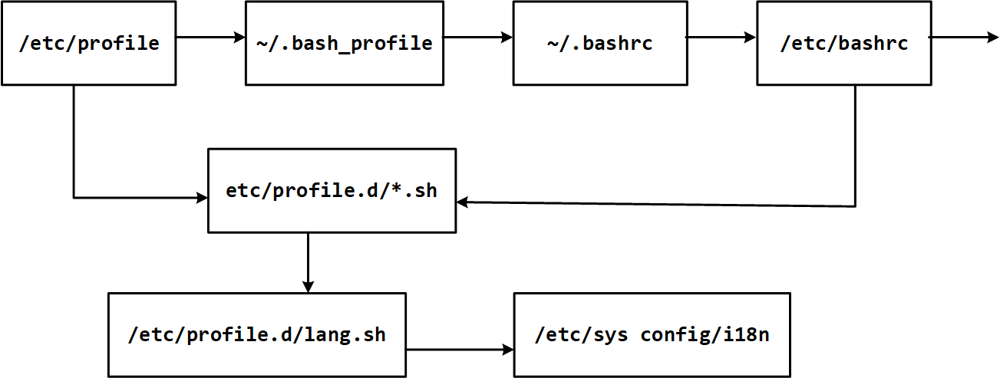

# —— Linux ——

Linux 是一套免费使用和自由传播的类 Unix 操作系统，是一个基于 POSIX 和 UNIX 的多用户、多任务、支持多线程和多 CPU 的操作系统。  <br />  Linux 内核最初是由芬兰人林纳斯·托瓦兹（Linus Torvalds）在赫尔辛基大学上学时出于个人爱好而编写的

resource

- [Awesome-Linux-Software](https://github.com/luong-komorebi/Awesome-Linux-Software)
- [How-To-Secure-A-Linux-Server](https://github.com/imthenachoman/How-To-Secure-A-Linux-Server)
- [the-book-of-secret-knowledge](https://github.com/trimstray/the-book-of-secret-knowledge)
- [devops-exercises](https://github.com/bregman-arie/devops-exercises)

# 系统目录结构
FHS（Filesystem Hierarchy Standard，文件系统层次结构标准）：多数 Linux 版本采用的文件组织形式  <br />  **/：根目录**

- /bin：Binary，存放系统命令
- /boot：系统启动目录，保存与系统启动相关的文件，如内核文件和启动引导程序（grub）文件等
- /dev ：Device(设备), 存放Linux的外部设备，在Linux中访问设备的方式和访问文件的方式是相同的。
- /etc：存放所有的系统管理所需要的配置文件和子目录。
- /home：用户的主目录，在Linux中，每个用户都有一个自己的目录，一般该目录名是以用户的账号命名的。
- /lib：存放着系统最基本的动态连接共享库
- /lost+found：一般情况下是空的，当系统非法关机后，这里就存放了一些文件。
- /media：挂载目录。系统建议用来挂载媒体设备，如软盘和光盘
- /mnt：用于临时挂载别的文件系统
- /opt：第三方安装的软件保存位置
- /proc：一个虚拟的目录，它是系统内存的映射，可以通过直接访问这个目录来获取系统信息。
- /root：系统管理员，即超级权限者的用户主目录。
- /sbin：存放系统管理员使用的系统管理程序。
- /selinux：Redhat/CentOS所特有的目录，一个安全机制，类似于windows的防火墙
- /srv：服务数据目录。一些系统服务启动之后，可以在这个目录中保存所需要的数据
- /sys：sysfs文件系统集成了3种文件系统的信息：针对进程信息的proc文件系统、针对设备的devfs文件系统、针对伪终端的devpts文件系统。
- /tmp：存放一些临时文件
- /usr：Unix Software Resource
   - /usr/bin：系统用户使用的应用程序。
   - /usr/sbin：超级用户使用的比较高级的管理程序和系统守护程序。
   - /usr/src：内核源代码默认的放置目录。
   - /usr/lib/：应用程序调用的函数库保存位置
   - /usr/XllR6/：图形界面系统保存位置
   - /usr/local/：手工安装的软件保存位置
   - /usr/share/：应用程序的资源文件保存位置，如帮助文档、说明文档和字体目录
- /var：用于存储动态数据，例如缓存、日志文件、软件运行过程中产生的文件等
- /run：一个临时文件系统，存储系统启动以来的信息。当系统重启时，目录下的文件清除

/etc/passwd  <br />  用户名：密码：UID（用户ID）：GID（组ID）：描述性信息：主目录：默认Shell  <br />  /etc/shadow  <br />  用户名：加密密码：最后一次修改时间：最小修改时间间隔：密码有效期：密码需要变更前的警告天数：密码过期后的宽限时间：账号失效时间：保留字段  <br />  /ect/group  <br />  组名：密码：GID：该用户组中的用户列表  <br />  /etc/gshadow  <br />  组名：加密密码：组管理员：组附加用户列表  <br />  /etc/login.defs

| 设置项 | 含义 |
| --- | --- |
| MAIL_DIR /var/spool/mail | 创建用户时，系统会在目录 /var/spool/mail 中创建一个用户邮箱 |
| PASS_MAX_DAYS 99999 | 密码有效期，99999 是自 1970 年 1 月 1 日起密码有效的天数，可理解为密码始终有效。 |
| PASS_MIN_DAYS 0 | 表示自上次修改密码以来，最少隔多少天后用户才能再次修改密码 |
| PASS_MIN_LEN 5 | 指定密码的最小长度，但现在用户登录时验证已经被 PAM 模块取代，不生效。 |
| PASS_WARN_AGE 7 | 指定在密码到期前多少天，系统就开始通过用户密码即将到期，默认为 7 天。 |
| UID_MIN 500 | 指定添加用户得最小 UID ，如果手工指定了一个用户的 UID 是 550，那么下一个创建的用户的 UID 就会从 551 开始 |
| UID_MAX 60000 | 指定用户最大的 UID 为 60000。 |
| GID_MIN 500 | 指定最小 GID 为 500，也就是在添加组时，组的 GID 从 500 开始。 |
| GID_MAX 60000 | 用户 GID 最大为 60000。 |
| CREATE_HOME yes | 指定在创建用户时，是否同时创建用户主目录 |
| UMASK 077 | 用户主目录的权限默认设置为 077。 |
| USERGROUPS_ENAB yes | 指定删除用户的时候是否同时删除用户组 |
| ENCRYPT_METHOD SHA512 | 指定用户密码采用的加密规则，默认采用 SHA512 |

/etc/default/useradd

| UID 范围 | 用户身份 |
| --- | --- |
| 0 | 超级用户。 把普通用户升级成管理员，只需把其他用户的 UID 修改为 0 |
| 1~499 | 系统用户（伪用户） 1~99 用于系统自行创建的账号；100~499 分配给有系统账号需求的用户。 |
| 500~65535 | 普通用户。 |


# 术语

挂载：将设备文件中的顶级目录连接到 Linux 根目录下的某一目录（最好是空目录），访问此目录就等同于访问设备文件。  <br />  归档(打包)：一个文件或目录的集合，而这个集合被存储在一个文件中。  <br />  压缩：利用算法将文件进行处理，已达到保留最大文件信息，而让文件体积变小的目的。

**文件**

- 用户数据 (user data) ：即文件数据块 (data block)，记录文件真实内容的地方
- 元数据 (metadata)：文件的附加属性（文件大小、创建时间、所有者等信息）。元数据中的 inode 号（inode 是文件元数据的一部分但其并不包含文件名，inode 号即索引节点号）才是文件的唯一标识而非文件名。

**inode **：默认大小为 128 Byte，用来记录文件的权限（r、w、x）、文件的所有者和属组、文件的大小、文件的状态改变时间（ctime）、文件的最近一次读取时间（atime）、文件的最近一次修改时间（mtime）、文件的数据真正保存的 block 编号。

**文件链接**

- **硬链接(hard link)**：给一个文件的 inode 分配多个文件名，通过任何一个文件名，都可以找到此文件的 inode，从而读取该文件的数据信息。
   - 文件有相同的 inode 及 data block；
   - 只能对已存在的文件进行创建；
   - 不能交叉文件系统进行硬链接的创建；
   - 不能对目录进行创建，只可对文件创建；
   - 删除一个硬链接文件并不影响其他有相同 inode 号的文件。

Linux 文件系统中的目录均隐藏了两个个特殊的目录：当前目录（.）与父目录（..）。查看这两个特殊目录的 inode 号可知这两目录就是两个硬链接。

- **软链接(symbolic link)**：快捷方式，即产生一个特殊的文件，该文件用来指向另一个文件，此链接方式同样适用于目录。

软链接就是一个普通文件，文件用户数据块中存放的内容是另一文件的路径名的指向

   - 有自己的文件属性及权限等；
   - 可对不存在的文件或目录创建软链接；
   - 软链接可交叉文件系统；
   - 软链接可对文件或目录创建；
   - 创建软链接时，链接计数 i_nlink 不会增加；
   - 删除软链接并不影响被指向的文件，但若被指向的原文件被删除，则相关软连接被称为死链接（dangling link）

缓存（cache）：读取硬盘中的数据时，把最常用的数据保存在内存的缓存区中，再次读取该数据时，就不去硬盘中读取了，而在缓存中读取。  <br />  缓冲（buffer）：向硬盘写入数据时，先把数据放入缓冲区，再一起写入硬盘，把分散的写操作集中进行，减少磁盘碎片和硬盘的反复寻道，从而提高系统性能。
> 简单来说，缓存（cache）是用来加速数据从硬盘中"读取"的，而缓冲（buffer）是用来加速数据"写入"硬盘的。

磁盘配额（Quota）：限制特定的普通用户或用户组在指定的分区上占用的磁盘空间或文件个数的。

# 权限
-rwxrw-r--1 root root 1213 Feb 2 09:39 name

| - | rwx | rw- | r-- | 1 | root | root | 1024 | Feb 2 09:39 | name |
| --- | --- | --- | --- | --- | --- | --- | --- | --- | --- |
| 类型 | 文件所有者 | 所在组 | 其它 | 连接的文件数 | 用户 | 所在组 | 文件大小（字节） | 最后修改日期 | 文件名 |

| 权限 | binary | octal |
| --- | --- | --- |
| --- | 000 | 0 |
| --x | 001 | 1 |
| -w- | 010 | 2 |
| -wx | 011 | 3 |
| r-- | 100 | 4 |
| r-x | 101 | 5 |
| rw- | 110 | 6 |
| rwx | 111 | 7 |

read - write - execute - SUID

| 字符 | 文件类型 |
| --- | --- |
| - | 普通文件，包括纯文本文件、二进制文件、各种压缩文件等。 |
| d | 目录，文件夹 |
| b | 块设备文件，就是保存大块数据的设备，比如最常见的硬盘。 |
| c | 字符设备文件，例如键盘、鼠标等。 |
| s | 套接字文件 |
| p | 管道文件，其主要作用是解决多个程序同时存取一个文件所造成的错误。 |
| l | 链接文件，快捷方式 |

ACL （Access Control List，访问控制列表）：实现对单一用户设定访问文件的权限。

mask 权限：用户或群组能拥有的最大 ACL 权限，超出部分做无效处理。

- SUID 特殊权限：仅适用于可执行文件，只要用户对设有 SUID 的文件有执行权限，那么当用户执行此文件时，会以文件所有者的身份去执行此文件，一旦文件执行结束，身份的切换也随之消失。
- SetGID（SGID 特殊权限）：群组，能作用于目录
- Sticky BIT（SBIT 特殊权限）：仅对目录有效，用户在此目录下创建的文件或目录，只有自己和 root 才有权利修改或删除该文件。


# 配置文件

## 环境变量


- /etc/profile
   - USER变量
   - LOGNAME变量
   - MAIL变量
   - PATH变量
   - HOSTNAME变量
   - HISTSIZE变量
   - umask
   - 调用/etc/profile.d/*.sh文件
- /etc/profile.d/*.sh
- ~/.bash_profile
- ~/.bashrc
- /etc/bashrc
   - PS1变量
   - umask
   - PATH变量
   - 调用/etc/profile.d/*.sh文件

**注销时候生效的环境变量配置文件**  <br />  ~/.bash_logout  <br />  历史记录保存在硬盘上  <br />  ~/.bash_history

**登入显示**  <br />  登陆后欢迎信息: **/etc/motd**  <br />  本地和远程登录都显示此欢迎信息

本地终端迎信息 **/etc/issue**

| 转义符 | 作用 |
| --- | --- |
| \\d | 显示当前系统日期 |
| \\s | 显示操作系统名称 |
| \\1 | 显示登录的终端号 |
| \\m | 显示硬件体系结构 |
| \\n | 显示主机名 |
| \\o | 显示域名 |
| \\r | 显示内核版本 |
| \\t | 显示当前系统时间 |
| \\u | 显示当前登录用户的序列号 |

远程终端欢迎信息:** /etc/issue.net**  <br />  不能使用转义符  <br />  是否显示此欢迎信息，由ssh的配置文件/etc/ssh/sshd_config决定，加入"Banner /etc/issue.net"行才能显示


## 网络文件
CentOS  <br />  网卡信息文件  <br />  /etc/sysconfig/network-scripts/ifcfg-eth0
```shell
DEVICE=eth0		# 网卡设备名
BOOTPROTO=none	# 是否自动获取IP ( none, static, dhcp)
HWADDR=00:0c:29:17:c4:09	# MAC地址
NM_CONTROLLED=yes	# 是否可以由Network Manager图形管理工具托管
ONBOOT=yes	# 是否随网络服务启动, eth0生效
TYPE=Ethernet	# 类型为以太网
UUID= "44b76c8a-b59f-44d5-83fa-7f98fda86b3d"	# 唯一识别码
IPADDR=192.168.0.252	# IP地址
NETMASK=255.255.255.0	# 子网掩码
GATEWAY=192.168.0.1	# 网关
DNS1=202.106.0.20
IPV6INIT=no	# IPv6没有启用
USERCTL=no	# 不允许非root用户控制此网卡
```
可通过修改该文件来设置IP

**Host**  <br />  主机名文件 `/etc/hostname		永久修改主机名`  <br />  `hostname [主机名]	查看与临时设置主机名命令`

hosts文件	`/etc/hosts`


DNS配置文件	`/etc/resolv.conf`
```shell
# Google DNS
nameserver 8.8.8.8
nameserver 8.8.4.4
```


route  [add|del] [-net|-host] target [netmask Nm] [gw Gw] [[dev] If]

Ubuntu  <br />  重启网卡
```shell
systemctl restart networking
/etc/init.d/networking restart
```


# 进程


**进程优先级**  <br />  PRI (最终值) = PRI (原始值) + NI  <br />  PRI 代表 Priority，NI 代表 Nice

数值越小代表该进程越优先被 CPU 处理。  <br />  PRI值是由内核动态调整的，用户不能直接修改。可修改 NI 值来影响 PRI 值，间接地调整进程优先级。

- NI 范围是 -20~19。
- 普通用户调整 NI 值的范围是 0~19，而且只能调整自己的进程。
- 普通用户只能调高 NI 值，而不能降低。
- 只有 root 用户才能设定进程 NI 值为负值，而且可以调整任何用户的进程。


**进程信号**

| 信号代号 | 信号名称 | 说 明 |
| --- | --- | --- |
| 1 | SIGHUP | 该信号让进程立即关闭，然后重新读取配置文件之后重启 |
| 2 | SIGINT | 程序中止信号，用于中止前台进程。相当于输出 Ctrl+C 快捷键 |
| 8 | SIGFPE | 在发生致命的算术运算错误时发出。 |
| 9 | SIGKILL | 用来立即结束程序的运行。本信号不能被阻塞、处理和忽略。用于强制中止进程 |
| 14 | SIGALRM | 时钟定时信号，计算的是实际的时间或时钟时间。alarm 函数使用该信号 |
| 15 | SIGTERM | 正常结束进程的信号，kill 命令的默认信号。 |
| 18 | SIGCONT | 该信号可以让暂停的进程恢复执行。本信号不能被阻断 |
| 19 | SIGSTOP | 该信号可以暂停前台进程，相当于输入 Ctrl+Z 快捷键。本信号不能被阻断 |


# 软件管理

## 源码安装
```shell
# 安装编译程序（gcc、make、g++及其他所需软件）
sudo apt install build-essential
```
解压缩源码压缩包（.tar、tar.gz、tar.bz2、tar.Z）

- 解xx.tar.gz：tar zxf xx.tar.gz
- 解xx.tar.Z：tar zxf xx.tar.Z
- 解xx.tgz：tar zxf xx.tgz
- 解xx.bz2：bunzip2 xx.bz2
- 解xx.tar：tar xf xx.tar

进入到解压出的目录中  <br />  用ls -F --color或者ls -F命令查看一下可执行文件，可执行文件会以*号的尾部标志
```shell
./configure		# 检查系统是否有编译时所需的库，以及库的版本是否满足编译的需要等安装所需要的系统信息
make		# 编译
sudo make install	# 安装

# 清除编译过程中产生的临时文件和配置过程中产生的文件
sudo make clean
sudo make distclean

# 软件的源代码目录，卸载源代码编译安装的软件
sudo make uninstall
```

export PATH=$PATH:/usr/local/<软件名>/...（解压目录）/bin


## RPM
RPM Package Manager，软件包管理器，支持事务机制，很多 Linux 发行版都默认使用此机制作为软件安装的管理方式，例如 Fedora、CentOS、SuSE 等。无法解决软件包的依赖关系  <br />  RPM 二进制包命名

- name-version-release.os.arch.rpm
- 包名-版本号-发布次数-发行商-Linux平台-适合的硬件平台-包扩展名

rpm {-i|--install} [install-options] PACKAGE_FILE ...  <br />  rpm {-U|--upgrade} [install-options] PACKAGE_FILE ...	若未软件尚未安装，则安装软件  <br />  rpm {-F|--freshen} [install-options] PACKAGE_FILE ...	升级软件  <br />  rpm {-e|--erase} [--allmatches] [--justdb] [--nodeps] [--noscripts]  <br />   [--notriggers] [--test] PACKAGE_NAME ...

-v, -vv, -vvv：表示详细信息。  <br />  -h：以"#"号显示安装进度。  <br />  --test：仅作测试，不真正执行，可用于测试安装，测试卸载。  <br />  --replacepkgs：重新安装。替换原有的安装。  <br />  --force：忽略软件包及文件的冲突。  <br />  --initdb：新建RPM的数据库。  <br />  --rebuilddb：重建RPM的数据库。  <br />  --percent：以百分比的形式输出安装的进度。

rpm {-q|--query} [select-options] [query-options]  <br />  rpm -q：查询某一个RPM包是否已安装  <br />  rpm -qi：查询某一个RPM包的详细信息  <br />  rpm -ql：列出某RPM包中所包含的文件。  <br />  rpm -qf：查询某文件是哪个RPM包生成的。  <br />  rpm -qa：列出当前系统所有已安装的包  <br />  rpm {-V|--verify} [select-options] [verify-options]

## YUM
Yellowdog Updater Modified 一个在Fedora和RedHat以及SUSE中的Shell前端软件包管理器。YUM客户端基于RPM包进行管理，可以通过HTTP服务器下载、FTP服务器下载、本地软件池的等方式获得软件包，可以从指定的服务器自动下载RPM包并且安装，可以自动处理依赖性关系。使用Python语言写成。

yum install ：安装  <br />  yum reinstall ： 重装  <br />  yum remove ： 卸载 （被依赖的包也会被卸载）  <br />  yum check-update ：检查可升级的包  <br />  yum list ： 查看仓库中包信息  <br />  yum search ： 根据包名在仓库中查询包  <br />  yum repolist ： 查看当前的yum仓库  <br />  yum info ： 查看包的信息  <br />  yum provides ： 查询某文件属于哪个包  <br />  yum clean ： 清除本地yum缓存  <br />  yum makecache ： 手动生成缓存  <br />  yum history ： 查看历史

yum grouplist ： 查看yum仓库包组  <br />  yum groupinfo ： 查看指定包组信息  <br />  yum groupinstall ： 安装包组（"yum install @包组名" 也可以安装包组）  <br />  yum groupremove ： 卸载包组

yum list installed ： 只显示已安装的包  <br />  yum list available ： 只显示未安装的包  <br />  yum list updatees ： 查看可更新的包  <br />  yum list extras ： 显示不属于任何仓库的，额外的包  <br />  yum list obsoletes ： 显示被废弃的包  <br />  yum list recent ： 新添加进yum仓库的包  <br />  yum search （all） 字符串 ： 根据字符串查询带有相关字符的包

yum repolist ： 查看当前能够使用的yum仓库  <br />  yum repolist all ： 查看所有仓库  <br />  yum repolist enabled ： 查看当前启用的仓库  <br />  yum repolist disabled ： 查看当前禁用的仓库


## APT
Advanced Packaging Tool是Linux系统下的一款安装包管理工具  <br />  APT可以自动下载，配置，安装二进制或者源代码格式的软件包

apt是apt-get和apt-cache命令的子集，为包管理提供必要的命令

普通安装：apt-get install softname1 softname2 …;  <br />  修复安装：apt-get -f install softname1 softname2... ;（解决依赖问题）  <br />  重新安装：apt-get --reinstall install softname1 softname2...;  <br />  移除式卸载：apt-get remove softname1 softname2 …;  <br />  清除式卸载：apt-get purge sofname1 softname2...;

apt update                   # 更新软件源  <br />  apt upgrade                  # 升级没有依赖问题的软件包  <br />  apt dist-upgrade             # 升级并解决依赖关系  <br />  apt full-upgrade             # 升级整个系统，删除已安装的软件包  <br />  apt-get autoremove		移除之前被其他软件包依赖，但现在不再被使用的软件包  <br />  apt-get clean			移除下载到本地的已经安装的软件包，默认保存在 /var/cache/apt/archives/  <br />  apt-get autoclean		移除已安装的软件的旧版本软件包  <br />  apt-cache search # ------(package 搜索包)  <br />  apt-cache show #------(package 获取包的相关信息，如说明、大小、版本等)  <br />  apt-cache depends #-------(package 了解使用依赖)  <br />  apt-cache rdepends # ------(package 了解某个具体的依赖.)  <br />  apt-get build-dep # ------(package 安装相关的编译环境)  <br />  apt-get source #------(package 下载该包的源代码)  <br />  apt-get clean && apt-get autoclean # --------清理下载文件的存档 && 只清理过时的包  <br />  apt-get check #-------检查是否有损坏的依赖  <br />  apt-file search filename -----查找filename属于哪个软件包  <br />  apt-file list packagename -----列出软件包的内容  <br />  apt-file update --更新apt-file的数据库

参数

- -y	自动回应是否安装软件包的选项
- -s	模拟安装
- -q	静默安装方式，指定多个 q 或者 -q=#，# 表示数字，用于设定静默级别
- -f	修复损坏的依赖关系
- -d	只下载不安装
- --reinstall	重新安装已经安装但可能存在问题的软件包
- --install-suggests	同时安装 APT 给出的建议安装的软件包
```shell
Ubuntu升级

1.系统软件包更新
sudo apt update
    sudo apt full-upgrade
    sudo apt autoremove

2.安装Update Manager Core 产品包
sudo apt-get install update-manager-core

3.更新或升级到下一个可用版本
sudo do-release-upgrade -d
```


## Dpkg
Debian Package，由 Debian Linux 所开发的包管理机制，通过 DPKG 包，Debian Linux 就可以进行软件包管理，主要应用在 Debian 和 Ubuntu 中。

- -i 　 　安装指定deb包
- -P 　 　全部卸载（不能解决软件包的依赖性的问题）
- -R 　   后面加上目录名，用于安装该目录下的所有deb安装包
- -r 　　 remove，移除某个已安装的软件包
- -I 　　 显示deb包文件的信息
- -s 　   显示已安装软件的信息
- -S 　   搜索已安装的软件包
- -L 　   显示已安装软件包的目录信息
- -reconfigure 重新配置


# LVM （ Logical Volume Manager ，逻辑卷管理）
对硬盘分区的一种管理机制，适合于管理大存储设备，并允许用户动态调整文件系统的大小。

- 物理卷（Physical Volume，PV）：真正的物理硬盘或分区。
- 卷组（Volume Group，VG）：将多个物理卷合起来就组成了卷组。组成同一个卷组的物理卷可以是不同硬盘上的不同分区。可以把卷组想象为一块逻辑硬盘。
- 逻辑卷（Logical Volume，LV）：卷组是一块逻辑硬盘，硬盘必须分区之后才能使用，把这个分区称作逻辑卷。逻辑卷可以被格式化和写入数据。可以把逻辑卷想象为分区。
- 物理扩展（Physical Extend，PE）：PE 是用来保存数据的最小单元，我们的数据实际上都是写入 PE 当中的。PE 的大小是可以配置的，默认是 4MB。

建立物理卷：pvcreate [设备文件名]  <br />  查看物理卷：pvscan——查询系统中哪些硬盘或分区是物理卷  <br />  pvdisplay——查看更详细的物理卷状态  <br />  删除物理卷：pvremove [设备文件名]

建立卷组：vgcreate [-s PE 大小] 卷组名 物理卷名  <br />  激活卷组：vgchange -a y 卷组名  <br />  停用卷组：vachange -a n 卷组名  <br />  查看卷组：vgscan——查看系统中是否有卷组  <br />  vgdisplay ——查看卷组的详细状态  <br />  增加卷组容量：vgextend 卷组名 物理卷名  <br />  减少卷组容量：vgreduce 卷组名 物理卷名  <br />  删除卷组：vgremove 卷组名

建立逻辑卷：lvcreate [选项] [-n 逻辑卷名] 卷组名

- -L 容量：指定逻辑卷大小，单位为 MB、GB、TB 等；
- -l 个数：按照 PE 个数指定逻辑卷大小，这个参数需要换算容量，太麻烦；
- -n 逻辑卷名：指定逻辑卷名；

格式化和挂载之后才能正常使用

查看逻辑卷：lvscan——系统中是否拥有逻辑卷  <br />  lvdisplay——逻辑卷的详细信息  <br />  调整逻辑卷大小：lvresize [选项] 逻辑卷的设备文件名

- -L 容量：安装容量调整大小，单位为 KB、GB、TB 等。使用 + 増加空间，- 代表减少空间。如果直接写容量，则代表设定逻辑卷大小为指定大小；
- -l 个数：按照 PE 个数调整逻辑卷大小；

调整分区的大小：resize2fs [选项] [设备文件名] [调整的大小]

- -f：强制调整；
- 设备文件名：指定调整哪个分区的大小；
- 调整的大小：指定把分区调整到多大，要加 M、G 等单位。如果不加大小，则会使用整个分区；

删除逻辑卷：lvremove 逻辑卷的设备文件名


# 服务
**service 服务名 [start | stop | restart | reload | status]**  <br />  systemd是Linux系统最新的初始化系统(init)，提高系统的启动速度，尽可能启动较少的进程，尽可能更多进程并发启动。  <br />  systemd对应的进程管理命令是**systemctl**，兼容了service
```shell
# service命令启动redis脚本
service redis start
# 直接启动redis脚本
/etc/init.d/redis start
```
| 任务 | 旧指令 | 新指令 |
| --- | --- | --- |
| 使某服务自动启动 | chkconfig --level 3 [httpd ](http://man.linuxde.net/httpd)  <br />  on | systemctl [enable ](http://man.linuxde.net/enable)  <br />  httpd.service |
| 使某服务不自动启动 | chkconfig --level 3 httpd off | systemctl disable httpd.service |
| 检查服务状态 | service httpd status | systemctl status httpd.service （服务详细信息） systemctl is-active httpd.service （仅显示是否 Active) |
| 显示所有已启动的服务 | chkconfig --list | systemctl list-units --[type=](http://man.linuxde.net/type)  <br />  service |
| 启动某服务 | service httpd start | systemctl start httpd.service |
| 停止某服务 | service httpd stop | systemctl stop httpd.service |
| 重启某服务 | service httpd restart | systemctl restart httpd.service |

查看服务是否开机启动：systemctl is-enabled firewalld.service  <br />  查看开机启动的服务列表：systemctl list-unit-files|grep enabled  <br />  查看启动失败的服务列表：systemctl --failed

| 服务名称 | 功能简介 | 建议 |
| --- | --- | --- |
| acpid | 电源管理接口。如果是笔记本电脑用户，则建议开启，可以监听内核层的相关电源事件 | 开启 |
| anacron | 系统的定时任务程序 | 关闭 |
| alsasound | alsa 声卡驱动。如果使用 alsa 声卡，则开启 | 关闭 |
| apmd | 电源管理模块。如果支持 acpid，就不需要 apmd，可以关闭 | 关闭 |
| atd | 指定系统在特定时间执行某个任务，只能执行一次 | 关闭 |
| auditd | 审核子系统。如果开启了此服务，那么 SELinux 的审核信息会写入 /var/log/audit/ audit.log 文件；如果不开启，那么审核信息会记录在 syslog 中 | 开启 |
| autofs | 让服务器可以自动挂载网络中其他服务器的共享数据，一般用来自动挂载 NFS 服务 | 关闭 |
| avahi-daemon | avahi 是 zeroconf 协议的实现，它可以在没有 DNS 服务的局域网里发现基于 zeroconf 协议的设备和服务。除非有兼容设备或使用 zeroconf 协议，否则关闭 | 关闭 |
| bluetooth | 蓝牙设备支持。一般不会在服务器上启用蓝牙设备，关闭它 | 关闭 |
| capi | 仅对使用 ISND 设备的用户有用 | 关闭 |
| chargen-dgram | 使用 UDP 协议的 chargen server。其主要提供类似远程打字的功能 | 关闭 |
| chargen-stream | 同上 | 关闭 |
| cpuspeed | 可以用来调整 CPU 的频率。当闲置时，可以自动降低 CPU 频率来节省电量 | 开启 |
| crond | 系统的定时任务，一般的 Linux 服务器都需要定时任务来协助系统维护 | 开启 |
| cvs | 一个版本控制系统 | 关闭 |
| daytime-dgram | 使用 TCP 协议的 daytime 守护进程，该协议为客户机实现从远程服务器获取日期和时间的功能 | 关闭 |
| daytime-slream | 同上 | 关闭 |
| dovecot | 邮件服务中 POP3/IMAP 服务的守护进程，主要用来接收信件。如果启动了邮件服务则开启：否则关闭 | 关闭 |
| echo-dgram | 服务器回显客户服务的进程 | 关闭 |
| echo-stream | 同上 | 关闭 |
| firstboot | 系统安装完成后，有一个欢迎界面，需要对系统进行初始设定，这就是这个服务的作用 | 关闭 |
| gpm | 在字符终端 (ttyl~tty6) 中可以使用鼠标复制和粘贴，这就是这个服务的功能 | 开启 |
| haldaemon | 检测和支持 USB 设备。如果是服务器则可以关闭，个人机则建议开启 | 关闭 |
| hidd | 蓝牙鼠标、键盘等蓝牙设备检测。必须启动 bluetooth 服务 | 关闭 |
| hplip | HP 打印机支持，如果没有 HP 打印机则关闭 | 关闭 |
| httpd | apache 服务的守护进程。如果需要启动 apache，就开启 | 开启 |
| ip6tables | IPv6 的防火墙 | 关闭 |
| iptables | 防火墙功能。Linux 中的防火墙是内核支持功能。这是服务器的主要防护手段，必须开启 | 开启 |
| irda | IrDA 提供红外线设备（笔记本电脑、PDA’s、手机、计算器等）间的通信支持 | 关闭 |
| irqbalance | 支持多核处理器，让 CPU 可以自动分配系统中断（IRQ)，提高系统性能。目前服务器多是多核 CPU | 开启 |
| isdn | 使用 ISDN 设备连接网络。目前主流的联网方式是光纤接入和 ADSL，ISDN 己经非常少见 | 关闭 |
| kudzu | 该服务可以在开机时进行硬件检测，并会调用相关的设置软件。建议关闭，仅在需要时开启 | 关闭 |
| lvm2-monitor | 该服务可以让系统支持LVM逻辑卷组，如果分区采用的是LVM方式，那么应该开启。 | 开启 |
| mcstrans | SELinux 的支持服务 | 开启 |
| mdmonitor | 该服务用来监测 Software RAID 或 LVM 的信息 | 关闭 |
| mdmpd | 该服务用来监测 Multi-Path 设备 | 关闭 |
| messagebus | 这是 Linux 的 IPC (Interprocess Communication，进程间通信）服务，用来在各个软件中交换信息 | 关闭 |
| microcode _ctl | Intel 系列的 CPU 可以通过这个服务支持额外的微指令集 | 关闭 |
| mysqld | [MySQL ](http://c.biancheng.net/mysql/)  <br />  数据库服务器 | 开启 |
| named | DNS 服务的守护进程，用来进行域名解析 | 关闭 |
| netfs | 该服务用于在系统启动时自动挂载网络中的共享文件空间，比如 NFS、Samba 等 | 关闭 |
| network | 提供网络设罝功能 | 开启 |
| nfs | NFS (Network File System) 服务，Linux 与 Linux 之间的文件共享服务 | 关闭 |
| nfslock | 在 Linux 中如果使用了 NFS 服务，为了避免同一个文件被不同的用户同时编辑，所以有这个锁服务。 | 关闭 |
| ntpd | 通过互联网自动更新系统时间 | 关闭 |
| pcscd | 智能卡检测服务，可以关闭 | 关闭 |
| portmap | 用在远程过程调用 (RPC) 的服务 | 关闭 |
| psacct | 该守护进程支持几个监控进程活动的工具 | 关闭 |
| rdisc | 客户端 ICMP 路由协议 | 关闭 |
| readahead_early | 在系统开启的时候，先将某些进程加载入内存整理，可以加快启动速度 | 关闭 |
| readahead_later | 同上 | 关闭 |
| restorecond | 用于给 SELinux 监测和重新加载正确的文件上下文 | 关闭 |
| rpcgssd | 与 NFS 有关的客户端功能。如果没有 NFS 就关闭 | 关闭 |
| rpcidmapd | 同上 | 关闭 |
| rsync | 远程数据备份守护进程 | 关闭 |
| sendmail | sendmail 邮件服务的守护进程 | 关闭 |
| setroubleshoot | 该服务用于将 SELinux 相关信息记录在日志 /var/log/messages 中 | 开启 |
| smartd | 该服务用于自动检测硬盘状态 | 开启 |
| smb | 网络服务 samba 的守护进程。可以让 Linux 和 Windows 之间共享数据 | 关闭 |
| squid | 代理服务的守护进程 | 关闭 |
| sshd | ssh 加密远程登录管理的服务 | 开启 |
| syslog | 日志的守护进程 | 开启 |
| vsftpd | vsftp 服务的守护进程 | 关闭 |
| xfs | 这是 X Window 的字体守护进程，为图形界面提供字体服务 | 关闭 |
| xinetd | 超级守护进程 | 开启 |
| ypbind | 为 NIS (网络信息系统）客户机激活 ypbind 服务进程 | 关闭 |
| yum-updatesd | yum 的在线升级服务 | 关闭 |


# 日志
| 日志文件 | 说 明 |
| --- | --- |
| /var/log/cron | 记录与系统定时任务相关的曰志 |
| /var/log/cups/ | 记录打印信息的曰志 |
| /var/log/dmesg | 记录了系统在开机时内核自检的信息，dmesg命令查看 |
| /var/log/btmp | 记录错误登陆的日志。二进制文件，lastb命令查看 |
| /var/log/lasllog | 记录系统中所有用户最后一次的登录时间的曰志二进制文件 |
| /var/Iog/mailog | 记录邮件信息的曰志 |
| /var/log/messages | 核心系统日志文件，包含了系统启动时的引导信息，以及系统运行时的其他状态消息。I/O 错误、网络错误和其他系统错误都会记录到此文件中。其他信息，比如某个人的身份切换为 root，已经用户自定义安装软件的日志，也会在这里列出。 |
| /var/log/secure | 记录验证和授权方面的信息 |
| /var/log/wtmp | 永久记录所有用户的登陆、注销信息，同时记录系统的后动、重启、关机事件。二进制文件 |
| /var/tun/ulmp | 记录当前已经登录的用户的信息。这个文件会随着用户的登录和注销而不断变化，只记录当前登录用户的信息。使用w、who、users等命令查看 |


**logrotate **  <br />  进行日志轮替（日志转储），把旧的日志文件移动并改名，同时创建一个新的空日志文件用来记录新日志，当旧日志文件超出保存的范围时就删除。  <br />  /etc/logrotate.conf 的默认内容
```shell
#see "man logrotate" for details
#rotate log files weekly
weekly
#每周对日志文件进行一次轮替
#keep 4 weeks worth of backlogs rotate 4
#保存4个日志文件,也就是说,如果进行了5次日志轮替，就会删除第一个备份曰志
#create new (empty) log files after rotating old ones create
#在日志轮替时,自动创建新的日志文件
#use date as a suffix of the rotated file dateext
#使用日期作为日志轮替文件的后缀
#uncomment this if you want your log files compressed #compress
#日志文件是否压缩。如果取消注释,则日志会在转储的同时进行压缩
#以上日志配置为默认配置,如果需要轮替的日志没有设定独立的参数,那么都会遵循以上参数
#如果轮替曰志配置了独立参数,那么独立参数的优先级更高
#RPM packages drop log rotation information into this directory include /etc/logrotate.d
#包含/etc/logrotate.d/目录中所有的子配置文件。也就是说,会把这个目录中所有的子配置文件读取进来，进行日志轮替
#no packages own wtmp and btmp -- we'11 rotate them here
#以下两个轮替曰志有自己的独立参数，如果和默认的参数冲突，则独立参数生效
/var/log/wtmp {
#以下参数仅对此目录有效
monthly
#每月对日志文件进行一次轮替
create 0664 root utmp
#建立的新日志文件,权限是0664,所有者是root,所属组是utmp组
minsize 1M
#日志文件最小轮替大小是1MB。也就是日志一定要超过1MB才会轮替，否则就算时间达到一个月，也不进行曰志轮替
rotate 1
#仅保留一个曰志备份。也就是只保留wtmp和wtmp.1曰志)
/var/log/btmp {
#以下参数只对/var/log/btmp生效
missingok
#如果日志不存在,则忽略该日志的警告信患
monthly
create 0600 root utmp
rotate 1
}
# system-specific logs may be also be configured here.
```


# 系统启动流程
BIOS自检 -> 启动 GRUB -> 加载内核 -> 执行第一个进程 -> 配置系统初始环境

以CentOS 6.x为例：

1. 服务器加电，加载 BIOS 信息，BIOS 进行系统检测。依照 BIOS 设定，找到第一个可以启动的设备（一般是硬盘）；
1. 读取第一个启动设备的 MBR (主引导记录），加载 MBR 中的 Boot Loader（启动引导程序，最为常见的是 GRUB）。
1. 依据 Boot Loader 的设置加载内核，内核会再进行一遍系统检测。系统一般会采用内核检测硬件的信息，而不一定采用 Bios 的自检信息。内核在检测硬件的同时，还会通过加载动态模块的形式加载硬件的驱动。
1. 内核启动系统的第一个进程，也就是 /sbin/init。
1. 由 /sbin/init 进程调用 /etc/init/rcS.conf 配置文件，通过这个配置文件调用 /etc/rc.d/rc.sysinit 配置文件。而 /etc/rc.d/rc.sysinit 配置文件是用来进行系统初始化的，主要用于配置计算机的初始环境。
1. 还是通过 /etc/init/rcS.conf 配置文件调用 /etc/inittab 配置文件。通过 /etc/inittab 配置文件来确定系统的默认运行级别。
1. 确定默认运行级别后，调用 /etc/init/rc.conf 配置文件。
1. 通过 /etc/init/rc.conf 配置文件调用并执行 /etc/rc.d/rc 脚本，并传入运行级别参数。
1. /etc/rc.d/rc 确定传入的运行级别，然后运行相应的运行级别目录 /etc/rc[0-6].d/ 中的脚本。
1. /etc/rc[0-6].d/ 目录中的脚本依据设定好的优先级依次启动和关闭。
1. 最后执行 /etc/rc.d/rc.local 中的程序。
1. 如果是字符界面启动，就可以看到登录界面了。如果是图形界面启动，就会调用相应的 X Window 接口。

BIOS（Basic Input/Output System，基本输入/输出系统）：一个固件（嵌入在硬件中的软件）  <br />  runlevel

| 运行级别 | 含 义 |
| --- | --- |
| 0 | 关机 |
| 1 | 单用户模式，主要用于系统修复 |
| 2 | 不完全的命令行模式，不含 NFS 服务 |
| 3 | 完全的命令行模式（标准字符界面） |
| 4 | 系统保留 |
| 5 | 图形模式 |
| 6 | 重新启动 |

init n 改变当前的运行级别


# SELinux
Security Enhanced Linux ：美国国家安全局（NSA）联合其他安全机构（如 SCC 公司）共同开发的，旨在增强传统 Linux 操作系统的安全性，解决传统 Linux 系统中自主访问控制（DAC）系统中的各种权限问题（如 root 权限过高等）

- 自主访问控制（Discretionary Access Control，DAC）：依据用户的身份和该身份对文件及目录的 rwx 权限来判断是否可以访问
- 强制访问控制（Mandatory Access Control，MAC）：通过 SELinux 的默认策略规则来控制特定的进程对系统的文件资源的访问

主体（Subject）：就是想要访问文件或目录资源的进程  <br />  目标（Object）：需要访问的文件或目录资源  <br />  策略（Policy）

- -targeted： SELinux 的默认策略，主要是限制网络服务的，对本机系统的限制极少
- -mls（Multi-Level Security）：多级安全保护策略，限制得更为严格。
- Minimum

安全上下文（Security Context）：每个进程、文件和目录都有自己的安全上下文，进程具体是否能够访问文件或目录，需要安全上下文匹配。

工作模式

- Disable（关闭模式）
- Permissive（宽容模式）：安全策略规则并没有被强制执行。当应该拒绝访问时，访问仍然被允许，会向日志文件发送一条消息
- Enforcing（强制模式）

getenforce	查询SELinux的工作模式  <br />  sestatus	查看策略


# Hot Key

| Ctrl+R | 搜索历史命令 |
| --- | --- |
| Ctrl+A | 移动光标到行首 |
| Ctrl+E | 移动光标到行尾 |
| Ctrl + W | 剪切一个单词 |
| Ctrl + U | 剪切光标位置到行首的字符 |
| Ctrl + K | 剪切光标位置到行尾的字符 |
| Ctrl + Y | 粘贴命令行剪切的内容 |

命令控制

| Ctrl + L | 清屏 |
| --- | --- |
| Ctrl + O | 执行当前命令，并选择上一条命令 |
| Ctrl + S | 阻止屏幕输出 |
| Ctrl + Q | 允许屏幕输出 |
| Ctrl + C | 终止命令 |
| Ctrl + Z | 挂起命令 |
| Ctrl + D | 键盘输入结束或退出终端 |


# —— vi ——


vi - Visual Interface  <br />  [vim](http://vimdoc.sourceforge.net/htmldoc/quickref.html) - Vi IMproved, a programmer's text editor

- vim-tiny：功能比较少，体积小，速度快。
- vim-basic：完整版的vim，没有图形界面，没有菜单

resource

- [vim-galore](https://github.com/mhinz/vim-galore)
- [vimrc](https://github.com/amix/vimrc)


## 启动
vim [options] [file ..]       编辑指定的文件

- -R			只读模式 (同 "view")
- -r (跟文件名)		恢复崩溃的会话
- -p[N]		打开 N 个标签页 (默认值: 每个文件一个)
- -o[N]		打开 N 个窗口 (默认值: 每个文件一个)
- -O[N]		同 -o 但垂直分割
- +			启动后跳到文件末尾
- +<lnum>		启动后跳到第 <lnum> 行
- +/pattern	光标置于首个与 pattern 匹配的位置
- -w <scriptout>	将所有输入的命令追加到文件 <scriptout>
- -W <scriptout>	将所有输入的命令写入到文件 <scriptout>
- -x			编辑加密的文件
- --startuptime <file>	Write startup timing messages to <file>
- --clean		'nocompatible', Vim defaults, no plugins, no viminfo


# 命令模式（Command mode）

## 基础修改
| x, X | x 后删 (del)， X 前删(backspace) |
| --- | --- |
| p, P | 粘贴在上，下行 |
| v,V | 文本选择 |
| u,U | 撤销上一步，撤销此处所有修改（二次复原） |
| Ctrl + r | redo，即撤销 undo 的操作 |
| dd | 删除整行 |
| dw | 删除一个单词 |
| d1G | 删除光标以前的所有数据 |
| dG | 删除光标以后的所有数据 |
| D | d$ |
| d0 | d^ |
| d( , d) | 删除至上，下一句开始的所有字符 |
| d{ , d} | 删除至上，下一段开始的所有字符 |
| yy | 复制整行，y 拓展同 d |
| J | 将光标所在行与下一行的数据结合成同一行 |
| ~ | 反转游标所在字母大小写 |
| n | 重复n次command |
| . | 重复前一个动作 |

paste、visual、undo、delete、expurgate


## 光标移动
| +，- | 光标移动到非空格符的下，上一行 |
| --- | --- |
| n | 光标会向后面移动n个字符距离 |
| 0 ，^ | 到行头 |
| $ | 到行尾 |
| H | 屏幕首行 |
| M | 中间 |
| L | 屏幕尾行 |
| G | 末尾 |
| nG | 第 n 行 |
| gg | 首行 |
| n | 向下移动 n 行 |

w,W	光标右移至下一个字的字首  <br />  e, E 把光标移动到下一个字的字尾  <br />  b ,B  把光标移到上一个字的字首  <br />  小写指英文单词、标点符号和非字母字符；  <br />  大写指的字是指两个空格之间的任何内容。

{：该命令将光标向前移至上一个段落的开头。  <br />  }：该命令将光标向后移至下一个段落的开头。

| 按键 | 跳转至 |
| --- | --- |
| '[ 与 `[ | 上一次修改或复制的第一行或第一个字符 |
| '] 与 `] | 上一次修改或复制的最后一行或最后一个字符 |
| '< 与 `< | 上一次在可视模式下选取的第一行或第一个字符 |
| '> 与 `> | 上一次在可视模式下选取的最后一行或最后一个字符 |
| '' 与 `' | 上一次跳转之前的光标位置 |
| '" 与 `" | 上一次关闭当前缓冲区时的光标位置 |
| '^ 与 `^ | 上一次插入字符后的光标位置 |
| '. 与 `. | 上一次修改文本后的光标位置 |
| '( 与 `( | 当前句子的开头 |
| ') 与 `) | 当前句子的结尾 |
| '{ 与 `{ | 当前段落的开头 |
| '} 与 `} | 当前段落的结尾 |


# 输入模式（Insert mode）
| 命令 | 说明 |
| --- | --- |
| i，a | 在光标前，后进行编辑 |
| I，A | 在行首，末插入 |
| o，O | 在当前行后，前插入一个新行 |
| r,R | 替换单个，连续 |
| c,C | 修改 |
| cc | 替换整行 |
| cw | 替换从光标所在位置后到一个单词结尾的字符 |

插入命令i、附加命令a、空行插入命令o、修改命令c、取代命令r、替换命令s


# 底线命令模式（Last line mode）
| :w | 保存但是不退出 Vim 编辑器 |
| --- | --- |
| :w! | 强制保存文本 |
| :q | 不保存就退出 Vim 编辑器 |
| :q! | 不保存，且强制退出 Vim 编辑器 |
| :wq | :x |
| ZZ | 直接退出 Vim 编辑器 |
| :w [filename] | 另存为 |
| :r [filename] | 读入另一个档案的数据，加到游标所在行后面 |
| :n1,n2 w [filename] | 将 n1 到 n2 的内容储存成 filename 这个档案。 |
| :! command | 暂时离开 vi 到指令行模式下执行 command 的显示结果 |

**多文件编辑**

- :e[dit] file 打开新文件file
- :e! 放弃修改，重新回到文件打开时的状态
- :e# 回到前一个文件
- :ls	列出以前编辑过的文档
- :cd [path]           change the current directory to [path]
- :b 编号或文件名	进入文件编辑
- :bd 编号或文件名	删除以前编辑过的列表中的文件项目
- :f 显示正在编辑的文件名
- :f new_name，改变正在编辑的文件名字
- :a 所有窗口
- :next	切换至下一个文件
- :prev	切换至前一个文件
- :last	切换至最后一个文件
- :first	切换至第一个文件

## 搜索
| /word &#124; ?word | 向下（上）搜索字符串word |
| --- | --- |
| n,N | 重复上一次（反向）搜索 |


## 替换
**[range]s/s1/s2/ [option]**

- [range] 表示检索范围，省略时表示当前行 
   - 1,10 表示从第 1 行到 10 行。 
   - % 表示整个文件，同1, $。 
   - . ,$ 从当前行到文件尾。 
- s 替换命令 
- s1 要被替换的串，s2 为替换的串。 
- option 
   - 省略时仅对每行第一个匹配串进行替换 
   - /g 在全局文件中进行替换。 
   - /c 在每次替换之前需要用户进行确认。


**文本对齐**  <br />  :ce	居中  <br />  :ri	右对齐  <br />  :le	左对齐


## 窗口切分
:split 文件名	打开新的竖向向视窗  <br />  :vsp 文件名	打开新的横向视窗  <br />  :new	打开一个新的 vim 视窗

| 切换命令 | 命令的意义 |
| --- | --- |
| Ctrl+w， j | 移动光标到下面的一个窗口 |
| Ctrl+w，k | 移动光标到上面的一个窗口 |
| Ctrl+w，q | 关闭当前窗口 |
| Ctrl+w，w | 移动光标到另一个窗口 |


## 配置
全局配置：/etc/vim/vimrc或者/etc/vimrc  <br />  用户配置：~/.vimrc	需要手动创建

属性设置

- :set	显示所有修改过的配置
- :set all	显示所有的设定值
- :set ?	显示 option 的设定值
- :set nooption	取消当前设定值
- :ver 显示版本及参数
```shell
" 基础
" set nocompatible	不与 Vi 兼容（采用 Vim 自己的操作命令）
set showmode	" 底部显示当前模式。
set encoding=utf-8  	" 使用 utf-8 编码。
set t_Co=256	" 启用256色。
filetype indent on	" 开启文件类型检查，并且载入与该类型对应的缩进规则。
set mouse=a	" 支持使用鼠标。
	
" 缩进
set autoindent	" 按下回车键后，下一行的缩进会自动跟上一行的缩进保持一致。
set tabstop=2	" 按下 Tab 键时，Vim 显示的空格数。
set shiftwidth=4	" 在文本上按下>>（增加一级缩进）、<<（取消一级缩进）或者==（取消全部缩进）时，每一级的字符数。
set expandtab	" 由于 Tab 键在不同的编辑器缩进不一致，该设置自动将 Tab 转为空格。
set softtabstop=2	" Tab 转为多少个空格。

" 外观
set number	" 显示行号
" set relativenumber	显示光标所在的当前行的行号，其他行都为相对于该行的相对行号。
set cursorline	" 光标所在的当前行高亮。
set textwidth=80	" 设置行宽，一行显示多少个字符。
" set wrap	自动折行
" set nowrap	关闭自动折行
set linebreak	" 只有遇到指定的符号（比如空格、连词号和其他标点符号）折行
set wrapmargin=2	" 指定折行处与编辑窗口的右边缘之间空出的字符数。
set scrolloff=5	" 垂直滚动时，光标距离顶部/底部的位置（单位：行）。
set sidescrolloff=15	" 水平滚动时，光标距离行首或行尾的位置（单位：字符）。
set laststatus=2	" 是否显示状态栏。0 表示不显示，1 表示只在多窗口时显示，2 表示显示。
set  ruler	" 在状态栏显示光标的当前位置（位于哪一行哪一列）。

" 搜索
set showmatch	" 光标遇到圆括号、方括号、大括号时，自动高亮对应的另一个圆括号、方括号和大括号。
set hlsearch	" 搜索时，高亮显示匹配结果。
set incsearch	" 输入搜索模式时，每输入一个字符，就自动跳到第一个匹配的结果。
" set ignorecase	搜索时忽略大小写。
" set smartcase	如果同时打开了ignorecase，那么对于只有一个大写字母的搜索词，将大小写敏感；其他情况都是大小写不敏感。比如，搜索Test时，将不匹配test；搜索test时，将匹配Test。

" 编辑	
" set spell spelllang=en_us	 打开英语单词的拼写检查。
" set nobackup	不创建备份文件。默认情况下，文件保存时，会额外创建一个备份文件，它的文件名是在原文件名的末尾，再添加一个波浪号（〜）。
" set noswapfile	不创建交换文件。交换文件主要用于系统崩溃时恢复文件，文件名的开头是.、结尾是.swp。
set undofile	" 保留撤销历史。
set history=1000

" 让行尾有多余的空格显示成可见的小方块。
set listchars=tab:»■,trail:■
set list
" 命令模式下，底部操作指令按下 Tab 键自动补全
set wildmenu
set wildmode=longest:list,full

" 键盘映射
:map <F9> :set paste<CR>
:map <F10> :set nopaste<CR>
" 绑定快捷键来激活/取消 paste模式
:set pastetoggle=<F7>
```
