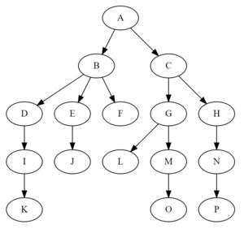
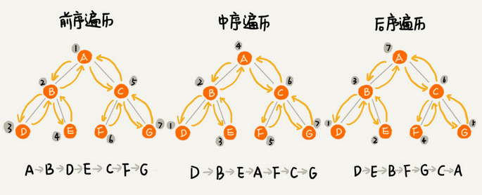
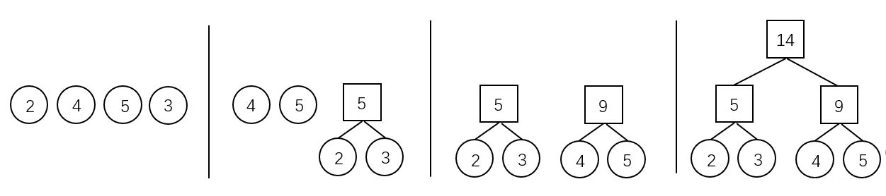
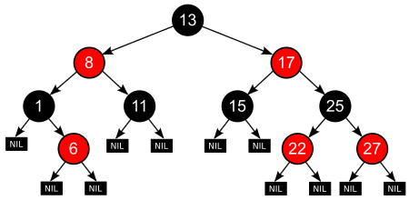

---
title: Data structure
created_at: 2022-02-10T13:59:46.000Z
updated_at: 2023-01-08T11:21:33.000Z
word_count: 12641
---  

## Tree

树：由n（n>0）个有限节点组成一个具有层次关系的[集合](https://wiwiki.kfd.me/wiki/%E9%9B%86%E5%90%88_(%E6%95%B0%E5%AD%A6))。  <br />  

**基本术语**

- 结点的度（Degree）：结点的子树个数
- 树的度：树的所有结点中最大的度数
- 叶结点（Leaf）：度为 0 的结点
- 父结点（Parent）：有子树的结点是其子树的根结点的父结点
- 子结点（Child）：若 A 结点是 B 结点的父结点，则称 B 结点是 A 结点的子结点，也称孩子结点
- 兄弟结点（Sibling）：具有同一父结点的各个结点彼此是兄弟结点
- 路径
- 路径长度：路径所包含边的个数
- 祖先结点（Ancestor）：沿树根到某一结点路径上的所有结点都是这个结点的祖先结点
- 子孙结点（Descendant）：某一结点的子树中的所有结点是这个结点的子孙
- 结点的层次（Level）：规定根结点在 1 层，其他任一结点的层数是其父结点的层数加一
- 树的深度（Depth）：树中所有结点中的最大层次是这棵树的深度

特点

- 每个节点都只有有限个子节点或无子节点；
- 没有父节点的节点称为根节点；
- 每一个非根节点有且只有一个父节点；
- 除了根节点外，每个子节点可以分为多个不相交的子树；
- 树里面没有环路(cycle)


**树与森林**  <br />  **树 --> 二叉树**

   - 加线：在兄弟之间加一连线
   - 抹线：对每个结点，除了其左孩子外，去除其与其余孩子之间的关系
   - 旋转：以树的根结点为轴心，将整树顺时针转45°

二叉树的先序对应树的先序遍历；二叉树的中序对应树的后序遍历  <br />  **森林 --> 二叉树**

   - 将各棵树分别转换成二叉树
   - 将每棵树的根结点用线相连
   - 以第一棵树根结点为二叉树的根


### Binary Tree
**二叉树**是每个节点最多只有两个分支的树结构。  <br />  通常分支被称作“左子树”或“右子树”。二叉树的分支具有左右次序，不能随意颠倒。

**特点**

- 二叉树第i层上的结点数目最多为2i-1(i>=1)
- 深度为k的二叉树至多有2k-1个结点（k>=1）
- 包含n个结点的二叉树的高度至少为(log2n)+1
- 在任意一棵二叉树中，若终端结点的个数为n0，度为2的结点数为n2，则n0=n2+1

- [完全二叉树](https://wiwiki.kfd.me/wiki/%E5%AE%8C%E5%85%A8%E4%BA%8C%E5%8F%89%E6%A0%91)：对于一棵二叉树，假设其深度为d（d>1）。除了第d层外，其它各层的节点数目均已达最大值，且第d层所有节点从左向右连续地紧密排列
   - [满二叉树](https://wiwiki.kfd.me/wiki/%E6%BB%A1%E4%BA%8C%E5%8F%89%E6%A0%91)：所有叶节点都在最底层的完全二叉树；

```c
typedef struct TNode *Position;
typedef Position BinTree; /* 二叉树类型 */

struct TNode{ /* 树结点定义 */
    ElementType Data; /* 结点数据 */
    BinTree Left;     /* 指向左子树 */
    BinTree Right;    /* 指向右子树 */
};
```
#### Traversal



先序遍历
```c
// 递归实现
void PreorderTraversal( BinTree BT )
{
    if( BT ) {
        printf("%d ", BT->Data );
        PreorderTraversal( BT->Left );
        PreorderTraversal( BT->Right );
    }
}

// 迭代实现
void PreOrderTraversal(BinTree BT){
	BinTree T = BT;
	Stack S = CreateStack();  // 创建并初始化堆栈 S
	while(T || !IsEmpty(S)){  // 当树不为空或堆栈不空 
		while(T){     
			Push(S,T);    // 压栈，第一次遇到该结点 
			printf("%d",T->Data);  // 访问结点
			T = T->Left;   // 遍历左子树 
		}
		if(!IsEmpty(S)){  // 当堆栈不空 
			T = Pop(S);    // 出栈，第二次遇到该结点 
			T = T->Right;  // 访问右结点 
		}
	} 
} 
```

中序遍历
```c
// 递归实现
void InorderTraversal( BinTree BT )
{
    if( BT ) {
        InorderTraversal( BT->Left );
        /* 此处假设对BT结点的访问就是打印数据 */
        printf("%d ", BT->Data); /* 假设数据为整型 */
        InorderTraversal( BT->Right );
    }
}


// 迭代实现
void InOrderTraversal(BinTree BT){
	BinTree T = BT;
	Stack S = CreateStack();  // 创建并初始化堆栈 S
	while(T || !IsEmpty(S)){  // 当树不为空或堆栈不空 
		while(T){     
			Push(S,T);    // 压栈
			T = T->Left;   // 遍历左子树 
		}
		if(!IsEmpty(S)){  // 当堆栈不空 
			T = Pop(S);    // 出栈
			printf("%d",T->Data);  // 访问结点
			T = T->Right;  // 访问右结点 
		}
	} 
} 
```

后序遍历
```c
// 递归实现
void PostorderTraversal( BinTree BT )
{
    if( BT ) {
        PostorderTraversal( BT->Left );
        PostorderTraversal( BT->Right );
        printf("%d ", BT->Data);
    }
}

// 迭代实现
void PostOrderTraversal(BinTree BT){
	BinTree T = BT;
	Stack S = CreateStack();  // 创建并初始化堆栈 S
	vector<BinTree> v;   // 创建存储树结点的动态数组
	Push(S,T);
	while(!IsEmpty(S)){  // 当树不为空或堆栈不空 
		T = Pop(S);
		v.push_back(T);  // 出栈元素进数组
		if(T->Left)
			Push(S,T->Left);
		if(T->Right)
			Push(S,T->Right);
	}
	reverse(v.begin(),v.end());  // 逆转 
	for(int i=0;i<v.size();i++)  // 输出数组元素
		printf("%d",v[i]->Data);
} 
```

层序遍历
```c
void LevelOrderTraversal(BinTree BT){
	queue<BinTree> q;   // 创建队列
	BinTree T;
	if(!BT)
		return;
	q.push(BT);  // BT 入队 
	while(!q.empty()){
		T = q.front();  // 访问队首元素 
		q.pop();  // 出队
		printf("%d",T->Data);
		if(T->Left)  // 如果存在左儿子结点
			q.push(T->Left);  // 入队
	 	if(T->Right)
	 		q.push(T->Right);
	}
}
```


### Binary Search Tree
二叉搜索树，亦称有序二叉树  <br />  性质

- 非空**左子树**的所有键值**小于**其根结点的键值
- 非空**右子树**的所有键值**大于**其根结点的键值
- 左、右子树都是二叉搜索树


| 算法 | **平均** | **最差** |
| --- | --- | --- |
| 空间 | O(_n_) | O(_n_) |
| 搜索 | O(log _n_) | O(_n_) |
| 插入 | O(log _n_) | O(_n_) |
| 删除 | O(log _n_) | O(_n_) |

```c
#include<iostream>
#include<malloc.h>
using namespace std;

typedef int ElementType;
typedef struct TreeNode *BinTree;
struct TreeNode{
	ElementType Data;
	BinTree Left;
	BinTree Right;
};

// 查找递归实现 
BinTree Find(ElementType X,BinTree BST){
	if(!BST)  // 如果根结点为空，返回 NULL 
		return NULL; 
	if(X < BST->Data) // 比根结点小，去左子树查找 
		return Find(X,BST->Left); 
	else if(BST->Data < X)  // 比根结点大，去右子树查找 
		return Find(X,BST->Right);
	else if(BST->Data == X) // 找到了 
		return BST;
}

// 查找迭代实现
BinTree IterFind(ElementType X,BinTree BST){
	while(BST){
		if(X < BST->Data)
			BST = BST->Left;
		else if(BST->Data < X)  // 比根结点大，去右子树查找 
			BST = BST->Right;
		else if(BST->Data == X) // 找到了 
			return BST;
	}
	return NULL;
} 

// 查找最小值的递归实现
BinTree FindMin(BinTree BST){
	if(!BST)    // 如果为空了，返回 NULL 
		return NULL;  
	else if(BST->Left)   // 还存在左子树，沿左分支继续查找 
		return FindMin(BST->Left);
	else  // 找到了 
		return BST;
} 

// 查找最大值的非递归实现
BinTree FindMax(BinTree BST){
	if(BST)  // 如果不空 
		while(BST->Right)   // 只要右子树还存在 
			BST = BST->Right;
	return BST;
} 

BinTree Insert( BinTree BST, ElementType X )
{
    if( !BST ){ /* 若原树为空，生成并返回一个结点的二叉搜索树 */
        BST = (BinTree)malloc(sizeof(struct TNode));
        BST->Data = X;
        BST->Left = BST->Right = NULL;
    }
    else { /* 开始找要插入元素的位置 */
        if( X < BST->Data )
            BST->Left = Insert( BST->Left, X );   /*递归插入左子树*/
        else  if( X > BST->Data )
            BST->Right = Insert( BST->Right, X ); /*递归插入右子树*/
        /* else X已经存在，什么都不做 */
    }
    return BST;
}
 
BinTree Delete( BinTree BST, ElementType X ) 
{ 
    Position Tmp; 
 
    if( !BST ) 
        printf("要删除的元素未找到"); 
    else {
        if( X < BST->Data ) 
            BST->Left = Delete( BST->Left, X );   /* 从左子树递归删除 */
        else if( X > BST->Data ) 
            BST->Right = Delete( BST->Right, X ); /* 从右子树递归删除 */
        else { /* BST就是要删除的结点 */
            /* 如果被删除结点有左右两个子结点 */ 
            if( BST->Left && BST->Right ) {
                /* 从右子树中找最小的元素填充删除结点 */
                Tmp = FindMin( BST->Right );
                BST->Data = Tmp->Data;
                /* 从右子树中删除最小元素 */
                BST->Right = Delete( BST->Right, BST->Data );
            }
            else { /* 被删除结点有一个或无子结点 */
                Tmp = BST; 
                if( !BST->Left )       /* 只有右孩子或无子结点 */
                    BST = BST->Right; 
                else                   /* 只有左孩子 */
                    BST = BST->Left;
                free( Tmp );
            }
        }
    }
    return BST;
}
```


### AVL Tree
一种结构平衡的二叉搜索树，每个节点的左右两子树高度差都不超过一的二叉树  <br />  平衡二叉树由G.M. **A**delson-Velsky和E.M. Landis发明

**LL单旋**  <br />  
```c
typedef struct AVLNode *Position;
typedef Position AVLTree; /* AVL树类型 */
struct AVLNode{
    ElementType Data; /* 结点数据 */
    AVLTree Left;     /* 指向左子树 */
    AVLTree Right;    /* 指向右子树 */
    int Height;       /* 树高 */
};
 
int Max ( int a, int b )
{
    return a > b ? a : b;
}
 
AVLTree SingleLeftRotation ( AVLTree A )
{ /* 注意：A必须有一个左子结点B */
  /* 将A与B做左单旋，更新A与B的高度，返回新的根结点B */     
 
    AVLTree B = A->Left;
    A->Left = B->Right;
    B->Right = A;
    A->Height = Max( GetHeight(A->Left), GetHeight(A->Right) ) + 1;
    B->Height = Max( GetHeight(B->Left), A->Height ) + 1;
  
    return B;
}
 
AVLTree DoubleLeftRightRotation ( AVLTree A )
{ /* 注意：A必须有一个左子结点B，且B必须有一个右子结点C */
  /* 将A、B与C做两次单旋，返回新的根结点C */
     
    /* 将B与C做右单旋，C被返回 */
    A->Left = SingleRightRotation(A->Left);
    /* 将A与C做左单旋，C被返回 */
    return SingleLeftRotation(A);
}
 
/*************************************/
/* 对称的右单旋与右-左双旋  略 */
/*************************************/
 
AVLTree Insert( AVLTree T, ElementType X )
{ /* 将X插入AVL树T中，并且返回调整后的AVL树 */
    if ( !T ) { /* 若插入空树，则新建包含一个结点的树 */
        T = (AVLTree)malloc(sizeof(struct AVLNode));
        T->Data = X;
        T->Height = 0;
        T->Left = T->Right = NULL;
    } /* if (插入空树) 结束 */
 
    else if ( X < T->Data ) {
        /* 插入T的左子树 */
        T->Left = Insert( T->Left, X);
        /* 如果需要左旋 */
        if ( GetHeight(T->Left)-GetHeight(T->Right) == 2 )
            if ( X < T->Left->Data ) 
               T = SingleLeftRotation(T);      /* 左单旋 */
            else 
               T = DoubleLeftRightRotation(T); /* 左-右双旋 */
    } /* else if (插入左子树) 结束 */
     
    else if ( X > T->Data ) {
        /* 插入T的右子树 */
        T->Right = Insert( T->Right, X );
        /* 如果需要右旋 */
        if ( GetHeight(T->Left)-GetHeight(T->Right) == -2 )
            if ( X > T->Right->Data ) 
               T = SingleRightRotation(T);     /* 右单旋 */
            else 
               T = DoubleRightLeftRotation(T); /* 右-左双旋 */
    } /* else if (插入右子树) 结束 */
 
    /* else X == T->Data，无须插入 */
 
    /* 更新树高 */
    T->Height = Max( GetHeight(T->Left), GetHeight(T->Right) ) + 1;
     
    return T;
}
```


### Huffman Tree
最优二叉树：带权路径长度（WPL）最短的树，权值较大的结点离根较近

**哈夫曼编码(Huffman Coding)**：无前缀编码，用于无损数据压缩的熵编码（权编码）算法  <br />  原理：使用[变长编码表](https://wiwiki.kfd.me/w/index.php?title=%E8%AE%8A%E9%95%B7%E7%B7%A8%E7%A2%BC%E8%A1%A8&action=edit&redlink=1)对源符号（如文件中的一个字母）进行编码，其中[变长编码表](https://wiwiki.kfd.me/w/index.php?title=%E8%AE%8A%E9%95%B7%E7%B7%A8%E7%A2%BC%E8%A1%A8&action=edit&redlink=1)是通过一种评估来源符号出现概率的方法得到的，出现概率高的字母使用较短的编码，反之出现概率低的则使用较长的编码，这便使编码之后的字符串的平均长度、[期望值](https://wiwiki.kfd.me/wiki/%E6%9C%9F%E6%9C%9B%E5%80%BC)降低，从而达到[无损压缩](https://wiwiki.kfd.me/wiki/%E6%97%A0%E6%8D%9F%E5%8E%8B%E7%BC%A9)数据的目的。

  <br />  **特点**

- 没有度为 1 的结点
- n 个叶结点的哈夫曼树共有 2n-1 个结点
- 哈夫曼树的任意非叶结点的左右子树交换后仍是哈夫曼树
- 对同一组权值，可能存在不同构的多棵哈夫曼树
```c
#include <iostream>
#include <queue> 
using namespace std; 
  
// A Huffman tree node 
struct MinHeapNode { 
  
    // One of the input characters 
    char data; 
  
    // Frequency of the character 
    unsigned freq; 
  
    // Left and right child 
    MinHeapNode *left, *right; 
  
    MinHeapNode(char data, unsigned freq) 
    { 
        left = right = NULL; 
        this->data = data; 
        this->freq = freq; 
    } 
}; 
  
// For comparison of 
// two heap nodes (needed in min heap) 
struct compare { 
  
    bool operator()(MinHeapNode* l, MinHeapNode* r) 
    { 
        return (l->freq > r->freq); 
    } 
}; 
  
// Prints huffman codes from 
// the root of Huffman Tree. 
void printCodes(struct MinHeapNode* root, string str) 
{ 
  
    if (!root) 
        return; 
  
    if (root->data != '$') 
        cout << root->data << ": " << str << "\n"; 
  
    printCodes(root->left, str + "0"); 
    printCodes(root->right, str + "1"); 
} 
  
// The main function that builds a Huffman Tree and 
// print codes by traversing the built Huffman Tree 
void HuffmanCodes(char data[], int freq[], int size) 
{ 
    struct MinHeapNode *left, *right, *top; 
  
    // Create a min heap & inserts all characters of data[] 
    priority_queue<MinHeapNode*, vector<MinHeapNode*>, compare> minHeap; 
  
    for (int i = 0; i < size; ++i) 
        minHeap.push(new MinHeapNode(data[i], freq[i])); 
  
    // Iterate while size of heap doesn't become 1 
    while (minHeap.size() != 1) { 
  
        // Extract the two minimum 
        // freq items from min heap 
        left = minHeap.top(); 
        minHeap.pop(); 
  
        right = minHeap.top(); 
        minHeap.pop(); 
  
        // Create a new internal node with 
        // frequency equal to the sum of the 
        // two nodes frequencies. Make the 
        // two extracted node as left and right children 
        // of this new node. Add this node 
        // to the min heap '$' is a special value 
        // for internal nodes, not used 
        top = new MinHeapNode('$', left->freq + right->freq); 
  
        top->left = left; 
        top->right = right; 
  
        minHeap.push(top); 
    } 
  
    // Print Huffman codes using 
    // the Huffman tree built above 
    printCodes(minHeap.top(), ""); 
} 
  
// Driver program to test above functions 
int main() 
{ 
  
    char arr[] = { 'a', 'b', 'c', 'd', 'e', 'f' }; 
    int freq[] = { 5, 9, 12, 13, 16, 45 }; 
  
    int size = sizeof(arr) / sizeof(arr[0]); 
  
    HuffmanCodes(arr, freq, size); 
  
    return 0; 
}
```


### [B树](https://wiwiki.kfd.me/wiki/B%E6%A0%91)
一种对读写操作进行优化的自平衡的二叉查找树，能够保持数据有序，拥有多个子树。

### Red-Black Tree
红黑树  <br />    <br />  **特性:**

- 每个节点或者是黑色，或者是红色。
- 根节点是黑色。
- 每个叶子节点（NIL）是黑色。 [空(NIL或NULL)的叶子节点！]
- 如果一个节点是红色的，则它的子节点必须是黑色的。
- 从一个节点到该节点的子孙节点的所有路径上包含相同数目的黑节点。
```c
public class RedBlackBST {
    private final int R = 0;
    private final int B = 1;
    private class Node {
        int key = -1, color = B;
        Node left = nil, right = nil, p = nil;
        Node(int key) {
            this.key = key;
        }
    }
    private final Node nil = new Node(-1);
    private Node root = nil;
    public void printTree(Node node) {
        if (node == nil) {
            return;
        }
        printTree(node.left);
        System.out.print(((node.color == R) ? " R " : " B ") + "Key: " + node.key + " Parent: " + node.p.key + "\n");
        printTree(node.right);
    }
    public void printTreepre(Node node) {
        if (node == nil) {
            return;
        }
        System.out.print(((node.color == R) ? " R " : " B ") + "Key: " + node.key + " Parent: " + node.p.key + "\n");
        printTree(node.left);
        printTree(node.right);
    }
    private Node findNode(Node findNode, Node node) {
        if (root == nil) {
            return null;
        }
        if (findNode.key < node.key) {
            if (node.left != nil) {
                return findNode(findNode, node.left);
            }
        } else if (findNode.key > node.key) {
            if (node.right != nil) {
                return findNode(findNode, node.right);
            }
        } else if (findNode.key == node.key) {
            return node;
        }
        return null;
    }
    private void insert(Node node) {
        Node temp = root;
        if (root == nil) {
            root = node;
            node.color = B;
            node.p = nil;
        } else {
            node.color = R;
            while (true) {
                if (node.key < temp.key) {
                    if (temp.left == nil) {
                        temp.left = node;
                        node.p = temp;
                        break;
                    } else {
                        temp = temp.left;
                    }
                } else if (node.key >= temp.key) {
                    if (temp.right == nil) {
                        temp.right = node;
                        node.p = temp;
                        break;
                    } else {
                        temp = temp.right;
                    }
                }
            }
            fixTree(node);
        }
    }
    private void fixTree(Node node) {
        while (node.p.color == R) {
            Node y = nil;
            if (node.p == node.p.p.left) {
                y = node.p.p.right;
                if (y != nil && y.color == R) {
                    node.p.color = B;
                    y.color = B;
                    node.p.p.color = R;
                    node = node.p.p;
                    continue;
                }
                if (node == node.p.right) {
                    node = node.p;
                    rotateLeft(node);
                }
                node.p.color = B;
                node.p.p.color = R;
                rotateRight(node.p.p);
            } else {
                y = node.p.p.left;
                if (y != nil && y.color == R) {
                    node.p.color = B;
                    y.color = B;
                    node.p.p.color = R;
                    node = node.p.p;
                    continue;
                }
                if (node == node.p.left) {
                    node = node.p;
                    rotateRight(node);
                }
                node.p.color = B;
                node.p.p.color = R;
                rotateLeft(node.p.p);
            }
        }
        root.color = B;
    }
    void rotateLeft(Node node) {
        if (node.p != nil) {
            if (node == node.p.left) {
                node.p.left = node.right;
            } else {
                node.p.right = node.right;
            }
            node.right.p = node.p;
            node.p = node.right;
            if (node.right.left != nil) {
                node.right.left.p = node;
            }
            node.right = node.right.left;
            node.p.left = node;
        } else {
            Node right = root.right;
            root.right = right.left;
            right.left.p = root;
            root.p = right;
            right.left = root;
            right.p = nil;
            root = right;
        }
    }
    void rotateRight(Node node) {
        if (node.p != nil) {
            if (node == node.p.left) {
                node.p.left = node.left;
            } else {
                node.p.right = node.left;
            }
            node.left.p = node.p;
            node.p = node.left;
            if (node.left.right != nil) {
                node.left.right.p = node;
            }
            node.left = node.left.right;
            node.p.right = node;
        } else {
            Node left = root.left;
            root.left = root.left.right;
            left.right.p = root;
            root.p = left;
            left.right = root;
            left.p = nil;
            root = left;
        }
    }
    void transplant(Node target, Node with) {
        if (target.p == nil) {
            root = with;
        } else if (target == target.p.left) {
            target.p.left = with;
        } else
            target.p.right = with;
        with.p = target.p;
    }
    Node treeMinimum(Node subTreeRoot) {
        while (subTreeRoot.left != nil) {
            subTreeRoot = subTreeRoot.left;
        }
        return subTreeRoot;
    }
    boolean delete(Node z) {
        if ((z = findNode(z, root)) == null)
            return false;
        Node x;
        Node y = z;
        int yorigcolor = y.color;
        if (z.left == nil) {
            x = z.right;
            transplant(z, z.right);
        } else if (z.right == nil) {
            x = z.left;
            transplant(z, z.left);
        } else {
            y = treeMinimum(z.right);
            yorigcolor = y.color;
            x = y.right;
            if (y.p == z)
                x.p = y;
            else {
                transplant(y, y.right);
                y.right = z.right;
                y.right.p = y;
            }
            transplant(z, y);
            y.left = z.left;
            y.left.p = y;
            y.color = z.color;
        }
        if (yorigcolor == B)
            deleteFixup(x);
        return true;
    }
    void deleteFixup(Node x) {
        while (x != root && x.color == B) {
            if (x == x.p.left) {
                Node w = x.p.right;
                if (w.color == R) {
                    w.color = B;
                    x.p.color = R;
                    rotateLeft(x.p);
                    w = x.p.right;
                }
                if (w.left.color == B && w.right.color == B) {
                    w.color = R;
                    x = x.p;
                    continue;
                } else if (w.right.color == B) {
                    w.left.color = B;
                    w.color = R;
                    rotateRight(w);
                    w = x.p.right;
                }
                if (w.right.color == R) {
                    w.color = x.p.color;
                    x.p.color = B;
                    w.right.color = B;
                    rotateLeft(x.p);
                    x = root;
                }
            } else {
                Node w = x.p.left;
                if (w.color == R) {
                    w.color = B;
                    x.p.color = R;
                    rotateRight(x.p);
                    w = x.p.left;
                }
                if (w.right.color == B && w.left.color == B) {
                    w.color = R;
                    x = x.p;
                    continue;
                } else if (w.left.color == B) {
                    w.right.color = B;
                    w.color = R;
                    rotateLeft(w);
                    w = x.p.left;
                }
                if (w.left.color == R) {
                    w.color = x.p.color;
                    x.p.color = B;
                    w.left.color = B;
                    rotateRight(x.p);
                    x = root;
                }
            }
        }
        x.color = B;
    }
    public void insertDemo() {
        Scanner scan = new Scanner(System.in);
        while (true) {
            System.out.println("Add items");
            int item;
            Node node;
            item = scan.nextInt();
            while (item != -999) {
                node = new Node(item);
                insert(node);
                item = scan.nextInt();
            }
            printTree(root);
            System.out.println("Pre order");
            printTreepre(root);
            break;
        }
        scan.close();
    }
    public void deleteDemo() {
        Scanner scan = new Scanner(System.in);
        System.out.println("Delete items");
        int item;
        Node node;
        item = scan.nextInt();
        node = new Node(item);
        System.out.print("Deleting item " + item);
        if (delete(node)) {
            System.out.print(": deleted!");
        } else {
            System.out.print(": does not exist!");
        }
        System.out.println();
        printTree(root);
        System.out.println("Pre order");
        printTreepre(root);
    }
}
```


### 字典树 Trie
单词查找树，前缀树，常用于存储动态集或键为字符串的关联数组  <br />  Trie 树用「树枝」存储字符串（键），用「节点」存储字符串（键）对应的数据（值）  <br />  
```java
class TrieMap<V> {
    // ASCII 码个数
    private static final int R = 256;
    // 当前存在 Map 中的键值对个数
    private int size = 0;
    // Trie 树的根节点
    private TrieNode<V> root = null;
    
    private static class TrieNode<V> {
        V val = null;
        TrieNode<V>[] children = new TrieNode[R];
    }
    
    /***** 增/改 *****/
    
    // 在 map 中添加或修改键值对
    public void put(String key, V val) {
        if (!containsKey(key)) {
            // 新增键值对
            size++;
        }
        // 需要一个额外的辅助函数，并接收其返回值
        root = put(root, key, val, 0);
    }
    
    // 定义：向以 node 为根的 Trie 树中插入 key[i..]，返回插入完成后的根节点
    private TrieNode<V> put(TrieNode<V> node, String key, V val, int i) {
        if (node == null) {
            // 如果树枝不存在，新建
            node = new TrieNode<>();
        }
        if (i == key.length()) {
            // key 的路径已插入完成，将值 val 存入节点
            node.val = val;
            return node;
        }
        char c = key.charAt(i);
        // 递归插入子节点，并接收返回值
        node.children[c] = put(node.children[c], key, val, i + 1);
        return node;
    }
    
    /***** 删 *****/
    
    // 在 Map 中删除 key
    public void remove(String key) {
        if (!containsKey(key)) {
            return;
        }
        // 递归修改数据结构要接收函数的返回值
        root = remove(root, key, 0);
        size--;
    }
    
    // 定义：在以 node 为根的 Trie 树中删除 key[i..]，返回删除后的根节点
    private TrieNode<V> remove(TrieNode<V> node, String key, int i) {
        if (node == null) {
            return null;
        }
        if (i == key.length()) {
            // 找到了 key 对应的 TrieNode，删除 val
            node.val = null;
        } else {
            char c = key.charAt(i);
            // 递归去子树进行删除
            node.children[c] = remove(node.children[c], key, i + 1);
        }
        // 后序位置，递归路径上的节点可能需要被清理
        if (node.val != null) {
            // 如果该 TireNode 存储着 val，不需要被清理
            return node;
        }
        // 检查该 TrieNode 是否还有后缀
        for (int c = 0; c < R; c++) {
            if (node.children[c] != null) {
                // 只要存在一个子节点（后缀树枝），就不需要被清理
                return node;
            }
        }
        // 既没有存储 val，也没有后缀树枝，则该节点需要被清理
        return null;
    }
    
    /***** 查 *****/
    
    // 搜索 key 对应的值，不存在则返回 null
    public V get(String key) {
        // 从 root 开始搜索 key
        TrieNode<V> x = getNode(root, key);
        if (x == null || x.val == null) {
            // x 为空或 x 的 val 字段为空都说明 key 没有对应的值
            return null;
        }
        return x.val;
    }
    
    // 判断 key 是否存在在 Map 中
    public boolean containsKey(String key) {
        return get(key) != null;
    }
    
    // 判断是和否存在前缀为 prefix 的键
    public boolean hasKeyWithPrefix(String prefix) {
        // 只要能找到一个节点，就是存在前缀
        return getNode(root, prefix) != null;
    }
    
    // 在所有键中寻找 query 的最短前缀
    public String shortestPrefixOf(String query) {
        TrieNode<V> p = root;
        // 从节点 node 开始搜索 key
        for (int i = 0; i < query.length(); i++) {
            if (p == null) {
                // 无法向下搜索
                return "";
            }
            if (p.val != null) {
                // 找到一个键是 query 的前缀
                return query.substring(0, i);
            }
            // 向下搜索
            char c = query.charAt(i);
            p = p.children[c];
        }
        
        if (p != null && p.val != null) {
            // 如果 query 本身就是一个键
            return query;
        }
        return "";
    }
    
    // 在所有键中寻找 query 的最长前缀
    public String longestPrefixOf(String query) {
        TrieNode<V> p = root;
        // 记录前缀的最大长度
        int max_len = 0;
        
        // 从节点 node 开始搜索 key
        for (int i = 0; i < query.length(); i++) {
            if (p == null) {
                // 无法向下搜索
                break;
            }
            if (p.val != null) {
                // 找到一个键是 query 的前缀，更新前缀的最大长度
                max_len = i;
            }
            // 向下搜索
            char c = query.charAt(i);
            p = p.children[c];
        }
        
        if (p != null && p.val != null) {
            // 如果 query 本身就是一个键
            return query;
        }
        return query.substring(0, max_len);
    }
    
    // 搜索前缀为 prefix 的所有键
    public List<String> keysWithPrefix(String prefix) {
        List<String> res = new LinkedList<>();
        // 找到匹配 prefix 在 Trie 树中的那个节点
        TrieNode<V> x = getNode(root, prefix);
        if (x == null) {
            return res;
        }
        // DFS 遍历以 x 为根的这棵 Trie 树
        traverse(x, new StringBuilder(prefix), res);
        return res;
    }
    
    // 遍历以 node 节点为根的 Trie 树，找到所有键
    private void traverse(TrieNode<V> node, StringBuilder path, List<String> res) {
        if (node == null) {
            // 到达 Trie 树底部叶子结点
            return;
        }
        
        if (node.val != null) {
            // 找到一个 key，添加到结果列表中
            res.add(path.toString());
        }
        
        // 回溯算法遍历框架
        for (char c = 0; c < R; c++) {
            // 做选择
            path.append(c);
            traverse(node.children[c], path, res);
            // 撤销选择
            path.deleteCharAt(path.length() - 1);
        }
    }
    
    // 通配符 . 匹配任意字符
    public List<String> keysWithPattern(String pattern) {
        List<String> res = new LinkedList<>();
        traverse(root, new StringBuilder(), pattern, 0, res);
        return res;
    }
    
    // 遍历函数，尝试在「以 node 为根的 Trie 树中」匹配 pattern[i..]
    private void traverse(TrieNode<V> node, StringBuilder path, String pattern, int i, List<String> res) {
        if (node == null) {
            // 树枝不存在，即匹配失败
            return;
        }
        if (i == pattern.length()) {
            // pattern 匹配完成
            if (node.val != null) {
                // 如果这个节点存储着 val，则找到一个匹配的键
                res.add(path.toString());
            }
            return;
        }
        char c = pattern.charAt(i);
        if (c == '.') {
            // pattern[i] 是通配符，可以变化成任意字符
            // 多叉树（回溯算法）遍历框架
            for (char j = 0; j < R; j++) {
                path.append(j);
                traverse(node.children[j], path, pattern, i + 1, res);
                path.deleteCharAt(path.length() - 1);
            }
        } else {
            // pattern[i] 是普通字符 c
            path.append(c);
            traverse(node.children[c], path, pattern, i + 1, res);
            path.deleteCharAt(path.length() - 1);
        }
    }
    
    // 判断是和否存在前缀为 prefix 的键
    public boolean hasKeyWithPattern(String pattern) {
        // 从 root 节点开始匹配 pattern[0..]
        return hasKeyWithPattern(root, pattern, 0);
    }
    
    // 函数定义：从 node 节点开始匹配 pattern[i..]，返回是否成功匹配
    private boolean hasKeyWithPattern(TrieNode<V> node, String pattern, int i) {
        if (node == null) {
            // 树枝不存在，即匹配失败
            return false;
        }
        if (i == pattern.length()) {
            // 模式串走到头了，看看匹配到的是否是一个键
            return node.val != null;
        }
        char c = pattern.charAt(i);
        // 没有遇到通配符
        if (c != '.') {
            // 从 node.children[c] 节点开始匹配 pattern[i+1..]
            return hasKeyWithPattern(node.children[c], pattern, i + 1);
        }
        // 遇到通配符
        for (int j = 0; j < R; j++) {
            // pattern[i] 可以变化成任意字符，尝试所有可能，只要遇到一个匹配成功就返回
            if (hasKeyWithPattern(node.children[j], pattern, i + 1)) {
                return true;
            }
        }
        // 都没有匹配
        return false;
    }
    
    // 从节点 node 开始搜索 key，如果存在返回对应节点，否则返回 null
    private TrieNode<V> getNode(TrieNode<V> node, String key) {
        TrieNode<V> p = node;
        // 从节点 node 开始搜索 key
        for (int i = 0; i < key.length(); i++) {
            if (p == null) {
                // 无法向下搜索
                return null;
            }
            // 向下搜索
            char c = key.charAt(i);
            p = p.children[c];
        }
        return p;
    }
    
    public int size() {
        return size;
    }
}
```


### 伸展树 Splay Tree
由Daniel Sleator和Robert Tarjan创造，一种二叉排序树，它能在O(log n)内完成插入、查找和删除操作


## Heap
**堆**是一种特别的[完全二叉树](https://wiwiki.kfd.me/wiki/%E5%AE%8C%E5%85%A8%E4%BA%8C%E5%8F%89%E6%A0%91)  <br />  优先队列（priority Queue）：取出元素的顺序是依照元素的优先级大小，以**完全二叉树**存储  <br />  根节点最大的堆叫做**最大堆**或**大根堆**，根节点最小的堆叫做**最小堆**或**小根堆**

**二叉堆**（binary heap）是一种特殊的[堆](https://wiwiki.kfd.me/wiki/%E5%A0%86_(%E6%95%B0%E6%8D%AE%E7%BB%93%E6%9E%84))，二叉堆是[完全二叉树](https://wiwiki.kfd.me/wiki/%E5%AE%8C%E5%85%A8%E4%BA%8C%E5%8F%89%E6%A0%91)或者是近似完全二叉树。  <br />  

```c
typedef struct HNode *Heap; /* 堆的类型定义 */
struct HNode {
    ElementType *Data; /* 存储元素的数组 */
    int Size;          /* 堆中当前元素个数 */
    int Capacity;      /* 堆的最大容量 */
};
typedef Heap MaxHeap; /* 最大堆 */
typedef Heap MinHeap; /* 最小堆 */
 
#define MAXDATA 1000  /* 该值应根据具体情况定义为大于堆中所有可能元素的值 */
 
MaxHeap CreateHeap( int MaxSize )
{ /* 创建容量为MaxSize的空的最大堆 */
 
    MaxHeap H = (MaxHeap)malloc(sizeof(struct HNode));
    H->Data = (ElementType *)malloc((MaxSize+1)*sizeof(ElementType));
    H->Size = 0;
    H->Capacity = MaxSize;
    H->Data[0] = MAXDATA; /* 定义"哨兵"为大于堆中所有可能元素的值*/
 
    return H;
}
 
bool IsFull( MaxHeap H )
{
    return (H->Size == H->Capacity);
}
 
bool Insert( MaxHeap H, ElementType X )
{ /* 将元素X插入最大堆H，其中H->Data[0]已经定义为哨兵 */
    int i;
  
    if ( IsFull(H) ) { 
        printf("最大堆已满");
        return false;
    }
    i = ++H->Size; /* i指向插入后堆中的最后一个元素的位置 */
    for ( ; H->Data[i/2] < X; i/=2 )
        H->Data[i] = H->Data[i/2]; /* 上滤X */
    H->Data[i] = X; /* 将X插入 */
    return true;
}
 
#define ERROR -1 /* 错误标识应根据具体情况定义为堆中不可能出现的元素值 */
 
bool IsEmpty( MaxHeap H )
{
    return (H->Size == 0);
}
 
ElementType DeleteMax( MaxHeap H )
{ /* 从最大堆H中取出键值为最大的元素，并删除一个结点 */
    int Parent, Child;
    ElementType MaxItem, X;
 
    if ( IsEmpty(H) ) {
        printf("最大堆已为空");
        return ERROR;
    }
 
    MaxItem = H->Data[1]; /* 取出根结点存放的最大值 */
    /* 用最大堆中最后一个元素从根结点开始向上过滤下层结点 */
    X = H->Data[H->Size--]; /* 注意当前堆的规模要减小 */
    for( Parent=1; Parent*2<=H->Size; Parent=Child ) {
        Child = Parent * 2;
        if( (Child!=H->Size) && (H->Data[Child]<H->Data[Child+1]) )
            Child++;  /* Child指向左右子结点的较大者 */
        if( X >= H->Data[Child] ) break; /* 找到了合适位置 */
        else  /* 下滤X */
            H->Data[Parent] = H->Data[Child];
    }
    H->Data[Parent] = X;
 
    return MaxItem;
} 
 
/*----------- 建造最大堆 -----------*/
void PercDown( MaxHeap H, int p )
{ /* 下滤：将H中以H->Data[p]为根的子堆调整为最大堆 */
    int Parent, Child;
    ElementType X;
 
    X = H->Data[p]; /* 取出根结点存放的值 */
    for( Parent=p; Parent*2<=H->Size; Parent=Child ) {
        Child = Parent * 2;
        if( (Child!=H->Size) && (H->Data[Child]<H->Data[Child+1]) )
            Child++;  /* Child指向左右子结点的较大者 */
        if( X >= H->Data[Child] ) break; /* 找到了合适位置 */
        else  /* 下滤X */
            H->Data[Parent] = H->Data[Child];
    }
    H->Data[Parent] = X;
}
 
void BuildHeap( MaxHeap H )
{ /* 调整H->Data[]中的元素，使满足最大堆的有序性  */
  /* 这里假设所有H->Size个元素已经存在H->Data[]中 */
 
    int i;
 
    /* 从最后一个结点的父节点开始，到根结点1 */
    for( i = H->Size/2; i>0; i-- )
        PercDown( H, i );
}
```

## Union-Find Set
**并查集，**用于处理一些不交集的合并及查询问题

- 查找（Find）：确定某个元素处于哪个子集；
- 合并（Union）：将两个子集合并成一个集合。


路径压缩：把在路径上的每个节点都直接连接到根上  <br />  
```c
#define MAXN 1000                  /* 集合最大元素个数 */
typedef int ElementType;           /* 默认元素可以用非负整数表示 */
typedef int SetName;               /* 默认用根结点的下标作为集合名称 */
typedef ElementType SetType[MAXN]; /* 假设集合元素下标从0开始 */
 
void Union( SetType S, SetName Root1, SetName Root2 )
{ /* 这里默认Root1和Root2是不同集合的根结点*/
 // if(Root2 == Root1)  return; 
    /* 小集合并入大集合 */
    if ( S[Root2] < S[Root1] ) { /* 如果集合2比较大 */
        S[Root2] += S[Root1];     /* 集合1并入集合2  */
        S[Root1] = Root2;
    }
    else {                         /* 如果集合1比较大 */
        S[Root1] += S[Root2];     /* 集合2并入集合1  */
        S[Root2] = Root1;
    }
}
 
SetName Find( SetType S, ElementType X )
{ /* 默认集合元素全部初始化为-1 */
    if ( S[X] < 0 ) /* 找到集合的根 */
        return X;
    else
        return S[X] = Find( S, S[X] ); /* 路径压缩 */
}
```

## Graph
一个二元组_G_ = (_V_, _E_)，其中集合_V_中的元素称为**节点**（Vertex），集合_E_中的元素是两个节点组成的无序对，称为**边**（Edge）。

- 表示”多对多”的关系
- 包含
   - 一组顶点：通常用 V表示顶点集合
   - 一组边：通常用 E表示边的集合
      - 边是顶点对：（v,w）∈ E，其中 v,w ∈ V v—w
      - 有向边 <v,w> 表示从 v 指向 w 的边（单行线） v→w
      - 不考虑重边和自回路

**无向图 (Undirected graph)**  <br />  **有向图 (Directed graph)：**由顶点（或结点）集`V`和边（或弧）集`E`组成。边集E是V中元素的有序对的集合。

常见术语

- 权值：给图中每条边赋予的值，可能有各种各样的现实意义
- 网络：带权值的图
- 邻接点：有边直接相连的顶点
- 出度：从某顶点发出的边数
- 入度：指向某顶点的边数
- 稀疏图：顶点很多而边很少的图
- 稠密图：顶点多边也多的图
- 完全图：对于给定的一组顶点，顶点间都存在边

### 表示法

#### 邻接矩阵

```c
#define MaxVertexNum 100    /* 最大顶点数设为100 */
#define INFINITY 65535        /* ∞设为双字节无符号整数的最大值65535*/
typedef int Vertex;         /* 用顶点下标表示顶点,为整型 */
typedef int WeightType;        /* 边的权值设为整型 */
typedef char DataType;        /* 顶点存储的数据类型设为字符型 */

/* 边的定义 */
typedef struct ENode* PtrToENode;
struct ENode {
	Vertex V1, V2;      /* 有向边<V1, V2> */
	WeightType Weight;  /* 权重 */
};

typedef PtrToENode Edge;

/* 图结点的定义 */
typedef struct GNode* PtrToGNode;
struct GNode {
	int Nv;  /* 顶点数 */
	int Ne;  /* 边数   */
	WeightType G[MaxVertexNum][MaxVertexNum]; /* 邻接矩阵 */
	DataType Data[MaxVertexNum];      /* 存顶点的数据 */
	/* 注意：很多情况下，顶点无数据，此时Data[]可以不用出现 */
};

typedef PtrToGNode MGraph; /* 以邻接矩阵存储的图类型 */

MGraph CreateGraph(int VertexNum)
{ /* 初始化一个有VertexNum个顶点但没有边的图 */
	Vertex V, W;
	MGraph Graph;
	Graph = (MGraph)malloc(sizeof(struct GNode)); /* 建立图 */
	Graph->Nv = VertexNum;
	Graph->Ne = 0;
	/* 初始化邻接矩阵 */
	/* 注意：这里默认顶点编号从0开始，到(Graph->Nv - 1) */
	for (V = 0; V < Graph->Nv; V++)
		for (W = 0; W < Graph->Nv; W++)
			Graph->G[V][W] = INFINITY;
	return Graph;
}

void InsertEdge(MGraph Graph, Edge E)
{
	/* 插入边 <V1, V2> */
	Graph->G[E->V1][E->V2] = E->Weight;
	/* 若是无向图，还要插入边<V2, V1> */
	Graph->G[E->V2][E->V1] = E->Weight;
}

MGraph BuildGraph()
{
	MGraph Graph;
	Edge E;
	Vertex V;
	int Nv, i;
	scanf("%d", &Nv);   /* 读入顶点个数 */
	Graph = CreateGraph(Nv); /* 初始化有Nv个顶点但没有边的图 */
	scanf("%d", &(Graph->Ne));   /* 读入边数 */
	if (Graph->Ne != 0) { /* 如果有边 */
		E = (Edge)malloc(sizeof(struct ENode)); /* 建立边结点 */
		/* 读入边，格式为"起点 终点 权重"，插入邻接矩阵 */
		for (i = 0; i < Graph->Ne; i++) {
			scanf("%d %d %d", &E->V1, &E->V2, &E->Weight);
			/* 注意：如果权重不是整型，Weight的读入格式要改 */
			InsertEdge(Graph, E);
		}
	}
	/* 如果顶点有数据的话，读入数据 */
	for (V = 0; V < Graph->Nv; V++)
		scanf(" %c", &(Graph->Data[V]));
	return Graph;
}
```

#### 邻接表
```c
#define MaxVertexNum 100    /* 最大顶点数设为100 */
typedef int Vertex;         /* 用顶点下标表示顶点,为整型 */
typedef int WeightType;        /* 边的权值设为整型 */
typedef char DataType;        /* 顶点存储的数据类型设为字符型 */

/* 边的定义 */
typedef struct ENode* PtrToENode;
struct ENode {
	Vertex V1, V2;      /* 有向边<V1, V2> */
	WeightType Weight;  /* 权重 */
};

typedef PtrToENode Edge;

/* 邻接点的定义 */
typedef struct AdjVNode* PtrToAdjVNode;
struct AdjVNode {
	Vertex AdjV;        /* 邻接点下标 */
	WeightType Weight;  /* 边权重 */
	PtrToAdjVNode Next;    /* 指向下一个邻接点的指针 */
};

/* 顶点表头结点的定义 */
typedef struct Vnode {
	PtrToAdjVNode FirstEdge;/* 边表头指针 */
	DataType Data;            /* 存顶点的数据 */
	/* 注意：很多情况下，顶点无数据，此时Data可以不用出现 */
} AdjList[MaxVertexNum];    /* AdjList是邻接表类型 */

/* 图结点的定义 */
typedef struct GNode* PtrToGNode;
struct GNode {
	int Nv;     /* 顶点数 */
	int Ne;     /* 边数   */
	AdjList G;  /* 邻接表 */
};

typedef PtrToGNode LGraph; /* 以邻接表方式存储的图类型 */
LGraph CreateGraph(int VertexNum)
{ /* 初始化一个有VertexNum个顶点但没有边的图 */
	Vertex V;
	LGraph Graph;
	Graph = (LGraph)malloc(sizeof(struct GNode)); /* 建立图 */
	Graph->Nv = VertexNum;
	Graph->Ne = 0;
	/* 初始化邻接表头指针 */
	/* 注意：这里默认顶点编号从0开始，到(Graph->Nv - 1) */
	for (V = 0; V < Graph->Nv; V++)
		Graph->G[V].FirstEdge = NULL;
	return Graph;
}

void InsertEdge(LGraph Graph, Edge E)
{
	PtrToAdjVNode NewNode;
	/* 插入边 <V1, V2> */
	/* 为V2建立新的邻接点 */
	NewNode = (PtrToAdjVNode)malloc(sizeof(struct AdjVNode));
	NewNode->AdjV = E->V2;
	NewNode->Weight = E->Weight;
	/* 将V2插入V1的表头 */
	NewNode->Next = Graph->G[E->V1].FirstEdge;
	Graph->G[E->V1].FirstEdge = NewNode;
	/* 若是无向图，还要插入边 <V2, V1> */
	/* 为V1建立新的邻接点 */
	NewNode = (PtrToAdjVNode)malloc(sizeof(struct AdjVNode));
	NewNode->AdjV = E->V1;
	NewNode->Weight = E->Weight;
	/* 将V1插入V2的表头 */
	NewNode->Next = Graph->G[E->V2].FirstEdge;
	Graph->G[E->V2].FirstEdge = NewNode;
}

LGraph BuildGraph()
{
	LGraph Graph;
	Edge E;
	Vertex V;
	int Nv, i;
	scanf("%d", &Nv);   /* 读入顶点个数 */
	Graph = CreateGraph(Nv); /* 初始化有Nv个顶点但没有边的图 */
	scanf("%d", &(Graph->Ne));   /* 读入边数 */
	if (Graph->Ne != 0) { /* 如果有边 */
		E = (Edge)malloc(sizeof(struct ENode)); /* 建立边结点 */
		/* 读入边，格式为"起点 终点 权重"，插入邻接矩阵 */
		for (i = 0; i < Graph->Ne; i++) {
			scanf("%d %d %d", &E->V1, &E->V2, &E->Weight);
			/* 注意：如果权重不是整型，Weight的读入格式要改 */
			InsertEdge(Graph, E);
		}
	}
	/* 如果顶点有数据的话，读入数据 */
	for (V = 0; V < Graph->Nv; V++)
		scanf(" %c", &(Graph->G[V].Data));
	return Graph;
}
```
### 遍历
#### 邻接表 - DFS
深度优先搜索（Depth First Search)：每次都尝试向更深的节点走，通常**递归调用自身**
```c
void Visit( Vertex V )
{
    printf("正在访问顶点%d\n", V);
}
 
/* Visited[]为全局变量，已经初始化为false */
void DFS( LGraph Graph, Vertex V, void (*Visit)(Vertex) )
{   /* 以V为出发点对邻接表存储的图Graph进行DFS搜索 */
    PtrToAdjVNode W;
     
    Visit( V ); /* 访问第V个顶点 */
    Visited[V] = true; /* 标记V已访问 */
 
    for( W=Graph->G[V].FirstEdge; W; W=W->Next ) /* 对V的每个邻接点W->AdjV */
        if ( !Visited[W->AdjV] )    /* 若W->AdjV未被访问 */
            DFS( Graph, W->AdjV, Visit );    /* 则递归访问之 */
}
```

#### 邻接矩阵 - BFS
广度优先搜索（Breadth First Search)：从根节点开始，沿着树的宽度遍历树的节点
```c
/* IsEdge(Graph, V, W)检查<V, W>是否图Graph中的一条边，即W是否V的邻接点。  */
/* 此函数根据图的不同类型要做不同的实现，关键取决于对不存在的边的表示方法。*/
/* 例如对有权图, 如果不存在的边被初始化为INFINITY, 则函数实现如下:         */
bool IsEdge( MGraph Graph, Vertex V, Vertex W )
{
    return Graph->G[V][W]<INFINITY ? true : false;
}
 
/* Visited[]为全局变量，已经初始化为false */
void BFS ( MGraph Graph, Vertex S, void (*Visit)(Vertex) )
{   /* 以S为出发点对邻接矩阵存储的图Graph进行BFS搜索 */
    Queue Q;     
    Vertex V, W;
 
    Q = CreateQueue( MaxSize ); /* 创建空队列, MaxSize为外部定义的常数 */
    /* 访问顶点S：此处可根据具体访问需要改写 */
    Visit( S );
    Visited[S] = true; /* 标记S已访问 */
    AddQ(Q, S); /* S入队列 */
     
    while ( !IsEmpty(Q) ) {
        V = DeleteQ(Q);  /* 弹出V */
        for( W=0; W<Graph->Nv; W++ ) /* 对图中的每个顶点W */
            /* 若W是V的邻接点并且未访问过 */
            if ( !Visited[W] && IsEdge(Graph, V, W) ) {
                /* 访问顶点W */
                Visit( W );
                Visited[W] = true; /* 标记W已访问 */
                AddQ(Q, W); /* W入队列 */
            }
    } /* while结束*/
}
```

### 最短路径

- **确定起点的最短路径问题** - 单源最短路问题，已知起始结点。在边权非负时适合使用[Dijkstra算法](https://wiwiki.kfd.me/wiki/Dijkstra%E7%AE%97%E6%B3%95)，若边权为负时则适合使用[Bellman-ford算法](https://wiwiki.kfd.me/wiki/Bellman-ford)或者[SPFA算法](https://wiwiki.kfd.me/wiki/SPFA%E7%AE%97%E6%B3%95)。
- **确定终点的最短路径问题** - 与确定起点的问题相反，该问题是已知终结结点，求最短路径的问题。在[无向图](https://wiwiki.kfd.me/wiki/%E7%84%A1%E5%90%91%E5%9C%96)中该问题与确定起点的问题完全等同，在[有向图](https://wiwiki.kfd.me/wiki/%E6%9C%89%E5%90%91%E5%9B%BE)中该问题等同于把所有路径方向反转的确定起点的问题。
- **确定起点终点的最短路径问题** - 即已知起点和终点，求两结点之间的最短路径。
- **全局最短路径问题** - 也叫多源最短路问题，求图中所有的最短路径。适合使用[Floyd-Warshall算法](https://wiwiki.kfd.me/wiki/Floyd-Warshall%E7%AE%97%E6%B3%95)。

#### 邻接表 - 无权图的单源 算法
```c
/* dist[]和path[]全部初始化为-1 */
void Unweighted ( LGraph Graph, int dist[], int path[], Vertex S )
{
    Queue Q;
    Vertex V;
    PtrToAdjVNode W;
     
    Q = CreateQueue( Graph->Nv ); /* 创建空队列, MaxSize为外部定义的常数 */
    dist[S] = 0; /* 初始化源点 */
    AddQ (Q, S);
 
    while( !IsEmpty(Q) ){
        V = DeleteQ(Q);
        for ( W=Graph->G[V].FirstEdge; W; W=W->Next ) /* 对V的每个邻接点W->AdjV */
            if ( dist[W->AdjV]==-1 ) { /* 若W->AdjV未被访问过 */
                dist[W->AdjV] = dist[V]+1; /* W->AdjV到S的距离更新 */
                path[W->AdjV] = V; /* 将V记录在S到W->AdjV的路径上 */
                AddQ(Q, W->AdjV);
            }
    } /* while结束*/
}
```

#### 邻接矩阵 - 有权图的单源 Dijkstra算法


**流程**

1. 将结点分成两个集合：已确定最短路长度的点集（记为S集合）的和未确定最短路长度的点集（记为T集合）。初始所有的点都属于T集合。
2. 初始化dis(s)=0 ，其他点的dis均为∞。
3. 然后重复这些操作：
   1. 从T集合中，选取一个最短路长度最小的结点，移到S集合中。
   2. 对那些刚刚被加入S集合的结点的所有出边执行松弛操作。
4. 直到T集合为空，算法结束。
```c
Vertex FindMinDist( MGraph Graph, int dist[], int collected[] )
{ /* 返回未被收录顶点中dist最小者 */
    Vertex MinV, V;
    int MinDist = INFINITY;
 
    for (V=0; V<Graph->Nv; V++) {
        if ( collected[V]==false && dist[V]<MinDist) {
            /* 若V未被收录，且dist[V]更小 */
            MinDist = dist[V]; /* 更新最小距离 */
            MinV = V; /* 更新对应顶点 */
        }
    }
    if (MinDist < INFINITY) /* 若找到最小dist */
        return MinV; /* 返回对应的顶点下标 */
    else return ERROR;  /* 若这样的顶点不存在，返回错误标记 */
}
 
bool Dijkstra( MGraph Graph, int dist[], int path[], Vertex S )
{
    int collected[MaxVertexNum];
    Vertex V, W;
 
    /* 初始化：此处默认邻接矩阵中不存在的边用INFINITY表示 */
    for ( V=0; V<Graph->Nv; V++ ) {
        dist[V] = Graph->G[S][V];
        if ( dist[V]<INFINITY )
            path[V] = S;
        else
            path[V] = -1;
        collected[V] = false;
    }
    /* 先将起点收入集合 */
    dist[S] = 0;
    collected[S] = true;
 
    while (1) {
        /* V = 未被收录顶点中dist最小者 */
        V = FindMinDist( Graph, dist, collected );
        if ( V==ERROR ) /* 若这样的V不存在 */
            break;      /* 算法结束 */
        collected[V] = true;  /* 收录V */
        for( W=0; W<Graph->Nv; W++ ) /* 对图中的每个顶点W */
            /* 若W是V的邻接点并且未被收录 */
            if ( collected[W]==false && Graph->G[V][W]<INFINITY ) {
                if ( Graph->G[V][W]<0 ) /* 若有负边 */
                    return false; /* 不能正确解决，返回错误标记 */
                /* 若收录V使得dist[W]变小 */
                if ( dist[V]+Graph->G[V][W] < dist[W] ) {
                    dist[W] = dist[V]+Graph->G[V][W]; /* 更新dist[W] */
                    path[W] = V; /* 更新S到W的路径 */
                }
            }
    } /* while结束*/
    return true; /* 算法执行完毕，返回正确标记 */
}
```

使用堆优化
```java
class State {
    // 图节点的 id
    int id;
    // 从 start 节点到当前节点的距离
    int distFromStart;

    State(int id, int distFromStart) {
        this.id = id;
        this.distFromStart = distFromStart;
    }
}

// 返回节点 from 到节点 to 之间的边的权重
int weight(int from, int to);

// 输入节点 s 返回 s 的相邻节点
List<Integer> adj(int s);


// 输入一幅图和一个起点 start，计算 start 到其他节点的最短距离
int[] dijkstra(int start, List<Integer>[] graph) {
    // 图中节点的个数
    int V = graph.length;
    // 记录最短路径的权重，可以理解为 dp table
    // 定义：distTo[i] 的值就是节点 start 到达节点 i 的最短路径权重
    int[] distTo = new int[V];
    // 求最小值，所以 dp table 初始化为正无穷
    Arrays.fill(distTo, Integer.MAX_VALUE);
    // base case，start 到 start 的最短距离就是 0
    distTo[start] = 0;

    // 优先级队列，distFromStart 较小的排在前面
    Queue<State> pq = new PriorityQueue<>((a, b) -> {
        return a.distFromStart - b.distFromStart;
    });

    // 从起点 start 开始进行 BFS
    pq.offer(new State(start, 0));

    while (!pq.isEmpty()) {
        State curState = pq.poll();
        int curNodeID = curState.id;
        int curDistFromStart = curState.distFromStart;

        if (curDistFromStart > distTo[curNodeID]) {
            // 已经有一条更短的路径到达 curNode 节点了
            continue;
        }
        // 将 curNode 的相邻节点装入队列
        for (int nextNodeID : adj(curNodeID)) {
            // 看看从 curNode 达到 nextNode 的距离是否会更短
            int distToNextNode = distTo[curNodeID] + weight(curNodeID, nextNodeID);
            if (distTo[nextNodeID] > distToNextNode) {
                // 更新 dp table
                distTo[nextNodeID] = distToNextNode;
                // 将这个节点以及距离放入队列
                pq.offer(new State(nextNodeID, distToNextNode));
            }
        }
    }
    return distTo;
}
```

#### 邻接矩阵 - 多源  Floyd算法

```c
bool Floyd( MGraph Graph, WeightType D[][MaxVertexNum], Vertex path[][MaxVertexNum] )
{
    Vertex i, j, k;
 
    /* 初始化 */
    for ( i=0; i<Graph->Nv; i++ )
        for( j=0; j<Graph->Nv; j++ ) {
            D[i][j] = Graph->G[i][j];
            path[i][j] = -1;
        }
 
    for( k=0; k<Graph->Nv; k++ )
        for( i=0; i<Graph->Nv; i++ )
            for( j=0; j<Graph->Nv; j++ )
                if( D[i][k] + D[k][j] < D[i][j] ) {
                    D[i][j] = D[i][k] + D[k][j];
                    if ( i==j && D[i][j]<0 ) /* 若发现负值圈 */
                        return false; /* 不能正确解决，返回错误标记 */
                    path[i][j] = k;
                }
    return true; /* 算法执行完毕，返回正确标记 */
}
```

### 最小生成树

最小生成树（Minimum Spanning Tree，MST）：一副**连通加权无向图**中一棵权值最小的生成树。

#### 邻接矩阵 - Prim算法
基本思想：从一个结点开始，每次选择距离最小的一个结点，以及用新的边更新其他结点的距离

```c
Vertex FindMinDist( MGraph Graph, WeightType dist[] )
{ /* 返回未被收录顶点中dist最小者 */
    Vertex MinV, V;
    WeightType MinDist = INFINITY;
 
    for (V=0; V<Graph->Nv; V++) {
        if ( dist[V]!=0 && dist[V]<MinDist) {
            /* 若V未被收录，且dist[V]更小 */
            MinDist = dist[V]; /* 更新最小距离 */
            MinV = V; /* 更新对应顶点 */
        }
    }
    if (MinDist < INFINITY) /* 若找到最小dist */
        return MinV; /* 返回对应的顶点下标 */
    else return ERROR;  /* 若这样的顶点不存在，返回-1作为标记 */
}
 
int Prim( MGraph Graph, LGraph MST )
{ /* 将最小生成树保存为邻接表存储的图MST，返回最小权重和 */
    WeightType dist[MaxVertexNum], TotalWeight;
    Vertex parent[MaxVertexNum], V, W;
    int VCount;
    Edge E;
     
    /* 初始化。默认初始点下标是0 */
       for (V=0; V<Graph->Nv; V++) {
        /* 这里假设若V到W没有直接的边，则Graph->G[V][W]定义为INFINITY */
           dist[V] = Graph->G[0][V];
           parent[V] = 0; /* 暂且定义所有顶点的父结点都是初始点0 */ 
    }
    TotalWeight = 0; /* 初始化权重和     */
    VCount = 0;      /* 初始化收录的顶点数 */
    /* 创建包含所有顶点但没有边的图。注意用邻接表版本 */
    MST = CreateGraph(Graph->Nv);
    E = (Edge)malloc( sizeof(struct ENode) ); /* 建立空的边结点 */
            
    /* 将初始点0收录进MST */
    dist[0] = 0;
    VCount ++;
    parent[0] = -1; /* 当前树根是0 */
 
    while (1) {
        V = FindMinDist( Graph, dist );
        /* V = 未被收录顶点中dist最小者 */
        if ( V==ERROR ) /* 若这样的V不存在 */
            break;   /* 算法结束 */
             
        /* 将V及相应的边<parent[V], V>收录进MST */
        E->V1 = parent[V];
        E->V2 = V;
        E->Weight = dist[V];
        InsertEdge( MST, E );
        TotalWeight += dist[V];
        dist[V] = 0;
        VCount++;
         
        for( W=0; W<Graph->Nv; W++ ) /* 对图中的每个顶点W */
            if ( dist[W]!=0 && Graph->G[V][W]<INFINITY ) {
            /* 若W是V的邻接点并且未被收录 */
                if ( Graph->G[V][W] < dist[W] ) {
                /* 若收录V使得dist[W]变小 */
                    dist[W] = Graph->G[V][W]; /* 更新dist[W] */
                    parent[W] = V; /* 更新树 */
                }
            }
    } /* while结束*/
    if ( VCount < Graph->Nv ) /* MST中收的顶点不到|V|个 */
       TotalWeight = ERROR;
    return TotalWeight;   /* 算法执行完毕，返回最小权重和或错误标记 */
}
```

#### 邻接表 - Kruskal算法

基本思想：每次选取未联通且权值最小的边  <br />  步骤

1. 新建图，拥有原图中相同的节点，但没有边
2. 将原图中所有的边按权值从小到大排序
3. 从权值最小的边开始，如果这条边连接的两个节点于图中不在同一个连通分量中，则添加这条边到图中
4. 重复3，直至图中所有的节点都在同一个连通分量中
```c
/*-------------------- 顶点并查集定义 --------------------*/
typedef Vertex ElementType; /* 默认元素可以用非负整数表示 */
typedef Vertex SetName;     /* 默认用根结点的下标作为集合名称 */
typedef ElementType SetType[MaxVertexNum]; /* 假设集合元素下标从0开始 */
 
void InitializeVSet( SetType S, int N )
{ /* 初始化并查集 */
    ElementType X;
 
    for ( X=0; X<N; X++ ) S[X] = -1;
}
 
void Union( SetType S, SetName Root1, SetName Root2 )
{ /* 这里默认Root1和Root2是不同集合的根结点 */
    /* 保证小集合并入大集合 */
    if ( S[Root2] < S[Root1] ) { /* 如果集合2比较大 */
        S[Root2] += S[Root1];     /* 集合1并入集合2  */
        S[Root1] = Root2;
    }
    else {                         /* 如果集合1比较大 */
        S[Root1] += S[Root2];     /* 集合2并入集合1  */
        S[Root2] = Root1;
    }
}
 
SetName Find( SetType S, ElementType X )
{ /* 默认集合元素全部初始化为-1 */
    if ( S[X] < 0 ) /* 找到集合的根 */
        return X;
    else
        return S[X] = Find( S, S[X] ); /* 路径压缩 */
}
 
bool CheckCycle( SetType VSet, Vertex V1, Vertex V2 )
{ /* 检查连接V1和V2的边是否在现有的最小生成树子集中构成回路 */
    Vertex Root1, Root2;
 
    Root1 = Find( VSet, V1 ); /* 得到V1所属的连通集名称 */
    Root2 = Find( VSet, V2 ); /* 得到V2所属的连通集名称 */
 
    if( Root1==Root2 ) /* 若V1和V2已经连通，则该边不能要 */
        return false;
    else { /* 否则该边可以被收集，同时将V1和V2并入同一连通集 */
        Union( VSet, Root1, Root2 );
        return true;
    }
}
/*-------------------- 并查集定义结束 --------------------*/
 
/*-------------------- 边的最小堆定义 --------------------*/
void PercDown( Edge ESet, int p, int N )
{ /* 改编代码4.24的PercDown( MaxHeap H, int p )    */
  /* 将N个元素的边数组中以ESet[p]为根的子堆调整为关于Weight的最小堆 */
    int Parent, Child;
    struct ENode X;
 
    X = ESet[p]; /* 取出根结点存放的值 */
    for( Parent=p; (Parent*2+1)<N; Parent=Child ) {
        Child = Parent * 2 + 1;
        if( (Child!=N-1) && (ESet[Child].Weight>ESet[Child+1].Weight) )
            Child++;  /* Child指向左右子结点的较小者 */
        if( X.Weight <= ESet[Child].Weight ) break; /* 找到了合适位置 */
        else  /* 下滤X */
            ESet[Parent] = ESet[Child];
    }
    ESet[Parent] = X;
}
 
void InitializeESet( LGraph Graph, Edge ESet )
{ /* 将图的边存入数组ESet，并且初始化为最小堆 */
    Vertex V;
    PtrToAdjVNode W;
    int ECount;
 
    /* 将图的边存入数组ESet */
    ECount = 0;
    for ( V=0; V<Graph->Nv; V++ )
        for ( W=Graph->G[V].FirstEdge; W; W=W->Next )
            if ( V < W->AdjV ) { /* 避免重复录入无向图的边，只收V1<V2的边 */
                ESet[ECount].V1 = V;
                ESet[ECount].V2 = W->AdjV;
                ESet[ECount++].Weight = W->Weight;
            }
    /* 初始化为最小堆 */
    for ( ECount=Graph->Ne/2; ECount>=0; ECount-- )
        PercDown( ESet, ECount, Graph->Ne );
}
 
int GetEdge( Edge ESet, int CurrentSize )
{ /* 给定当前堆的大小CurrentSize，将当前最小边位置弹出并调整堆 */
 
    /* 将最小边与当前堆的最后一个位置的边交换 */
    Swap( &ESet[0], &ESet[CurrentSize-1]);
    /* 将剩下的边继续调整成最小堆 */
    PercDown( ESet, 0, CurrentSize-1 );
 
    return CurrentSize-1; /* 返回最小边所在位置 */
}
/*-------------------- 最小堆定义结束 --------------------*/
 
 
int Kruskal( LGraph Graph, LGraph MST )
{ /* 将最小生成树保存为邻接表存储的图MST，返回最小权重和 */
    WeightType TotalWeight;
    int ECount, NextEdge;
    SetType VSet; /* 顶点数组 */
    Edge ESet;    /* 边数组 */
 
    InitializeVSet( VSet, Graph->Nv ); /* 初始化顶点并查集 */
    ESet = (Edge)malloc( sizeof(struct ENode)*Graph->Ne );
    InitializeESet( Graph, ESet ); /* 初始化边的最小堆 */
    /* 创建包含所有顶点但没有边的图。注意用邻接表版本 */
    MST = CreateGraph(Graph->Nv);
    TotalWeight = 0; /* 初始化权重和     */
    ECount = 0;      /* 初始化收录的边数 */
 
    NextEdge = Graph->Ne; /* 原始边集的规模 */
    while ( ECount < Graph->Nv-1 ) {  /* 当收集的边不足以构成树时 */
        NextEdge = GetEdge( ESet, NextEdge ); /* 从边集中得到最小边的位置 */
        if (NextEdge < 0) /* 边集已空 */
            break;
        /* 如果该边的加入不构成回路，即两端结点不属于同一连通集 */
        if ( CheckCycle( VSet, ESet[NextEdge].V1, ESet[NextEdge].V2 )==true ) {
            /* 将该边插入MST */
            InsertEdge( MST, ESet+NextEdge );
            TotalWeight += ESet[NextEdge].Weight; /* 累计权重 */
            ECount++; /* 生成树中边数加1 */
        }
    }
    if ( ECount < Graph->Nv-1 )
        TotalWeight = -1; /* 设置错误标记，表示生成树不存在 */
 
    return TotalWeight;
}
```

#### Boruvka 算法

前两种算法的结合。它可以用于求解 **边权互不相同** 的无向图的最小生成森林

### 邻接表 - 拓扑排序
Topological sorting  <br />  任何有向无环图至少有一个拓扑排序

```c
bool TopSort( LGraph Graph, Vertex TopOrder[] )
{ /* 对Graph进行拓扑排序,  TopOrder[]顺序存储排序后的顶点下标 */
    int Indegree[MaxVertexNum], cnt;
    Vertex V;
    PtrToAdjVNode W;
       Queue Q = CreateQueue( Graph->Nv );
  
    /* 初始化Indegree[] */
    for (V=0; V<Graph->Nv; V++)
        Indegree[V] = 0;
         
    /* 遍历图，得到Indegree[] */
    for (V=0; V<Graph->Nv; V++)
        for (W=Graph->G[V].FirstEdge; W; W=W->Next)
            Indegree[W->AdjV]++; /* 对有向边<V, W->AdjV>累计终点的入度 */
             
    /* 将所有入度为0的顶点入列 */
    for (V=0; V<Graph->Nv; V++)
        if ( Indegree[V]==0 )
            AddQ(Q, V);
             
    /* 下面进入拓扑排序 */ 
    cnt = 0; 
    while( !IsEmpty(Q) ){
        V = DeleteQ(Q); /* 弹出一个入度为0的顶点 */
        TopOrder[cnt++] = V; /* 将之存为结果序列的下一个元素 */
        /* 对V的每个邻接点W->AdjV */
        for ( W=Graph->G[V].FirstEdge; W; W=W->Next )
            if ( --Indegree[W->AdjV] == 0 )/* 若删除V使得W->AdjV入度为0 */
                AddQ(Q, W->AdjV); /* 则该顶点入列 */ 
    } /* while结束*/
     
    if ( cnt != Graph->Nv )
        return false; /* 说明图中有回路, 返回不成功标志 */ 
    else
        return true;
}
```

