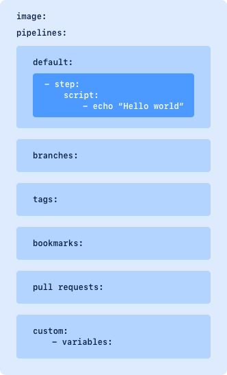
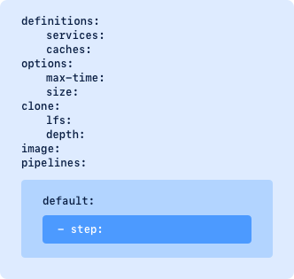

# Github  
## Github
  <br />  
## 远程仓库
1 创建SSH Key
```shell
ssh-keygen -t rsa -C "youremail@example.com"
```
一路回车，使用默认值即可  <br />  .ssh\  <br />  id_rsa 私钥  <br />  id_rsa.pub 公钥

2 登陆GitHub，打开“Account settings”，“SSH Keys”页面，在Key文本框里粘贴id_rsa.pub文件的内容

**添加远程库**
```shell
git remote add origin git@github.com:sower/Testing.git
git push [-u] origin master
```


**failed to push some refs to '**[**https://github.com/**](https://github.com/)**...**  <br />  git pull --rebase origin master


## [GitHub Pages](https://pages.github.com/)


[GitHub Docs](https://docs.github.com/en)

- [GitHub Packages](https://docs.github.com/en/packages)
- [Developers](https://docs.github.com/en/developers)
- [REST API](https://docs.github.com/en/rest)
- [GraphQL API](https://docs.github.com/en/graphql)


[

](https://docs.github.com/cn/articles/getting-started-with-writing-and-formatting-on-github)  <br />  [GitHub Flavored Markdown 规范](https://github.github.com/gfm/)


  <br />  


[使用高级 Git 命令](https://docs.github.com/cn/github/using-git/using-advanced-git-commands)

- [关于 Git 变基](https://docs.github.com/cn/github/using-git/about-git-rebase)
- [在命令行中使用 Git rebase](https://docs.github.com/cn/github/using-git/using-git-rebase-on-the-command-line)
- [解决 Git 变基后的合并冲突](https://docs.github.com/cn/github/using-git/resolving-merge-conflicts-after-a-git-rebase)
- [关于 Git 子树合并](https://docs.github.com/cn/github/using-git/about-git-subtree-merges)
- [将子文件夹拆分成新仓库](https://docs.github.com/cn/github/using-git/splitting-a-subfolder-out-into-a-new-repository)

[键盘快捷键](https://docs.github.com/cn/github/getting-started-with-github/keyboard-shortcuts)
## [搜索语法](https://docs.github.com/cn/github/searching-for-information-on-github/understanding-the-search-syntax)
| 查询 | 示例 |
| --- | --- |
| >n | [cats stars:>1000](https://github.com/search?utf8=%E2%9C%93&q=cats+stars%3A%3E1000&type=Repositories) 匹配含有 "cats" 字样、星标超过 1000 个的仓库。 |
| >=n | [cats topics:>=5](https://github.com/search?utf8=%E2%9C%93&q=cats+topics%3A%3E%3D5&type=Repositories) 匹配含有 "cats" 字样、有 5 个或更多主题的仓库。 |
| <n | [cats size:<10000](https://github.com/search?utf8=%E2%9C%93&q=cats+size%3A%3C10000&type=Code) 匹配小于 10 KB 的文件中含有 "cats" 字样的代码。 |
| <=n | [cats stars:<=50](https://github.com/search?utf8=%E2%9C%93&q=cats+stars%3A%3C%3D50&type=Repositories) 匹配含有 "cats" 字样、星标不超过 50 个的仓库。 |
| n..* | [cats stars:10..*](https://github.com/search?utf8=%E2%9C%93&q=cats+stars%3A10..*&type=Repositories) 等同于 stars:>=10 并匹配含有 "cats" 字样、有 10 个或更多星号的仓库。 |
| *..n | [cats stars:*..10](https://github.com/search?utf8=%E2%9C%93&q=cats+stars%3A%22*..10%22&type=Repositories) 等同于 stars:<=10 并匹配含有 "cats" 字样、有不超过 10 个星号的仓库。 |
| n..n | [cats stars:10..50](https://github.com/search?utf8=%E2%9C%93&q=cats+stars%3A10..50&type=Repositories) 匹配含有 "cats" 字样、有 10 到 50 个星号的仓库。 |
| >YYYY-MM-DD | [cats created:>2016-04-29](https://github.com/search?utf8=%E2%9C%93&q=cats+created%3A%3E2016-04-29&type=Issues) 匹配含有 "cats" 字样、在 2016 年 4 月 29 日之后创建的议题。 |
| >=YYYY-MM-DD | [cats created:>=2017-04-01](https://github.com/search?utf8=%E2%9C%93&q=cats+created%3A%3E%3D2017-04-01&type=Issues) 匹配含有 "cats" 字样、在 2017 年 4 月 1 日或之后创建的议题。 |
| <YYYY-MM-DD | [cats pushed:<2012-07-05](https://github.com/search?q=cats+pushed%3A%3C2012-07-05&type=Code&utf8=%E2%9C%93) 匹配在 2012 年 7 月 5 日之前推送的仓库中含有 "cats" 字样的代码。 |
| <=YYYY-MM-DD | [cats created:<=2012-07-04](https://github.com/search?utf8=%E2%9C%93&q=cats+created%3A%3C%3D2012-07-04&type=Issues) 匹配含有 "cats" 字样、在 2012 年 7 月 4 日或之前创建的议题。 |
| YYYY-MM-DD..YYYY-MM-DD | [cats pushed:2016-04-30..2016-07-04](https://github.com/search?utf8=%E2%9C%93&q=cats+pushed%3A2016-04-30..2016-07-04&type=Repositories) 匹配含有 "cats" 字样、在 2016 年 4 月末到 7 月之间推送的仓库。 |
| YYYY-MM-DD..* | [cats created:2012-04-30..*](https://github.com/search?utf8=%E2%9C%93&q=cats+created%3A2012-04-30..*&type=Issues) 匹配在 2012 年 4 月 30 日之后创建、含有 "cats" 字样的议题。 |
| *..YYYY-MM-DD | [cats created:*..2012-04-30](https://github.com/search?utf8=%E2%9C%93&q=cats+created%3A*..2012-07-04&type=Issues) 匹配在 2012 年 7 月 4 日之前创建、含有 "cats" 字样的议题。 |
| NOT | [hello NOT world](https://github.com/search?q=hello+NOT+world&type=Repositories) 匹配含有 "hello" 字样但不含有 "world" 字样的仓库。 |
| -QUALIFIER | [cats stars:>10 -language:javascript](https://github.com/search?q=cats+stars%3A%3E10+-language%3Ajavascript&type=Repositories) 匹配含有 "cats" 字样、有超过 10 个星号但并非以 JavaScript 编写的仓库。 |
|  | [mentions:defunkt -org:github](https://github.com/search?utf8=%E2%9C%93&q=mentions%3Adefunkt+-org%3Agithub&type=Issues) 匹配提及 @defunkt 且不在 GitHub 组织仓库中的议题 |
| QUALIFIER:USERNAME | [author:nat](https://github.com/search?q=author%3Anat&type=Commits) 匹配 @nat 创作的提交。 |
| QUALIFIER:@me | [is:issue assignee:@me](https://github.com/search?q=is%3Aissue+assignee%3A%40me&type=Issues) 匹配已分配给结果查看者的议题 |

[排序搜索结果](https://docs.github.com/cn/github/searching-for-information-on-github/sorting-search-results)

- sort:interactions  按最高反应和评论总数排序。
- sort:interactions  按最高反应和评论总数排序。
- sort:author-date  按作者日期降序或升序排序。
- sort:committer-date  按提交者日期降序或升序排序。
- sort:updated  按项目最近更新日期排序。
| 限定符 | 示例 |
| --- | --- |
| sort:interactions 或 sort:interactions-desc | [org:github sort:interactions ](https://github.com/search?q=org%3Agithub+sort%3Ainteractions&type=Issues)  <br />  匹配 GitHub 所拥有仓库中的议题，按最高反应和评论总数排序。 |
| sort:interactions-asc | [org:github sort:interactions-asc ](https://github.com/search?utf8=%E2%9C%93&q=org%3Agithub+sort%3Ainteractions-asc&type=Issues)  <br />  匹配 GitHub 所拥有仓库中的议题，按最低反应和评论总数排序。 |

[搜索仓库](https://docs.github.com/cn/github/searching-for-information-on-github/searching-for-repositories)

- followers:n
- forks:n
- stars:n
- language:LANGUAGE
- topic:TOPIC

[搜索主题](https://docs.github.com/cn/github/searching-for-information-on-github/searching-topics)  <br />  [搜索代码](https://docs.github.com/cn/github/searching-for-information-on-github/searching-code)  <br />  [搜索包](https://docs.github.com/cn/github/searching-for-information-on-github/searching-for-packages)


## [GitHub Packages](https://docs.github.com/en/packages)

## [GitHub Actions](https://docs.github.com/en/actions)

[awesome-actions](https://github.com/sdras/awesome-actions)

- workflow （工作流程）：持续集成一次运行的过程，就是一个 workflow。
- job （任务）：一个 workflow 由一个或多个 jobs 构成，含义是一次持续集成的运行，可以完成多个任务。
- step（步骤）：每个 job 由多个 step 构成，一步步完成。
- action （动作）：每个 step 可以依次执行一个或多个命令（action）。

actions/checkout@v2：工作流程针对仓库的代码运行，或者您使用仓库中定义的操作，须使用检出操作。

- [actions/checkout](https://github.com/actions/checkout) - Setup your repository on your workflow.
- [actions/upload-artifact](https://github.com/actions/upload-artifact) - Upload artifacts from your workflow.
- [actions/download-artifact](https://github.com/actions/download-artifact) - Download artifacts from your build.
- [actions/cache](https://github.com/actions/cache) - Cache dependencies and build outputs in GitHub Actions.
- [actions/github-script](https://github.com/actions/github-script) - Write a script for GitHub API and the workflow contexts.

[元数据语法](https://docs.github.com/cn/actions/creating-actions/metadata-syntax-for-github-actions)

[对操作使用输入和输出](https://docs.github.com/cn/actions/learn-github-actions/finding-and-customizing-actions#using-inputs-and-outputs-with-an-action)
```shell
name: 'Example'
description: 'Receives file and generates output'
inputs:
  file-path:  # id of input
    description: "Path to test script"
    required: true
    default: 'test-file.js'
outputs:
  results-file: # id of output
    description: "Path to results file"
```
[引用 Docker Hub 上的容器](https://docs.github.com/cn/actions/learn-github-actions/finding-and-customizing-actions#referencing-a-container-on-docker-hub)
```shell
jobs:
  my_first_job:
    steps:
      - name: My first step
        uses: docker://alpine:3.8
        
        
        
runs:
  using: 'docker'
  image: 'Dockerfile'
  args:
  - 'bzz'
  pre-entrypoint: 'setup.sh'
  entrypoint: 'main.sh'
```
[用于 JavaScript 操作的 runs](https://docs.github.com/cn/actions/creating-actions/metadata-syntax-for-github-actions#)
```shell
runs:
  using: 'node12'
  pre: 'setup.js'
  main: 'index.js'
  post: 'cleanup.js'
  post-if: 'runner.os == linux'
```

```shell
runs:
  using: "composite"
  steps:
    - run: ${{ github.action_path }}/test/script.sh
      shell: bash
```
[在作业之间共享数据](https://docs.github.com/cn/actions/learn-github-actions/essential-features-of-github-actions#sharing-data-between-jobs)
```shell
jobs:
  example-job:
    name: Save output
    steps:
      - shell: bash
        run: |
          expr 1 + 1 > output.log
      - name: Upload output file
        uses: actions/upload-artifact@v2
        with:
          name: output-log-file
          path: output.log
```
```shell
jobs:
  example-job:
    steps:
      - name: Download a single artifact
        uses: actions/download-artifact@v2
        with:
          name: output-log-file
```
**快速失败的矩阵工作流**
```shell
strategy:
  matrix:
    os: [ubuntu-latest, macos-latest, windows-latest]
  fail-fast: false
```

[工作流程语法](https://docs.github.com/cn/actions/reference/workflow-syntax-for-github-actions)

- [name](https://docs.github.com/cn/actions/reference/workflow-syntax-for-github-actions#)
- [on](https://docs.github.com/cn/actions/reference/workflow-syntax-for-github-actions#)
- [on.<event_name>.types](https://docs.github.com/cn/actions/reference/workflow-syntax-for-github-actions#)
- [on.<push|pull_request>.<branches|tags>](https://docs.github.com/cn/actions/reference/workflow-syntax-for-github-actions#)
- [on.<push|pull_request>.paths](https://docs.github.com/cn/actions/reference/workflow-syntax-for-github-actions#)
- [on.schedule](https://docs.github.com/cn/actions/reference/workflow-syntax-for-github-actions#)
- [env](https://docs.github.com/cn/actions/reference/workflow-syntax-for-github-actions#)
- [defaults](https://docs.github.com/cn/actions/reference/workflow-syntax-for-github-actions#)
- [defaults.run](https://docs.github.com/cn/actions/reference/workflow-syntax-for-github-actions#)
- [jobs](https://docs.github.com/cn/actions/reference/workflow-syntax-for-github-actions#)
- [jobs.<job_id>](https://docs.github.com/cn/actions/reference/workflow-syntax-for-github-actions#)
- [jobs.<job_id>.name](https://docs.github.com/cn/actions/reference/workflow-syntax-for-github-actions#)
- [jobs.<job_id>.needs](https://docs.github.com/cn/actions/reference/workflow-syntax-for-github-actions#)
- [jobs.<job_id>.runs-on](https://docs.github.com/cn/actions/reference/workflow-syntax-for-github-actions#)
- [jobs.<job_id>.environment](https://docs.github.com/cn/actions/reference/workflow-syntax-for-github-actions#)
- [jobs.<job_id>.outputs](https://docs.github.com/cn/actions/reference/workflow-syntax-for-github-actions#)
- [jobs.<job_id>.env](https://docs.github.com/cn/actions/reference/workflow-syntax-for-github-actions#)
- [jobs.<job_id>.defaults](https://docs.github.com/cn/actions/reference/workflow-syntax-for-github-actions#)
- [jobs.<job_id>.defaults.run](https://docs.github.com/cn/actions/reference/workflow-syntax-for-github-actions#)
- [jobs.<job_id>.if](https://docs.github.com/cn/actions/reference/workflow-syntax-for-github-actions#)
- [jobs.<job_id>.steps](https://docs.github.com/cn/actions/reference/workflow-syntax-for-github-actions#)
- [jobs.<job_id>.steps[*].id](https://docs.github.com/cn/actions/reference/workflow-syntax-for-github-actions#)
- [jobs.<job_id>.steps[*].if](https://docs.github.com/cn/actions/reference/workflow-syntax-for-github-actions#)
- [jobs.<job_id>.steps[*].name](https://docs.github.com/cn/actions/reference/workflow-syntax-for-github-actions#)
- [jobs.<job_id>.steps[*].uses](https://docs.github.com/cn/actions/reference/workflow-syntax-for-github-actions#)
- [jobs.<job_id>.steps[*].run](https://docs.github.com/cn/actions/reference/workflow-syntax-for-github-actions#)
- [jobs.<job_id>.steps[*].with](https://docs.github.com/cn/actions/reference/workflow-syntax-for-github-actions#)
- [jobs.<job_id>.steps[*].with.args](https://docs.github.com/cn/actions/reference/workflow-syntax-for-github-actions#)
- [jobs.<job_id>.steps[*].with.entrypoint](https://docs.github.com/cn/actions/reference/workflow-syntax-for-github-actions#)
- [jobs.<job_id>.steps[*].env](https://docs.github.com/cn/actions/reference/workflow-syntax-for-github-actions#)
- [jobs.<job_id>.steps[*].continue-on-error](https://docs.github.com/cn/actions/reference/workflow-syntax-for-github-actions#)
- [jobs.<job_id>.steps[*].timeout-minutes](https://docs.github.com/cn/actions/reference/workflow-syntax-for-github-actions#)
- [jobs.<job_id>.timeout-minutes](https://docs.github.com/cn/actions/reference/workflow-syntax-for-github-actions#)
- [jobs.<job_id>.strategy](https://docs.github.com/cn/actions/reference/workflow-syntax-for-github-actions#)
- [jobs.<job_id>.strategy.matrix](https://docs.github.com/cn/actions/reference/workflow-syntax-for-github-actions#)
- [jobs.<job_id>.strategy.fail-fast](https://docs.github.com/cn/actions/reference/workflow-syntax-for-github-actions#)
- [jobs.<job_id>.strategy.max-parallel](https://docs.github.com/cn/actions/reference/workflow-syntax-for-github-actions#)
- [jobs.<job_id>.continue-on-error](https://docs.github.com/cn/actions/reference/workflow-syntax-for-github-actions#)
- [jobs.<job_id>.container](https://docs.github.com/cn/actions/reference/workflow-syntax-for-github-actions#)
- [jobs.<job_id>.container.image](https://docs.github.com/cn/actions/reference/workflow-syntax-for-github-actions#)
- [jobs.<job_id>.container.credentials](https://docs.github.com/cn/actions/reference/workflow-syntax-for-github-actions#)
- [jobs.<job_id>.container.env](https://docs.github.com/cn/actions/reference/workflow-syntax-for-github-actions#)
- [jobs.<job_id>.container.ports](https://docs.github.com/cn/actions/reference/workflow-syntax-for-github-actions#)
- [jobs.<job_id>.container.volumes](https://docs.github.com/cn/actions/reference/workflow-syntax-for-github-actions#)
- [jobs.<job_id>.container.options](https://docs.github.com/cn/actions/reference/workflow-syntax-for-github-actions#)
- [jobs.<job_id>.services](https://docs.github.com/cn/actions/reference/workflow-syntax-for-github-actions#)
- [jobs.<job_id>.services.<service_id>.image](https://docs.github.com/cn/actions/reference/workflow-syntax-for-github-actions#)
- [jobs.<job_id>.services.<service_id>.credentials](https://docs.github.com/cn/actions/reference/workflow-syntax-for-github-actions#)
- [jobs.<job_id>.services.<service_id>.env](https://docs.github.com/cn/actions/reference/workflow-syntax-for-github-actions#)
- [jobs.<job_id>.services.<service_id>.ports](https://docs.github.com/cn/actions/reference/workflow-syntax-for-github-actions#)
- [jobs.<job_id>.services.<service_id>.volumes](https://docs.github.com/cn/actions/reference/workflow-syntax-for-github-actions#)
- [jobs.<job_id>.services.<service_id>.options](https://docs.github.com/cn/actions/reference/workflow-syntax-for-github-actions#)

[上下文和表达式语法](https://docs.github.com/cn/actions/reference/context-and-expression-syntax-for-github-actions)
```shell
steps:
  - uses: actions/hello-world-javascript-action@v1.1
    if: ${{ <expression> }}
    
env:
  my_env_var: ${{ <expression> }}
```
[函数](https://docs.github.com/cn/actions/reference/context-and-expression-syntax-for-github-actions#functions)

- contains( search, item )
- startsWith( searchString, searchValue )
- endsWith( searchString, searchValue )
- format('Hello {0} {1} {2}', 'Mona', 'the', 'Octocat')
- join( array, optionalSeparator )
- toJSON(value)
- fromJSON(value)
- hashFiles(path)

[作业状态检查函数](https://docs.github.com/cn/actions/reference/context-and-expression-syntax-for-github-actions#job-status-check-functions)

[工作流程命令](https://docs.github.com/cn/actions/reference/workflow-commands-for-github-actions)
```shell
echo "::workflow-command parameter1={data},parameter2={data}::{command value}"
```

- [设置输出参数](https://docs.github.com/cn/actions/reference/workflow-commands-for-github-actions#setting-an-output-parameter)
- [设置调试消息](https://docs.github.com/cn/actions/reference/workflow-commands-for-github-actions#setting-a-debug-message)
- [设置警告消息](https://docs.github.com/cn/actions/reference/workflow-commands-for-github-actions#setting-a-warning-message)
- [设置错误消息](https://docs.github.com/cn/actions/reference/workflow-commands-for-github-actions#setting-an-error-message)
- [对日志行分组](https://docs.github.com/cn/actions/reference/workflow-commands-for-github-actions#grouping-log-lines)
- [在日志中屏蔽值](https://docs.github.com/cn/actions/reference/workflow-commands-for-github-actions#masking-a-value-in-log)
- [停止和启动工作流程命令](https://docs.github.com/cn/actions/reference/workflow-commands-for-github-actions#stopping-and-starting-workflow-commands)
- [将值发送到 pre 和 post 操作](https://docs.github.com/cn/actions/reference/workflow-commands-for-github-actions#sending-values-to-the-pre-and-post-actions)
- [环境文件](https://docs.github.com/cn/actions/reference/workflow-commands-for-github-actions#environment-files)
- [设置环境变量](https://docs.github.com/cn/actions/reference/workflow-commands-for-github-actions#setting-an-environment-variable)
```shell
steps:
  - name: Set the value
    id: step_one
    run: |
        echo "action_state=yellow" >> $GITHUB_ENV
  - name: Use the value
    id: step_two
    run: |
        echo "${{ env.action_state }}" # This will output 'yellow'
```

- 添加系统路径
```shell
echo "$HOME/.local/bin" >> $GITHUB_PATH
```

[触发工作流程的事件](https://docs.github.com/cn/actions/reference/events-that-trigger-workflows)
```shell
on:
  # Trigger the workflow on push or pull request,
  # but only for the main branch
  push:
    branches:
      - main
  pull_request:
    branches:
      - main
  # Also trigger on page_build, as well as release created events
  page_build:
  release:
    types: # This configuration does not affect the page_build event above
      - created
     
       
on:
  schedule:
    # * is a special character in YAML so you have to quote this string
    - cron:  '*/30 5,17 * * *'
    
    
┌───────────── minute (0 - 59)
│ ┌───────────── hour (0 - 23)
│ │ ┌───────────── day of the month (1 - 31)
│ │ │ ┌───────────── month (1 - 12 or JAN-DEC)
│ │ │ │ ┌───────────── day of the week (0 - 6 or SUN-SAT)
│ │ │ │ │                                   
│ │ │ │ │
* * * * *
```
| 运算符 | 描述 | 示例 |
| --- | --- | --- |
| * | 任意值 | _  _ * 在每天的每分钟运行。 |
| , | 值列表分隔符 | 2,10 4,5 _ _ * 在每天第 4 和第 5 小时的第 2 和第 10 分钟运行。 |
| - | 值的范围 | 0 4-6 _ _ * 在第 4、5、6 小时的第 0 分钟运行。 |
| / | 步骤值 | 20/15 _  _ 从第 20 分钟到第 59 分钟每隔 15 分钟运行（第 20、35 和 50 |

[@actions/core](https://github.com/actions/toolkit/blob/main/packages/core)
```shell
const core = require('@actions/core');

const myInput = core.getInput('input');
core.setOutput('outputKey', 'outputVal');
core.exportVariable('envVar', 'Val');

try {
  core.debug('Inside try block');
  
  if (!myInput) {
    core.warning('myInput was not set');
  }
  
  if (core.isDebug()) {
    // curl -v https://github.com
  } else {
    // curl https://github.com
  }

  // Do stuff
  core.info('Output to the actions build log')
}
catch (err) {
  core.error(`Error ${err}, action may still succeed though`);
}
```


## Bitbucket
[Bitbucket Cloud](https://support.atlassian.com/bitbucket-cloud/resources/)  <br />  glob patterns  <br />  pipeline  <br />  [**Configure your pipeline**](https://support.atlassian.com/bitbucket-cloud/docs/configure-your-pipeline/)  <br />  
```shell
pipelines:
  pull-requests:
    '**': #this runs as default for any branch not elsewhere defined
      - step:
          script:
            - ...
    feature/*: #any branch with a feature prefix
      - step:
          script:
            - ...
branches:    #these will run on every push of the branch
    staging:
      - step:
          script:
            - ...
```

```shell
pipelines:
  default:
    - step:          # non-parallel step
        name: Build
        script:
          - ./build.sh
    - parallel:      # these 2 steps will run in parallel
        - step:
            name: Integration 1
            script:
              - ./integration-tests.sh --batch 1
        - step:
            name: Integration 2
            script:
              - ./integration-tests.sh --batch 2
    - step:          # non-parallel step
        script:
          - ./deploy.sh
```
[

](https://learngitbranching.js.org/?locale=zh_CN)

