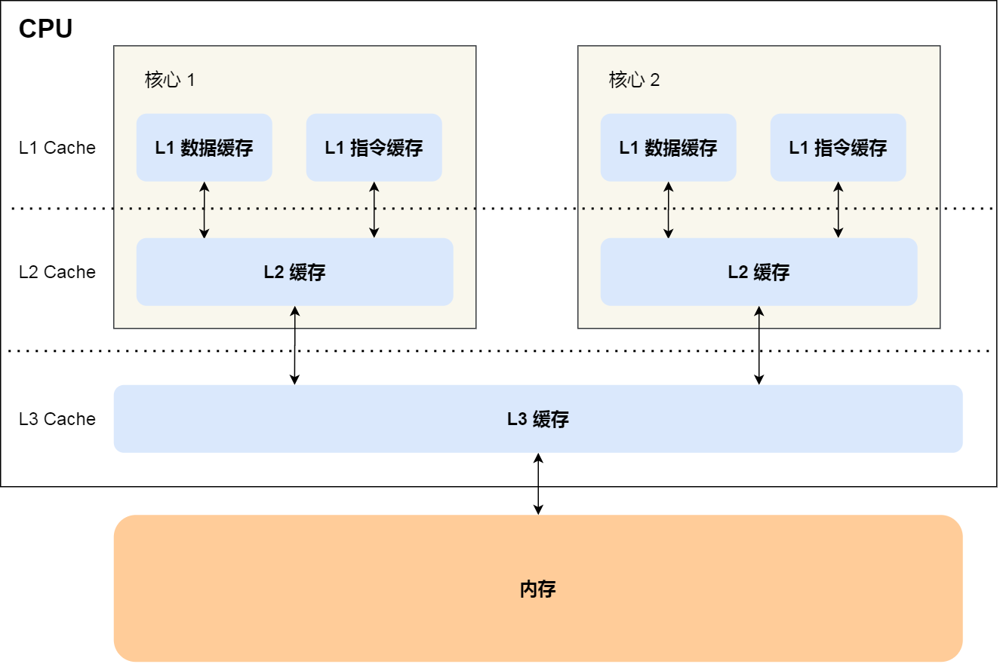

---
title: Hardware
created_at: 2022-02-01T05:44:39.000Z
updated_at: 2023-11-12T15:18:21.000Z
word_count: 1897
---  

| 计算机基本部件 |  |  |  |  |  |  |  |  |
| --- | --- | --- | --- | --- | --- | --- | --- | --- |
| 输入设备 | 键盘 | 鼠标 | 扫描仪 | 数码绘图板 | 触摸板 | 轨迹球 | 麦克风 | 摄像头 |
| 输出设备 | 显示器 | 音箱 | 打印机 | 耳机 | 扬声器 | 投影仪 |  |  |
| 存储设备 | 固态硬盘 | 移动硬盘 | CD | DVD | 软盘 | 闪存 | 磁带机 |  |
| 机箱内的设备 | 中央处理器 | 随机存取存储器 | 显示卡 | 声卡 | 主板 | 电源供应器 | 硬盘 |  |
| 接口 | 串行端口 | 并行端口 | USB | Firewire | PS/2 | RJ-45 | VGA | DVI |
|  | TRS | S/PDIF | HDMI |  |  |  |  |  |

硬件加速：在计算机中通过把计算量非常大的工作分配给专门的硬件来处理以减轻中央处理器的工作量之技术。

驱动程序（driver）：一个允许高端（High level）电脑软件（computer software）与硬件（hardware）交互的程序，这种程序创建了一个硬件与硬件，或硬件与软件沟通的接口，经由主板上的总线（bus）或其它沟通子系统（subsystem）与硬件形成连接的机制，这样的机制使得硬件设备（device）上的资料交换成为可能。

### CPU
中央处理器（Central Processing Unit）：功能主要是解释计算机指令以及处理计算机软件中的数据。

- x86：泛指一系列英特尔公司用于开发处理器的指令集架构，IA-32（Intel Architecture, 32-bit）一般情形下指代32位的架构

由于以“86”作为结尾，包括Intel 8086、80186、80286、80386以及80486，因此其架构被称为“x86”。

- x86-64（64-bit extended，x64，AMD64）：是一个处理器的指令集架构，基于x86架构的64位拓展，向后兼容于16位及32位的x86架构。x64于1999年由AMD设计。其后也为英特尔所采用，现时英特尔称之为“Intel 64”
- ARM架构：一个精简指令集（RISC）处理器架构家族，其广泛地使用在许多嵌入式系统设计。

适用于移动通信领域，符合其主要设计目标为低成本、高性能、低耗电的特性。

CPU Cache

### 内存储器（Memory）
用于暂时存放CPU中的运算数据，以及与硬盘等[外部存储器](https://baike.baidu.com/item/%E5%A4%96%E9%83%A8%E5%AD%98%E5%82%A8%E5%99%A8)交换的数据

- 易失性（volatile）：断电后会丢失存储信息，如RAM
- 非易失性（nonvolatile）：如ROM，顺序（Serial）存储器

存储器以二进制计算容量，基本单位是[Byte](https://zh.wikipedia.org/wiki/Byte)

- 1 Kilobyte(KB) =1024B
- 1 Megabyte(MB)
- 1 Gigabyte(GB)
- 1 Terabyte(TB)
- 1 Petabyte(PB)
- 1 Exabyte(EB)
- 1 Zettabyte(ZB)
- 1 Yottabyte(YB)

**ROM（Read-Only Memory，只读存储器）**

- 固定ROM：掩模编程（mask programming）
- 可编程ROM
   - PROM：一次可编程（programmable），熔丝或反熔丝
   - EPROM：光可擦除（Erasable）编程
   - EEPROM：电（Electrically）可擦除
   - FLASH（闪存）

**RAM（Random-Access Memory，随机存储器）**

- SRAM：（Static）存储单元类似于锁存器，有0，1两个稳态
- DRAM：（Dynamic）用电容器存储电荷来保存0或1，需要定时刷新

硬盘（Hard Disk Drive）

- [固态硬盘](https://zh.wikipedia.org/wiki/%E5%9B%BA%E6%80%81%E7%A1%AC%E7%9B%98)（SSD）采用闪存颗粒来存储
- [机械硬盘](https://zh.wikipedia.org/wiki/%E6%9C%BA%E6%A2%B0%E7%A1%AC%E7%9B%98)（HDD）采用磁性碟片来存储

**主板**（mainboard）：构成复杂电子系统例如电子计算机的中心或者主[电路板](https://zh.wikipedia.org/wiki/%E5%8D%B0%E5%88%B7%E9%9B%BB%E8%B7%AF%E6%9D%BF)

- [PCI-E](https://zh.wikipedia.org/wiki/PCI-E)插槽
- [M.2](https://zh.wikipedia.org/wiki/M.2)：计算机内部[扩展卡](https://zh.wikipedia.org/wiki/%E6%89%A9%E5%B1%95%E5%8D%A1)及相关[连接器](https://zh.wikipedia.org/w/index.php?title=%E9%80%A3%E6%8E%A5%E5%99%A8_(%E9%9B%BB%E8%85%A6%E7%A1%AC%E9%AB%94)&action=edit&redlink=1)的外观尺寸与针脚的电气接口规范

[BIOS](https://zh.wikipedia.org/wiki/BIOS)（Basic Input/Output System，基本输入输出系统）：在通电启动阶段执行硬件初始化，以及为操作系统提供运行时服务的[固件](https://zh.wikipedia.org/wiki/%E9%9F%8C%E9%AB%94)。

[**显卡**](https://zh.wikipedia.org/wiki/%E6%98%BE%E7%A4%BA%E5%8D%A1)     display card，也称图形卡（graphics card）     供中央处理器以外的微处理器帮助计算图像信息，并将计算机系统所需要的显示信息进行转换并提供逐行或隔行扫描信号给显示设备，是连接显示器和个人电脑主板的重要组件

构成

- 显示芯片 GPU，（Graphic Processing Unit，图形处理器）
- 显存，显示内存：暂时储存显示芯片要处理的数据和处理完毕的数据。

分类

- 集成显卡是将显示芯片、显存及其相关电路都集成在主板上，与其融为一体；
- 独立显卡是指将显示芯片、显存及其相关电路单独做在一块电路板上，自成一体而作为一块独立的板卡存在，它需占用主板的扩展插槽（ISA、PCI、AGP或PCI-E)。

Nvidia® Geforce® Experience™：一款专为游戏玩家设计的软件，它可以帮助Nvidia显卡用户快速升级驱动、优化游戏设置、截取游戏画面。在出货搭载Nvidia显卡的机台中，该软件随显卡驱动一并安装。

[网卡](https://zh.wikipedia.org/wiki/%E7%BD%91%E5%8D%A1)     网络接口控制器（network interface controller，NIC）

[声卡](https://zh.wikipedia.org/wiki/%E5%A3%B0%E5%8D%A1)：可以把来自[话筒](https://zh.wikipedia.org/wiki/%E9%BA%A6%E5%85%8B%E9%A3%8E)、[录音机](https://zh.wikipedia.org/wiki/%E9%8C%84%E9%9F%B3%E6%A9%9F)等设备的语音、[音乐](https://zh.wikipedia.org/wiki/%E9%9F%B3%E6%A8%82)等[声音](https://zh.wikipedia.org/wiki/%E8%81%B2%E9%9F%B3)变成数字信号交给电脑处理，并以文件形式保存，还可以把[数字信号](https://zh.wikipedia.org/wiki/%E6%95%B8%E4%BD%8D%E8%A8%8A%E8%99%9F)还原成为真实的[声音](https://zh.wikipedia.org/wiki/%E8%81%B2%E9%9F%B3)输出

**总线**     构成计算机系统的其他高速功能部件

- 内部总线：CPU内部连接各寄存器及运算部件之间的总线。
- 系统总线：CPU同计算
- I/O总线：中、低速I/O计算机系统的互连机构，是多个系统功能部件之间进行数据传送的公共通路。

## 接口

### USB
Universal Serial Bus（[通用串行总线](https://baike.baidu.com/item/%E9%80%9A%E7%94%A8%E4%B8%B2%E8%A1%8C%E6%80%BB%E7%BA%BF/8635470)）：一个[外部总线](https://baike.baidu.com/item/%E5%A4%96%E9%83%A8%E6%80%BB%E7%BA%BF)标准，用于规范电脑与[外部设备](https://baike.baidu.com/item/%E5%A4%96%E9%83%A8%E8%AE%BE%E5%A4%87)的连接和通讯

| USB版本 |  |  |  | 传输速度     (bit) | 理论速度     (Byte) |
| --- | --- | --- | --- | --- | --- |
| 目前官方版本名 |  | 官方市场代号 | 原名 |  |  |
| Low-Speed |  | Basic-Speed USB | USB 1.0 | 1.5Mbps | 0.1875MB/s |
| Full-Speed |  |  | USB 1.1 | 12Mbps | 1.5MB/s |
| High-Speed |  | 高速     Hi-Speed USB | USB 2.0 | 480Mbps | 60MB/s |
| USB 3.2 | Gen 1×1 | 超高速USB5Gbps     SuperSpeed USB 5Gbps | USB 3.0（曾用名USB 3.1 Gen 1） | 5Gbps | 500MB/s |
|  | Gen 2×1 | 超高速USB 10Gbps     SuperSpeed USB 10Gbps | USB 3.1（曾用名 USB 3.1 Gen 2） | 10Gbps | 1212.12MB/s |
|  | Gen 2x2 | 超高速USB 20Gbps     SuperSpeed USB 20Gbps | N/A | 20Gbps | 2424.24MB/s |
| USB4 |  |  |  | 40Gbps | 5GB/s |

标准的[USB](https://zh.wikipedia.org/wiki/USB)使用主从式的架构，USB主机端（即电脑）是“主”，而USB周边设备是“从”。只有USB服务器可以调度该链接的设置与资料传输。USB周边设备不能够自行引导资料传输，只能回应服务器的指令

**USB Type-C（通用串行总线丙种接口**）：一种[**通用串行总线**](https://zh.wikipedia.org/wiki/%E9%80%9A%E7%94%A8%E5%BA%8F%E5%88%97%E5%8C%AF%E6%B5%81%E6%8E%92)（USB）的硬件接口形式，外观上最大特点在于其上下端完全一致

**OTG**     **USB On-The-Go**，是USB 2.0规格的补充标准。它可使USB设备（如播放器或手机）从USB周边设备变为USB主机，与其他USB设备连接通信

- [HDMI](https://zh.wikipedia.org/wiki/HDMI)（High Definition Multimedia Interface，高清多媒体接口）：一种全数字化影像和声音发送接口，可以发送未压缩的音频及视频信号。
- [DisplayPort](https://zh.wikipedia.org/wiki/DisplayPort)：由PC及芯片制造商联盟开发，[影片电子标准协会](https://zh.wikipedia.org/wiki/VESA)（VESA）[标准化](https://zh.wikipedia.org/wiki/%E6%A8%99%E6%BA%96%E5%8C%96)的数字式视频接口标准
