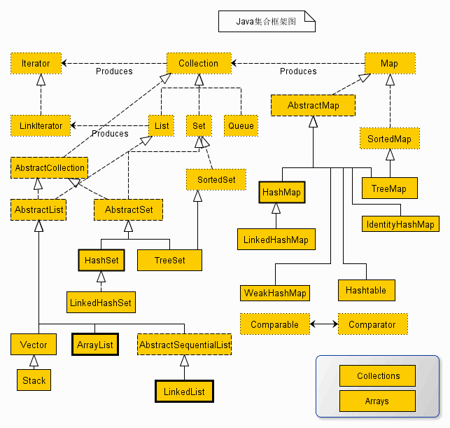

# Java API  
[openjdk](https://github.com/openjdk)/[jdk](https://github.com/openjdk/jdk)

## API
| [java.beans](https://www.matools.com/file/manual/jdk_api_1.8_google/java/beans/package-summary.html) | 包含与开发 _bean_相关的类 - 基于JavaBeans架构的组件。 |
| --- | --- |
| [java.beans.beancontext](https://www.matools.com/file/manual/jdk_api_1.8_google/java/beans/beancontext/package-summary.html) | 提供与bean上下文相关的类和接口。 |
| [java.io](https://www.matools.com/file/manual/jdk_api_1.8_google/java/io/package-summary.html) | 通过数据流，序列化和文件系统提供系统输入和输出。 |
| [java.lang](https://www.matools.com/file/manual/jdk_api_1.8_google/java/lang/package-summary.html) | 提供对Java编程语言设计至关重要的类。 |
| [java.lang.annotation](https://www.matools.com/file/manual/jdk_api_1.8_google/java/lang/annotation/package-summary.html) | 为Java编程语言注释工具提供库支持。 |
| [java.math](https://www.matools.com/file/manual/jdk_api_1.8_google/java/math/package-summary.html) | 提供执行任意精度整数运算（ BigInteger ）和任意精度十进制运算（ BigDecimal ）的类。 |
| [java.net](https://www.matools.com/file/manual/jdk_api_1.8_google/java/net/package-summary.html) | 提供实现网络应用程序的类。 |
| [java.nio](https://www.matools.com/file/manual/jdk_api_1.8_google/java/nio/package-summary.html) | 定义缓冲区，它们是数据容器，并提供其他NIO包的概述。 |


## Collections
  <br />  Iterable 和 Iterator
```java
public interface Iterator<E> {

    boolean hasNext();

    E next();

    default void remove() {
        throw new UnsupportedOperationException("remove");
    }

    default void forEachRemaining(Consumer<? super E> action) {
        Objects.requireNonNull(action);
        while (hasNext())
            action.accept(next());
    }
}
```
```java
public interface Iterable<T> {

    Iterator<T> iterator();

    default void forEach(Consumer<? super T> action) {
        Objects.requireNonNull(action);
        for (T t : this) {
            action.accept(t);
        }
    }

    default Spliterator<T> spliterator() {
        return Spliterators.spliteratorUnknownSize(iterator(), 0);
    }
}
```

### Interface Collection

- 增加 
   - `boolean add(Object o)`：向集合里添加**一个**元素，如果集合对象被添加操作改变了，则返回 true
   - `boolean addAll(Collection c)`：把集合 c 里的所有元素添加到指定集合里，如果集合对象被添加操作改变了，则返回 true
- 删除 
   - `boolean remove(Object o)`：删除集合中第一个符合条件的**指定元素** o，返回 true
   - `boolean removeAll(Collecrion c)`：从该集合中**删除**集合 c 里包含的所有元素，如果删除了一个或一个以上的元素，该方法将返回 true
   - `boolean retainAll(Collection c)`：使该集合中**仅保留**集合 c 里包含的元素（求两个集合的**交集**），如果该操作改变了调用该方法的集合，则该方法返回 true
   - `void clear()`：清除集合里的所有元素，将集合长度变为 0
- 查询 
   - `boolean contains(Object o)`：判断集合里是否包含指定元素 o
   - `boolean containsAll(Collection c)`：判断集合里是否包含集合 c 里的所有元素
   - `boolean isEmpty()`：判断集合是否为空，当集合长度为 0 时返回 true，否则返回 false
   - `int size()`：返回集合里元素的个数
- 其它操作 
   - `Iterator<E> iterator()`：获取一个 Iterator 对象（迭代器）
   - `Object[] toArray()`：把集合转换成一个数组，所有的集合元素变成对应的数组元素（**转换成 Object 数组时**，没有必要使用 toArray[new Object[0]]，可以直接使用 toArray()）
   - `T[] toArray(T[] a)`：返回一个包含此集合中所有元素的数组（返回数组的运行时类型是指定数组的类型）。如果指定的数组 a **能容纳**该集合，则 a 将在其中返回；否则，将分配一个具有指定数组的运行时类型和此集合大小的**新数组**（**集合转换为类型 T 数组时**，尽量传入空数组 T[0]）
- 默认方法 
   - `Stream<E> stream()`
   - `Stream<E> parallelStream()`
   - `boolean removeIf(Predicate<E> filter)`：删除满足给定谓词的此集合的所有元素
   - `void forEach(Consumer<? super T> action)`：对 Iterable 的每个元素执行给定的操作

### class Collections

- 排序操作 
   - `void reverse(List list)`：反转指定 List 集合中元素的顺序
   - `void shuffle(Listlist)`：对 List 集合元素进行随机排序
   - `void sort(List list)`：根据元素的自然顺序对指定 List 集合的元素按升序进行排序（底层是调用 Arrays.sort()）
   - `sort(List<T> list, Comparator<? super T> c)`：根据指定比较器产生的顺序对指定 List 集合的元素进行排序
   - `void swap(List list, int i, int j)`：将指定 List 集合的 i 处元素和 j 处元素进行交换
- 查找、替换、添加操作 
   - `int binarySearch(List list, Object key)`：使用二分搜索法搜索指定对象在 List 集合中的索引（调用该方法时要求 List 中的元素已经处于有序状态）
   - `Object min(Collection coll)`：根据元素的自然顺序， 返回给定集合中的最小元素
   - `Object max(Collectioncoll)`：根据元素的自然顺序， 返回给定集合中的最大元素
   - `boolean replaceAll(List list, Object oldVal, Object newVal)`：使用一个新值 newVal 替换 List 对象的所有旧值 oldVal
   - `boolean addAll(Collection<? super T> c, T... elements)`：将所有指定元素添加到指定 collection 中
- 创建不可变的单元素集合 
   - `Set<T> singleton(T o)`：返回一个只包含指定对象的不可变 set
   - `List<T> singletonList(T o)`：返回一个只包含指定对象的不可变列表
   - `Map<K, V> singletonMap(K key, V value)`：返回一个不可变的映射，它只将指定键映射到指定值
### List

- 增加 
   - `void add(int index, Object element)`：将元素 element 插入到 List 集合的 index 处，索引范围 [0, size)
   - `boolean addAll(int index, Collection c)`：将集合 c 所包含的所有元素都插入到 List 集合的 index 处
- 删除 
   - `Object remove(int index)`：删除并返回 **index 索引**处的元素
- **修改** 
   - `Object set(int index, Object element)`：将 index 索引处的元素替换成 element 对象，返回被替换的旧元素
- 查询 
   - `Object get(int index)`：返回集合 index 索引处的元素
   - `int indexOf(Object o)`：返回对象 o 在 List 集合中第一次出现的位置索引
   - `int lastIndexOf(Object o)`：返回对象 o 在 List 集合中最后一次出现的位置索引
- 其它 
   - `List subList(int fromlndex, int tolndex)`：返回从索引 fromlndex（包含）到索引 tolndex（不包含）处所有集合元素组成的子集合，**返回的列表由此列表支持，因此返回列表中的非结构性更改将反映在此列表中，反之亦然**（对于子列表的所有操作最终会反映到原列表上；对**父集合**元素的增加或删除，均会导致子列表的遍历、增加、删除产生 ConcurrentModificationException 异常）
   - `ListIterator<E> listIterator(int index)`：返回一个 ListIterator 对象（双向的迭代器），从列表的指定位置开始
- 默认方法 
   - `void replaceAll(UnaryOperator<E> operator)`：对列表中的每一个元素执行特定的操作，并用处理的结果替换该元素
   - `void sort(Comparator<E> c)`：使用提供的 Comparator 来比较元素排序该列表
- 常用构造器 
   - `ArrayList()`：一个数组队列，相当于**动态数组**。**ArrayList 默认初始容量大小为 10 ，添加元素时，如果发现容量已满，会自动扩容为原始大小的 1.5 倍**。
   - `ArrayList(Collection<? extends E> c)`：构造一个包含指定 collection 的元素的列表，这些元素是按照该 collection 的迭代器返回它们的顺序排列的

**LinkedList** 基于双链表结构实现，顺序访问会非常高效，而随机访问效率比较低。

- `add(E e)`：默认添加元素方法（插入尾部）
- `add(int index, E element)`：添加元素到任意位置
- `addFirst(E e)`：在头部添加元素
- `addLast(E e)`：在尾部添加元素

### Queue
> 队列，“先进先出”（FIFO）的容器

- void add(Objecte)：将指定元素加入此队列的尾部
- Object element()：获取队列头部的元素，但是不删除该元素
- boolean offer(Objecte)：将指定元素加入此队列的尾部。当使用有容量限制的队列时，此方法通常比 add(Object e) 方法更好
- Object peek()：获取队列头部的元素，但是不删除该元素。如果队列为空，则返回 null
- Object poll()：获取队列头部的元素，并删除该元素。如果队列为空，则返回 null
- Object remove()：获取队列头部的元素，并删除该元素

#### Deque
double ended queue ，双端队列

- 尾部插入  addLast(e)、offerLast(e)
- 尾部删除  removeLast()、pollLast()

#### PriorityQueue
> 基于堆实现无界优先级队列

- 在构造器中自定义优先级别 `PriorityQueue(Comparator<? super E> comparator)`
- boolean add(E e)、boolean offer(E e)：将指定的元素插入此优先级队列
- E peek()：获取但不移除此队列的头；如果此队列为空，则返回 null
- E remove()、E poll()：获取并移除此队列的头，队列为空时，remove() 抛出异常，poll() 返回 null


### Set
**HashSet **  <br />  两个对象的 hashCode() 方法返回值相等，并且两个对象通过 equals() 方法比较也相等  <br />  **LinkedHashSet**

**TreeSet**  <br />  根据红黑树结构确定元素的存储位置  <br />  查询

- Object first()：返回集合中的第一个元素
- Object last()：返回集合中的最后一个元素
- Object lower(Object e)：返回集合中位于指定元素之前的元素（即小于指定元素的最大元素，参考元素不需要是 TreeSet 集合里的元素）
- Object higher (Object e)：返回集合中位于指定元素之后的元素（即大于指定元素的最小元素，参考元素不需要是 TreeSet 集合里的元素）

其它

- SortedSet subSet(Object fromElement, Object toElement)：返回此 Set 的子集合（部分视图），范围从 froraElement（包含）到 toElement （不包含），**返回的 Set 受此 Set 支持，所以在返回 Set 中的更改将反映在此 Set 中，反之亦然**
- SortedSet headSet(Object toElement)：返回此 Set 的子集（部分视图），由小于 toElement 的元素组成，**返回的 Set 受此 Set 支持，所以在返回 Set 中的更改将反映在此 Set 中，反之亦然**
- SortedSet tailSet(Object fromElement)：返回此 Set 的子集（部分视图），由大于或等于 fromElement 的元素组成，**返回的 Set 受此 Set 支持，所以在返回 Set 中的更改将反映在此 Set 中，反之亦然**
- Comparator comparator()：如果 TreeSet 采用了定制排序，则该方法返回定制排序所使用的 Comparator；如果 TreeSet 采用了自然排序，则返回 null

### Map
> 用于保存具有映射关系的数据，元素是 key-value 对（Entry），key 不允许重复

本质 `Map.Entry<K,V>[]`	自定义对象作为 key 必须覆写 hashCode 和 equals

- 增加 / 修改 
   - `Object put(Object key, Object value)`：添加一个 key-value 对，如果当前 Map 中已有一个与该 key 相等的 key-value 对，则新的 key-value 对会**覆盖**原来的 key-value 对，返回被覆盖的 value，否则返回 null
   - `void putAll(Map m)`：将指定 Map 中的 key-value 对复制到本 Map 中
- 删除 
   - `Object remove(Object key)`：删除指定 key 所对应的 key-value 对，返回被删除 key 所关联的 value，如果该 key 不存在，则返回 null
   - `boolean remove(Object key, Object value)`：删除指定 key、value 所对应的 key-value 对
   - `void clear()`：删除该 Map 对象中的所有 key-value 对
- 查询 
   - `Object get(Object key)`：返回指定 key 所对应的 value；如果此 Map 中不包含该 key，则返回 null
   - `boolean containsKey(Object key)`：查询 Map 中是否包含指定的 key，如果包含则返回 true
   - `boolean containsValue(Object value)`：查询 Map 中是否包含一个或多个 value，如果包含则返回true
   - `boolean isEmpty()`：查询该 Map 是否为空（即不包含任何 key-value 对），如果为空则返回 true
   - `int size()`：查询该 Map 里的 key-value 对的个数
- 其它 
   - `Set<K> keySet()`：返回该 Map 中所有 key 组成的 Set 集合（相应实现类中的内部类，不支持 add 或 addAll 操作）
   - `Collection<V> values()`：返回该 Map 里所有 value 组成的 **Collection**（相应实现类中的内部类，不支持 add 或 addAll 操作）
   - `Set<Map.Entry<K, V>> entrySet()`：返回 Map 中包含的 key-value 对所组成的 Set 集合，每个集合元素都是 Map.Entry 对象（不支持 add 或 addAll 操作）
- 默认方法 
   - `void forEach(BiConsumer<K, V> action)`：对此映射中的每个条目执行给定的操作
   - `V computeIfPresent(K key, BiFunction<K, V, V> remappingFunction)`
   - `V computeIfAbsent(K key, Function<K, V> mappingFunction)`：如果 key 不存在或者对应的值是 null，则调用 mappingFunction 来产生一个值，然后将其放入 Map（**原子操作** CAS），再**返回这个值**；否则的话返回 Map 已存在的对应的值
   - `V putIfAbsent(K key, V value)`：如果 key 不存在或者对应的值是 null，则**将 value 设置进去**（**原子操作** CAS），然后**返回 null**；否则返回 Map 中对应的值，而不做其它操作
   - `V getOrDefault(Object key, V defaultValue)`：如果 key 不存在或者对应的值是 null，则返回 defaultValue
   - `boolean remove(Object key, Object value)`：仅当指定的 key 当前映射到指定的值时删除该条目
   - `boolean replace(K key, V oldValue, V newValue)`：仅当当前映射到指定的值时，才替换指定键的条目
   - `V merge(K key, V value, BiFunction<V, V, V> remappingFunction)`：如果指定的 key 尚未与值相关联或与 null 相关联，则将其与给定的非空 value 相关联，否则将关联值替换为给定重映射函数的结果
- 常用构造器 
   - `HashMap()`：构造一个具有默认初始容量（16）和默认加载因子（0.75）的空 HashMap
   - `HashMap(Map<? extends K,? extends V> m)`：构造一个映射关系与指定 Map 相同的新 HashMap


## J.U.C
并发容器

| 并发容器 | 对应的普通容器 | 描述 |
| --- | --- | --- |
| ConcurrentHashMap | HashMap | Java 1.8 之前采用分段锁机制细化锁粒度，降低阻塞，从而提高并发性；Java 1.8 之后基于 CAS 实现。 |
| ConcurrentSkipListMap | SortedMap | 基于跳表实现的 |
| CopyOnWriteArrayList | ArrayList |  |
| CopyOnWriteArraySet | Set | 基于 CopyOnWriteArrayList 实现。 |
| ConcurrentSkipListSet | SortedSet | 基于 ConcurrentSkipListMap 实现。 |
| ConcurrentLinkedQueue | Queue | 线程安全的无界队列。底层采用单链表。支持 FIFO。 |
| ConcurrentLinkedDeque | Deque | 线程安全的无界双端队列。底层采用双向链表。支持 FIFO 和 FILO。 |
| ArrayBlockingQueue | Queue | 数组实现的阻塞队列。 |
| LinkedBlockingQueue | Queue | 链表实现的阻塞队列。 |
| LinkedBlockingDeque | Deque | 双向链表实现的双端阻塞队列。 |


并发工具类  <br />  CountDownLatch	递减计数锁，用于控制一个线程等待多个线程

- await() - 调用 await() 方法的线程会被挂起，它会等待直到 count 值为 0 才继续执行。
- await(long timeout, TimeUnit unit) - 和 await() 类似，只不过等待一定的时间后 count 值还没变为 0 的话就会继续执行
- countDown() - 将统计值 count 减 1

CyclicBarrier	循环栅栏，可以让一组线程等待至某个状态之后再全部同时执行

- public CyclicBarrier(int parties)	parties 相当于一个阈值
- `public CyclicBarrier(int parties, Runnable barrierAction)`
- await() - 等待调用 await() 的线程数达到屏障数。
- await(long timeout, TimeUnit unit) - 等待至一定的时间，如果还有线程没有到达栅栏状态就直接让到达栅栏状态的线程执行后续任务。
- reset() - 将屏障重置为初始状态

Semaphore 	信号量，用来控制某段代码块的并发数

- acquire() - 获取 1 个 permit。
- acquire(int permits) - 获取 permits 数量的 permit。
- release() - 释放 1 个 permit。
- release(int permits) - 释放 permits 数量的 permit
```java
public class SemaphoreDemo {

    private static final int THREAD_COUNT = 30;

    private static ExecutorService threadPool = Executors.newFixedThreadPool(THREAD_COUNT);

    private static Semaphore semaphore = new Semaphore(10);

    public static void main(String[] args) {
        for (int i = 0; i < THREAD_COUNT; i++) {
            threadPool.execute(() -> {
                    try {
                        semaphore.acquire();
                        System.out.println("save data");
                        semaphore.release();
                    } catch (InterruptedException e) {
                        e.printStackTrace();
                    }
            });
        }

        threadPool.shutdown();
    }

}
```


## Time

- Temporal 的实现类
   - Instant（代表一个具体的时刻）
   - LocalDate（代表不带时区的日期）
   - LocalTime（代表不带时区的时间）
   - LocalDateTime（代表不带时区的日期、时间）
   - Year（代表年）
   - YearMonth（代表年月）
   - ZonedDateTime（代表带相对于指定时区的日期、时间）
- TemporalAmount 的实现类
   - Duration（代表以秒和纳秒衡量的时长，格式 PnDTnHnMn.nS）
   - Period（代表以年、月、日衡量的时长，格式 PnYnMnD）
- ZoneId（代表一个时区）
   - ZoneOffset（ZoneId 的子类，代表与 UTC/格林尼治时间的绝对偏差）
- Clock（用于获取指定时区的当前日期、时间）
- DayOfWeek（星期枚举类）、Month（月份枚举类）
- ChronoUnit（时间单位枚举类）：YEARS、MONTHS、WEEKS、DAYS、HOURS、MINUTES、SECONDS、NANOS 等
```java
// 获取当前时间
LocalDateTime now = LocalDateTime.now();
// 设置时间
LocalDateTime dateTime = LocalDateTime.of(2022, 6, 1, 23, 59, 59);

// 获取年、月、日、时、分、秒
dateTime.getYear(); // dateTime.get(ChronoField.YEAR);
dateTime.getMonth().getValue(); // dateTime.get(ChronoField.MONTH_OF_YEAR);
dateTime.getDayOfMonth(); // dateTime.get(ChronoField.DAY_OF_MONTH);
dateTime.getHour();
dateTime.getMinute();
dateTime.getSecond();

// 调整日期/时间，返回修改了属性的新对象
dateTime.withDayOfMonth(25); // dateTime.with(ChronoField.DAY_OF_MONTH, 25)
// 当月的最后一天
dateTime.with(TemporalAdjusters.lastDayOfMonth());

// 比较先后
dateTime.isAfter(now);
dateTime.isBefore(now);

// 加减时间
dateTime.plusDays(1); // dateTime.plus(1, ChronoUnit.DAYS);
dateTime.minusDays(1);

// 格式化
DateTimeFormatter formatter = DateTimeFormatter.ofPattern("yyyy-MM-dd HH:mm:ss");
// LocalDateTime 转 String
formatter.format(dateTime); // dateTime.format(formatter);
// String 转 LocalDateTime
LocalDateTime.parse("2018-10-01 23:59:59", formatter);

// LocalDateTime 转 LocalDate、LocalTime
LocalDate localDate = dateTime.toLocalDate();
LocalTime localTime = dateTime.toLocalTime();

// LocalDate、LocalTime 转 LocalDateTime
dateTime = localDate.atStartOfDay(); // 一天的开始时间
localDate.atTime(LocalTime.MIDNIGHT); // 00:00:00.000000000
localDate.atTime(LocalTime.MIN);      // 00:00:00.000000000
localDate.atTime(LocalTime.NOON);     // 12:00:00.000000000
localDate.atTime(LocalTime.MAX);      // 23:59:59.999999999
dateTime = LocalDateTime.of(localDate, localTime);

// 获取当前时间戳
long millisecond = Instant.now().toEpochMilli(); // 转换当前时间的毫秒值
long second = Instant.now().getEpochSecond(); // 获取当前时间的秒数
Instant.ofEpochMilli(millisecond); // 毫秒值转 Instant

// 将此日期转换为从 1970-01-01 开始的天数
dateTime.toEpochDay();
// 将此日期时间转换为从 1970-01-01T00：00：00Z 开始的毫秒数
dateTime.toInstant(ZoneOffset.of("+8")).toEpochMilli();

// LocalDateTime 转换为 ZonedDateTime，再转换为 Instant，再转换为 Date
Date date = Date.from(dateTime.atZone(ZoneId.systemDefault()).toInstant());
// Date 转换为 Instant，再转换为 LocalDateTime
LocalDateTime dateTime = LocalDateTime.ofInstant(date.toInstant(), ZoneId.systemDefault());

// 获取相差时间间隔（不能使用 Period.between() 返回的是两个日期差几年零几月零几天）
amount = start.until(end, ChronoUnit.DAYS); // end.toEpochDay() - start.toEpochDay()
amount = ChronoUnit.DAYS.between(start, end);

// 时间长度：Duration、Period
Duration d1 = Duration.between(time1, time2);
Duration d1 = Duration.between(dateTime1, dateTime2);
Duration d2 = Duration.between(instant1, instant2);
// Obtains a Period consisting of the number of years, months, and days between two dates.
Period tenDays = Period.between(date1, date2);

Period sixMonths = Period.ofMonths(6);
Duration sixSeconds = Duration.ofSeconds(6);
dateTime.plus(sixMonths);
dateTime.plus(sixSeconds);

// 时区 ID
ZoneId zoneId = ZoneId.systemDefault();
// ZoneId zoneId = TimeZone.getDefault().toZoneId();
// ZoneId romeZone = ZoneId.of("Asia/Shanghai");
zoneId.getId(); // 时区 ID：Asia/Shanghai
zoneId.getRules(); // 时区规则：ZoneRules[currentStandardOffset=+08:00]

// ZonedDateTime 有 LocalDateTime 几乎相同的方法，不同的是它可以设置时区
ZoneId zoneId = ZoneId.of("UTC+8"); // ZoneId.of("+8")
ZonedDateTime zonedDateTime = ZonedDateTime.of(2018, 10, 1, 23, 59, 59, 1234, zoneId);

// 为时间点添加时区信息
ZonedDateTime zdt1 = date.atStartOfDay(zoneId); // 时间为 00:00:00
ZonedDateTime zdt2 = dateTime.atZone(zoneId);
ZonedDateTime zdt3 = instant.atZone(zoneId);


ZoneId zoneId = ZoneId.of("-5");
ZonedDateTime zdt = ZonedDateTime.now(); // 2020-12-17T15:31:27.870+08:00[Asia/Shanghai]
// 获取当前时刻对应的 ZonedDateTime
ZonedDateTime zdt1 = ZonedDateTime.now(zoneId); // 2020-12-17T02:31:27.870-05:00
// 通过给 LocalDateTime 附加一个 ZoneId，变成 ZonedDateTime
ZonedDateTime zdt2 = ZonedDateTime.of(now, zoneId); // 2020-12-17T15:31:27.870-05:00
ZonedDateTime zdt2 = now.atZone(zoneId); // 2020-12-17T15:31:27.870-05:00

// 时区转换
// 1. 转换为相同时刻对应的 ZonedDateTime
ZonedDateTime zdt1 = zdt.withZoneSameInstant(zoneId);// 2020-12-17T02:31:27.870-05:00
// 2. 转换为相同日期时间对应的 ZonedDateTime
ZonedDateTime zdt2 = zdt.withZoneSameLocal(zoneId);// 2020-12-17T15:31:27.870-05:00
```

TemporalAdjusters 工厂类中返回 TemporalAdjuster（调整器）实例的静态方法

- firstDayOfMonth()：当月的第一天
- lastDayOfMonth()：当月的最后一天
- firstDayOfNextMonth()：下月的第一天
- lastInMonth(DayOfWeek dayOfWeek)：下月的最后一天
- firstDayOfNextYear()：明年的第一天
- firstDayOfYear()：当年的第一天
- lastDayOfYear()：今年的最后一天
- dayOfWeekInMonth(int ordinal, DayOfWeek dayOfWeek)：同一个月中，第几个符合星期几要求的值
- firstInMonth(DayOfWeek dayOfWeek)：同一个月中，第一个符合星期几要求的值
- lastInMonth(DayOfWeek dayOfWeek)：同一个月中，最后一个符合星期几要求的值
- previous(DayOfWeek dayOfWeek)：在当前日期之前第一个符合指定星期几要求的日期
- next(DayOfWeek dayOfWeek)：在当前日期之后第一个符合指定星期几要求的日期
- previousOrSame(DayOfWeek dayOfWeek)：在当前日期之后第一个符合指定星期几要求的日期，如果当前日期已经符合要求，直接返回该对象
- nextOrSame(DayOfWeek dayOfWeek)：在当前日期之后第一个符合指定星期几要求的日期，如果当前日期已经符合要求，直接返回该对象


## Number
### BigDecimal
全局静态常量：ZERO、ONE、TEN、ROUND_HALF_UP（对应于 RoundingMode.HALF_UP）  <br />  常用实例方法

- BigDecimal divide(BigDecimal divisor)：返回一个 BigDecimal，其值为 (this / divisor)，如果无法表示准确的商值，则抛出 ArithmeticException
- BigDecimal divide(BigDecimal divisor, int scale, RoundingMode roundingMode)：返回一个 BigDecimal，其值为 (this / divisor)，要保留的小数位数 scale，舍入模式 roundingMode（如 RoundingMode.HALF_UP 表示四舍五入）
- BigDecimal setScale(int newScale, RoundingMode roundingMode), BigDecimal setScale(int newScale, int roundingMode)：返回一个 BigDecimal，要保留的小数位数 newScale，舍入模式 roundingMode
- BigDecimal stripTrailingZeros()：返回的 BigDecimal，其数值上等于此小数，但从该表示形式移除所有尾部零

### Math
基本数学运算，如初等指数、对数、平方根和三角函数等，随机数  <br />  常量字段：E、PI  <br />  方法

- double random()：返回带正号的 double 值（伪随机数），[0.0, 1.0)
- int min(int a, int b)：返回两个数的较小值
- int max(int a, int b)：返回两个数的较大值
- int toIntExact(long value)：将 long 值转换为 int 值
- int addExact(int x, int y)
- int subtractExact(int x, int y)
- int multiplyExact(int x, int y)
- long round(double a)、int round(float a)：执行标准舍入，将数值四舍五入为最接近的整数
- double ceil(double a)：执行向上舍入，将数值向上舍入为最接近的 double 值
- double floor(double a)：执行向下舍入，将数值向下舍入为最接近的 double 值


### Random
使用种子创建随机数生成器，生成下一个伪随机数  <br />  构造器

- Random()：使用默认的种子创建一个随机数生成器对象（以当前系统时间作为种子）
- Random(long seed)

实例方法

- int nextInt()：返回一个伪随机整数，[0, int 最大值)，类似还有返回 long、float [0.0, 1.0)、double [0.0, 1.0)、boolean 的方法
- int nextInt(int n)：返回一个伪随机数，[0, n)
- IntStream ints(int randomNumberOrigin, int randomNumberBound)
- IntStream ints(long streamSize, int randomNumberOrigin, int randomNumberBound)：返回一个流，生成 streamSize 个 [randomNumberOrigin, randomNumberBound) 范围内的 int 值


## Process
### Runtime
类方法

- Runtime getRuntime()：获取与当前 Java 应用程序相关的运行时对象（单例模式）

实例方法

- Process exec(String command)：在单独的进程中执行指定的字符串命令，返回一个新的 Process 对象
- Process exec(String command, String[] envp, File dir)：command从dir目录中执行带有指定环境变量
- Process exec(String cmdArray[])：以字符串数组的形式执行命令
- Process exec(String cmdarray[], String[] envp, File dir)：从dir目录中执行带有指定环境变量的命令
- void exit(int status)：终止 JVM（非 0 的状态码表示异常终止）
- void gc()：运行 GC
- void addShutdownHook(Thread hook)：注册虚拟机关闭钩子（一个已初始化但尚未启动的线程）
- int availableProcessors()：返回虚拟机可用处理器的数目

### ProcessBuilder

- `command()`：返回此进程生成器的操作系统程序和参数。
- `command(List<String> command)`：设置此进程生成器的操作系统程序和参数。
- `command(String… command)`：设置此进程生成器的操作系统程序和参数。
- `directory()`：返回此进程生成器的工作目录。
- `directory(File directory)`：设置此进程生成器的工作目录。
- `environment()`：返回此进程生成器环境的字符串映射视图。可以修改环境变量
- redirectErrorStream()
- `redirectErrorStream(boolean redirectErrorStream)`：通知进程生成器是否合并标准错误和标准输出。
- `start()`：使用此进程生成器的属性启动一个新进程。
```java
String command = "ping 127.0.0.1";

Runtime runtime = Runtime.getRuntime();
Process process1 = runtime.exec(command);
printResult(process1.getInputStream());

ProcessBuilder processBuilder = new ProcessBuilder(command.split(" "));
processBuilder.redirectErrorStream(true);
Process process2 = processBuilder.start();
printResult(process2.getInputStream());

public static void printResult(InputStream inputStream) throws IOException {
  BufferedReader reader = new BufferedReader(new InputStreamReader(inputStream,"gbk"));
  String s;
  while ((s = reader.readLine())!= null) {
    System.out.println(s);
  }
}
```


## JDBC
Java DataBase Connectivity（Java 数据库连接），一组可以执行 SQL 语句的 Java API（Java 数据库的统一访问接口）

**Connection**  <br />  代表数据库连接对象（一个物理连接会话）

- 创建语句对象  <br />  Statement createStatement()：创建一个 Statement 对象  <br />  PreparedStatement prepareStatement(String sql)：创建一个 PreparedStatement 对象  <br />  PreparedStatement prepareStatement(String sql, int autoGeneratedKeys)：创建一个 PreparedStatement 对象，并设置该对象是否能**获取自动生成的主键**（int 常量：Statement.RETURN_GENERATED_KEYS）
- 控制事务  <br />  void setAutoCommit(boolean autoCommit)：false 为关闭自动提交，开启事务（MySQL 默认打开自动提交）  <br />  void commit()：提交事务，并释放所持有的数据库锁  <br />  void rollback()：回滚事务，并释放所持有的数据库锁（**在 catch 块中**回滚事务）

**Statement**  <br />  用于执行静态 SQL 语句（将 SQL 语句发送到数据库）

- int 常量：RETURN_GENERATED_KEYS、NO_GENERATED_KEYS
- 执行语句  <br />  int executeUpdate(String sql)：执行 DML 语句时返回受影响的行数；执行 DDL 语句时返回 0  <br />  int executeUpdate(String sql, int autoGeneratedKeys)：执行给定的 DML 语句，并设置此 Statement 生成的自动生成键是否能用于获取  <br />  ResultSet executeQuery(String sql)：执行 DQL 语句，并返回查询结果对应的 ResultSet 对象
- 批量更新  <br />  void addBatch(String sql)：将给定的 SQL 命令添加到此 Statement 对象的当前命令列表中  <br />  int[] executeBatch()、long[] executeLargeBatch()：将**一批命令**（DDL、DML 语句）提交给数据库来执行，如果全部命令执行成功，则返回影响行数组成的数组  <br />  void clearBatch()：清空此 Statement 对象的当前 SQL 命令列表
- 获取自动生成主键  <br />  ResultSet getGeneratedKeys()：获取由于执行此 Statement 对象而创建的**所有**自动生成的主键

**PreparedStatement **  <br />  Statement 的子接口，用于执行带占位符（?）参数的 SQL 语句

- 给参数设值即添加到批处理  <br />  viod setXxx(int parameterIndex, Xxx value)：根据索引（从 1 开始）将 SQL 语句中指定位置的参数设置为 value 值，如果不清楚预编译 SQL 语句中各参数的类型，可以使用 setObject() 方法来传入参数  <br />  void setBlob(int parameterIndex, InputStream inputStream)：将指定参数设置为输入流对象  <br />  void addBatch()：将**一组参数**添加到此 PreparedStatement 对象的批处理命令中（调用前需先为参数设置）
- 执行语句  <br />  int executeUpdate()：执行 DML 语句或 DDL 语句（无须接收 SQL 字符串）  <br />  ResultSet executeQuery()：执行 DQL 语句（无须接收 SQL 字符串）

**ResultSet**  <br />  结果集对象  <br />  boolean next()：将光标从当前行移动到下一行（光标的初始位置是第一行之前）  <br />  Xxx getXxx(int columnIndex)：获取当前行中的指定列索引（从 1 开始）的数据  <br />  Xxx getXxx(String columnName)：获取当前行中的指定列名的数据


maven引入
```java
<dependency>
  <groupId>mysql</groupId>
  <artifactId>mysql-connector-java</artifactId>
  <version>8.0.19</version>
</dependency>
```
```java
import java.sql.*;
 
public class MySQLDemo {
 
    // MySQL 8.0 以下版本 - JDBC 驱动名及数据库 URL
    // static final String JDBC_DRIVER = "com.mysql.jdbc.Driver";  
    //static final String DB_URL = "jdbc:mysql://localhost:3306/RUNOOB";
 
    // MySQL 8.0 以上版本 - JDBC 驱动名及数据库 URL
    static final String JDBC_DRIVER = "com.mysql.cj.jdbc.Driver";  
    static final String DB_URL = "jdbc:mysql://localhost:3306/RUNOOB?useSSL=false&serverTimezone=UTC";
 
    // 数据库的用户名与密码，需要根据自己的设置
    static final String USER = "root";
    static final String PASS = "password";
 
    public static void main(String[] args) {
        Connection conn = null;
        Statement stmt = null;
        try{
            // 注册 JDBC 驱动
            Class.forName(JDBC_DRIVER);
        
            // 打开链接
            System.out.println("连接数据库...");
            conn = DriverManager.getConnection(DB_URL,USER,PASS);
        
            // 执行查询
            System.out.println(" 实例化Statement对象...");
            stmt = conn.createStatement();
            String sql;
            sql = "SELECT id, name, url FROM websites";
            ResultSet rs = stmt.executeQuery(sql);
        
            // 展开结果集数据库
            while(rs.next()){
                int id  = rs.getInt("id");// 可以使用字段名
                String name = rs.getString(2);// 也可以使用字段的顺序，从1开始
                String url = rs.getString("url");
    
                // 输出数据
                System.out.print("ID: " + id + ", 站点名称: " + name) + ", 站点 URL: " + url);
            }
            // 完成后关闭
            rs.close();
            stmt.close();
            conn.close();
        }catch(SQLException se){
            // 处理 JDBC 错误
            se.printStackTrace();
        }catch(Exception e){
            // 处理 Class.forName 错误
            e.printStackTrace();
        }finally{
            // 关闭资源
            try{
                if(stmt!=null) stmt.close();
            }catch(SQLException se2){
            }// 什么都不做
            try{
                if(conn!=null) conn.close();
            }catch(SQLException se){
                se.printStackTrace();
            }
        }
        System.out.println("Goodbye!");
    }
}
```
| SQL数据类型 | Java数据类型 |
| --- | --- |
| BIT, BOOL | boolean |
| INTEGER | int |
| BIGINT | long |
| REAL | float |
| FLOAT, DOUBLE | double |
| CHAR, VARCHAR | String |
| DECIMAL | BigDecimal |
| DATE | java.sql.Date, LocalDate |
| TIME | java.sql.Time, LocalTime |


**prepareStatement + batch**
```java
public static void main(String[] agr) throws ClassNotFoundException {
	try {
		Class.forName("com.mysql.cj.jdbc.Driver");
            String[] web=new String[] {"baidu","google","yahoo"};
		String sql = "insert into site value(null,?,?,?)";
		try (Connection conn = DriverManager.getConnection("jdbc:mysql://localhost/web
                  ?useSSL=true&serverTimezone=GMT", "root", "password");
		PreparedStatement ps = conn.prepareStatement(sql,Statement.RETURN_GENERATED_KEYS)) {
			for(int i=0;i<web.length;++i) {
				ps.setInt(1,i);
				ps.setString(2, web[i]);
				ps.setString(3, fun(web[i]));
				ps.addBatch();
			}
			int[] ns=ps.executeBatch();
			for (int n : ns) {
			        System.out.println(n + " inserted."); // batch中每个SQL执行的结果数量
			}
		}
	} catch (Exception e) {
		e.printStackTrace();
	}
	System.out.println("excuted");
}
             
public static String fun(String a) {
		return "www."+a+".com";
}
```
**事务**
```java
conn.setAutoCommit(false); // 关闭自动提交:
stmt.execute("update site set name='google' where id=4");
stmt.execute("update site set url=\"www.google.com\" where id=4");
conn.commit(); // 提交事务:
```
**连接池**
```java
import java.sql.*;
import jdbc.ConnectionPool;
   
public class TestConnectionPool {
    public static void main(String[] args) {
        ConnectionPool cp = new ConnectionPool(3);
        for (int i = 0; i < 100; i++) {
            new WorkingThread("working thread" + i, cp).start();
        }
    }
}
   
class WorkingThread extends Thread {
    private ConnectionPool cp;
   
    public WorkingThread(String name, ConnectionPool cp) {
        super(name);
        this.cp = cp;
    }
   
    public void run() {
        Connection c = cp.getConnection();
        System.out.println(this.getName()+ ":\t 获取了一根连接，并开始工作"  );
        try (Statement st = c.createStatement()){
             
            //模拟时耗１秒的数据库ＳＱＬ语句
            Thread.sleep(1000);
            st.execute("select * from hero");
   
        } catch (SQLException | InterruptedException e) {
            // TODO Auto-generated catch block
            e.printStackTrace();
        }
        cp.returnConnection(c);
    }
}
```


## Network
InetAddress

- 类方法  <br />  InetAddress getByName(String host)：根据主机获取对应的 IP 对象  <br />  InetAddress getLocalHost()：类方法，获取本机 IP 地址对应的 IP 对象  <br />  isReachable()：测试是否可以在指定时间内到达该地址
- 实例方法  <br />  String getHostAddress()：返回该 InetAddress 实例对应的 IP 地址字符串  <br />  String getHostName()：获取此 IP 地址的主机名  <br />  String getCanonicalHostName()：获取此 IP 地址的全限定域名

URL

- String URLDecoder.decode(String s, String enc)：使用指定字符集将特殊字符串转换成普通字符串（解码）
- String URLEncoder.encode(String s, String enc)：使用指定字符集将普通字符串转换成特殊字符串（编码）（~ ! * ( ) - _ ' . 不会被编码）


UDP
```java
public class Server {
	public static void main(String[] args) throws Exception {
		System.out.println("接受启动中···");
		DatagramSocket server=new DatagramSocket(9999);
		byte[] container=new byte[1024*60];
		DatagramPacket packet=new DatagramPacket(container,0,container.length);
		server.receive(packet);
		byte[] datas=packet.getData();
		System.out.println(new String(datas,0,datas.length));
		server.close();
	}
}
public class Client{
	public static void main(String[] args) throws Exception {
		System.out.println("发送启动中···");
		DatagramSocket client=new DatagramSocket(8888);
		String data="Web Programming";
		byte[] datas=data.getBytes();
		DatagramPacket packet=new DatagramPacket(datas,0, datas.length,
				new InetSocketAddress("localhost",9999));
		client.send(packet);
		client.close();
	}
}
```


**Socket**
```java
import java.net.*;
import java.io.*;
import java.util.*;
//服务端
public class Server {
 
    public static void main(String[] args) {
        try {
 
            ServerSocket ss = new ServerSocket(8888);
 
            System.out.println("监听在端口号:8888");
            Socket s = ss.accept();
            System.out.println("有连接过来" + s);
            
            InputStream is = s.getInputStream();
 
            //把输入流封装在DataInputStream
            DataInputStream dis = new DataInputStream(is);
            //使用readUTF读取字符串
            String msg = dis.readUTF();
            System.out.println(msg);
            dis.close();
            s.close();
            ss.close();
        } catch (IOException e) {
            // TODO Auto-generated catch block
            e.printStackTrace();
        }
        
    }
}
// 客户端
public class Client {
 
    public static void main(String[] args) {
 
        try {
            Socket s = new Socket("127.0.0.1", 8888);
 
            OutputStream os = s.getOutputStream();
            DataOutputStream dos = new DataOutputStream(os);
             
            //使用Scanner读取控制台的输入，并发送到服务端
            Scanner sc = new Scanner(System.in);
             
            String str = sc.next();
            dos.writeUTF(str);
             
            dos.close();
            s.close();
        } catch (UnknownHostException e) {
            // TODO Auto-generated catch block
            e.printStackTrace();
        } catch (IOException e) {
            // TODO Auto-generated catch block
            e.printStackTrace();
        }
    }
}
```

**RMI（Remote Method Invocation，远程调用）**  <br />  一个JVM中的代码可以通过网络实现远程调用另一个JVM的某个方法  <br />  RMI要求服务器和客户端共享同一个接口
```java
import java.rmi.Remote
public interface WorldClock extends Remote {
    LocalDateTime getLocalDateTime(String zoneId) throws RemoteException;
}
```
服务器
```java
// 服务器的实现类
public class WorldClockService implements WorldClock {
    @Override
    public LocalDateTime getLocalDateTime(String zoneId) throws RemoteException {
        return LocalDateTime.now(ZoneId.of(zoneId)).withNano(0);
    }
}
// 将WorldClock实例注册到RMI服务
public class Server {
    public static void main(String[] args) throws RemoteException {
        System.out.println("create World clock remote service...");
        // 实例化一个WorldClock:
        WorldClock worldClock = new WorldClockService();
        // 将此服务转换为远程服务接口:
        WorldClock skeleton = (WorldClock) UnicastRemoteObject.exportObject(worldClock, 0);
        // 将RMI服务注册到1099端口:
        Registry registry = LocateRegistry.createRegistry(1099);
        // 注册此服务，服务名为"WorldClock":
        registry.rebind("WorldClock", skeleton);
    }
}
```
客户端
```java
public class Client {
    public static void main(String[] args) throws RemoteException, NotBoundException {
        // 连接到服务器localhost，端口1099:
        Registry registry = LocateRegistry.getRegistry("localhost", 1099);
        // 查找名称为"WorldClock"的服务并强制转型为WorldClock接口:
        WorldClock worldClock = (WorldClock) registry.lookup("WorldClock");
        // 正常调用接口方法:
        LocalDateTime now = worldClock.getLocalDateTime("Asia/Shanghai");
        // 打印调用结果:
        System.out.println(now);
    }
}
```

## Web
### Servlet
Server Applet，即小服务程序或服务连接器。Servlet 是 Java 编写的服务器端程序，具有独立于平台和协议的特性，主要功能在于交互式地浏览和生成数据，生成动态 Web 内容。
```java
public interface Servlet {
    void init(ServletConfig var1) throws ServletException;

    ServletConfig getServletConfig();

    void service(ServletRequest var1, ServletResponse var2) throws ServletException, IOException;

    String getServletInfo();

    void destroy();
}
```
Servlet 生命周期

1. **加载** - 第一个到达服务器的 HTTP 请求被委派到 Servlet 容器。容器通过类加载器使用 Servlet 类对应的文件加载 servlet；
2. **初始化** - Servlet 通过调用 **init ()** 方法进行初始化。
3. **服务** - Servlet 调用 **service()** 方法来处理客户端的请求。
4. **销毁** - Servlet 通过调用 **destroy()** 方法终止（结束）。
5. **卸载** - Servlet 是由 JVM 的垃圾回收器进行垃圾回收的。

示例

- Servlet实例必须由Servlet容器自动创建，并给每个Servlet类创建唯一实例；
- Servlet容器会使用多线程执行doGet()或doPost()方法
```java
@WebServlet(urlPatterns = "/")
public class HelloServlet extends HttpServlet {
    protected void doGet(HttpServletRequest req, HttpServletResponse resp)
            throws ServletException, IOException {
        // 设置响应类型:
        resp.setContentType("text/html");
        // 获取输出流:
        PrintWriter pw = resp.getWriter();
        // 写入响应:
        pw.write("<h1>Hello, world!</h1>");
        // 强制输出:
        pw.flush();
    }
}
```


**HttpServletRequest**

- 获取请求行信息 
   - `String getMethod()`：获取请求方式
   - `String getRequestURI()`：获取请求的 URI，从协议名称一直到查询字符串的那一部分，即返回请求行中的资源名，包括上下文路径，如 /test/index.html
   - `StringBuffer getRequestURL()`：获取请求的 URL，包含协议、服务器名、端口号、资源路径信息，不包含查询字符串参数，即浏览器地址栏的内容
   - `public String getQueryString()`：获取包含在请求 URL 中路径后面的查询字符串，即`?`后的字符串
   - `String getContextPath()`：获取上下文路径，即 `<Context />` 元素的 path 属性值
- 获取请求头信息 
   - `String getHeader(String name)`：获取指定请求头的值
   - `Enumeration<String> getHeaderNames()`：获取所有请求头的名称
   - `Enumeration<String> getHeaders(String name)`：获取指定请求头的多个值
   - `int getIntHeader(String name)`：获取指定请求头的值，并将该值转为整数值
   - `Locale getLocale()`：根据 **Accept-Language** 请求头返回客户端将在其中接受内容的**首选 Locale**，如果客户端请求未提供 Accept-Language 请求头，则返回服务器的默认语言环境  <br />  Enumeration getLocales()
- 获取请求参数 
   - `String getParameter(String paramName)`：根据参数名称，获取对应请求参数的值
   - `String[] getParameterValues(String paramName)`：根据参数名称，获取对应请求参数的多个所组成的数组
   - `Map getParameterMap()`：获取所有请求参数名和参数值所组成的 Map 对象
   - `Enumeration<String> getParameterNames()`：获取所有请求参数名所组成的 Enumeration 对象
- 操作 request 范围的属性
   - `setAttribute(String attrName, Object value)`
   - `getAttribute(String attrName)`
- 执行请求转发（forward）或请求包含（include） 
   - HttpServletRequest 类提供了一个 getRequestDispatcher (String path) 方法（获取请求分发器），其中 path 就是希望 forward 或者 include 的目标路径（以斜线开头表示当前 web 应用的根路径，不以斜线开头表示相对路径），该方法返回 **RequestDispatcher**，该对象提供了如下两个方法：
      - `void forward(ServletRequest request, ServletResponse response)`：执行 forward
      - `void include(ServletRequest request, ServletResponse response)`：执行 include
   - forward 用户请求时，请求参数和 request 范围的属性都不会丢失
- 获取网络信息 
   - `String getRemoteAddr()`：返回发出请求的客户机的 IP 地址
- 其它 
   - `ServletInputStream getInputStream()`：以二进制数据形式获取请求正文，返回输入流
   - `BufferedReader getReader()`：获取请求正文

**HttpServletResponse**  <br />  常用方法

- void setCharacterEncoding(String charset)：设置将发送到客户端的响应的字符编码
- void setContentType(String type)：设置将发送到客户端的响应的内容类型（MIME 类型、编码方式），如 "text/html; charset=UTF-8"、"application/x-msdownload"
- void setHeader(String name, String value)：用给定名称和值设置响应头
- void setStatus(int sc)：设置此响应的状态代码
- ServletOutputStream getOutputStream()：获取响应输出字节流，可用于文件下载
- PrintWriter getWriter()：获取可将字符文本发送到客户端的字符输出流
- void sendRedirect(String path)：重新向 path 资源发送请求，path 需加上上下文路径（当以 http 开头时，表示重定向到外部的一个资源）
- String encodeURL(String url)：通过将会话 ID 包含在指定 URL 中对该 URL 进行编码，如果不需要编码，则返回未更改的 URL（URL 重写，用于不支持 cookie 的浏览器）


### Filter
对用户请求进行预处理，也可以对 HttpServletResponse 进行后处理
```java
@WebFilter(filterName = "CharsetFilter",
        urlPatterns = "/*",  //对所有的web资源进行拦截
        initParams = {
                @WebInitParam(name = "charset", value = "utf-8") // 初始化的参数
        })
public class CharsetFilter implements Filter {
    private String filterName;
    private String charset;

    public void init(FilterConfig config) throws ServletException {
        filterName = config.getFilterName();
        charset = config.getInitParameter("charset");

        System.out.println("过滤器名称：" + filterName);
        System.out.println("字符集编码：" + charset);
    }

    public void doFilter(ServletRequest req, ServletResponse resp, FilterChain chain) throws ServletException, IOException {
        // 对request和response进行一些处理，然后交给下一个过滤器或Servlet处理
		System.out.println(filterName + "doFilter()");
        req.setCharacterEncoding(charset);
        resp.setCharacterEncoding(charset);
        chain.doFilter(req, resp);
    }

    public void destroy() {
        System.out.println(filterName + "销毁");
    }
}
```

### Listener
监听 Web 应用的内部事件

- ServletContextListener：用于监听 Web 应用的启动和关闭
- ServletContextAttributeListener：用于监听 application 内属性的改变（被添加、删除、替换）
- ServletRequestListener：用于监听用户请求的初始化和销毁
- ServletRequestAttributeListener：用于监听 request 内属性的改变（被添加、删除、替换）
- HttpSessionListener：用于监听 session 的创建和销毁（可以通过该监听器监听系统的在线用户）
- HttpSessionAttributeListener：用于监听 session 内属性的改变（被添加、删除、替换）
```java
@WebListener(value = "servletContextListener")
public class ContextListener implements ServletContextListener, ServletContextAttributeListener {
    @Override
    public void contextInitialized(ServletContextEvent sce) {
        /*servletContext创建时调用*/
        System.out.println("项目启动了");
    }

    @Override
    public void contextDestroyed(ServletContextEvent sce) {
        /*servletContext销毁时调用*/
        System.out.println("项目停止了");
    }
    
    @Override
    public void attributeAdded(ServletContextAttributeEvent scae) {
        /* 添加属性时调用 */
        System.out.println("新增的属性："+scae.getName()+":"+scae.getValue());
    }

    @Override
    public void attributeRemoved(ServletContextAttributeEvent scae) {
        /*属性移除时调用*/
        System.out.println("移除的属性："+scae.getName()+":"+scae.getValue());
    }

    @Override
    public void attributeReplaced(ServletContextAttributeEvent scae) {
        /*属性替换时调用（修改值）*/
        System.out.println("替换的属性："+scae.getName()+":"+scae.getValue());
    }
}
```


## 国际化

定义不同语种的模板  <br />  Java 中将多语言文本存储在格式为 properties 的资源文件中，在`src/main/resources/locales` 路径下  <br />  `<资源名>_<语言代码>_<国家/地区编码>.properties`

JDK 的 bin 目录下有一个将非 ASCII 字符转为 Unicode 编码的工具：**native2ascii**。  <br />  `native2ascii [-reverse] [-encoding 编码] [输入文件 [输出文件]]`

java.util.Locale 对象表示了特定的地理、政治和文化地区
```java
// 初始化一个通用英语的locale.
Locale locale1 = new Locale("en");
// 初始化一个加拿大英语的locale.
Locale locale2 = new Locale("en", "CA");
// 初始化一个美式英语变种硅谷英语的locale
Locale locale3 = new Locale("en", "US", "SiliconValley");
// 根据Locale常量初始化一个简体中文
Locale locale4 = Locale.SIMPLIFIED_CHINESE;
```

java.util.ResourceBoundle	加载本地化资源文件的工具类
```java
String baseName = "realpath/bundleName";

// 根据语言+地区编码初始化
ResourceBundle rbUS = ResourceBundle.getBundle(baseName, new Locale("en", "US"));
// 根据Locale常量初始化
ResourceBundle rbZhCN = ResourceBundle.getBundle(baseName, Locale.SIMPLIFIED_CHINESE);
// 获取本地系统默认的Locale初始化
ResourceBundle rbDefault = ResourceBundle.getBundle(baseName);
//等价 ResourceBundle rbDefault =ResourceBundle.getBundle(baseName, Locale.getDefault());


System.out.println("us-US:" + String.format(rbUS.getString("time"), "08:00"));
System.out.println("zh-CN：" + rbZhCN.getString("key"));
```

**支持本地化的工具类**  <br />  NumberFormat
```java
double num = 123456.78;
NumberFormat format = NumberFormat.getCurrencyInstance(Locale.SIMPLIFIED_CHINESE);
System.out.format("%f 的本地化（%s）结果: %s", num, Locale.SIMPLIFIED_CHINESE, format.format(num));
```
DateFormat
```java
Date date = new Date();
DateFormat df = DateFormat.getDateInstance(DateFormat.MEDIUM, Locale.SIMPLIFIED_CHINESE);
System.out.format("%s 的本地化（%s）结果: %s\n", date, Locale.SIMPLIFIED_CHINESE, df.format(date));
```
Messageformat 提供一种与语言无关的拼接消息的方式
```java
String pattern = "{0}，你好！你于  {1} 消费  {2} 元。";
Object[] params = {"Jack", new GregorianCalendar().getTime(), 8888};
MessageFormat mf = new MessageFormat(pattern, Locale.SIMPLIFIED_CHINESE);
String msg = mf.format(params);
System.out.println(msg);
```


