apiVersion: apps/v1
kind: StatefulSet
metadata:
  name: web
spec:
  selector:
    matchLabels:
      app: nginx # 必须匹配 .spec.template.metadata.labels
  serviceName: "nginx"
  replicas: 3 # 默认值是 1
  minReadySeconds: 10 # 默认值是 0
  template:
    metadata:
      labels:
        app: nginx # 必须匹配 .spec.selector.matchLabels
    spec:
      terminationGracePeriodSeconds: 10
      containers:
      - name: nginx
        image: registry.k8s.io/nginx-slim:0.8
        ports:
        - containerPort: 80
          name: web
        volumeMounts:
        - name: www
          mountPath: /usr/share/nginx/html
  volumeClaimTemplates:
  - metadata:
      name: www
    spec:
      accessModes: [ "ReadWriteOnce" ]
      storageClassName: "my-storage-class"
      resources:
        requests:
          storage: 1Gi
```


### [DaemonSet](https://kubernetes.io/zh/docs/concepts/workloads/controllers/daemonset/)
确保全部（或者某些）节点上运行一个 Pod 的副本

```yaml
apiVersion: apps/v1
kind: DaemonSet
metadata:
  name: fluentd-elasticsearch
  namespace: kube-system
  labels:
    k8s-app: fluentd-logging
spec:
  selector:
    matchLabels:
      name: fluentd-elasticsearch
  template:
    metadata:
      labels:
        name: fluentd-elasticsearch
    spec:
      tolerations:
      # 这些容忍度设置是为了让该守护进程集在控制平面节点上运行
      # 如果你不希望自己的控制平面节点运行 Pod，可以删除它们
      - key: node-role.kubernetes.io/control-plane
        operator: Exists
        effect: NoSchedule
      - key: node-role.kubernetes.io/master
        operator: Exists
        effect: NoSchedule
      containers:
      - name: fluentd-elasticsearch
        image: quay.io/fluentd_elasticsearch/fluentd:v2.5.2
        resources:
          limits:
            memory: 200Mi
          requests:
            cpu: 100m
            memory: 200Mi
        volumeMounts:
        - name: varlog
          mountPath: /var/log
      terminationGracePeriodSeconds: 30
      volumes:
      - name: varlog
        hostPath:
          path: /var/log
```

### [Jobs](https://kubernetes.io/zh/docs/concepts/workloads/controllers/job/)

```yaml
apiVersion: batch/v1
kind: Job
metadata:
  name: pi
spec:
  template:
    spec:
      containers:
      - name: pi
        image: perl:5.34.0
        command: ["perl",  "-Mbignum=bpi", "-wle", "print bpi(2000)"]
      restartPolicy: Never
  backoffLimit: 4
```

### [CronJob](https://kubernetes.io/zh-cn/docs/concepts/workloads/controllers/cron-jobs/)
```yaml
apiVersion: batch/v1
kind: CronJob
metadata:
  name: hello
spec:
  schedule: "* * * * *"
  jobTemplate:
    spec:
      template:
        spec:
          containers:
          - name: hello
            image: busybox:1.28
            imagePullPolicy: IfNotPresent
            command:
            - /bin/sh
            - -c
            - date; echo Hello from the Kubernetes cluster
          restartPolicy: OnFailure
```


Horizontal Pod Autoscaling  <br />  根据监测到的 CPU 利用率，自动的扩容 Deployment 或 ReplicaSet  <br />  `kubectl autoscale deployment foo --min=2 --max=5 --cpu-percent=80`


准入控制器（Admission Controller）位于 API Server 中，在对象被持久化之前，准入控制器拦截对 API Server 的请求，一般用来做身份验证和授权

- 变更（Mutating）准入控制：修改请求的对象
- 验证（Validating）准入控制：验证请求的对象


## 网络模型

- 一个 Pod 中的容器之间[通过本地回路（loopback）通信](https://kubernetes.io/zh-cn/docs/concepts/services-networking/dns-pod-service/)
- 集群网络在不同 Pod 之间提供通信
- [Service](https://kubernetes.io/zh-cn/docs/concepts/services-networking/service/) API 允许你[向外暴露 Pod 中运行的应用](https://kubernetes.io/zh-cn/docs/tutorials/services/connect-applications-service/)， 以支持来自于集群外部的访问
   - [Ingress](https://kubernetes.io/zh-cn/docs/concepts/services-networking/ingress/) 提供专门用于暴露 HTTP 应用程序、网站和 API 的额外功能
- 使用 Service 来[发布仅供集群内部使用的服务](https://kubernetes.io/zh-cn/docs/concepts/services-networking/service-traffic-policy/)


### [服务（Service）](https://kubernetes.io/zh-cn/docs/concepts/services-networking/service/)
将运行在一组 [Pods](https://kubernetes.io/docs/concepts/workloads/pods/pod-overview/) 上的应用程序公开为网络服务的抽象方法

```yaml
apiVersion: v1
kind: Service
metadata:
  name: my-service
spec:
  selector:
    app: MyApp
  ports:
    - protocol: TCP
      port: 80
      targetPort: 9376
```


无头服务（Headless Services）	单独的 Service IP，指定 Cluster IP的值为 "None"  <br />  发布服务

- ClusterIP：通过集群的内部 IP 暴露服务，选择该值时服务只能够在集群内部访问。默认
- [NodePort](https://kubernetes.io/zh-cn/docs/concepts/services-networking/service/#type-nodeport)：通过每个节点上的 IP 和静态端口（NodePort）暴露服务。
- [LoadBalancer](https://kubernetes.io/zh-cn/docs/concepts/services-networking/service/#loadbalancer)：使用云提供商的负载均衡器向外部暴露服务。
- [ExternalName](https://kubernetes.io/zh-cn/docs/concepts/services-networking/service/#externalname)：通过返回 CNAME 记录和对应值，可以将服务映射到 externalName 字段的内容

### [Ingress](https://kubernetes.io/zh/docs/concepts/services-networking/ingress/)
公开从集群外部到集群内服务的 HTTP 和 HTTPS 路由  <br />  对集群中服务的外部访问进行管理的 API 对象  <br />  
```yaml
apiVersion: networking.k8s.io/v1
kind: Ingress
metadata:
  name: minimal-ingress
  annotations:
    nginx.ingress.kubernetes.io/rewrite-target: /
spec:
  rules:
  - http:
      paths:
      - path: /testpath
        pathType: Prefix
        backend:
          service:
            name: test
            port:
              number: 80
```


### [拓扑感知路由](https://kubernetes.io/zh/docs/concepts/services-networking/service-topology/)
客户端对一个服务的访问流量，可以根据这个服务的端点拓扑，优先路由到与该客户端在同一个节点或者可用区的端点上的路由行为


#### [EndpointSlice](https://kubernetes.io/zh-cn/docs/concepts/services-networking/endpoint-slices/)
 端点切片提供了一种简单的方法来跟踪 Kubernetes 集群中的网络端点
```yaml
apiVersion: discovery.k8s.io/v1
kind: EndpointSlice
metadata:
  name: example-abc
  labels:
    kubernetes.io/service-name: example
addressType: IPv4
ports:
  - name: http
    protocol: TCP
    port: 80
endpoints:
  - addresses:
      - "10.1.2.3"
    conditions:
      ready: true
    hostname: pod-1
    nodeName: node-1
    zone: us-west2-a
```


## [存储](https://kubernetes.io/zh/docs/concepts/storage/)

### [卷](https://kubernetes.io/zh/docs/concepts/storage/volumes/)

emptyDir
```yaml
apiVersion: v1
kind: Pod
metadata:
  name: test-pd
spec:
  containers:
  - image: registry.k8s.io/test-webserver
    name: test-container
    volumeMounts:
    - mountPath: /cache
      name: cache-volume
  volumes:
  - name: cache-volume
    emptyDir:
      sizeLimit: 500Mi
```

hostPath  <br />  将主机节点文件系统上的文件或目录挂载到 Pod 
```yaml
apiVersion: v1
kind: Pod
metadata:
  name: test-webserver
spec:
  containers:
  - name: test-webserver
    image: registry.k8s.io/test-webserver:latest
    volumeMounts:
    - mountPath: /var/local/aaa
      name: mydir
    - mountPath: /var/local/aaa/1.txt
      name: myfile
  volumes:
  - name: mydir
    hostPath:
      # 确保文件所在目录成功创建。
      path: /var/local/aaa
      type: DirectoryOrCreate
  - name: myfile
    hostPath:
      path: /var/local/aaa/1.txt
      type: FileOrCreate
```

### [持久卷](https://kubernetes.io/zh/docs/concepts/storage/persistent-volumes/)

**持久卷（PersistentVolume，PV）** 是集群中的一块存储，可以由管理员事先制备， 或者使用[存储类（Storage Class）](https://kubernetes.io/zh-cn/docs/concepts/storage/storage-classes/)来动态制备

访问模式

- RWO - ReadWriteOnce
- ROX - ReadOnlyMany
- RWX - ReadWriteMany
- RWOP - ReadWriteOncePod
```yaml
apiVersion: v1
kind: PersistentVolume
metadata:
  name: pv0003
spec:
  capacity:
    storage: 5Gi
  volumeMode: Filesystem
  accessModes:
    - ReadWriteOnce
  persistentVolumeReclaimPolicy: Recycle
  storageClassName: slow
  mountOptions:
    - hard
    - nfsvers=4.1
  nfs:
    path: /tmp
    server: 172.17.0.2
```

**持久卷申领（PersistentVolumeClaim，PVC）** 表达的是用户对存储的请求
```yaml
apiVersion: v1
kind: PersistentVolumeClaim
metadata:
  name: myclaim
spec:
  accessModes:
    - ReadWriteOnce
  volumeMode: Filesystem
  resources:
    requests:
      storage: 8Gi
  storageClassName: slow
  selector:
    matchLabels:
      release: "stable"
    matchExpressions:
      - {key: environment, operator: In, values: [dev]}
```


[投射卷](https://kubernetes.io/zh/docs/concepts/storage/projected-volumes/)  <br />  **Projected Volumes**


[临时卷](https://kubernetes.io/zh/docs/concepts/storage/ephemeral-volumes/)  <br />  **Ephemeral Volume**

- [emptyDir](https://kubernetes.io/zh-cn/docs/concepts/storage/volumes/#emptydir)： Pod 启动时为空，存储空间来自本地的 kubelet 根目录或内存
- [configMap](https://kubernetes.io/zh-cn/docs/concepts/storage/volumes/#configmap)、 [downwardAPI](https://kubernetes.io/zh-cn/docs/concepts/storage/volumes/#downwardapi)、 [secret](https://kubernetes.io/zh-cn/docs/concepts/storage/volumes/#secret)： 将不同类型的 Kubernetes 数据注入到 Pod 中
- [CSI 临时卷](https://kubernetes.io/zh-cn/docs/concepts/storage/volumes/#csi-ephemeral-volumes)： 类似于前面的卷类型，但由专门[支持此特性](https://kubernetes-csi.github.io/docs/drivers.html) 的指定 [CSI 驱动程序](https://github.com/container-storage-interface/spec/blob/master/spec.md)提供
- [通用临时卷](https://kubernetes.io/zh-cn/docs/concepts/storage/ephemeral-volumes/#generic-ephemeral-volumes)： 它可以由所有支持持久卷的存储驱动程序提供


[存储类](https://kubernetes.io/zh/docs/concepts/storage/storage-classes/)


## [配置](https://kubernetes.io/zh/docs/concepts/configuration/)

### [ConfigMap](https://kubernetes.io/zh/docs/concepts/configuration/configmap/)
将环境配置信息和 [容器镜像](https://kubernetes.io/zh/docs/reference/glossary/?all=true#term-image) 解耦，便于应用配置的修改

```yaml
apiVersion: v1
kind: ConfigMap
metadata:
  name: game-demo
data:
  # 类属性键；每一个键都映射到一个简单的值
  player_initial_lives: "3"
  ui_properties_file_name: "user-interface.properties"

  # 类文件键
  game.properties: |
    enemy.types=aliens,monsters
    player.maximum-lives=5    
  user-interface.properties: |
    color.good=purple
    color.bad=yellow
    allow.textmode=true
    
---

apiVersion: v1
kind: Pod
metadata:
  name: configmap-demo-pod
spec:
  containers:
    - name: demo
      image: alpine
      command: ["sleep", "3600"]
      env:
        # 定义环境变量
        - name: PLAYER_INITIAL_LIVES # 请注意这里和 ConfigMap 中的键名是不一样的
          valueFrom:
            configMapKeyRef:
              name: game-demo           # 这个值来自 ConfigMap
              key: player_initial_lives # 需要取值的键
        - name: UI_PROPERTIES_FILE_NAME
          valueFrom:
            configMapKeyRef:
              name: game-demo
              key: ui_properties_file_name
      volumeMounts:
      - name: config
        mountPath: "/config"
        readOnly: true
  volumes:
  # 你可以在 Pod 级别设置卷，然后将其挂载到 Pod 内的容器中
  - name: config
    configMap:
      # 提供你想要挂载的 ConfigMap 的名字
      name: game-demo
      # 来自 ConfigMap 的一组键，将被创建为文件
      items:
      - key: "game.properties"
        path: "game.properties"
      - key: "user-interface.properties"
        path: "user-interface.properties"
```

### [Secret](https://kubernetes.io/zh/docs/concepts/configuration/secret/)
类似于 [ConfigMap](https://kubernetes.io/zh/docs/tasks/configure-pod-container/configure-pod-configmap/) 但专门用于保存机密数据

```yaml
apiVersion: v1
kind: Secret
metadata:
  name: dotfile-secret
data:
  .secret-file: dmFsdWUtMg0KDQo=
---
apiVersion: v1
kind: Pod
metadata:
  name: secret-dotfiles-pod
spec:
  volumes:
  - name: secret-volume
    secret:
      secretName: dotfile-secret
  containers:
  - name: dotfile-test-container
    image: registry.k8s.io/busybox
    command:
    - ls
    - "-l"
    - "/etc/secret-volume"
    volumeMounts:
    - name: secret-volume
      readOnly: true
      mountPath: "/etc/secret-volume"
```


## [调度](https://kubernetes.io/zh-cn/docs/concepts/scheduling-eviction/kube-scheduler/)


**nodeName**  <br />  指定运行的节点
```yaml
apiVersion: v1
kind: Pod
metadata:
  name: nginx
spec:
  containers:
  - name: nginx
    image: nginx
  nodeName: kube-01
```

**nodeSelector	**设置希望目标节点所具有的节点标签

**节点亲和性	**使 Pod 被吸引到一类特定的节点

- requiredDuringSchedulingIgnoredDuringExecution： 调度器只有在规则被满足的时候才能执行调度
- preferredDuringSchedulingIgnoredDuringExecution： 调度器会尝试寻找满足对应规则的节点。如果找不到匹配的节点，调度器仍然会调度该 Pod。

```yaml
apiVersion: v1
kind: Pod
metadata:
  name: with-node-affinity
spec:
  affinity:
    nodeAffinity:
      requiredDuringSchedulingIgnoredDuringExecution:
        nodeSelectorTerms:
        - matchExpressions:
          - key: topology.kubernetes.io/zone
            operator: In
            values:
            - antarctica-east1
            - antarctica-west1
      preferredDuringSchedulingIgnoredDuringExecution:
      - weight: 1
        preference:
          matchExpressions:
          - key: another-node-label-key
            operator: In
            values:
            - another-node-label-value
  containers:
  - name: with-node-affinity
    image: registry.k8s.io/pause:2.0
```


Pod 间亲和性与反亲和性
```yaml
apiVersion: v1
kind: Pod
metadata:
  name: with-pod-affinity
spec:
  affinity:
    podAffinity:
      requiredDuringSchedulingIgnoredDuringExecution:
      - labelSelector:
          matchExpressions:
          - key: security
            operator: In
            values:
            - S1
        topologyKey: topology.kubernetes.io/zone
    podAntiAffinity:
      preferredDuringSchedulingIgnoredDuringExecution:
      - weight: 100
        podAffinityTerm:
          labelSelector:
            matchExpressions:
            - key: security
              operator: In
              values:
              - S2
          topologyKey: topology.kubernetes.io/zone
  containers:
  - name: with-pod-affinity
    image: registry.k8s.io/pause:2.0
```


[Pod 拓扑分布约束](https://kubernetes.io/zh-cn/docs/concepts/scheduling-eviction/topology-spread-constraints/)  <br />  控制 [Pod](https://kubernetes.io/zh-cn/docs/concepts/workloads/pods/) 在集群内故障域之间的分布， 例如区域（Region）、可用区（Zone）、节点和其他用户自定义拓扑域


[污点和容忍度](https://kubernetes.io/zh-cn/docs/concepts/scheduling-eviction/taint-and-toleration/)

**污点（Taint）**	使节点能够排斥一类特定的 Pod  <br />  **容忍度（Toleration）**	允许调度器调度带有对应污点的 Pod

```yaml
apiVersion: v1
kind: Pod
metadata:
  name: nginx
  labels:
    env: test
spec:
  containers:
  - name: nginx
    image: nginx
    imagePullPolicy: IfNotPresent
  tolerations:
  - key: "example-key"
    operator: "Exists"
    effect: "NoSchedule"
```


## 身份与权限认证

ServiceAccount 为 Pod 中的进程提供身份信息

基于角色的访问控制（Role-Based Access Control）


## [kubectl](https://kubernetes.io/zh/docs/reference/kubectl/)
用于运行命令和管理 Kubernetes 集群。

   - [JSONPath](https://kubernetes.io/zh/docs/reference/kubectl/jsonpath/) - 通过 kubectl 使用 [JSONPath 表达式](https://goessner.net/articles/JsonPath/) 的语法指南。

`kubectl [command] [TYPE] [NAME] [flags]`

[备忘单](https://kubernetes.io/zh-cn/docs/reference/kubectl/cheatsheet/)
### command
| 操作 | 语法 | 描述 |
| --- | --- | --- |
| alpha | kubectl alpha SUBCOMMAND [flags] | 列出与 alpha 特性对应的可用命令，这些特性在 Kubernetes 集群中默认情况下是不启用的。 |
| annotate | kubectl annotate (-f FILENAME &#124; TYPE NAME &#124; TYPE/NAME) KEY_1=VAL_1 ... KEY_N=VAL_N [--overwrite] [--all] [--resource-version=version] [flags] | 添加或更新一个或多个资源的注解。 |
| api-resources | kubectl api-resources [flags] | 列出可用的 API 资源。 |
| api-versions | kubectl api-versions [flags] | 列出可用的 API 版本。 |
| apply | kubectl apply -f FILENAME [flags] | 从文件或 stdin 对资源应用配置更改。 |
| attach | kubectl attach POD -c CONTAINER [-i] [-t] [flags] | 附加到正在运行的容器，查看输出流或与容器（stdin）交互。 |
| auth | kubectl auth [flags] [options] | 检查授权。 |
| autoscale | kubectl autoscale (-f FILENAME &#124; TYPE NAME &#124; TYPE/NAME) [--min=MINPODS] --max=MAXPODS [--cpu-percent=CPU] [flags] | 自动伸缩由副本控制器管理的一组 pod。 |
| certificate | kubectl certificate SUBCOMMAND [options] | 修改证书资源。 |
| cluster-info | kubectl cluster-info [flags] | 显示有关集群中主服务器和服务的端口信息。 |
| completion | kubectl completion SHELL [options] | 为指定的 shell （bash 或 zsh）输出 shell 补齐代码。 |
| config | kubectl config SUBCOMMAND [flags] | 修改 kubeconfig 文件。有关详细信息，请参阅各个子命令。 |
| convert | kubectl convert -f FILENAME [options] | 在不同的 API 版本之间转换配置文件。配置文件可以是 YAML 或 JSON 格式。 |
| cordon | kubectl cordon NODE [options] | 将节点标记为不可调度。 |
| cp | `kubectl cp <file-spec-src> <file-spec-dest> [options]` | 在容器之间复制文件和目录。 |
| create | kubectl create -f FILENAME [flags] | 从文件或 stdin 创建一个或多个资源。 |
| delete | kubectl delete (-f FILENAME &#124; TYPE [NAME &#124; /NAME &#124; -l label &#124; --all]) [flags] | 从文件、标准输入或指定标签选择器、名称、资源选择器或资源中删除资源。 |
| describe | kubectl describe (-f FILENAME &#124; TYPE [NAME_PREFIX &#124; /NAME &#124; -l label]) [flags] | 显示一个或多个资源的详细状态。 |
| diff | kubectl diff -f FILENAME [flags] | 将 live 配置和文件或标准输入做对比 (**BETA**) |
| drain | kubectl drain NODE [options] | 腾空节点以准备维护。 |
| edit | kubectl edit (-f FILENAME &#124; TYPE NAME &#124; TYPE/NAME) [flags] | 使用默认编辑器编辑和更新服务器上一个或多个资源的定义。 |
| exec | kubectl exec POD [-c CONTAINER] [-i] [-t] [flags] [-- COMMAND [args...]] | 对 pod 中的容器执行命令。 |
| explain | kubectl explain [--recursive=false] [flags] | 获取多种资源的文档。例如 pod, node, service 等。 |
| expose | kubectl expose (-f FILENAME &#124; TYPE NAME &#124; TYPE/NAME) [--port=port] [--protocol=TCP&#124;UDP] [--target-port=number-or-name] [--name=name] [--external-ip=external-ip-of-service] [--type=type] [flags] | 将副本控制器、服务或 pod 作为新的 Kubernetes 服务暴露。 |
| get | kubectl get (-f FILENAME &#124; TYPE [NAME &#124; /NAME &#124; -l label]) [--watch] [--sort-by=FIELD] [[-o &#124; --output]=OUTPUT_FORMAT] [flags] | 列出一个或多个资源。 |
| kustomize | kubectl kustomize `<dir>` [flags] [options] | 列出从 kustomization.yaml 文件中的指令生成的一组 API 资源。参数必须是包含文件的目录的路径，或者是 git 存储库 URL，其路径后缀相对于存储库根目录指定了相同的路径。 |
| label | kubectl label (-f FILENAME &#124; TYPE NAME &#124; TYPE/NAME) KEY_1=VAL_1 ... KEY_N=VAL_N [--overwrite] [--all] [--resource-version=version] [flags] | 添加或更新一个或多个资源的标签。 |
| logs | kubectl logs POD [-c CONTAINER] [--follow] [flags] | 在 pod 中打印容器的日志。 |
| options | kubectl options | 全局命令行选项列表，适用于所有命令。 |
| patch | kubectl patch (-f FILENAME &#124; TYPE NAME &#124; TYPE/NAME) --patch PATCH [flags] | 使用策略合并 patch 程序更新资源的一个或多个字段。 |
| plugin | kubectl plugin [flags] [options] | 提供用于与插件交互的实用程序。 |
| port-forward | kubectl port-forward POD [LOCAL_PORT:]REMOTE_PORT [...[LOCAL_PORT_N:]REMOTE_PORT_N] [flags] | 将一个或多个本地端口转发到一个 pod。 |
| proxy | kubectl proxy [--port=PORT] [--www=static-dir] [--www-prefix=prefix] [--api-prefix=prefix] [flags] | 运行 Kubernetes API 服务器的代理。 |
| replace | kubectl replace -f FILENAME | 从文件或标准输入中替换资源。 |
| rollout | kubectl rollout SUBCOMMAND [options] | 管理资源的部署。有效的资源类型包括：Deployments, DaemonSets 和 StatefulSets。 |
| run | kubectl run NAME --image=image [--env="key=value"] [--port=port] [--dry-run=server &#124; client &#124; none] [--overrides=inline-json] [flags] | 在集群上运行指定的镜像。 |
| scale | kubectl scale (-f FILENAME &#124; TYPE NAME &#124; TYPE/NAME) --replicas=COUNT [--resource-version=version] [--current-replicas=count] [flags] | 更新指定副本控制器的大小。 |
| set | kubectl set SUBCOMMAND [options] | 配置应用程序资源。 |
| taint | kubectl taint NODE NAME KEY_1=VAL_1:TAINT_EFFECT_1 ... KEY_N=VAL_N:TAINT_EFFECT_N [options] | 更新一个或多个节点上的污点。 |
| top | kubectl top [flags] [options] | 显示资源（CPU/内存/存储）的使用情况。 |
| uncordon | kubectl uncordon NODE [options] | 将节点标记为可调度。 |
| version | kubectl version [--client] [flags] | 显示运行在客户端和服务器上的 Kubernetes 版本。 |
| wait | kubectl wait ([-f FILENAME] &#124; resource.group/resource.name &#124; resource.group [(-l label &#124; --all)]) [--for=delete&#124;--for condition=available] [options] | 等待一种或多种资源的特定条件。 |


### type
| 资源名 | 缩写名 | API 分组 | 按命名空间 | 资源类型 |
| --- | --- | --- | --- | --- |
| bindings |  |  | true | Binding |
| componentstatuses | cs |  | false | ComponentStatus |
| configmaps | cm |  | true | ConfigMap |
| endpoints | ep |  | true | Endpoints |
| events | ev |  | true | Event |
| limitranges | limits |  | true | LimitRange |
| namespaces | ns |  | false | Namespace |
| nodes | no |  | false | Node |
| persistentvolumeclaims | pvc |  | true | PersistentVolumeClaim |
| persistentvolumes | pv |  | false | PersistentVolume |
| pods | po |  | true | Pod |
| podtemplates |  |  | true | PodTemplate |
| replicationcontrollers | rc |  | true | ReplicationController |
| resourcequotas | quota |  | true | ResourceQuota |
| secrets |  |  | true | Secret |
| serviceaccounts | sa |  | true | ServiceAccount |
| services | svc |  | true | Service |
| mutatingwebhookconfigurations |  | admissionregistration.k8s.io | false | MutatingWebhookConfiguration |
| validatingwebhookconfigurations |  | admissionregistration.k8s.io | false | ValidatingWebhookConfiguration |
| customresourcedefinitions | crd,crds | apiextensions.k8s.io | false | CustomResourceDefinition |
| apiservices |  | apiregistration.k8s.io | false | APIService |
| controllerrevisions |  | apps | true | ControllerRevision |
| daemonsets | ds | apps | true | DaemonSet |
| deployments | deploy | apps | true | Deployment |
| replicasets | rs | apps | true | ReplicaSet |
| statefulsets | sts | apps | true | StatefulSet |
| tokenreviews |  | authentication.k8s.io | false | TokenReview |
| localsubjectaccessreviews |  | authorization.k8s.io | true | LocalSubjectAccessReview |
| selfsubjectaccessreviews |  | authorization.k8s.io | false | SelfSubjectAccessReview |
| selfsubjectrulesreviews |  | authorization.k8s.io | false | SelfSubjectRulesReview |
| subjectaccessreviews |  | authorization.k8s.io | false | SubjectAccessReview |
| horizontalpodautoscalers | hpa | autoscaling | true | HorizontalPodAutoscaler |
| cronjobs | cj | batch | true | CronJob |
| jobs |  | batch | true | Job |
| certificatesigningrequests | csr | certificates.k8s.io | false | CertificateSigningRequest |
| leases |  | coordination.k8s.io | true | Lease |
| endpointslices |  | discovery.k8s.io | true | EndpointSlice |
| events | ev | events.k8s.io | true | Event |
| ingresses | ing | extensions | true | Ingress |
| flowschemas |  | flowcontrol.apiserver.k8s.io | false | FlowSchema |
| prioritylevelconfigurations |  | flowcontrol.apiserver.k8s.io | false | PriorityLevelConfiguration |
| ingressclasses |  | networking.k8s.io | false | IngressClass |
| ingresses | ing | networking.k8s.io | true | Ingress |
| networkpolicies | netpol | networking.k8s.io | true | NetworkPolicy |
| runtimeclasses |  | node.k8s.io | false | RuntimeClass |
| poddisruptionbudgets | pdb | policy | true | PodDisruptionBudget |
| podsecuritypolicies | psp | policy | false | PodSecurityPolicy |
| clusterrolebindings |  | rbac.authorization.k8s.io | false | ClusterRoleBinding |
| clusterroles |  | rbac.authorization.k8s.io | false | ClusterRole |
| rolebindings |  | rbac.authorization.k8s.io | true | RoleBinding |
| roles |  | rbac.authorization.k8s.io | true | Role |
| priorityclasses | pc | scheduling.k8s.io | false | PriorityClass |
| csidrivers |  | storage.k8s.io | false | CSIDriver |
| csinodes |  | storage.k8s.io | false | CSINode |
| storageclasses | sc | storage.k8s.io | false | StorageClass |
| volumeattachments |  | storage.k8s.io | false | VolumeAttachment |


#### 格式化输出
| 输出格式 | 描述 |
| --- | --- |
| -o custom-columns=`<spec>` | 使用逗号分隔的[自定义列](https://kubernetes.io/zh-cn/docs/reference/kubectl/#custom-columns)列表打印表。 |
| -o custom-columns-file=`<filename>` | 使用文件中的[自定义列](https://kubernetes.io/zh-cn/docs/reference/kubectl/#custom-columns) 模板打印表。 |
| -o json | 输出 JSON 格式的 API 对象 |
| -o jsonpath=`<template>` | 打印 [jsonpath](https://kubernetes.io/zh-cn/docs/reference/kubectl/jsonpath/) 表达式定义的字段 |
| -o jsonpath-file=`<filename>` | 打印文件中 [jsonpath](https://kubernetes.io/zh-cn/docs/reference/kubectl/jsonpath/)  表达式定义的字段。 |
| -o name | 仅打印资源名称而不打印任何其他内容。 |
| -o wide | 以纯文本格式输出，包含所有附加信息。对于 Pod 包含节点名。 |
| -o yaml | 输出 YAML 格式的 API 对象 |


## [通用表达式语言](https://kubernetes.io/zh-cn/docs/reference/using-api/cel/)
[通用表达式语言 (Common Expression Language, CEL)](https://github.com/google/cel-go) 用于声明 Kubernetes API 的验证规则、策略规则和其他限制或条件

| 规则 | 用途 |
| --- | --- |
| self.minReplicas <= self.replicas && self.replicas <= self.maxReplicas | 验证定义副本的三个字段被正确排序 |
| 'Available' in self.stateCounts | 验证映射中存在主键为 'Available' 的条目 |
| (self.list1.size() == 0) != (self.list2.size() == 0) | 验证两个列表中有一个非空，但不是两个都非空 |
| self.envars.filter(e, e.name = 'MY_ENV').all(e, e.value.matches('^[a-zA-Z]*$') | 验证 listMap 条目的 'value' 字段，其主键字段 'name' 是 'MY_ENV' |
| has(self.expired) && self.created + self.ttl < self.expired | 验证 'expired' 日期在 'create' 日期加上 'ttl' 持续时间之后 |
| self.health.startsWith('ok') | 验证 'health' 字符串字段具有前缀 'ok' |
| self.widgets.exists(w, w.key == 'x' && w.foo < 10) | 验证具有键 'x' 的 listMap 项的 'foo' 属性小于 10 |
| type(self) == string ? self == '99%' : self == 42 | 验证 int-or-string 字段是否同时具备 int 和 string 的属性 |
| self.metadata.name == 'singleton' | 验证某对象的名称与特定的值匹配（使其成为一个特例） |
| self.set1.all(e, !(e in self.set2)) | 验证两个 listSet 不相交 |
| self.names.size() == self.details.size() && self.names.all(n, n in self.details) | 验证 'details' 映射是由 'names' listSet 中的各项键入的 |


- [Kubernetes 列表库](https://kubernetes.io/zh-cn/docs/reference/using-api/cel/#kubernetes-list-library)
- [Kubernetes 正则表达式库](https://kubernetes.io/zh-cn/docs/reference/using-api/cel/#kubernete-regex-library)
- [Kubernetes URL 库](https://kubernetes.io/zh-cn/docs/reference/using-api/cel/#kubernetes-url-library)


## [helm](https://github.com/helm/helm)
Kubernetes的包管理器

术语

- chart：Helm 包，包含在 Kubernetes 集群内部运行应用程序，工具或服务所需的所有资源定义
- Repository（仓库） ：存放和共享 charts 的地方
- Release ：运行在 Kubernetes 集群中的 chart 的实例
- Values ：提供了一种使用您自己的信息覆盖模板默认值的方式


### Chart

文件结构示例
```
wordpress/
  Chart.yaml          # 包含了chart信息的YAML文件
  LICENSE             # 可选: 包含chart许可证的纯文本文件
  README.md           # 可选: 可读的README文件
  values.yaml         # chart 默认的配置值
  values.schema.json  # 可选: 一个使用JSON结构的values.yaml文件
  charts/             # 包含chart依赖的其他chart
  crds/               # 自定义资源的定义
  templates/          # 模板目录， 当和values 结合时，可生成有效的Kubernetes manifest文件
  templates/NOTES.txt # 可选: 包含简要使用说明的纯文本文件
```

Chart.yaml
```yaml
apiVersion: chart API 版本 （必需）
name: chart名称 （必需）
version: 语义化2 版本（必需）
kubeVersion: 兼容Kubernetes版本的语义化版本（可选）
description: 一句话对这个项目的描述（可选）
type: chart类型 （可选）
keywords:
  - 关于项目的一组关键字（可选）
home: 项目home页面的URL （可选）
sources:
  - 项目源码的URL列表（可选）
dependencies: # chart 必要条件列表 （可选）
  - name: chart名称 (nginx)
    version: chart版本 ("1.2.3")
    repository: （可选）仓库URL ("https://example.com/charts") 或别名 ("@repo-name")
    condition: （可选） 解析为布尔值的yaml路径，用于启用/禁用chart (e.g. subchart1.enabled )
    tags: # （可选）
      - 用于一次启用/禁用 一组chart的tag
    import-values: # （可选）
      - ImportValue 保存源值到导入父键的映射。每项可以是字符串或者一对子/父列表项
    alias: （可选） chart中使用的别名。当你要多次添加相同的chart时会很有用
maintainers: # （可选）
  - name: 维护者名字 （每个维护者都需要）
    email: 维护者邮箱 （每个维护者可选）
    url: 维护者URL （每个维护者可选）
icon: 用做icon的SVG或PNG图片URL （可选）
appVersion: 包含的应用版本（可选）。不需要是语义化，建议使用引号
deprecated: 不被推荐的chart （可选，布尔值）
annotations:
  example: 按名称输入的批注列表 （可选）.
```


预定义的Values  <br />  Values通过模板中.Values对象可访问的values.yaml文件

- Release.Name: 版本名称(非chart的)
- Release.Namespace: 发布的chart版本的命名空间
- Release.Service: 组织版本的服务
- Release.IsUpgrade: 如果当前操作是升级或回滚，设置为true
- Release.IsInstall: 如果当前操作是安装，设置为true
- Chart: Chart.yaml的内容


### CLI

- [helm completion](https://helm.sh/zh/docs/helm/helm_completion/) - 为指定的shell生成自动补全脚本
- [helm create](https://helm.sh/zh/docs/helm/helm_create/) - 使用给定的名称创建chart
- [helm dependency](https://helm.sh/zh/docs/helm/helm_dependency/) - 管理chart依赖
- [helm env](https://helm.sh/zh/docs/helm/helm_env/) - helm客户端环境信息
- [helm get](https://helm.sh/zh/docs/helm/helm_get/) - 下载命名版本的扩展信息
- [helm history](https://helm.sh/zh/docs/helm/helm_history/) - 检索发布历史
- [helm install](https://helm.sh/zh/docs/helm/helm_install/) - 安装chart
- [helm lint](https://helm.sh/zh/docs/helm/helm_lint/) - 验证chart是否存在问题
- [helm list](https://helm.sh/zh/docs/helm/helm_list/) - 列举发布版本
- [helm package](https://helm.sh/zh/docs/helm/helm_package/) - 将chart目录打包
- [helm plugin](https://helm.sh/zh/docs/helm/helm_plugin/) - 安装、列举或卸载Helm插件
- [helm pull](https://helm.sh/zh/docs/helm/helm_pull/) - 从仓库下载chart并（可选）在本地目录中打开
- [helm push](https://helm.sh/zh/docs/helm/helm_push/) - 推送chart到远程
- [helm registry](https://helm.sh/zh/docs/helm/helm_registry/) - 从注册表登录或登出
- [helm repo](https://helm.sh/zh/docs/helm/helm_repo/) - 添加、列出、删除、更新和索引chart仓库
- [helm rollback](https://helm.sh/zh/docs/helm/helm_rollback/) - 回滚发布到上一个版本
- [helm search](https://helm.sh/zh/docs/helm/helm_search/) - helm中搜索关键字
- [helm show](https://helm.sh/zh/docs/helm/helm_show/) - 显示chart信息
- [helm status](https://helm.sh/zh/docs/helm/helm_status/) - 显示命名版本的状态
- [helm template](https://helm.sh/zh/docs/helm/helm_template/) - 本地渲染模板
- [helm test](https://helm.sh/zh/docs/helm/helm_test/) - 执行发布的测试
- [helm uninstall](https://helm.sh/zh/docs/helm/helm_uninstall/) - 卸载版本
- [helm upgrade](https://helm.sh/zh/docs/helm/helm_upgrade/) - 升级版本
- [helm verify](https://helm.sh/zh/docs/helm/helm_verify/) - 验证给定路径的chart已经被签名且是合法的
- [helm version](https://helm.sh/zh/docs/helm/helm_version/) - 打印客户端版本信息


## 云原生（Cloud Native）
云原生技术有利于各组织在公有云、私有云和混合云等新型动态环境中，构建和运行可弹性扩展的应用。云原生的代表技术包括容器、服务网格、微服务、不可变基础设施和声明式 API。

设计理念

- 面向分布式设计（Distribution）：容器、微服务、API 驱动的开发；
- 面向配置设计（Configuration）：一个镜像，多个环境配置；
- 面向韧性设计（Resistancy）：故障容忍和自愈；
- 面向弹性设计（Elasticity）：弹性扩展和对环境变化（负载）做出响应；
- 面向交付设计（Delivery）：自动拉起，缩短交付时间；
- 面向性能设计（Performance）：响应式，并发和资源高效利用；
- 面向自动化设计（Automation）：自动化的 DevOps；
- 面向诊断性设计（Diagnosability）：集群级别的日志、metric 和追踪；
- 面向安全性设计（Security）：安全端点、API Gateway、端到端加密；


## Resource

- [awesome-kubernetes](https://github.com/ramitsurana/awesome-kubernetes)
- [kuboard-press](https://github.com/eip-work/kuboard-press)
- [kubernetes-handbook](https://github.com/rootsongjc/kubernetes-handbook)
- [microservices-demo](https://github.com/GoogleCloudPlatform/microservices-demo)

[minikube](https://github.com/kubernetes/minikube)	Run Kubernetes locally  <br />  [k3s](https://github.com/k3s-io/k3s)	Lightweight Kubernetes  <br />  [k9s](https://github.com/derailed/k9s)	Kubernetes CLI To Manage Your Clusters In Style

 DevOps

- [devops-exercises](https://github.com/bregman-arie/devops-exercises)
- [90DaysOfDevOps](https://github.com/MichaelCade/90DaysOfDevOps)
- [devops-resources](https://github.com/bregman-arie/devops-resources)
