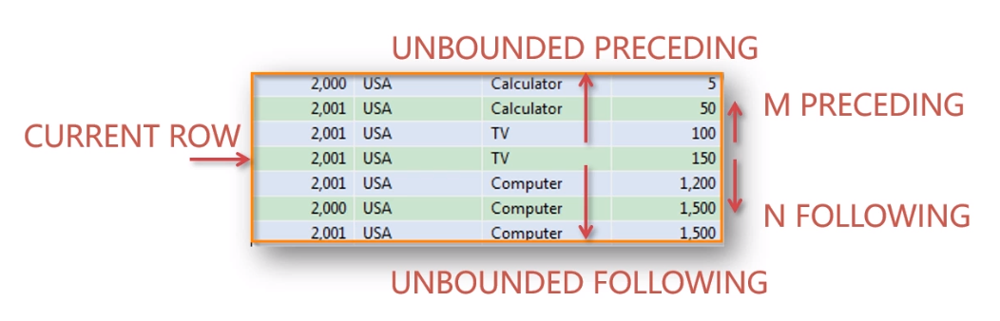

# MySQL  
## ——MySQL——
[MySQL](https://dev.mysql.com/)是一个关系型数据库管理系统，由瑞典MySQL AB 公司开发，属于 Oracle 旗下产品。

```sql
--安装数据库
mysqld -install
--删除数据库
mysqld -remove
--初始化数据库
mysqld --initialize-insecure [--user=mysq]    --默认用户名root，密码为空


/* windows启动或关闭MySQL服务器 */
(net | sc) <start | stop> mysql  -- 以管理员身份

/* 连接服务器 */
mysql [-h hostname | hostlP -p port] -u username -p [DatabaseName -e "SQL语句"]
/* 断开服务器 */
EXIT | QUIT
```
配置文件my.ini 在 MySql 安装的根目录下，也可能在隐藏文件夹“ProgramData”
```sql
[client]
# 设置mysql客户端默认字符集
default-character-set = utf8
 
[mysqld]
# 设置3306端口
port = 3306
# 设置mysql的安装目录
basedir=D:\\mysql-8.0.19
# 设置 mysql数据库的数据的存放目录，MySQL 8+ 不需要以下配置，系统自己生成即可，否则有可能报错
# datadir=E:\\data
# 允许最大连接数
max_connections = 20
# 服务端使用的字符集默认为8bit编码的latin1字符集
character-set-server = utf8
# 创建新表时将使用的默认存储引擎
default-storage-engine=INNODB
#导出数据地址
secure_file_priv = ''
```

MySQL Client的可执行程序是mysql，MySQL Server的可执行程序是mysqld。  <br />  ┌──────────────┐  SQL   ┌──────────────┐  <br />  │ MySQL Client             │───> │ MySQL Server            │  <br />  └──────────────┘  TCP   └──────────────┘  <br />  在MySQL Client中输入的SQL语句通过TCP连接发送到MySQL Server。  <br />  默认端口号是3306，即如果发送到本机MySQL Server，地址就是127.0.0.1:3306。

系统库：information_schema、mysql、performance_schema和sys是  <br />  [  <br />  ](https://dev.mysql.com/doc/)
## 基本操作
HELP 查询内容（可包含通配符“％”和“_”，效果与 LIKE 相同）

**增删改查——CRUD：Create、Retrieve、Update、Delete**
```sql
-- 显示当前时间、用户名、数据库版本、数据库
    SELECT now(), user(), version(), DATABASE();

/* 数据库 */
SHOW DATABASES   --列出所有数据库
CREATE DATABASE [IF NOT EXISTS] <database_name> [DEFAULT (CHARSET) | (CHARACTER SET) utf8mb4]    --创建数据库
DROP DATABASE  [IF EXISTS]  <database_name>    --删除数据库
USE <database_name>    --切换当前数据库
ALTER DATABASE [数据库名] { [ DEFAULT ] CHARACTER SET <字符集名> |[ DEFAULT ] COLLATE <校对规则名>}    --修改数据库

/* 数据表 */
CREATE [TEMPORARY] TABLE  -- 临时表只在当前连接可见，关闭连接时，Mysql会自动删除
CREATE TABLE <table_name (column_name column_type)>    --创建表
CREATE TABLE  <table_name> LIKE <exist_table_name>    --创建相同模式表
CREATE TABLE <table_name> [AS] SELECT * FROM <exist_table_name>    -- 创建相同表结构和数据
DROP TABLE [IF EXISTS] 表名1 [ ,表名2, 表名3 ...]    --删除表
-- 查看所有表
    SHOW TABLES [FROM 表名]
    SHOW TABLES [LIKE 'pattern']
-- 查看表结构
    SHOW CREATE TABLE 表名 （信息更详细）
    DESC 表名 / DESCRIBE 表名 / EXPLAIN 表名 / SHOW COLUMNS FROM 表名 [LIKE 'PATTERN']
    SHOW TABLE STATUS [FROM db_name] [LIKE 'pattern']


/* 系统 */
SHOW PROCESSLIST -- 显示哪些线程正在运行
SHOW STATUS  -- 服务器状态
SHOW VARIABLES  -- 服务器配置变量


name [=AS] alias   -- 为表或字段设置别名
DELIMITER ：修改结束命令字符


set @@prifileing=1;  --打开分析工具
show profiles --分析性能
show profile for query id;  --查看详情
```

### CREAT
CREATE [TEMPORARY] TABLE [IF NOT EXISTS] [库名.]表名 ( 表的结构定义 )[表选项][分区选项];

字段名 数据类型 [NOT NULL | NULL] [DEFAULT default_value] [AUTO_INCREMENT] [UNIQUE | PRIMARY KEY] [COMMENT 'string']
```sql
create table section
	(course_id		int NOT NULL AUTO_INCREMENT, 
	 semester		varchar(6)   check (semester in ('Fall', 'Winter', 'Spring', 'Summer')), 
	 building		varchar(15),
	 room_number		varchar(7),
	 time_slot_id		varchar(4),
	 primary key (course_id, semester),
	 foreign key (course_id) references course(course_id)
		on delete cascade,
	 foreign key (building, room_number) references classroom(building, room_number)
		on delete set null
	)[ENGINE=InnoDB DEFAULT CHARSET=utf8];
```

- 若不想字段为 NULL 可以设置字段的属性为 NOT NULL，在操作数据库时如果输入该字段的数据为NULL，就会报错。
- AUTO_INCREMENT：定义列为自增的属性，一般用于主键，数值会自动加1。
- PRIMARY KEY：用于定义列为主键。 您可以使用多列来定义主键，列间以逗号分隔。
- ENGINE 设置存储引擎，CHARSET 设置编码。
- MySQL中 utf8mb4 字符集是真正的UTF-8编码，而 utf8 字符集是非标准的
### SELECT
```sql
SELECT {[=ALL | DISTINCT] <column_name [,···, function(column_name)]>}
[   FROM <table_name[,···]>
    [WHERE Clause]
    [GROUP BY <column_name>
    [HAVING <P(Function(X))>]
    [ORDER BY field1 [=ASC | DESC] [,field2...] [=ASC | DESC]]
    [LIMIT <M> [OFFSET <N>] ]    ]   --分页查询
```

- 表之间使用逗号(,)分割，并使用WHERE语句来设定查询条件，可嵌套
- 你可以使用星号（*）来代替其他字段，SELECT语句会返回表的所有字段数据
- 使用 ASC 或 DESC 关键字来设置查询结果是按升序或降序排列。 默认升序排列。
- LIMIT设定为pageSize，OFFSET = pageSize * (pageIndex - 1)，N越大，效率越低。

having & where 

-  where 在开始时执行检测数据，对原数据进行过滤； having 对筛选出的结果再次进行过滤。
-  having 字段必须是查询出来的，where 字段必须是数据表存在的。
-  where 不可以使用字段的别名，having 可以。因为执行WHERE代码时，可能尚未确定列值。
-  where 不可以使用聚合函数。一般需用聚合函数才会用 having
-  SQL标准要求HAVING必须引用GROUP BY子句中的列或用于合计函数中的列。

case when ... then ... else ... end
```sql
SELECT name,
(case when math>90 then 'A'
when math<=90 and math>60 then 'B'
else 'C' end) degree
from score;
```
### INSERT INTO
```sql
INSERT INTO table_name ( field1, field2,...fieldN )
    VALUES  ( value1, value2,...valueN ) [,···];
    
-- REPLACE 等同于 INSERT 

INSERT [INTO] 表名 SET 字段名=值[, 字段名=值, ...]    
INSERT INTO table_name [(filed)] SELECT_statement;
```
### DELETE
```sql
DELETE FROM table_name [WHERE Clause] [ORDER BY ...] [LIMIT row_count]
DELETE FROM <表1，表2 ...> using <表1 join 表2  on ...> where <P>;    --多表删除

TRUNCATE [TABLE] table_name --清空表数据
```

- truncate 是删除表再创建，重置auto_increment的值，速度较快；delete 是逐条删除
- truncate 不知道删除了几条，而delete知道。
- DELETE 删除数据后，配合事件回滚可以找回数据；TRUNCATE 不支持事务的回滚，数据删除后无法找回。
### UPDATE
```sql
UPDATE table_name SET field1=new-value1 [，···]
[WHERE Clause]
```
### ALTER
```sql
ALTER TABLE <table_name>  {DROP <column_name>
                        | ADD <column_name type [not null  defalut value]>
                        | MODIFY <column_name type [not null  defalut value]>
                        | CHANGE <column_name new_name type [not null  defalut value]>
                        | ALTER <column_name> { SET DEFAULT <默认值> | DROP DEFAULT }
                        | RENAME [TO] <new_name>
                        | CHARACTER SET <字符集名>
                        | COLLATE <校对规则名>}
                        
alter table <> add column <> varchar(10) generated always as (upper(c1));
```
```sql
-- RENAME可以交换两个表名
RENAME TABLE 原表名 TO 新表名
RENAME TABLE 原表名 TO 库名.表名    （可将表移动到另一个数据库）


/* 表维护 */
-- 分析和存储表的关键字分布
ANALYZE [LOCAL | NO_WRITE_TO_BINLOG] TABLE 表名 ...
-- 检查表是否有错误
CHECK TABLE tbl_name [, tbl_name] ... [option] ...
option = {QUICK | FAST | MEDIUM | EXTENDED | CHANGED}
-- 整理数据文件的碎片
OPTIMIZE [LOCAL | NO_WRITE_TO_BINLOG] TABLE tbl_name [, tbl_name] ..
-- 修复表
REPAIR [LOCAL | NO_WRITE_TO_BINLOG] TABLE tbl_name [, tbl_name] ... [QUICK] [EXTENDED] [USE_FRM]
```
### JOIN

- 交叉连接（CROSS JOIN）：返回连接表的笛卡尔积
```sql
SELECT <字段名> FROM <表1> CROSS JOIN <表2> [WHERE子句]
# 或
SELECT <字段名> FROM <表1>, <表2> [WHERE子句]
```

- 内连接 (INNER JOIN)
- 外连接 (OUTER JOIN)
- 左连接 (LEFT OUTER JOIN)
- 右连接 (RIGHT OUTER JOIN)
- 全连接 (FULL OUTER JOIN)
| INNER JOIN | LEFT OUTER JOIN | RIGHT OUTER JOIN | FULL OUTER JOIN |
| --- | --- | --- | --- |
| 两张表都存在的记录 | 左表存在的记录 | 右表存在的记录 | 左右表都存在的记录 |
|  |  |  |  |

```sql
SELECT *
FROM <table_name>  JOIN  <table_name> [ JOIN  ···] [ON <P>]
 # <table_name> JOIN <table_name> using (column_name)
```
### LIKE & REGEXP
```sql
[NOT] LIKE 'str%' [ESCAPE '_']
```

- 百分号（%）：匹配任意子串
- 下划线（_）：匹配任意一个字符
- 关键字 ESCAPE定义转移字符
- 大小写敏感

REGEXP

| 模式 | 描述 |
| --- | --- |
| ^ | 匹配输入字符串的开始位置。如果设置了 RegExp 对象的 Multiline 属性，^ 也匹配 '\\n' 或 '\\r' 之后的位置。 |
| $ | 匹配输入字符串的结束位置。如果设置了RegExp 对象的 Multiline 属性，$ 也匹配 '\\n' 或 '\\r' 之前的位置。 |
| . | 匹配除 "\\n" 之外的任何单个字符。要匹配包括 '\\n' 在内的任何字符，请使用象 '[.\\n]' 的模式。 |
| [...] | 字符集合 |
| [^...] | 负值字符集合 |
| p1&#124;p2&#124;p3 | 匹配 p1 或 p2 或 p3 |
| * | 匹配前面的子表达式零次或多次 |
| + | 匹配前面的子表达式一次或多次 |
| {n} | n 是一个非负整数。匹配确定的 n 次 |
| `{n,m}` | m 和 n 均为非负整数，其中n <= m。最少匹配 n 次且最多匹配 m 次。 |

```sql
mysql> SELECT * FROM tb_students_info WHERE name REGEXP 'e{2,}';
+----+-------+------+------+--------+-----------+
| id | name  | age  | sex  | height | course_id |
+----+-------+------+------+--------+-----------+
|  2 | Green |   23 | 男   |    158 |         2 |
+----+-------+------+------+--------+-----------+
1 row in set (0.00 sec)
```

### UNION
```sql
SELECT_statement
UNION [=DISTINCT | ALL]
SELECT_statement;
```

- 默认自动去重
- 无交集（intersect），差集（except）运算
### SOME
```sql
select * from <> 
where value > SOME [| ALL] 
(SELECT_statement)
```
ANY 等同于 SMOE
### WITH
```sql
WITH max_budget (value) AS
(select max(budget) 
from department) 
select budget 
from department,max_budget 
where department.budget=max_budget.value
WITH RECURSIVE fib(a, b) as  --递归CTE
 ( select 0, 1
union all
select b, a+b from fib where b<100 )
select * from fib;
```
**定义临时关系**  <br />  **无限递归控制**

- max_execution_time
- cte_max_recursion_depth

### INDEX
一种特殊的数据库结构，由数据表中的一列或多列组合而成，用来快速查询数据表中有某一特定值的记录。

- 普通索引（CREATE INDEX）
- 唯一索引，索引列的值必须唯一（CREATE UNIQUE INDEX）
- 多列索引（key的值由多个列组成）
- 主键索引（PRIMARY KEY），一个表只能有一个
- 全文索引（FULLTEXT INDEX），InnoDB不支持
```sql
CREATE [UNIQUE] INDEX <index_name>
ON <table_name (column_name [<长度>] [ ASC | DESC] )>  [invisible]   --主键索引必须可见

DROP INDEX <index_name> ON <table_name>

--查看索引
SHOW INDEX <index_name> FROM <table_name>[\G]

--更改索引
 ALTER TABLE <> ALTER INDEX <> VISIBLE 
 
 --降序索引
 CREATE TABLE <> (c1,INT,c2 INT,INDEX idx(c1 ASC,c2 DESC))
 
 --函数索引
 CREATE INDEX fun_idx ON table_name( (fun_name(column_name)) );
```
隐藏索引不会被优化器使用，但仍然需要进行维护。  <br />  优化器默认情况是不可见隐藏索引的，但是可以通过配置开关来使之可见

### EXPLAIN
模拟优化器执行SQL查询语句，分析你的查询语句或是表结构的性能瓶颈。
```sql
EXPLAIN Select_statement;
```
id | select_type | table | partitions | type | possible_keys | key  | key_len | ref  | rows | filtered | Extra  <br />  表的读取顺序

- id相同，执行顺序由上至下；
- id不同，如果是子查询，id的序号会递增，id值越大优先级越高，先被执行 ；

select_type

1. SIMPLE：简单的select查询，查询中不包含子查询和union
2. PRIMARY：查询中若包含任何复杂的子部分，最外层查询则被标记为
3. SUBQUERY：在select或where列表中包含了子查询
4. DERIVED：在from列表中包含的子查询被标记为derived，mysql会递归执行这些子查询，把结果放在临时表中
5. UNION：若第二个select出现在union之后，则被标记;
6. UNION RESULT：从union表获取结果的select

table：当前执行的表

type

1. NULL：不用访问表或者索引，直接就能得到结果；
2. system：表示表中只有一条记录；
3. const：表示表中有多条记录，但只从表中查询一条记录；
4. eq _ref：类似 ref，表示多表连接时，后面的表使用了 UNIQUE 或者 PRIMARY KEY；
5. ref：表示多表查询时，后面的表使用了普通索引；
6. range：表示查询语句中给出了查询范围，常见于 <、<=、>、>=、between 等操作符；
7. index：表示对表中的索引进行了完整的扫描，MySQL 遍历整个索引来查询匹配的行；
8. ALL：表示对表进行了完整的扫描，MySQL 遍历全表来找到匹配的行。

possible_keys：表示查询中可以使用的索引；  <br />  key：表示实际查询中使用到的索引；  <br />  key_len：表示索引字段的长度；  <br />  ref：表示使用哪个列或常数与索引一起来查询记录；  <br />  rows：表示查询的行数；  <br />  Extra：表示查询过程的附件信息。
### 游标（Cursor）
游标是一个存储在MySQL服务器上的数据库查询，是查询语句所检索出来的结果集
```sql
-- 声明
DECLARE cursor_name CURSOR FOR SELECT_statement;
-- 打开
OPEN cursor_name;
-- 取出数据
FETCH cursor_name INTO variables list;
-- 关闭
CLOSE cursor_name;
-- 当游标找不到任何行时
DECLARE CONTINUE HANDLER FOR NOT FOUND SET finished = 1;
```
示例
```sql
 DELIMITER $$
 
 CREATE
     PROCEDURE `test`.`procedure_student2`()
     BEGIN
     -- declare some variable，必须在声明游标和句柄之前，而声明句柄必须在声明游标之后。
     DECLARE val DOUBLE DEFAULT 0;
     DECLARE tempRes VARCHAR(10) DEFAULT '';
     DECLARE res VARCHAR(100) DEFAULT '' ;
    -- declare a cursor
    DECLARE cursor_avgScore CURSOR
    FOR
    SELECT (mathScore+englishScore)/2  AS student_avgScore FROM student2;
    -- declare a continue handler ,use finish while loop 
    DECLARE CONTINUE HANDLER FOR SQLSTATE '02000'  SET val= -1.;  
    -- open cursor
    OPEN cursor_avgScore ;
    FETCH cursor_avgScore INTO val;
    -- fetch cursor
    WHILE val!=-1 DO
        SET tempRes=CONCAT(val,', ');
        SET res=CONCAT(res,tempRes);
        FETCH cursor_avgScore INTO val;
    END WHILE;                  
    -- close cursor
    CLOSE cursor_avgScore ;
    -- 显示结果
    SELECT res;
    END$$

DELIMITER ;
```
## 约束（Constraints）
用于规定表中的数据规则  <br />  如果存在违反约束的数据行为，行为会被约束终止。  <br />  可在创建表时规定（CREATE TABLE 语句），或者在表创建之后规定（ALTER TABLE 语句）
```sql
#示例
create table section
	(course_id		int NOT NULL AUTO_INCREMENT, 
	 semester		varchar(6)   check (semester in ('Fall', 'Winter', 'Spring', 'Summer')), 
	 building		varchar(15),
	 room_number		varchar(7),
	 time_slot_id		varchar(4),
	 primary key (course_id, semester),
	 foreign key (course_id) references course(course_id)
		on delete cascade,
	 foreign key (building, room_number) references classroom(building, room_number)
		on delete set null
	);
```
**主键（PRIMARY KEY）**
```sql
-- 设置单字段主键
<字段名> <数据类型> PRIMARY KEY [默认值]
[CONSTRAINT <约束名>] PRIMARY KEY [字段名]
-- 添加
ALTER TABLE <数据表名> ADD PRIMARY KEY(<字段名>);
-- 删除
ALTER TABLE <数据表名> DROP PRIMARY KEY;
```


**auto_increment 自动增长约束**

- 自动增长必须为索引（主键或unique）
- 默认为1开始自动增长。通过表属性 auto_increment = x设置，或 alter table tbl auto_increment = x;
- 删除重置：ALTER TABLE <数据表名> MODIFY <字段名> int;

**外键约束（Foreign Key）**  <br />   用于限制主表与从表数据完整性，保持数据一致性  <br />   存在外键的表，称之为从表（子表），外键指向的表，称之为主表（父表）。
```sql
-- 创建
[CONSTRAINT <外键名>] FOREIGN KEY 字段名 [，字段名2，…]
REFERENCES <主表名> 主键列1 [，主键列2，…] [主表记录删除 | 更新时的动作]

-- 添加
ALTER TABLE <数据表名> ADD CONSTRAINT <外键名>
FOREIGN KEY(<列名>) REFERENCES <主表名> (<列名>);
-- 删除
ALTER TABLE <表名> DROP FOREIGN KEY <外键约束名>;
```

若不指定主表记录更改或更新时的动作，主表的操作会被拒绝  <br />  如果指定了 on update 或 on delete，可以选择：

- cascade：级联操作。主表数据被更新（主键值更新），从表也被更新（外键值更新）
- set null：主表数据被更新（主键值更新），从表的外键被设置为null。主表记录被删除，从表相关记录外键被设置成null。
- restrict：拒绝父表删除和更新。


**唯一约束（Unique Key）**：所有记录中字段的值不能重复出现
```sql
<字段名> <数据类型> UNIQUE
ALTER TABLE <数据表名> ADD CONSTRAINT <唯一约束名> UNIQUE(<列名>);
ALTER TABLE <表名> DROP INDEX <唯一约束名>;
```


**default 默认值属性**
```sql
<字段名> <数据类型> DEFAULT <默认值>;

-- 添加
ALTER TABLE <数据表名>
CHANGE COLUMN <字段名> <数据类型> DEFAULT <默认值>;
-- 删除
ALTER TABLE <数据表名>
CHANGE COLUMN <字段名> <字段名> <数据类型> DEFAULT NULL;

create table tab ( add_time timestamp default current_timestamp );-- 表示将当前时间的时间戳设为默认值。
```


**非空约束（NOT NULL）**
```sql
<字段名> <数据类型> NOT NULL;

ALTER TABLE <数据表名>
CHANGE COLUMN <字段名> <字段名> <数据类型> NOT NULL;

ALTER TABLE <数据表名>
CHANGE COLUMN <字段名> <字段名> <数据类型> NULL;
```


**检查约束（CHECK）**
```sql
CHECK <表达式>

ALTER TABLE <数据表名> ADD CONSTRAINT <检查约束名> CHECK(<检查约束>)
ALTER TABLE <数据表名> DROP CONSTRAINT <检查约束名>;
```


**comment 注释**
```sql
create table tab ( id int ) comment '注释内容';
```
## 视图（Views）
基于 SQL 语句的结果集的可视化的表  <br />  一种虚拟存在的表，动态生成的（只存放了视图的定义）
```sql
CREATE [OR REPLACE] [ALGORITHM = {UNDEFINED | MERGE | TEMPTABLE}] VIEW view_name [(column_list)] 
AS select_statement

DROP VIEW <view_name>

SHOW CREATE VIEW view_name

ALTER VIEW view_name [(column_list)] AS select_statement
```
-- 视图作用  <br />  1. 简化业务逻辑  <br />  2. 对客户端隐藏真实的表结构

-- 视图算法 (ALGORITHM)  <br />  MERGE ：将视图的查询语句，与外部查询需要先合并再执行！  <br />  TEMPTABLE：将视图执行完毕后，形成临时表，再做外层查询！  <br />  UNDEFINED：未定义(默认)，MySQL自主去选择相应的算法。

所有视图的定义存储在 information_schema 数据库下的 views 表中，可以在这个表中查看所有视图的详细信息
```sql
SELECT * FROM information_schema.views;
```


## 事务（Transaction）
一种机制、一个操作序列，包含了一组数据库操作命令

**ACID特性**

- Atomicity，原子性：将所有SQL作为原子工作单元执行，要么全部执行，要么全部不执行；
- Consistency，一致性：事务完成后，所有数据的状态都是一致的，即A账户只要减去了100，B账户则必定加上了100；
- Isolation，隔离性：如果有多个事务并发执行，每个事务作出的修改必须与其他事务隔离；
- Durability，持久性：即事务完成后，对数据库数据的修改被持久化存储。
```sql
BEGIN； [|START TRANSACTION]
··· ；
COMMIT [| ROLLBACK [WORK]]；

--设置事务自动提交（开启和关闭）
SET autocommit = 1|0|ON|OFF;
```
-- 事务的原理  <br />  利用InnoDB的自动提交(autocommit)特性  <br />  普通的MySQL执行语句后，当前的数据提交操作均可被其他客户端可见。  <br />  而事务是暂时关闭“自动提交”机制，需要commit提交持久化数据操作。

-- 注意  <br />  1. 数据定义语言（DDL）语句不能被回滚，比如创建或取消数据库的语句，和创建、取消或更改表或存储的子程序的语句。  <br />  2. 事务不能被嵌套

-- 保存点  <br />  SAVEPOINT 保存点名称 -- 设置一个事务保存点  <br />  ROLLBACK TO SAVEPOINT 保存点名称 -- 回滚到保存点  <br />  RELEASE SAVEPOINT 保存点名称 -- 删除保存点  <br />  nowait，skip locked

**隔离级别**

- 脏读 DIRTY READ： 查询同一记录，2 次结果不一样，读到还未 commit 的数据结果；
- 不可重复读 NON REPEATABLE READ： 查询同一记录，2 次结果不一样，读到的结果在另一事务 commit/rollback 之间；
- 幻读 PHANTOM READ：查询同一记录，2 次结果是一样，但是会出现 事务 A 新增的列，事务 B 读不到(SELECT)，但是却可以更新(UPDATE)，更新后才可以读到。
| ISOLATION LEVEL | DIRTY READ | NON REPEATABLE READ | PHANTOM READ |
| --- | --- | --- | --- |
| READ UNCOMMITTED | YES | YES | YES |
| READ COMMITTED | - | YES | YES |
| Repeatable Read | - | - | YES |
| Serializable | - | - | - |

```sql
--查看当前事务隔离级别
show variables like '%tx_isolation%'
或 select @@tx_isolation;

--修改事务隔离级别
SET [=SESSION | GLOBAL] TRANSACTION ISOLATION LEVEL 
{READ UNCOMMITTED | READ COMMITTED | REPEATABLE READ | SERIALIZABLE};
```
## 锁表
用于防止其它客户端进行不正当地读取和写入

- 行锁（Record Lock）：直接对索引项加锁。
- 间隙锁（Gap Lock）：锁加在索引项之间的间隙，也可以是第一条记录前的“间隙”或最后一条记录后的“间隙”。
- Next-Key Lock：行锁与间隙锁组合起来用就叫做 Next-Key Lock。 前两种的组合，对记录及其前面的间隙加锁。
```sql
-- 锁定
    LOCK TABLES tbl_name [AS alias]
-- 解锁
    UNLOCK TABLES
```
## 触发器（TRIGGER）
触发程序是与表有关的命名数据库对象，当该表出现特定事件时，将激活该对象  <br />  监听：记录的增加、修改、删除。
```sql
-- 创建触发器
CREATE TRIGGER trigger_name trigger_time trigger_event ON tbl_name FOR EACH ROW trigger_stmt
CREATE <触发器名> < BEFORE | AFTER >
<INSERT | UPDATE | DELETE >
ON <表名> FOR EACH Row <触发器主体>

-- 删除
DROP TRIGGER [schema_name.]trigger_name
```

所有触发器的信息都存在 information_schema 数据库的 triggers 表中
```sql
SELECT * FROM information_schema.triggers [WHERE trigger_name= '触发器名'];
```
## 事件（Event）
事件调度器（Event Scheduler）：用来执行**定时**任务的一组 SQL 集合
```sql
--查看事件是否开启
SHOW VARIABLES LIKE 'event_scheduler';
或 SELECT @@event_scheduler;

--开启事件
SET GLOBAL event_scheduler = ON ;


CREATE EVENT [IF NOT EXISTS] event_name
    ON SCHEDULE schedule
    [ON COMPLETION [NOT] PRESERVE]
    [ENABLE | DISABLE | DISABLE ON SLAVE]
    [COMMENT 'comment']
    DO event_body;

DROP EVENT [IF EXISTS] event_name;

ALTER EVENT event_name
    ON SCHEDULE schedule
    [ON COMPLETION [NOT] PRESERVE]
    [ENABLE | DISABLE | DISABLE ON SLAVE]
    [COMMENT 'comment']
    DO event_body;
```
| ON SCHEDULE schedule | 必选 用于定义执行的时间和时间间隔 schedule 表示触发点 |
| --- | --- |
| ON COMPLETION [NOT] PRESERVE | 可选 用于定义事件是否循环执行，即是一次执行还是永久执行，默认为一次执行，即 NOT PRESERVE |
| ENABLE | DISABLE |
| COMMENT 'comment' | 可选，用于定义事件的注释 |
| DO event_body | 必选 用于指定事件启动时所要执行的代码，可以是任何有效的 SQL 语句、存储过程或者一个计划执行的事件。 如果包含多条语句，则可以使用 BEGIN..END 复合结构 |

## 数据类型
### 数值类型
| 类型 | 大小 | 范围（有符号） | 范围（无符号） |
| --- | --- | --- | --- |
| TINYINT | 1 字节 | (-128，127) | (0，255) |
| SMALLINT | 2 字节 | (-32 768，32 767) | (0，65 535) |
| MEDIUMINT | 3 字节 | (-8 388 608，8 388 607) | (0，16 777 215) |
| INT或INTEGER | 4 字节 | (-2 147 483 648，2 147 483 647) | (0，4 294 967 295) |
| BIGINT | 8 字节 | (-9,223,372,036,854,775,808，9 223 372 036 854 775 807) | (0，18 446 744 073 709 551 615) |
| FLOAT | 4 字节 | (-3.402 823 466 E+38，-1.175 494 351 E-38)，0，(1.175 494 351 E-38，3.402 823 466 351 E+38) | 0，(1.175 494 351 E-38，3.402 823 466 E+38) |
| DOUBLE | 8 字节 | (-1.797 693 134 862 315 7 E+308，-2.225 073 858 507 201 4 E-308)，0，(2.225 073 858 507 201 4 E-308，1.797 693 134 862 315 7 E+308) | 0，(2.225 073 858 507 201 4 E-308，1.797 693 134 862 315 7 E+308) |
| DECIMAL | 对DECIMAL(M,D) ，如果M>D，为M+2否则为D+2 | 依赖于M和D的值 | 依赖于M和D的值 |

**INT[(M)] [UNSIGNED] [ZEROFILL]**

- M表示总位数
- 默认存在符号位，unsigned 属性修改
- 显示宽度，如果某个数不够定义字段时设置的位数，则前面以0补填，zerofill 属性修改  <br />  例：int(5)    插入一个数'123'，补填后为'00123'
- MySQL没有布尔类型，通过整型0和1表示。常用tinyint(1)表示布尔型。


** FLOAT[(M,D)] [UNSIGNED] [ZEROFILL]**  <br />  定义浮点型时，需指定总位数和小数位数。  不同于整型，前后均会补填0.  <br />      M表示总位数，D表示小数位数。  <br />      M和D的大小会决定浮点数的范围。不同于整型的固定范围。  <br />      M既表示总位数（不包括小数点和正负号），也表示显示宽度（所有显示符号均包括）。  <br />      支持科学计数法表示。  <br />      浮点数表示近似值。

### 日期和时间类型
| 类型 | 大小(字节) | 范围 | 格式 | 用途 |
| --- | --- | --- | --- | --- |
| DATE | 3 | 1000-01-01， 9999-12-31 | YYYY-MM-DD | 日期值 |
| TIME | 3 | '-838:59:59'，'838:59:59' | HH:MM:SS | 时间值或持续时间 |
| YEAR | 1 | 1901，2155 | YYYY | 年份值 |
| DATETIME | 8 | 1000-01-01 00:00:00 ， 9999-12-31 23:59:59 | YYYY-MM-DD HH:MM:SS | 混合日期和时间值 |
| TIMESTAMP | 4 | 1970-01-01 00:00:00 ， 2038-01-19 03:14:07 | YYYYMMDD HHMMSS | 混合日期和时间值，时间戳 |

当指定不合法的MySQL不能表示的值时使用"零"值
### 字符串类型
| 类型 | 大小 | 用途 |
| --- | --- | --- |
| CHAR | 0-255字节 | 定长字符串 |
| VARCHAR | 0-65535 字节 | 变长字符串 |
| TINYBLOB | 0-255字节 | 不超过 255 个字符的二进制字符串 |
| TINYTEXT | 0-255字节 | 短文本字符串 |
| BLOB | 0-65 535字节 | 二进制形式的长文本数据 |
| TEXT | 0-65 535字节 | 长文本数据 |
| MEDIUMBLOB | 0-16 777 215字节 | 二进制形式的中等长度文本数据 |
| MEDIUMTEXT | 0-16 777 215字节 | 中等长度文本数据 |
| LONGBLOB | 0-4 294 967 295字节 | 二进制形式的极大文本数据 |
| LONGTEXT | 0-4 294 967 295字节 | 极大文本数据 |

lob——Large OBject  <br />  text 类型在定义时，不可给default值
```sql
一条有效记录最大不能超过65535个字节。
        utf8 最大为21844个字符，gbk 最大为32766个字符，latin1 最大为65532个字符
varchar 是变长的，需要利用存储空间保存 varchar 的长度，如果数据小于255个字节，则采用1个字节来保存长度，反之需2个字节来保存。
varchar 的最大有效长度由最大行大小和使用的字符集确定。
    最大有效长度是65532字节，因为在varchar存字符串时，第1个字节是空的，不存在任何数据，2个字节来存放字符串的长度
若一个表定义为 CREATE TABLE tb(c1 int, c2 char(30), c3 varchar(N)) charset=utf8; 问N的最大值是多少？
答：(65535-1-2-4-30*3)/3
```


**枚举**  <br />  enum(val1, val2, val3...)  <br />  在已知的值中进行单选。最大数量为65535  <br />  枚举值在保存时，以2byte的整型(smallint)保存。每个枚举值，按保存的位置顺序，从1开始逐一递增。  <br />  表现为字符串类型，存储却是整型。  <br />  NULL值的索引是NULL。  <br />  空字符串错误值的索引值是0。

**集合（set）**  <br />  set(val1, val2, val3...)  <br />  create table tab ( gender set('男', '女', '无') );  <br />  最多可以有64个不同的成员。以bigint存储，共8个字节。采取位运算的形式。  <br />  当创建表时，SET成员值的尾部空格将自动被删除。

## 运算符
### 算术运算符
| 运算符 | 作用 |
| --- | --- |
| + | 加法 |
| - | 减法 |
| * | 乘法 |
| / 或 DIV | 除法 |
| % 或 MOD | 取余 |

### 比较运算符
| 符号 | 描述 | 备注 |
| --- | --- | --- |
| = | 等于 |  |
| <>, != | 不等于 |  |
| > | 大于 |  |
| < | 小于 |  |
| <= | 小于等于 |  |
| >= | 大于等于 |  |
| BETWEEN | 在两值之间 | >=min&&<=max |
| NOT BETWEEN | 不在两值之间 |  |
| IN | 在集合中 |  |
| NOT IN | 不在集合中 |  |
| <=> | 严格比较两个NULL值是否相等 | 两个操作码均为NULL时，其所得值为1；而当一个操作码为NULL时，其所得值为0 |
| LIKE | 模糊匹配 |  |
| REGEXP 或 RLIKE | 正则式匹配 |  |
| IS NULL | 为空 |  |
| IS NOT NULL | 不为空 |  |
| [NOT] EXISTS | [不]存在 |  |

### 逻辑运算符
| 运算符号 | 作用 |
| --- | --- |
| NOT ! | 逻辑非 |
| AND && | 逻辑与 |
| OR &#124;&#124; | 逻辑或 |
| XOR | 逻辑异或 |

### 位运算符
| 运算符号 | 作用 |
| --- | --- |
| & | 按位与 |
| &#124; | 按位或 |
| ^ | 按位异或 |
| ! | 取反 |
| << | 左移 |
| >> | 右移 |

## 内置[函数](https://www.runoob.com/mysql/mysql-functions.html)
### 字符函数
| 函数 | 描述 |
| --- | --- |
| ASCII(s) | 返回字符串 s 的第一个字符的 ASCII 码。 |
| CHAR_LENGTH(s) | 返回字符串 s 的字符数 |
| CHARACTER_LENGTH(s) | 返回字符串 s 的字符数 |
| CONCAT(s1,s2...sn) | 字符串 s1,s2 等多个字符串合并为一个字符串 |
| CONCAT_WS(x, s1,s2...sn) | 以分隔符x连接多个字符串 |
| FIELD(s,s1,s2...) | 返回第一个字符串 s 在字符串列表(s1,s2...)中的位置 |
| FIND_IN_SET(s1,s2) | 返回在字符串s2中与s1匹配的字符串的位置 |
| FORMAT(x,n) | 将数字 x 进行格式化 "#,###.##", 小数点后 n 位，四舍五入 |
| INSERT(s1,x,len,s2) | 字符串 s2 替换 s1 的 x 位置开始长度为 len 的字符串 |
| LOCATE(s1,s) | 从字符串 s 中获取 s1 的开始位置 |
| LCASE(s) | 将字符串 s 的所有字母变成小写字母 |
| LEFT(s,n) | 返回字符串 s 的前 n 个字符 |
| LOWER(s) | 将字符串 s 的所有字母变成小写字母 |
| LPAD(s1,len,s2) | 在字符串 s1 的开始处填充字符串 s2，使字符串长度达到 len |
| LTRIM(s) | 去掉字符串 s 开始处的空格 |
| MID(s,n,len) | 从字符串 s 的 n 位置截取长度为 len 的子字符串，同 SUBSTRING(s,n,len) |
| POSITION(s1 IN s) | 从字符串 s 中获取 s1 的开始位置 |
| REPEAT(s,n) | 将字符串 s 重复 n 次 |
| REPLACE(s,s1,s2) | 将字符串 s2 替代字符串 s 中的字符串 s1 |
| REVERSE(s) | 将字符串s的顺序反过来 |
| RIGHT(s,n) | 返回字符串 s 的后 n 个字符 |
| RPAD(s1,len,s2) | 在字符串 s1 的结尾处添加字符串 s2，使字符串的长度达到 len |
| RTRIM(s) | 去掉字符串 s 结尾处的空格 |
| SPACE(n) | 返回 n 个空格 |
| STRCMP(s1,s2) | 比较字符串 s1 和 s2，如果 s1 与 s2 相等返回 0 ，如果 s1>s2 返回 1，如果 s1<s2 返回 -1 |
| SUBSTR(s, start, length) | 从字符串 s 的 start 位置截取长度为 length 的子字符串 |
| SUBSTRING(s, start, length) | 从字符串 s 的 start 位置截取长度为 length 的子字符串 |
| SUBSTRING_INDEX(s, delimiter, n) | 返回从字符串 s 的第 n个出现的分隔符 delimiter 后的子串 如果 n 是正数，返回第 n 个字符左边的字符串。 |
| TRIM(s) | 去掉字符串 s 开始和结尾处的空格 |
| UCASE(s) | 将字符串转换为大写 |
| UPPER(s) | 将字符串转换为大写 |

### 数字函数
| 函数名 | 描述 |
| --- | --- |
| ABS(x) | 返回 x 的绝对值 |
| ACOS(x) | 求 x 的反余弦值(参数是弧度) |
| ASIN(x) | 求反正弦值(参数是弧度) |
| ATAN(x) | 求反正切值(参数是弧度) |
| ATAN2(n, m) | 求反正切值(参数是弧度) |
| AVG(expression) | 返回一个表达式的平均值，expression 是一个字段 |
| CEIL(x) | 返回大于或等于 x 的最小整数 |
| CEILING(x) | 返回大于或等于 x 的最小整数 |
| COS(x) | 求余弦值(参数是弧度) |
| COT(x) | 求余切值(参数是弧度) |
| COUNT(expression) | 返回查询的记录总数，expression 是一个字段或 * |
| DEGREES(x) | 将弧度转换为角度 |
| EXP(x) | 返回 e 的 x 次方 |
| FLOOR(x) | 返回小于或等于 x 的最大整数 |
| GREATEST(expr1, expr2, expr3, ...) | 返回列表中的最大值 |
| LEAST(expr1, expr2, expr3, ...) | 返回列表中的最小值 |
| [LN](https://www.runoob.com/mysql/func_mysql_ln.asp) | 返回数字的自然对数 |
| LOG(x) | 返回自然对数(以 e 为底的对数) |
| LOG10(x) | 返回以 10 为底的对数 |
| LOG2(x) | 返回以 2 为底的对数 |
| MAX(expression) | 返回字段 expression 中的最大值 |
| MIN(expression) | 返回字段 expression 中的最小值 |
| MOD(x,y) | 返回 x 除以 y 以后的余数 |
| PI() | 返回圆周率(3.141593） |
| POW(x,y) | 返回 x 的 y 次方 |
| POWER(x,y) | 返回 x 的 y 次方 |
| RADIANS(x) | 将角度转换为弧度 |
| RAND() | 返回 0 到 1 的随机数 |
| ROUND(x) | 返回离 x 最近的整数 |
| SIGN(x) | 返回 x 的符号，返回 -1、0 和 1 |
| SIN(x) | 求正弦值(参数是弧度) |
| SQRT(x) | 返回x的平方根 |
| SUM(expression) | 返回指定字段的总和 |
| TAN(x) | 求正切值(参数是弧度) |
| TRUNCATE(x,y) | 返回数值 x 保留到小数点后 y 位的值 |

### 日期函数
| 函数名 | 描述 |
| --- | --- |
| ADDDATE(d,n) | 计算起始日期 d 加上 n 天的日期 |
| ADDTIME(t,n) | 时间 t 加上 n 秒的时间 |
| CURDATE() | 返回当前日期 |
| CURRENT_DATE() | 返回当前日期 |
| CURRENT_TIME | 返回当前时间 |
| CURRENT_TIMESTAMP() | 返回当前日期和时间 |
| CURTIME() | 返回当前时间 |
| DATE() | 从日期或日期时间表达式中提取日期值 |
| DATEDIFF(d1,d2) | 计算日期 d1->d2 之间相隔的天数 |
| DATE_ADD(d，INTERVAL expr type) | 计算起始日期 d 加上一个时间段后的日期 |
| DATE_FORMAT(d,f) | 按表达式 f的要求显示日期 d |
| DATE_SUB(date,INTERVAL expr type) | 函数从日期减去指定的时间间隔。 |
| DAY(d) | 返回日期值 d 的日期部分 |
| DAYNAME(d) | 返回日期 d 是星期几，如 Monday,Tuesday |
| DAYOFMONTH(d) | 计算日期 d 是本月的第几天 |
| DAYOFWEEK(d) | 日期 d 今天是星期几，1 星期日，2 星期一，以此类推 |
| DAYOFYEAR(d) | 计算日期 d 是本年的第几天 |
| EXTRACT(type FROM d) | 从日期 d 中获取指定的值，type 指定返回的值。 type可取值为： MICROSECOND SECOND MINUTE HOUR DAY WEEK MONTH QUARTER YEAR SECOND_MICROSECOND MINUTE_MICROSECOND MINUTE_SECOND HOUR_MICROSECOND HOUR_SECOND HOUR_MINUTE DAY_MICROSECOND DAY_SECOND DAY_MINUTE DAY_HOUR YEAR_MONTH |
| FROM_DAYS(n) | 计算从 0000 年 1 月 1 日开始 n 天后的日期 |
| HOUR(t) | 返回 t 中的小时值 |
| LAST_DAY(d) | 返回给给定日期的那一月份的最后一天 |
| LOCALTIME() | 返回当前日期和时间 |
| LOCALTIMESTAMP() | 返回当前日期和时间 |
| MAKEDATE(year, day-of-year) | 基于给定参数年份 year 和所在年中的天数序号 day-of-year 返回一个日期 |
| MAKETIME(hour, minute, second) | 组合时间，参数分别为小时、分钟、秒 |
| MICROSECOND(date) | 返回日期参数所对应的微秒数 |
| MINUTE(t) | 返回 t 中的分钟值 |
| MONTHNAME(d) | 返回日期当中的月份名称，如 November |
| MONTH(d) | 返回日期d中的月份值，1 到 12 |
| NOW() | 返回当前日期和时间 |
| PERIOD_ADD(period, number) | 为 年-月 组合日期添加一个时段 |
| PERIOD_DIFF(period1, period2) | 返回两个时段之间的月份差值 |
| QUARTER(d) | 返回日期d是第几季节，返回 1 到 4 |
| SECOND(t) | 返回 t 中的秒钟值 |
| SEC_TO_TIME(s) | 将以秒为单位的时间 s 转换为时分秒的格式 |
| STR_TO_DATE(string, format_mask) | 将字符串转变为日期 |
| SUBDATE(d,n) | 日期 d 减去 n 天后的日期 |
| SUBTIME(t,n) | 时间 t 减去 n 秒的时间 |
| SYSDATE() | 返回当前日期和时间 |
| TIME(expression) | 提取传入表达式的时间部分 |
| TIME_FORMAT(t,f) | 按表达式 f 的要求显示时间 t |
| TIME_TO_SEC(t) | 将时间 t 转换为秒 |
| TIMEDIFF(time1, time2) | 计算时间差值 |
| TIMESTAMP(expression, interval) | 单个参数时，函数返回日期或日期时间表达式；有2个参数时，将参数加和 |
| TO_DAYS(d) | 计算日期 d 距离 0000 年 1 月 1 日的天数 |
| WEEK(d) | 计算日期 d 是本年的第几个星期，范围是 0 到 53 |
| WEEKDAY(d) | 日期 d 是星期几，0 表示星期一，1 表示星期二 |
| WEEKOFYEAR(d) | 计算日期 d 是本年的第几个星期，范围是 0 到 53 |
| YEAR(d) | 返回年份 |
| YEARWEEK(date, mode) | 返回年份及第几周（0到53），mode 中 0 表示周天，1表示周一，以此类推 |

### 高级函数
| 函数名 | 描述 |
| --- | --- |
| BIN(x) | 返回 x 的二进制编码 |
| BINARY(s) | 将字符串 s 转换为二进制字符串 |
| CAST(x AS type) | 转换数据类型 |
| COALESCE(expr1, expr2, ...., expr_n) | 返回参数中的第一个非空表达式（从左向右） |
| CONNECTION_ID() | 返回服务器的连接数 |
| CONV(x,f1,f2) | 返回 f1 进制数变成 f2 进制数 |
| CONVERT(s USING cs) | 函数将字符串 s 的字符集变成 cs |
| CURRENT_USER() | 返回当前用户 |
| DATABASE() | 返回当前数据库名 |
| IF(expr,v1,v2) | 如果表达式 expr 成立，返回 v1；否则，返回 v2。 |
| IFNULL(v1,v2) | 如果 v1 的值不为 NULL，则返回 v1，否则返回 v2。 |
| ISNULL(expression) | 判断表达式是否为 NULL |
| LAST_INSERT_ID() | 返回最近生成的 AUTO_INCREMENT 值 |
| NULLIF(expr1, expr2) | 比较两个字符串，如果字符串 expr1 与 expr2 相等 返回 NULL，否则返回 expr1 |
| SESSION_USER() | 返回当前用户 |
| SYSTEM_USER() | 返回当前用户 |
| USER() | 返回当前用户 |
| VERSION() | 返回数据库的版本号 |

窗口函数
```sql
Windows_function(expression)
OVER (
    PARTITION BY <>
    ORDER BY <>
    frame_clause <>
)
```


## 备份还原
### 导入数据
**MySQL **
```sql
mysql -u username -P [dbname] < filename.sql
```
**Source**
```sql
mysql> create database abc;      # 创建数据库
mysql> use abc;                  # 使用已创建的数据库 
mysql> set names utf8;           # 设置编码
mysql> source /home/abc/abc.sql  # 导入备份数据库
```
**LOAD DATA **
```sql
LOAD DATA [LOCAL] INFILE 文件地址 INTO TABLE  [replace|ignore] <table_name> [(colmun1, )] [控制格式]

生成的数据默认的分隔符是制表符
local未指定，则数据文件必须在服务器上
replace 和 ignore 关键词控制对现有的唯一键记录的重复的处理

-- 控制格式
fields  控制字段格式
默认：fields terminated by '\t' enclosed by '' escaped by '\\'
    terminated by 'string'  -- 终止
    enclosed by 'char'      -- 包裹
    escaped by 'char'       -- 转义
lines   控制行格式
默认：lines terminated by '\n'
    terminated by 'string'  -- 终止
    
-- 示例：
    SELECT a,b,a+b INTO OUTFILE '/tmp/result.text'
    FIELDS TERMINATED BY ',' OPTIONALLY ENCLOSED BY '"'
    LINES TERMINATED BY '\n'
    FROM test_table;
```


**mysqlimport**
```sql
$ mysqlimport -u root -p --local table dump.txt
```
| 选项 | 功能 |
| --- | --- |
| -d or --delete | 新数据导入数据表中之前删除数据数据表中的所有信息 |
| -f or --force | 不管是否遇到错误，mysqlimport将强制继续插入数据 |
| -i or --ignore | mysqlimport跳过或者忽略那些有相同唯一 关键字的行， 导入文件中的数据将被忽略。 |
| -l or -lock-tables | 数据被插入之前锁住表，这样就防止了， 你在更新数据库时，用户的查询和更新受到影响。 |
| -r or -replace | 这个选项与－i选项的作用相反；此选项将替代 表中有相同唯一关键字的记录。 |
| --fields-enclosed- by= char | 指定文本文件中数据的记录时以什么括起的， 很多情况下 数据以双引号括起。 默认的情况下数据是没有被字符括起的。 |
| --fields-terminated- by=char | 指定各个数据的值之间的分隔符，在句号分隔的文件中， 分隔符是句号。您可以用此选项指定数据之间的分隔符。 默认的分隔符是跳格符（Tab） |
| --lines-terminated- by=str | 此选项指定文本文件中行与行之间数据的分隔字符串 或者字符。 默认的情况下mysqlimport以newline为行分隔符。 您可以选择用一个字符串来替代一个单个的字符： 一个新行或者一个回车。 |

### 导出数据
**INTO OUTFILE**
```sql
SELECT * FROM <table_name> INTO OUTFILE  文件地址 [控制格式]

-- 控制格式
[ FIELDS TERMINATED BY ',' ENCLOSED BY '"' 
LINES TERMINATED BY '\r\n' ]
```

- 输出不能是一个已存在的文件，防止文件数据被篡改。


**mysqldump**

- mysqldump -u username -p dbname [tbname ...] > filename.sql
- 导出所有数据库：mysqldump -uroot -p --all-databases >filename.sql
- 条件导出，导出db1表a1中id=1的数据：mysqldump -uroot -p --databases db1 --tables a1 --where='id=1' >filename.sql
- 只导出表结构不导出数据：mysqldump -uroot -p --no-data --databases db1 >filename.sql
## 日志

- 二进制日志（Binary Log），变更日志（Update Log）：该日志文件会以二进制的形式记录数据库的各种操作，但不记录查询语句。
```sql
[mysqld]
log-bin=dir/[filename]

--查看二进制日志是否开启
SHOW VARIABLES LIKE 'log_bin';
--查看二进制日志文件列表
SHOW binary logs;
--查看当前正在写入的二进制日志文件
SHOW master status;
--删除所有二进制日志
RESET MASTER;

--二进制日志还原数据库
mysqlbinlog filename.number | mysql -u root -p
```

- 错误日志（Error Log）：该日志文件会记录 MySQL 服务器的启动、关闭和运行错误等信息。
```sql
[mysqld]
log-error=dir/{filename}
SHOW VARIABLES LIKE 'log_error';

--开启新的错误日志
mysqladmin -uroot -p flush-logs
```

- 通用查询日志（General Query Log）：记录 MySQL 服务器的启动和关闭信息、客户端的连接信息、更新、查询数据记录的 SQL 语句等。
- 慢查询日志：记录执行事件超过指定时间的操作，通过工具分析慢查询日志可以定位 MySQL 服务器性能瓶颈所在。

## 注释
**单行注释：--，#**
```sql
SELECT *    # This is a comment
FROM users; -- This is a comment
```
-- 后应有控制字符(空格，制表符，换行符等)。  <br />  标准SQL在第二个破折号后不需要空白， MySQL使用空白来避免某些SQL构造的问题，如：SELECT 10--1;

**多行注释：/_ _/**
```sql
/*
    comment
*/
```
## 变量

- 用户变量：以"@"开始，形式为"@变量名"，无需声明。
- 全局变量：定义有两种形式，set GLOBAL 变量名  或  set @@global.变量名，对所有客户端生效。具有super权限才可设置
- 会话变量：仅限于当前连接
- 局部变量：作用范围在begin到end语句块之间。在该语句块里设置的变量。
```sql
-- 声明
DECLARE var_name [, var_name]... data_type [ DEFAULT value ]; 

-- 声明&赋值
SET var_name = expr [, var_name=expr]  # = , := 均可

SELECT var_name := value [| statement]

SELECT col_name[,...] INTO var_name[,...] table_expr [where...];
```

declare语句专门用于定义局部变量，初始化为null。  <br />  set语句是设置不同类型的变量，包括会话变量和全局变量

```sql
show [session] variables;
show global variables
```
## FUNCTION & PROCEDURE
```sql
CREATE
    [DEFINER = user]
    PROCEDURE sp_name ([proc_parameter[,...]])
    [characteristic ...] routine_body

CREATE
    [DEFINER = user]
    FUNCTION sp_name ([func_parameter[,...]])
    RETURNS type
    [characteristic ...] routine_body

proc_parameter:
    [ IN | OUT | INOUT ] param_name type

# IN：表示该参数的值必须在调用存储过程时指定
# OUT：表示该参数的值可以被存储过程改变,并且可以返回
# INOUT：表示该参数的调用时指定,并且可以被改变和返回

func_parameter:
    param_name type

type:
    Any valid MySQL data type

characteristic:
    COMMENT 'string'
  | LANGUAGE SQL
  | [NOT] DETERMINISTIC
  | { CONTAINS SQL | NO SQL | READS SQL DATA | MODIFIES SQL DATA }
  | SQL SECURITY { DEFINER | INVOKER }

routine_body:
    Valid SQL routine statement
    
    
-- 过程的使用
    CALL procedure_name();

-- 删除
    DROP FUNCTION [IF EXISTS] function_name;

-- 查看
    SHOW FUNCTION STATUS LIKE 'partten'
    SHOW CREATE FUNCTION function_name;

-- 修改
   ALTER FUNCTION func_name [characteristic ...]
characteristic:
    COMMENT 'string'  
    | LANGUAGE SQL  
    | { CONTAINS SQL | NO SQL | READS SQL DATA | MODIFIES SQL DATA }  
    | SQL SECURITY { DEFINER | INVOKER }
```
示例
```sql
mysql> CREATE FUNCTION hello (s CHAR(20))
       RETURNS CHAR(50) DETERMINISTIC
       RETURN CONCAT('Hello, ',s,'!');

mysql> SELECT hello('world');


delimiter //
# 函数
create function f1(name varchar(20),score int)
 returns int deterministic
 begin
 insert ut(name,score) value(name,score);
 return last_insert_id();
 end //
 
 # 过程
 create procedure p1(in z int,out n int)
 begin
 delete from ut where z=id;
 select count(id) from ut into n;
 end
```

- 存储过程实现的功能要复杂一些；而函数的针对性更强
- 存储过程可以返回多个值；函数只能有一个返回值
- 存储过程一般独立的来执行；而函数可以作为其他SQL语句的组成部分来出现。

## 流程控制
### IF-THEN-ELSE
```sql
IF expression THEN
   statements;
[[ELSEIF expression THEN
   statements;  ...]
ELSE
   statements;]
END IF;
```
-- e.g.
```sql
DELIMITER $$

CREATE PROCEDURE GetCustomerLevel(
    in  p_customerNumber int(11), 
    out p_customerLevel  varchar(10))
BEGIN
    DECLARE creditlim double;

    SELECT creditlimit INTO creditlim
    FROM customers
    WHERE customerNumber = p_customerNumber;

    IF creditlim > 50000 THEN
 SET p_customerLevel = 'PLATINUM';
    ELSEIF (creditlim <= 50000 AND creditlim >= 10000) THEN
        SET p_customerLevel = 'GOLD';
    ELSEIF creditlim < 10000 THEN
        SET p_customerLevel = 'SILVER';
    END IF;
```
### CASE-WHEN-ELSE
```sql
CASE case_value
     WHEN when_value THEN statement_list
    [WHEN when_value THEN statement_list] ... 
    [ELSE statement_list]
    END CASE
    
Or:
    
CASE
    WHEN search_condition THEN statement_list
    [WHEN search_condition THEN statement_list] ...    
    [ELSE statement_list]
END CASE
```
-- e.g.
```sql
DELIMITER $$

CREATE PROCEDURE GetCustomerShipping(
 in  p_customerNumber int(11), 
 out p_shiping        varchar(50))
BEGIN
    DECLARE customerCountry varchar(50);
    SELECT country INTO customerCountry
 FROM customers
 WHERE customerNumber = p_customerNumber;
    CASE customerCountry
 WHEN  'USA' THEN
    SET p_shiping = '2-day Shipping';
 WHEN 'Canada' THEN
    SET p_shiping = '3-day Shipping';
 ELSE
    SET p_shiping = '5-day Shipping';
 END CASE;
 
END$$
```
### WHILE
```sql
WHILE expression DO
   statements
END WHILE
```
-- e.g.
```sql
DELIMITER $$
 DROP PROCEDURE IF EXISTS test_mysql_while_loop$$
 CREATE PROCEDURE test_mysql_while_loop()
 BEGIN
 DECLARE x  INT;
 DECLARE str  VARCHAR(255);

 SET x = 1;
 SET str =  '';

 WHILE x  <= 5 DO
 SET  str = CONCAT(str,x,',');
 SET  x = x + 1; 
 END WHILE;

 SELECT str;
 END$$
DELIMITER ;
```
### REPEAT
```sql
REPEAT
 statements;
UNTIL expression
END REPEAT
```
e.g
```sql
DELIMITER $$
 DROP PROCEDURE IF EXISTS mysql_test_repeat_loop$$
 CREATE PROCEDURE mysql_test_repeat_loop()
 BEGIN
 DECLARE x INT;
 DECLARE str VARCHAR(255);

 SET x = 1;
 SET str =  '';

 REPEAT
 SET  str = CONCAT(str,x,',');
 SET  x = x + 1; 
        UNTIL x  > 5
        END REPEAT;

        SELECT str;
 END$$
DELIMITER ;
```
### LOOP
**LEAVE**语句：立即退出循环，而无需等待检查条件。  <br />  **ITERATE**语句：跳过剩下的整个代码并开始新的迭代。  <br />  **LOOP**语句：反复执行一个代码块，可用循环标签
```sql
CREATE PROCEDURE test_mysql_loop()
 BEGIN
 DECLARE x  INT;
 DECLARE str  VARCHAR(255);

 SET x = 1;
 SET str =  '';

 loop_label:  LOOP
 IF  x > 10 THEN 
 LEAVE  loop_label;
 END  IF;

 SET  x = x + 1;
 IF (x mod 2) THEN
     ITERATE  loop_label;
 ELSE
    SET  str = CONCAT(str,x,',');
 END IF;
    END LOOP;    
    SELECT str;
END;
```
## 存储引擎
将数据以不同的技术存储在文件(内存)中  <br />  每一种存储引擎使用不同的存储机制、索引技巧、锁定水平,最终提供广泛且不同的功能。

- SHOW ENGINES -- 显示存储引擎的状态信息
- SHOW ENGINE 引擎名 {LOGS|STATUS} -- 显示存储引擎的日志或状态信息
- SET default_storage_engine = < 存储引擎名 >

MySQL支持的存储引擎

- MyISAM
- nnoDB
- Memory
- CSV
- Archive


## 用户管理
### mysql.user
**用户列**

| 字段名 | 字段类型 | 是否为空 | 默认值 | 说明 |
| --- | --- | --- | --- | --- |
| Host | char(60) | NO | 无 | 主机名 |
| User | char(32) | NO | 无 | 用户名 |
| authentication_string | text | YES | 无 | 密码 |


**权限列**  <br />  字段类型 enum('N','Y')，默认值均 N

| 字段名 | 说明 |
| --- | --- |
| Select_priv | 是否可以通过SELECT 命令查询数据 |
| Insert_priv | 是否可以通过 INSERT 命令插入数据 |
| Update_priv | 是否可以通过UPDATE 命令修改现有数据 |
| Delete_priv | 是否可以通过DELETE 命令删除现有数据 |
| Create_priv | 是否可以创建新的数据库和表 |
| Drop_priv | 是否可以删除现有数据库和表 |
| Reload_priv | 是否可以执行刷新和重新加载MySQL所用的各种内部缓存的特定命令，包括日志、权限、主机、查询和表 |
| Shutdown_priv | 是否可以关闭MySQL服务器。将此权限提供给root账户之外的任何用户时，都应当非常谨慎 |
| Process_priv | 是否可以通过SHOW PROCESSLIST命令查看其他用户的进程 |
| File_priv | 是否可以执行SELECT INTO OUTFILE和LOAD DATA INFILE命令 |
| Grant_priv | 是否可以将自己的权限再授予其他用户 |
| References_priv | 是否可以创建外键约束 |
| Index_priv | 是否可以对索引进行增删查 |
| Alter_priv | 是否可以重命名和修改表结构 |
| Show_db_priv | 是否可以查看服务器上所有数据库的名字，包括用户拥有足够访问权限的数据库 |
| Super_priv | 是否可以执行某些强大的管理功能，例如通过KILL命令删除用户进程；使用SET GLOBAL命令修改全局MySQL变量，执行关于复制和日志的各种命令。（超级权限） |
| Create_tmp_table_priv | 是否可以创建临时表 |
| Lock_tables_priv | 是否可以使用LOCK TABLES命令阻止对表的访问/修改 |
| Execute_priv | 是否可以执行存储过程 |
| Repl_slave_priv | 是否可以读取用于维护复制数据库环境的二进制日志文件 |
| Repl_client_priv | 是否可以确定复制从服务器和主服务器的位置 |
| Create_view_priv | 是否可以创建视图 |
| Show_view_priv | 是否可以查看视图 |
| Create_routine_priv | 是否可以更改或放弃存储过程和函数 |
| Alter_routine_priv | 是否可以修改或删除存储函数及函数 |
| Create_user_priv | 是否可以执行CREATE USER命令，这个命令用于创建新的MySQL账户 |
| Event_priv | 是否可以创建、修改和删除事件 |
| Trigger_priv | 是否可以创建和删除触发器 |
| Create_tablespace_priv | 是否可以创建表空间 |

**安全列**  <br />  用来判断用户是否能够登录成功

| 字段名 | 字段类型 | 是否为空 | 默认值 | 说明 |
| --- | --- | --- | --- | --- |
| ssl_type | enum('','ANY','X509','SPECIFIED') | NO |  | 支持ssl标准加密安全字段 |
| ssl_cipher | blob | NO |  | 支持ssl标准加密安全字段 |
| x509_issuer | blob | NO |  | 支持x509标准字段 |
| x509_subject | blob | NO |  | 支持x509标准字段 |
| plugin | char(64) | NO | mysql_native_password | 引入plugins以进行用户连接时的密码验证，plugin创建外部/代理用户 |
| password_expired | enum('N','Y') | NO | N | 密码是否过期 (N 未过期，y 已过期) |
| password_last_changed | timestamp | YES |  | 记录密码最近修改的时间 |
| password_lifetime | smallint(5) unsigned | YES |  | 设置密码的有效时间，单位为天数 |
| account_locked | enum('N','Y') | NO | N | 用户是否被锁定（Y 锁定，N 未锁定） |

**资源控制列**  <br />  限制用户使用的资源  <br />  字段类型 int(11) unsigned	均不为空，默认值为0

| 字段名 | 说明 |
| --- | --- |
| max_questions | 规定每小时允许执行查询的操作次数 |
| max_updates | 规定每小时允许执行更新的操作次数 |
| max_connections | 规定每小时允许执行的连接操作次数 |
| max_user_connections | 规定允许同时建立的连接次数 |

### db
存储了用户对某个数据库的操作权限

| 字段名 | 字段类型 | 说明 |
| --- | --- | --- |
| Host | char(60) | 主机 |
| Db | char(64) | 数据库名 |
| User | char(32) | 用户名 |
| Table_name | char(64) | 表名 |
| Grantor | char(93) | 修改该记录的用户 |
| Timestamp | timestamp | 修改该记录的时间 默认值CURRENT_TIMESTAMP |
| Table_priv | set('Select','Insert','Update','Delete',' Create','Drop','Grant','References', 'Index','Alter','Create View','Show view','Trigger') | 表示对表的操作权限，包括 Select、Insert、Update、Delete、Create、Drop、Grant、References、Index 和 Alter 等 |
| Column_priv | set('Select','Insert','Update','References') | 表示对表中的列的操作权限，包括 Select、Insert、Update 和 References |

### 创建用户
```sql
CREATE USER <用户名> [ IDENTIFIED BY [ PASSWORD ] 'password' ] [ ,用户 [ IDENTIFIED BY [ PASSWORD ] 'password' ]]

INSERT INTO mysql.user(Host, User,  authentication_string, ssl_cipher, x509_issuer, x509_subject) 
VALUES ('hostname', 'username', PASSWORD('password'), '', '', '');
-- ssl_cipher、x509_issuer 和 x509_subject 这 3 个字段没有默认值
```

- 用户名： 'user_name'@'hostname'，主机名默认为“%”，表示一组主机，即对所有主机开放权限
- PASSWORD ：表示使用哈希值设置密码，如果密码是一个普通的字符串，则不需要使用
- 须拥有mysql数据库的全局CREATE USER权限，或拥有INSERT权限

```sql
-- 删除用户
DROP USER 用户名;
DELETE FROM mysql.user WHERE Host='hostname' AND User='username';

-- 重命名用户
RENAME USER old_user TO new_user
```
### 用户授权
```sql
GRANT <priv_type> [(column_list)] ON <database.table>
TO <user> [IDENTIFIED BY [PASSWORD] 'password'] [, user[IDENTIFIED BY [PASSWORD] 'password']] ...
[WITH with_option [with_option]...]

-- columns_list 参数表示权限作用于哪些列上，省略该参数时，表示作用于整个表；
-- all privileges 表示所有权限
```
with_option 参数

- GRANT OPTION：被授权的用户可以将这些权限赋予给别的用户；
- MAX_QUERIES_PER_HOUR count：设置每个小时可以允许执行 count 次查询；
- MAX_UPDATES_PER_HOUR count：设置每个小时可以允许执行 count 次更新；
- MAX_CONNECTIONS_PER_HOUR count：设置每小时可以建立 count 个连接;
- MAX_USER_CONNECTIONS count：设置单个用户可以同时具有的 count 个连接。
```sql
--查看用户权限
SELECT * FROM mysql.user;
SHOW GRANTS FOR 'username'@'hostname';

-- 删除用户权限
REVOKE <priv_type> [(column_list)]...  ON <database.table>
FROM <user [, user]...>

REVOKE ALL PRIVILEGES, GRANT OPTION FROM 用户名   -- 撤销所有权限
```
权限列表

| ALL [PRIVILEGES] | 设置除GRANT OPTION之外的所有简单权限 |
| --- | --- |
| ALTER | 允许使用ALTER TABLE |
| ALTER ROUTINE | 更改或取消已存储的子程序 |
| CREATE | 允许使用CREATE TABLE |
| CREATE ROUTINE | 创建已存储的子程序 |
| CREATE TEMPORARY TABLES | 允许使用CREATE TEMPORARY TABLE |
| CREATE USER | 允许使用CREATE USER, DROP USER, RENAME USER和REVOKE ALL PRIVILEGES。 |
| CREATE VIEW | 允许使用CREATE VIEW |
| DELETE | 允许使用DELETE |
| DROP | 允许使用DROP TABLE |
| EXECUTE | 允许用户运行已存储的子程序 |
| FILE | 允许使用SELECT...INTO OUTFILE和LOAD DATA INFILE |
| INDEX | 允许使用CREATE INDEX和DROP INDEX |
| INSERT | 允许使用INSERT |
| LOCK TABLES | 允许对您拥有SELECT权限的表使用LOCK TABLES |
| PROCESS | 允许使用SHOW FULL PROCESSLIST |
| REFERENCES | 未被实施 |
| RELOAD | 允许使用FLUSH |
| REPLICATION CLIENT | 允许用户询问从属服务器或主服务器的地址 |
| REPLICATION SLAVE | 用于复制型从属服务器（从主服务器中读取二进制日志事件） |
| SELECT | 允许使用SELECT |
| SHOW DATABASES | 显示所有数据库 |
| SHOW VIEW | 允许使用SHOW CREATE VIEW |
| SHUTDOWN | 允许使用mysqladmin shutdown |
| SUPER | 允许使用CHANGE MASTER, KILL, PURGE MASTER LOGS和SET GLOBAL语句，mysqladmin debug命令；允许您连接（一次），即使已达到max_connections。 |
| UPDATE | 允许使用UPDATE |
| USAGE | “无权限”的同义词 |
| GRANT OPTION | 允许授予权限 |

### 设置/修改密码
```sql
# 8.0后无PASSWORD
SET PASSWORD = PASSWORD('密码')  -- 为当前用户设置密码
SET PASSWORD FOR 用户名 = PASSWORD('密码') -- 为指定用户设置密码

ALTER user 'root'@'localhost' IDENTIFIED BY 'newpassword';

GRANT USAGE ON *.* TO 'user'@’hostname’ IDENTIFIED BY 'newpwd';

-- 命令行方式
mysqladmin -u用户名 -p旧密码 password 新密码
```
**root 密码重置**
```sql
1. 停止MySQL服务
2. 跳过权限验证登录MySQL 
    [Linux] /usr/local/mysql/bin/safe_mysqld --skip-grant-tables &
    [Windows] mysqld --skip-grant-tables
    [8.0]  mysqld --console --skip-grant-tables --shared-memory 
    再开一个终端，直接无密登录
3. 修改root密码
    update mysql.user set authentication_string=password('npw') where user='root' and Host ='localhost';
4. 刷新权限
    FLUSH PRIVILEGES;
```
## 常见错误代码
**服务器**

| 错误代码 | 说  明 |
| --- | --- |
| 1004 | 无法创建文件 |
| 1005 | 无法创建数据表、创建表失败 |
| 1006 | 无法创建数据库、创建数据库失败 |
| 1007 | 无法创建数据库，数据库己存在 |
| 1008 | 无法删除数据库，数据库不存在 |
| 1009 | 不能删除数据库文件导致删除数据库失败 |
| 1010 | 不能删除数据目录导致删除数据库失败 |
| 1011 | 删除数据库文件时出错 |
| 1012 | 无法读取系统表中的记录 |
| 1013 | 无法获取的状态 |
| 1014 | 无法获得工作目录 |
| 1015 | 无法锁定文件 |
| 1016 | 无法打开文件 |
| 1017 | 无法找到文件 |
| 1018 | 无法读取的目录 |
| 1019 | 无法为更改目录 |
| 1020 | 记录已被其它用户修改 |
| 1021 | 硬盘剩余空间不足，请加大硬盘可用空间 |
| 1022 | 关键词重读，更改记录失败 |
| 1023 | 关闭时发生错误 |
| 1025 | 更改名字时发生错误 |
| 1032 | 记录不存在 |
| 1036 | 数据表是只读的，不能对它进行修改 |
| 1037 | 系统内存不足，请重启数据库或重启服务器 |
| 1042 | 无效的主机名 |
| 1044 | 当前用户没有访问数据库的权限 |
| 1045 | 不能连接数据库，用户名或密码错误 |

**客户端**

| 错误代码 | 说  明 |
| --- | --- |
| 2000 | 未知 MySQL 错误 |
| 2001 | 不能创建 UNIX 套接字（%d） |
| 2002 | 不能通过套接字“ %s”（%d）连接到本地 MySQL 服务器， self 服务未启动 |
| 2003 | 不能连接到 %s ”（%d ）上的 MySQL 服务器，未启动 mysql 服务 |
| 2004 | 不能创建 TCP/IP 接字（%d） |
| 2005 | 未知的 MySQL 服务器主机“ %s”（%d） |
| 2007 | 协议不匹配，服务器版本=%d，客户端版本=%d |
| 2008 | MySQL 客户端内存溢出 |
| 2009 | 错误的主机信息 |
| 2010 | 通过 UNIX 套接字连接的本地主机 |
| 2012 | 服务器握手过程中出错 |
| 2013 | 查询过程中丢失了与 SQL 服务器的连接 |
| 2014 | 命令不同步，现在不能运行该命令 |
| 2024 | 连接到从服务器时出错 |
| 2025 | 连接到主服务器时出错 |
| 2026 | SSL 连接错误 |

## FAQ
MySQL启动失败一般是路径错误

- 注册表：HKEY_LOCAL_MACHINE ->SYSTEM -> CurrentControlSet -> services ->MySQL，ImagePath的路径
- 检查安装目录中的配置文件my.ini里得路径

远程连接Mysql数据库的问题  <br />  ERROR 2003 (HY000): Can't connect to MySQL server on '192.168.0.19'  <br />  Mysql数据库的默认配置文件my.cnf（linux下，一般在/etc/mysql）中的bind-address默认为127.0.0.1，此时Mysql只接受localhost，所以需要把bind-address注释

**无法导出问题**  <br />  The MySQL server is running with the --secure-file-priv option so it cannot execute this statement  <br />  show variables like '%secure%';


部分参考：[https://shockerli.net/post/1000-line-mysql-note/](https://shockerli.net/post/1000-line-mysql-note/)
