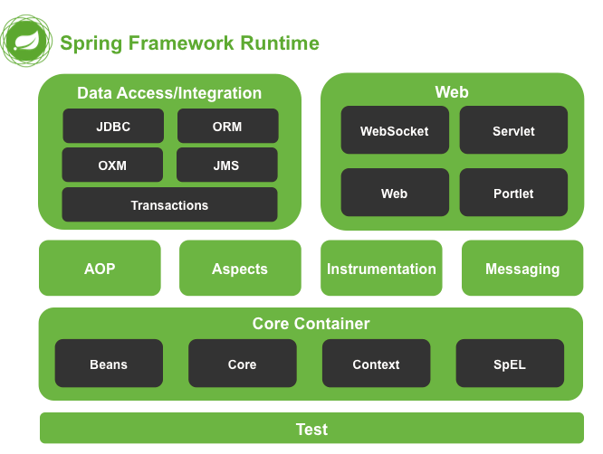
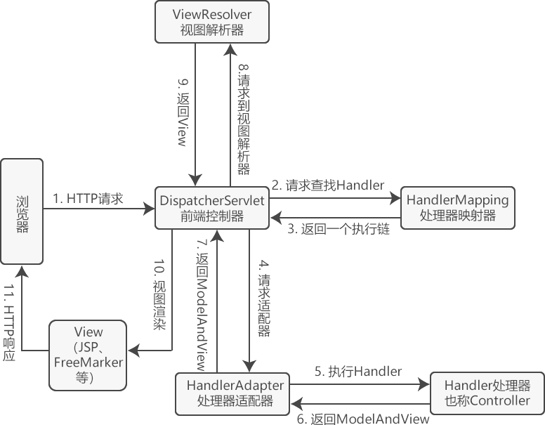

---
title: Spring
created_at: 2022-04-03T08:42:16.000Z
updated_at: 2024-03-17T10:39:44.000Z
word_count: 11682
---  
## —— [Spring](https://spring.io/) ——
## [Core](https://docs.spring.io/spring-framework/docs/current/reference/html/core.html#spring-core)
IoC（Inverse of Control，控制反转）：依赖注入（Dependency Injection，DI）。Spring 通过 IoC 容器来管理所有 Java 对象的实例化和初始化，控制对象与对象之间的依赖关系  <br />  AOP（Aspect Oriented Programming，面向切面编程）：横向抽取机制，取代了传统纵向继承体系的重复性代码，其应用主要体现在事务处理、日志管理、权限控制、异常处理等方面。  <br />  

### IoC

- 设值注入（**Setter** Injection）：IoC 容器首先会调用默认的构造方法（无参构造方法）实例化 Bean（Java 对象），然后通过 Java 的反射机制调用这个 Bean 的 setXxx() 方法，将属性值注入到 Bean 中
- 构造注入（**Constructor** Injection）：通过 Bean 的带参构造函数，以实现 Bean 的属性注入


**Spring 容器**

**Bean工厂**

- BeanFactory**：**负责配置、创建、管理 Bean。在初始化容器时，并未实例化 Bean，直到第一次访问某个 Bean 时才实例化目标 Bean
   - `boolean containsBean(String name)`：判断 Spring 容器是否包含 id 为 name 的 Bean 实例
   - `T getBean(Class<T> requiredType)`：获取 Spring 容器中属于 requiredType 类型的、唯一的 Bean 实例
   - `Object getBean(String name)`：返回容器 id 为 name 的 Bean 实例
   - `T getBean(String name, Class requiredType)`：返回容器中 id 为 name，并且类型为 requiredType 的 Bean
   - `Class<?> getType(String name)`：返回容器中 id 为 name 的 Bean 实例的类型
- ListableBeanFactory：支持按类型获取Bean的集合
- HierarchicalBeanFactory：支持父子容器关系，实现Bean定义的层次结构
- ConfigurableBeanFactory：提供对BeanFactory配置的扩展，如属性编辑器、作用域等
- AutowireCapableBeanFactory：Bean创建、初始化、注入、销毁的核心功能接口
- ConfigurableListableBeanFactory：支持配置和列表操作的可配置Bean工厂接口

**ApplicationContext 接口**  <br />  Spring 上下文，BeanFactory 的子接口。在初始化应用上下文时就实例化所有单实例的 Bean  <br />  常用实现类：FileSystemXmlApplicationContext、ClassPathXmlApplicationContext 和 AnnotationConfigApplicationContext


**后置处理器**

- BeanPostProcessor	Bean后置处理器
   - postProcessBeforeInitialization（初始化前执行）
   - postProcessAfterInitialization（初始化后执行）
- BeanFactoryPostProcessor	容器后置处理器


**XML装配Bean**  <br />  配置 applicationContext.xml
```xml
<?xml version="1.0" encoding="UTF-8"?>
<beans xmlns="http://www.springframework.org/schema/beans"
    xmlns:xsi="http://www.w3.org/2001/XMLSchema-instance"
    xsi:schemaLocation="http://www.springframework.org/schema/beans
        https://www.springframework.org/schema/beans/spring-beans.xsd">
  
    <bean id="mailService" class="com.MailService" />
  
    <!-- 使用设值注入方式装配实例 -->
		<bean id="userService" class="com.UserService">
        <property name="username" value="root" />
        <property name="mailService" ref="mailService" />
    </bean>

    <!-- 使用构造注入装配实例 -->
    <bean id="user" class="com.UserService">
        <constructor-arg index="0" value="snow" />
        <constructor-arg index="1" ref="mailService" />
    </bean>
  
 
  // 短命名空间注入  需要在头文件中加入约束文件
  // p 命名空间
  <bean id="userService" class="com.UserService" p:username="root" 
        p:mailService-ref="mailService"></bean>
  // c 命名空间
  <bean id="user" class="com.UserService" c:username="snow" 
        c:mailService-ref="mailService"></bean>
  
  // 注入集合
  <bean id="javaCollection" class="com.JavaCollection">
    <!--数组类型-->
    <property name="users">
      <array>
        <ref bean="userService"></ref>
        <ref bean="user"></ref>
        <null/>
      </array>
    </property>
    <!--List 类型-->
    <property name="list">
      <list>
        <value>张三</value>
        <value>李四</value>
        <value>王五</value>
        <value>赵六</value>
      </list>
    </property>
    <!--Map 类型-->
    <property name="maps">
      <map>
        <entry key="JAVA" value="java"></entry>
        <entry key="PHP" value="php"></entry>
      </map>
    </property>
    <!--Set 类型-->
    <property name="sets">
      <set>
        <value>MySQL</value>
        <value>Redis</value>
      </set>
    </property>
  </bean>
  
  // 注入内部Bean
  <bean id="employee" class="net.Employee">
    <property name="empNo" value="001"></property>
    <property name="empName" value="小王"></property>
    <property name="dept">
      <!--内部 Bean-->
      <bean class="net.Dept">
        <property name="deptNo" value="004"></property>
        <property name="deptName" value="技术部"></property>
      </bean>
    </property>
  </bean>
  
  // Bean继承  子Bean可以继承父 Bean 的配置数据，也可重写或添加属于自己的配置信息
  <!--父Bean-->
  <bean id="parentBean" class="xxx.ParentBean" >
      <property name="age" value="45"></property>
      <property name="sex" value="m"></property>
  </bean> 
  <!--子Bean--> 
  <bean id="childBean" class="xxx.ChildBean" parent="parentBean"></bean>
  
</beans>
```
使用
```java
public class App { 
    public static void main(String[] args) { 
        ApplicationContext context = new ClassPathXmlApplicationContext( "applicationContext.xml"); 
                                // = new FileSystemXmlApplicationContext(String configLocation);
        // 获取Bean
        UserService userService = context.getBean("UserService", UserService.class);
        // 正常调用
        System.out.println(userService.getUserName());  // root
        //手动销毁 Bean
        context.close();
    } 
}
```


| 属性名称 | 描述 |
| --- | --- |
| id | Bean 的唯一标识符，Spring IoC 容器对 Bean 的配置和管理通过该属性完成。 |
| name | Bean 的名称，通过 name 属性为同一个 Bean 同时指定多个名称，每个名称之间用逗号或分号隔开。Spring 容器可以通过 name 属性配置和管理容器中的 Bean。 |
| class |  Bean 的具体实现类，它必须是一个完整的类名，即类的全限定名。 |
| scope |  Bean 的作用域，属性值可以为 singleton（单例）、prototype（原型）、request、session 和 global Session。默认值是 singleton。 |
| constructor-arg | `<bean>` 元素的子元素，通过该元素，将构造参数传入，以实现 Bean 的实例化。该元素的 index 属性指定构造参数的序号（从 0 开始），type 属性指定构造参数的类型。 |
| property | `<bean>`元素的子元素，用于调用 Bean 实例中的 setter 方法对属性进行赋值，从而完成属性的注入。该元素的 name 属性用于指定 Bean 实例中相应的属性名。 |
| ref | `<property>`和 `<constructor-arg>` 等元素的子元索，用于指定对某个 Bean 实例的引用，即 `<bean>` 元素中的 id 或 name 属性。 |
| value | `<property>` 和 `<constractor-arg>` 等元素的子元素，用于直接指定一个常量值。 |
| list | 用于封装 List 或数组类型的属性注入。 |
| set | 用于封装 Set 类型的属性注入。 |
| map | 用于封装 Map 类型的属性注入。 |
| entry | `<map>` 元素的子元素，用于设置一个键值对。其 key 属性指定字符串类型的键值，ref 或 value 子元素指定其值。 |
| init-method | 容器加载 Bean 时调用该方法，类似于 Servlet 中的 init() 方法 |
| destroy-method | 容器删除 Bean 时调用该方法，类似于 Servlet 中的 destroy() 方法。该方法只在 scope=singleton 时有效 |
| lazy-init | 懒加载，值为 true，容器在首次请求时才会创建 Bean 实例；值为 false，容器在启动时创建 Bean 实例。该方法只在 scope=singleton 时有效 |


**自动装配	autowired**

| 名称 | 说明 |
| --- | --- |
| byName | 根据 Property 的 name 自动装配，如果一个 Bean 的 name 和另一个 Bean 中的 Property 的 name 相同，则自动装配这个 Bean 到 Property 中。 |
| byType | 根据 Property 的数据类型（Type）自动装配，如果一个 Bean 的数据类型兼容另一个 Bean 中 Property 的数据类型，则自动装配。 |
| constructor | 根据构造方法的参数的数据类型，进行 byType 模式的自动装配。 |
| autodetect | 如果发现默认的构造方法，则用 constructor 模式，否则用 byType 模式。 |
| no | 默认情况下，不使用自动装配，Bean 依赖必须通过 ref 元素定义。 |

```xml
···
    <bean id="mailService" class="com.MailService" />
  
		<bean id="userService" class="com.UserService" autowire="byName">
        <property name="username" value="root" />
        <!-- property name="mailService" ref="mailService" / -->
    </bean>
···
```


**Annotation装配Bean**  <br />  定义 Bean

- @Component：描述 Spring 中的 Bean，表示一个组件（Bean），可以作用在任何层次
- @Repository：用于将数据访问层（DAO层）的类标识为 Spring 中的 Bean，功能同 _@_Component   
- @Service：通常作用在业务层
- @Controller：通常作用在控制层

依赖注入

- @Autowired：对 Bean 的属性变量、属性的 Set 方法及构造函数进行标注，配合对应的注解处理器完成 Bean 的自动配置工作。默认按照 Bean 的**类型**进行装配。
- @Resource：与 @Autowired 一样，默认按照 Bean **实例名**称进行装配。

- @Qualifier：与 _@_Autowired  注解配合使用，会将默认的按 Bean 类型装配修改为按 Bean 的实例名称装配，Bean 的实例名称由 _@_Qualifier  注解的参数指定。 
- @Primary：@Autowired 自动装配找到多个匹配的 Bean时，首选该 Bean
- @Scope(value = "prototype", proxyMode = ScopedProxyMode.DEFAULT) ：指定 Bean 的作用域、代理方式
-  @Order(1)：指定 Bean 的加载顺序，值越小优先级越高
- 标注方法
   - @PostConstruct：指定 Bean 的初始化方法
   - @PreDestroy：指定 Bean 销毁之前的方法
- @Value：属性占位符需要放到 ${key:defaultValue} 之中，SpEL 表达式要放到 #{ ... } 之中

配置 applicationContext.xml
```xml
<?xml version="1.0" encoding="UTF-8"?>
<beans xmlns="http://www.springframework.org/schema/beans"
    xmlns:xsi="http://www.w3.org/2001/XMLSchema-instance"
    xmlns:context="http://www.springframework.org/schema/context"
    xsi:schemaLocation="http://www.springframework.org/schema/beans
        https://www.springframework.org/schema/beans/spring-beans.xsd
        http://www.springframework.org/schema/context
        https://www.springframework.org/schema/context/spring-context.xsd">

    <context:annotation-config/>
  <!--使用context命名空间，通知spring扫描指定目录，进行注解的解析-->
    <context:component-scan base-package="包名"/>

</beans>
```
```java
@Component
public class UserService {
    @Autowired
    MailService mailService;

    ...
}

@Component
public class MailService {
    @Autowired(required = false)
    ZoneId zoneId = ZoneId.systemDefault();

    @PostConstruct
    public void init() {
        System.out.println("Init mail service with zoneId = " + this.zoneId);
    }

    @PreDestroy
    public void shutdown() {
        System.out.println("Shutdown mail service");
    }
}

// 启动容器
@Configuration
public class AppConfig {
    public static void main(String[] args) {
        
        // 创建第三方Bean
        @Bean
        ZoneId createZoneId() {
            return ZoneId.of("Z");
        }
        
        ApplicationContext context = new AnnotationConfigApplicationContext(AppConfig.class);
        UserService userService = context.getBean(UserService.class);
        User user = userService.login("bob@example.com", "password");
        System.out.println(user.getName());
    }
}
```


### AOP
Aspect Oriented Programming，面向切面编程

作用范围：spring托管的bean的非static方法

**术语**

| 名称 | 说明 |
| --- | --- |
| Joinpoint（连接点） | 指那些被拦截到的点，在 Spring 中，可以被动态代理拦截目标类的方法。 |
| Pointcut（切入点） | 指要对哪些 Joinpoint 进行拦截，即被拦截的连接点。 |
| Advice（通知） | 指拦截到 Joinpoint 之后要做的事情，即对切入点增强的内容。 |
| Target（目标） | 指代理的目标对象。 |
| Weaving（植入） | 指把增强代码应用到目标上，生成代理对象的过程。 |
| Proxy（代理） | 指生成的代理对象。 |
| Aspect（切面） | 切入点和通知的结合。 |


**Spring AOP 通知类型**

| 名称 | 说明 |
| --- | --- |
| org.springframework.aop.MethodBeforeAdvice （前置通知） | 在方法之前自动执行的通知称为前置通知，可用于权限管理等功能。 |
| org.springframework.aop.AfterReturningAdvice （后置通知） | 在方法之后自动执行的通知称为后置通知，可用于关闭流、上传文件、删除临时文件等功能。 |
| org.aopalliance.intercept.MethodInterceptor （环绕通知） | 在方法前后自动执行的通知称为环绕通知，可用于日志、事务管理等功能。 |
| org.springframework.aop.ThrowsAdvice （异常通知） | 在方法抛出异常时自动执行的通知称为异常通知，可用于处理异常记录日志等功能。 |
| org.springframework.aop.IntroductionInterceptor （引介通知） | 在目标类中添加一些新的方法和属性，可用于修改旧版本程序（增强类）。 |


**XML的声明式**
```java
//切面类
public class MyAspect {
    // 前置通知
    public void myBefore(JoinPoint joinPoint) {
        System.out.print("前置通知，目标：");
        System.out.print(joinPoint.getTarget() + "方法名称:");
        System.out.println(joinPoint.getSignature().getName());
    }
  
    // 后置通知
    public void myAfterReturning(JoinPoint joinPoint) {
        System.out.print("后置通知，方法名称：" + joinPoint.getSignature().getName());
    }
  
    // 环绕通知
    public Object myAround(ProceedingJoinPoint proceedingJoinPoint)
            throws Throwable {
        System.out.println("环绕开始"); // 开始
        Object obj = proceedingJoinPoint.proceed(); // 执行当前目标方法
        System.out.println("环绕结束"); // 结束
        return obj;
    }
  
    // 异常通知
    public void myAfterThrowing(JoinPoint joinPoint, Throwable e) {
        System.out.println("异常通知" + "出错了" + e.getMessage());
    }
  
    // 最终通知
    public void myAfter() {
        System.out.println("最终通知");
    }
}
```
applicationContext.xml 配置
```xml
<!--目标类 -->
    <bean id="customerDao" class="com.mengma.dao.CustomerDaoImpl" />
    <!--切面类 -->
    <bean id="myAspect" class="com.mengma.aspectj.xml.MyAspect"></bean>
    <!--AOP 编程 -->
    <aop:config>
        <aop:aspect ref="myAspect">
            <!-- 配置切入点，通知最后增强哪些方法 -->
            <aop:pointcut expression="execution ( * com.mengma.dao.*.* (..))"
                id="myPointCut" />
            <!--前置通知，关联通知 Advice和切入点PointCut -->
            <aop:before method="myBefore" pointeut-ref="myPointCut" />
            <!--后置通知，在方法返回之后执行，就可以获得返回值returning 属性 -->
            <aop:after-returning method="myAfterReturning"
                pointcut-ref="myPointCut" returning="returnVal" />
            <!--环绕通知 -->
            <aop:around method="myAround" pointcut-ref="myPointCut" />
            <!--抛出通知：用于处理程序发生异常，可以接收当前方法产生的异常 -->
            <!-- *注意：如果程序没有异常，则不会执行增强 -->
            <!-- * throwing属性：用于设置通知第二个参数的名称，类型Throwable -->
            <aop:after-throwing method="myAfterThrowing"
                pointcut-ref="myPointCut" throwing="e" />
            <!--最终通知：无论程序发生任何事情，都将执行 -->
            <aop:after method="myAfter" pointcut-ref="myPointCut" />
        </aop:aspect>
    </aop:config>
```


**Annotation 的声明式**

| 名称 | 说明 |
| --- | --- |
| _@_Aspect  | 用于定义一个切面。 |
| _@_Before  | 用于定义前置通知，相当于 BeforeAdvice。 |
| _@_AfterReturning  | 用于定义后置通知，相当于 AfterReturningAdvice。 |
| _@_Around  | 用于定义环绕通知，相当于MethodInterceptor。 |
| _@_AfterThrowing  | 用于定义抛出通知，相当于ThrowAdvice。 |
| _@_After  | 用于定义最终final通知，不管是否异常，该通知都会执行。 |
| _@_DeclareParents  | 用于定义引介通知，相当于IntroductionInterceptor |

```java
@Component
@Aspect
@Slf4j
public class WebLogAspect {

  @Pointcut("execution( public * me.demo.controller..*.*(..))")
  public void requestLog() {
  }

  @Pointcut("@annotation(me.demo.aspect.LogInOutParam)")
  public void methodLog() {
  }

  // 前置通知
  @Before("requestLog() || methodLog()")
  public void doBefore(JoinPoint joinPoint) {
    ServletRequestAttributes requestAttributes = (ServletRequestAttributes) RequestContextHolder.getRequestAttributes();
    Optional.ofNullable(requestAttributes).map(ServletRequestAttributes::getRequest)
        .ifPresent(request -> log.info("Received {} - {} request {}", request.getRemoteAddr(),
            request.getMethod(),
            ServletUriComponentsBuilder.fromRequest(request).encode().build()));
    MethodSignature signature = (MethodSignature) joinPoint.getSignature();
    log.info("Ready into {} . {} - ARGS: (name) {} - (value) {}",
        signature.getDeclaringTypeName(), signature.getName(),
        signature.getParameterNames(), Arrays.toString(joinPoint.getArgs()));
  }

  // 环绕通知
  @Around("requestLog() || methodLog()")
  public Object doAround(ProceedingJoinPoint proceedingJoinPoint)
      throws Throwable {

    StopWatch stopWatch = new StopWatch(proceedingJoinPoint.toShortString());
    stopWatch.start();
    Object obj = null;
    try {
      // 执行当前目标方法
      obj = proceedingJoinPoint.proceed();
      return obj;
    } finally {

      stopWatch.stop();
      String methodName = proceedingJoinPoint.getSignature().getName();
      log.info("{} - {} complete, it takes {}ms", proceedingJoinPoint.getTarget(), methodName
          , stopWatch.getLastTaskTimeMillis());
      if (Objects.nonNull(obj)) {
        log.info("{} return result -> {}", methodName,
            StringUtils.abbreviate(JSON.toJSONString(obj), 1000));
      }
    }
  }

  // 异常通知
  @AfterThrowing(value = "requestLog()", throwing = "e")
  public void doAfterThrowing(JoinPoint joinPoint, Throwable e) {
    log.info("{} - {} execute error {}", joinPoint.getTarget(),
        joinPoint.getSignature().getName()
        , e.getMessage());
  }

}
```
applicationContext.xml 配置
```xml
<!--扫描含com.mengma包下的所有注解-->
<context:component-scan base-package="com.mengma"/>
<!-- 使切面开启自动代理 -->
<aop:aspectj-autoproxy></aop:aspectj-autoproxy>
```


AspectJ 切入点语法

- [Supported Pointcut Designators](https://docs.spring.io/spring/docs/current/spring-framework-reference/core.html#aop-pointcuts-designators)
- Spring AOP 常用的切入点指示符（pointcut designators，PCD）
   - 可用通配符：
      - `*` 代表一个任意类型的参数
      - `..` 代表零个或多个任意类型的参数，在表示类时，必须和 * 联合使用，而在表示入参时则单独使用
      - `+` 表示按类型匹配指定类的所有类，必须跟在类名后面，如 com.smart.Car+ 继承或扩展指定类的所有类，同时还包括指定类本身
      - 运算符：`&&、||、！`
   - execution：用于匹配执行方法的连接点
      - `execution(<修饰符>? <返回值类型> <所属类>?<方法名>(形参类型列表) <声明抛出的异常>?)`，? 表示该部分可省略
      - 如 `execution(* com.example.app.service.impl.*.*(..))`，匹配 com.example.app.service.impl 包中任意类的任意方法的执行
   - within：用于限定匹配特定域下的连接点。当使用 Spring AOP 的时候，只能匹配方法执行的连接点。
      - 如 within(com.example.app.service..*)，匹配在 com.example.app.service 包或其子包中的任意连接点
   - this：用于限定 AOP 代理对象必须是指定类型的实例，匹配该对象的所有连接点
      - this(com.example.app.service.AccountService)，匹配实现了 com.example.app.service.AccountService 接口的 AOP 代理的所有连接点
   - target：用于限定目标对象必须是指定类型的实例，匹配该对象的所有连接点
      - target(com.example.app.service.AccountService)，匹配实现了 com.example.app.service.AccountService 接口的目标对象的所有连接点
   - args：args(参数类型列表)，用于对连接点的参数类型进行限制，要求参数是指定类型的实例
   - bean：bean(Bean的id或name)，用于限定只匹配指定 Bean 实例内方法的连接点，支持使用 * 通配符，注意：bean 切入点表达式是 Spring AOP 额外支持的
   - @annotation：用于匹配标注有指定注解的方法
   - @within：用于匹配标注有指定注解的类内所有方法
      - 如 @within(feign.Client+)，切入 feign.Client 的实现类
   - @target：用于匹配标注有指定注解的类的目标对象内所有方法
   - @args：用于匹配入参标注有指定注解的方法


### [SpEL](https://docs.spring.io/spring-framework/reference/core/expressions.html)
Spring Expression Language 是一种功能强大的表达式语言

- Literal expressions
- Boolean and relational operators
- Regular expressions
- Class expressions
- Accessing properties, arrays, lists, and maps
- Method invocation
- Assignment
- Calling constructors
- Bean references
- Array construction
- Inline lists
- Inline maps
- Ternary operator
- Variables
- User-defined functions added to the context
- reflective invocation of Method
- various cases of MethodHandle
- Collection projection
- Collection selection
- Templated expressions
```java
// 构造解析器
ExpressionParser parser = new SpelExpressionParser();
// 解析器解析字符串表达式
Expression exp = parser.parseExpression("new String('hello spel').toUpperCase()");
// 获取表达式的值
String message = exp.getValue(String.class);
System.out.println(message); // HELLO SPEL
```

### Application Event

**内置事件**

- 上下文更新事件（ContextRefreshedEvent）：在调用ConfigurableApplicationContext 接口中的refresh()方法时被触发。
- 上下文开始事件（ContextStartedEvent）：当容器调用ConfigurableApplicationContext的Start()方法开始/重新开始容器时触发该事件。
- 上下文停止事件（ContextStoppedEvent）：当容器调用ConfigurableApplicationContext的Stop()方法停止容器时触发该事件。
- 上下文关闭事件（ContextClosedEvent）：当ApplicationContext被关闭时触发该事件。容器被关闭时，其管理的所有单例Bean都被销毁。
- 请求处理事件（RequestHandledEvent）：在Web应用中，当一个http请求（request）结束触发该事件。

1 自定义事件，继承 ApplicationEvent
```java
@Data
public class DemoEvent extends ApplicationEvent {

    private String msg;

    public DemoEvent(Object source, String msg) {
        super(source);
        this.msg = msg;
    }
}
```
2 定义监听器，实现 ApplicationListener 或者通过 @EventListener 注解到方法上
```java
@Component
public class DemoListener {
    // 条件事件
    @EventListener(condition = "#event.meg.equals('success')")
    public void onApplicationEvent(DemoEvent event) {
        String msg = event.getMsg();
        System.out.println("Receive message: " + msg);

    }
}
```
> @TransactionalEventListener 事务处理
> 使用 @Order 注解指定执行顺序


3 定义发布者，通过 ApplicationEventPublisher
```java
@Component
public class DemoPublisher  {
    @Autowired
    private ApplicationContext applicationContext;

    public void publish(String msg){
        applicationContext.publishEvent(new DemoEvent(this, msg));
}
```


启动后运行

- ApplicationRunner
- CommandLineRunner
```java
@FunctionalInterface
public interface CommandLineRunner {
    void run(String... args) throws Exception;
}
```


### Utils
#### StringUtils

- boolean hasLength(CharSequence str)：字符串是否为空，或者长度为 0
- boolean hasText(String str)：字符串是否有内容（不为空，且不全为空格）
- boolean containsWhitespace(String str)：字符串是否包含空格
- String trimWhitespace(String str)：去掉字符串前后的空格
- String trimAllWhitespace(String str)：去掉字符串中所有的空格
- String unqualify(String qualifiedName)：得到以 . 分割的最后一个值（可以用来获取类名或者文件后缀）
- String unqualify(String qualifiedName, char separator)：得到以给定字符分割的最后一个值（可以用来获取文件名 File.separatorChar）
- String getFilename(String path)：获取文件名
- String getFilenameExtension(String path)：获取文件后缀名
- String capitalize(String str)：首字母大写
- String uncapitalize(String str)：取消首字母大写
- boolean substringMatch(CharSequence str, int index, CharSequence substring)：判断从指定索引开始，是否匹配子字符串
- int countOccurrencesOf(String str, String sub)：判断子字符串在字符串中出现的次数
- String replace(String inString, String oldPattern, String newPattern)：在字符串中使用子字符串替换
- String delete(String inString, String pattern)：删除所有匹配的子字符串
- String deleteAny(String inString, String charsToDelete)：删除子字符串中任意出现的字符
- String quote(String str)：在字符串前后增加单引号，比较适合在日志时候使用
- String[] addStringToArray(String[] array, String str)：把一个字符串添加到一个字符串数组中
- String[] concatenateStringArrays(String[] array1, String[]array2)：连接两个字符串数组
- String[] mergeStringArrays(String[] array1, String[] array2)：连接两个字符串数组，去掉重复元素
- String[] sortStringArray(String[] array)：字符串数组排序
- String[] tokenizeToStringArray(String str, String delimiters)：对每一个元素执行 trim 操作，并去掉空字符串
- String[] delimitedListToStringArray(String str, String delimiter)：分割字符串，以 delimiter 作为整体分隔符
- `Set<String> commaDelimitedListToSet(String str)`：使用逗号分割字符串，并放到 set 中去重
- `String collectionToDelimitedString(Collection<?> coll, String delim, String prefix, String suffix)`：将集合中的每个元素使用前缀、后缀、分隔符连接
- `String collectionToDelimitedString(Collection<?> coll, String delim)`：将集合中的每个元素使用指定字符串连接
- String arrayToDelimitedString(Object[] arr, String delim)：数组使用指定字符串连接
- String[] split(String toSplit, String delimiter)：在第一次出现分隔符时分割
- Properties splitArrayElementsIntoProperties(String[] array, String delimiter)：把字符串数组中的每一个字符串按照给定的分隔符装配到一个 Properties 中

#### NumberUtils

- `T convertNumberToTargetClass(Number number, Class<T> targetClass)`
- `T parseNumber(String text, Class<T> targetClass)`
- `T parseNumber(String text, Class<T> targetClass, NumberFormat numberFormat)`

#### ObjectUtils

- boolean isCheckedException(Throwable ex)
- boolean isArray(Object obj)
- boolean isEmpty(Object[] array)
- boolean isEmpty(Object obj)
- Object unwrapOptional(Object obj)
- boolean containsElement(Object[] array, Object element)
- A[] addObjectToArray(A[] array, O obj)
- boolean nullSafeEquals(Object o1, Object o2)
- int nullSafeHashCode(Object obj)
- String nullSafeToString(Object obj)
- String nullSafeToString(Object[] array)

CollectionUtils

#### FileCopyUtils
用于文件和流复制，所有复制方法都使用 4096 字节的块大小，并在完成后关闭所有受影响的流

- int copy(File in, File out)
- void copy(byte[] in, File out)
- int copy(InputStream in, OutputStream out)
- void copy(byte[] in, OutputStream out)
- int copy(Reader in, Writer out)
- void copy(String in, Writer out)
- String copyToString(Reader in)
- byte[] copyToByteArray(File in)
- byte[] copyToByteArray(InputStream in)

#### FileSystemUtils

- boolean deleteRecursively(File root)：递归删除
- boolean deleteRecursively(Path root)
- void copyRecursively(File src, File dest)：递归复制
- void copyRecursively(Path src, Path dest)

#### BeanUtils

- void copyProperties(Object source, Object target, String... ignoreProperties)：浅克隆（原理：反射）
- `boolean isSimpleProperty(Class<?> clazz)`：判断给定的类型是否表示简单属性：八大基本类型/包装类型、字符串或其它 CharSequence、Number、Enum、Date、URI、URL、Locale、Class 或对应的数组
- `T instantiateClass(Class<T> clazz)`：使用无参构造器实例化
- `Method findDeclaredMethod(Class<?> clazz, String methodName, Class<?>... paramTypes)`

#### BeanCopier

- 类方法：BeanCopier create(Class source, Class target, boolean useConverter)：通过操作字节码生成用于两个 JavaBean 间进行复制的类
- 抽象方法：void copy(Object var1, Object var2, Converter var3)：对两个 Bean 间属性名和类型完全相同的变量进行拷贝

#### BeanMap

- 类方法：BeanMap create(Object bean)：JavaBean 对象转 Map 对象，BeanMap.create(bean).keySet();
- 实例方法：void putAll(Map t)：Map 对象转 JavaBean 对象，BeanMap.create(bean).putAll(map);

#### AopUtils

- boolean isAopProxy(Object object)：是否是代理对象
- boolean isJdkDynamicProxy(Object object)：判断是否是 JDK 代理对象
- boolean isCglibProxy(Object object)：判断是否是 cglib 代理对象
- `Class<?> getTargetClass(Object candidate)`：获取对象的真实类型
- `Method getMostSpecificMethod(Method method, Class<?> targetClass)`：获取真实对象上对应的方法
- Object invokeJoinpointUsingReflection(Object target, Method method, Object[] args)：在 target 对象上，使用 args 参数列表执行 method

ClassUtils  <br />  AnnotationUtils  <br />  ResolvableType
#### ReflectionUtils

- `Field findField(Class<?> clazz, String name)`
- `Field findField(Class<?> clazz, String name, Class<?> type)`
- Object getField(Field field, Object target)
- void setField(Field field, Object target, Object value)
- `Method findMethod(Class<?> clazz, String name)`
- `Method findMethod(Class<?> clazz, String name, Class<?>... paramTypes)`
- Object invokeMethod(Method method, Object target)
- Object invokeMethod(Method method, Object target, Object... args)

#### StopWatch
秒表，可用于查看多个任务的耗时情况，线程不安全

- 构造器：StopWatch(String id)
- void start(String taskName)
- void stop()
- long getTotalTimeMillis()、long getLastTaskTimeMillis()
- TaskInfo[] getTaskInfo()、TaskInfo getLastTaskInfo()
- String shortSummary()


StreamUtils  <br />  Base64Utils  <br />  DigestUtils  <br />  DomUtils

PropertyPlaceholderHelper
```java
PropertyPlaceholderHelper helper = new PropertyPlaceholderHelper("${", "}", ":",
        true);
helper.replacePlaceholders(input, Environment::getProperty);
```

数据结构

- LinkedCaseInsensitiveMap	不区分大小写的 Map
- MultiValueMap

## [Data Access](https://docs.spring.io/spring-framework/docs/current/reference/html/data-access.html#spring-data-tier)
### JDBCTemplate
通过配置文件、注解、Java 配置类等形式获取数据库的相关信息，实现了对 JDBC 开发过程中的驱动加载、连接的开启和关闭、SQL 语句的创建与执行、异常处理、事务处理、数据类型转换等操作的封装
```xml
<?xml version="1.0" encoding="UTF-8"?>
<beans xmlns="http://www.springframework.org/schema/beans"
       xmlns:xsi="http://www.w3.org/2001/XMLSchema-instance"
       xmlns:context="http://www.springframework.org/schema/context"
       xsi:schemaLocation="http://www.springframework.org/schema/beans
    http://www.springframework.org/schema/beans/spring-beans-3.0.xsd
    http://www.springframework.org/schema/context
            http://www.springframework.org/schema/context/spring-context.xsd">
    <!--开启组件扫描-->
    <context:component-scan base-package="net.biancheng.c"></context:component-scan>
    <!--引入 jdbc.properties 中的配置-->
    <context:property-placeholder location="classpath:jdbc.properties"></context:property-placeholder>
    
  	<!--定义数据源 Bean-->
    <bean id="dataSource" class="org.springframework.jdbc.datasource.DriverManagerDataSource">
        <!--数据库连接地址-->
        <property name="url" value="${jdbc.url}"/>
        <!--数据库的用户名-->
        <property name="username" value="${jdbc.username}"/>
        <!--数据库的密码-->
        <property name="password" value="${jdbc.password}"/>
        <!--数据库驱动-->
        <property name="driverClassName" value="${jdbc.driver}"/>
    </bean>
    <!--定义JdbcTemplate Bean-->
    <bean id="jdbcTemplate" class="org.springframework.jdbc.core.JdbcTemplate">
        <!--将数据源的 Bean 注入到 JdbcTemplate 中-->
        <property name="dataSource" ref="dataSource"></property>
    </bean>
   
</beans>
```

methods

- public int update(String sql)	用于执行新增、更新、删除等语句；
- public int update(String sql,Object... args)
- public void execute(String sql)	可以执行任意 SQL，一般用于执行 DDL 语句；
- public T execute(String sql, PreparedStatementCallback action)
- `public <T> List<T> query(String sql, RowMapper<T> rowMapper, @Nullable Object... args) `
- 用于执行查询语句；
- `public <T> T queryForObject(String sql, RowMapper<T> rowMapper, @Nullable Object... args)`
- `public int[] batchUpdate(String sql, List<Object[]> batchArgs, final int[] argTypes) `
```java
@Repository
public class UserDaoImpl implements UserDao {
    @Resource
    private JdbcTemplate jdbcTemplate;
    @Resource
    private NamedParameterJdbcTemplate namedParameterJdbcTemplate;
    
    @Override
    public int addUer(User user) {
        String sql = "INSERT into `user` (`user`.user_name,`user`.`status`) VALUES(?,?);";
        int update = jdbcTemplate.update(sql, user.getUserName(), user.getStatus());
        return update;
    }
    
    public int update(User user) {
        String sql = "UPDATE `user` SET status=? WHERE user_name=?;";
        return jdbcTemplate.update(sql, user.getStatus(), user.getUserName());
    }
    
    public int delete(User user) {
        String sql = "DELETE FROM `user` where user_name=?;";
        return jdbcTemplate.update(sql, user.getUserName());
    }
    
    public int count(User user) {
        String sql = "SELECT COUNT(*) FROM `user` where `status`=?;";
        return jdbcTemplate.queryForObject(sql, Integer.class, user.getStatus());
    }
    
    public List<User> getList(User user) {
        String sql = "SELECT * FROM `user` where `status`=?;";
        return jdbcTemplate.query(sql, new BeanPropertyRowMapper<User>(User.class), user.getStatus());
    }
    
    public void batchAddUser(List<Object[]> batchArgs) {
        String sql = "INSERT into `user` (`user`.user_name,`user`.`status`) VALUES(?,?);";
        jdbcTemplate.batchUpdate(sql, batchArgs);
    }
}
```

### 事务（Transaction）

**编程式事务管理**	通过编写代码实现的事务管理  <br />  **TransactionDefinition**：定义了一个事务规则——事务隔离、事务传播、事务超时、只读状态  <br />  TransactionStatus	表示一个事务

**PlatformTransactionManager**： 具体的事务管理由 PlatformTransactionManager 的实现类DataSourceTransactionManager来完成

- TransactionStatus getTransaction(@Nullable TransactionDefinition definition)：开始事务，transactionDefinition 可从容器中获取
- void commit(TransactionStatus status)：提交事务
- void rollback(TransactionStatus status)：回滚事务

**声明式事务管理**	底层采用了 AOP 技术，只需要在配置文件中进行相关的规则声明  <br />  `@Transactional` 建议标注在实现类（或实现类的方法）上  <br />  可用属性

- transactionManager：指定使用的事务管理器 Bean 的 id
- isolation：用于指定事务的隔离级别，默认为底层事务的隔离级别 Isolation.DEFAULT
- propagation：指定事务传播行为，默认 Propagation.REQUIRED
- readOnly：指定事务是否只读，默认 false
- rollbackFor：指定遇到特定异常时强制回滚事务，默认 ex instanceof RuntimeException || ex instanceof Error （RuntimeException 或 Error）时才回滚，DefaultTransactionAttribute#rollbackOn
- rollbackForClassName：指定遇到特定的多个异常时强制回滚事务。该属性值可以指定多个异常类名
- noRollbackFor：指定遇到特定异常时强制不回滚事务
- noRollbackForClassName：指定遇到特定的多个异常时强制不回滚事务。该属性值可以指定多个异常类名
- timeout：指定事务的超时时长

:::warning
注意事项

- 自调用失效：一个类**自身方法之间的调用**
- 方法是 public 且非静态的
:::

自注入：Spring bean将自身作为依赖注入。它使用Spring容器获取对自身的引用，然后使用该引用执行某些操作

## [Spring MVC](https://docs.spring.io/spring-framework/reference/web/webmvc.html)


**MVC**

- **模型(Model)	**封装了应用程序数据，通常它们将由POJO类组成。
- **视图(View)	**负责渲染模型数据，一般来说它生成客户端浏览器可以解释HTML输出。
- **控制器(Controller)	**负责处理用户请求并构建适当的模型，并将其传递给视图进行渲染。

执行流程  <br />    <br />  Handler

- HandlerMethodReturnValueHandler
- HandlerMethodArgumentResolver

### 注解
`@RequestMapping`：用于类或方法，用来转换 Web 请求（访问路径和参数）

- 常用属性：
   - value、path：用于将指定请求的实际地址转换到方法上，value 的属性值可以不带斜杠
   - method：用来指定该方法仅仅处理哪些 HTTP 请求方式，包括 GET、POST、HEAD、OPTIONS、PUT、PATCH、DELETE、TRACE，如果没有指定 method 属性值，则请求处理方法可以处理任意的 HTTP 请求方式
   - consumes：指定处理**请求的提交内容类型**（Content-Type），如 "application/json"、"text/html"、"application/x-www-form-urlencoded"、"multipart/form-data"（MediaType 提供了常用的媒体类型）
   - produces：指定**返回的内容类型**，返回的内容类型必须是 request 请求头（Accept）中所包含的类型，如 "application/json;charset=UTF-8"、"application/json"
   - headers：指定请求中必须包含某些指定的 header 值，才能让该方法处理，如 "Accept=application/json"
   - params：指定请求中必须包含某些参数值时，才让该方法处理，如 params="myParam=myValue”，方法仅处理其中名为“myParam”、值为“myValue”的请求
- 组合注解：`@GetMapping、@PostMapping、@PutMapping、@DeleteMapping、PatchMapping`
- 后缀匹配：Spring MVC 中默认将 .* 作为匹配后缀，即映射到 /person 的方法也隐式映射到 /person.*。通过重写 WebMvcConfigurerAdapter 类中的 configurePathMatch 方法可设置不忽略“.”后面的参数，configurer.setUseSuffixPatternMatch(false)（Spring Boot 默认设置为 false）
- URI 模式：
   - ? 匹配 1 个字符（但不能是代表路径分隔符的 /）
   - * 匹配 0 或多个任意的字符（可以是代表路径分隔符的 /）
   - ** 匹配 0 或多个目录
   - `{varName:regex}`，如`{spring:[a-z]+} `将**正则表达式** [a-z]+ 匹配到的值赋值给名为 spring 的路径变量
   - 也可以嵌入 `${…} `占位符，这些占位符在启动时通过 PropertyPlaceHolderConfigurer 对本地、系统、环境和其它属性源来解析
   - 最长匹配原则：存在多个路径匹配模式时，Spring MVC 会以最长符合路径模式来匹配一个路径

  <br />  `@CrossOrigin`：可用于类或方法，**设置跨域行为**，常用属性：origins（允许域名）、methods、allowedHeaders、exposedHeaders、allowCredentials（是否允许发送 Cookie，**启用后允许域名不能设置为 '*'**）、maxAge（本次预检请求的有效期，单位为秒）


**Util**

- HttpMethod
- HttpStatus
- UriComponents
```java
UriComponents uriComponents = UriComponentsBuilder.fromHttpUrl("https://www.bing.cn")
    .path("search/{content}")
    .queryParam("q", "spring")
    .uriVariables(ImmutableMap.of("content", "abc"))
    .build().encode(StandardCharsets.UTF_8);
```

- HtmlUtils
- AntPathMatcher
- PathPattern
   - `?` matches one character
   - `*` matches zero or more characters within a path segment
   - `**` matches zero or more path segments until the end of the path
   - `{spring}` matches a path segment and captures it as a variable named "spring"
   - `{spring:[a-z]+}` matches the regexp [a-z]+ as a path variable named "spring"
   - `{*spring}` matches zero or more path segments until the end of the path and captures it as a variable named "spring"

方法参数

| 控制器方法参数 | 描述 |
| --- | --- |
| WebRequest, NativeWebRequest | 对请求参数、请求、会话属性的通用访问，不直接使用 Servlet API |
| javax.servlet.ServletRequest, javax.servlet.ServletResponse | 选择任意特定的请求或响应类型 —— 如：ServletRequest、HttpServletRequest，或 Spring 的 MultipartRequest、MultipartHttpServletRequest |
| javax.servlet.http.HttpSession | 强制会话的存在。因此，该参数不可能为 null。 *会话访问不是线程安全的。如果多个请求被允许并发地访问会话，考虑设置 RequestMappingHandlerAdapter 的 synchronizeOnSession 标志为 true |
| javax.servlet.http.PushBuilder | Servlet 4.0 push builder API，用来编程式 HTTP/2 资源推送。注意，每个 Servlet Spec，如果客户端不支持 HTTP/2 特性，注入的 PushBuilder 实例可以为 null |
| java.security.Principal | 当前已认证的用户；如果已知，可能是一个特定的 Principal 实现 |
| HttpMethod | 请求的 HTTP 方式 |
| java.util.Locale | 当前请求的区域设置，由可用的最具体的 LocaleResolver 确定，实际上是已配置的 LocaleResolver 或 LocaleContextResolver |
| java.util.TimeZone + java.time.ZoneId | 当前请求关联的时区，由 LocaleContextResolver 确定 |
| java.io.InputStream, java.io.Reader | 用于访问由 Servlet API 暴露的原始请求体 |
| java.io.OutputStream, java.io.Writer | 用于访问由 Servlet API 暴露的原始响应体 |
| @PathVariable | 用于访问 URI 模板变量 |
| @MatrixVariable | 用于访问 URI 路径段中的键值对 |
| @RequestParam | 用来访问 Servlet 请求参数。参数值被转换为声明的方法参数类型。  |
| @RequestHeader | 用来访问请求报文头。报文头值被转换为声明的方法参数类型 |
| @CookieValue | 用来访问 Cookie。Cookie 值被转换为声明的方法参数类型 |
| @RequestBody | 用来访问 HTTP 请求报文体。报文体内容使用 HttpMessageConverters 被转换为声明的方法参数类型 |
| `HttpEntity<B>` | 用来访问请求报文头和报文体。报文体使用 HttpMessageConverters 被转换 |
| @RequestPart | 用来访问 multipart/form-data 请求的一部分 |
| java.util.Map, org.springframework.ui.Model, org.springframework.ui.ModelMap | 用来访问用于 HTTP 控制器的模型，作为视图渲染的一部分暴露给模板 |
| RedirectAttributes | 指定在重定向时使用的属性 —— 用来附加临时存储到重定向之后请求的查询字符串，flash 属性 |
| @ModelAttribute | 用于访问模型（如果不存在就实例化）中存在的应用数据绑定和校验的属性。 |
| Errors, BindingResult | 用于访问命令对象（如 @ModelAttribute 参数）校验和数据绑定产生的错误，或 @RequestBody 或 @RequestPart 参数校验产生的错误；Errors 或 BindingResult 参数必须紧跟在被校验的方法参数之后 |
| SessionStatus + class-level @SessionAttributes | 用于标记表单处理完成以清除通过类级别 @SessionAttributes 注解声明的会话属性 |
| UriComponentsBuilder | 用于准备一个相对于当前请求的主机、端口、方案、上下文路径和 Servlet 映射的文字部分的 URL，还需要考虑 Forwarded 和 X-Forwarded-* 报文头 |
| @SessionAttribute | 用于访问任意会话属性 |
| @RequestAttribute | 用于访问请求属性 |


返回值

| 控制器方法返回值 | 描述 |
| --- | --- |
| @ResponseBody | 返回值通过 HttpMessageConverters 转换并写入响应 |
| `HttpEntity<B>, ResponseEntity<B>` | 返回值指定完整的响应，包括通过 HttpMessageConverters 转换并写入响应的 HTTP 报文头和报文体 |
| HttpHeaders | 用于返回只有报文头没有报文体的响应 |
| String | 用于 ViewResolver 解析的视图名，并与隐式的模型 |
| View | View 实例，与隐式的模型一起用来渲染模型 |
| java.util.Map, org.springframework.ui.Model | 将被添加到隐式模型的属性，视图名由 RequestToViewNameTranslator 隐式地确定 |
| @ModelAttribute | 将被添加的模型的属性 |
| ModelAndView object | 待使用的视图和模型，以及可选的响应状态 |
| void | void 返回类型（或 null 返回值）的方法，如果它同时包含 ServletResponse，或者 OutputStream 属性，或者 @ResponseStatus 注解，则认为它已经处理完了响应。 |
| `DeferredResult<V>` | 从任意线程异步地生成任意上述返回值 |
| `Callable<V>` | 在 Spring MVC 托管的线程中异步地生成任意上述返回值 |
| ListenableFuture, CompletionStage, CompletableFuture | DeferredResult 的便捷替代方案 |
| ResponseBodyEmitter, SseEmitter | 在 HttpMessageConverter 的帮助下异步地发出一个对象流以写入响应 |
| StreamingResponseBody | 异步地写入响应 OutputStream |


```java
@RestController
@RequestMapping("/persons")
class PersonController {

    @GetMapping("/{id}")
    public Person getPerson(@PathVariable Long id) {
        // ...
    }

    @PostMapping
    @ResponseStatus(HttpStatus.CREATED)
    public void add(@RequestBody Person person) {
        // ...
    }
}
```

### 拦截器（Interceptor）
自定义拦截器：类实现 Hanlderlnterceptor 接口或者继承 HandlerlnterceptorAdapter 抽象类，重写 preHandle 方法（在请求发生前执行），或重写 postHandle 方法（在请求完成后执行）
```java
public class MyInterceptor implements HandlerInterceptor {

    @Override
    public boolean preHandle(HttpServletRequest request,
            HttpServletResponse response, Object handler) throws Exception {
        System.out.println("preHandle方法在控制器的处理请求方法调用之前执行");
        return false;
    }
    
        @Override
    public void postHandle(HttpServletRequest request,
            HttpServletResponse response, Object handler,
            ModelAndView modelAndView) throws Exception {
        System.out.println("postHandle方法在控制器的处理请求方法调用之后，解析视图之前执行");
    }
    
        @Override
    public void afterCompletion(HttpServletRequest request,
            HttpServletResponse response, Object handler, Exception ex)
            throws Exception {
        System.out.println("afterCompletion方法在控制器的处理请求方法执行完成后执行，即视图渲染结束之后执行");
    }
}
```
注册拦截器
```java
@Configuration
@EnableWebMvc
public class WebConfig implements WebMvcConfigurer {

	@Override
	public void addInterceptors(InterceptorRegistry registry) {
		registry.addInterceptor(new LocaleChangeInterceptor());
		registry.addInterceptor(new ThemeChangeInterceptor()).addPathPatterns("/**").excludePathPatterns("/admin/**");
	}
}
```

**Filter**
```java
// URL 模式过滤
@Bean
public FilterRegistrationBean<RequestResponseLoggingFilter> loggingFilter(){
    FilterRegistrationBean<RequestResponseLoggingFilter> registrationBean 
      = new FilterRegistrationBean<>();
        
    registrationBean.setFilter(new RequestResponseLoggingFilter());
    registrationBean.addUrlPatterns("/users/*");
    registrationBean.setOrder(2);
        
    return registrationBean;    
}
```


### 控制器通知 Controller Advice
`@ControllerAdvice` 或 `@RestControllerAdvice` 定义统一的处理类，用来拦截 Controller 的方法

#### 统一异常处理

- `@ExceptionHandler(value = Exception.class)` 指定该方法处理的异常类型
- `@ResponseStatus(HttpStatus.xxx)` 指定该方法返回的状态码
```java
@Slf4j
@RestControllerAdvice
public class GlobalExceptionHandler {

  @ExceptionHandler(Exception.class)
  public ResponseEntity<?> handlerGeneralException(Exception exception) {
    log.error("Occur exception {}", exception.getMessage());
    return new ResponseEntity<>(exception.getMessage(), HttpStatus.BAD_REQUEST);
  }
}
```

#### 请求前后增强处理
**RequestBodyAdvice**：用于对带有 `@RequestBody`注解的 Controller 方法，在读取请求 body 之前或者在 body 转换成对象之前做相应的增强（如消息体解密、日志记录）
```java
@Slf4j
@ControllerAdvice
public class LogRequestBodyAdvice implements RequestBodyAdvice {
    @Override
    public boolean supports(MethodParameter methodParameter, Type type, Class<? extends HttpMessageConverter<?>> aClass) {
        return true;
    }

    @Override
    public HttpInputMessage beforeBodyRead(HttpInputMessage httpInputMessage, MethodParameter methodParameter, Type type, Class<? extends HttpMessageConverter<?>> aClass) throws IOException {
        return httpInputMessage;
    }

    @Override
    public Object afterBodyRead(Object body, HttpInputMessage httpInputMessage, MethodParameter methodParameter, Type type, Class<? extends HttpMessageConverter<?>> aClass) {
        Method method = methodParameter.getMethod();
        log.info("{}.{}:{}", method.getDeclaringClass().getSimpleName(), method.getName(), JSON.toJSONString(body));
        return body;
    }

    @Override
    public Object handleEmptyBody(Object body, HttpInputMessage httpInputMessage, MethodParameter methodParameter, Type type, Class<? extends HttpMessageConverter<?>> aClass) {
        Method method = methodParameter.getMethod();
        log.info("{}.{}", method.getDeclaringClass().getSimpleName(), method.getName());
        return body;
    }
}
```
**ResponseBodyAdvice**：对使用 `@ResponseBody` 修饰的 Controller 方法，在响应体写出之前做相应的增强
```java
@Slf4j
@ControllerAdvice
public class LogResponseBodyAdvice implements ResponseBodyAdvice {
    @Override
    public boolean supports(MethodParameter methodParameter, Class aClass) {
        return true;
    }

    @Override
    public Object beforeBodyWrite(Object body, MethodParameter methodParameter, MediaType mediaType, Class aClass, ServerHttpRequest serverHttpRequest, ServerHttpResponse serverHttpResponse) {
        Method method = methodParameter.getMethod();
        String url = serverHttpRequest.getURI().toASCIIString();
        log.info("{}.{}, url={}, result={}", method.getDeclaringClass().getSimpleName(), method.getName(), url, JSON.toJSONString(body));
        return body;
    }
}
```


### 文件上传

需导入文件上传的jar包，commons-fileupload  <br />  配置bean：multipartResolver
```xml
<bean id="multipartResolver"  class="org.springframework.web.multipart.commons.CommonsMultipartResolver">
   <!-- 请求的编码格式，默认为ISO-8859-1 -->
   <property name="defaultEncoding" value="utf-8"/>
   <!-- 上传文件大小上限，单位为字节（10485760=10M） -->
   <property name="maxUploadSize" value="10485760"/>
   <property name="maxInMemorySize" value="40960"/>
</bean>
```
```java
@RestController
public class UpLoadController {
    //@RequestParam("file") 将name=file控件得到的文件封装成CommonsMultipartFile 对象
    @PostMapping("/upload")
    public String upload(@RequestParam("file") MultipartFile file, HttpServletRequest request){
        String filePath = getPath(request);
        return saveFile(file, filePath);
    }
    
    @PostMapping("/multiUpload")
    public String multiUpload(@RequestParam("file") MultipartFile[] files, HttpServletRequest request){
        String filePath = getPath(request);
        for (MultipartFile f : files){
            saveFile(f, filePath);
        }
        return "ok";
    }
    
    private String getPath(HttpServletRequest request){
        return request.getServletContext().getRealPath("/upload");
    }
 
    private String saveFile(MultipartFile file, String filePath){
        if (file.isEmpty()){
            return "未选择文件";
        }
        String filename = file.getOriginalFilename(); //获取上传文件原来的名称
        File temp = new File(filePath);
        if (!temp.exists()){
            temp.mkdirs();
        }
 
        File localFile = new File(filePath+filename);
        try {
            file.transferTo(localFile); //把上传的文件保存至本地
            System.out.println(file.getOriginalFilename()+" 上传成功");
        }catch (IOException e){
            e.printStackTrace();
            return "上传失败";
        }
        return "ok";
    }
}
```
### 文件下载
```java
@RequestMapping(value="/download")
public String downloads(HttpServletResponse response ,HttpServletRequest request) throws Exception{
   // 下载的地址
   String  path = request.getServletContext().getRealPath("/upload");
   String  fileName = "image.jpg";

   //1、设置response 响应头
   response.reset(); //设置页面不缓存,清空buffer
   response.setCharacterEncoding("UTF-8"); //字符编码
   response.setContentType("multipart/form-data"); //二进制传输数据
   //设置响应头
   response.setHeader("Content-Disposition",
           "attachment;fileName=" + URLEncoder.encode(fileName, "UTF-8"));

   File file = new File(path,fileName);
   //2、 读取文件--输入流
   InputStream input=new FileInputStream(file);
   //3、 写出文件--输出流
   OutputStream out = response.getOutputStream();

   byte[] buff =new byte[1024];
   int index=0;
   //4、执行 写出操作
   while((index= input.read(buff))!= -1){
       out.write(buff, 0, index);
       out.flush();
   }
   out.close();
   input.close();
   return null;
}
```


## [Web Reactive](https://docs.spring.io/spring-framework/docs/current/reference/html/web-reactive.html#spring-webflux)

### [WebClient](https://docs.spring.io/spring-framework/docs/current/reference/html/web-reactive.html#webflux-client)


## [Spring Boot](https://docs.spring.io/spring-boot/docs/current/reference/html/)

依赖配置
```xml
<?xml version="1.0" encoding="UTF-8"?>
<project xmlns="http://maven.apache.org/POM/4.0.0" xmlns:xsi="http://www.w3.org/2001/XMLSchema-instance"
    xsi:schemaLocation="http://maven.apache.org/POM/4.0.0 http://maven.apache.org/xsd/maven-4.0.0.xsd">
    <modelVersion>4.0.0</modelVersion>
    <groupId>com.yiibai</groupId>
    <artifactId>demo</artifactId>
    <version>0.0.1-SNAPSHOT</version>
    <packaging>jar</packaging>
    <name>demo</name>
    <description>Demo project for Spring Boot</description>
    <parent>
        <groupId>org.springframework.boot</groupId>
        <artifactId>spring-boot-starter-parent</artifactId>
        <version>2.2.6.RELEASE</version>
        <relativePath/> <!-- lookup parent from repository -->
    </parent>
    <properties>
        <project.build.sourceEncoding>UTF-8</project.build.sourceEncoding>
        <project.reporting.outputEncoding>UTF-8</project.reporting.outputEncoding>
        <java.version>1.8</java.version>
    </properties>
    <dependencies>
        <dependency>
            <groupId>org.springframework.boot</groupId>
            <artifactId>spring-boot-starter</artifactId>
        </dependency>
        <dependency>
            <groupId>org.springframework.boot</groupId>
            <artifactId>spring-boot-starter-test</artifactId>
            <scope>test</scope>
        </dependency>
    </dependencies>
    <build>
        <plugins>
            <plugin>
                <groupId>org.springframework.boot</groupId>
                <artifactId>spring-boot-maven-plugin</artifactId>
            </plugin>
        </plugins>
    </build>
</project>
```
启动类
```java
@SpringBootApplication
@RestController
public class DemoApplication {
    public static void main(String[] args) {
        SpringApplication.run(DemoApplication.class, args);
    }
    
    @RequestMapping(value = "/")
    public String hello() {
        return "Hello World";
    }
}
```

@SpringBootApplication：修饰启动类，组合了以下注解：

- @Configuration：用于声明当前类是一个配置类
- @EnableAutoConfiguration：让 Spring Boot 根据类路径中的 jar 包依赖为当前项目进行自动配置，可以通过使用 exclude 属性关闭特定的自动配置
- @ComponentScan：组件扫描，可自动发现和装配 Bean

定制 Banner

- 关闭 banner：spring.main.banner-mode=off
- 自定义 Banner，banner.txt 或 banner.gif(jpg or png can also be used)


### starter（启动器）
starter 中整合了该场景下各种可能用到的依赖，只需要在 Maven 中引入 starter 依赖，SpringBoot 就能自动扫描到要加载的信息并启动相应的默认配置。starter 提供了大量的自动配置。

- spring-boot-starter：核心 starter，包含自动配置、日志和 YAML 配置文件的支持
- spring-boot-starter-web：用于使用 Spring MVC 构建 web 应用，包括 RESTful（默认的内嵌容器是 Tomcat）
- spring-boot-starter-validation：Starter for using Java Bean Validation with Hibernate Validator
- spring-boot-starter-test：用于测试 Spring Boot 应用，支持常用测试类库，包括 JUnit, Hamcrest 和 Mockito
- spring-boot-starter-cache：用于使用 Spring 框架的缓存支持
- spring-boot-starter-aop：用于使用 Spring AOP 和 AspectJ 实现面向切面编程

spring-boot-starter-parent 是所有 Spring Boot 项目的父级依赖，称为 Spring Boot 的版本仲裁中心，可以对项目内的部分常用依赖进行统一管理。

自动化配置注册方式

|  | 旧配置方式（2.7.0之前） |
| --- | --- |
| resources  <br />  └── META-INF  <br />      └── spring  <br />          └── org.springframework.boot.autoconfigure.AutoConfiguration.imports | resources  <br />  └── META-INF  <br />      └── spring.factories |
| @AutoConfiguration | @Configuration |


### 注解
配置类

- @Configuration：用于声明当前类是一个配置类
- @Import：修饰配置类，用于向当前配置类中导入其它配置类，以及 ImportSelector、 DeferredImportSelector 或 ImportBeanDefinitionRegistrar 的实现类
- @ImportResource：修饰配置类，用于导入指定的 XML 配置文件
- @PropertySource：修饰配置类，用于加载指定的资源配置文件
- @PropertySources：修饰配置类，用于同时加载多个的资源配置文件
- @Profile：修饰配置类或方法，设定当前 context 需要使用的配置环境，可达到在不同情况下选择实例化不同的 Bean
- @ComponentScan：修饰配置类，相当于 `<context:component-scan base-package="..."/>`，默认扫描当前包以及子包下所有使用 @Service @Components @Repository @Controller 的类，并注册为 Bean。属性：basePackages、lazyInit

- @ConfigurationProperties：修饰配置类或其内部的 @Bean 方法，用于将**配置文件**的某类名下所有的参数值赋给配置类的属性
- ＠NestedConfigurationProperty：嵌套配置属性
- @EnableConfigurationProperties：快速注册 @ConfigurationProperties 注解的类
- ＠AutoConfiguration：自动配置应用程序上下文
- @AutoConfigureAfter：在指定的配置类初始化后再加载
- @AutoConfigureBefore：在指定的配置类初始化前加载
- @AutoConfigureOrder：数越小越先初始化
- @ConfigurationPropertiesScan

属性转换
```java
@DurationUnit(ChronoUnit.DAYS)
private Duration timeInDays;

@DataSizeUnit(DataUnit.TERABYTES)
private DataSize sizeInTB;
```


条件注解

- @Conditional：满足某个特定的条件才创建该一个特定的 Bean，其属性 value 的类型是 `Class<? extends Condition>[]`
- @ConditionalOnBean：当容器里有指定的 Bean 的条件下
- @ConditionalOnMissingBean：当容器里没有指定 Bean 的情况下
- @ConditionalOnClass：当类路径下有指定的类的条件下
- @ConditionalOnMissingClass：当类路径下没有指定的类的条件下
- @ConditionalOnProperty：基于属性作为判断条件
- @ConditionalOnResource
- @ConditionalOnExpression：基于 SpEL 表达式作为判断条件
- @ConditionalOnWebApplication：当前项目是 Web 项目的条件下
- @ConditionalOnNotWebApplication：当前项目不是 Web 项目的条件下

属性注解

- @Value：修饰属性、方法或构造器函数，通过使用属性占位符从资源配置文件中加载一个参数值
- @Bean：修饰方法，将该方法的返回值定义成容器中的一个 Bean
- @Scope：修饰属性或方法，指定该方法对应的 Bean 的生命域
- @Lazy：修饰属性、方法或 Bean 类，指定该属性延迟到调用此属性时才注入属性值，或该方法对应的 Bean 延迟初始化（可用来解决循环依赖）
- @DependsOn：修饰方法，指定在初始化该方法对应的 Bean 之前初始化指定的 Bean

- @EnableTransactionManagement：开启注解式事务的支持，Spring 容器会自动扫描注解 
- @EnableScheduling：开启计划任务的支持
- @Scheduled：修饰方法，用于声明该方法是一个计划任务
   - fixedRate：隔指定时间调用一次，不管任务是否执行完
   - fixedDelay：任务执行完后隔指定时间再调用
   - cron： 按表达式执行
   - 并行任务配置：`spring.task.scheduling.pool.size=5`
   - 动态定时任务 ScheduledTaskRegistrar
- @EnableAsync：开启对异步任务的支持，再通过在实际执行的 Bean 的方法中使用 @Async 注解来声明其是一个异步任务
   - 实现是基于AOP，方法要从类的外部调用（即走代理类）
   - 注解的方法必须是public，返回值只能为void或者Future

### [Common Application Properties](https://docs.spring.io/spring-boot/docs/current/reference/html/application-properties.html)

- 可以使用 properties 文件、YAML 文件、环境变量和命令行参数来外部化配置
- 属性会以如下的顺序进行设值（即后面读取的**不覆盖**前面读取到的）：
   1. 命令行参数：如` --server.port=9000`，转化成一个 property，并将其添加到 Spring Environment 中
   2. Java 系统属性 System.getProperties()
   3. 操作系统环境变量
   4. jar 包外部的 Profile-specific 应用属性（application-{profile}.properties 或 YAML 文件）
   5. jar 包内部的 Profile-specific 应用属性（application-{profile}.properties 或 YAML 文件）
   6. jar 包外部的应用配置（application.properties 或 YAML 文件）
   7. jar 包内部的应用配置（application.properties 或 YAML 文件）
   8. @Configuration 类上的 @PropertySource 注解
   9. 使用 SpringApplication.setDefaultProperties 指定的默认属性

#### [properties 文件配置参数](https://docs.spring.io/spring-boot/docs/current/reference/html/boot-features-external-config.html#boot-features-external-config-application-property-files)

   1. 项目根目录下的 /config 子目录 `file:config/`
   2. 项目根目录 `file:`
   3. 项目 classpath 下的 /config 包`classpath:/config`
   4. 项目 classpath 根路径 `classpath:`
- 指定其它的配置文件名：`spring.config.name`
- 指定配置文件的加载路径（目录位置或文件路径列表以逗号分割，目录应以 / 结尾）：`spring.config.location`
```java
ConfigurableApplicationContext context = new SpringApplicationBuilder(TestDefaultFile.class).properties("spring.config.location=classpath:/test-folder/my-config.properties").run(args); 
```

- 在 properties 文件中可以使用 `${属性名:默认值}` 引用对应属性的值（当在 properties 文件中找不到引用的属性时默认使用的属性），如 port=9090、server.port=${port:8080}
- 通过 `@..@` 占位符引用 Maven 项目的属性，通过`${..}`占位符引用 Gradle 项目的属性


全注解的方式加载 Spring 配置
```java
/**
* @Configuration 注解用于定义一个配置类，相当于 Spring 的配置文件
* 配置类中包含一个或多个被 @Bean 注解的方法，该方法相当于 Spring 配置文件中的 <bean> 标签定义的组件。
*/
@Configuration
public class MyAppConfig {
    /**
     * 与 <bean id="personService" class="PersonServiceImpl"></bean> 等价
     * 该方法返回值以组件的形式添加到容器中
     * 方法名是组件 id（相当于 <bean> 标签的属性 id)
     */
    @Bean
    public PersonService personService() {
        System.out.println("在容器中添加了一个组件:peronService");
        return new PersonServiceImpl();
    }
}
```

#### 属性绑定
把配置文件中的值与 JavaBean 中对应的属性进行绑定

- `@ConfigurationProperties`：标注在 JavaBean 的**类名**上，将 properties 属性和一个 Bean 及其属性关联，**松散绑定**
- `@Value("${app.name}")`：标注在 JavaBean 的**属性**上，直接将**非静态属性**值注入到 **Bean** 中
- `@PropertySource`** ：**加载指定的配置文件

```yaml
person:
  name: ming
  age: ${random.int}  # 随机int
  is-lived: true
  birth: 2000-01-01
  info: {sex: man, profession: programmer}
  hobbies:
    - code
    - music
  pet:
    species: dog
    name: ${person.name:other}_旺财
```
```java
@Component
@Data
@ConfigurationProperties(prefix = "person")
public class Person {
  private String name;
  private Integer age;
  private Boolean isLived;
  @DateTimeFormat(pattern = "yyyy-MM-dd")
  private Date birth;
  private Map<String,Object> info;
  private List<Object> hobbies;
  private Pet pet;

  @Data
  public static class Pet {
    private String name;
    private String species;
  }
}
```

[属性变更动态重载](https://www.baeldung.com/spring-reloading-properties)

### 静态资源配置

- webjars
   - WebMvcConfigurer#addResourceHandlers
   - 把静态资源打成 jar 包，Spring Boot 会自动加载 /webjars/** 下的所有 jar 包中的静态资源
- 默认静态资源路径
   1. classpath:/META-INF/resources/
   2. classpath:/resources/
   3. classpath:/static/
   4. classpath:/public/
- 自定义静态资源**加载路径**：spring.resources.staticLocations
- 自定义静态资源**映射**：spring.mvc.static-path-pattern，默认值为/**（表示所有的访问都经过静态资源路径）

获取资源文件 `Resource resource = new ClassPathResource("application.yml");`

### Web 开发
[定制 MVC 配置](https://docs.spring.io/spring/docs/current/spring-framework-reference/web.html#mvc-config)（如拦截器、格式化处理器、视图控制器等）：自定义一个配置类实现 WebMvcConfigurer 接口
```java
@Configuration
public class WebConfig implements WebMvcConfigurer  {

    @Override
    public void addInterceptors(InterceptorRegistry registry) {
        registry.addInterceptor(new XxxInterceptor());
    }

    @Override
    public void addCorsMappings(CorsRegistry registry) {
        registry.addMapping("/api/**")
                .allowedOrigins("http://domain2.com")
                .allowedMethods("PUT", "DELETE")
                .allowedHeaders("header1", "header2", "header3")
                .exposedHeaders("header1", "header2")
                .allowCredentials(false).maxAge(3600);
    }

    @Override
    public void configureMessageConverters(List<HttpMessageConverter<?>> converters) {
    }

    @Override
    public void addFormatters(FormatterRegistry registry) {
    }

    @Override
    public Validator getValidator(); {
        return null;
    }
}
```


### I18n

**步骤**  <br />  1 在resources目录下，编写国际化资源文件

- `<bundleName>.properties`：无语言设置时生效
- `<bundleName>_en_US.properties` ：英语时生效
- `<bundleName>_zh_CN.properties`：中文时生效

2 自定义的国际资源文件的基本名
```yaml
spring:
  # 资源信息
  messages:
    # 国际化资源文件路径
    basename: i18n/<bundleName>,<...>
```
  <br />  3 使用
```java
@RestController
public class DemoController {
    @Autowired
    MessageSource messageSource;
    
    @GetMapping("/i18n")
    public String demo() {
        return messageSource.getMessage("code", null, LocaleContextHolder.getLocale());
    }
}

```

**区域信息解析器自动配置**
> Spring Boot 在 WebMvcAutoConfiguration 中为区域信息解析器（LocaleResolver）进行了自动配置，它会根据请求头中携带的“Accept-Language”参数，获取相应区域信息（Locale）对象。

```java
@Bean
@ConditionalOnMissingBean(name = {"localeResolver"})
public LocaleResolver localeResolver() {
    if (this.webProperties.getLocaleResolver() == org.springframework.boot.autoconfigure.web.WebProperties.LocaleResolver.FIXED) {
        return new FixedLocaleResolver(this.webProperties.getLocale());
    } else {
        AcceptHeaderLocaleResolver localeResolver = new AcceptHeaderLocaleResolver();
        localeResolver.setDefaultLocale(this.webProperties.getLocale());
        return localeResolver;
    }
}
```

自定义区域信息解析器：实现`LocaleResolver`，注入spring容器


