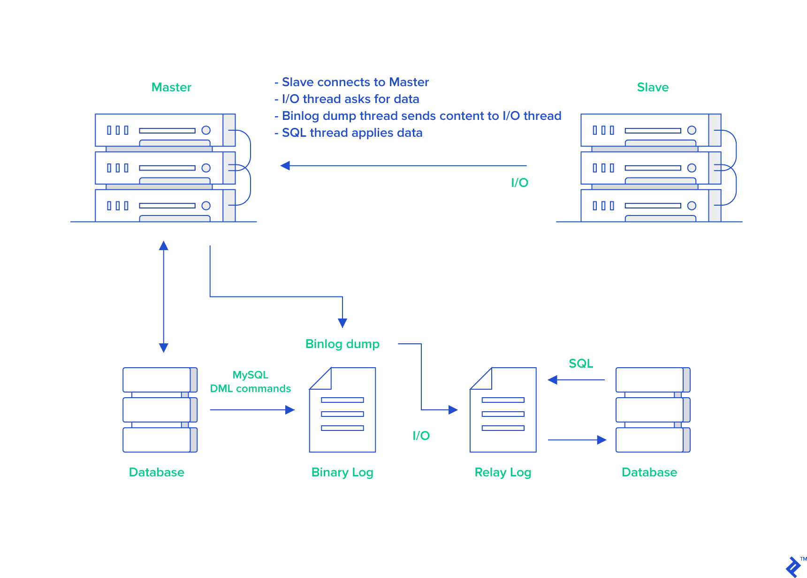

---
title: 分布式
created_at: 2023-03-16T13:28:11.000Z
updated_at: 2024-03-24T08:38:35.000Z
word_count: 1054
---  

分布式系统（Distributed system）：一组电脑，透过网络相互连接传递消息与通信后并协调它们的行为而形成的系统

**CAP 理论**

- 一致性 (Consistency)：所有节点在同一时间具有相同的数据
- 可用性 (Availability)：保证每个请求不管成功或者失败都有响应
- 分区容错性 (Partition tolerance) ：系统中任意信息的丢失或失败不会影响系统的继续运作

**BASE理论**   对 CAP  中 AP 的一个扩展，通过牺牲强一致性来获得可用性

- Basically Available（基本可用）：分布式系统在出现不可预知故障的时候，允许损失部分可用性
- Soft-state（软状态）：允许系统中的数据存在中间状态（CAP 理论中的数据不一致），并认为该中间状态的存在不会影响系统的整体可用性。即允许系统在不同节点的数据副本之间进行数据同步的过程存在延时
- Eventually Consistent（最终一致性）：系统中所有的数据副本，在经过一段时间的同步后，最终能达到一致

分布式 ID

**Snowflake（雪花算法）**     Twitter 开源的分布式 ID 生成算法。Snowflake 由 64 bit 的二进制数字组成

- **第 0 位**： 符号位（标识正负），始终为 0
- **第 1~41 位** ：一共 41 位，用来表示时间戳，单位是毫秒，可以支撑 2 ^41 毫秒（约 69 年）
- **第 42~52 位** ：一共 10 位，一般来说，前 5 位表示机房 ID，后 5 位表示机器 ID（可以根据实际情况调整）。这样就可以区分不同集群/机房的节点。
- **第 53~64 位** ：一共 12 位，用来表示序列号。 序列号为自增值，代表单台机器每毫秒能够产生的最大 ID 数(2^12 = 4096)，也就是说单台机器每毫秒最多可以生成 4096 个 唯一 ID。

优点 ：生成速度比较快、生成的 ID 有序递增、比较灵活（可以简单改造）     缺点 ：依赖时间，当机器时间不对的情况下，可能导致会产生重复 ID

### 高性能

**读写分离**     将对数据库的读写操作分散到不同的数据库节点上。     小幅提升写性能，大幅提升读性能

一主多从，一台主数据库负责写，其他的从数据库负责读。主库和从库之间会进行数据同步，以保证从库中数据的准确性。

主从同步延迟     强制将读请求路由到主库处理：将那些必须获取最新数据的读请求都交给主库处理

主从复制     MySQL Master-Slave Replication on the Same Machine     

**分库分表**

分库：将数据库中的数据分散到不同的数据库上     分表：对单表的数据进行拆分

- 垂直拆分：对数据表列的拆分，把一张列比较多的表拆分为多张表
- 水平拆分：对数据表行的拆分

使用场景

- 单表的数据达到千万级别以上，数据库读写速度比较缓慢（分表）。
- 数据库中的数据占用的空间越来越大，备份时间越来越长（分库）。
- 应用的并发量太大（分库）

### 高可用

**限流**     对请求的速率进行限制，避免瞬时的大量请求击垮软件系统

限流算法

- 固定窗口计数器算法
- 滑动窗口计数器算法
- 漏桶算法
- 令牌桶算法

降级

熔断

### 系统可观测性（Observability）

日志（Logging）：系统中一段时间内发生的离散事件的带时间戳的记录     踪迹（Traces）：一系列因果相关的分布式事件的表示，这些事件捕获系统组件之间的交互     指标（Metrics）

