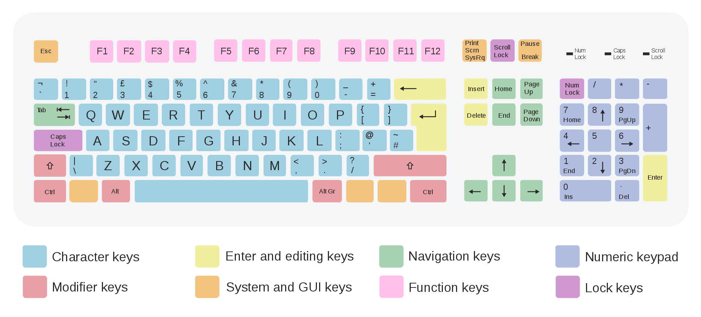

---
title: 善假于键
created_at: 2022-02-02T13:10:07.000Z
updated_at: 2023-11-18T03:32:36.000Z
word_count: 1103
---  
## [Windows 的键盘快捷方式](https://support.microsoft.com/zh-cn/windows/windows-%E7%9A%84%E9%94%AE%E7%9B%98%E5%BF%AB%E6%8D%B7%E6%96%B9%E5%BC%8F-dcc61a57-8ff0-cffe-9796-cb9706c75eec)
> 善用快捷键可以提升工作效率，节省不少时间，让你的操作秀起来

各种[控件](https://zh.wikipedia.org/wiki/%E6%8E%A7%E4%BB%B6)上一般可以通过Alt组合键访问的的**访问键**。     菜单等控件项目上往往带有用下划线标注的**访问键**（Access key）

**QWERTY键盘**     
### - F类
第一排的F类键，共12个，知道几个常用的

| F1 | 显示帮助内容 |
| --- | --- |
| F2 | （批量）重命名 |
| F3 | 搜索文件或文件夹 |
| F5 | 刷新 |
| F11 | 全屏显示 |

记事本中，F5可以一键插入当前的日期和时间。

**Fn键(**Function，功能**)：**一般出现于笔记本键盘左下角的一个键，多用蓝色刻印，与相组合的按键实现的功能在其它键上用同样的颜色表示，大多数笔记本电脑Fn键与ESC键及F1~F12键组合可以实现硬件的调节（声音、亮度等），或补充实现台式机上有而笔记本上省略的按键。

### - Windows键——开始键，带有微软标识图
| Windows + X/I | 菜单/设置 |
| --- | --- |
| Windows + L | 锁屏 |
| Windows + D | 显示/隐藏桌面 |
| Windows + R | 运行 |
| Windows + E | 我的电脑 |
| Windows + 左右键 | 分屏 |
| Windows + 上下键 | 最大/小化窗口 |
| Windows + 加减号 | 屏幕放大/缩小 |
| Windows + Tab | 任务视图 |
| Windows + W | 小组件 |
| Windows + Q/S | 小娜/搜索 |
| Windows + Z | 对齐布局 |
| Windows + V | 剪贴板 |
| Windows + Shift + S | 截图 |

| Windows + H | 启动语音键入 |
| --- | --- |
| Windows + Ctrl + O | 屏幕键盘 |
| Windows + A | 操作中心 |
| Windows + B | 通知区域 |
| Windows + N | 桌面日历及通知 |
| Windows + K/P | 连接/投影 |
| Windows + Ctrl + Q | 快速助手 |

**Windows + 数字键(0~9)**，快速启动锁定在任务栏中的前10个对应的程序     **Windows + Shift + (Ctrl) + 数字键(0~9)，(以管理员身份)再开**

#### · 虚拟桌面
| Windows + Ctrl + D | 添加虚拟桌面 |
| --- | --- |
| Windows + Ctrl + 左右键 | 虚拟桌面切换 |
| Windows + Ctrl + F4 | 关闭你正在使用的虚拟桌面 |

### - Ctrl键——控制键（Control）
| Ctrl + A | 全选 |
| --- | --- |
| Ctrl + D | 删除所选，移至回收站 |
| Ctrl + Y | 恢复操作 |
| Ctrl + S | 保存 |
| Ctrl + Shift + S | 另存为 |
| Ctrl + W | 关闭程序 |
| Ctrl + N | 新建 |
| Ctrl + O | 打开 |
| Ctrl + F | 查找 |

注意：Ctrl+D只是删除所选，移至回收站，而Shift+Delete是文件永久性删除。

#### · 浏览器/对话框
| Ctrl + Tab | 在选项卡中向前移动 |
| --- | --- |
| Ctrl + Shift + Tab | 在选项卡中向后移动 |
| Ctrl + 数字（1–9） | 移动到第 n 个选项卡 |
| Tab | 在选项中向前移动 |
| Shift + Tab | 在选项中向后移动 |

在浏览器中：

- Ctrl + 加减号	缩小/放大网页
- Ctrl + 0	网页上恢复到默认大小

### - Alt键——交替换档键、更改键、替换键（Alternate）
| Alt + P | 显示预览面板。 |
| --- | --- |
| Alt + Enter/双击左键 | 查看属性 |
| Alt + F4 | 关闭当前项目或退出程序 |
| Alt + Tab | 在打开的项目之间切换 |
| Alt + Esc | 以项目打开的顺序循环切换 |

### - Shift键——上档键、换档键，通常印上向上箭头标记，（改变）
| Ctrl + Shift + N | 新建文件夹 |
| --- | --- |
| Ctrl + Shift + T | 恢复关闭网页 |
| Ctrl + Shift + Esc | 任务管理器 |

### - 鼠标 + 键
| Ctrl + 鼠标左键 | 多选文件 |
| --- | --- |
| Ctrl + 拖动文件 | 复制文件 |
| Alt + 拖动文件 | 创建快捷方式 |
| Shift + 鼠标左键 | 连续多选相邻文件 |
| Shift + 拖动文件 | 移动文件 |

### Windows[截屏](https://support.microsoft.com/zh-cn/help/13776/windows-use-snipping-tool-to-capture-screenshots)

- PrintScreen：复制屏幕截图到粘贴板
- Windows + PrintScreen：复制屏幕截图到粘贴板，自动保存到 C:\Users\用户名\Pictures\Screenshots
- Windows + Shift + S：框选屏幕任意区域并复制到粘贴板

### 快捷关机

1. 快捷键**Windows+X**（即打开“快速链接”菜单），再按两次U即可关机。

(U+U是关机，U+R是重启，U+S是睡眠，U+I是注销)

2. 在显示桌面（Windows+D）情况下，按**Alt+F4**键，再回车（Enter）便可关机。
