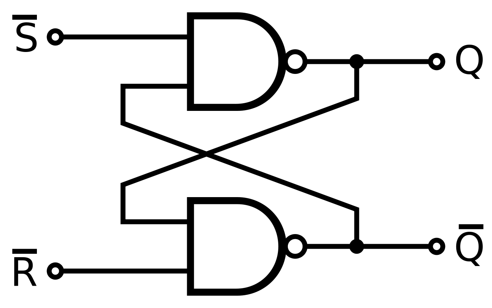
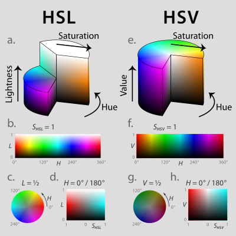

---
title: 编码 & 加密
created_at: 2022-01-31T14:55:11.000Z
updated_at: 2023-01-08T11:31:08.000Z
word_count: 6737
---  

## 数制

numerical system：使用一组[数字](https://zh.wikipedia.org/wiki/%E6%95%B8%E5%AD%97)符号来表示[数](https://zh.wikipedia.org/wiki/%E6%95%B0_(%E6%95%B0%E5%AD%A6))的体系

|       | 基数 | 数码 | 计数规则 | 表达式 |
| --- | --- | --- | --- | --- |
| R进制 | R | 0 ~（R-1） | 逢R进一 |       |

常见进制

- [二进制](https://baike.baidu.com/item/%E4%BA%8C%E8%BF%9B%E5%88%B6/361457)([binary](https://baike.baidu.com/item/binary/3101508))
- [八进制](https://baike.baidu.com/item/%E5%85%AB%E8%BF%9B%E5%88%B6/4230825)([octal](https://baike.baidu.com/item/octal/7221350))
- [十进制](https://baike.baidu.com/item/%E5%8D%81%E8%BF%9B%E5%88%B6/6521392)([decimal](https://baike.baidu.com/item/decimal/8831799))
- [十六进制](https://baike.baidu.com/item/%E5%8D%81%E5%85%AD%E8%BF%9B%E5%88%B6/4162457)(hexadecimal)

**进制转换**     10进制 —> R进制

   - 整数部分：除R取余倒排
   - 小数部分：乘R取整顺排

**有符号二进制数**：第一位为符号位，0正1负

- 原码（符号-数值 sign-magnitude）：+0，-0
- 反码（1's complement）：正数同原码，负数数值取反 （+0，-0）
- 补码（complement）

**锁存器（latch）**     对脉冲电平敏感，在时钟脉冲的电平作用下改变状态 

最简单的锁存器——SR锁存器     设定（Set），重设（Reset）     

触发器（Flip-Flop）     对脉冲边沿敏感，其状态只在时钟脉冲的上升沿或下降沿的瞬间改变 

寄存器（Register）     [中央处理器](https://zh.wikipedia.org/wiki/%E4%B8%AD%E5%A4%AE%E8%99%95%E7%90%86%E5%99%A8)内用来暂存指令、[数据](https://zh.wikipedia.org/wiki/%E6%95%B8%E6%93%9A)和[地址](https://zh.wikipedia.org/wiki/%E5%86%85%E5%AD%98%E5%9C%B0%E5%9D%80)的[电脑存储器](https://zh.wikipedia.org/wiki/%E9%9B%BB%E8%85%A6%E8%A8%98%E6%86%B6%E9%AB%94)。寄存器的存贮容量有限，读写速度非常快

计数器（Counter）     在时钟脉冲（Clock Pulse）激励下，能遍历预先规定好的状态序列的一种寄存器

## 字符编码

**比特（BIT，Binary digit）**：二进制数字中的位，信息量的最小单位。     **字节（Byte）**：数据存储的基本单元，1byte = 8bit     **字符（Character）**：一个信息单位，它是各种文字和符号的统称     **字符集（Character Set）**：某个范围内字符的集合，不同的字符集规定了字符的个数     **字符码（Code Point）**：字符集中每个字符的数字编号     **字符编码（Character Encoding）**：将字符集中的字符码映射为字节流的一种具体实现方案

编码：将字符转换成字节流；解码的过程是将字节流解析为字符

**汉字编码（Chinese character encoding ）**

- **GB2312 （GB0）：1981 由中国国家标准总局发布。共收录了6763个汉字，同时他还兼容 ASCII**
- **GBK：收录了27484个汉字，并有藏文、蒙文、维吾尔文等主要的少数民族文字。兼容GB2312、BIG5（繁体编码），对于英文字符用1byte表示，汉字用2byte来标识。**
- GB18030-2000
- **GB 18030-2005：兼容GBK ，共收录汉字70244个，包含日韩汉字**

**Unicode （Universal Multiple-Octet Coded Character Set，UCS）**：为世界上每一种语言的每一个字符定义了一个唯一的字符码，使用十六进制数字表示，数字前面加上前缀 U

**UTF-8（Unicode Transformation Format）**：Unicode 的一种实现方式，广泛应用于互联网，它是一种变长的字符编码，可以根据具体情况用1-4个字节来表示一个字符

| **Unicode/UCS-4** | bit数 | **UTF-8** | byte数 | 备注 |
| --- | --- | --- | --- | --- |
| 0000 ~     007F | 0~7 | **0**XXX XXXX | 1 |       |
| 0080 ~     07FF | 8~11 | **110**X XXXX     **10X**X XXXX | 2 |       |
| 0800 ~     FFFF | 12~16 | **1110 **XXXX     **10XX **XXXX     **10XX **XXXX | 3 | 基本定义范围：0~FFFF |
| 1 0000 ~     1F FFFF | 17~21 | **1111 0**XXX     **10XX X**XXX     **10XX X**XXX     **10XX X**XXX | 4 | Unicode6.1定义范围：0~10 FFFF |
| 20 0000 ~     3FF FFFF | 22~26 | **1111 10**XX     **10XX XX**XX     **10XX XX**XX     **10XX XX**XX     **10XX XX**XX | 5 |       |
| 400 0000 ~     7FFF FFFF | 27~31 | **1111 110**X     **10XX XXX**X     **10XX XXX**X     **10XX XXX**X     **10XX XXX**X     **10XX XXX**X | 6 |  |

**UTF-8 Signature**	带有BOM(Byte Order Mark，字节流标记)， 让应用程序识别所用的编码

**UTF-16：**相比UTF-8，大部分字符都以固定长度的字节（2Byte）储存，但无法兼容于ASCII编码

| 16进制编码范围 | UTF-16表示方法(二进制) | 10进制码范围 | Byte |
| --- | --- | --- | --- |
| 0000 0000---0000 FFFF | xxxxxxxx xxxxxxxx | 0-65535 | 2 |
| 0001 0000---0010 FFFF | 110110yyyyyyyyyy110111xxxxxxxxxx | 65536-1114111 | 4 |

**字节序 (Byte Order)**

常见的 x86/x64, ARM 等处理器架构使用小端序（Little-endian）

| 编码 | 大端字节序标记 | 小端字节序标记 |
| --- | --- | --- |
| UTF-8 | EF BB BF | EF BB BF |
| UTF-16 | FE FF | FF FE |
| UTF-32 | 00 00 FE FF | FF FE 00 00 |

**字素(Grapheme)**：文本在书写时最小的单位     **字素簇(Grapheme Cluster)**：多个字符序列组合。如字母 é 可以用字母 e (U+0065) 加上重音符(U+0301) 组合而成

Collation ：字符间的排序规则

### Base64
一种基于64个可打印字符来表示二进制数据的方法，用于传输8Bit字节码的编码方式

原理：将每3个8Bit的字节转换为4个6Bit的字节（3*8 = 4*6 = 24），然后把6Bit再添两位高位0，组成四个8Bit的字节。位数不足用0补全，再用=号补满4个字节。转换后的字符串理论上将要比原来的长1/3。

特点

- 具有不可读性
- 可以将任意的二进制数据进行Base64编码。
- 数据加密之后，数据量会变大1/3左右。
- 编码后有个非常显著的特点，末尾有个=号。
- 可进行反向解密

The Base64 Alphabet

| **索引** | **对应字符** | **索引** | **对应字符** | **索引** | **对应字符** | **索引** | **对应字符** |
| --- | --- | --- | --- | --- | --- | --- | --- |
| 0 | **A** | 17 | **R** | 34 | **i** | 51 | **z** |
| 1 | **B** | 18 | **S** | 35 | **j** | 52 | **0** |
| 2 | **C** | 19 | **T** | 36 | **k** | 53 | **1** |
| 3 | **D** | 20 | **U** | 37 | **l** | 54 | **2** |
| 4 | **E** | 21 | **V** | 38 | **m** | 55 | **3** |
| 5 | **F** | 22 | **W** | 39 | **n** | 56 | **4** |
| 6 | **G** | 23 | **X** | 40 | **o** | 57 | **5** |
| 7 | **H** | 24 | **Y** | 41 | **p** | 58 | **6** |
| 8 | **I** | 25 | **Z** | 42 | **q** | 59 | **7** |
| 9 | **J** | 26 | **a** | 43 | **r** | 60 | **8** |
| 10 | **K** | 27 | **b** | 44 | **s** | 61 | **9** |
| 11 | **L** | 28 | **c** | 45 | **t** | 62 | **+** |
| 12 | **M** | 29 | **d** | 46 | **u** | 63 | **/** |
| 13 | **N** | 30 | **e** | 47 | **v** |       |       |
| 14 | **O** | 31 | **f** | 48 | **w** |       |       |
| 15 | **P** | 32 | **g** | 49 | **x** |       |       |
| 16 | **Q** | 33 | **h** | 50 | **y** |       |       |

**示例**     s13	（Ascii 115 49 51 [01110011 00110001 00110011]）     czEz （Base64 28 51 4 51 [**00**011100 **00**110011 **00**000100 **00**110011]）

### UUID

**通用唯一识别码（Universally Unique Identifier）**一种软件建构的标准，由一组32位数的16进制数字(128位)所构成，理论总数为16^32

原理：基于当前时间、计数器（counter）和硬件标识（MAC）等数据计算生成的。UUID没有集中管理机构，可以被任何人独立创建，并按需发布。

标准型式包含32个[16进制](https://wiwiki.kfd.me/wiki/16%E9%80%B2%E4%BD%8D)数字，以[连字号](https://wiwiki.kfd.me/wiki/%E8%BF%9E%E5%AD%97%E5%8F%B7)分为五段，形式为 8-4-4-4-12 的32个字符     550e8400-e29b-41d4-a716-446655440000

- 版本1 - UUID 是根据时间和节点 ID（通常是MAC地址）生成；
- 版本2 - UUID是根据标识符（通常是组或用户ID）、时间和节点ID生成；
- 版本3、版本5 - 确定性UUID 通过散列（hashing）名字空间（namespace）标识符和名称生成；
- 版本4 - UUID 使用[随机性](https://zh.wikipedia.org/wiki/%E9%9A%8F%E6%9C%BA%E6%80%A7)或[伪随机性](https://zh.wikipedia.org/wiki/%E4%BC%AA%E9%9A%8F%E6%9C%BA%E6%80%A7)生成。

全局唯一标识符（GUID，Globally Unique Identifier）：微软对UUID标准的实现

## ASCII
**American Standard Code for Information Interchange**

| 二进制 | 十进制 | 十六进制 | 字符/缩写 | 解释 |
| --- | --- | --- | --- | --- |
| 00000000 | 0 | 00 | NUL (NULL) | 空字符 |
| 00000001 | 1 | 01 | SOH (Start Of Headling) | 标题开始 |
| 00000010 | 2 | 02 | STX (Start Of Text) | 正文开始 |
| 00000011 | 3 | 03 | ETX (End Of Text) | 正文结束 |
| 00000100 | 4 | 04 | EOT (End Of Transmission) | 传输结束 |
| 00000101 | 5 | 05 | ENQ (Enquiry) | 请求 |
| 00000110 | 6 | 06 | ACK (Acknowledge) | 回应/响应/收到通知 |
| 00000111 | 7 | 07 | BEL (Bell) | 响铃 |
| 00001000 | 8 | 08 | BS (Backspace) | 退格 |
| 00001001 | 9 | 09 | HT (Horizontal Tab) | 水平制表符 |
| 00001010 | 10 | 0A | LF/NL(Line Feed/New Line) | 换行键 |
| 00001011 | 11 | 0B | VT (Vertical Tab) | 垂直制表符 |
| 00001100 | 12 | 0C | FF/NP (Form Feed/New Page) | 换页键 |
| 00001101 | 13 | 0D | CR (Carriage Return) | 回车键 |
| 00001110 | 14 | 0E | SO (Shift Out) | 不用切换 |
| 00001111 | 15 | 0F | SI (Shift In) | 启用切换 |
| 00010000 | 16 | 10 | DLE (Data Link Escape) | 数据链路转义 |
| 00010001 | 17 | 11 | DC1/XON     (Device Control 1/Transmission On) | 设备控制1/传输开始 |
| 00010010 | 18 | 12 | DC2 (Device Control 2) | 设备控制2 |
| 00010011 | 19 | 13 | DC3/XOFF     (Device Control 3/Transmission Off) | 设备控制3/传输中断 |
| 00010100 | 20 | 14 | DC4 (Device Control 4) | 设备控制4 |
| 00010101 | 21 | 15 | NAK (Negative Acknowledge) | 无响应/非正常响应/拒绝接收 |
| 00010110 | 22 | 16 | SYN (Synchronous Idle) | 同步空闲 |
| 00010111 | 23 | 17 | ETB (End of Transmission Block) | 传输块结束/块传输终止 |
| 00011000 | 24 | 18 | CAN (Cancel) | 取消 |
| 00011001 | 25 | 19 | EM (End of Medium) | 已到介质末端/介质存储已满/介质中断 |
| 00011010 | 26 | 1A | SUB (Substitute) | 替补/替换 |
| 00011011 | 27 | 1B | ESC (Escape) | 逃离/取消 |
| 00011100 | 28 | 1C | FS (File Separator) | 文件分割符 |
| 00011101 | 29 | 1D | GS (Group Separator) | 组分隔符/分组符 |
| 00011110 | 30 | 1E | RS (Record Separator) | 记录分离符 |
| 00011111 | 31 | 1F | US (Unit Separator) | 单元分隔符 |
| 00100000 | 32 | 20 | (Space) | 空格 |
| 00100001 | 33 | 21 | ! |   |
| 00100010 | 34 | 22 | " |   |
| 00100011 | 35 | 23 | # |   |
| 00100100 | 36 | 24 | $ |   |
| 00100101 | 37 | 25 | % |   |
| 00100110 | 38 | 26 | & |   |
| 00100111 | 39 | 27 | ' |   |
| 00101000 | 40 | 28 | ( |   |
| 00101001 | 41 | 29 | ) |   |
| 00101010 | 42 | 2A | * |   |
| 00101011 | 43 | 2B | + |   |
| 00101100 | 44 | 2C | , |   |
| 00101101 | 45 | 2D | - |   |
| 00101110 | 46 | 2E | . |   |
| 00101111 | 47 | 2F | / |   |
| 00110000 | 48 | 30 | 0 |   |
| 00110001 | 49 | 31 | 1 |   |
| 00110010 | 50 | 32 | 2 |   |
| 00110011 | 51 | 33 | 3 |   |
| 00110100 | 52 | 34 | 4 |   |
| 00110101 | 53 | 35 | 5 |   |
| 00110110 | 54 | 36 | 6 |   |
| 00110111 | 55 | 37 | 7 |   |
| 00111000 | 56 | 38 | 8 |   |
| 00111001 | 57 | 39 | 9 |   |
| 00111010 | 58 | 3A | : |   |
| 00111011 | 59 | 3B | ; |   |
| 00111100 | 60 | 3C | < |   |
| 00111101 | 61 | 3D | = |   |
| 00111110 | 62 | 3E | > |   |
| 00111111 | 63 | 3F | ? |   |
| 01000000 | 64 | 40 | @ |   |
| 01000001 | 65 | 41 | A |   |
| 01000010 | 66 | 42 | B |   |
| 01000011 | 67 | 43 | C |   |
| 01000100 | 68 | 44 | D |   |
| 01000101 | 69 | 45 | E |   |
| 01000110 | 70 | 46 | F |   |
| 01000111 | 71 | 47 | G |   |
| 01001000 | 72 | 48 | H |   |
| 01001001 | 73 | 49 | I |   |
| 01001010 | 74 | 4A | J |   |
| 01001011 | 75 | 4B | K |   |
| 01001100 | 76 | 4C | L |   |
| 01001101 | 77 | 4D | M |   |
| 01001110 | 78 | 4E | N |   |
| 01001111 | 79 | 4F | O |   |
| 01010000 | 80 | 50 | P |   |
| 01010001 | 81 | 51 | Q |   |
| 01010010 | 82 | 52 | R |   |
| 01010011 | 83 | 53 | S |   |
| 01010100 | 84 | 54 | T |   |
| 01010101 | 85 | 55 | U |   |
| 01010110 | 86 | 56 | V |   |
| 01010111 | 87 | 57 | W |   |
| 01011000 | 88 | 58 | X |   |
| 01011001 | 89 | 59 | Y |   |
| 01011010 | 90 | 5A | Z |   |
| 01011011 | 91 | 5B | [ |   |
| 01011100 | 92 | 5C | \\ |   |
| 01011101 | 93 | 5D | ] |   |
| 01011110 | 94 | 5E | ^ |   |
| 01011111 | 95 | 5F | _ |   |
| 01100000 | 96 | 60 | ` |   |
| 01100001 | 97 | 61 | a |   |
| 01100010 | 98 | 62 | b |   |
| 01100011 | 99 | 63 | c |   |
| 01100100 | 100 | 64 | d |   |
| 01100101 | 101 | 65 | e |   |
| 01100110 | 102 | 66 | f |   |
| 01100111 | 103 | 67 | g |   |
| 01101000 | 104 | 68 | h |   |
| 01101001 | 105 | 69 | i |   |
| 01101010 | 106 | 6A | j |   |
| 01101011 | 107 | 6B | k |   |
| 01101100 | 108 | 6C | l |   |
| 01101101 | 109 | 6D | m |   |
| 01101110 | 110 | 6E | n |   |
| 01101111 | 111 | 6F | o |   |
| 01110000 | 112 | 70 | p |   |
| 01110001 | 113 | 71 | q |   |
| 01110010 | 114 | 72 | r |   |
| 01110011 | 115 | 73 | s |   |
| 01110100 | 116 | 74 | t |   |
| 01110101 | 117 | 75 | u |   |
| 01110110 | 118 | 76 | v |   |
| 01110111 | 119 | 77 | w |   |
| 01111000 | 120 | 78 | x |   |
| 01111001 | 121 | 79 | y |   |
| 01111010 | 122 | 7A | z |   |
| 01111011 | 123 | 7B | { |   |
| 01111100 | 124 | 7C | &#124; |   |
| 01111101 | 125 | 7D | } |   |
| 01111110 | 126 | 7E | ~ |   |
| 01111111 | 127 | 7F | DEL (Delete) | 删除 |

## 加密算法 (Encryption algorithm)

**密码学**（Cryptography）分为古典密码学和现代密码学。

简单的加密设计： 用密钥对原文做  异或，置换，代换，移位

### 对称加密
**对称密钥算法**（**Symmetric-key algorithm**）：加密和解密时使用**相同**的密钥，或用两个可以简单地相互推算的密钥。     特性：高速的加解密，使用长密钥时的难破解性

**DES**     数据加密标准（Data Encryption Standard），基于使用56位密钥的对称算法。

**费斯妥网络**（Feistel network）用于构造[分组密码](https://zh.wikipedia.org/wiki/%E5%88%86%E7%BB%84%E5%AF%86%E7%A0%81)的对称结构

数据块被分成两个32位的半块，并被分别处理     

3DES（Triple DES）：基于DES，对一块数据用三个不同的密钥进行三次加密，强度更高。

**AES**     高级加密标准（Advanced Encryption Standard），亦称Rijndael加密法     速度快，安全级别高

结构：代换-置换网络（Substitution-Permutation Network，SPN）

- 使用[明文](https://zh.wikipedia.org/wiki/%E6%98%8E%E6%96%87)[块](https://zh.wikipedia.org/wiki/%E5%9D%97_(%E6%95%B0%E6%8D%AE%E5%AD%98%E5%82%A8))和[密钥](https://zh.wikipedia.org/wiki/%E5%AF%86%E9%92%A5)[块](https://zh.wikipedia.org/wiki/%E5%9D%97_(%E6%95%B0%E6%8D%AE%E5%AD%98%E5%82%A8))作为输入，并通过交错的若干“轮”（或“层”）[代换](https://zh.wikipedia.org/wiki/%E6%9B%BF%E6%8D%A2%E5%BC%8F%E5%AF%86%E7%A0%81)操作和[置换](https://zh.wikipedia.org/wiki/%E7%BD%AE%E6%8D%A2)操作产生[密文](https://zh.wikipedia.org/wiki/%E5%AF%86%E6%96%87)[块](https://zh.wikipedia.org/wiki/%E5%9D%97_(%E6%95%B0%E6%8D%AE%E5%AD%98%E5%82%A8))。代换（Substitution）和置换（Permutation）分别被称作S盒（替换盒，S-boxes）和P盒（排列盒，P-boxes）。

步骤：     SubBytes：矩阵中各字节被固定的8位查找表中对应的特定字节所替换     

| 名称 | 密钥长度 | 运算速度 | 安全性 | 资源消耗 |
| --- | --- | --- | --- | --- |
| DES | 56位 | 较快 | 低 | 中 |
| 3DES | 112位或168位 | 慢 | 中 | 高 |
| AES | 128、192、256位 | 快 | 高 | 低 |

#### 分组加密
**分块加密**（**Block cipher**），又称**块密码**，是一种[对称密钥算法](https://zh.wikipedia.org/wiki/%E5%AF%B9%E7%A7%B0%E5%AF%86%E9%92%A5%E7%AE%97%E6%B3%95)。它将明文分成多个等长的模块（block），使用确定的算法和[对称密钥](https://zh.wikipedia.org/wiki/%E5%AF%B9%E7%A7%B0%E5%AF%86%E9%92%A5)对每组分别加密解密。

[初始化向量](https://zh.wikipedia.org/wiki/%E5%88%9D%E5%A7%8B%E5%8C%96%E5%90%91%E9%87%8F)（IV，Initialization Vector）是许多任务作模式中用于将加密随机化的一个位块，由此即使同样的明文被多次加密也会产生不同的密文，避免了较慢的重新产生密钥的过程。

**工作模式**（mode of operation）允许使用同一个分组密码[密钥](https://zh.wikipedia.org/wiki/%E5%AF%86%E9%92%A5)对多于一块的数据进行加密，并保证其安全性

- **电子密码本**（Electronic codebook，ECB）模式：需要加密的消息按照块密码的块大小被分为数个块，并对每个块进行独立加密

- **密码分组链接**（CBC，Cipher-block chaining）模式：每个明文块先与前一个密文块进行异或后，再进行加密

- **填充密码块链接**（**PCBC**，Propagating cipher-block chaining）或称为**明文密码块链接**（Plaintext cipher-block chaining）：一种可以使密文中的微小更改在解密时导致明文大部分错误的模式，并在加密的时候也具有同样的特性。

- **密文反馈**（CFB，Cipher feedback）模式类似于CBC，可以将块密码变为自同步的[流密码](https://zh.wikipedia.org/wiki/%E6%B5%81%E5%AF%86%E7%A0%81)

- **输出反馈**模式（Output feedback, OFB）：将块密码变成同步的流密码。它产生[密钥流](https://zh.wikipedia.org/wiki/%E5%AF%86%E9%92%A5%E6%B5%81)的块，然后将其与明文块进行异或，得到密文。

- CTR模式（Counter mode，CM）：将[块密码](https://zh.wikipedia.org/wiki/%E5%A1%8A%E5%AF%86%E7%A2%BC)变为[流密码](https://zh.wikipedia.org/wiki/%E6%B5%81%E5%AF%86%E7%A0%81)。它通过递增一个加密计数器以产生连续的密钥流，其中，计数器可以是任意保证长时间不产生重复输出的函数

### 非对称加密
公开密钥密码学（Public-key cryptography）也称非对称式密码学（Asymmetric cryptography）

- **公钥**(public key，**公开密钥**)，用作加密
- **私钥**  (private key，**私有密钥**)，用作解密。

     常用的公钥加密

- RSA：由 RSA 公司发明的一个支持变长密钥的公共密钥算法，需要加密的文件块的长度也是可变的
- DSA（Digital Signature Algorithm，数字签名算法）：一种标准的 DSS（数字签名标准）
- ECC（Elliptic Curves Cryptography）：椭圆曲线密码编码学

| 名称 | 成熟度 | 安全性(取决于密钥长度) | 运算速度 | 资源消耗 |
| --- | --- | --- | --- | --- |
| RSA | 高 | 高 | 慢 | 高 |
| DSA | 高 | 高 | 慢 | 只能用于数字签名 |
| ECC | 低 | 高 | 快 | 低(计算量小,存储空间占用小,带宽要求低) |

| 名称 | 密钥管理 | 安全性 | 速度 |
| --- | --- | --- | --- |
| 对称算法 | 比较难，不适合互联网，一般用于内部系统 | 中 | 很快，适合大数据量的加解密处理 |
| 非对称算法 | 密钥容易管理 | 高 | 慢，适合小数据量加解密或数据签名 |

**迪菲-赫尔曼密钥交换**（Diffie–Hellman key exchange） 是一种[安全协议](https://zh.wikipedia.org/wiki/%E5%AE%89%E5%85%A8%E5%8D%8F%E8%AE%AE)。它可以让双方在完全没有对方任何预先信息的条件下通过不安全信道创建起一个密钥。这个密钥可以在后续的通讯中作为[对称密钥](https://zh.wikipedia.org/wiki/%E5%AF%B9%E7%A7%B0%E5%AF%86%E9%92%A5)来加密通讯内容。     

### Hash算法
**散列函数**（Hash function）又称**散列算法**、**哈希函数**，一种单向算法，可以从任何一种数据中创建小的数字“指纹”的方法。

- 消息或数据压缩成摘要，使得数据量变小，将数据的格式固定下来
- 通常用一个短的随机字母和数字组成的字符串来代表
- 常用在不可还原的密码存储、信息完整性校验等

**MD5消息摘要算法（Message Digest Algorithm 5）**：RSA数据安全公司开发的一种单向散列算法，非可逆，相同的明文产生相同的密文。可以产生出一个128位（16字节）的散列值（hash value），用于确保信息传输完整一致。

**SHA（Secure Hash Algorithm，安全散列算法）**     一个[密码散列函数](https://baike.baidu.com/item/%E5%AF%86%E7%A0%81%E6%95%A3%E5%88%97%E5%87%BD%E6%95%B0)家族，包括[SHA-1](https://baike.baidu.com/item/SHA-1)、SHA-2（SHA-224、SHA-256、SHA-384、SHA-512），由[美国国家安全局](https://baike.baidu.com/item/%E7%BE%8E%E5%9B%BD%E5%9B%BD%E5%AE%B6%E5%AE%89%E5%85%A8%E5%B1%80)（NSA）所设计，并由美国国家标准与技术研究院（NIST）发布；是[FIPS](https://baike.baidu.com/item/FIPS)（联邦数据处理标准）所认证的安全[散列算法](https://baike.baidu.com/item/%E6%95%A3%E5%88%97%E7%AE%97%E6%B3%95)。能计算出一个数字消息所对应到的，长度固定的字符串（又称消息摘要）的算法。且若输入的消息不同，它们对应到不同字符串的机率很高。

SHA-1可以生成一个被称为消息摘要的160[位](https://baike.baidu.com/item/%E4%BD%8D)（20[字节](https://baike.baidu.com/item/%E5%AD%97%E8%8A%82)）散列值，散列值通常的呈现形式为40个[十六进制](https://baike.baidu.com/item/%E5%8D%81%E5%85%AD%E8%BF%9B%E5%88%B6/4162457)数。     SHA-3(Keccak) 使用[海绵函数](https://zh.wikipedia.org/wiki/%E6%B5%B7%E7%B6%BF%E5%87%BD%E6%95%B8)，此函数会将资料与初始的内部状态做XOR运算，这是无可避免可置换的(inevitably permuted)

| 算法及其变体 |  | 输出长度     (位) | 内部状态大小     (位) | 块大小     (位) | 最大消息长度     (位) | 循环 | 操作 | 安全性     (位) | 示例的性能     ([MiB](https://zh.wikipedia.org/wiki/Mebibyte)/s) |
| --- | --- | --- | --- | --- | --- | --- | --- | --- | --- |
| [MD5](https://zh.wikipedia.org/wiki/MD5)

(作为参考) |  | 128 | 128     (4 × 32) | 512 | 264 − 1 | 64 | 按位与, 按位异或, 循环移位, 填充(求模 232), 按位或 | <18     (已发现碰撞) | 335 |
| [SHA-0](https://zh.wikipedia.org/wiki/SHA-0) |  | 160 | 160     (5 × 32) | 512 | 264 − 1 | 80 | 按位与, 按位异或, 循环移位, 填充(求模 232),按位或 | <34     (已发现碰撞) | - |
| [SHA-1](https://zh.wikipedia.org/wiki/SHA-1) |  | 160 | 160     (5 × 32) | 512 | 264 − 1 | 80 |  | <63     (已发现碰撞) | 192 |
| [SHA-2](https://zh.wikipedia.org/wiki/SHA-2) | _SHA-224_     _SHA-256_ | 224     256 | 256     (8 × 32) | 512 | 264 − 1 | 64 | 按位与, 按位异或, 循环移位, 填充(求模 232), 按位或, 移位 | 是     112/128 | 139 |
|  | _SHA-384_     _SHA-512_     _SHA-512/224_     _SHA-512/256_ | 384     512     224     256 | 512     (8 × 64) | 1024 | 2128 − 1 | 80 | 按位与, 按位异或, 循环移位, 填充(求模 264), 按位或, 移位 | 是     192/256/112/128 | 154 |
| **SHA-3** | _SHA3-224_     _SHA3-256_     _SHA3-384_     _SHA3-512_ | 224     256     384     512 | 1600     (5 × 5 × 64) | 1152     1088     832     576 | 无限制 | 24 | 按位与, 按位异或, 循环移位, 取反 | 是     112/128/192/256 | - |
|  | _SHAKE128_     _SHAKE256_ | _d_ (可变长)     _d_ (可变长) |  | 1344     1088 |  |  |  | 是     min (_d_/2, 128)     min (_d_/2, 256) | - |

**攻击方法**

- **原像攻击**（Preimage attack）在[密码学](https://zh.wikipedia.org/wiki/%E5%AF%86%E7%A0%81%E5%AD%A6)中是一种破译手段，用于在[密码散列函数](https://zh.wikipedia.org/wiki/%E5%AF%86%E7%A2%BC%E9%9B%9C%E6%B9%8A%E5%87%BD%E6%95%B8)上寻找含有特定哈希值的消息。
- **生日攻击**是一种[密码学](https://zh.wikipedia.org/wiki/%E5%AF%86%E7%A0%81%E5%AD%A6)[攻击手段](https://zh.wikipedia.org/wiki/%E5%AF%86%E7%A0%81%E5%88%86%E6%9E%90)，所利用的是[概率论](https://zh.wikipedia.org/wiki/%E6%A6%82%E7%8E%87%E8%AE%BA)中[生日问题](https://zh.wikipedia.org/wiki/%E7%94%9F%E6%97%A5%E5%95%8F%E9%A1%8C)的[数学](https://zh.wikipedia.org/wiki/%E6%95%B0%E5%AD%A6)原理。这种攻击手段可用于滥用两个或多个集团之间的通信。此攻击依赖于在随机攻击中的高[碰撞](https://zh.wikipedia.org/wiki/%E7%A2%B0%E6%92%9E_(%E8%AE%A1%E7%AE%97%E6%9C%BA%E7%A7%91%E5%AD%A6))概率和固定置换次数（[鸽巢原理](https://zh.wikipedia.org/wiki/%E9%B4%BF%E5%B7%A2%E5%8E%9F%E7%90%86)）。
- **长度扩展攻击（Length extension attacks）**是指一种针对特定加密[散列函数](https://zh.wikipedia.org/wiki/%E6%95%A3%E5%88%97%E5%87%BD%E6%95%B0)的攻击手段，攻击者可以利用**H**（消息1）和消息1的长度，不知道消息1内容的情形下，将攻击者控制的消息2计算出**H**（消息1 ‖ 消息2）

### 消息认证码
MAC（Message authentication code）：经过特定算法后产生的一小段信息，检查某段消息的**完整性**，以及作**身份验证**。     

**散列消息认证码**（Hash-based message authentication code，HMAC），是一种通过特别计算方式之后产生的[消息认证码](https://zh.wikipedia.org/wiki/%E8%A8%8A%E6%81%AF%E9%91%91%E5%88%A5%E7%A2%BC)（MAC），使用[密码散列函数](https://zh.wikipedia.org/wiki/%E5%AF%86%E7%A2%BC%E9%9B%9C%E6%B9%8A%E5%87%BD%E6%95%B8)，同时结合一个加密密钥     

- H为密码散列函数（如SHA家族）
- K为密钥（secret key）
- m是要认证的消息
- K'是从原始密钥K导出的另一个秘密密钥（如果K短于散列函数的输入块大小，则向右填充（Padding）零；如果比该块大小更长，则对K进行散列）
- || 代表串接
- ⊕ 代表异或（XOR）
- opad 是外部填充（0x5c5c5c…5c5c，一段十六进制常量）
- ipad 是内部填充（0x363636…3636，一段十六进制常量）

### 数字签名
**公钥数字签名**（**Digital Signature**）是一种功能类似写在[纸](https://zh.wikipedia.org/wiki/%E7%BA%B8)上的普通[签名](https://zh.wikipedia.org/wiki/%E7%AD%BE%E5%90%8D)，但使用了[公钥加密](https://zh.wikipedia.org/wiki/%E5%85%AC%E9%92%A5%E5%8A%A0%E5%AF%86)领域的技术，以用于鉴别数字信息的方法。 
> 使用私钥加密（生成签名），公钥解密（验证签名）

具有完整性、认证、不可抵赖性     

CA（Certificate Authority，证书颁发机构）：负责发放和管理数字证书的权威机构，并作为电子商务交易中受信任的第三方，承担公钥体系中公钥的合法性检验的责任。

证书是由证书签证机关（CA）签发的对用户的公钥的认证。
> 证书的内容：电子签证机关的信息、公钥用户信息、公钥、权威机构的签字和有效期等。证书的格式和验证方法普遍遵循[X.509](https://zh.wikipedia.org/wiki/X.509)国际标准。 

- 加密：CA认证将文字转换成不能直接阅读的形式（即密文）的过程称为加密。
- 解密：将密文转换成能够直接阅读的文字（即明文）的过程称为解密。

     **证书吊销列表**（**Certificate revocation list**，**CRL**）是尚未到期就被[证书颁发机构](https://zh.wikipedia.org/wiki/%E8%AF%81%E4%B9%A6%E9%A2%81%E5%8F%91%E6%9C%BA%E6%9E%84)吊销的[数字证书](https://zh.wikipedia.org/wiki/%E6%95%B0%E5%AD%97%E8%AF%81%E4%B9%A6)的名单。     **在线证书状态协议**（**O**nline **C**ertificate **S**tatus **P**rotocol，**OCSP**）是一个用于获取[X.509](https://zh.wikipedia.org/wiki/X.509)[数字证书](https://zh.wikipedia.org/wiki/%E6%95%B0%E5%AD%97%E8%AF%81%E4%B9%A6)撤销状态的[网际协议](https://zh.wikipedia.org/wiki/%E7%BD%91%E9%99%85%E5%8D%8F%E8%AE%AE)，在[RFC 6960](https://tools.ietf.org/html/rfc6960)中定义，作为[证书吊销列表](https://zh.wikipedia.org/wiki/%E8%AF%81%E4%B9%A6%E5%90%8A%E9%94%80%E5%88%97%E8%A1%A8)（CRL）的替代品解决了在[公开密钥基础建设](https://zh.wikipedia.org/wiki/%E5%85%AC%E9%96%8B%E9%87%91%E9%91%B0%E8%AA%8D%E8%AD%89)（PKI）中使用证书吊销列表而带来的多个问题

公钥基础设施（Public Key Infrastructure，PKI）：一组由硬件、软件、参与者、管理政策与流程组成的基础架构，其目的在于创造、管理、分配、使用、存储以及撤销[数字证书](https://zh.wikipedia.org/wiki/%E6%95%B8%E4%BD%8D%E6%86%91%E8%AD%89)。

**自签名证书**（self-signed certificate）是用自己的私钥签署的[数字证书](https://zh.wikipedia.org/wiki/%E6%95%B0%E5%AD%97%E8%AF%81%E4%B9%A6)     **根证书**（**root certificate**）是属于根[证书颁发机构](https://zh.wikipedia.org/wiki/%E6%95%B0%E5%AD%97%E8%AF%81%E4%B9%A6%E8%AE%A4%E8%AF%81%E6%9C%BA%E6%9E%84)（CA）的公钥证书，是在[公开密钥基础建设](https://zh.wikipedia.org/wiki/%E5%85%AC%E9%96%8B%E9%87%91%E9%91%B0%E5%9F%BA%E7%A4%8E%E5%BB%BA%E8%A8%AD)中，信任链的起点

## Time

**UTC**（英语：**C**oordinated **U**niversal **T**ime，法语：**T**emps **U**niversel **C**oordonné，**协调世界时**）是最主要的世界时间标准，其以[原子时](https://zh.wikipedia.org/wiki/%E5%8E%9F%E5%AD%90%E6%97%B6)秒长为基础，在时刻上尽量接近于[格林威治标准时间](https://zh.wikipedia.org/wiki/%E6%A0%BC%E6%9E%97%E5%A8%81%E6%B2%BB%E6%A0%87%E5%87%86%E6%97%B6%E9%97%B4)

**GMT**（**G**reenwich **M**ean **T**ime，**格林尼治平均时间**）：位于[英国](https://zh.wikipedia.org/wiki/%E8%8B%B1%E5%9C%8B)[伦敦](https://zh.wikipedia.org/wiki/%E5%80%AB%E6%95%A6)郊区的[皇家格林尼治天文台](https://zh.wikipedia.org/wiki/%E6%A0%BC%E6%9E%97%E5%B0%BC%E6%B2%BB%E5%A4%A9%E6%96%87%E5%8F%B0)当地的[平太阳时](https://zh.wikipedia.org/wiki/%E5%B9%B3%E5%A4%AA%E9%98%B3)，[本初子午线](https://zh.wikipedia.org/wiki/%E6%9C%AC%E5%88%9D%E5%AD%90%E5%8D%88%E7%B7%9A)被定义为通过那里的[经线](https://zh.wikipedia.org/wiki/%E7%B6%93%E7%B7%9A)。

常用日期/时间格式表示

- yyyy = 年份
- mm = 月份
- dd = 日期
- MMM = 月份三字母缩写
- mmmm = 月份全名
- hr = 小时
- mi = 分钟
- se = 秒钟

**国际标准**[ISO 8601](https://zh.wikipedia.org/wiki/ISO_8601)**：yyyy-mm-dd，hr:mi:se（24小时制）**     [中国大陆](https://zh.wikipedia.org/wiki/%E4%B8%AD%E5%9B%BD%E5%A4%A7%E9%99%86)：yyyy年m月d日；hr时mi分se秒；hr:mi:se（12/24小时制） 东八区	UTC+8

Unix时间戳（Unix epoch, Unix time, POSIX time 或 Unix timestamp）[UNIX](https://zh.wikipedia.org/wiki/UNIX)或[类UNIX](https://zh.wikipedia.org/wiki/%E9%A1%9EUNIX)系统使用的时间表示方式：从[UTC](https://zh.wikipedia.org/wiki/%E5%8D%94%E8%AA%BF%E4%B8%96%E7%95%8C%E6%99%82)1970年1月1日0时0分0秒起至现在的总秒数，不考虑[闰秒](https://zh.wikipedia.org/wiki/%E9%96%8F%E7%A7%92)     UNIX时间戳的ISO 8601规范为 ：1970-01-01T00:00:00Z.

## Color
**颜色**（Color，**色彩**）是[眼](https://zh.wikipedia.org/wiki/%E7%9C%BC)、[脑](https://zh.wikipedia.org/wiki/%E8%84%91)和我们的生活经验对[光](https://zh.wikipedia.org/wiki/%E5%85%89)的颜色类别描述的[视觉感知](https://zh.wikipedia.org/wiki/%E5%BD%A9%E8%89%B2%E8%A7%86%E8%A7%89)特征。这种对颜色的感知来自[可见光谱](https://zh.wikipedia.org/wiki/%E5%8F%AF%E8%A7%81%E5%85%89%E8%B0%B1)中的[电磁辐射](https://zh.wikipedia.org/wiki/%E7%94%B5%E7%A3%81%E8%BE%90%E5%B0%84)对人眼[视锥细胞](https://zh.wikipedia.org/wiki/%E8%A7%86%E9%94%A5%E7%BB%86%E8%83%9E)的刺激。

**可见光**

| 颜色 | 波长 | 频率 |
| --- | --- | --- |
| [红色](https://zh.wikipedia.org/wiki/%E7%BA%A2%E8%89%B2) | **约625—740 nm** | **约480—405 THz** |
| [橙色](https://zh.wikipedia.org/wiki/%E6%A9%99%E8%89%B2) | **约590—625 nm** | **约510—480 THz** |
| [黄色](https://zh.wikipedia.org/wiki/%E9%BB%84%E8%89%B2) | **约565—590 **[nm](https://zh.wikipedia.org/wiki/%E7%BA%B3%E7%B1%B3) | **约530—510 **[THz](https://zh.wikipedia.org/wiki/%E8%B5%AB%E5%85%B9) |
| [绿色](https://zh.wikipedia.org/wiki/%E7%BB%BF%E8%89%B2) | **约500—565 nm** | **约600—530 THz** |
| [蓝色](https://zh.wikipedia.org/wiki/%E8%97%8D%E8%89%B2) | **约485—500 nm** | **约620—600 THz** |
| [靛色](https://zh.wikipedia.org/wiki/%E9%9D%9B%E8%89%B2) | **约440—485 nm** | **约680—620 THz** |
| [紫色](https://zh.wikipedia.org/wiki/%E7%B4%AB%E8%89%B2) | **约380—440 nm** | **约790—680 THz** |

一个弥散地反射所有波长的光的表面是[白色](https://zh.wikipedia.org/wiki/%E7%99%BD%E8%89%B2)的，而一个吸收所有波长的光的表面是[黑色](https://zh.wikipedia.org/wiki/%E9%BB%91%E8%89%B2)的。

原色：不能透过其他颜色的混合调配而得出的“基本色”。

**三原色光模式（RGB color model）**     一种加色模型，将红（Red）、绿（Green）、蓝（Blue）三原色的色光以不同的比例相加，以合成产生各种色彩光。

叠加型原色          红色+绿色=黄色     绿色+蓝色=青色     红色+蓝色=品红     红色+绿色+蓝色=白色

256³色

**印刷四分色模式（CMYK）**     彩色印刷时采用的一种套色模式，利用色料的三原色混色原理，加上黑色油墨，共计四种颜色混合叠加，形成所谓“全彩印刷”。

四种标准颜色

- Cyan	青色
- Magenta	洋红色，品红色
- Yellow	黄色
- blacK	黑色

消减型原色          洋红色+黄色=红色     洋红色+青色=蓝色     青色+黄色=绿色     青色+洋红色+黄色=黑色

101³色（0～100%模式）

**HSL & HSV**     一种将RGB色彩模型中的点在圆柱坐标系中的表示法

- 色相（Hue）：色彩的基本属性，就是平常所说的颜色名称，如红色、黄色等。
- 饱和度（Saturation）：色彩的纯度，越高色彩越纯，低则逐渐变灰，取0-100%的数值。
- 亮度（Lightness），明度（Value，Brightness）：取0-100%。

**Alpha合成（alpha compositing，透明合成）**：一种将图像与背景结合的过程，结合后可以产生部分透明或全透明的视觉效果。

**常用色系**     

**无彩色系**     

