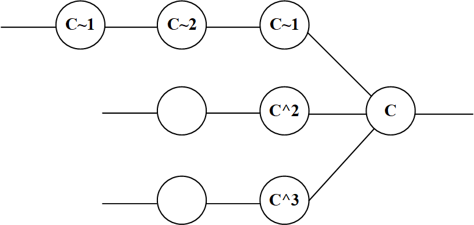

**概览**<br />
<a name="OhXUP"></a>
# —— Git ——
分布式版本控制系统（Distributed Version Control System，DVCS）<br />C语言开发<br />​

Git 保存的不是文件的变化或者差异，而是一系列不同时刻的 快照<br />本质：一个内容寻址（content-addressable）文件系统<br />底层（plumbing）命令<br />上层（porcelain）命令<br />**​**

[**Documentation**](https://git-scm.com/doc)
<a name="W81Q0"></a>
# [Glossary](https://git-scm.com/docs/gitglossary)


- Workspace：工作区：对项目的某个版本独立提取出来的内容
- Index / Stage：暂存区：在 Git 仓库中一个文件，保存了下次将要提交的文件列表信息
- Repository：仓库区：Git 用来保存项目的元数据和对象数据库的地方
- Remote：远程仓库

**​**

**文件状态**

- Tracked（已追踪的）：被纳入了版本控制的文件，在上一次快照中有它们的记录
   - modified
   - staged
   - committed
- Untracked（未追踪的）
- Ignored（被忽略的）

​

.git 目录
```shell
.
|-- HEAD         # 指向目前被检出的分支
|-- config       # 项目的配置信息，git config命令会改动它
|-- description  # 项目的描述信息
|-- hooks/       # 系统默认钩子脚本（hook scripts）目录
|-- index        # 索引文件，保存暂存区信息
|-- info         # 包含一个全局性排除（global exclude）文件， 用以放置那些不希望被记录在 .gitignore 文件中的忽略模式（ignored patterns）
|-- logs/        # 各个refs的历史信息
|-- objects/     # 存储所有数据内容，Git本地仓库的所有对象 (commits, trees, blobs, tags)
`-- refs/        # 存储指向数据（分支、远程仓库和标签等）的提交对象的指针
```
**​**

**.gitignore**

- 级联性，即影响该目录及其子目录
- 注释必须以#开头
- 以“ !”开头，用于否定模式
- 可以使用标准的 glob 模式匹配，即通配符
- 可以以（/）开头防止递归
- 可以以（/）结尾指定目录
```shell
# comment
*.txt        # 忽略所有 .txt结尾的文件
!lib.txt     # 但lib.txt除外
/temp        # 仅忽略当前目录下的TODO文件，不包括其它目录temp
build/       # 忽略任何目录下名为 build 的文件夹
doc/*.txt    # 会忽略 doc/notes.txt 但不包括 doc/server/arch.txt
doc/**/*.pdf # 忽略 doc/ 目录及其所有子目录下的 .pdf 文件
```
.gitignore templates：[https://github.com/github/gitignore](https://github.com/github/gitignore)<br />**​**

**对象(object)**

- blob（binary large object，块）：存储文件数据。使用zlib压缩算法对一个文件的内容压缩后的结果
- tree（目录树）：记录blob标识符、路径名和一个目录里所有文件的一些元数据。有一串(bunch)指向blob对象或是其它tree对象的指针，它一般用来表示内容之间的目录层次关系。
- commit：指向一个"tree"，它用来标记项目某一个特定时间点的状态
- tag：标记某一个提交(commit) 的方法

​

引用（reference）：一个SHA1散列值，指向Git对象库中的对象<br />符号引用（symbolic reference）：间接指向Git对象

- HEAD——指向当前分支的最近提交
- ORIG_HEAD——可用来恢复或回滚到之前的状态
- FETCH_HEAD
- MERGE_HEAD

​

引用规范（refspec）：
```shell
[remote "origin"]
	url = https://github.com/schacon/simplegit-progit
	fetch = +refs/heads/*:refs/remotes/origin/*
```
^	选择不同的父提交<br />~	选择上一代提交<br />..	X..Y  等同  ^X Y<br />...	对称差（并集-交集）<br /><br />快进（fast-forward）：合并分支时， 如果顺着一个分支走下去能够到达另一个分支，那么 Git 在合并两者的时候， 只会简单的将指针向前推进（指针右移），因为这种情况下的合并操作没有需要解决的分歧<br />**​**

**​**

**CLI**

- Git Bash：Unix与Linux风格的命令行
- Git CMD：Windows风格的命令行
- Git GUI：图形界面的Git
```shell
git [--version] [--help] [-C <path>] [-c <name>=<value>]
           [--exec-path[=<path>]] [--html-path] [--man-path] [--info-path]
           [-p | --paginate | -P | --no-pager] [--no-replace-objects] [--bare]
           [--git-dir=<path>] [--work-tree=<path>] [--namespace=<name>]
           <command> [<args>]
start a working area (see also: git help tutorial)
   clone     Clone a repository into a new directory
   init      Create an empty Git repository or reinitialize an existing one
work on the current change (see also: git help everyday)
   add       Add file contents to the index
   mv        Move or rename a file, a directory, or a symlink
   restore   Restore working tree files
   rm        Remove files from the working tree and from the index
examine the history and state (see also: git help revisions)
   bisect    Use binary search to find the commit that introduced a bug
   diff      Show changes between commits, commit and working tree, etc
   grep      Print lines matching a pattern
   log       Show commit logs
   show      Show various types of objects
   status    Show the working tree status
grow, mark and tweak your common history
   branch    List, create, or delete branches
   commit    Record changes to the repository
   merge     Join two or more development histories together
   rebase    Reapply commits on top of another base tip
   reset     Reset current HEAD to the specified state
   switch    Switch branches
   tag       Create, list, delete or verify a tag object signed with GPG
collaborate (see also: git help workflows)
   fetch     Download objects and refs from another repository
   pull      Fetch from and integrate with another repository or a local branch
   push      Update remote refs along with associated objects
```


<a name="kA76P"></a>
# —— [Reference](https://git-scm.com/docs)
<a name="cyGj5"></a>
# Setup and Config
<a name="mk7FV"></a>
## [git](https://git-scm.com/docs/git)
```shell
git [--version] [--help] [-C <path>] [-c <name>=<value>]
    [--exec-path[=<path>]] [--html-path] [--man-path] [--info-path]
    [-p|--paginate|-P|--no-pager] [--no-replace-objects] [--bare]
    [--git-dir=<path>] [--work-tree=<path>] [--namespace=<name>]
    [--super-prefix=<path>]
    <command> [<args>]
```
<a name="sFOmN"></a>
## [help](https://git-scm.com/docs/git-help)
```shell
git help [-a|--all] [-g|--guide] [-i|--info|-m|--man|-w|--web] [COMMAND|GUIDE]

git <verb> --help
man git-<verb>

# 列出所有可配置的变量
git help -c
```
<a name="ryZLh"></a>
## [config](https://git-scm.com/docs/git-config)
Git的设置文件.gitconfig，在用户主目录（全局配置），和项目目录下（项目配置）。
```shell
git config [<options>]

Config file location
    --global              use global config file
    --system              use system config file
    --local               use repository config file
    --worktree            use per-worktree config file
    -f, --file <file>     use given config file
    --blob <blob-id>      read config from given blob object

Action
    --get                 get value: name [value-regex]
    --get-all             get all values: key [value-regex]
    --get-regexp          get values for regexp: name-regex [value-regex]
    --get-urlmatch        get value specific for the URL: section[.var] URL
    --replace-all         replace all matching variables: name value [value_regex]
    --add                 add a new variable: name value
    --unset               remove a variable: name [value-regex]
    --unset-all           remove all matches: name [value-regex]
    --rename-section      rename section: old-name new-name
    --remove-section      remove a section: name
    -l, --list            list all
    -e, --edit            open an editor
    --get-color           find the color configured: slot [default]
    --get-colorbool       find the color setting: slot [stdout-is-tty]

Type
    -t, --type <>         value is given this type
    --bool                value is "true" or "false"
    --int                 value is decimal number
    --bool-or-int         value is --bool or --int
    --bool-or-str         value is --bool or string
    --path                value is a path (file or directory name)
    --expiry-date         value is an expiry date

Other
    -z, --null            terminate values with NUL byte
    --name-only           show variable names only
    --includes            respect include directives on lookup
    --show-origin         show origin of config 
    --show-scope          show scope of config 
    --default <value>     with --get, use default value when missing entry


# 用户名/邮箱
user.name
user.email

core.autocrlf false    # 换行符
core.editor emacs    # 文本编辑器
core.fileMode false    # 忽略文件权限变动
core.ignorecase false    # git默认是忽略大小写
merge.tool vimdiff    # 差异化分析工具


# 查看所有的配置以及它们所在的文件
git config --list --show-origin

# 配置代理
git config --global https.proxy  http://127.0.0.1:1087
git config --global http.proxy  http://127.0.0.1:1087

# 记住提交账号密码
git config --global credential.helper store

# 清除git已保存的用户名和密码
git credential-manager uninstall # windows
git config --global credential.helper "" # mac linux
git config --global --unset credential.helper # 或者 mac linux


命令别名配置
# 设置别名，如果之前添加过，需要添加 --replace-all 进行覆盖
git config --global alias.[别名] [原命令] [--replace-all]

# 执行外部命令, 只要在前面加 ! 即可
git config --global alias.[别名] '!echo hello';
#例 git config --global alias.mg '!git checkout develop && git pull && git merge master && git checkout -';

# 删除别名
git config --global --unset alias.[别名]
```


<a name="bV53I"></a>
## [bugreport](https://git-scm.com/docs/git-bugreport)

<br />

<a name="oRzXo"></a>
# Getting and Creating Projects
<a name="SgCwf"></a>
## [init](https://git-scm.com/docs/git-init)
```shell
git init [-q | --quiet] [--bare] [--template=<template_directory>]
	  [--separate-git-dir <git dir>] [--object-format=<format>]
	  [-b <branch-name> | --initial-branch=<branch-name>]
	  [--shared[=<permissions>]] [directory]
    
# 在当前[新建一个]目录新建一个Git代码库，或重新初始化一个现有的仓库
$ git init [project-name]

# 下载一个项目和它的整个代码历史
$ git clone [url]
```
<a name="PpMNy"></a>
## [clone](https://git-scm.com/docs/git-clone)
```shell
git clone [--template=<template_directory>]
	  [-l, --local] [-s, --shared] [--no-hardlinks] [-q] [-n, --no-checkout] [--bare] [--mirror]
	  [-o, --origin <name>] [-b, --branch <branch>] [-u, --upload-pack <path>] [--reference <repository>]
	  [--dissociate] [--separate-git-dir <git dir>]
	  [--depth <depth>] [--[no-]single-branch] [--no-tags]
	  [--recurse-submodules[=<pathspec>]] [--[no-]shallow-submodules]
	  [--[no-]remote-submodules] [--jobs <n>] [--sparse]
	  [--filter=<filter>] [--] <repository>
	  [<directory>]

# SSH协议
git clone git@github.com:user/test.git
# GIT协议
git clone git://github.com/user/test.git
# HTTPS协议
git clone https://github.com/user/tset.git


# 克隆指定分支
git clone -b develop --single-branch 协议

# 指定克隆后的文件夹名称
git clone 协议 git-alias

# 递归克隆，如果项目包含子模块就非常有用
git clone --recursive 协议

# 克隆深度为1, 只克隆指定分支, 历史记录只克隆最后一条, 减少克隆时间
git clone --depth=1 协议
```


<a name="njFFZ"></a>
# Basic Snapshotting
<a name="AREX0"></a>
## [add](https://git-scm.com/docs/git-add)
```shell
git add [--verbose | -v] [--dry-run | -n] [--force | -f] [--interactive | -i] [--patch | -p]
      [--edit | -e] [--[no-]all | --[no-]ignore-removal | [--update | -u]]
      [--intent-to-add | -N] [--refresh] [--ignore-errors] [--ignore-missing]
      [--chmod=(+|-)x] [--] [<pathspec>…]
      
# 添加指定文件到暂存区
git add [file] [dir] ...

# 添加当前目录的所有文件到暂存区
git add .
```
<a name="EM6AA"></a>
## [status](https://git-scm.com/docs/git-status)
```shell
git status [<options>] [--] <pathspec>...
    -v, --verbose         be verbose
    -s, --short           show status concisely
    -b, --branch          show branch information
    --show-stash          show stash information
    --long                show status in long format (default)
    -z, --null            terminate entries with NUL
    -u, --untracked-files[=<mode>]
                          show untracked files, optional modes: all, normal, no. 
    --ignored[=<mode>]    show ignored files, optional modes: traditional, matching, no.
    
# 以短格式给出输出
git status -s

Short Format
    ' ' = unmodified
    M = modified
    A = added
    D = deleted
    R = renamed
    C = copied
    U = updated but unmerged
```
<a name="zxllO"></a>
## [commit](https://git-scm.com/docs/git-commit)
```shell
git commit [-a, --all | --interactive | -p, --patch] [-s] [-v] [-u<mode>] [--amend]
       [--dry-run] [(-c, --reedit-message | -C, --reuse-message | --fixup | --squash) <commit>]
       [-F <file> | -m, --message <message>] [--reset-author] [--allow-empty]
       [--allow-empty-message] [-n, --no-verify] [-e, --edit] [--author=<author>]
       [--date=<date>] [--cleanup=<mode>] [--[no-]status]
       [-i, --include | -o, --only] [-S, --gpg-sign[=<key-id>]] [--] [-t, --template <file>…​]

# 提交暂存区到仓库区
$ git commit -m [message]

# 提交暂存区的指定文件到仓库区
$ git commit [file1] [file2] ... -m [message]

# 提交工作区自上次commit之后的变化，直接到仓库区
$ git commit -a

# 提交时显示所有diff信息
$ git commit -v

# 允许提交空消息，通常必须指定 -m 参数
git commit --allow-empty-message

# 使用一次新的commit，替代上一次提交
# 如果代码没有任何新变化，则用来改写上一次commit的提交信息
$ git commit --amend -m [message]

# 重做上一次commit，并包括指定文件的新变化
$ git commit --amend [file1] [file2] ...
```
<a name="qve12"></a>
## [notes](https://git-scm.com/docs/git-notes)
<a name="SQyRB"></a>
## [restore](https://git-scm.com/docs/git-restore)
Restore working tree files
```shell
git restore [<options>] [--source=<tree>] [--staged] [--worktree] [--] <pathspec>… 
    -S, --staged          restore the index
    -W, --worktree        restore the working tree (default)
    --ignore-unmerged     ignore unmerged entries
    --overlay             use overlay mode
    --recurse-submodules[=<checkout>]
                          control recursive updating of submodules
    --progress            force progress reporting
    -m, --merge           perform a 3-way merge with the new branch
    
    
# 从暂 不包括新建文件
git restore [--worktree] [file]

# 将文件从暂存区撤出，但不会撤销文件的更改
git restore --staged [file]
```
<a name="k6Sks"></a>
## [reset](https://git-scm.com/docs/git-reset)
Reset current HEAD to the specified state
```shell
git reset [--soft | --mixed [-N] | --hard | --merge | --keep] [-q] [<commit>]
    --mixed               reset HEAD and index (default)
    --soft                reset only HEAD
    --hard                reset HEAD, index and working tree
    --merge               reset HEAD, index and working tree
    --keep                reset HEAD but keep local changes
    --recurse-submodules[=<reset>]
                          control recursive updating of submodules
    -p, --patch           select hunks interactively
    
# 重置暂存区的指定文件，与上一次commit保持一致，但工作区不变
$ git reset [file]

# 重置当前分支的指针为指定commit，同时重置暂存区，但工作区不变
$ git reset [commit]

# 重置当前分支的HEAD，暂存区和工作区，与指定commit一致
$ git reset --hard [commit]

# 重置当前HEAD为指定commit，但保持暂存区和工作区不变
$ git reset --keep [commit]
```
<a name="QTOKz"></a>
## [rm](https://git-scm.com/docs/git-rm)
```shell
git rm [-f | --force] [-n] [-r] [--cached] [--ignore-unmatch] [--quiet] [--] <file>…

# 删除工作区文件，并且将这次删除放入暂存区
git rm [file1] [file2] ...

# 停止追踪指定文件，即将文件由已暂存-->未暂存，删除索引中的文件并保留在工作区
git rm --cached [file]

# 清除本地git缓存
git rm -r --cached .
```
<a name="sFFAF"></a>
## [mv](https://git-scm.com/docs/git-mv)
```shell
# 改名文件，并且将这个改名放入暂存区
git mv [-v] [-f] [-n] [-k] <source> <destination>
```


<a name="Wxpy9"></a>
# Branching and Merging
<a name="KeXfS"></a>
## [branch](https://git-scm.com/docs/git-branch)
```shell
git branch 
    -a, --all             list both remote-tracking and local branches
    -r, --remotes         act on remote-tracking branches
    --contains <commit>   print only branches that contain the commit
    --no-contains <commit>
                          print only branches that don't contain the commit
    -d, --delete          delete fully merged branch
    -D                    delete branch (even if not merged)
    -m, --move            move/rename a branch and its reflog
    -M                    move/rename a branch, even if target exists
    -c, --copy            copy a branch and its reflog
    -C                    copy a branch, even if target exists
    -l, --list            list branch names
    --show-current        show current branch name
    --create-reflog       create the branch's reflog
    --edit-description    edit the description for the branch
    -f, --force           force creation, move/rename, deletion
    --merged <commit>     print only branches that are merged
    --no-merged <commit>  print only branches that are not merged
    --column[=<style>]    list branches in columns
    --sort <key>          field name to sort on
    --points-at <object>  print only branches of the object
    -i, --ignore-case     sorting and filtering are case insensitive
    --format <format>     format to use for the output


# 列出所有本地分支
$ git branch

# 新建一个分支，但依然停留在当前分支
$ git branch [branch-name]

# 新建一个分支，指向指定commit
$ git branch [branch] [commit]

# 查看本地分支所关联的远程分支
git branch -vv

# 查看本地 master 分支创建时间
git reflog show --date=iso master

# 新建一个分支，与指定的远程分支建立追踪关系
$ git branch --track [branch] [remote-branch]

# 建立追踪关系，在现有分支与指定的远程分支之间
$ git branch --set-upstream [branch] [remote-branch]

# 强制修改分支位置
git branch -f master HEAD~3


# 删除远程分支
$ git push origin --delete [branch-name]
$ git branch -dr [remote/branch]

# 重命名远程分支
git branch -m <branchName>	 # 修改分支名称
git push origin :old_branch  # 删除远程旧分支
git push -u origin new_branch  # 将重命名分支推送到远程
```
<a name="c5En2"></a>
## [checkout](https://git-scm.com/docs/git-checkout)
Switch branches or restore working tree files
```shell
git checkout [<options>] [<branch>] -- <file>...
    -b <branch>           create and checkout a new branch
    -B <branch>           create/reset and checkout a branch
    -l                    create reflog for new branch
    --guess               second guess 'git checkout <no-such-branch>' (default)
    --overlay             use overlay mode (default)
    -q, --quiet           suppress progress reporting
    --recurse-submodules[=<checkout>]
                          control recursive updating of submodules
    --progress            force progress reporting
    -m, --merge           perform a 3-way merge with the new branch
    --conflict <style>    conflict style (merge or diff3)
    -d, --detach          detach HEAD at named commit
    -t, --track           set upstream info for new branch
    -f, --force           force checkout (throw away local modifications)
    --orphan <new-branch>
                          new unparented branch
    --overwrite-ignore    update ignored files (default)
    
# 恢复暂存区的指定文件到工作区
$ git checkout [file]
# 恢复某个commit的指定文件到暂存区和工作区
$ git checkout [commit] [file]
# 切换到上一个分支
$ git checkout -
```
<a name="CKUQZ"></a>
## [switch](https://git-scm.com/docs/git-switch)
Switch branches
```shell
git switch [<options>] [<branch>]
    -c, --create <branch>
                          create and switch to a new branch
    -C, --force-create <branch>
                          create/reset and switch to a branch
    --guess               second guess 'git switch <no-such-branch>'
    --discard-changes     throw away local modifications
    -q, --quiet           suppress progress reporting
    --recurse-submodules[=<checkout>]
                          control recursive updating of submodules
    --progress            force progress reporting
    -m, --merge           perform a 3-way merge with the new branch
    --conflict <style>    conflict style (merge or diff3)
    -d, --detach          detach HEAD at named commit
    -t, --track           set upstream info for new branch
    -f, --force           force checkout (throw away local modifications)
    --orphan <new-branch>
                          new unparented branch
    --overwrite-ignore    update ignored files (default)
    
# 切换到指定分支，并更新工作区
git checkout [branch-name]
git switch [branch-name]

# 新建一个分支，并切换到该分支
git checkout -b [branch] [remote]
git switch -c [branch] [remote]
```
<a name="r1J8s"></a>
## [merge](https://git-scm.com/docs/git-merge)
```shell
git merge [-n] [--stat] [--no-commit] [--squash] [--[no-]edit]
	[--no-verify] [-s <strategy>] [-X <strategy-option>] [-S[<keyid>]]
	[--[no-]allow-unrelated-histories]
	[--[no-]rerere-autoupdate] [-m <msg>] [-F <file>] [<commit>…]
git merge (--continue | --abort | --quit)
# 合并指定分支到当前分支
git merge [--no-ff -m "merge with no-ff"] [branch]
# 退出合并，恢复到合并之前的状态
git merge --abort
```
<a name="gKXOI"></a>
## [mergetool](https://git-scm.com/docs/git-mergetool)
Run merge conflict resolution tools to resolve merge conflicts
<a name="KlH0a"></a>
## [stash](https://git-scm.com/docs/git-stash)
Stash the changes in a dirty working directory away
```shell
# 查看当前保存列表
git stash list [<options>]
git stash show [<stash>]
git stash drop [-q|--quiet] [<stash>]
git stash ( pop | apply ) [--index] [-q|--quiet] [<stash>]
git stash branch <branchname> [<stash>]
git stash save [-p|--patch] [-k|--[no-]keep-index] [-q|--quiet]
         [-u|--include-untracked] [-a|--all] [<message>]
git stash [push [-p|--patch] [-k|--[no-]keep-index] [-q|--quiet]
         [-u|--include-untracked] [-a|--all] [-m|--message <message>]]
         [--] [<pathspec>…​]]
# 清空所有保存
git stash clear
git stash create [<message>]
git stash store [-m|--message <message>] [-q|--quiet] <commit>


# 保存当前修改工作区内容
git stash

# 保存时添加注释
git stash save "comment"

# 保存包含没有被git追踪的文件
git stash -u

# 恢复修改工作区内容, 会从 git stash list 移除掉
git stash pop # 恢复最近一次保存内容到工作区, 默认会把暂存区的改动恢复到工作区
git stash pop stash@{1} # 恢复指定 id， 通过 git stash list 可查到
git stash pop --index # 恢复最近一次保存内容到工作区, 但如果是暂存区的内容同样恢复到暂存区

# 与 pop 命令一致, 唯一不同的是不会移除保存列表
git stash apply

# 清空指定 stash id, 如果 drop 后面不指定id清除最近的一次
git stash drop stash@{0}
git stash drop  # 清除最近一次
```
<a name="bPbmo"></a>
## [tag](https://git-scm.com/docs/git-tag)
Create, list, delete or verify a tag object signed with GPG
```shell
git tag [-a | -s | -u <keyid>] [-f] [-m <msg> | -F <file>]
    <tagname> [<commit> | <object>]
    -l, --list            list tag names
    -n[<n>]               print <n> lines of each tag message
    -d, --delete          delete tags
    -v, --verify          verify tags

Tag creation options
    -a, --annotate        annotated tag, needs a message
    -m, --message <message>
                          tag message
    -F, --file <file>     read message from file
    -e, --edit            force edit of tag message
    -s, --sign            annotated and GPG-signed tag
    --cleanup <mode>      how to strip spaces and #comments from message
    -u, --local-user <key-id>
                          use another key to sign the tag
    -f, --force           replace the tag if exists
    --create-reflog       create a reflog

Tag listing options
    --column[=<style>]    show tag list in columns
    --contains <commit>   print only tags that contain the commit
    --no-contains <commit>
                          print only tags that don\'t contain the commit
    --merged <commit>     print only tags that are merged
    --no-merged <commit>  print only tags that are not merged
    --sort <key>          field name to sort on
    --points-at <object>  print only tags of the object
    --format <format>     format to use for the output
    --color[=<when>]      respect format colors
    -i, --ignore-case     sorting and filtering are case insensitive


# 列出本地所有标签
git tag

# 列出远程所有标签
git ls-remote --tags origin

# 新建一个tag在指定commit，默认为当前
$ git tag [tag] [commit]

# 删除远程tag
$ git push origin :refs/tags/[tagName]

# 查看tag信息
$ git show [tag]

# 查看最近的标签
git describe <ref>

# 提交指定tag
$ git push [remote] [tag]

# 提交所有tag
$ git push [remote] --tags
```

- 轻量标签（lightweight）：某个特定提交的引用
- 附注标签（annotated）：存储在 Git 数据库中的一个完整对象， 是可以被校验的，包含打标签者的名字、电子邮件地址、日期时间， 一个标签信息，可以使用 GNU Privacy Guard （GPG）签名并验证。

​

分离头指针（detached HEAD）的状态
<a name="pBiyk"></a>
## [worktree](https://git-scm.com/docs/git-worktree)

<br />

<a name="vutAY"></a>
# Sharing and Updating Projects
<a name="AAuet"></a>
## [remote](https://git-scm.com/docs/git-remote)
Manage set of tracked repositories
```shell
# 显示所有远程仓库
git remote [-v | --verbose]
# 增加一个新的远程仓库，并命名
git remote add [-t <branch>] [-m <master>] [-f] [--[no-]tags] [--mirror=<fetch|push>] <name> <url>
git remote rename <old> <new>    # 重命名远程仓库
git remote remove <name>    # 移除远程仓库
git remote set-head <name> (-a | --auto | -d | --delete | <branch>)
git remote set-branches [--add] <name> <branch>…
git remote get-url [--push] [--all] <name>
git remote set-url [--push] <name> <newurl> [<oldurl>]
git remote set-url --add [--push] <name> <newurl>
git remote set-url --delete [--push] <name> <url>
git remote [-v | --verbose] show [-n] <name>…    # 显示某个远程仓库的信息
git remote prune [-n | --dry-run] <name>…    # Deletes stale references associated with <name>
git remote [-v | --verbose] update [-p | --prune] [(<group> | <remote>)…]
```
<a name="LUHkA"></a>
## [fetch](https://git-scm.com/docs/git-fetch)
Download objects and refs from another repository
```shell
git fetch [<options>] [<repository> [<refspec>…]]
    --all                 fetch from all remotes
    --set-upstream        set upstream for git pull/fetch
    -a, --append          append to .git/FETCH_HEAD instead of overwriting
    --upload-pack <path>  path to upload pack on remote end
    -f, --force           force overwrite of local reference
    -m, --multiple        fetch from multiple remotes
    -t, --tags            fetch all tags and associated objects
    -n                    do not fetch all tags (--no-tags)
    -j, --jobs <n>        number of submodules fetched in parallel
    -p, --prune           prune remote-tracking branches no longer on remote
    -P, --prune-tags      prune local tags no longer on remote and clobber changed ta
gs
    --recurse-submodules[=<on-demand>]
                          control recursive fetching of submodules
    --dry-run             dry run
    --write-fetch-head    write fetched references to the FETCH_HEAD file
    -k, --keep            keep downloaded pack
    -u, --update-head-ok  allow updating of HEAD ref
    --progress            force progress reporting
    --depth <depth>       deepen history of shallow clone
    --shallow-since <time>
                          deepen history of shallow repository based on time
    --shallow-exclude <revision>
                          deepen history of shallow clone, excluding rev
    --deepen <n>          deepen history of shallow clone
    --unshallow           convert to a complete repository
    --update-shallow      accept refs that update .git/shallow
    -o, --server-option <server-specific>
                          option to transmit
    --filter <args>       object filtering
    
# 下载远程仓库的所有变动
$ git fetch [remote]
```
<a name="VjZbR"></a>
## [pull](https://git-scm.com/docs/git-pull)
Fetch from and integrate with another repository or a local branch
```shell
git pull [<options>] [<repository> [<refspec>…]]
    -r, --rebase[=(false|true|merges|preserve|interactive)]
                          incorporate changes by rebasing rather than merging
    -n                    do not show a diffstat at the end of the merge
    --stat                show a diffstat at the end of the merge
    --log[=<n>]           add (at most <n>) entries from shortlog to merge commit message
    --signoff[=...]       add Signed-off-by:
    --squash              create a single commit instead of doing a merge
    --commit              perform a commit if the merge succeeds (default)
    --edit                edit message before committing
    --cleanup <mode>      how to strip spaces and #comments from message
    --ff                  allow fast-forward
    --ff-only             abort if fast-forward is not possible
    --verify-signatures   verify that the named commit has a valid GPG signature
    --autostash           automatically stash/stash pop before and after
    -s, --strategy <strategy>
                          merge strategy to use
    -X, --strategy-option <option=value>
                          option for selected merge strategy
    -S, --gpg-sign[=<key-id>]
                          GPG sign commit
    --allow-unrelated-histories
                          allow merging unrelated histories
                          
# 取回远程仓库的变化，并与本地分支合并
git pull [--rebase] <远程主机名> <远程分支名>:<本地分支名>
```
git pull = git fetch + git merge FETCH_HEAD
<a name="uE8sa"></a>
## [push](https://git-scm.com/docs/git-push)
Update remote refs along with associated objects
```shell
git push [--all | --mirror | --tags] [--follow-tags] [--atomic] [-n | --dry-run] [--receive-pack=<git-receive-pack>]
	   [--repo=<repository>] [-f | --force] [-d | --delete] [--prune] [-v | --verbose]
	   [-u | --set-upstream] [-o <string> | --push-option=<string>]
	   [--[no-]signed|--signed=(true|false|if-asked)]
	   [--force-with-lease[=<refname>[:<expect>]] [--force-if-includes]]
	   [--no-verify] [<repository> [<refspec>…]]
     
# 上传本地指定分支到远程仓库
git push <远程主机名> <本地分支名>:<远程分支名>
# 推送所有分支到远程仓库
$ git push [remote] --all
# 删除远程分支，原理是将空分支推送到远程分支
$ git push [主机名] :[远程分支名]
$ git push [主机名] --delete [远程分支名]
```
<a name="o5PVE"></a>
## [submodule](https://git-scm.com/docs/git-submodule)

<br />

<a name="eE4cV"></a>
# Inspection and Comparison
<a name="yXXL0"></a>
## [show](https://git-scm.com/docs/git-show)
Show various types of objects
```shell
git show [<options>] [<object>…]
# 显示某次提交的元数据和内容变化
$ git show [commit]
# 显示某次提交发生变化的文件
$ git show --name-only [commit]
# 显示某次提交时，某个文件的内容
$ git show [commit]:[filename]
```
<a name="Td9cZ"></a>
## [log](https://git-scm.com/docs/git-log)
Show commit logs
```shell
git log [<options>] [<revision range>] [[--] <path>…​]
    -<n>	仅显示最近的 n 条提交。
    --since, --after	仅显示指定时间之后的提交。
    --until, --before	仅显示指定时间之前的提交。
    --author	仅显示作者匹配指定字符串的提交。
    --committer	仅显示提交者匹配指定字符串的提交。
    --grep	仅显示提交说明中包含指定字符串的提交。
    -S	仅显示添加或删除内容匹配指定字符串的提交。
    --stat	显示每次提交的文件修改统计信息。
    --shortstat	只显示 --stat 中最后的行数修改添加移除统计。
    --name-only	仅在提交信息后显示已修改的文件清单。
    --name-status	显示新增、修改、删除的文件清单。
    --abbrev-commit	仅显示 SHA-1 校验和所有 40 个字符中的前几个字符。
    --relative-date	使用较短的相对时间而不是完整格式显示日期（比如“2 weeks ago”）。
    --graph	在日志旁以 ASCII 图形显示分支与合并历史。
    --pretty	使用其他格式显示历史提交信息。可用的选项包括 oneline、short、full、fuller 和 format（用来定义自己的格式）。
    --oneline	--pretty=oneline --abbrev-commit 合用的简写。
    --author [贡献者名字]    查看指定贡献者的提交记录
    
# 查看某分支的提交历史，不写分支名查看当前所在分支
$ git log [分支名] 

# 显示指定文件每次提交所引入的差异
$ git log -p | --patch [file]

# 显示过去n次提交
$ git log -n --pretty --oneline

# 只显示合并日志
git log --merges

# 显示某个commit之后的所有变动，每个commit占据一行
$ git log [tag] HEAD --pretty=format:%s

# 显示某个commit之后的所有变动，其"提交说明"必须符合搜索条件
$ git log [tag] HEAD --grep feature

# 显示某个文件的版本历史，包括文件改名
$ git log --follow [file]
$ git whatchanged [file]
```
<a name="r4JOR"></a>
## [diff](https://git-scm.com/docs/git-diff)
Show changes between commits, commit and working tree, etc
```shell
git diff [<options>] [<commit>] [--] [<path>…]
# 显示暂存区和工作区的差异
$ git diff
# 显示暂存区和上一个commit的差异
$ git diff --cached [file]
# 显示工作区与当前分支最新commit之间的差异
$ git diff HEAD
# 显示两次提交之间的差异
$ git diff [first-branch]...[second-branch]
# 显示今天你写了多少行代码
$ git diff --shortstat "@{0 day ago}"
# 显示当前分支的最近几次提交
$ git reflog
```
<a name="cAeQa"></a>
## [difftool](https://git-scm.com/docs/git-difftool)
<a name="PlJIE"></a>
## [range-diff](https://git-scm.com/docs/git-range-diff)
<a name="gwTdu"></a>
## [shortlog](https://git-scm.com/docs/git-shortlog)
```shell
git shortlog [<options>] [<revision range>] [[--] <path>…]
git log --pretty=short | git shortlog [<options>]
    -c, --committer       Group by committer rather than author
    -n, --numbered        sort output according to the number of commits per author
    -s, --summary         Suppress commit descriptions, only provides commit count
    
# 显示所有提交过的用户，按提交次数排序
$ git shortlog -sn
# 采用邮箱格式化的方式进行查看贡献度
git shortlog -e
```
<a name="DMIup"></a>
## [describe](https://git-scm.com/docs/git-describe)
Give an object a human readable name based on an available ref
```shell
git describe [--all] [--tags] [--contains] [--abbrev=<n>] [<commit-ish>…]
```
<a name="iE8qz"></a>
# Patching
<a name="zAJwc"></a>
## [apply](https://git-scm.com/docs/git-apply)
Apply a patch to files and/or to the index
```shell
git apply [--stat] [--numstat] [--summary] [--check] [--index | --intent-to-add] [--3way]
	  [--apply] [--no-add] [--build-fake-ancestor=<file>] [-R | --reverse]
	  [--allow-binary-replacement | --binary] [--reject] [-z]
	  [-p<n>] [-C<n>] [--inaccurate-eof] [--recount] [--cached]
	  [--ignore-space-change | --ignore-whitespace]
	  [--whitespace=(nowarn|warn|fix|error|error-all)]
	  [--exclude=<path>] [--include=<path>] [--directory=<root>]
	  [--verbose] [--unsafe-paths] [<patch>…]
```
<a name="M7eqf"></a>
## [cherry-pick](https://git-scm.com/docs/git-cherry-pick)
Apply the changes introduced by some existing commits
```shell
git cherry-pick [--edit] [-n] [-m parent-number] [-s] [-x] [--ff]
		  [-S[<keyid>]] <commit>…
git cherry-pick (--continue | --skip | --abort | --quit)
# 选择一个commit，合并进当前分支
$ git cherry-pick [commit]...
```
<a name="ccTxO"></a>
## [rebase](https://git-scm.com/docs/git-rebase)
Reapply commits on top of another base tip
```shell
git rebase [-i | --interactive] [<options>] [--exec <cmd>]
	[--onto <newbase> | --keep-base] [<upstream> [<branch>]]
git rebase [-i | --interactive] [<options>] [--exec <cmd>] [--onto <newbase>]
	--root [<branch>]
git rebase (--continue | --skip | --abort | --quit | --edit-todo | --show-current-patch)
# 操作最近4次提交，将多个commit记录合并为一条
git rebase -i HEAD~4
# 或者以 commit_id 进行操作
git rebase -i commit_id
# 放弃 git rebase 操作
git rebase --abort
```
<a name="ZLsgY"></a>
## [revert](https://git-scm.com/docs/git-revert)
Revert some existing commits
```shell
git revert [--[no-]edit] [-n] [-m parent-number] [-s] [-S[<keyid>]] <commit>…
git revert (--continue | --skip | --abort | --quit)
# 新建一个commit，用来撤销指定commit
# 后者的所有变化都将被前者抵消，并且应用到当前分支
$ git revert [commit]
```


<a name="O05qM"></a>
# Debugging
<a name="yfJau"></a>
## [bisect](https://git-scm.com/docs/git-bisect)
Use binary search to find the commit that introduced a bug
```shell
git bisect start [--term-{new,bad}=<term> --term-{old,good}=<term>]
	  [--no-checkout] [--first-parent] [<bad> [<good>...]] [--] [<paths>...]
git bisect (bad|new|<term-new>) [<rev>]
git bisect (good|old|<term-old>) [<rev>...]
git bisect terms [--term-good | --term-bad]
git bisect skip [(<rev>|<range>)...]
git bisect reset [<commit>]
git bisect (visualize|view)
git bisect replay <logfile>
git bisect log
git bisect run <cmd>...
```
<a name="XUlYQ"></a>
## [blame](https://git-scm.com/docs/git-blame)
Show what revision and author last modified each line of a file
```shell
git blame [-c] [-b] [-l] [--root] [-t] [-f] [-n] [-s] [-e] [-p] [-w] [--incremental]
	    [-L <range>] [-S <revs-file>] [-M] [-C] [-C] [-C] [--since=<date>]
	    [--ignore-rev <rev>] [--ignore-revs-file <file>]
	    [--progress] [--abbrev=<n>] [<rev> | --contents <file> | --reverse <rev>..<rev>]
	    [--] <file>
# 显示指定文件修改历史记录，包括时间、作者以及内容
$ git blame [file]
# 查看谁改动了文件的 n行-m行
git blame -L n,m file
git blame -L n file   # 查看第n行以后
# 显示完整的 hash 值
git blame -l file
# 显示修改的行数
git blame -n file
# 显示作者邮箱
git blame -e file
```
<a name="snN5K"></a>
## [grep](https://git-scm.com/docs/git-grep)
Print lines matching a pattern
```shell
git grep [-a | --text] [-I] [--textconv] [-i | --ignore-case] [-w | --word-regexp]
	   [-v | --invert-match] [-h|-H] [--full-name]
	   [-E | --extended-regexp] [-G | --basic-regexp]
	   [-P | --perl-regexp]
	   [-F | --fixed-strings] [-n | --line-number] [--column]
	   [-l | --files-with-matches] [-L | --files-without-match]
	   [(-O | --open-files-in-pager) [<pager>]]
	   [-z | --null]
	   [ -o | --only-matching ] [-c | --count] [--all-match] [-q | --quiet]
	   [--max-depth <depth>] [--[no-]recursive]
	   [--color[=<when>] | --no-color]
	   [--break] [--heading] [-p | --show-function]
	   [-A <post-context>] [-B <pre-context>] [-C <context>]
	   [-W | --function-context]
	   [--threads <num>]
	   [-f <file>] [-e] <pattern>
	   [--and|--or|--not|(|)|-e <pattern>…]
	   [--recurse-submodules] [--parent-basename <basename>]
	   [ [--[no-]exclude-standard] [--cached | --no-index | --untracked] | <tree>…]
	   [--] [<pathspec>…]
```
<a name="KHofo"></a>
# 其他
```shell
# 生成一个可供发布的压缩包
$ git archive

# Windows下更新
git update-git-for-windows

# 列出没有被 .gitignore 忽略的文件列表
git ls-files
```
​

美化 git log
```shell
git config --global alias.lg "log --color --graph --pretty=format:'%Cred%h%Creset -%C(yellow)%d%Creset %s %Cgreen(%cr) %C(bold blue)<%an>%Creset' --abbrev-commit"
git config --global alias.lg "log --graph --pretty=format:'%Cred%h - %Cgreen[%an]%Creset -%C(yellow)%d%Creset %s %C(yellow)<%cr>%Creset' --abbrev-commit --date=relative"
git config --global alias.his "log --graph --decorate --oneline --pretty=format:'%Creset %s %C(magenta)in %Cred%h %C(magenta)commited by %Cgreen%cn %C(magenta)on %C(yellow) %cd %C(magenta)from %Creset %C(yellow)%d' --abbrev-commit --date=format:'%Y-%m-%d %H:%M:%S'"
git config --global alias.hist "log --graph --decorate --oneline --pretty=format:'%Cred%h - %C(bold white) %s %Creset %C(yellow)%d  %C(cyan) <%cd> %Creset %Cgreen(%cn)' --abbrev-commit --date=format:'%Y-%m-%d %H:%M:%S'"
```
**​**

**​**<br />
<a name="B0lWe"></a>
# 规范
**​**

**命名规则**

- 每次提交必须写明注释，如果是修复Bug，请加上Bug号
- 创建特性分支，名称要以feture/开头，加上特性名
- 创建发布分支，名称要以release/开头，加上预发布版本号
- 创建Bug修复分支，名称要以hotfix/开头，加上Bug号
- 创建标签，名称要以tag/开头，加上发布版本号
- 合并分支时必须使用--no-ff参数，以保留合并历史轨迹

**​**

**Commit Standard**<br />[Commit Message Guidelines](https://github.com/angular/angular.js/blob/master/DEVELOPERS.md#commits)
```shell
<type>(<scope>): <subject> [<ISSUE_ID>]

<body>

<footer>
```
**Header**<br />**type**

   - feat：新功能（feature）
   - fix：修补bug
   - docs：文档（documentation）
   - style： 格式（不影响代码运行的变动）
   - refactor：重构
   - test：增加测试
   - chore：构建过程或辅助工具的变动

**scope**<br />说明 commit 影响的范围，比如数据层、控制层、视图层等<br />修改影响了不止一个scope，你可以使用*代替。<br />**subject**<br />commit 目的的简短描述，不超过50个字符。

   - 以动词开头，使用第一人称现在时
   - 第一个字母小写
   - 结尾不加句号（.）

​

**Body**<br />对本次 commit 的详细描述，可以分成多行。下面是一个范例。

- 使用第一人称现在时
- 永远别忘了第2行是空行
- 应该说明代码变动的动机，以及与以前行为的对比。

​

**Footer**

- 不兼容变动：如果当前代码与上一个版本不兼容，以BREAKING CHANGE开头，后面是对变动的描述、以及变动理由和迁移方法。
- 关闭 Issue：如果当前 commit 针对某个issue，那么可以在 Footer 部分关闭这个 issue 。

**Revert**<br />当前 commit 用于撤销以前的 commit，则必须以revert:开头，后面跟着被撤销 Commit 的 Header。<br />​<br />
<a name="POBH1"></a>
# Git服务器
远程仓库通常只是一个裸仓库（bare repository）——即一个没有当前工作目录的仓库。 工程目录内的 .git 子目录内容<br />​

Protocol

- 本地协议（Local）
- HTTP 协议：可以使用各种 HTTP 验证机制，免去设置 SSH 公钥
- SSH协议	ssh://[user@]server/project.git	不支持匿名访问 Git 仓库
- Git 协议	最快的	缺乏授权机制	难架设

​

**步骤**<br />1 安装git
```shell
$ sudo apt-get install git
```
​

2 创建一个git用户，用来运行git服务
```shell
$ sudo adduser git
```
​

3 创建证书登录<br />收集所有需要登录的用户的公钥(id_rsa.pub)，导入到/home/git/.ssh/authorized_keys文件里，一行一个。<br />​

4 初始化Git仓库<br />先选定一个目录作为Git仓库，假定是/srv/sample.git，在/srv目录下输入命令
```shell
$ sudo git init --bare sample.git
```
Git就会创建一个裸仓库，裸仓库没有工作区，服务器上的Git仓库通常都以.git结尾。<br />​

5 把owner改为git
```shell
$ sudo chown -R git:git sample.git
```
​

6 禁用shell登录
```shell
# /etc/passwd文件
git:x:1001:1001:,,,:/home/git:/bin/bash
|
+
git:x:1001:1001:,,,:/home/git:/usr/bin/git-shell
```
​

7 克隆远程仓库
```shell
$ git clone git@server:/srv/sample.git
```

<br />

<a name="hkd9R"></a>
# Resocurse

<br />Git 练习	[https://learngitbranching.js.org/?locale=zh_CN](https://learngitbranching.js.org/?locale=zh_CN)
