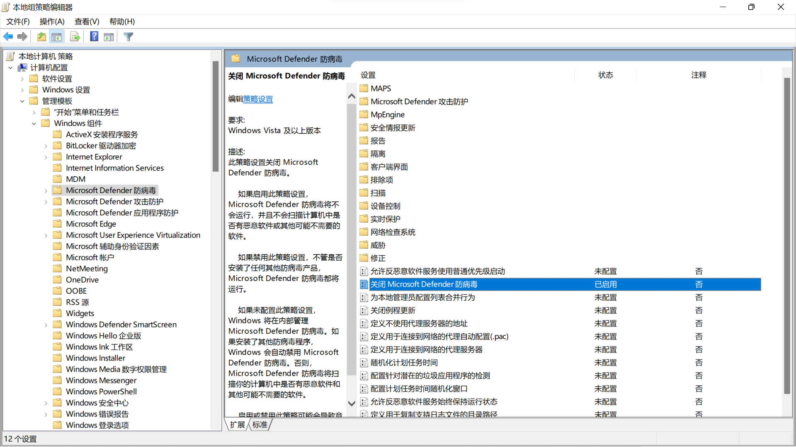

**Microsoft Windows**（视窗操作系统）是[微软公司](https://zh.wikipedia.org/wiki/%E5%BE%AE%E8%BB%9F%E5%85%AC%E5%8F%B8)以图形用户界面为主推出的一系列专有商业软件操作系统。
<a name="PC"></a>
# PC
**个人电脑**（Personal Computer）是在大小、性能以及价位等多个方面适合于个人使用，并由最终用户直接操控的[计算机](https://zh.wikipedia.org/wiki/%E9%9B%BB%E5%AD%90%E8%A8%88%E7%AE%97%E6%A9%9F)的统称。<br />名称	Microsoft Windows 10专业版<br />语言	中文(简体,中国)<br />版本	10.0.19041<br />os Type	64 bit<br />产品ID	00331-10000-00001-AA822<br />注册码	W269N-WFGWX-YVC9B-4J6C9-T83GX<br />Hasee<br />机带RAM	8.00 GB (7.88 GB可用)<br />设备ID	02C8FF9B-CD77-4DD6-96DA-C61976CEEBCE<br />主板名称	W65KJ1_KK1<br />主板厂商	Notebook<br />处理器名称	Intel(R) Core(TM) i3-8100 CPU [_@_3.60GHz ](/3.60GHz )<br />代号	Intel64 Family 6 Model 14 Stepping 11<br />制造商	Genuinelntel<br />序列号	0009-06EB-BFEB-FBFF-FEDA-F387<br />主频	4615 MB<br />插槽名称	U3E1<br />处理器内核数	4<br />处理器个数	4<br />显示器	通用即插即用监视器<br />视频适配器	Intel(R) UHD Graphics 630
<a name="31ac1ed3"></a>
## 特殊地址
**C:\Windows\system32\drivers\etc**

- hosts：以表的形式存储了主机名和IP地址的映射关系<br />
- 减少对DNS服务器的查询次数以加快访问网站的速度。<br />
- 将已知的广告服务器重定向到无广告的机器（127.0.0.1）以过滤广告。<br />
- 拦截一些恶意网站的请求，从而防止访问欺诈网站、感染病毒或恶意软件。<br />
- services：记录了网络服务名、端口号、协议、别名<br />

**开机自启目录**

- 特定用户：C:\Users\Username\AppData\Roaming\Microsoft\Windows\Start Menu\Programs\Startup<br />
- 所有用户：C:\ProgramData\Microsoft\Windows\Start Menu\Programs\StartUp<br />

**任务栏**：C:\Users\泷\AppData\Roaming\Microsoft\Internet Explorer\Quick Launch\User Pinned\TaskBar
<a name="456d29ef"></a>
# 日志
查看日志 eventvwr<br />伪造日志 eventcreate<br />日志路径 %SystemRoot%\System32\Winevt\Logs

- 系统日志 System.evtx<br />
- 安全日志 Security.evtx<br />
- 应用程序日志 Application.evtx<br />
<a name="1b97e581"></a>
# [Microsoft Windows组件](https://zh.wikipedia.org/wiki/Windows%E7%BB%84%E4%BB%B6%E5%88%97%E8%A1%A8)
<a name="UWP"></a>
# UWP
**通用Windows平台**（Universal Windows Platform）是[微软公司](https://zh.wikipedia.org/wiki/%E5%BE%AE%E8%BD%AF)创建并在Windows 10中首次引入的一个同性质应用程序架构平台。目的是帮助发展Metro样式的应用程序，便于软件可以在Windows 10和Windows 10 Mobile上运行且无需重新编写。它支持使用C++、C#、VB.NET或XAML开发的Windows应用程序。<br />运行在App Container 的虚拟沙箱环境中，其安全性及纯净度远胜于传统的 EXE 应用。由于运行环境和网络与实际系统是隔离的，默认是不走代理的（沙盒的网络隔离特性：禁止APP访问localhost ），所以只有类似于VPN这种全局代理才能对UWP应用生效，而系统代理则无法生效。<br />UWP SID位置：HKEY_CURRENT_USER\Software\Classes\Local Settings\Software\Microsoft\Windows\CurrentVersion\AppContainer\Mappings
<a name="84d7e080"></a>
### 代理UWP应用
**CheckNetIsolation LoopbackExempt [operation] [-n=] [-p=]**<br />控制 AppContainer 和程序包系列环回免除，以便于应用程序开发。
```
操作列表:
      -a  -  向环回免除列表中添加 AppContainer 或程序包系列。
      -d  -  从环回免除列表中删除 AppContainer 或程序包系列。
      -c  -  清除环回免除的 AppContainer 和程序包系列的列表。
      -s  -  显示环回免除的 AppContainer 和程序包系列的列表。
  参数列表:
      -n= - AppContainer 名称或程序包系列名称。
      -p= - AppContainer 或程序包系列安全标识符(SID)。
```
**常见**
```
Name: microsoft.windows.authhost.a_8wekyb3d8bbwe
SID:  S-1-15-2-2750798217-1343590035-1234819260-1030354384-3318145141-3720257911-3461195215
Name: microsoft.windowscommunicationsapps_8wekyb3d8bbwe
SID:  S-1-15-2-2551677095-2355568638-4209445997-2436930744-3692183382-387691378-1866284433
Name: microsoft.microsoftedge_8wekyb3d8bbwe
SID:  S-1-15-2-3624051433-2125758914-1423191267-1740899205-1073925389-3782572162-737981194
```
```shell
import os
import winreg as wr
 
BASE_PATH = r"Software\Classes\Local Settings\Software\Microsoft\Windows\CurrentVersion\AppContainer\Mappings"
 
 
# 获得所有程序的 SID
def get_apps_sid():
    sid_list = []
    with wr.OpenKeyEx(wr.HKEY_CURRENT_USER, BASE_PATH) as key:
        max_index = wr.QueryInfoKey(key)[0]
        print(key)
        for i in range(max_index):
            sid_list.append(wr.EnumKey(key, i))
    return sid_list
 
 
# 开启UWP应用使用代理
def enable_all_uwp_net():
    sid_list = get_apps_sid()
    for sid in sid_list:
        os.system('CheckNetIsolation.exe loopbackexempt -a -p=' + sid)
 
 
# 关闭UWP应用使用代理
def disable_all_uwp_net():
    sid_list = get_apps_sid()
    for sid in sid_list:
        os.system('CheckNetIsolation.exe loopbackexempt -d -p=' + sid)
```
<a name="747c53d9"></a>
# 装机
工具：[WePE](https://www.wepe.com.cn/)<br />U盘：>8G

1. 将WePE安装到U盘（U盘数据会被清空），勾选DOS<br />
1. 将系统镜像文件（.ISO）复制到U盘<br />
1. 重启电脑，进入BIOS<br />
1. 以U盘的方式进入PE<br />
1. 如有必要可对C盘重新分区<br />
1. 找到ISO文件，进行装载，完成后自动重启<br />

**激活**<br />数字永久激活：自从Windows8以来，微软将OEM激活方式升级为OA 3.0，激活机制是将OEM密钥写入BIOS中，并根据硬件信息生成一组Hardware Hash（硬件哈希值），重新安装系统时无需再次输入密钥，安装后会自动激活。
<a name="b6453aea"></a>
# 基础配置
禁用摄像头	Win + X --> 设备管理<br />显示百分比，壁纸，锁屏，休眠时间<br />关闭快速访问	Windows资源管理器，点击选择“查看”选项<br />迁移或隐藏基础文件夹<br /><br />配置系统变量<br />替换记事本<br />应用开机自启<br />diskmgmt.msc<br />EFI系统分区：基于UEFI（统一可扩展固件接口）电脑的硬盘上的分区，该分区包含了引导程序、固件以及在引导时需要使用的设备驱动程序文件。
<a name="01d5de6d"></a>
## 默认应用
[DISM](https://docs.microsoft.com/zh-cn/windows-hardware/manufacture/desktop/what-is-dism)
```shell
导出：
Dism.exe /Online /Export-DefaultAppAssociations:C:\AppAssoc.xml
导入恢复：
Dism.exe /Online /Import-DefaultAppAssociations:C:\AppAssoc.xml
显示
Dism.exe /Online /Get-DefaultAppAssociations
重置应用程序关联配置
Dism.exe /Online /Remove-DefaultAppAssociations
```
[https://blog.csdn.net/hatmen2/article/details/84931373](https://blog.csdn.net/hatmen2/article/details/84931373)
```shell
param($extensioname, $vsico, $vspath)
function RemoveItem {
    param (
        $item
    )
    if (Test-Path $item) {
        Write-Host "即将删除"$item
        Remove-Item $item -Recurse
    }
}
if (!$extensioname -or !$vsico -or !$vspath) {
    throw "参数不合理"
    Pause
}
$fullExtension = -Join (".", $extensioname)
$key = "vscode_" + $extensioname
$fullExtensionPath = Join-Path -Path HKLM:\SOFTWARE\Classes -ChildPath $fullExtension
$keyPath = Join-Path -Path HKLM:\SOFTWARE\Classes -ChildPath $key
RemoveItem -item $fullExtensionPath
RemoveItem -item $keyPath
# 新建.css HKLM:\SOFTWARE\Classes\.css
New-Item -ErrorAction Stop -itemType String $fullExtensionPath -value $key
# 新建vscode_css HKLM:\SOFTWARE\Classes\vscode_css
New-Item -ErrorAction Stop -itemType String $keyPath
# 新建vscode_css子项DefaultIcon HKLM:\SOFTWARE\Classes\vscode_css\DefaultIcon
$iconPath = Join-Path -Path $keyPath -ChildPath "DefaultIcon"
New-Item -ErrorAction Stop -itemType String $iconPath -Value  $vsico # "C:\Program Files\Microsoft VS Code\resources\app\resources\win32\css.ico"
# 新建vscode_css子项shell HKLM:\SOFTWARE\Classes\vscode_css\shell
$shellPath = Join-Path -Path $keyPath -ChildPath "shell"
New-Item -ErrorAction Stop -itemType String $shellPath
# 新建shell子项open HKLM:\SOFTWARE\Classes\vscode_css\open
$openPath = Join-Path -Path $shellPath -ChildPath "open"
New-Item -ErrorAction Stop -itemType String $openPath
# 新建open子项command HKLM:\SOFTWARE\Classes\vscode_css\open\command
$cmdPath = Join-Path -Path $openPath -ChildPath "command"
New-Item -ErrorAction Stop -itemType String $cmdPath -Value $vspath # '"C:\Program Files\Microsoft VS Code\Code.exe" "%1"'
# HKEY_CURRENT_USER\Software\Microsoft\Windows\CurrentVersion\Explorer\FileExts\.css
# HKEY_CURRENT_USER\Software\Microsoft\Windows\CurrentVersion\Explorer\FileExts\.css\OpenWithList
# HKEY_CURRENT_USER\Software\Microsoft\Windows\CurrentVersion\Explorer\FileExts\.css\OpenWithProgids
# HKEY_CURRENT_USER\Software\Microsoft\Windows\CurrentVersion\Explorer\FileExts\.css\UserChoice
Stop-process -name explorer -force
# https://blog.csdn.net/a302549450/article/details/84308175
# .\Change_default_programs.ps1 -extensioname "ps1" -vsico "C:\Program Files\Microsoft VS Code\resources\app\resources\win32\powershell.ico" -vspath '"C:\Program Files\Microsoft VS Code\Code.exe" "%1"'
```
<a name="FAQ"></a>
# FAQ
<a name="fa167370"></a>
### 更改语言
家庭版单语言 --> 家庭版		YTMG3-N6DKC-DKB77-7M9GH-8HVX7	重启<br />
<a name="ea14b856"></a>
### 查询Windows序列号
**CLI**
```shell
# 只在许可证类型为 OEM 时才有效
wmic path softwarelicensingservice get OA3xOriginalProductKey
```
泷（Pro）：3RWN4-WK47D-T3BT3-C73RB-YWRJX<br />Hyle（Home Single Language）：3Q7NG-2C9QV-GMJT3-PDGPF-PPQPK<br />Miki（Home）<br />FGNB3-2W49P-7QP6B-7G7PQ-M7V8X<br />(Yoga Pro 13sITL 2021，LAPTOP-Q5NLPILC)	G4T33-MNTV3-FYH6X-FKVQ9-3RTF9<br />**注册表 —— 备份产品密钥**<br />HKEY_LOCAL_MACHINE\SOFTWARE\Microsoft\Windows NT\CurrentVersion\SoftwareProtectionPlatform<br />BackupProductKeyDefault<br />泷（Pro）：YC7N8-G7WR6-9WR4H-6Y2W4-KBT6X
<a name="73279665"></a>
### 彻底删除

- 多次覆写文件	cipher /w:<br />
- 格式化某磁盘count次		format D: /P:<br />
<a name="be8c3e50"></a>
### 关闭windows安全中心
**永久关闭**

1. 打开 gpedit.msc —— 本地组策略编辑器<br />
1. 计算机配置 > 管理模板 > Windows组件 > Microsoft Defender防病毒<br />
1. 打开 关闭Microsoft Defender防病毒，选择启用，并保持<br />


<a name="774fbf21"></a>
### win10 系统版本转换工具
