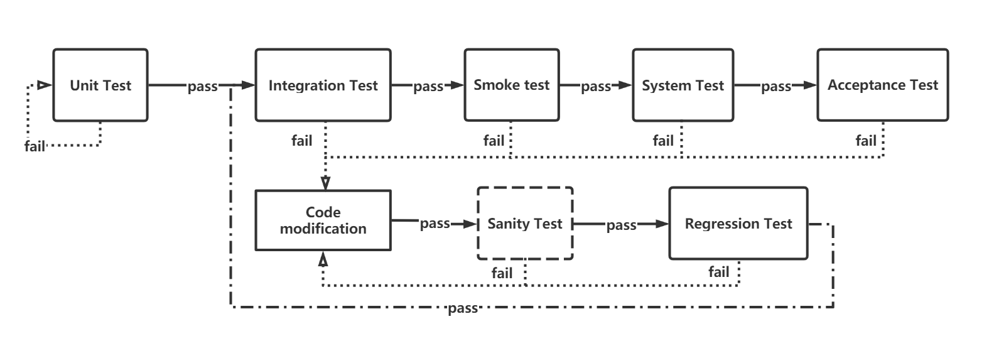

[toc]
<a name="a38f6feb"></a>
# —— Software Testing ——
软件测试：在规定的条件下对程序进行操作，以发现程序错误，衡量软件质量，并对其是否能满足设计要求进行评估的过程。<br />软件测试的对象：源程序、目标程序、数据及相关文档<br />软件测试流程：需求分析-->测试计划-->测试设计-->测试环境搭建-->测试执行-->测试记录-->缺陷管理-->软件评估<br />所需能力

- 业务分析能力<br />
- 缺陷洞察能力<br />
- 团队协作能力<br />
- 专业技术能力<br />
- 逻辑思考能力<br />
- 问题解决能力<br />
- 沟通表达能力<br />
- 宏观把控能力<br />


<a name="d0771a42"></a>
# 分类
<a name="ea340b9d"></a>
## 方法
黑盒测试（Black-box Testing）

- 等价类划分法：将程序所有可能的输入域（有效的和无效的）划分成若干个等价类。从中选取少数具有代表性的数据进行测试，避免穷举产生的大量用例。<br />
- 边界值分析法（Boundary Value Analysis）：对等价类划分法的补充，针对每个等价类的边界值，随机选取一个测试点<br />
- 场景法<br />
- 因果图法（Cause/Effect Graphing）：使用一种适合于描述多种条件的组合，产生多个相应动作的测试方法<br />
- 判定表分析法：是分析和表达多种输入条件下系统执行不同动作的技术<br />
- 正交试验法（Orthogonal Experimental Design）：混合正交表（allpairs是自动生成组合测试用例）<br />
- 功能图法<br />
- 错误推测法：基于以往的经验和直觉，参照以往的软件系统出现的错误，推测程序中所有可能存在的各种缺陷和错误，然后有针对性地设计测试用例。<br />

白盒测试（White-box Testing）<br />通过检查软件内部的逻辑结构，对软件中的逻辑路径进行覆盖测试；在程序的不同地方设立检查点，检查程序的状态，以确定实际运行状态与预期状态是否一致<br />原则

- 保证一个模块中所有路径至少被测试一次。<br />
- 所有逻辑值都要测试真（true）和假（false）两种情况。<br />
- 检查程序的内部数据结构是否有效。<br />
- 在上、下边界及可操作范围内运行所有循环。<br />

方法

- 基本路径测试法<br />
- 代码检査法<br />
- 静态结构分析法<br />
- 静态质量度量法<br />
- 逻辑覆盖法：包括语句覆盖，判断覆盖，条件覆盖，判断/条件覆盖，条件组合覆盖，路径覆盖等。<br />
- 域测试<br />
- 符号测试<br />
- 程序变异<br />

灰盒测试（Gray-Box Testing）：多用于集成测试阶段，不仅关注输出、输入的正确性，同时也关注程序内部的情况。
<a name="a465db53"></a>
## 方向
功能测试：检查实际功能是否符合用户的需求<br />逻辑功能测试、界面测试、易用性测试、兼容性测试、安装测试等。<br />兼容测试（Compatibility Test Suite ）：所设计程序与硬件、软件之间的兼容性的测试。

- 硬件兼容：与整机兼容、与外设兼容<br />
- 软件兼容：操作系统/平台、应用软件之间的兼容、不同浏览器的兼容、数据库的兼容、分辨率<br />

性能测试 (performance testing)：通过测试工具模拟多种正常、峰值以及异常负载条件来对系统的各项性能指标进行的测试。

- 负载测试（Load Testing）：通过在被测系统上不断加压，直到性能指标达到极限<br />
- 压力测试（Stress Testing，强度测试）：测试系统在一定饱和状态下，例如CPU、内存在饱和使用情况下，系统能够处理的会话能力，以及系统是否会出现错误。<br />
- 并发测试：通过模拟用户并发访问，测试多用户并发访问同一个应用、同一个模块或者数据记录时是否存在死锁或其者他性能问题。<br />
- 配置测试：通过对被测系统的软\硬件环境的调整，了解各种不同对系统的性能影响的程度，从而找到系统各项资源的最优分配原则<br />
- 可靠性测试：在给系统加载一定业务压力的情况下，使系统运行一段时间，以此检测系统是否稳定。<br />

吞吐量：通信通道上单位时间能成功传递的平均资料量，比特每秒（bit/s或bps）<br />吞吐率：单位时间内网络上传输的数据量，即单位时间内处理客户请求数量。<br />事务：一个客户机向服务器发送请求然后服务器做出反应的过程

- TPS (Transaction Per second) ：每秒钟系统能够处理事务或交易的数量，衡量系统处理能力的重要指标。<br />
- QPS（Queries Per Second，每秒查询数）<br />

RT（Response Time，响应时间）<br />QPS(TPS)=并发数/平均响应时间<br />响应时间的“2-5-8原则”

- 当用户能够在2秒以内得到响应时，会感觉系统的响应很快；<br />
- 当用户在2-5秒之间得到响应时，会感觉系统的响应速度还可以；<br />
- 当用户在5-8秒以内得到响应时，会感觉系统的响应速度很慢，但是还可以接受；<br />
- 而当用户在超过8秒后仍然无法得到响应时，会感觉系统糟透了，或者认为系统已经失去响应，而选择离开这个Web站点，或者发起第二次请求。<br />

2-8原则：80%的bug多发生在软件的20%的模块<br />点击率（Hit Per Second）<br />PV（Page View）：页面访问量<br />UV（Unique Visitor）：独立访客<br />DAU(Daily Active User)，日活跃用户数量<br />MAU(Month Active User)：月活跃用户数量<br />APP性能指标：内存、CPU、流量、电量、启动速度、滑动速度、界面切换速度、与服务器交互的网络速度。<br />安全测试：IT软件产品的生命周期中，对产品进行检验以验证产品符合安全需求定义和产品质量标准的过程。<br />渗透测试 (Penetration test)：通过模拟恶意黑客的攻击方法，来评估计算机网络系统安全的一种评估方法。<br />阶段<br />1、单元测试（Unit Testing）：又称模块测试，针对单一的程序模块进行的测试。<br />2、集成测试（Integration Testing）：又叫组装测试，在单元测试的基础上，对所有模块进行测试。<br />3、系统测试（System Testing）：将整个软件看做一个整体来进行测试，包括功能、性能、兼容性<br />4、验收测试（Acceptance Testing）：按照软件任务书或合同、供需双方约定的验收依据进行测试，决定是否接收<br />(1)、内测版(alpha)内部交流版本，可能存在很多bug，不建议用户安装。<br />(2)、公测版(beta)面向所有用户，通过用户的反馈再去修改细节。<br />(3)、候选版(gamma)与正式软件相差无几。<br />V模型：需求分析、概要设计、详细设计、编码、单元测试、集成测试、系统测试、验收测试;
```
原来格式为表格（table），转换较复杂，未转换，需要手动复制一下
{"cells":[{"verticalAlign":"middle","wrap":true,"value":"系统测试"},{"verticalAlign":"middle","wrap":true,"value":"验收测试"},{"verticalAlign":"middle","wrap":true,"value":"测试软件的端到端功能。"},{"verticalAlign":"middle","wrap":true,"value":"测试软件是否符合规定的要求和用户要求。"},{"verticalAlign":"middle","wrap":true,"value":"只有开发人员和测试人员才能执行系统测试。"},{"verticalAlign":"middle","wrap":true,"value":"它可以由测试人员，利益相关者和客户执行。"},{"verticalAlign":"middle","wrap":true,"value":"可以是非功能性和功能性测试。"},{"verticalAlign":"middle","wrap":true,"value":"只能是功能测试。"},{"verticalAlign":"middle","wrap":true,"value":"可测试整个系统的性能。"},{"verticalAlign":"middle","wrap":true,"value":"测试系统是否符合要求。"},{"verticalAlign":"middle","wrap":true,"value":"使用由测试团队选择的演示输入值。"},{"verticalAlign":"middle","wrap":true,"value":"使用用户提供的实际实时输入值。"},{"verticalAlign":"middle","wrap":true,"value":"包括完整规范的测试，包括软件和硬件，内存和用户数量。"},{"verticalAlign":"middle","wrap":true,"value":"是否满足用户的所有需求。"},{"verticalAlign":"middle","wrap":true,"value":"系统测试是系统测试和集成测试的组合。"},{"verticalAlign":"middle","wrap":true,"value":"验收测试是alpha测试和beta测试的组合。"},{"verticalAlign":"middle","wrap":true,"value":"涉及非功能测试下的负载和压力测试。"},{"verticalAlign":"middle","wrap":true,"value":"涉及功能测试下的边界值分析，等价分配和决策表。"},{"verticalAlign":"middle","wrap":true,"value":"发现的缺陷认为是固定的。"},{"verticalAlign":"middle","wrap":true,"value":"发现的缺陷视为产品故障。"}],"heights":[40,40,40,40,40,40,40,40,40,40],"widths":[268,273]}
```

- 冒烟测试（Smoke testing）：对一个新版本进行大规模的系统测试之前，先验证一下软件的基本功能是否实现，是否具备可测性<br />
- 健全测试（Sanity testing）：<br />
- 回归测试（Regression Testing）：修改了旧代码后，重新进行测试以确认修改后没有引入新的错误或导致其他代码产生错误。<br />
```
原来格式为表格（table），转换较复杂，未转换，需要手动复制一下
{"cells":[{"verticalAlign":"middle","wrap":true,"value":"冒烟测试"},{"verticalAlign":"middle","wrap":true,"value":"健全测试"},{"verticalAlign":"middle","wrap":true,"value":"它是一种测试应用程序所有部分测试位置的广泛方法。"},{"verticalAlign":"middle","wrap":true,"value":"它是一种测试应用程序特定部分的狭隘方法。"},{"verticalAlign":"middle","wrap":true,"value":"它通过执行严格的测试来测量系统的稳定性。"},{"verticalAlign":"middle","wrap":true,"value":"它通过执行严格的测试来衡量系统的合理性。"},{"verticalAlign":"middle","wrap":true,"value":"可以手动或自动进行。"},{"verticalAlign":"middle","wrap":true,"value":"可以在没有测试用例或脚本的情况下完成健全性测试。"},{"verticalAlign":"middle","wrap":true,"value":"它由测试人员和开发人员执行。"},{"verticalAlign":"middle","wrap":true,"value":"它仅由测试人员执行。"},{"verticalAlign":"middle","wrap":true,"value":"测试是在没有深入的情况下完成的，但是每当需要时，测试人员必须深入研究"},{"verticalAlign":"middle","wrap":true,"value":"完整性测试不需要深入了解应用程序。"},{"verticalAlign":"middle","wrap":true,"value":"记录到文档。"},{"verticalAlign":"middle","wrap":true,"value":"不用记录到文档。"},{"verticalAlign":"middle","wrap":true,"value":"它用于测试应用程序的端到端功能。"},{"verticalAlign":"middle","wrap":true,"value":"它仅用于测试修改或缺陷固定功能。"},{"verticalAlign":"middle","wrap":true,"value":"它被视为验收测试的子集。"},{"verticalAlign":"middle","wrap":true,"value":"它被认为是回归测试的一个子集。"}],"heights":[40,40,40,40,40,40,40,40,40],"widths":[275,265]}
```

- 埋点测试<br />
- MOCK打桩测试<br />

埋点：针对特定用户行为或事件进行捕获、处理和发送的相关技术及其实施过程

- 代码埋点：在你需要统计数据的地方植入N行代码，统计用户的关键行为<br />
- 可视化埋点<br />
- 无/全埋点：先尽可能收集所有控件的操作数据，然后再通过界面配置哪些数据需要在系统里面进行分析<br />
<a name="3fea7ca7"></a>
## 状态
静态测试（Static Testing）：被测程序不运行，只依靠分析或检查源程序的语句、结构、过程等来检查程序是否有错误。<br />动态测试（Dynamic Testing）：通过运行被测试程序，对得到的运行结果与预期的结果进行比较分析，同时分析运行效率和健壮性能等<br />静态质量：度量所依据的标准是ISO9126。软件的质量用以下几个方面来衡量，即功能性(Functionality)、可靠(Reliability)、可用性(Usability)、有效性(Efficiency)、可维护性（Maintainability）、可移植性(Portability)。
<a name="a0496123"></a>
## 行为
人工测试（Manual Testing，MT）<br />自动化测试（Automatic Testing，AT）<br />对象<br />程序测试<br />文档测试
<a name="62dd68e9"></a>
# 测试流程
<a name="195af93f"></a>
## 需求分析
需求表现形式

- 产品原型（Prototype）<br />
- 需求文档<br />
- 口述<br />

阶段内容

- 梳理业务流程——流程图<br />
- 提取功能点<br />
- 编写需求分析说明书<br />

需求不明

- 问产品经理<br />
- 根据经验<br />
- 参考同行<br />
<a name="06bdebeb"></a>
## 测试设计
测试计划：模板文档编写

- 概述<br />
- 测试目的<br />
- 软件结构<br />
- 测试环境<br />
- 测试内容<br />
- 时间人员安排<br />
- 各个阶段的输入输出<br />
- 测试活动管理<br />
- 测试标准<br />

测试方案（策略）

- 风险分析<br />
- 技术工具<br />

设计测试用例<br />测试用例（Test Case）：为某个特殊目标而编制的一组测试输入、执行条件以及预期结果，以便测试某个程序路径或核实是否满足某个特定需求。<br />即把测试系统的操作步骤用按照一定的格式用文字描述出来。<br />遵守5C原则（Correct准确、Clear清晰、Concise简洁、Complete完整、Consistent一致）<br />测试用例应包括：编号，标题，优先级，前提条件，测试数据，测试步骤，预期结果，实际结果。<br />用例评审
<a name="f5744906"></a>
## 测试执行
执行测试用例<br />缺陷（Bug）管理<br />版本管理<br />版本迭代：增量测试、全量测试<br />软件缺陷<br />1、软件没有实现产品的说明书所描述的功能。<br />2、软件实现了产品说明书描述不应有的功能。<br />3、软件执行了产品说明书没讲的操作。<br />4、软件没有实现产品说明书没讲但应该实现的功能。<br />5、从软件测试员的角度来看，软件难以理解、不易使用、运行缓慢，或者最终用户认为不对。<br />软件缺陷（Bug）记录的内容

- bug编号<br />
- bug严重级别及优先级<br />
- bug产生的模块<br />
- 复现步骤<br />
- 附件（截图、录像、日志）<br />
- 发现日期、发现人、修改日期、修改人、修改方法、回归结果等<br />

有效的发现Bug需参考需求以及详细设计等前期文档设计出高效的测试用例，然后严格执行测试用例，对发现的问题要充分确认肯定，然后再向外发布如此才能提高提交Bug的质量。<br />缺陷等级

- 致命：一招毙命的缺陷，使你的系统无法运行，有造成数据泄漏的安全性问题。<br />
- 严重：可以引起易于纠正的异常情况、可能引起易于修复的故障或对产品外观难以接受的缺陷。<br />
- 一般：指不影响产品的运转和运行、不会成为故障起因，但对产品外观和下道工序影响较大的缺陷<br />
- 轻微：对产品外观和下道工序可能会有轻微影响的缺陷<br />
- 建议：增加用户使用体验的建议性问题。（一般情况下，建议也为做为缺陷的一种。这个跟系统的类型与需求有关）<br />

缺陷优先级（priority）<br />BUG的生命周期：提交->确认->分配->修复->验证->关闭<br />缺陷状态

- 打开： 表示问题被提交等待有人处理。<br />
- 重新指派 ： 问题被重新指派给某人处理。<br />
- 处理 ： 问题在处理中，尚未完成。<br />
- 固定 ： 确认此问题存在，但暂时不进行处理。<br />
- 回归 ： 对已经修复的问题进行回归确认。<br />
- 关闭 ： 问题的最后一个状态。<br />
<a name="83f84910"></a>
## 测试总结
测试报告

- 工作总结<br />
- 缺陷（Bug）统计分析<br />
- 软件评估<br />
- 达标<br />
- 所有的需求已经全部完成<br />
- 并且123级的BUG已经全部被解决<br />
- 不达标<br />
- 哪些需求还没完成<br />
- 还有多少BUG没有修改<br />

QA & QC<br />软件质量保证与质量控制的区别
```
原来格式为表格（table），转换较复杂，未转换，需要手动复制一下
{"cells":[{"verticalAlign":"middle","wrap":true,"value":"项目"},{"verticalAlign":"middle","wrap":true,"value":"QA"},{"verticalAlign":"middle","wrap":true,"value":"QC"},{"verticalAlign":"middle","wrap":true,"value":"定义"},{"verticalAlign":"middle","wrap":true,"value":"一组活动，可确保始终保持软件开发过程中使用的过程质量。"},{"verticalAlign":"middle","wrap":true,"value":"一组用于检测已开发软件中的缺陷的活动。"},{"verticalAlign":"middle","wrap":true,"value":"关注重点"},{"verticalAlign":"middle","wrap":true,"value":"通过关注流程来防止开发软件中的缺陷。"},{"verticalAlign":"middle","wrap":true,"value":"通过关注测试过程来识别开发软件中的缺陷。"},{"verticalAlign":"middle","wrap":true,"value":"如何做"},{"verticalAlign":"middle","wrap":true,"value":"建立高质量的管理系统，并定期审核开发软件的操作是否符合要求。"},{"verticalAlign":"middle","wrap":true,"value":"通过使用开发软件中的测试技术和工具来检测和消除质量问题元素。"},{"verticalAlign":"middle","wrap":true,"value":"为什么做"},{"verticalAlign":"middle","wrap":true,"value":"通过使用包括文档在内的系统活动来确保质量问题的预防。"},{"verticalAlign":"middle","wrap":true,"value":"通过使用流程和技术来实现和维护高质量的软件，从而确保识别和消除缺陷。"},{"verticalAlign":"middle","wrap":true,"value":"面向"},{"verticalAlign":"middle","wrap":true,"value":"面向流程"},{"verticalAlign":"middle","wrap":true,"value":"面向产品"},{"verticalAlign":"middle","wrap":true,"value":"过程类型"},{"verticalAlign":"middle","wrap":true,"value":"一个积极主动的过程。它关注改善开发; 在测试期间不会出现缺陷。"},{"verticalAlign":"middle","wrap":true,"value":"一种反应过程，因为它涉及在产品开发之后和产品发布之前识别缺陷。"},{"verticalAlign":"middle","wrap":true,"value":"责任"},{"verticalAlign":"middle","wrap":true,"value":"开发团队的每个成员都负责QA"},{"verticalAlign":"middle","wrap":true,"value":"只有特定的测试团队负责QC"},{"verticalAlign":"middle","wrap":true,"value":"示例"},{"verticalAlign":"middle","wrap":true,"value":"验证软件流程。"},{"verticalAlign":"middle","wrap":true,"value":"检验软件功能和流程。"}],"heights":[40,40,40,40,40,40,40,40,40],"widths":[85,267,256]}
```
<br />软件测试规范<br />[http://ishare.iask.sina.com.cn/f/192n3HTrJeP.html]()<br />qa study<br />测试左移（Testing Shift Left）<br />测试左移是向测试之前的开发阶段移动。<br />测试团队在软件开发周期早期和所有干系人合作。因此他们能清晰地理解需求以及设计测试用例去帮助软件“快速失败”，促使团队更早的修改所有的 Bug。更深入的参与和理解会促进测试人员获取产品完整的知识，彻底想清楚各种场景，并根据软件行为设计实时的场景，这些都会帮助团队在编码完成之前识别出一些缺陷。<br />测试左移聚焦在使测试人员在全部和最重要的项目阶段参与进来。这就是测试人员把焦点从发现 Bug 转移到 Bug 的预防上，同时也驱动项目的商业目标。<br />测试右移（Testing Shift Right）<br />测试右移是测试活动向产品发布之后的步骤移动。<br />产品上线了之后也可以进行一些测试活动。主要关注的是产品性能及可用性监控，以及新功能的测试。通过测试右移可以在生产环境做监控，监控线上性能和可用率，一旦线上发生任何问题，尽快反应，提前反应，给用户良好的体验。

- 使用模板快速编写测试用例<br />
- Lego-美团接口自动化测试实践<br />
<a name="1b6ad7ff"></a>
# 自动化测试
使用独立于待测软件的其他软件来自动执行测试、比较实际结果与预期并生成测试报告这一过程<br />分类

- 图形用户交互界面测试（GUI Based Testing）：使用能够产生图形用户界面操作（如出表点击、键盘输入等）的测试框架，模拟用户动作来以观察、验证程序是否正确的响应<br />
- 接口测试（API Based Testing）：通过调用接口（API）绕过GUI，，以应用到验证的行为进行测试。<br />
- Arrange: 准备测试数据，构造请求<br />
- Act: 通过不同的参数来调用接口，并拿到返回<br />
- Assert: 断言，判断结果<br />
- 数据库校验<br />

常用的框架/脚本模式

- 线性测试<br />
- 结构化测试（使用控制分支结构）<br />
- 数据驱动测试（Data-driven testing）：配合一个有许多测试输入及对应的验证输出值的表格，而其测试环境设定及控制不会固定在程式码中<br />
- 关键字驱动测试（keyword-driven testing），也称为表格驱动测试（table-driven testing）或行动字驱动测试（action-word testing），创建测试程序的步骤分为规划及实现二个阶段。<br />
- 基于模型的测试（Model-based testing）：测试用例可以完全或部分的利用模型自动产生。<br />
- 代码驱动的测试<br />
- 行为驱动开发（Behavior-driven development，BDD）：一种敏捷软件开发的技术，它鼓励软件项目中的开发者、QA和非技术人员或商业参与者之间的协作。<br />
- 混合模式（混合使用多种模式）<br />
- 敏捷开发自动化测试框架<br />

POM（Page Object Model，页面对象模型）<br />页面定位和业务操作分开，分离了测试对象和测试脚本<br />PageModle：每个页面都有一个PageClass，标识该页面的Web元素，并包含对这些Web元素执行操作的方法<br />TestCase：测试用例管理部分，一个功能点可以对应一个或者多个case，尽可能的提高覆盖率
```javascript
from utils.seleniumtools import find_elemenet
class AdminloginPage():
    
    # 1. 封装要使用的元素
    def __init__(self, driver):
        self.driver = driver
        self.username = ("name", "username")
        self.password = ("name", "login_pwd")
        self.loginbtn = ("xpath", '/html/body/div[1]/div/div[2]/div/form/div/div[3]/button')
    # 2.封装对应的动作
    def go_login_page(self):
        self.driver.get("http://118.24.255.132:9090/shopxo/admin.php?s=/admin/logininfo.html")
        
    # 登录动作
    def login(self, u, p):
        find_elemenet(self.driver, self.username).send_keys(u)
        find_elemenet(self.driver, self.password).send_keys(p)
        find_elemenet(self.driver, self.loginbtn).click()
```
<a name="17ee24c9"></a>
# 软件开发方法（software development methodology, SDM）
DevOps（Development和Operations的组合词）是一种重视“软件开发人员（Dev）”和“IT运维技术人员（Ops）”之间沟通合作的文化、运动或惯例。透过自动化“软件交付”和“架构变更”的流程，来使得构建、测试、发布软件能够更加地快捷、频繁和可靠。<br />极限编程（Extreme programming，XP），一种软件工程方法学，是敏捷软件开发的一种方式。<br />迭代式开发（迭代增量式开发，迭代进化式开发）：整个开发工作被组织为一系列的短小的、固定长度（如3周）的小项目，被称为一系列的迭代。

- 迭代——某版本的生产过程，包括从需求分析到测试完成。<br />
- 版本——某阶段软件开发的结果，一个可交付使用的产品。<br />
<a name="507829ed"></a>
# 实践
测试驱动开发（Test-driven development，TDD）是一种软件开发过程中的应用方法，倡导先写测试程序，然后编码实现其功能得名。

- 驱动代码的设计和功能的实现 -->  驱动代码的再设计和重构

验收性测试驱动开发（Acceptance Test Driven Development，ATDD）：整个团队在开发工作之前，一起讨论、制定每个任务的验收标准，并提取测试用例。<br />持续集成（Continuous integration，CI）是一种软件工程流程，将所有软件工程师对于软件的工作副本持续集成到共享主线（mainline）的一种举措。<br />持续交付（Continuous delivery，CD），是一种软件工程手法，让软件产品的产出过程在一个短周期内完成，以保证软件可以稳定、持续的保持在随时可以释出的状况。<br />持续部署（Continuous deployment，CD），是一种软件工程方法，在软件开发流程中，以自动化方式，频繁而且持续性的，将软件部署到生产环境（production environment）中，使软件产品能够快速的发展<br />语义化版本规范<br />版本控制命名格式: 主版本号.子版本号[.修正版本号[.编译版本号 ]]<br />Major.Minor [.Revision[.Build]]

- Major ：具有相同名称但不同主版本号的程序集不可互换。适用于对产品的大量重写，无法实现向后兼容<br />
- Minor ：显著增强，但照顾到了向后兼容性。适用于产品的修正版或完全向后兼容的新版本。<br />
- Build ：表示对相同源所作的重新编译。适用于更改处理器、平台或编译器的情况。<br />
- Revision ：适用于修复以前发布的程序集中的安全漏洞。<br />

alpha: 内部版本<br />beta: 公测版本<br />rc（Release candiate，正式版本的候选版本）<br />LTS (Long Term Support，长期支持)
<a name="fe559af6"></a>
# Testing Tools
<a name="Jira"></a>
## Jira
基于Java架构的管理系统，开发者是 Atlassian，是集项目计划、任务分配、需求管理、错误跟踪于一体的商业软件。<br />
<a name="Fiddler"></a>
## Fiddler
Fiddler 是以代理web服务器的形式工作的，使用代理地址:127.0.0.1:8888<br />Fiddler能捕获HTTP和HTTPS流量，并将其记录下来供用户查看。它通过使用自签名证书实现中间人攻击来进行日志记录。<br />Using QuickExec
```
原来格式为表格（table），转换较复杂，未转换，需要手动复制一下
{"cells":[{"textAlign":"center","wrap":true,"value":"命令","inlineStyles":{"bold":[{"from":0,"to":2,"value":true}]}},{"textAlign":"center","wrap":true,"value":"对应请求项","inlineStyles":{"bold":[{"from":0,"to":5,"value":true}]}},{"textAlign":"center","wrap":true,"value":"介绍","inlineStyles":{"bold":[{"from":0,"to":2,"value":true}]}},{"textAlign":"center","wrap":true,"value":"示例","inlineStyles":{"bold":[{"from":0,"to":2,"value":true}]}},{"textAlign":"center","wrap":true,"value":"?string"},{"textAlign":"center","wrap":true,"value":"All"},{"wrap":true,"value":"匹配出包含这个字符串的请求"},{"wrap":true,"value":"?google"},{"textAlign":"center","wrap":true,"value":"> | <"},{"textAlign":"center","wrap":true,"value":"Body"},{"wrap":true,"value":"匹配出请求大小"},{"wrap":true,"value":">1000"},{"textAlign":"center","wrap":true,"value":"="},{"textAlign":"center","wrap":true,"value":"Result"},{"value":"=status/=method，查找状态、方法相对应的session会话","inlineStyles":{"color":[{"from":0,"to":36,"value":"#121212"}],"back-color":[{"from":0,"to":16,"value":"#ffffff"}]}},{"value":"=504，=get","inlineStyles":{"color":[{"from":0,"to":9,"value":"#121212"}],"back-color":[{"from":0,"to":9,"value":"#ffffff"}]}},{"textAlign":"center","wrap":true,"value":"@"},{"textAlign":"center","wrap":true,"value":"Host"},{"wrap":true,"value":"@后面跟Host，可以匹配域名"},{"wrap":true,"value":"@www.baidu.com"},{"textAlign":"center","wrap":true,"value":"select"},{"textAlign":"center","wrap":true,"value":"Content-Type"},{"wrap":true,"value":"select后面跟响应类型，可以匹配到相关的类型"},{"wrap":true,"value":"select image"},{"backColor":"transparent","wrap":true,"textAlign":"center","value":"blod"},{"textAlign":"center","wrap":true,"value":"All"},{"value":"加粗目标请求，无参时重置","inlineStyles":{"font-family":[{"from":0,"to":12,"value":"Tahoma"}]}},{},{"textAlign":"center","wrap":true,"backColor":"transparent","value":"cls"},{"textAlign":"center","wrap":true,"value":"All"},{"value":"清屏 (Ctrl+x)","inlineStyles":{"color":[{"from":0,"to":11,"value":"#121212"}],"back-color":[{"from":0,"to":11,"value":"#ffffff"}]}},{"wrap":true,"value":"cls"},{"textAlign":"center","wrap":true,"backColor":"transparent","value":"dump"},{"textAlign":"center","wrap":true,"value":"All"},{"wrap":true,"value":"将所有请求打包成saz压缩包，保存到“我的文档\\Fiddler2\\Captures”"},{"wrap":true,"value":"dump"},{"textAlign":"center","wrap":true,"backColor":"transparent","value":"start"},{"textAlign":"center","wrap":true,"value":"All"},{"wrap":true,"value":"开始监听请求"},{"wrap":true,"value":"start"},{"textAlign":"center","wrap":true,"backColor":"transparent","value":"stop"},{"textAlign":"center","wrap":true,"value":"All"},{"wrap":true,"value":"停止监听请求"},{"wrap":true,"value":"stop"},{"backColor":"transparent","wrap":true,"textAlign":"center","value":"urlreplace"},{"textAlign":"center","wrap":true,"value":"All"},{"value":"Replace any string in URLs with a different string."},{"value":"urlreplace SeekStr ReplaceWithStr"},{"backColor":"transparent","wrap":true,"textAlign":"center","value":"allbut / keeponly"},{"textAlign":"center","wrap":true,"value":"Content-Type"},{"value":"Hide all sessions except those where Content-Type header contains the specified string"},{"value":"allbut xml"}],"heights":[40,40,40,40,40,40,40,40,40,40,40,40,40],"widths":[74,117,446,156]}
```
断点
```
原来格式为表格（table），转换较复杂，未转换，需要手动复制一下
{"cells":[{"textAlign":"center","wrap":true,"value":"命令","inlineStyles":{"bold":[{"from":0,"to":2,"value":true}]}},{"textAlign":"center","wrap":true,"value":"对应请求项","inlineStyles":{"bold":[{"from":0,"to":5,"value":true}]}},{"textAlign":"center","wrap":true,"value":"介绍","inlineStyles":{"bold":[{"from":0,"to":2,"value":true}]}},{"textAlign":"center","wrap":true,"value":"示例","inlineStyles":{"bold":[{"from":0,"to":2,"value":true}]}},{"textAlign":"center","wrap":true,"value":"bpafter"},{"textAlign":"center","wrap":true,"value":"All"},{"wrap":true,"value":"bpafter后边跟一个字符串，表示中断所有包含该字符串的请求"},{"wrap":true,"value":"bpafter baidu（输入bpafter解除断点）"},{"textAlign":"center","wrap":true,"value":"bpu"},{"textAlign":"center","wrap":true,"value":"All"},{"wrap":true,"value":"与bpafter类似，只是收到请求了，中断响应"},{"wrap":true,"value":"bpu baidu（输入bpu解除断点）"},{"textAlign":"center","wrap":true,"value":"bps"},{"textAlign":"center","wrap":true,"value":"Result"},{"wrap":true,"value":"后面跟状态吗，表示中断所有是这个状态码的请求"},{"wrap":true,"value":"bps 200（输入bps解除断点）"},{"textAlign":"center","wrap":true,"value":"bpv / bpm"},{"textAlign":"center","wrap":true,"value":"HTTP方法"},{"wrap":true,"value":"只中断HTTP方法的命令，HTTP方法如POST、GET"},{"wrap":true,"value":"bpv get（输入bpv解除断点）"},{"textAlign":"center","wrap":true,"value":"g / go"},{"textAlign":"center","wrap":true,"value":"All"},{"wrap":true,"value":"放行所有中断下来的请求"},{"wrap":true,"value":"g"}],"heights":[40,40,40,40,40,40],"widths":[74,94,411,268]}
```
Breakpoint（断点）

- Rules-> Automatic Breakpoint  ->Before Requests | After Response<br />
- bpu | bpafter  string<br />

Filters<br />REGEX:(?insx)/[^?/]_.(css|ico|jpg|png|gif|bmp|wav)(?._)?$<br />REGEX: 表示启用正则表达式<br />(?insx) 设置正则解释的规则，忽略大小写等。<br />手机抓包<br />1 手机和电脑在同一局域网<br />2 fiddler开启远程连接

3. 手机设置网络代理，指向局域网中fiddler的地址（IP+PORT）<br />
3. 手机端用浏览器通过 fiddler的地址（xx.xx.xx.xx:8888）下载fiddler证书并安装<br />
3. 抓包测试完毕，记得关闭手机中的代理，删除手机端安装的fiddler证书<br />

android7.0+的版本新增了证书验证(系统证书)<br />ios13.0+  需要插件 CertMaker for iOS and Android<br />[https://www.telerik.com/fiddler/add-ons](https://www.telerik.com/fiddler/add-ons)<br />脚本<br />菜单->Rules->Customize Rules…（Ctrl+R）<br />beforerequest<br />显示IP
```javascript
static function Main() 
//显示IP地址
FiddlerObject.UI.lvSessions.AddBoundColumn ("ServerIP", 120, "X-HostIP");
```
模拟弱网：Rules->Performance->Simulate Modem Speeds
```javascript
if (m_SimulateModem) {
            // Delay sends by 300ms per KB uploaded.
            oSession["request-trickle-delay"] = "300"; 
            // Delay receives by 150ms per KB downloaded.
            oSession["response-trickle-delay"] = "150"; 
        }
```
过滤并高亮显示host / url
```javascript
if( oSession.host.IndexOf("host") > -1 || oSession.host.IndexOf("host") > -1){
 	oSession["ui-color"] = "green";
}
if(oSession.url.IndexOf("url_path") > -1){
     oSession["ui-color"] = "yellow";
}
```
设置请求的header
```javascript
// TSET FOR Spider： 根据网站来限定请求
if (oSession.HostnameIs("test.com")) {
    // 模拟修改请求的用户端ip，这种情况对独立的网络有效，对于公司级的网络，还是有一些问题，需要借助vpn
    oSession.oRequest["X-Forwarded-For"]="16.12.23.16";
    // 修改请求的header
    oSession.oRequest["User-Agent"] = "spider Mozilla/5.0 (Windows NT 6.1; WOW64) AppleWebKit/537.36 (KHTML, like Gecko) Chrome/72.0.3626.81 Safari/537.36 SE 2.X MetaSr 1.0";
}
```
删除所有的cookie oSession.oRequest.headers.Remove("Cookie");<br />新建cookie oSession.oRequest.headers.Add("Cookie", "username=testname;testpassword=P@ssword1");
```javascript
if (oSession.HostnameIs("******") && oSession.oRequest.headers.Exists("Cookie") ) {
    var sCookie = oSession.oRequest["Cookie"]; 
    //用replace方法或者正则表达式的方法去操作cookie的string
    //sCookie = sCookie.Replace("cookieName=", "ignoreme="); 
    sCookie = sCookie + ";tt_spver=1";
    oSession.oRequest["Cookie"] = sCookie; 
}
```
beforerespond<br />修改response body
```javascript
if(oSession.HostnameIs("host") && oSession.url.IndexOf("url_path") > -1){
        // 获取response中的body字符串
        var strBody=oSession.GetResponseBodyAsString();
        // 用正则表达式或者replace方法去修改string
        var regx = '"stream_mode":\d*?'
        strBody=strBody.replace(regx,'"stream_mode":0');
        // 弹个对话框检查下修改后的body               
        FiddlerObject.alert(strBody);
        // 将修改后的body，重新写回Request中
        oSession.utilSetResponseBody(strBody);
    }
```
修改json
```javascript
if(oSession.HostnameIs("host") && oSession.url.IndexOf("url_path") > -1){
        // 获取Response Body中JSON字符串
        var responseStringOriginal =  oSession.GetResponseBodyAsString();
        // 转换为可编辑的JSONObject变量
        var responseJSON = Fiddler.WebFormats.JSON.JsonDecode(responseStringOriginal);
        // 修改JSONObject变量，修改字段数据
        responseJSON.JSONObject["new_core"] = "True";  
        responseJSON.JSONObject["stream_mode"] = 5;
        // 重新设置Response Body
        var responseStringDestinal = Fiddler.WebFormats.JSON.JsonEncode(responseJSON.JSONObject);
        oSession.utilSetResponseBody(responseStringDestinal);
	}
```
支持 CORS
```javascript
static function OnBeforeResponse(oSession: Session) {
        	...
        	if(oSession.uriContains("要处理的url")){
        		oSession.oResponse["Access-Control-Allow-Origin"] =  "允许的域名";
        		oSession.oResponse["Access-Control-Allow-Credentials"] = true;
        	}
    }
```
返回404
```javascript
if(oSession.HostnameIs("host1") && oSession.url.IndexOf("url_path1") > -1){
        //说明已经拿到了播放请求接口,将其返回网络状态码修改成：404
        oSession.oResponse.headers.HTTPResponseCode = 404;
        oSession.oResponse.headers.HTTPResponseStatus = "use fiddler change responed code";
	
     }
```
Guide

- Modifying a Request or Response<br />
- FiddlerScript<br />
<a name="Jmeter"></a>
## Jmeter
bin

- examples 目录中有 CSV样例<br />
- jmeter.bat	启动JMeter (默认GUI模式)<br />
- jmeterw.cmd	启动JMeter没有windows shell控制台 (默认GUI模式)<br />
- jmeter-n.cmd	一个JMX文件在运行非GUI测试<br />
- jmeter-n-r.cmd	一个JMX文件在运行非GUI远程测试<br />
- jmeter-t.cmd	一个JMX文件在GUI模式下加载它<br />
- jmeter-server.bat	分布式测试的服务器配置<br />
- mirror-server.cmd	在非GUI模式下运行JMeter镜像服务器<br />
- shutdown [.cmd|.sh]	平滑缓慢的关闭<br />
- stoptest [.cmd|.sh]	迅速关闭<br />
- jmeter.properties 系统配置文件<br />
- Jmeter.log<br />

jmeter.properties
```javascript
sampleresult.default.encoding=UTF-8	解决中文乱码
language=zh_CN		默认简体中文
```
插件管理器<br />Download plugins-manager.jar and put it into lib/ext directory, then restart JMeter<br />测试计划（Test Plan）<br />线程组(Thread Group)	相当于一个业务流程；<br />线程属性 ThreadProperties

- 线程数（Number of Threads）：虚拟用户数量<br />
- Ramp-Up时间：在X秒内启动上面配置的线程数<br />
- 循环次数（Loop Count）：循环模拟的次数<br />

测试片段（Test Fragment）：控制器上的一个种特殊的线程组<br />配置元素(Configuration Elements)：提供对静态数据配置的支持<br />预处理器元素(Pre-Processor Elements)<br />定时器(Timers)

- Synchronizing Timer（集合点：同步虚拟用户，使得所设置数目的虚拟用户聚集在某个时间点前，然后在同一时刻执行某项操作任务）

控制器(Controllers)<br />取样器（Sampler）：向服务器发送请求，记录响应信息，记录响应时间的最小单元<br />后处理器元素(Post-Processor Elements)<br />断言（Assertions）<br />监听器(Listeners)<br />聚合报告

- Samples： 总共发给服务器的请求数量<br />
- Average： 单个请求的平均响应时间，单位是毫秒<br />
- Median： 50%的请求的响应时间<br />
- 90%Line： 90%的请求的响应时间<br />
- Min： 最小的响应时间<br />
- Max： 最大的响应时间<br />
- Error%： 错误率=错误的请求的数量/请求的总数<br />
- Throughput： 吞吐量即表示每秒完成的请求数<br />
- Received KB/sec： 每秒从服务器端接收到的数据量<br />
- Sent KB/Sec： 每秒从发送到服务器端的数据量<br />

录制脚本<br />测试计划——非测试元件——HTTP代理服务器<br />配置 HTTP代理服务器，端口号（Port）：8888（默认）<br />启动代理服务器，会在jmeter的bin目录下生成一个安全证书文件：ApacheJMeterTemporaryRootCA.crt<br />设置系统或浏览器代理服务器与Jmeter一致（浏览器导入证书即可开始）<br />添加排除模式    .*.(js|css|PNG|jpg|ico|png|gif|jpeg)<br />参数化

- CSV数据控件<br />
- 用户定义的变量<br />
- 用户参数<br />

${变量名}<br />提取

- Xpath<br />
- JSON 提取器表达式，$..<字段名><br />
- 正则<br />

函数列表<br />${__functionName(var1,var2,var3)}	如果参数本身带逗号，使用‘,’来转义
```
原来格式为表格（table），转换较复杂，未转换，需要手动复制一下
{"cells":[{"wrap":true,"value":"函数类型"},{"wrap":true,"value":"名称"},{"wrap":true,"value":"注解"},{"wrap":true,"value":"信息"},{"wrap":true,"value":"threadNum"},{"wrap":true,"value":"获取线程号"},{"wrap":true,"value":"信息"},{"wrap":true,"value":"samplerName"},{"wrap":true,"value":"获取采样器名称(标签)。"},{"wrap":true,"value":"信息"},{"wrap":true,"value":"log"},{"wrap":true,"value":"记录(或显示)消息(并返回值)。"},{"wrap":true,"value":"信息"},{"wrap":true,"value":"machineName"},{"wrap":true,"value":"获取本地计算机名称。"},{"wrap":true,"value":"输入"},{"wrap":true,"value":"StringFromFile"},{"wrap":true,"value":"从文件中读取一行。"},{"wrap":true,"value":"输入"},{"wrap":true,"value":"FileToString"},{"wrap":true,"value":"读取整个文件。"},{"wrap":true,"value":"输入"},{"wrap":true,"value":"CSVRead"},{"wrap":true,"value":"从CSV分隔文件中读取。"},{"wrap":true,"value":"输入"},{"wrap":true,"value":"XPath"},{"wrap":true,"value":"使用XPath表达式从文件中读取。"},{"wrap":true,"value":"计算"},{"wrap":true,"value":"Counter"},{"wrap":true,"value":"生成递增数字。"},{"wrap":true,"value":"计算"},{"wrap":true,"value":"intSum"},{"wrap":true,"value":"相加int数字。"},{"wrap":true,"value":"计算"},{"wrap":true,"value":"longSum"},{"wrap":true,"value":"相加long数字。"},{"wrap":true,"value":"计算"},{"wrap":true,"value":"Random"},{"wrap":true,"value":"生成一个随机数。"},{"wrap":true,"value":"计算"},{"wrap":true,"value":"RandomString"},{"wrap":true,"value":"生成随机字符串。"},{"wrap":true,"value":"脚本"},{"wrap":true,"value":"BeanShell"},{"wrap":true,"value":"运行BeanShell脚本。"},{"wrap":true,"value":"脚本"},{"wrap":true,"value":"javaScript"},{"wrap":true,"value":"运行javaScript脚本。"},{"wrap":true,"value":"脚本"},{"wrap":true,"value":"jexl, jexl2"},{"wrap":true,"value":"评估Commons Jexl表达式。"},{"wrap":true,"value":"属性"},{"wrap":true,"value":"Property"},{"wrap":true,"value":"读取property文件。"},{"wrap":true,"value":"属性"},{"wrap":true,"value":"P"},{"wrap":true,"value":"读取一个属性(速记方法)。"},{"wrap":true,"value":"变量"},{"wrap":true,"value":"Split"},{"wrap":true,"value":"将字符串拆分为变量。"},{"wrap":true,"value":"变量"},{"wrap":true,"value":"eval"},{"wrap":true,"value":"评估变量表达式。"},{"wrap":true,"value":"字符串"},{"wrap":true,"value":"regexFunction"},{"wrap":true,"value":"使用正则表达式解析先前的响应。"},{"wrap":true,"value":"字符串"},{"wrap":true,"value":"escapeOroRegexpChars"},{"wrap":true,"value":"引用ORO正则表达式使用的元字符。"},{"wrap":true,"value":"字符串"},{"wrap":true,"value":"Char"},{"wrap":true,"value":"从数字列表生成Unicode char值。"},{"wrap":true,"value":"字符串"},{"wrap":true,"value":"Unescape"},{"wrap":true,"value":"包含Java转义的进程字符串(例如\\n＆\\t)。"},{"wrap":true,"value":"字符串"},{"wrap":true,"value":"unescapeHtml"},{"wrap":true,"value":"解码HTML编码的字符串。"},{"wrap":true,"value":"字符串"},{"wrap":true,"value":"escapeHtml"},{"wrap":true,"value":"使用HTML编码对字符串进行编码。"},{"wrap":true,"value":"字符串"},{"wrap":true,"value":"TestPlanName"},{"wrap":true,"value":"返回当前测试计划的名称。"}],"heights":[40,40,40,40,40,40,40,40,40,40,40,40,40,40,40,40,40,40,40,40,40,40,40,40,40,40,40,40],"widths":[70,178,258]}
```
注意：JMeter函数和变量始终区分大小写。<br />分布式<br />各电脑中的Jmeter环境及脚本路径一致<br />打开Jmeter-server.bat，启动Jmeter<br />执行机：将本地IP地址填写到Jmeter的配置文件（remote_hosts字段）（关闭防火墙、其他虚拟网卡）<br />控制机：将执行机的IP写入配置文件（remote_hosts字段，用,分开）<br />命令行模式<br />jmeter -n -t <testplan.jmx> -l 

- -n 设置命令行模式<br />
- -t 指定JMX脚本路径<br />
- -l 指定结果文件路径（jtl 或 csv格式），参数为结果文件路径，不存在时会自动创建<br />
- -j 指定执行日志路径，会将日志输出至命令行控制台<br />
- -r 设置分布式（远程）执行，默认所有远程机器都运行<br />
- -R 指定远程（分布式）服务器列表，参数为指定服务器列表<br />
- -g 指定测试结果文件路径，仅用于生成测试报告，参数为csv结果文件<br />
- -e 设置测试完成后生成测试报告<br />
- -o 指定测试报告生成文件夹，文件夹必须为空或不存在<br />
- -H 指定代理服务器或代理服务器域名<br />
- -P 指定代理服务器端口号<br />
```javascript
-p, --propfile <argument>
	the jmeter property file to use
-q, --addprop <argument>
	additional JMeter property file(s)
-t, --testfile <argument>
	the jmeter test(.jmx) file to run. "-t LAST" will load last
	used file
-l, --logfile <argument>
	the file to log samples to
-i, --jmeterlogconf <argument>
	jmeter logging configuration file (log4j2.xml)
-j, --jmeterlogfile <argument>
	jmeter run log file (jmeter.log)
-n, --nongui
	run JMeter in nongui mode
-s, --server
	run the JMeter server
-E, --proxyScheme <argument>
	Set a proxy scheme to use for the proxy server
-H, --proxyHost <argument>
	Set a proxy server for JMeter to use
-P, --proxyPort <argument>
	Set proxy server port for JMeter to use
-N, --nonProxyHosts <argument>
	Set nonproxy host list (e.g. *.apache.org|localhost)
-u, --username <argument>
	Set username for proxy server that JMeter is to use
-a, --password <argument>
	Set password for proxy server that JMeter is to use
-J, --jmeterproperty <argument>=<value>
	Define additional JMeter properties
-G, --globalproperty <argument>=<value>
	Define Global properties (sent to servers)
-D, --systemproperty <argument>=<value>
	Define additional system properties
-S, --systemPropertyFile <argument>
	additional system property file(s)
-f, --forceDeleteResultFile
	force delete existing results files and web report folder if present before starting the test
-L, --loglevel <argument>=<value>
	[category=]level e.g. jorphan=INFO, jmeter.util=DEBUG or com.example.foo=WARN
-r, --runremote
	Start remote servers (as defined in remote_hosts)
-R, --remotestart <argument>
	Start these remote servers (overrides remote_hosts)
-d, --homedir <argument>
	the jmeter home directory to use
-X, --remoteexit
	Exit the remote servers at end of test (non-GUI)
-g, --reportonly <argument>
	generate report dashboard only, from a test results file
-e, --reportatendofloadtests
	generate report dashboard after load test
-o, --reportoutputfolder <argument>
	output folder for report dashboard
```
BeanShell<br />用Java写成的，一个小型的、可以下载、嵌入式的Java源代码解释器，具有对象脚本的特性；<br />BeanShell可以执行标准Java语句和表达式，以及另外自身的一些脚本命令和语法。<br />内置变量

- log：写入信息到jmeber.log文件<br />
- log.info(“This is log info!”)<br />
- ctx：引用了当前线程的上下文<br />
- vars - (JMeterVariables)：操作jmeter变量，引用了JMeter线程中的局部变量容器（本质上是Map）<br />
- vars.get(String key)<br />
- vars.put(String key，String value)<br />
- props - (JMeterProperties - class java.util.Properties)：引用了JMeter的配置信息，可以获取Jmeter的属性<br />
- props.get("START.HMS")<br />
- props.put("PROP1","1234");<br />
- prev - (SampleResult)：获取前面的sample返回的信息<br />
- getResponseDataAsString()：获取响应信息<br />
- getResponseCode() ：获取响应code<br />
- sampler - (Sampler)：gives access to the current sampler<br />
- Parameters：来保存参数的集合<br />

引用外部文件

- 源文件（.java）：source(Path);<br />
- 字节码文件（.class）：addClassPath(FilePath)，import导入包及类<br />
- jar包：Test Plan中添加；或将jar包拷贝到jmeter/lib/ext下，重启Jmeter<br />

e.g
```javascript
int a = ${n};
a = ++a;
String b = String.valueOf(a);
vars.put("n",b);
```
LoadRunner<br />组件

- Virtual User Generator—虚拟用户生成器<br />
- LoadRunner Controller—创建、运行和监控场景<br />
- LoadRunner Analysis—分析测试结果，图表报告<br />

引用变量	{变量名}<br />并发

- 脚本设置集合点	Ir_rendezvous<br />
- Controller中设置集合点的执行策略<br />

事务

- 收集性能指标的最小单元<br />
- 每个请求都要添加事务<br />
- lr_start_transaction("xxx");<br />
- lr_end_transaction("xxx", LR_AUTO)<br />

负载测试的流程

- Plan the load test 规划负载测试<br />
- Create Vuser scripts 创建脚本<br />
- 选择协议<br />
- 选择录制程序，输入url<br />
- 脚本运行时设置：设置每个action的执行次数、设定思考时间、步等<br />
- Define the scenario 定义场景<br />
- Analyze the results 分析结果<br />
<a name="Jenkins"></a>
## Jenkins
开源的、提供友好操作界面的持续集成(CI)工具，起源于Hudson（Hudson是商用的），主要用于持续、自动的构建/测试软件项目、监控外部任务的运行。<br />用于监视执行重复工作，如建立一个软件项目或工作运行的计划任务。<br />不断地进行项目的构建/测试软件<br />监控外部运行的作业<br />安装到Tomcat的 webapps 目录下<br />\restart<br />\reload<br />汉化插件<br />Localization Chinese<br />Jenkins+Jmeter+Ant自动化集成环境搭建
```
原来格式为表格（table），转换较复杂，未转换，需要手动复制一下
{"cells":[{"wrap":true,"value":"字段"},{"wrap":true,"value":"说明"},{"wrap":true,"value":"MINUTE"},{"wrap":true,"value":"Minutes within the hour (0–59)"},{"wrap":true,"value":"HOUR"},{"wrap":true,"value":"The hour of the day (0–23)"},{"wrap":true,"value":"DOM"},{"wrap":true,"value":"The day of the month (1–31)"},{"wrap":true,"value":"MONTH"},{"wrap":true,"value":"The month (1–12)"},{"wrap":true,"value":"DOW"},{"wrap":true,"value":"The day of the week (0–7) where 0 and 7 are Sunday."}],"heights":[40,40,40,40,40,40],"widths":[70,388]}
```
```
指定所有值
```
```
M-N 指定范围值
```
```
M-N/X 或 */X 在指定范围或整个有效范围内按 X 间隔的步骤
```
```
A,B,...,Z 列举了多个值
```
<a name="Postman"></a>
## Postman

- pm.variables.has(variableName:String):function → Boolean<br />
- pm.variables.get(variableName:String):function → *<br />
- pm.variables.set(variableName:String, variableValue:*):function<br />
- const stringWithVars = pm.variables.replaceIn("Hi, my name is {{$randomFirstName}}");<br />
- pm.test(testName:String, specFunction:Function):Function<br />

{{variable}}<br />随机唯一性字符串
```
原来格式为表格（table），转换较复杂，未转换，需要手动复制一下
{"cells":[{"wrap":true,"backColor":"rgb(239, 243, 245)","value":"Variable Name","inlineStyles":{"bold":[{"from":0,"to":13,"value":true}]}},{"wrap":true,"backColor":"rgb(239, 243, 245)","value":"Description","inlineStyles":{"bold":[{"from":0,"to":11,"value":true}]}},{"wrap":true,"backColor":"rgb(239, 243, 245)","value":"Examples","inlineStyles":{"bold":[{"from":0,"to":8,"value":true}]}},{"wrap":true,"value":"$guid"},{"wrap":true,"value":"uuid-v4 风格的 guid"},{"wrap":true,"value":"“611c2e81-2ccb-42d8-9ddc-2d0bfa65c1b4”"},{"wrap":true,"backColor":"rgb(247, 247, 247)","value":"$timestamp"},{"wrap":true,"backColor":"rgb(247, 247, 247)","value":"时间戳"},{"wrap":true,"backColor":"rgb(247, 247, 247)","value":"1562757107 "},{"wrap":true,"value":"$randomUUID"},{"wrap":true,"value":"随机 36 位的 UUID"},{"wrap":true,"value":"“6929bb52-3ab2-448a-9796-d6480ecad36b”"}],"heights":[40,40,40,40],"widths":[187,201,326]}
```
随机文字、字符串、颜色（码）
```
原来格式为表格（table），转换较复杂，未转换，需要手动复制一下
{"cells":[{"wrap":true,"backColor":"rgb(239, 243, 245)","value":"Variable Name","inlineStyles":{"bold":[{"from":0,"to":13,"value":true}]}},{"wrap":true,"backColor":"rgb(239, 243, 245)","value":"Decription","inlineStyles":{"bold":[{"from":0,"to":10,"value":true}]}},{"wrap":true,"backColor":"rgb(239, 243, 245)","value":"Examples","inlineStyles":{"bold":[{"from":0,"to":8,"value":true}]}},{"wrap":true,"value":"$randomAlphaNumeric","inlineStyles":{"bold":[{"from":0,"to":19,"value":true}]}},{"wrap":true,"value":"1位随机字符或数字"},{"wrap":true,"value":"6 , \"y\" , \"z\"","inlineStyles":{"font-family":[{"from":0,"to":1,"value":"monospace"},{"from":4,"to":7,"value":"monospace"},{"from":10,"to":13,"value":"monospace"}]}},{"wrap":true,"backColor":"rgb(247, 247, 247)","value":"$randomBoolean","inlineStyles":{"bold":[{"from":0,"to":14,"value":true}]}},{"wrap":true,"backColor":"rgb(247, 247, 247)","value":"随机布尔值 (true/false)"},{"wrap":true,"backColor":"rgb(247, 247, 247)","value":"true , false"},{"wrap":true,"value":"$randomInt","inlineStyles":{"bold":[{"from":0,"to":10,"value":true}]}},{"wrap":true,"value":"1~1000 之间的随机整数"},{"wrap":true,"value":"200"},{"wrap":true,"backColor":"rgb(247, 247, 247)","value":"$randomColor","inlineStyles":{"bold":[{"from":0,"to":12,"value":true}]}},{"wrap":true,"backColor":"rgb(247, 247, 247)","value":"随机颜色单词"},{"wrap":true,"backColor":"rgb(247, 247, 247)","value":"\"red\" , \"fuchsia\" , \"grey\"","inlineStyles":{"font-family":[{"from":0,"to":5,"value":"monospace"},{"from":8,"to":17,"value":"monospace"},{"from":20,"to":26,"value":"monospace"}]}},{"wrap":true,"value":"$randomHexColor","inlineStyles":{"bold":[{"from":0,"to":15,"value":true}]}},{"wrap":true,"value":"随机颜色码"},{"wrap":true,"value":"\"#47594a\" , \"#431e48\" , \"#106f21\"","inlineStyles":{"font-family":[{"from":0,"to":9,"value":"monospace"},{"from":12,"to":21,"value":"monospace"},{"from":24,"to":33,"value":"monospace"}]}},{"wrap":true,"backColor":"rgb(247, 247, 247)","value":"$randomAbbreviation","inlineStyles":{"bold":[{"from":0,"to":19,"value":true}]}},{"wrap":true,"backColor":"rgb(247, 247, 247)","value":"随机缩写"},{"wrap":true,"backColor":"rgb(247, 247, 247)","value":"SQL , PCI , JSON","inlineStyles":{"font-family":[{"from":0,"to":3,"value":"monospace"},{"from":6,"to":9,"value":"monospace"},{"from":12,"to":16,"value":"monospace"}]}}],"heights":[40,40,40,40,40,40,40],"widths":[225,251,238]}
```
随机网络标识和 IP 地址
```
原来格式为表格（table），转换较复杂，未转换，需要手动复制一下
{"cells":[{"wrap":true,"backColor":"rgb(239, 243, 245)","value":"Variable Name","inlineStyles":{"bold":[{"from":0,"to":13,"value":true}]}},{"wrap":true,"backColor":"rgb(239, 243, 245)","value":"Decription","inlineStyles":{"bold":[{"from":0,"to":10,"value":true}]}},{"wrap":true,"backColor":"rgb(239, 243, 245)","value":"Examples","inlineStyles":{"bold":[{"from":0,"to":8,"value":true}]}},{"wrap":true,"value":"$randomIP","inlineStyles":{"bold":[{"from":0,"to":9,"value":true}]}},{"wrap":true,"value":"随机的 IPv4"},{"wrap":true,"value":"241.102.234.100 "},{"wrap":true,"backColor":"rgb(247, 247, 247)","value":"$randomIPV6","inlineStyles":{"bold":[{"from":0,"to":11,"value":true}]}},{"wrap":true,"backColor":"rgb(247, 247, 247)","value":"随机 IPv6"},{"wrap":true,"backColor":"rgb(247, 247, 247)","value":"dbe2:7ae6:119b:c161:1560:6dda:3a9b:90a9","inlineStyles":{"font-family":[{"from":0,"to":39,"value":"monospace"}]}},{"wrap":true,"value":"$randomMACAddress","inlineStyles":{"bold":[{"from":0,"to":17,"value":true}]}},{"wrap":true,"value":"随机 MAC"},{"wrap":true,"value":"33:d4:68:5f:b4:c7 "},{"wrap":true,"backColor":"rgb(247, 247, 247)","value":"$randomPassword","inlineStyles":{"bold":[{"from":0,"to":15,"value":true}]}},{"wrap":true,"backColor":"rgb(247, 247, 247)","value":"由字母和数字组成的 15 位随机密码"},{"wrap":true,"backColor":"rgb(247, 247, 247)","value":"t9iXe7COoDKv8k3"},{"wrap":true,"value":"$randomLocale","inlineStyles":{"bold":[{"from":0,"to":13,"value":true}]}},{"wrap":true,"value":"随机两位字母组成的语言代码 (ISO 639-1)"},{"wrap":true,"value":"\"ny\""},{"wrap":true,"backColor":"rgb(247, 247, 247)","value":"$randomUserAgent","inlineStyles":{"bold":[{"from":0,"to":16,"value":true}]}},{"wrap":true,"backColor":"rgb(247, 247, 247)","value":"随机用户代理"},{"wrap":true,"backColor":"rgb(247, 247, 247)","value":"Mozilla/5.0 (Macintosh; U; Intel Mac OS X 10.9.8; rv:15.6) Gecko/20100101 Firefox/15.6.6","inlineStyles":{"font-family":[{"from":0,"to":88,"value":"monospace"}]}},{"wrap":true,"value":"$randomProtocol","inlineStyles":{"bold":[{"from":0,"to":15,"value":true}]}},{"wrap":true,"value":"随机协议类型"},{"wrap":true,"value":"\"http\" , \"https\"","inlineStyles":{"font-family":[{"from":0,"to":6,"value":"monospace"},{"from":9,"to":16,"value":"monospace"}]}},{"wrap":true,"backColor":"rgb(247, 247, 247)","value":"$randomSemver","inlineStyles":{"bold":[{"from":0,"to":13,"value":true}]}},{"wrap":true,"backColor":"rgb(247, 247, 247)","value":"由数字组成的随机版本号"},{"wrap":true,"backColor":"rgb(247, 247, 247)","value":"7.0.5 , 2.5.8 , 6.4.9","inlineStyles":{"font-family":[{"from":0,"to":5,"value":"monospace"},{"from":8,"to":13,"value":"monospace"},{"from":16,"to":21,"value":"monospace"}]}}],"heights":[40,40,40,40,40,40,40,40,40],"widths":[210,266,238]}
```
随机姓名（英文）
```
原来格式为表格（table），转换较复杂，未转换，需要手动复制一下
{"cells":[{"wrap":true,"backColor":"rgb(239, 243, 245)","value":"Variable Name","inlineStyles":{"bold":[{"from":0,"to":13,"value":true}]}},{"wrap":true,"backColor":"rgb(239, 243, 245)","value":"Decription","inlineStyles":{"bold":[{"from":0,"to":10,"value":true}]}},{"wrap":true,"backColor":"rgb(239, 243, 245)","value":"Examples","inlineStyles":{"bold":[{"from":0,"to":8,"value":true}]}},{"wrap":true,"value":"$randomFirstName","inlineStyles":{"bold":[{"from":0,"to":16,"value":true}]}},{"wrap":true,"value":"随机的名字（英文）"},{"wrap":true,"value":"Ethan , Chandler , Megane","inlineStyles":{"font-family":[{"from":0,"to":5,"value":"monospace"},{"from":8,"to":16,"value":"monospace"},{"from":19,"to":25,"value":"monospace"}]}},{"wrap":true,"backColor":"rgb(247, 247, 247)","value":"$randomLastName","inlineStyles":{"bold":[{"from":0,"to":15,"value":true}]}},{"wrap":true,"backColor":"rgb(247, 247, 247)","value":"随机姓氏（英文）"},{"wrap":true,"backColor":"rgb(247, 247, 247)","value":"Schaden , Schneider , Willms","inlineStyles":{"font-family":[{"from":0,"to":7,"value":"monospace"},{"from":10,"to":19,"value":"monospace"},{"from":22,"to":28,"value":"monospace"}]}},{"wrap":true,"value":"$randomFullName","inlineStyles":{"bold":[{"from":0,"to":15,"value":true}]}},{"wrap":true,"value":"随机全名（名字 姓氏）"},{"wrap":true,"value":"Jonathon Kunze"},{"wrap":true,"backColor":"rgb(247, 247, 247)","value":"$randomNamePrefix","inlineStyles":{"bold":[{"from":0,"to":17,"value":true}]}},{"wrap":true,"backColor":"rgb(247, 247, 247)","value":"随机称呼"},{"wrap":true,"backColor":"rgb(247, 247, 247)","value":"Dr. , Ms. , Mr.","inlineStyles":{"font-family":[{"from":0,"to":3,"value":"monospace"},{"from":6,"to":9,"value":"monospace"},{"from":12,"to":15,"value":"monospace"}]}},{"wrap":true,"value":"$randomNameSuffix","inlineStyles":{"bold":[{"from":0,"to":17,"value":true}]}},{"wrap":true,"value":"随机姓名后缀"},{"wrap":true,"value":"I , MD , DDS","inlineStyles":{"font-family":[{"from":0,"to":1,"value":"monospace"},{"from":4,"to":6,"value":"monospace"},{"from":9,"to":12,"value":"monospace"}]}}],"heights":[40,40,40,40,40,40],"widths":[238,238,238]}
```
职业
```
原来格式为表格（table），转换较复杂，未转换，需要手动复制一下
{"cells":[{"wrap":true,"backColor":"rgb(239, 243, 245)","value":"Variable Name","inlineStyles":{"bold":[{"from":0,"to":13,"value":true}]}},{"wrap":true,"backColor":"rgb(239, 243, 245)","value":"Decription","inlineStyles":{"bold":[{"from":0,"to":10,"value":true}]}},{"wrap":true,"backColor":"rgb(239, 243, 245)","value":"Examples","inlineStyles":{"bold":[{"from":0,"to":8,"value":true}]}},{"wrap":true,"value":"$randomJobArea","inlineStyles":{"bold":[{"from":0,"to":14,"value":true}]}},{"wrap":true,"value":"随机工作范围"},{"wrap":true,"value":"Mobility , Intranet , Configuration","inlineStyles":{"font-family":[{"from":0,"to":8,"value":"monospace"},{"from":11,"to":19,"value":"monospace"},{"from":22,"to":35,"value":"monospace"}]}},{"wrap":true,"backColor":"rgb(247, 247, 247)","value":"$randomJobDescriptor","inlineStyles":{"bold":[{"from":0,"to":20,"value":true}]}},{"wrap":true,"backColor":"rgb(247, 247, 247)","value":"随机职业等级"},{"wrap":true,"backColor":"rgb(247, 247, 247)","value":"Forward , Corporate , Senior","inlineStyles":{"font-family":[{"from":0,"to":7,"value":"monospace"},{"from":10,"to":19,"value":"monospace"},{"from":22,"to":28,"value":"monospace"}]}},{"wrap":true,"value":"$randomJobTitle","inlineStyles":{"bold":[{"from":0,"to":15,"value":true}]}},{"wrap":true,"value":"随机工作标题"},{"wrap":true,"value":"Future Interactions Executive","inlineStyles":{"font-family":[{"from":0,"to":29,"value":"monospace"}]}},{"wrap":true,"backColor":"rgb(247, 247, 247)","value":"$randomJobType","inlineStyles":{"bold":[{"from":0,"to":14,"value":true}]}},{"wrap":true,"backColor":"rgb(247, 247, 247)","value":"随机工作类型"},{"wrap":true,"backColor":"rgb(247, 247, 247)","value":"Supervisor , Manager , Coordinator","inlineStyles":{"font-family":[{"from":0,"to":10,"value":"monospace"},{"from":13,"to":20,"value":"monospace"},{"from":23,"to":34,"value":"monospace"}]}}],"heights":[40,40,40,40,40],"widths":[197,169,255]}
```
随机电话号码、区域、地址
```
原来格式为表格（table），转换较复杂，未转换，需要手动复制一下
{"cells":[{"wrap":true,"backColor":"rgb(239, 243, 245)","value":"Variable Name","inlineStyles":{"bold":[{"from":0,"to":13,"value":true}]}},{"wrap":true,"backColor":"rgb(239, 243, 245)","value":"Decription","inlineStyles":{"bold":[{"from":0,"to":10,"value":true}]}},{"wrap":true,"backColor":"rgb(239, 243, 245)","value":"Examples","inlineStyles":{"bold":[{"from":0,"to":8,"value":true}]}},{"wrap":true,"value":"$randomPhoneNumber","inlineStyles":{"bold":[{"from":0,"to":18,"value":true}]}},{"wrap":true,"value":"随机 10 位数字电话号码"},{"wrap":true,"value":"700-008-5275 , 494-261-3424 "},{"wrap":true,"backColor":"rgb(247, 247, 247)","value":"$randomPhoneNumberExt","inlineStyles":{"bold":[{"from":0,"to":21,"value":true}]}},{"wrap":true,"backColor":"rgb(247, 247, 247)","value":"随机扩展号码（包含区号）"},{"wrap":true,"backColor":"rgb(247, 247, 247)","value":"27-199-983-3864 , 99-841-448-2775","inlineStyles":{"font-family":[{"from":0,"to":15,"value":"monospace"},{"from":18,"to":33,"value":"monospace"}]}},{"wrap":true,"value":"$randomCity","inlineStyles":{"bold":[{"from":0,"to":11,"value":true}]}},{"wrap":true,"value":"随机城市名称"},{"wrap":true,"value":"Spinkahaven , Korbinburgh "},{"wrap":true,"backColor":"rgb(247, 247, 247)","value":"$randomStreetName","inlineStyles":{"bold":[{"from":0,"to":17,"value":true}]}},{"wrap":true,"backColor":"rgb(247, 247, 247)","value":"随机街道名称"},{"wrap":true,"backColor":"rgb(247, 247, 247)","value":"Kendrick Springs"},{"wrap":true,"value":"$randomStreetAddress","inlineStyles":{"bold":[{"from":0,"to":20,"value":true}]}},{"wrap":true,"value":"随机街道地址"},{"wrap":true,"value":"5742 Harvey Streets "},{"wrap":true,"backColor":"rgb(247, 247, 247)","value":"$randomCountry","inlineStyles":{"bold":[{"from":0,"to":14,"value":true}]}},{"wrap":true,"backColor":"rgb(247, 247, 247)","value":"随机国家名称"},{"wrap":true,"backColor":"rgb(247, 247, 247)","value":"Austria"},{"wrap":true,"value":"$randomCountryCode","inlineStyles":{"bold":[{"from":0,"to":18,"value":true}]}},{"wrap":true,"value":"随机两位字符的国家编码 (ISO 3166-1 alpha-2)"},{"wrap":true,"value":"CV , MD , TD","inlineStyles":{"font-family":[{"from":0,"to":2,"value":"monospace"},{"from":5,"to":7,"value":"monospace"},{"from":10,"to":12,"value":"monospace"}]}},{"wrap":true,"backColor":"rgb(247, 247, 247)","value":"$randomLatitude","inlineStyles":{"bold":[{"from":0,"to":15,"value":true}]}},{"wrap":true,"backColor":"rgb(247, 247, 247)","value":"随机纬度"},{"wrap":true,"backColor":"rgb(247, 247, 247)","value":"55.2099 , 27.3644 , -84.7514","inlineStyles":{"font-family":[{"from":0,"to":7,"value":"monospace"},{"from":10,"to":17,"value":"monospace"},{"from":20,"to":28,"value":"monospace"}]}},{"wrap":true,"value":"$randomLongitude","inlineStyles":{"bold":[{"from":0,"to":16,"value":true}]}},{"wrap":true,"value":"随机经度"},{"wrap":true,"value":"40.6609 , 171.7139 , -159.9757","inlineStyles":{"font-family":[{"from":0,"to":7,"value":"monospace"},{"from":10,"to":18,"value":"monospace"},{"from":21,"to":30,"value":"monospace"}]}}],"heights":[40,40,40,40,40,40,40,40,40,40],"widths":[238,238,238]}
```
随机图片
```
原来格式为表格（table），转换较复杂，未转换，需要手动复制一下
{"cells":[{"wrap":true,"backColor":"rgb(239, 243, 245)","value":"Variable Name","inlineStyles":{"bold":[{"from":0,"to":13,"value":true}]}},{"wrap":true,"backColor":"rgb(239, 243, 245)","value":"Decription","inlineStyles":{"bold":[{"from":0,"to":10,"value":true}]}},{"wrap":true,"backColor":"rgb(239, 243, 245)","value":"Examples","inlineStyles":{"bold":[{"from":0,"to":8,"value":true}]}},{"wrap":true,"value":"$randomImage","inlineStyles":{"bold":[{"from":0,"to":12,"value":true}]}},{"wrap":true,"value":"随机图片地址"},{"wrap":true,"value":"http://lorempixel.com/640/480/technics","inlineStyles":{"font-family":[{"from":0,"to":38,"value":"monospace"}]}},{"wrap":true,"backColor":"rgb(247, 247, 247)","value":"$randomAvatarImage","inlineStyles":{"bold":[{"from":0,"to":18,"value":true}]}},{"wrap":true,"backColor":"rgb(247, 247, 247)","value":"随机头像图片"},{"wrap":true,"backColor":"rgb(247, 247, 247)","value":"https://s3.amazonaws.com/uifaces/faces/twitter/johnsmithagency/128.jpg","inlineStyles":{"font-family":[{"from":0,"to":70,"value":"monospace"}]}},{"wrap":true,"value":"$randomImageUrl","inlineStyles":{"bold":[{"from":0,"to":15,"value":true}]}},{"wrap":true,"value":"随机图片地址"},{"wrap":true,"value":"http://lorempixel.com/640/480","inlineStyles":{"font-family":[{"from":0,"to":29,"value":"monospace"}]}},{"wrap":true,"backColor":"rgb(247, 247, 247)","value":"$randomAbstractImage","inlineStyles":{"bold":[{"from":0,"to":20,"value":true}]}},{"wrap":true,"backColor":"rgb(247, 247, 247)","value":"随机头像缩略图"},{"wrap":true,"backColor":"rgb(247, 247, 247)","value":"http://lorempixel.com/640/480/abstract","inlineStyles":{"font-family":[{"from":0,"to":38,"value":"monospace"}]}},{"wrap":true,"value":"$randomAnimalsImage","inlineStyles":{"bold":[{"from":0,"to":19,"value":true}]}},{"wrap":true,"value":"随机动物图片地址"},{"wrap":true,"value":"http://lorempixel.com/640/480/animals","inlineStyles":{"font-family":[{"from":0,"to":37,"value":"monospace"}]}},{"wrap":true,"backColor":"rgb(247, 247, 247)","value":"$randomBusinessImage","inlineStyles":{"bold":[{"from":0,"to":20,"value":true}]}},{"wrap":true,"backColor":"rgb(247, 247, 247)","value":"随机股票业务图片"},{"wrap":true,"backColor":"rgb(247, 247, 247)","value":"http://lorempixel.com/640/480/business","inlineStyles":{"font-family":[{"from":0,"to":38,"value":"monospace"}]}},{"wrap":true,"value":"$randomCatsImage","inlineStyles":{"bold":[{"from":0,"to":16,"value":true}]}},{"wrap":true,"value":"随机猫图片"},{"wrap":true,"value":"http://lorempixel.com/640/480/cats","inlineStyles":{"font-family":[{"from":0,"to":34,"value":"monospace"}]}},{"wrap":true,"backColor":"rgb(247, 247, 247)","value":"$randomCityImage","inlineStyles":{"bold":[{"from":0,"to":16,"value":true}]}},{"wrap":true,"backColor":"rgb(247, 247, 247)","value":"随机城市图片"},{"wrap":true,"backColor":"rgb(247, 247, 247)","value":"http://lorempixel.com/640/480/city","inlineStyles":{"font-family":[{"from":0,"to":34,"value":"monospace"}]}},{"wrap":true,"value":"$randomFoodImage","inlineStyles":{"bold":[{"from":0,"to":16,"value":true}]}},{"wrap":true,"value":"随机食物图片"},{"wrap":true,"value":"http://lorempixel.com/640/480/food","inlineStyles":{"font-family":[{"from":0,"to":34,"value":"monospace"}]}},{"wrap":true,"backColor":"rgb(247, 247, 247)","value":"$randomNightlifeImage","inlineStyles":{"bold":[{"from":0,"to":21,"value":true}]}},{"wrap":true,"backColor":"rgb(247, 247, 247)","value":"随机夜生活图片"},{"wrap":true,"backColor":"rgb(247, 247, 247)","value":"http://lorempixel.com/640/480/nightlife","inlineStyles":{"font-family":[{"from":0,"to":39,"value":"monospace"}]}},{"wrap":true,"value":"$randomFashionImage","inlineStyles":{"bold":[{"from":0,"to":19,"value":true}]}},{"wrap":true,"value":"随机时尚图片"},{"wrap":true,"value":"http://lorempixel.com/640/480/fashion","inlineStyles":{"font-family":[{"from":0,"to":37,"value":"monospace"}]}},{"wrap":true,"backColor":"rgb(247, 247, 247)","value":"$randomPeopleImage","inlineStyles":{"bold":[{"from":0,"to":18,"value":true}]}},{"wrap":true,"backColor":"rgb(247, 247, 247)","value":"随机人物图片"},{"wrap":true,"backColor":"rgb(247, 247, 247)","value":"http://lorempixel.com/640/480/people","inlineStyles":{"font-family":[{"from":0,"to":36,"value":"monospace"}]}},{"wrap":true,"value":"$randomNatureImage","inlineStyles":{"bold":[{"from":0,"to":18,"value":true}]}},{"wrap":true,"value":"随机自然风景图片"},{"wrap":true,"value":"http://lorempixel.com/640/480/nature","inlineStyles":{"font-family":[{"from":0,"to":36,"value":"monospace"}]}},{"wrap":true,"backColor":"rgb(247, 247, 247)","value":"$randomSportsImage","inlineStyles":{"bold":[{"from":0,"to":18,"value":true}]}},{"wrap":true,"backColor":"rgb(247, 247, 247)","value":"随机运动图片"},{"wrap":true,"backColor":"rgb(247, 247, 247)","value":"http://lorempixel.com/640/480/sports","inlineStyles":{"font-family":[{"from":0,"to":36,"value":"monospace"}]}},{"wrap":true,"value":"$randomTechnicsImage","inlineStyles":{"bold":[{"from":0,"to":20,"value":true}]}},{"wrap":true,"value":"随机科技图片"},{"wrap":true,"value":"http://lorempixel.com/640/480/technics","inlineStyles":{"font-family":[{"from":0,"to":38,"value":"monospace"}]}},{"wrap":true,"backColor":"rgb(247, 247, 247)","value":"$randomTransportImage","inlineStyles":{"bold":[{"from":0,"to":21,"value":true}]}},{"wrap":true,"backColor":"rgb(247, 247, 247)","value":"随机交通工具图片"},{"wrap":true,"backColor":"rgb(247, 247, 247)","value":"http://lorempixel.com/640/480/transport","inlineStyles":{"font-family":[{"from":0,"to":39,"value":"monospace"}]}},{"wrap":true,"value":"$randomImageDataUri","inlineStyles":{"bold":[{"from":0,"to":19,"value":true}]}},{"wrap":true,"value":"随机图片的 data 数据"},{"wrap":true,"value":"data:image/svg+xml;charset=UTF-8,%3Csvg%20xmlns%3D%22http%3A%2F%2Fwww.w3.org%2F2000%2Fsvg%22%20version%3D%221.1%22%20baseProfile%3D%22full%22%20width%3D%22undefined%22%20height%3D%22undefined%22%3E%20%3Crect%20width%3D%22100%25%22%20height%3D%22100%25%22%20fill%3D%22grey%22%2F%3E%20%20%3Ctext%20x%3D%220%22%20y%3D%2220%22%20font-size%3D%2220%22%20text-anchor%3D%22start%22%20fill%3D%22white%22%3Eundefinedxundefined%3C%2Ftext%3E%20%3C%2Fsvg%3E","inlineStyles":{"font-family":[{"from":0,"to":444,"value":"monospace"}]}}],"heights":[40,40,40,40,40,40,40,40,40,40,40,40,40,40,40,40,40,40],"widths":[238,190,286]}
```
随机金融类数据
```
原来格式为表格（table），转换较复杂，未转换，需要手动复制一下
{"cells":[{"wrap":true,"backColor":"rgb(239, 243, 245)","value":"Variable Name","inlineStyles":{"bold":[{"from":0,"to":13,"value":true}]}},{"wrap":true,"backColor":"rgb(239, 243, 245)","value":"Decription","inlineStyles":{"bold":[{"from":0,"to":10,"value":true}]}},{"wrap":true,"backColor":"rgb(239, 243, 245)","value":"Examples","inlineStyles":{"bold":[{"from":0,"to":8,"value":true}]}},{"wrap":true,"value":"$randomBankAccount","inlineStyles":{"bold":[{"from":0,"to":18,"value":true}]}},{"wrap":true,"value":"随机的8位数字银行帐号"},{"wrap":true,"value":"09454073 , 65653440 , 75728757","inlineStyles":{"font-family":[{"from":0,"to":8,"value":"monospace"},{"from":11,"to":19,"value":"monospace"},{"from":22,"to":30,"value":"monospace"}]}},{"wrap":true,"backColor":"rgb(247, 247, 247)","value":"$randomBankAccountName","inlineStyles":{"bold":[{"from":0,"to":22,"value":true}]}},{"wrap":true,"backColor":"rgb(247, 247, 247)","value":"随机的银行帐户名称"},{"wrap":true,"backColor":"rgb(247, 247, 247)","value":"Home Loan Account , Checking Account , Auto Loan Account","inlineStyles":{"font-family":[{"from":0,"to":17,"value":"monospace"},{"from":20,"to":36,"value":"monospace"},{"from":39,"to":56,"value":"monospace"}]}},{"wrap":true,"value":"$randomCreditCardMask","inlineStyles":{"bold":[{"from":0,"to":21,"value":true}]}},{"wrap":true,"value":"随机屏蔽的信用卡号"},{"wrap":true,"value":"3622 , 5815 , 6257","inlineStyles":{"font-family":[{"from":0,"to":4,"value":"monospace"},{"from":7,"to":11,"value":"monospace"},{"from":14,"to":18,"value":"monospace"}]}},{"wrap":true,"backColor":"rgb(247, 247, 247)","value":"$randomBankAccountBic","inlineStyles":{"bold":[{"from":0,"to":21,"value":true}]}},{"wrap":true,"backColor":"rgb(247, 247, 247)","value":"随机银行识别码 (Bank Identifier Code)"},{"wrap":true,"backColor":"rgb(247, 247, 247)","value":"EZIAUGJ1 , KXCUTVJ1 , DIVIPLL1","inlineStyles":{"font-family":[{"from":0,"to":8,"value":"monospace"},{"from":11,"to":19,"value":"monospace"},{"from":22,"to":30,"value":"monospace"}]}},{"wrap":true,"value":"$randomBankAccountIban","inlineStyles":{"bold":[{"from":0,"to":22,"value":true}]}},{"wrap":true,"value":"随机 15-31位的国际银行帐号 (International Bank Account Number)"},{"wrap":true,"value":"MU20ZPUN3039684000618086155TKZ","inlineStyles":{"font-family":[{"from":0,"to":30,"value":"monospace"}]}},{"wrap":true,"backColor":"rgb(247, 247, 247)","value":"$randomTransactionType","inlineStyles":{"bold":[{"from":0,"to":22,"value":true}]}},{"wrap":true,"backColor":"rgb(247, 247, 247)","value":"随机交易类型"},{"wrap":true,"backColor":"rgb(247, 247, 247)","value":"invoice , payment , deposit","inlineStyles":{"font-family":[{"from":0,"to":7,"value":"monospace"},{"from":10,"to":17,"value":"monospace"},{"from":20,"to":27,"value":"monospace"}]}},{"wrap":true,"value":"$randomCurrencyCode","inlineStyles":{"bold":[{"from":0,"to":19,"value":true}]}},{"wrap":true,"value":"随机的 3 位字母的货币代码 (ISO-4217)"},{"wrap":true,"value":"CDF , ZMK , GNF","inlineStyles":{"font-family":[{"from":0,"to":3,"value":"monospace"},{"from":6,"to":9,"value":"monospace"},{"from":12,"to":15,"value":"monospace"}]}},{"wrap":true,"backColor":"rgb(247, 247, 247)","value":"$randomCurrencyName","inlineStyles":{"bold":[{"from":0,"to":19,"value":true}]}},{"wrap":true,"backColor":"rgb(247, 247, 247)","value":"随机货币名称"},{"wrap":true,"backColor":"rgb(247, 247, 247)","value":"CFP Franc , Cordoba Oro , Pound Sterling","inlineStyles":{"font-family":[{"from":0,"to":9,"value":"monospace"},{"from":12,"to":23,"value":"monospace"},{"from":26,"to":40,"value":"monospace"}]}},{"wrap":true,"value":"$randomCurrencySymbol","inlineStyles":{"bold":[{"from":0,"to":21,"value":true}]}},{"wrap":true,"value":"随机货币标志"},{"wrap":true,"value":"$ , £","inlineStyles":{"font-family":[{"from":0,"to":1,"value":"monospace"},{"from":4,"to":5,"value":"monospace"}]}},{"wrap":true,"backColor":"rgb(247, 247, 247)","value":"$randomBitcoin","inlineStyles":{"bold":[{"from":0,"to":14,"value":true}]}},{"wrap":true,"backColor":"rgb(247, 247, 247)","value":"随机比特币地址"},{"wrap":true,"backColor":"rgb(247, 247, 247)","value":"3VB8JGT7Y4Z63U68KGGKDXMLLH5","inlineStyles":{"font-family":[{"from":0,"to":27,"value":"monospace"}]}}],"heights":[40,40,40,40,40,40,40,40,40,40,40],"widths":[225,251,238]}
```
随机商业数据
```
原来格式为表格（table），转换较复杂，未转换，需要手动复制一下
{"cells":[{"wrap":true,"backColor":"rgb(239, 243, 245)","value":"Variable Name","inlineStyles":{"bold":[{"from":0,"to":13,"value":true}]}},{"wrap":true,"backColor":"rgb(239, 243, 245)","value":"Decription","inlineStyles":{"bold":[{"from":0,"to":10,"value":true}]}},{"wrap":true,"backColor":"rgb(239, 243, 245)","value":"Examples","inlineStyles":{"bold":[{"from":0,"to":8,"value":true}]}},{"wrap":true,"value":"$randomCompanyName","inlineStyles":{"bold":[{"from":0,"to":18,"value":true}]}},{"wrap":true,"value":"随机公司名称"},{"wrap":true,"value":"Johns - Kassulke , Grady LLC","inlineStyles":{"font-family":[{"from":0,"to":16,"value":"monospace"},{"from":19,"to":28,"value":"monospace"}]}},{"wrap":true,"backColor":"rgb(247, 247, 247)","value":"$randomCompanySuffix","inlineStyles":{"bold":[{"from":0,"to":20,"value":true}]}},{"wrap":true,"backColor":"rgb(247, 247, 247)","value":"随机公司后缀"},{"wrap":true,"backColor":"rgb(247, 247, 247)","value":"Inc , LLC , Group","inlineStyles":{"font-family":[{"from":0,"to":3,"value":"monospace"},{"from":6,"to":9,"value":"monospace"},{"from":12,"to":17,"value":"monospace"}]}},{"wrap":true,"value":"$randomBs","inlineStyles":{"bold":[{"from":0,"to":9,"value":true}]}},{"wrap":true,"value":"随机商业用语"},{"wrap":true,"value":"killer leverage schemas "},{"wrap":true,"backColor":"rgb(247, 247, 247)","value":"$randomBsAdjective","inlineStyles":{"bold":[{"from":0,"to":18,"value":true}]}},{"wrap":true,"backColor":"rgb(247, 247, 247)","value":"随机商业形容词用语"},{"wrap":true,"backColor":"rgb(247, 247, 247)","value":"viral , 24/7 , 24/365","inlineStyles":{"font-family":[{"from":0,"to":5,"value":"monospace"},{"from":8,"to":12,"value":"monospace"},{"from":15,"to":21,"value":"monospace"}]}},{"wrap":true,"value":"$randomBsBuzz","inlineStyles":{"bold":[{"from":0,"to":13,"value":true}]}},{"wrap":true,"value":"随机商业流行词"},{"wrap":true,"value":"repurpose , harness , transition","inlineStyles":{"font-family":[{"from":0,"to":9,"value":"monospace"},{"from":12,"to":19,"value":"monospace"},{"from":22,"to":32,"value":"monospace"}]}},{"wrap":true,"backColor":"rgb(247, 247, 247)","value":"$randomBsNoun","inlineStyles":{"bold":[{"from":0,"to":13,"value":true}]}},{"wrap":true,"backColor":"rgb(247, 247, 247)","value":"随机商业名词"},{"wrap":true,"backColor":"rgb(247, 247, 247)","value":"e-services , markets , interfaces","inlineStyles":{"font-family":[{"from":0,"to":10,"value":"monospace"},{"from":13,"to":20,"value":"monospace"},{"from":23,"to":33,"value":"monospace"}]}}],"heights":[40,40,40,40,40,40,40],"widths":[238,238,238]}
```
随机警句（标语）
```
原来格式为表格（table），转换较复杂，未转换，需要手动复制一下
{"cells":[{"wrap":true,"backColor":"rgb(239, 243, 245)","value":"Variable Name","inlineStyles":{"bold":[{"from":0,"to":13,"value":true}]}},{"wrap":true,"backColor":"rgb(239, 243, 245)","value":"Decription","inlineStyles":{"bold":[{"from":0,"to":10,"value":true}]}},{"wrap":true,"backColor":"rgb(239, 243, 245)","value":"Examples","inlineStyles":{"bold":[{"from":0,"to":8,"value":true}]}},{"wrap":true,"value":"$randomCatchPhrase","inlineStyles":{"bold":[{"from":0,"to":18,"value":true}]}},{"wrap":true,"value":"随机名言警句"},{"wrap":true,"value":"Grass-roots real-time definition","inlineStyles":{"font-family":[{"from":0,"to":32,"value":"monospace"}]}},{"wrap":true,"backColor":"rgb(247, 247, 247)","value":"$randomCatchPhraseAdjective","inlineStyles":{"bold":[{"from":0,"to":27,"value":true}]}},{"wrap":true,"backColor":"rgb(247, 247, 247)","value":"随机流行语形容词"},{"wrap":true,"backColor":"rgb(247, 247, 247)","value":"Self-enabling "},{"wrap":true,"value":"$randomCatchPhraseDescriptor","inlineStyles":{"bold":[{"from":0,"to":28,"value":true}]}},{"wrap":true,"value":"随机流行描述符号"},{"wrap":true,"value":"homogeneous"},{"wrap":true,"backColor":"rgb(247, 247, 247)","value":"$randomCatchPhraseNoun","inlineStyles":{"bold":[{"from":0,"to":22,"value":true}]}},{"wrap":true,"backColor":"rgb(247, 247, 247)","value":"随机生成给一个流行名词"},{"wrap":true,"backColor":"rgb(247, 247, 247)","value":"secured line"}],"heights":[40,40,40.66666793823242,40,40],"widths":[238,238,238]}
```
随机数据库相关数据
```
原来格式为表格（table），转换较复杂，未转换，需要手动复制一下
{"cells":[{"wrap":true,"backColor":"rgb(239, 243, 245)","value":"Variable Name","inlineStyles":{"bold":[{"from":0,"to":13,"value":true}]}},{"wrap":true,"backColor":"rgb(239, 243, 245)","value":"Decription","inlineStyles":{"bold":[{"from":0,"to":10,"value":true}]}},{"wrap":true,"backColor":"rgb(239, 243, 245)","value":"Examples","inlineStyles":{"bold":[{"from":0,"to":8,"value":true}]}},{"wrap":true,"value":"$randomDatabaseColumn","inlineStyles":{"bold":[{"from":0,"to":21,"value":true}]}},{"wrap":true,"value":"随机数据库列名"},{"wrap":true,"value":"updatedAt , token , group","inlineStyles":{"font-family":[{"from":0,"to":9,"value":"monospace"},{"from":12,"to":17,"value":"monospace"},{"from":20,"to":25,"value":"monospace"}]}},{"wrap":true,"backColor":"rgb(247, 247, 247)","value":"$randomDatabaseType","inlineStyles":{"bold":[{"from":0,"to":19,"value":true}]}},{"wrap":true,"backColor":"rgb(247, 247, 247)","value":"随机数据库类型"},{"wrap":true,"backColor":"rgb(247, 247, 247)","value":"tinyint , text","inlineStyles":{"font-family":[{"from":0,"to":7,"value":"monospace"},{"from":10,"to":14,"value":"monospace"}]}},{"wrap":true,"value":"$randomDatabaseCollation","inlineStyles":{"bold":[{"from":0,"to":24,"value":true}]}},{"wrap":true,"value":"随机数据库排序规则"},{"wrap":true,"value":"cp1250_bin , utf8_general_ci , cp1250_general_ci","inlineStyles":{"font-family":[{"from":0,"to":10,"value":"monospace"},{"from":13,"to":28,"value":"monospace"},{"from":31,"to":48,"value":"monospace"}]}},{"wrap":true,"backColor":"rgb(247, 247, 247)","value":"$randomDatabaseEngine","inlineStyles":{"bold":[{"from":0,"to":21,"value":true}]}},{"wrap":true,"backColor":"rgb(247, 247, 247)","value":"随机数据库引擎"},{"wrap":true,"backColor":"rgb(247, 247, 247)","value":"MyISAM , InnoDB , Memory","inlineStyles":{"font-family":[{"from":0,"to":6,"value":"monospace"},{"from":9,"to":15,"value":"monospace"},{"from":18,"to":24,"value":"monospace"}]}}],"heights":[40,40,40,40,40],"widths":[238,238,238]}
```
随机日期
```
原来格式为表格（table），转换较复杂，未转换，需要手动复制一下
{"cells":[{"wrap":true,"backColor":"rgb(239, 243, 245)","value":"Variable Name","inlineStyles":{"bold":[{"from":0,"to":13,"value":true}]}},{"wrap":true,"backColor":"rgb(239, 243, 245)","value":"Decription","inlineStyles":{"bold":[{"from":0,"to":10,"value":true}]}},{"wrap":true,"backColor":"rgb(239, 243, 245)","value":"Examples","inlineStyles":{"bold":[{"from":0,"to":8,"value":true}]}},{"wrap":true,"value":"$randomDateFuture","inlineStyles":{"bold":[{"from":0,"to":17,"value":true}]}},{"wrap":true,"value":"随机未来时间"},{"wrap":true,"value":"Thu Nov 07 2019 19:20:06 GMT+0530 (India Standard Time)","inlineStyles":{"font-family":[{"from":0,"to":55,"value":"monospace"}]}},{"wrap":true,"backColor":"rgb(247, 247, 247)","value":"$randomDatePast","inlineStyles":{"bold":[{"from":0,"to":15,"value":true}]}},{"wrap":true,"backColor":"rgb(247, 247, 247)","value":"随机过去时间"},{"wrap":true,"backColor":"rgb(247, 247, 247)","value":"Thu Jun 13 2019 03:08:43 GMT+0530 (India Standard Time)","inlineStyles":{"font-family":[{"from":0,"to":55,"value":"monospace"}]}},{"wrap":true,"value":"$randomDateRecent","inlineStyles":{"bold":[{"from":0,"to":17,"value":true}]}},{"wrap":true,"value":"随机近期时间"},{"wrap":true,"value":"Wed Jul 10 2019 01:28:31 GMT+0530 (India Standard Time)","inlineStyles":{"font-family":[{"from":0,"to":55,"value":"monospace"}]}},{"wrap":true,"backColor":"rgb(247, 247, 247)","value":"$randomWeekday","inlineStyles":{"bold":[{"from":0,"to":14,"value":true}]}},{"wrap":true,"backColor":"rgb(247, 247, 247)","value":"随机星期几"},{"wrap":true,"backColor":"rgb(247, 247, 247)","value":"Thursday , Friday , Monday","inlineStyles":{"font-family":[{"from":0,"to":8,"value":"monospace"},{"from":11,"to":17,"value":"monospace"},{"from":20,"to":26,"value":"monospace"}]}},{"wrap":true,"value":"$randomMonth","inlineStyles":{"bold":[{"from":0,"to":12,"value":true}]}},{"wrap":true,"value":"随机月份"},{"wrap":true,"value":"February , May , January","inlineStyles":{"font-family":[{"from":0,"to":8,"value":"monospace"},{"from":11,"to":14,"value":"monospace"},{"from":17,"to":24,"value":"monospace"}]}}],"heights":[40,40,40,40,40,40],"widths":[238,238,238]}
```
随机域名、电子邮件和用户名
```
原来格式为表格（table），转换较复杂，未转换，需要手动复制一下
{"cells":[{"wrap":true,"backColor":"rgb(239, 243, 245)","value":"Variable Name","inlineStyles":{"bold":[{"from":0,"to":13,"value":true}]}},{"wrap":true,"backColor":"rgb(239, 243, 245)","value":"Decription","inlineStyles":{"bold":[{"from":0,"to":10,"value":true}]}},{"wrap":true,"backColor":"rgb(239, 243, 245)","value":"Examples","inlineStyles":{"bold":[{"from":0,"to":8,"value":true}]}},{"wrap":true,"value":"$randomDomainName","inlineStyles":{"bold":[{"from":0,"to":17,"value":true}]}},{"wrap":true,"value":"随机完整域名"},{"wrap":true,"value":"gracie.biz"},{"wrap":true,"backColor":"rgb(247, 247, 247)","value":"$randomDomainSuffix","inlineStyles":{"bold":[{"from":0,"to":19,"value":true}]}},{"wrap":true,"backColor":"rgb(247, 247, 247)","value":"随机顶级域名"},{"wrap":true,"backColor":"rgb(247, 247, 247)","value":"org , net , com","inlineStyles":{"font-family":[{"from":0,"to":3,"value":"monospace"},{"from":6,"to":9,"value":"monospace"},{"from":12,"to":15,"value":"monospace"}]}},{"wrap":true,"value":"$randomDomainWord","inlineStyles":{"bold":[{"from":0,"to":17,"value":true}]}},{"wrap":true,"value":"随机不合法域名"},{"wrap":true,"value":"gwen , jaden , donnell","inlineStyles":{"font-family":[{"from":0,"to":4,"value":"monospace"},{"from":7,"to":12,"value":"monospace"},{"from":15,"to":22,"value":"monospace"}]}},{"wrap":true,"backColor":"rgb(247, 247, 247)","value":"$randomEmail","inlineStyles":{"bold":[{"from":0,"to":12,"value":true}]}},{"wrap":true,"backColor":"rgb(247, 247, 247)","value":"随机电子邮箱地址"},{"wrap":true,"backColor":"rgb(247, 247, 247)","value":"Pablo62@gmail.com "},{"wrap":true,"value":"$randomExampleEmail","inlineStyles":{"bold":[{"from":0,"to":19,"value":true}]}},{"wrap":true,"value":"随机电子邮箱地址，域名为example","inlineStyles":{"font-family":[{"from":12,"to":19,"value":"monospace"}]}},{"wrap":true,"value":"Talon28@example.com "},{"wrap":true,"backColor":"rgb(247, 247, 247)","value":"$randomUserName","inlineStyles":{"bold":[{"from":0,"to":15,"value":true}]}},{"wrap":true,"backColor":"rgb(247, 247, 247)","value":"随机用户名"},{"wrap":true,"backColor":"rgb(247, 247, 247)","value":"Alia99"},{"wrap":true,"value":"$randomUrl","inlineStyles":{"bold":[{"from":0,"to":10,"value":true}]}},{"wrap":true,"value":"随机 URL 地址"},{"wrap":true,"value":"https://anais.net"}],"heights":[40,40,40,40,40,40,40,40],"widths":[238,238,238]}
```
随机文件名和目录
```
原来格式为表格（table），转换较复杂，未转换，需要手动复制一下
{"cells":[{"wrap":true,"backColor":"rgb(239, 243, 245)","value":"Variable Name","inlineStyles":{"bold":[{"from":0,"to":13,"value":true}]}},{"wrap":true,"backColor":"rgb(239, 243, 245)","value":"Decription","inlineStyles":{"bold":[{"from":0,"to":10,"value":true}]}},{"wrap":true,"backColor":"rgb(239, 243, 245)","value":"Examples","inlineStyles":{"bold":[{"from":0,"to":8,"value":true}]}},{"wrap":true,"value":"$randomFileName","inlineStyles":{"bold":[{"from":0,"to":15,"value":true}]}},{"wrap":true,"value":"随机文件名 "},{"wrap":true,"value":"incredible_ivory_agent.lzh","inlineStyles":{"font-family":[{"from":0,"to":26,"value":"monospace"}]}},{"wrap":true,"backColor":"rgb(247, 247, 247)","value":"$randomFileType","inlineStyles":{"bold":[{"from":0,"to":15,"value":true}]}},{"wrap":true,"backColor":"rgb(247, 247, 247)","value":"随机文件类型"},{"wrap":true,"backColor":"rgb(247, 247, 247)","value":"model , application , video","inlineStyles":{"font-family":[{"from":0,"to":5,"value":"monospace"},{"from":8,"to":19,"value":"monospace"},{"from":22,"to":27,"value":"monospace"}]}},{"wrap":true,"value":"$randomFileExt","inlineStyles":{"bold":[{"from":0,"to":14,"value":true}]}},{"wrap":true,"value":"随机文件扩展名"},{"wrap":true,"value":"war , book , fsc","inlineStyles":{"font-family":[{"from":0,"to":3,"value":"monospace"},{"from":6,"to":10,"value":"monospace"},{"from":13,"to":16,"value":"monospace"}]}},{"wrap":true,"backColor":"rgb(247, 247, 247)","value":"$randomCommonFileName","inlineStyles":{"bold":[{"from":0,"to":21,"value":true}]}},{"wrap":true,"backColor":"rgb(247, 247, 247)","value":"随机文件名"},{"wrap":true,"backColor":"rgb(247, 247, 247)","value":"well_modulated.mpg4 "},{"wrap":true,"value":"$randomCommonFileType","inlineStyles":{"bold":[{"from":0,"to":21,"value":true}]}},{"wrap":true,"value":"随机常见文件类型"},{"wrap":true,"value":"application , audio","inlineStyles":{"font-family":[{"from":0,"to":11,"value":"monospace"},{"from":14,"to":19,"value":"monospace"}]}},{"wrap":true,"backColor":"rgb(247, 247, 247)","value":"$randomCommonFileExt","inlineStyles":{"bold":[{"from":0,"to":20,"value":true}]}},{"wrap":true,"backColor":"rgb(247, 247, 247)","value":"随机常见文件扩展名"},{"wrap":true,"backColor":"rgb(247, 247, 247)","value":"m2v , wav , png","inlineStyles":{"font-family":[{"from":0,"to":3,"value":"monospace"},{"from":6,"to":9,"value":"monospace"},{"from":12,"to":15,"value":"monospace"}]}},{"wrap":true,"value":"$randomFilePath","inlineStyles":{"bold":[{"from":0,"to":15,"value":true}]}},{"wrap":true,"value":"随机文件路径"},{"wrap":true,"value":"/dev/css_rustic.pm","inlineStyles":{"font-family":[{"from":0,"to":18,"value":"monospace"}]}},{"wrap":true,"backColor":"rgb(247, 247, 247)","value":"$randomDirectoryPath","inlineStyles":{"bold":[{"from":0,"to":20,"value":true}]}},{"wrap":true,"backColor":"rgb(247, 247, 247)","value":"随机目录路径"},{"wrap":true,"backColor":"rgb(247, 247, 247)","value":"/usr/bin , /root , /usr/local/bin","inlineStyles":{"font-family":[{"from":0,"to":8,"value":"monospace"},{"from":11,"to":16,"value":"monospace"},{"from":19,"to":33,"value":"monospace"}]}},{"wrap":true,"value":"$randomMimeType","inlineStyles":{"bold":[{"from":0,"to":15,"value":true}]}},{"wrap":true,"value":"随机 MIME 类型（header 中的 content-type 会用到）"},{"wrap":true,"value":"audio/vnd.vmx.cvsd ,","inlineStyles":{"font-family":[{"from":0,"to":18,"value":"monospace"}]}}],"heights":[40,40,40,40,40,40,40,40,40,40],"widths":[238,238,238]}
```
随机物料（库存、商品等）
```
原来格式为表格（table），转换较复杂，未转换，需要手动复制一下
{"cells":[{"wrap":true,"backColor":"rgb(239, 243, 245)","value":"Variable Name","inlineStyles":{"bold":[{"from":0,"to":13,"value":true}]}},{"wrap":true,"backColor":"rgb(239, 243, 245)","value":"Decription","inlineStyles":{"bold":[{"from":0,"to":10,"value":true}]}},{"wrap":true,"backColor":"rgb(239, 243, 245)","value":"Examples","inlineStyles":{"bold":[{"from":0,"to":8,"value":true}]}},{"wrap":true,"value":"$randomPrice","inlineStyles":{"bold":[{"from":0,"to":12,"value":true}]}},{"wrap":true,"value":"随机生成 100.00 ~ 999.00 的价格"},{"wrap":true,"value":"531.55 , 488.76 , 511.56","inlineStyles":{"font-family":[{"from":0,"to":6,"value":"monospace"},{"from":9,"to":15,"value":"monospace"},{"from":18,"to":24,"value":"monospace"}]}},{"wrap":true,"backColor":"rgb(247, 247, 247)","value":"$randomProduct","inlineStyles":{"bold":[{"from":0,"to":14,"value":true}]}},{"wrap":true,"backColor":"rgb(247, 247, 247)","value":"随机商品"},{"wrap":true,"backColor":"rgb(247, 247, 247)","value":"Towels , Pizza , Pants","inlineStyles":{"font-family":[{"from":0,"to":6,"value":"monospace"},{"from":9,"to":14,"value":"monospace"},{"from":17,"to":22,"value":"monospace"}]}},{"wrap":true,"value":"$randomProductAdjective","inlineStyles":{"bold":[{"from":0,"to":23,"value":true}]}},{"wrap":true,"value":"随机商品形容词"},{"wrap":true,"value":"Unbranded , Incredible , Tasty","inlineStyles":{"font-family":[{"from":0,"to":9,"value":"monospace"},{"from":12,"to":22,"value":"monospace"},{"from":25,"to":30,"value":"monospace"}]}},{"wrap":true,"backColor":"rgb(247, 247, 247)","value":"$randomProductMaterial","inlineStyles":{"bold":[{"from":0,"to":22,"value":true}]}},{"wrap":true,"backColor":"rgb(247, 247, 247)","value":"随机商品材料"},{"wrap":true,"backColor":"rgb(247, 247, 247)","value":"Steel , Plastic , Frozen","inlineStyles":{"font-family":[{"from":0,"to":5,"value":"monospace"},{"from":8,"to":15,"value":"monospace"},{"from":18,"to":24,"value":"monospace"}]}},{"wrap":true,"value":"$randomProductName","inlineStyles":{"bold":[{"from":0,"to":18,"value":true}]}},{"wrap":true,"value":"随机商品名称"},{"wrap":true,"value":"Handmade Concrete Tuna"},{"wrap":true,"backColor":"rgb(247, 247, 247)","value":"$randomDepartment","inlineStyles":{"bold":[{"from":0,"to":17,"value":true}]}},{"wrap":true,"backColor":"rgb(247, 247, 247)","value":"随机商业分类"},{"wrap":true,"backColor":"rgb(247, 247, 247)","value":"Tools , Movies , Electronics","inlineStyles":{"font-family":[{"from":0,"to":5,"value":"monospace"},{"from":8,"to":14,"value":"monospace"},{"from":17,"to":28,"value":"monospace"}]}}],"heights":[40,40,40,40,40,40,40],"widths":[238,238,238]}
```
基于英语语法的随机数据
```
原来格式为表格（table），转换较复杂，未转换，需要手动复制一下
{"cells":[{"wrap":true,"backColor":"rgb(239, 243, 245)","value":"Variable Name","inlineStyles":{"bold":[{"from":0,"to":13,"value":true}]}},{"wrap":true,"backColor":"rgb(239, 243, 245)","value":"Decription","inlineStyles":{"bold":[{"from":0,"to":10,"value":true}]}},{"wrap":true,"backColor":"rgb(239, 243, 245)","value":"Examples","inlineStyles":{"bold":[{"from":0,"to":8,"value":true}]}},{"wrap":true,"value":"$randomNoun","inlineStyles":{"bold":[{"from":0,"to":11,"value":true}]}},{"wrap":true,"value":"随机名词"},{"wrap":true,"value":"matrix , bus , bandwidth","inlineStyles":{"font-family":[{"from":0,"to":6,"value":"monospace"},{"from":9,"to":12,"value":"monospace"},{"from":15,"to":24,"value":"monospace"}]}},{"wrap":true,"backColor":"rgb(247, 247, 247)","value":"$randomVerb","inlineStyles":{"bold":[{"from":0,"to":11,"value":true}]}},{"wrap":true,"backColor":"rgb(247, 247, 247)","value":"随机动词"},{"wrap":true,"backColor":"rgb(247, 247, 247)","value":"parse , quantify , navigate","inlineStyles":{"font-family":[{"from":0,"to":5,"value":"monospace"},{"from":8,"to":16,"value":"monospace"},{"from":19,"to":27,"value":"monospace"}]}},{"wrap":true,"value":"$randomIngverb","inlineStyles":{"bold":[{"from":0,"to":14,"value":true}]}},{"wrap":true,"value":"随机带 “-ing” 的动词"},{"wrap":true,"value":"synthesizing , navigating"},{"wrap":true,"backColor":"rgb(247, 247, 247)","value":"$randomAdjective","inlineStyles":{"bold":[{"from":0,"to":16,"value":true}]}},{"wrap":true,"backColor":"rgb(247, 247, 247)","value":"随机形容词"},{"wrap":true,"backColor":"rgb(247, 247, 247)","value":"auxiliary , multi-byte , back-end","inlineStyles":{"font-family":[{"from":0,"to":9,"value":"monospace"},{"from":12,"to":22,"value":"monospace"},{"from":25,"to":33,"value":"monospace"}]}},{"wrap":true,"value":"$randomWord","inlineStyles":{"bold":[{"from":0,"to":11,"value":true}]}},{"wrap":true,"value":"随机单词"},{"wrap":true,"value":"withdrawal , infrastructures , IB","inlineStyles":{"font-family":[{"from":0,"to":10,"value":"monospace"},{"from":13,"to":28,"value":"monospace"},{"from":31,"to":33,"value":"monospace"}]}},{"wrap":true,"backColor":"rgb(247, 247, 247)","value":"$randomWords","inlineStyles":{"bold":[{"from":0,"to":12,"value":true}]}},{"wrap":true,"backColor":"rgb(247, 247, 247)","value":"一些随机单词构成的字符串"},{"wrap":true,"backColor":"rgb(247, 247, 247)","value":"Christmas Island Ghana Quality","inlineStyles":{"font-family":[{"from":0,"to":30,"value":"monospace"}]}},{"wrap":true,"value":"$randomPhrase","inlineStyles":{"bold":[{"from":0,"to":13,"value":true}]}},{"wrap":true,"value":"随机短语"},{"wrap":true,"value":"You can't program the monitor without navigating the mobile XML program!"}],"heights":[40,40,40,40,40,40,40,40],"widths":[238,238,238]}
```
随机的文本内容
```
原来格式为表格（table），转换较复杂，未转换，需要手动复制一下
{"cells":[{"wrap":true,"backColor":"rgb(239, 243, 245)","value":"Variable Name","inlineStyles":{"bold":[{"from":0,"to":13,"value":true}]}},{"wrap":true,"backColor":"rgb(239, 243, 245)","value":"Decription","inlineStyles":{"bold":[{"from":0,"to":10,"value":true}]}},{"wrap":true,"backColor":"rgb(239, 243, 245)","value":"Examples","inlineStyles":{"bold":[{"from":0,"to":8,"value":true}]}},{"wrap":true,"value":"$randomLoremWord","inlineStyles":{"bold":[{"from":0,"to":16,"value":true}]}},{"wrap":true,"value":"随机单词"},{"wrap":true,"value":"est","inlineStyles":{"font-family":[{"from":0,"to":3,"value":"monospace"}]}},{"wrap":true,"backColor":"rgb(247, 247, 247)","value":"$randomLoremWords","inlineStyles":{"bold":[{"from":0,"to":17,"value":true}]}},{"wrap":true,"backColor":"rgb(247, 247, 247)","value":"随机单词构成的短语"},{"wrap":true,"backColor":"rgb(247, 247, 247)","value":"vel repellat nobis","inlineStyles":{"font-family":[{"from":0,"to":18,"value":"monospace"}]}},{"wrap":true,"value":"$randomLoremSentence","inlineStyles":{"bold":[{"from":0,"to":20,"value":true}]}},{"wrap":true,"value":"随机单词构成的句子"},{"wrap":true,"value":"Molestias consequuntur nisi non quod.","inlineStyles":{"font-family":[{"from":0,"to":37,"value":"monospace"}]}},{"wrap":true,"backColor":"rgb(247, 247, 247)","value":"$randomLoremSentences","inlineStyles":{"bold":[{"from":0,"to":21,"value":true}]}},{"wrap":true,"backColor":"rgb(247, 247, 247)","value":"随机 2~6 条句子构成的段落"},{"wrap":true,"backColor":"rgb(247, 247, 247)","value":"Et sint voluptas similique iure amet perspiciatis vero sequi atque. Ut porro sit et hic. Neque aspernatur vitae fugiat ut dolore et veritatis. Ab iusto ex delectus animi. Voluptates nisi iusto. Impedit quod quae voluptate qui.","inlineStyles":{"font-family":[{"from":0,"to":226,"value":"monospace"}]}},{"wrap":true,"value":"$randomLoremParagraph","inlineStyles":{"bold":[{"from":0,"to":21,"value":true}]}},{"wrap":true,"value":"随机单词构成的一段话"},{"wrap":true,"value":"Ab aliquid odio iste quo voluptas voluptatem dignissimos velit. Recusandae facilis qui commodi ea magnam enim nostrum quia quis. Nihil est suscipit assumenda ut voluptatem sed. Esse ab voluptas odit qui molestiae. Rem est nesciunt est quis ipsam expedita consequuntur.","inlineStyles":{"font-family":[{"from":0,"to":268,"value":"monospace"}]}},{"wrap":true,"backColor":"rgb(247, 247, 247)","value":"$randomLoremParagraphs","inlineStyles":{"bold":[{"from":0,"to":22,"value":true}]}},{"wrap":true,"backColor":"rgb(247, 247, 247)","value":"随机单词构成的 3 个段落"},{"wrap":true,"backColor":"rgb(247, 247, 247)","value":"Voluptatem rem magnam aliquam ab id aut quaerat. Placeat provident possimus voluptatibus dicta velit non aut quasi. Mollitia et aliquam expedita sunt dolores nam consequuntur. Nam dolorum delectus ipsam repudiandae et ipsam ut voluptatum totam. Nobis labore labore recusandae ipsam quo.","inlineStyles":{"font-family":[{"from":0,"to":286,"value":"monospace"}]}},{"wrap":true,"value":"$randomLoremText","inlineStyles":{"bold":[{"from":0,"to":16,"value":true}]}},{"wrap":true,"value":"随机单词构成的文本"},{"wrap":true,"value":"Quisquam asperiores exercitationem ut ipsum. Aut eius nesciunt. Et reiciendis aut alias eaque. Nihil amet laboriosam pariatur eligendi. Sunt ullam ut sint natus ducimus. Voluptas harum aspernatur soluta rem nam.","inlineStyles":{"font-family":[{"from":0,"to":211,"value":"monospace"}]}},{"wrap":true,"backColor":"rgb(247, 247, 247)","value":"$randomLoremSlug","inlineStyles":{"bold":[{"from":0,"to":16,"value":true}]}},{"wrap":true,"backColor":"rgb(247, 247, 247)","value":"随机单词构成的 URL 部分"},{"wrap":true,"backColor":"rgb(247, 247, 247)","value":"eos-aperiam-accusamus , beatae-id-molestiae , qui-est-repellat","inlineStyles":{"font-family":[{"from":0,"to":21,"value":"monospace"},{"from":24,"to":43,"value":"monospace"},{"from":46,"to":62,"value":"monospace"}]}},{"wrap":true,"value":"$randomLoremLines","inlineStyles":{"bold":[{"from":0,"to":17,"value":true}]}},{"wrap":true,"value":"由随机单词构成的 1~5 行数据（用回车符分隔）"},{"wrap":true,"value":"Ducimus in ut mollitia.\\nA itaque non.\\nHarum temporibus nihil voluptas.\\nIste in sed et","inlineStyles":{"font-family":[{"from":0,"to":88,"value":"monospace"}]}}],"heights":[40,40,40,40,40,40,40,40,40,40],"widths":[238,238,238]}
```
<a name="79714c79"></a>
## Robot Framework
关键字驱动的开源自动化测试框架<br />一个通用的验收测试和验收测试驱动开发的自动化测试框架（ATDD）。它具有易于使用的表格来组织测试过程和测试数据。

- Web 自动化测试：SeleniumLibrary，Selenium2Library，Selenium2Library for Java、watir-robot 等。<br />
- Windows GUI 测试：AutoItLibrary。<br />
- 移动测试：Android library、iOS library、AppiumLibrary 等。<br />
- 数据库测试：Database Library (Java)、Database Library (Python)、MongoDB library 等。<br />
- 文件对比测试：Diff Library。<br />
- HTTP 测试：HTTP library (livetest)、HTTP library (Requests)等。<br />

基础库	robotframework<br />图形界面	robotframework-ride<br />启动图形界面：pythonw.exe  -c "from robotide import main; main()"<br />${x}=	set variable 1<br />${z}=	evaluate	{x}<br />@{list}=	create list	1 2 3<br />&{map}=	create dictionary	a=1 b=2<br />if
```javascript
test case
    Comment    这是注释
    #这也是注释
    ${a}    Set variable    59
    run keyword if    ${a}>=90    log    优秀
    ...    ELSE IF    ${a}>=70    log    良好
    ...    ELSE IF    ${a}>=60    log    及格
    ...    ELSE    log    不及格
```
for
```javascript
test case
    :FOR    ${i}    IN RANGE    10
    \    log    ${i}
```
调用模块
```javascript
test case
    Import Library    D:/rf_test/count.py
    ${a}    Evaluate    int(4)
    ${b}    Evaluate    int(5)
    ${add}    add    ${a}    ${b}
    log    ${add}
```
pip install --pre --upgrade robotframework-seleniumlibrary
```javascript
*** Settings ***
Documentation     Simple example using SeleniumLibrary.
Library           SeleniumLibrary
*** Variables ***
${URL}            https://www.baidu.com
${BROWSER}        Chrome
*** Test Cases ***
case1
    Open Browser    ${URL}    ${BROWSER}
    ${title}    Baidu Search    robot framework
    should contain    ${title}    robot framework_百度搜索
    close browser
case2
    Open Browser    ${URL}    ${BROWSER}
    ${title}    Baidu Search    selenium
    should contain    ${title}    selenium_百度搜索
    close browser
*** Keywords ***
Baidu Search
    [Arguments]    ${search_key}
    Input text    id:kw    ${search_key}
    click button    id:su
    Evaluate    time.sleep(2)    time
    ${title}    Get Title
    [Return]    ${title}
```
